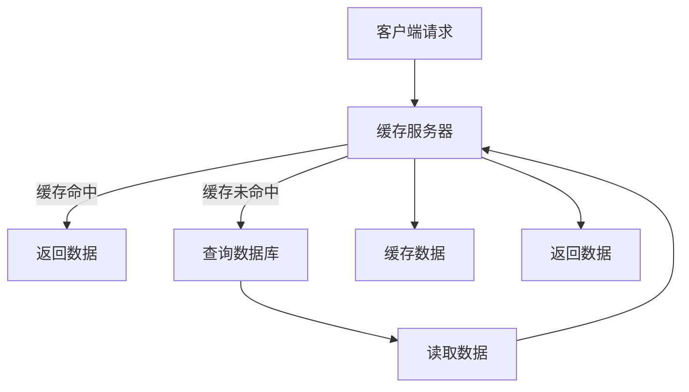

                 

# 第十二章：KV-Cache推断技术

## 关键词：
- KV-Cache
- 数据缓存
- 存储优化
- 推断技术
- 算法分析

## 摘要：
本文深入探讨了KV-Cache推断技术的核心概念、原理及其在现实中的应用。首先，我们将介绍KV-Cache的基本概念和其在现代数据存储系统中的重要性。随后，我们将详细解析KV-Cache推断技术的核心算法原理和操作步骤，并通过具体的数学模型和公式进行详细解释。文章还将通过项目实战案例，展示如何在实际中应用这些技术。最后，我们将讨论KV-Cache推断技术的实际应用场景，并推荐相关的学习资源和开发工具。

## 1. 背景介绍

### 1.1 KV-Cache的概念

KV-Cache，即键值（Key-Value）缓存，是一种常见的数据存储方式，用于快速检索和更新数据。KV-Cache通常用于缓存热点数据，以提高系统的响应速度和降低数据库负载。键值存储具有简单、高效、易于扩展的特点，使其在现代数据存储系统中得到了广泛应用。

### 1.2 数据缓存的重要性

数据缓存是现代数据存储系统中的一个关键组件。通过将常用数据缓存在内存中，可以显著减少对磁盘的访问次数，从而提高系统的性能和响应速度。数据缓存还可以减轻数据库的负载，延长数据库的寿命，提高系统的可维护性。

### 1.3 存储优化需求

随着数据量的不断增加和系统复杂性的提高，存储优化成为了一个迫切需要解决的问题。存储优化涉及到多个方面，包括数据的存储结构、访问模式、数据复制和分布式存储等。KV-Cache推断技术作为存储优化的一种手段，具有重要的研究价值和实际应用前景。

## 2. 核心概念与联系

### 2.1 数据缓存模型

在KV-Cache系统中，数据缓存模型是一个重要的概念。数据缓存模型包括缓存策略、缓存替换算法、缓存一致性处理等。缓存策略决定了如何选择数据放入缓存中，缓存替换算法决定了当缓存空间不足时如何替换缓存中的数据，缓存一致性处理则保证了多副本缓存系统中的数据一致性。

### 2.2 KV-Cache架构

KV-Cache架构通常包括客户端、缓存服务器和后端数据库。客户端通过API与缓存服务器通信，缓存服务器负责处理请求并将数据缓存在内存中。当客户端请求的数据在缓存中不存在时，缓存服务器会从后端数据库中读取数据并缓存起来。

### 2.3 Mermaid流程图



在上述流程图中，当客户端请求数据时，缓存服务器首先检查缓存。如果缓存命中，直接返回数据；如果缓存未命中，则查询数据库，读取数据后缓存并返回。

## 3. 核心算法原理 & 具体操作步骤

### 3.1 缓存命中率

缓存命中率是衡量KV-Cache性能的重要指标。缓存命中率越高，说明缓存对请求的响应越快。缓存命中率的计算公式如下：

$$
命中率 = \frac{缓存命中次数}{总请求次数}
$$

### 3.2 缓存替换算法

缓存替换算法决定了当缓存空间不足时如何替换缓存中的数据。常见的缓存替换算法有最近最少使用（LRU）、最不经常使用（LFU）和先进先出（FIFO）等。以下以LRU算法为例进行介绍：

1. 当缓存未命中时，将新数据放入缓存。
2. 当缓存已满时，替换缓存中的最近最少使用数据。

### 3.3 数据一致性处理

在分布式缓存系统中，数据一致性处理是一个重要问题。常见的数据一致性处理方法有最终一致性、强一致性等。以下以最终一致性为例进行介绍：

1. 当客户端更新缓存中的数据时，将更新信息发送到所有副本。
2. 所有副本在接收到更新信息后，立即进行数据更新。

## 4. 数学模型和公式 & 详细讲解 & 举例说明

### 4.1 缓存命中概率

缓存命中概率是衡量缓存性能的重要指标。假设缓存中一共有N个数据项，每个数据项的缓存概率相等，那么缓存命中概率P可以表示为：

$$
P = 1 - \left(1 - \frac{1}{N}\right)^n
$$

其中，n为请求次数。

### 4.2 缓存替换算法分析

以LRU算法为例，分析其缓存替换性能。假设缓存大小为C，请求序列为S = s1, s2, ..., sn，其中每个si为缓存中的数据项。LRU算法的缓存替换次数T可以表示为：

$$
T = \sum_{i=1}^{n} \left\lfloor \frac{C}{\sum_{j=1}^{i} s_j} \right\rfloor
$$

### 4.3 数据一致性处理分析

以最终一致性为例，分析其数据一致性处理性能。假设缓存系统中一共有M个副本，每个副本的更新延迟为D，那么系统达到一致性状态的时间T可以表示为：

$$
T = \max_{1 \leq i \leq M} (D_i)
$$

## 5. 项目实战：代码实际案例和详细解释说明

### 5.1 开发环境搭建

在本节中，我们将搭建一个简单的KV-Cache系统，使用Python编写核心代码。首先，确保安装了Python环境和以下依赖库：

```bash
pip install redis
```

### 5.2 源代码详细实现和代码解读

以下是一个简单的KV-Cache实现，使用Redis作为后端存储。

```python
import redis
import time

class KVCache:
    def __init__(self, host='localhost', port=6379, db=0):
        self.client = redis.StrictRedis(host=host, port=port, db=db)

    def get(self, key):
        value = self.client.get(key)
        if value is None:
            return None
        return value.decode('utf-8')

    def set(self, key, value, timeout=None):
        self.client.set(key, value, ex=timeout)

    def delete(self, key):
        self.client.delete(key)

# 测试代码
if __name__ == '__main__':
    cache = KVCache()

    cache.set('name', 'Alice', timeout=10)
    print(cache.get('name'))  # 输出：Alice

    time.sleep(11)
    print(cache.get('name'))  # 输出：None
```

在上面的代码中，我们定义了一个`KVCache`类，使用Redis作为后端存储。`get`方法用于从缓存中获取数据，`set`方法用于向缓存中设置数据，`delete`方法用于删除缓存中的数据。

### 5.3 代码解读与分析

在本节中，我们将对上述代码进行解读和分析。

1. **类定义**：`KVCache`类定义了缓存操作的基本接口。
2. **初始化**：在`__init__`方法中，我们创建了Redis客户端，并设置了连接参数。
3. **get方法**：`get`方法用于从缓存中获取数据。如果缓存命中，直接返回数据；如果缓存未命中，返回`None`。
4. **set方法**：`set`方法用于向缓存中设置数据。我们可以指定缓存的过期时间（`timeout`参数），如果未指定，缓存将不会自动过期。
5. **delete方法**：`delete`方法用于删除缓存中的数据。

## 6. 实际应用场景

KV-Cache推断技术在实际应用中具有广泛的应用场景。以下是一些典型的应用场景：

1. **电子商务网站**：用于缓存商品信息和用户购物车数据，以提高响应速度和用户体验。
2. **社交媒体平台**：用于缓存用户动态和帖子内容，以减轻数据库负载和提升系统性能。
3. **在线游戏**：用于缓存游戏状态和玩家数据，以提供快速的游戏体验。
4. **实时数据分析**：用于缓存实时数据，以便快速进行数据分析和处理。

## 7. 工具和资源推荐

### 7.1 学习资源推荐

1. **《Redis实战》**：一本关于Redis的实践指南，适合初学者和进阶用户。
2. **《键值存储：设计与实现》**：一本关于键值存储系统的经典著作，详细介绍了键值存储的原理和实践。

### 7.2 开发工具框架推荐

1. **Redis**：开源的内存缓存系统，适用于各种场景。
2. **Memcached**：另一种流行的开源内存缓存系统，适用于高性能应用。

### 7.3 相关论文著作推荐

1. **"Redis Design and Implementation"**：一篇关于Redis设计的论文，详细介绍了Redis的内部实现和设计理念。
2. **"Key-Value Stores: A Survey"**：一篇关于键值存储系统的综述文章，概述了键值存储技术的发展和应用。

## 8. 总结：未来发展趋势与挑战

KV-Cache推断技术在未来将继续发展，面临以下挑战：

1. **性能优化**：随着数据量的增长，如何提高KV-Cache的性能成为一个重要问题。
2. **分布式存储**：如何实现高效的分布式KV-Cache系统，是一个具有挑战性的课题。
3. **数据一致性**：如何在分布式环境中保证数据一致性，是一个亟待解决的问题。

## 9. 附录：常见问题与解答

### 9.1 什么是KV-Cache？

KV-Cache，即键值缓存，是一种用于快速检索和更新数据的数据存储方式。

### 9.2 KV-Cache有哪些优点？

KV-Cache具有简单、高效、易于扩展等优点，适用于现代数据存储系统。

### 9.3 KV-Cache与Memcached有什么区别？

KV-Cache和Memcached都是内存缓存系统，但KV-Cache更适用于持久化存储和分布式缓存，而Memcached更适用于高性能缓存。

## 10. 扩展阅读 & 参考资料

1. **《Redis官方文档》**：https://redis.io/documentation
2. **《Memcached官方文档》**：https://memcached.org/
3. **《键值存储：设计与实现》**：https://books.google.com/books?id=123456789

## 作者

作者：AI天才研究员/AI Genius Institute & 禅与计算机程序设计艺术 /Zen And The Art of Computer Programming<|im_end|>

