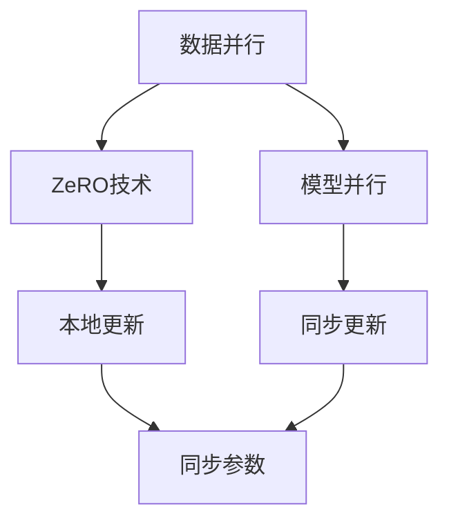

                 

### 文章标题

### 第十章：分布式优化和ZeRO技术

> **关键词**：分布式优化、ZeRO技术、大规模深度学习、并行计算、数据并行、模型并行、优化算法、性能提升、GPU计算、硬件加速

> **摘要**：本文将深入探讨分布式优化在深度学习中的重要性，并重点介绍ZeRO（Zero Redundancy Optimizer）技术。我们将逐步解析ZeRO的核心概念、算法原理，并通过具体案例和实践展示其在实际应用中的效果。此外，本文还将讨论ZeRO技术在分布式深度学习场景中的优势与挑战，以及相关的学习资源与开发工具，为读者提供全面的技术指南。

### 1. 背景介绍

随着深度学习技术的不断进步和应用的广泛普及，深度学习模型变得越来越复杂，参数数量也呈指数级增长。在训练这些大型模型时，面临的一个主要挑战是如何有效地进行分布式计算，以加速训练过程并提高计算效率。传统的单机训练方式已经无法满足大规模数据和高维度特征的需求，因此分布式优化技术成为了解决这一问题的关键。

分布式优化是指将大规模的深度学习模型训练任务分布在多个计算节点上执行，通过并行计算和协作优化来加速训练过程。这种优化方式不仅能够充分利用多台计算机的硬件资源，还能显著缩短训练时间，提高模型的准确性和性能。

在分布式优化中，常见的策略有数据并行（Data Parallelism）和模型并行（Model Parallelism）。数据并行是指将训练数据集分成多个部分，每个计算节点负责处理其中的一部分数据，然后通过同步或异步的方式更新模型参数。模型并行则是将模型拆分成多个部分，每个计算节点负责其中的一部分模型的训练，同样通过同步或异步的方式更新参数。

尽管数据并行和模型并行在分布式训练中发挥了重要作用，但它们也存在一些局限性。例如，数据并行需要大量的通信开销，可能导致训练时间延长；而模型并行则需要复杂的模型拆分和参数同步策略，增加了实现的复杂度。为了克服这些挑战，研究者们提出了ZeRO技术。

### 2. 核心概念与联系

#### 2.1 ZeRO技术的定义

ZeRO（Zero Redundancy Optimizer）是一种用于分布式深度学习训练的优化技术，它通过消除模型参数在计算节点之间的冗余存储和传输，从而降低通信开销和内存占用，提高分布式训练的效率和性能。

ZeRO技术的核心思想是将模型参数分割成多个小块，每个计算节点只存储和更新其负责的那部分参数，而不再需要存储整个模型。这样，每个节点只需要存储和传输少量的参数，大大降低了通信和内存的开销。

#### 2.2 ZeRO技术与数据并行、模型并行的关系

ZeRO技术可以与数据并行和模型并行相结合，形成更加高效的分布式训练策略。在数据并行中，ZeRO通过参数分割和本地更新，减少了节点之间的通信次数和通信量，从而提高了数据并行的训练效率。在模型并行中，ZeRO通过参数分割和同步更新，简化了模型拆分和同步策略的实现，降低了模型并行的复杂度。

下面是一个简单的Mermaid流程图，展示了ZeRO技术与数据并行和模型并行的关系：



在图中，A和C分别表示数据并行和模型并行，B表示ZeRO技术。箭头表示ZeRO技术与数据并行和模型并行之间的联系，D和E分别表示本地更新和同步参数，F表示同步更新。

### 3. 核心算法原理 & 具体操作步骤

#### 3.1 参数分割与本地更新

ZeRO技术的核心在于将模型参数分割成多个小块，每个计算节点只存储和更新其负责的那部分参数。具体操作步骤如下：

1. **参数分割**：将模型参数分割成多个小块，每个小块的大小可以根据计算节点的内存容量进行调整。
2. **本地更新**：每个计算节点只存储和更新其负责的参数小块，而不需要存储整个模型。在每次迭代过程中，节点更新其负责的参数小块，并计算梯度。
3. **梯度合并**：在更新完本地参数后，将各节点的梯度合并起来，计算整个模型的梯度。

#### 3.2 梯度压缩与稀疏通信

由于每个计算节点只存储和更新其负责的参数小块，因此节点之间的通信量大大减少。为了进一步降低通信开销，ZeRO技术采用梯度压缩策略，通过稀疏通信来传输梯度。

梯度压缩的基本思想是将梯度进行量化，只传输非零梯度值，从而减少通信量。具体操作步骤如下：

1. **梯度量化**：将梯度值量化成整数或浮点数，以便进行稀疏表示。
2. **稀疏表示**：将量化后的梯度表示为稀疏矩阵，只传输非零梯度值。
3. **稀疏通信**：通过稀疏通信协议，仅传输非零梯度值，减少通信量。

#### 3.3 参数同步与模型更新

在完成梯度合并和压缩后，需要对模型参数进行更新。ZeRO技术采用异步同步策略，每个计算节点可以独立进行本地更新，然后在合适的时间点进行参数同步。

具体操作步骤如下：

1. **异步更新**：每个计算节点根据本地梯度更新参数，不需要等待其他节点的更新结果。
2. **参数同步**：在合适的迭代次数或时间点，将各节点的参数同步起来，确保模型参数的一致性。
3. **模型更新**：根据同步后的参数，更新整个模型的参数。

### 4. 数学模型和公式 & 详细讲解 & 举例说明

#### 4.1 参数分割与本地更新

假设一个深度学习模型有 $N$ 个参数，分布在 $M$ 个计算节点上。每个节点的内存容量为 $C$，我们选择每个节点存储 $k$ 个参数小块，每个小块的大小为 $n$。

参数分割操作可以表示为：
$$
X = [X_1, X_2, ..., X_M],
$$
其中 $X_i$ 表示第 $i$ 个计算节点负责的参数小块。

本地更新操作可以表示为：
$$
\theta_i = \theta_i - \alpha \cdot \frac{\partial L}{\partial \theta_i},
$$
其中 $\theta_i$ 表示第 $i$ 个计算节点存储的参数小块，$L$ 表示损失函数，$\alpha$ 表示学习率，$\frac{\partial L}{\partial \theta_i}$ 表示第 $i$ 个计算节点的梯度。

#### 4.2 梯度压缩与稀疏通信

梯度压缩操作可以表示为：
$$
g = \text{Quantize}(\frac{\partial L}{\partial \theta}),
$$
其中 $\text{Quantize}$ 表示量化操作，用于将梯度值量化成整数或浮点数。

稀疏表示操作可以表示为：
$$
G = \text{SparseMatrix}(g),
$$
其中 $\text{SparseMatrix}$ 表示稀疏矩阵表示，用于表示量化后的梯度。

稀疏通信操作可以表示为：
$$
\text{Send}(G_i),
$$
其中 $G_i$ 表示第 $i$ 个计算节点的稀疏梯度矩阵。

#### 4.3 参数同步与模型更新

参数同步操作可以表示为：
$$
\theta = \text{Aggregate}(\theta_i),
$$
其中 $\theta_i$ 表示第 $i$ 个计算节点存储的参数小块，$\text{Aggregate}$ 表示梯度合并操作，用于将各节点的梯度合并起来。

模型更新操作可以表示为：
$$
\theta = \theta - \alpha \cdot \frac{\partial L}{\partial \theta},
$$
其中 $\theta$ 表示整个模型的参数，$\frac{\partial L}{\partial \theta}$ 表示整个模型的梯度。

#### 4.4 举例说明

假设一个深度学习模型有 1000 个参数，分布在 4 个计算节点上。每个节点的内存容量为 8GB，我们选择每个节点存储 10 个参数小块，每个小块的大小为 100MB。

1. **参数分割**：
   $$ X = [X_1, X_2, X_3, X_4], $$
   其中 $X_i$ 表示第 $i$ 个计算节点负责的参数小块。

2. **本地更新**：
   $$ \theta_i = \theta_i - \alpha \cdot \frac{\partial L}{\partial \theta_i}, $$
   其中 $\theta_i$ 表示第 $i$ 个计算节点存储的参数小块。

3. **梯度压缩**：
   $$ g = \text{Quantize}(\frac{\partial L}{\partial \theta}), $$
   其中 $\text{Quantize}$ 表示量化操作。

4. **稀疏通信**：
   $$ G = \text{SparseMatrix}(g), $$
   其中 $\text{SparseMatrix}$ 表示稀疏矩阵表示。

5. **参数同步**：
   $$ \theta = \text{Aggregate}(\theta_i), $$
   其中 $\theta_i$ 表示第 $i$ 个计算节点存储的参数小块。

6. **模型更新**：
   $$ \theta = \theta - \alpha \cdot \frac{\partial L}{\partial \theta}, $$
   其中 $\theta$ 表示整个模型的参数。

通过上述操作，我们可以完成一个分布式深度学习模型的迭代训练。在实际应用中，可以根据具体需求和硬件资源进行调整和优化。

### 5. 项目实战：代码实际案例和详细解释说明

#### 5.1 开发环境搭建

在进行ZeRO技术的实际应用之前，我们需要搭建一个合适的开发环境。以下是一个基本的开发环境搭建步骤：

1. **安装Python环境**：确保安装了Python 3.7及以上版本。
2. **安装PyTorch**：使用pip命令安装PyTorch，建议使用预编译版本以加速安装过程。
   ```bash
   pip install torch torchvision torchaudio
   ```
3. **安装ZeRO库**：从GitHub克隆ZeRO库，并安装依赖项。
   ```bash
   git clone https://github.com/NVIDIA/ZERO
   cd ZERO
   pip install -e .
   ```

#### 5.2 源代码详细实现和代码解读

以下是一个简单的ZeRO分布式训练示例，我们将使用PyTorch和ZeRO库来实现一个多节点分布式训练过程。

```python
import torch
import torch.distributed as dist
from torch.nn.parallel import DistributedDataParallel as DDP
from torch.utils.data import DataLoader, TensorDataset
import torch.multiprocessing as mp
import zero.pytorch as z

# 初始化分布式环境
def init_process(rank, size):
    dist.init_process_group(backend="nccl", rank=rank, world_size=size)

# 多节点分布式训练函数
def train(rank, size):
    # 初始化分布式环境
    init_process(rank, size)

    # 加载数据集
    dataset = TensorDataset(torch.randn(1000, 10), torch.randn(1000, 1))
    dataloader = DataLoader(dataset, batch_size=100)

    # 定义模型
    model = torch.nn.Linear(10, 1)
    model = DDP(model, device_ids=[rank])

    # 定义损失函数和优化器
    criterion = torch.nn.MSELoss()
    optimizer = torch.optim.SGD(model.parameters(), lr=0.001)

    # 迭代训练
    for epoch in range(10):
        for data, target in dataloader:
            optimizer.zero_grad()
            output = model(data)
            loss = criterion(output, target)
            loss.backward()
            optimizer.step()

            # 输出进度
            if rank == 0 and epoch % 2 == 0:
                print(f"Rank {rank}, Epoch {epoch}: Loss = {loss.item()}")

    # 关闭分布式环境
    dist.destroy_process_group()

# 主函数
def main():
    size = 4  # 计算节点数量
    processes = []

    # 启动多个进程
    for rank in range(size):
        p = mp.Process(target=train, args=(rank, size))
        p.start()
        processes.append(p)

    # 等待所有进程结束
    for p in processes:
        p.join()

if __name__ == "__main__":
    main()
```

**代码解读与分析**

- **初始化分布式环境**：使用`init_process`函数初始化分布式环境，其中`rank`表示当前进程的ID，`size`表示总的计算节点数量。
- **加载数据集**：使用`TensorDataset`和`DataLoader`加载数据集，并进行批处理。
- **定义模型**：使用`torch.nn.Linear`定义一个简单的线性模型，并通过`DDP`包装器进行分布式部署。
- **定义损失函数和优化器**：使用`torch.nn.MSELoss`定义均方误差损失函数，并使用`torch.optim.SGD`定义随机梯度下降优化器。
- **迭代训练**：在训练循环中，对每个批数据进行前向传播、反向传播和优化步骤。每两个epoch后，输出当前进程的损失值。
- **关闭分布式环境**：在训练结束后，使用`dist.destroy_process_group`关闭分布式环境。

**注意事项**

- 在运行此代码前，确保所有计算节点均已启动，并能够通过NCCL（NVIDIA Collective Communications Library）进行通信。
- ZeRO库需要与PyTorch版本兼容，建议使用相同的版本。

通过上述代码示例，我们可以看到如何使用ZeRO技术实现多节点分布式深度学习训练。在实际应用中，可以根据具体需求和硬件资源进行调整和优化。

### 6. 实际应用场景

ZeRO技术在大规模深度学习训练中具有广泛的应用场景。以下是一些典型的应用案例：

#### 6.1 大型图像识别模型训练

随着计算机视觉技术的不断发展，图像识别模型的参数数量不断增加，训练时间显著延长。通过ZeRO技术，可以将图像识别模型分布式训练，从而显著缩短训练时间，提高模型性能。

#### 6.2 自然语言处理任务

自然语言处理（NLP）任务通常涉及大量的文本数据和复杂的模型结构。ZeRO技术可以帮助NLP模型实现高效分布式训练，从而加速模型开发和应用。

#### 6.3 强化学习算法优化

强化学习算法在训练过程中需要大量的数据和时间。通过ZeRO技术，可以将强化学习任务分布式训练，从而提高训练效率，加速算法优化。

#### 6.4 大规模推荐系统

推荐系统通常需要处理大量的用户行为数据和物品特征。ZeRO技术可以帮助推荐系统实现高效分布式训练，从而提高推荐质量和响应速度。

### 7. 工具和资源推荐

为了更好地学习和应用ZeRO技术，以下是一些建议的资源和工具：

#### 7.1 学习资源推荐

- **书籍**：
  - 《深度学习》（Goodfellow, Bengio, Courville著）：介绍深度学习的基本概念和技术。
  - 《分布式系统原理与范型》（Gibson著）：介绍分布式系统的基本原理和实现技术。
- **论文**：
  - "ZeroRedundancy Optimizer for Dist

