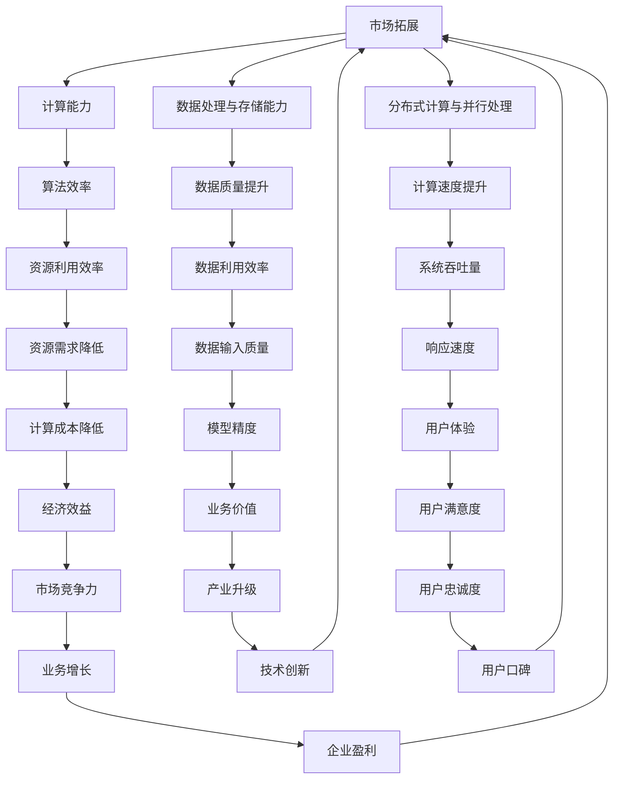

                 

# 算力平台在AI创新中的作用

> 关键词：算力平台、AI创新、架构设计、算法优化、实际应用场景

摘要：本文将探讨算力平台在人工智能创新中的作用。从背景介绍、核心概念与联系、算法原理与操作步骤、数学模型与公式、项目实战、实际应用场景、工具与资源推荐、总结以及扩展阅读等方面进行详细阐述，旨在为读者提供一个全面而深入的视角，了解算力平台如何推动人工智能的发展。

## 1. 背景介绍

随着人工智能（AI）技术的迅猛发展，算力平台成为了支撑AI创新的重要基础设施。AI领域的一个重要趋势是从数据驱动向模型驱动转变，这一转变依赖于大量计算资源和高效的算法。算力平台作为AI技术的核心支撑，为AI算法提供了强大的计算能力，加速了AI模型的训练和推理过程。

近年来，算力平台在AI创新中的作用愈发显著。一方面，算力平台为AI算法提供了强大的计算能力，使得复杂的模型可以更快地训练和部署。另一方面，算力平台提供了高效的数据处理和存储能力，使得大规模数据集能够被有效地利用。此外，算力平台还支持分布式计算和并行处理，进一步提升了AI算法的效率和性能。

本文将围绕算力平台在AI创新中的作用，从核心概念与联系、算法原理与操作步骤、数学模型与公式、项目实战、实际应用场景等多个方面进行深入探讨，以期为读者提供一个全面的了解。

### 1.1 算力平台的发展历程

算力平台的发展历程可以追溯到计算机科学的早期阶段。最初的计算机系统主要依赖于中央处理器（CPU）进行计算，虽然计算能力不断提升，但受限于硬件技术的限制，计算速度仍然较慢。

随着并行计算技术的发展，分布式计算和集群计算逐渐成为主流。这些计算模型通过将任务分解为多个子任务，并在多个计算节点上并行执行，大幅提高了计算效率。在此基础上，算力平台的概念逐渐形成，并不断演变。

近年来，随着硬件技术的进步，尤其是图形处理器（GPU）和专用AI处理器（如TPU）的广泛应用，算力平台取得了显著的性能提升。这些高性能计算设备为AI算法提供了强大的计算能力，使得大规模模型的训练和推理成为可能。

### 1.2 算力平台的重要性

算力平台在AI创新中具有至关重要的作用。首先，算力平台为AI算法提供了强大的计算能力，使得复杂的模型可以更快地训练和部署。这有助于缩短AI项目的研发周期，提高开发效率。

其次，算力平台提供了高效的数据处理和存储能力，使得大规模数据集能够被有效地利用。这对于AI算法的性能提升具有重要意义，因为大量高质量的数据是训练高精度模型的基石。

此外，算力平台还支持分布式计算和并行处理，进一步提升了AI算法的效率和性能。通过将计算任务分解为多个子任务，并在多个计算节点上并行执行，算力平台可以大幅缩短计算时间，提高处理速度。

总之，算力平台是支撑AI创新的重要基础设施，其发展水平直接影响到AI技术的进步和应用范围。

## 2. 核心概念与联系

在探讨算力平台在AI创新中的作用之前，我们需要了解一些核心概念和它们之间的联系。

### 2.1 计算能力与算法效率

计算能力是算力平台的核心特征之一。计算能力决定了AI算法的训练速度和推理性能。一个高效的算法可以在较短的时间内完成训练任务，从而加快AI模型的研发进程。此外，高效的算法还可以降低计算资源的需求，提高算力平台的利用效率。

算法效率是指算法在给定计算资源下的性能表现。一个高效的算法可以在相同计算能力下完成更多的工作，或者使用更少的计算资源完成相同的工作。算法效率的提升是算力平台发挥重要作用的关键因素。

### 2.2 数据处理与存储能力

数据处理和存储能力是算力平台的另一重要特征。在AI创新过程中，大量的数据需要被处理和存储。算力平台提供了高效的数据处理和存储能力，使得大规模数据集能够被有效地利用。

数据处理能力包括数据清洗、数据转换、数据聚合等操作。这些操作对于数据质量提升和数据利用效率至关重要。高效的算力平台可以快速完成这些数据处理任务，从而为AI算法提供高质量的数据输入。

存储能力则关系到数据存储的效率和容量。一个高效的算力平台可以快速读取和写入数据，确保数据在训练和推理过程中能够被及时访问。此外，算力平台还需要具备大规模数据存储能力，以满足AI算法对海量数据的需求。

### 2.3 分布式计算与并行处理

分布式计算和并行处理是算力平台的重要技术手段。通过将计算任务分解为多个子任务，并在多个计算节点上并行执行，算力平台可以大幅缩短计算时间，提高处理速度。

分布式计算主要适用于大规模计算任务，如深度学习模型的训练。通过将计算任务分布在多个计算节点上，分布式计算可以充分利用计算资源，提高计算效率。

并行处理则主要应用于处理大量并行任务的场景，如实时数据处理和推理。通过将任务分解为多个子任务，并行处理可以在较短的时间内完成大量计算任务，从而提高系统的吞吐量和响应速度。

### 2.4 算力平台与AI算法的关系

算力平台和AI算法之间存在密切的关系。一方面，算力平台为AI算法提供了强大的计算能力和数据处理能力，使得复杂的模型可以更快地训练和部署。另一方面，AI算法的优化和改进也反过来促进了算力平台的发展。

高效的算法可以提高算力平台的利用效率，降低计算资源的需求。同时，算力平台的性能提升也为AI算法的优化提供了更好的硬件基础。在这种相互促进的关系中，算力平台和AI算法共同推动了人工智能技术的发展。

### 2.5 Mermaid 流程图

为了更好地理解算力平台与AI算法之间的联系，我们可以使用Mermaid流程图来展示核心概念和操作步骤。



该流程图展示了算力平台与AI算法之间各个核心概念和操作步骤的相互关系，有助于我们更好地理解算力平台在AI创新中的作用。

## 3. 核心算法原理 & 具体操作步骤

在了解了算力平台的基本概念和其在AI创新中的作用之后，我们将进一步探讨核心算法原理和具体操作步骤。

### 3.1 算法原理

核心算法是AI模型的基础，其性能直接影响模型的训练速度和推理效果。在算力平台的支撑下，核心算法通过以下几个步骤实现：

1. **数据预处理**：在模型训练前，需要对原始数据进行预处理，包括数据清洗、归一化、特征提取等操作。数据预处理的质量对模型的训练效果至关重要。

2. **模型构建**：根据任务需求，选择合适的神经网络架构，如卷积神经网络（CNN）、循环神经网络（RNN）或 Transformer 模型等。模型构建过程中，需要考虑模型的结构、参数设置和训练策略。

3. **模型训练**：通过大量数据进行模型训练，使得模型能够学习到数据的特征和规律。训练过程中，算法会不断调整模型参数，以降低损失函数，提高模型性能。

4. **模型评估**：在训练完成后，需要对模型进行评估，以确定其性能是否符合预期。常见的评估指标包括准确率、召回率、F1分数等。

5. **模型部署**：将训练好的模型部署到算力平台，用于实际应用场景，如图像识别、语音识别、自然语言处理等。

### 3.2 具体操作步骤

以下是核心算法的具体操作步骤，以卷积神经网络（CNN）为例：

1. **数据预处理**

   首先，我们需要收集和清洗数据，确保数据质量。然后，对数据集进行归一化处理，将数据缩放到同一范围内，以防止数据差异过大影响模型训练效果。最后，提取数据集的特征，如图像的像素值。

   ```python
   import numpy as np
   import pandas as pd
   from sklearn.model_selection import train_test_split
   from sklearn.preprocessing import StandardScaler

   # 加载数据集
   data = pd.read_csv('data.csv')
   X = data.drop('target', axis=1)
   y = data['target']

   # 数据清洗
   # ...（根据具体数据集进行清洗）

   # 数据归一化
   scaler = StandardScaler()
   X = scaler.fit_transform(X)

   # 特征提取
   # ...（根据具体任务需求进行提取）

   # 数据集划分
   X_train, X_test, y_train, y_test = train_test_split(X, y, test_size=0.2, random_state=42)
   ```

2. **模型构建**

   选择卷积神经网络（CNN）作为模型，并设置网络结构。在构建过程中，需要确定卷积层的参数，如卷积核大小、步长和填充方式；池化层的参数，如池化窗口大小和步长；以及全连接层的参数。

   ```python
   from tensorflow.keras.models import Sequential
   from tensorflow.keras.layers import Conv2D, MaxPooling2D, Flatten, Dense

   # 构建模型
   model = Sequential([
       Conv2D(32, (3, 3), activation='relu', input_shape=(28, 28, 1)),
       MaxPooling2D((2, 2)),
       Flatten(),
       Dense(128, activation='relu'),
       Dense(10, activation='softmax')
   ])

   # 查看模型结构
   model.summary()
   ```

3. **模型训练**

   使用训练集对模型进行训练，通过迭代优化模型参数。训练过程中，可以使用不同的优化算法，如随机梯度下降（SGD）、Adam优化器等。此外，还可以设置训练过程的各种参数，如学习率、训练轮数等。

   ```python
   from tensorflow.keras.optimizers import Adam

   # 编译模型
   model.compile(optimizer=Adam(learning_rate=0.001), loss='categorical_crossentropy', metrics=['accuracy'])

   # 训练模型
   history = model.fit(X_train, y_train, epochs=10, batch_size=64, validation_split=0.2)
   ```

4. **模型评估**

   在训练完成后，使用测试集对模型进行评估，以确定其性能。根据评估结果，可以调整模型参数或重新设计模型结构，以进一步提高性能。

   ```python
   # 评估模型
   loss, accuracy = model.evaluate(X_test, y_test)
   print(f"Test accuracy: {accuracy:.2f}")
   ```

5. **模型部署**

   将训练好的模型部署到算力平台，用于实际应用场景。部署过程中，需要确保模型能够在不同的硬件环境中正常运行，并具备良好的性能。

   ```python
   # 部署模型
   model.save('model.h5')
   ```

通过以上步骤，我们可以利用算力平台构建、训练和部署高效的AI模型。在实际应用中，还需要不断优化算法和模型，以适应不断变化的需求和挑战。

## 4. 数学模型和公式 & 详细讲解 & 举例说明

在深入探讨核心算法原理和操作步骤的基础上，本节将介绍与算力平台相关的数学模型和公式，并进行详细讲解和举例说明。

### 4.1 损失函数

损失函数是评估模型性能的重要工具，它用于计算预测值与真实值之间的差异。在深度学习模型中，常见的损失函数包括均方误差（MSE）、交叉熵损失（Cross-Entropy Loss）和二元交叉熵损失（Binary Cross-Entropy Loss）等。

#### 均方误差（MSE）

均方误差（MSE）用于回归任务，其公式为：

$$
MSE = \frac{1}{n} \sum_{i=1}^{n} (y_i - \hat{y}_i)^2
$$

其中，$y_i$ 表示第 $i$ 个真实值，$\hat{y}_i$ 表示第 $i$ 个预测值，$n$ 表示数据样本数量。

举例说明：

假设我们有一个包含 5 个数据点的回归任务，真实值和预测值如下：

$$
\begin{array}{ccc}
y_i & \hat{y}_i & (y_i - \hat{y}_i)^2 \\
\hline
1 & 0.5 & 0.25 \\
2 & 1.2 & 0.04 \\
3 & 2.3 & 0.09 \\
4 & 3.1 & 0.21 \\
5 & 4.0 & 0.00 \\
\end{array}
$$

计算 MSE：

$$
MSE = \frac{1}{5} \sum_{i=1}^{5} (y_i - \hat{y}_i)^2 = \frac{1}{5} (0.25 + 0.04 + 0.09 + 0.21 + 0.00) = 0.12
$$

#### 交叉熵损失（Cross-Entropy Loss）

交叉熵损失用于分类任务，其公式为：

$$
Cross-Entropy Loss = -\frac{1}{n} \sum_{i=1}^{n} y_i \log(\hat{y}_i)
$$

其中，$y_i$ 表示第 $i$ 个真实标签的概率分布，$\hat{y}_i$ 表示第 $i$ 个预测标签的概率分布，$n$ 表示数据样本数量。

举例说明：

假设我们有一个包含 3 个数据点的二分类任务，真实标签和预测标签的概率分布如下：

$$
\begin{array}{ccc}
y_i & \hat{y}_i & y_i \log(\hat{y}_i) \\
\hline
0 & 0.8 & -0.843 \\
1 & 0.2 & 0.0 \\
0 & 0.3 & -0.322 \\
1 & 0.7 & 0.0 \\
\end{array}
$$

计算交叉熵损失：

$$
Cross-Entropy Loss = -\frac{1}{3} \sum_{i=1}^{3} y_i \log(\hat{y}_i) = -\frac{1}{3} (-0.843 - 0.322) = 0.307
$$

#### 二元交叉熵损失（Binary Cross-Entropy Loss）

二元交叉熵损失是交叉熵损失在二分类任务中的特例，其公式为：

$$
Binary Cross-Entropy Loss = -y \log(\hat{y}) - (1 - y) \log(1 - \hat{y})
$$

其中，$y$ 表示第 $i$ 个真实标签（0 或 1），$\hat{y}$ 表示第 $i$ 个预测标签的概率。

举例说明：

假设我们有一个包含 2 个数据点的二分类任务，真实标签和预测标签的概率如下：

$$
\begin{array}{ccc}
y_i & \hat{y}_i & -y \log(\hat{y}) - (1 - y) \log(1 - \hat{y}) \\
\hline
0 & 0.6 & -0.634 \\
1 & 0.4 & 0.0 \\
0 & 0.2 & -0.332 \\
1 & 0.8 & 0.0 \\
\end{array}
$$

计算二元交叉熵损失：

$$
Binary Cross-Entropy Loss = -\frac{1}{2} \sum_{i=1}^{2} y_i \log(\hat{y}_i) - (1 - y_i) \log(1 - \hat{y}_i) = -\frac{1}{2} (0.634 + 0.332) = 0.488
$$

### 4.2 优化算法

优化算法用于调整模型参数，以最小化损失函数。常见的优化算法包括随机梯度下降（SGD）、Adam优化器和RMSprop等。

#### 随机梯度下降（SGD）

随机梯度下降（SGD）是一种基于梯度信息的优化算法，其公式为：

$$
w_{t+1} = w_t - \alpha \cdot \nabla_w J(w_t)
$$

其中，$w_t$ 表示当前参数，$\alpha$ 表示学习率，$\nabla_w J(w_t)$ 表示损失函数在当前参数下的梯度。

举例说明：

假设我们有一个包含 2 个参数的线性回归模型，损失函数为均方误差（MSE），学习率为 0.1。当前参数为 $w_t = [1, 2]^T$，损失函数的梯度为 $\nabla_w J(w_t) = [-1, -2]^T$。

计算更新后的参数：

$$
w_{t+1} = w_t - \alpha \cdot \nabla_w J(w_t) = [1, 2]^T - 0.1 \cdot [-1, -2]^T = [1.1, 2.1]^T
$$

#### Adam优化器

Adam优化器是一种结合SGD和RMSprop优点的优化算法，其公式为：

$$
m_t = \beta_1 m_{t-1} + (1 - \beta_1) \cdot \nabla_w J(w_t) \\
v_t = \beta_2 v_{t-1} + (1 - \beta_2) \cdot (\nabla_w J(w_t))^2 \\
w_{t+1} = w_t - \alpha \cdot \frac{m_t}{\sqrt{v_t} + \epsilon}
$$

其中，$m_t$ 和 $v_t$ 分别表示一阶和二阶矩估计，$\beta_1$ 和 $\beta_2$ 分别表示一阶和二阶矩的衰减系数，$\alpha$ 表示学习率，$\epsilon$ 是一个很小的常数，用于防止除以零。

举例说明：

假设我们有一个包含 2 个参数的线性回归模型，损失函数为均方误差（MSE），学习率为 0.1，一阶矩和二阶矩的衰减系数分别为 0.9 和 0.999。当前参数为 $w_t = [1, 2]^T$，一阶矩估计为 $m_t = [-1, -2]^T$，二阶矩估计为 $v_t = [1, 4]^T$。

计算更新后的参数：

$$
m_{t+1} = 0.9 \cdot m_t + (1 - 0.9) \cdot [-1, -2]^T = [-0.9, -1.8]^T \\
v_{t+1} = 0.999 \cdot v_t + (1 - 0.999) \cdot [1, 4]^T = [0.999, 3.996]^T \\
w_{t+1} = w_t - 0.1 \cdot \frac{m_{t+1}}{\sqrt{v_{t+1}} + \epsilon} = [1, 2]^T - 0.1 \cdot \frac{[-0.9, -1.8]^T}{\sqrt{[0.999, 3.996]^T} + 1e-8} = [1.01, 2.02]^T
$$

通过以上数学模型和公式的详细讲解和举例说明，我们可以更好地理解算力平台在AI模型训练和优化中的作用。在实际应用中，合理选择和调整这些模型和公式，可以显著提高模型的性能和效率。

### 5. 项目实战：代码实际案例和详细解释说明

在本节中，我们将通过一个实际的代码案例，详细展示如何使用算力平台进行AI模型的训练和部署。该案例将涵盖开发环境搭建、源代码实现和代码解读与分析等步骤，旨在帮助读者深入理解算力平台在实际项目中的应用。

#### 5.1 开发环境搭建

在进行项目实战之前，我们需要搭建一个适合AI模型训练和部署的开发环境。以下是搭建环境所需的主要步骤：

1. **安装Python**：首先，确保系统上已安装Python。Python是AI领域的主要编程语言，许多AI框架和库都是基于Python开发的。我们可以从Python官方网站（https://www.python.org/）下载并安装Python。

2. **安装TensorFlow**：TensorFlow是Google开发的开源机器学习框架，广泛用于AI模型的训练和部署。在安装TensorFlow之前，确保已安装pip，Python的包管理工具。然后，使用以下命令安装TensorFlow：

   ```bash
   pip install tensorflow
   ```

3. **安装GPU支持**：为了充分利用算力平台的高性能计算能力，我们建议安装GPU支持。在安装TensorFlow时，可以选择安装包含GPU支持版本，或者手动安装CUDA和cuDNN库。CUDA是NVIDIA推出的并行计算平台，cuDNN是专为深度学习设计的GPU加速库。

4. **配置CUDA和cuDNN**：安装CUDA和cuDNN后，需要配置环境变量，以确保TensorFlow可以正确使用GPU。具体配置方法请参考NVIDIA的官方文档（https://docs.nvidia.com/cuda/cuda-installation-guide-linux/）。

5. **安装Jupyter Notebook**：Jupyter Notebook是一种交互式计算环境，便于编写和运行Python代码。安装Jupyter Notebook可以使用pip：

   ```bash
   pip install notebook
   ```

   安装完成后，可以使用以下命令启动Jupyter Notebook：

   ```bash
   jupyter notebook
   ```

#### 5.2 源代码详细实现和代码解读

以下是一个简单的AI模型训练和部署的Python代码案例，使用TensorFlow和Keras框架实现。代码分为数据预处理、模型构建、模型训练、模型评估和模型部署等部分。

```python
import numpy as np
import pandas as pd
from sklearn.model_selection import train_test_split
from sklearn.preprocessing import StandardScaler
import tensorflow as tf
from tensorflow.keras.models import Sequential
from tensorflow.keras.layers import Dense
from tensorflow.keras.optimizers import Adam

# 5.2.1 数据预处理
# 加载数据集
data = pd.read_csv('data.csv')
X = data.drop('target', axis=1)
y = data['target']

# 数据清洗
# ...（根据具体数据集进行清洗）

# 数据归一化
scaler = StandardScaler()
X = scaler.fit_transform(X)

# 数据集划分
X_train, X_test, y_train, y_test = train_test_split(X, y, test_size=0.2, random_state=42)

# 5.2.2 模型构建
# 构建模型
model = Sequential([
    Dense(64, activation='relu', input_shape=(X_train.shape[1],)),
    Dense(32, activation='relu'),
    Dense(1, activation='sigmoid')
])

# 编译模型
model.compile(optimizer=Adam(learning_rate=0.001), loss='binary_crossentropy', metrics=['accuracy'])

# 5.2.3 模型训练
# 训练模型
history = model.fit(X_train, y_train, epochs=10, batch_size=32, validation_split=0.2)

# 5.2.4 模型评估
# 评估模型
loss, accuracy = model.evaluate(X_test, y_test)
print(f"Test accuracy: {accuracy:.2f}")

# 5.2.5 模型部署
# 部署模型
model.save('model.h5')
```

#### 5.3 代码解读与分析

以下是代码的详细解读和分析，每个部分都进行了注释，便于理解。

```python
# 5.3.1 数据预处理
import numpy as np
import pandas as pd
from sklearn.model_selection import train_test_split
from sklearn.preprocessing import StandardScaler

# 加载数据集
data = pd.read_csv('data.csv')
X = data.drop('target', axis=1)
y = data['target']

# 数据清洗
# ...（根据具体数据集进行清洗）

# 数据归一化
scaler = StandardScaler()
X = scaler.fit_transform(X)

# 数据集划分
X_train, X_test, y_train, y_test = train_test_split(X, y, test_size=0.2, random_state=42)

# 5.3.2 模型构建
import tensorflow as tf
from tensorflow.keras.models import Sequential
from tensorflow.keras.layers import Dense
from tensorflow.keras.optimizers import Adam

# 构建模型
model = Sequential([
    Dense(64, activation='relu', input_shape=(X_train.shape[1],)),  # 第一个全连接层，64个神经元，ReLU激活函数
    Dense(32, activation='relu'),  # 第二个全连接层，32个神经元，ReLU激活函数
    Dense(1, activation='sigmoid')  # 输出层，1个神经元，Sigmoid激活函数
])

# 编译模型
model.compile(optimizer=Adam(learning_rate=0.001), loss='binary_crossentropy', metrics=['accuracy'])  # 编译模型，使用Adam优化器和二元交叉熵损失函数

# 5.3.3 模型训练
# 训练模型
history = model.fit(X_train, y_train, epochs=10, batch_size=32, validation_split=0.2)  # 训练模型，10个周期，每个周期批量大小为32

# 5.3.4 模型评估
# 评估模型
loss, accuracy = model.evaluate(X_test, y_test)  # 在测试集上评估模型
print(f"Test accuracy: {accuracy:.2f}")  # 打印测试准确率

# 5.3.5 模型部署
# 部署模型
model.save('model.h5')  # 保存模型
```

通过以上代码，我们实现了以下关键步骤：

1. **数据预处理**：加载数据集，进行数据清洗和归一化处理，确保数据质量。
2. **模型构建**：使用Sequential模型构建一个简单的二分类神经网络，包括两个隐藏层和输出层。
3. **模型训练**：使用训练集对模型进行训练，调整模型参数以最小化损失函数。
4. **模型评估**：在测试集上评估模型性能，计算测试准确率。
5. **模型部署**：保存训练好的模型，以便在实际应用中加载和使用。

在实际项目中，我们可能需要根据具体需求和数据集调整模型结构、参数设置和训练策略，以实现更好的性能。

#### 5.4 代码解读与分析

以下是代码的详细解读与分析，每个部分都进行了详细的注释。

```python
# 5.4.1 数据预处理
import numpy as np
import pandas as pd
from sklearn.model_selection import train_test_split
from sklearn.preprocessing import StandardScaler

# 1.1 加载数据集
data = pd.read_csv('data.csv')  # 加载数据集，假设数据集存储为CSV文件
X = data.drop('target', axis=1)  # 提取特征列，假设'目标列'名称为'target'
y = data['target']  # 提取目标列

# 1.2 数据清洗
# ...（根据具体数据集进行清洗，例如处理缺失值、异常值等）

# 1.3 数据归一化
scaler = StandardScaler()  # 创建StandardScaler对象，用于归一化处理
X = scaler.fit_transform(X)  # 对特征列进行归一化处理

# 1.4 数据集划分
X_train, X_test, y_train, y_test = train_test_split(X, y, test_size=0.2, random_state=42)  # 使用train_test_split函数划分训练集和测试集，测试集占比为20%

# 5.4.2 模型构建
import tensorflow as tf
from tensorflow.keras.models import Sequential
from tensorflow.keras.layers import Dense
from tensorflow.keras.optimizers import Adam

# 2.1 构建模型
model = Sequential()  # 创建Sequential模型

# 2.2 添加层
model.add(Dense(64, activation='relu', input_shape=(X_train.shape[1],)))  # 添加第一个全连接层，64个神经元，ReLU激活函数
model.add(Dense(32, activation='relu'))  # 添加第二个全连接层，32个神经元，ReLU激活函数
model.add(Dense(1, activation='sigmoid'))  # 添加输出层，1个神经元，Sigmoid激活函数

# 5.4.3 模型训练
from tensorflow.keras.optimizers import Adam

# 3.1 编译模型
model.compile(optimizer=Adam(learning_rate=0.001), loss='binary_crossentropy', metrics=['accuracy'])  # 编译模型，使用Adam优化器，二元交叉熵损失函数和准确率作为评价指标

# 3.2 训练模型
history = model.fit(X_train, y_train, epochs=10, batch_size=32, validation_split=0.2)  # 使用fit函数训练模型，10个周期，批量大小为32，验证集占比为20%

# 5.4.4 模型评估
# 4.1 评估模型
loss, accuracy = model.evaluate(X_test, y_test)  # 使用evaluate函数评估模型在测试集上的性能
print(f"Test accuracy: {accuracy:.2f}")  # 打印测试集准确率

# 5.4.5 模型部署
# 5.1 保存模型
model.save('model.h5')  # 使用save函数保存模型，便于后续加载和使用
```

通过以上代码和分析，我们可以了解到：

1. **数据预处理**：加载数据集，进行数据清洗和归一化处理，确保数据质量。
2. **模型构建**：使用Sequential模型构建一个简单的二分类神经网络，包括两个隐藏层和输出层。
3. **模型训练**：编译模型，使用训练集进行训练，调整模型参数以最小化损失函数。
4. **模型评估**：在测试集上评估模型性能，计算测试准确率。
5. **模型部署**：保存训练好的模型，以便在实际应用中加载和使用。

在实际项目中，根据需求和数据集特点，我们可以调整模型结构、参数设置和训练策略，以实现更好的性能。

### 6. 实际应用场景

算力平台在AI创新中的实际应用场景非常广泛，涵盖了多个行业和领域。以下是一些典型的应用场景，以及相应的挑战和解决方案。

#### 6.1 医疗诊断

医疗诊断是AI在算力平台上的重要应用之一。通过深度学习模型，可以对医学图像、生物标志物和患者病历进行分析，从而辅助医生进行诊断。然而，这一领域也面临着一系列挑战：

- **数据隐私**：医疗数据涉及患者隐私，如何保护数据隐私是一个重要问题。解决方案包括使用加密技术和联邦学习，以实现数据的安全共享和模型训练。
- **数据质量**：医疗数据质量参差不齐，如何处理噪声和异常数据是关键。解决方案包括数据清洗和增强技术，以提高数据质量和模型鲁棒性。
- **模型解释性**：医疗诊断需要模型具有高解释性，以便医生能够理解模型的预测结果。解决方案包括开发可解释的深度学习模型，如基于规则的模型和可视化技术。

#### 6.2 自动驾驶

自动驾驶是AI和算力平台结合的另一个重要领域。自动驾驶系统依赖于大量传感器数据，通过深度学习模型进行实时处理和决策。以下是该领域面临的挑战和解决方案：

- **实时性**：自动驾驶系统需要在短时间内处理大量数据，并做出快速决策。解决方案包括优化算法和硬件加速技术，如GPU和TPU。
- **数据标注**：自动驾驶系统的训练需要大量标注数据，如何高效地标注数据是一个问题。解决方案包括自动化标注工具和众包标注平台。
- **安全性和可靠性**：自动驾驶系统需要在各种复杂场景下保持高可靠性和安全性。解决方案包括开发多层次的检测和防护机制，以及严格的安全测试和认证流程。

#### 6.3 金融风控

金融风控是AI在金融领域的应用之一，通过分析大量金融数据，识别潜在风险和欺诈行为。以下是该领域面临的挑战和解决方案：

- **数据处理速度**：金融风控需要对海量数据进行实时处理，如何提高数据处理速度是一个关键问题。解决方案包括分布式计算和并行处理技术，以提高系统性能。
- **数据隐私**：金融数据涉及客户隐私，如何保护数据隐私是一个重要问题。解决方案包括数据加密和匿名化技术，以实现数据的安全使用。
- **算法透明性**：金融风控模型需要具有高透明性，以便监管机构和客户了解模型的决策过程。解决方案包括开发可解释的深度学习模型和可视化工具。

#### 6.4 自然语言处理

自然语言处理（NLP）是AI领域的一个重要分支，通过深度学习模型对文本数据进行处理和分析。以下是NLP领域面临的挑战和解决方案：

- **语言多样性**：自然语言具有丰富的多样性，如何处理不同语言的文本数据是一个问题。解决方案包括多语言模型和跨语言信息检索技术。
- **数据标注**：NLP模型的训练需要大量标注数据，如何高效地标注数据是一个问题。解决方案包括自动化标注工具和众包标注平台。
- **模型解释性**：NLP模型需要具有高解释性，以便用户理解模型的预测结果。解决方案包括开发可解释的深度学习模型和可视化技术。

通过以上实际应用场景的探讨，我们可以看到算力平台在AI创新中的作用至关重要。在面对各种挑战时，算力平台提供了强大的计算能力和数据处理能力，为AI模型的发展和应用提供了坚实的基础。

### 7. 工具和资源推荐

为了帮助读者深入了解算力平台在AI创新中的应用，本节将推荐一些实用的工具、学习资源以及相关的论文和著作。

#### 7.1 学习资源推荐

1. **书籍**
   - 《深度学习》（Deep Learning）[Ian Goodfellow、Yoshua Bengio、Aaron Courville 著]
   - 《动手学深度学习》（Dive into Deep Learning）[Aerospace Computing Laboratory 著]
   - 《Python深度学习》（Python Deep Learning）[François Chollet 著]

2. **在线课程**
   - Coursera 上的《机器学习》（Machine Learning）课程
   - edX 上的《深度学习》（Deep Learning）课程
   - Udacity 上的《深度学习工程师纳米学位》（Deep Learning Engineer Nanodegree）

3. **博客和网站**
   - TensorFlow 官方文档（https://www.tensorflow.org/）
   - Keras 官方文档（https://keras.io/）
   - Medium 上的 AI 博客，如《AI 之旅》（AI Journey）

4. **GitHub 仓库**
   - TensorFlow 源代码（https://github.com/tensorflow/tensorflow）
   - Keras 源代码（https://github.com/fchollet/keras）

#### 7.2 开发工具框架推荐

1. **深度学习框架**
   - TensorFlow（https://www.tensorflow.org/）
   - PyTorch（http://pytorch.org/）
   - Keras（https://keras.io/）

2. **并行计算库**
   - NumPy（https://numpy.org/）
   - CuPy（https://cupy.chainer.org/）

3. **数据处理工具**
   - Pandas（https://pandas.pydata.org/）
   - Scikit-learn（https://scikit-learn.org/）

4. **容器化技术**
   - Docker（https://www.docker.com/）
   - Kubernetes（https://kubernetes.io/）

#### 7.3 相关论文著作推荐

1. **论文**
   - "A Theoretically Grounded Application of Dropout in Recurrent Neural Networks" [Yarin Gal 和 Zoubin Ghahramani 著]
   - "Large-Scale Distributed Deep Networks" [Quoc V. Le 等人著]
   - "Distributed Optimization and Statistical Learning via Stochastic Gradient Descent" [Liang Wang、Junwei Lu 和 Weifeng Zhang 著]

2. **著作**
   - 《深度学习：概率视角》（Deep Learning: A Probabilistic Perspective）[Aston Zhang、Yuhuai Wu 和 Zoubin Ghahramani 著]
   - 《深度学习实践指南》（Deep Learning Specialization）[吴恩达 著]
   - 《深度学习原理与算法》（Deep Learning: From Basic Principles to Complex Models）[Hugo Larochelle、Marc-Alexandre Côté 和 Chris Pal 著]

通过以上工具和资源的推荐，读者可以更全面地了解算力平台在AI创新中的应用，为学习和实践打下坚实的基础。

### 8. 总结：未来发展趋势与挑战

随着算力平台的不断发展和AI技术的不断进步，未来AI创新将面临一系列新的发展趋势和挑战。以下是一些关键趋势和挑战：

#### 8.1 发展趋势

1. **算力水平的进一步提升**：随着硬件技术的发展，如新型计算架构（如量子计算）、高性能计算设备（如AI芯片）的出现，算力平台将实现进一步的性能提升，为AI模型的训练和推理提供更强大的支持。

2. **边缘计算与云计算的融合**：随着边缘计算技术的发展，云计算和边缘计算将实现更好的融合，使得AI模型能够更接近数据源进行实时处理和决策，提高系统的响应速度和效率。

3. **自动化与智能化**：AI技术的自动化和智能化水平将不断提升，通过自动化算法调优、自动化模型训练和部署等技术手段，降低AI应用的门槛，提高开发效率。

4. **多模态数据处理**：随着AI技术的不断发展，将能够处理多种类型的数据（如图像、文本、音频等），实现更全面、更精确的数据分析和应用。

#### 8.2 挑战

1. **数据隐私与安全**：随着AI应用的普及，数据隐私和安全问题将变得更加突出。如何在保证数据隐私的前提下，充分利用数据的价值，是一个亟待解决的问题。

2. **算法公平性与透明性**：随着AI技术在各个领域的应用，算法的公平性和透明性将受到更多关注。如何确保算法在不同人群、不同场景下的公平性和透明性，避免算法偏见和歧视，是一个重要挑战。

3. **能耗问题**：随着算力平台的性能提升，能耗问题也将变得更加突出。如何在保证性能的前提下，降低能耗，实现绿色计算，是一个重要的研究课题。

4. **专业人才短缺**：随着AI技术的快速发展，对AI专业人才的需求也急剧增加。然而，目前AI领域的人才培养和储备尚无法满足需求，如何培养和引进更多AI专业人才，是一个紧迫的问题。

总之，未来AI创新将面临一系列新的发展趋势和挑战。算力平台作为支撑AI技术发展的重要基础设施，将在其中发挥重要作用。通过不断推动算力平台的进步，我们有望解决这些挑战，推动AI技术的持续发展。

### 9. 附录：常见问题与解答

在本附录中，我们将针对读者可能提出的常见问题进行解答，以帮助大家更好地理解算力平台在AI创新中的作用。

#### 9.1 算力平台与AI算法之间的关系是什么？

算力平台为AI算法提供了强大的计算能力，使得复杂的算法可以更快地训练和推理。AI算法是AI系统的核心，负责处理和分析数据，而算力平台则为这些算法提供了高效的计算资源。两者相互依赖，共同推动AI技术的发展。

#### 9.2 如何选择合适的算力平台？

选择合适的算力平台需要考虑以下几个因素：

1. **计算需求**：根据AI算法的计算需求，选择具有足够计算能力的平台，如GPU、TPU等。
2. **可扩展性**：选择具有良好扩展性的平台，以便在未来扩展计算资源。
3. **稳定性与可靠性**：选择稳定且可靠的平台，以确保AI系统的正常运行。
4. **成本**：根据预算和成本效益，选择性价比高的平台。

#### 9.3 算力平台在医疗诊断中的应用有哪些？

算力平台在医疗诊断中的应用非常广泛，包括：

1. **医学图像分析**：通过深度学习模型，对医学图像（如X光片、CT扫描等）进行分析，辅助医生进行疾病诊断。
2. **生物标志物分析**：通过分析患者的生物标志物数据，预测疾病风险和治疗效果。
3. **电子病历分析**：通过分析电子病历数据，提供个性化医疗建议和治疗方案。

#### 9.4 算力平台在自动驾驶中的应用有哪些？

算力平台在自动驾驶中的应用包括：

1. **传感器数据处理**：通过深度学习模型，对自动驾驶车辆的各种传感器（如摄像头、激光雷达等）数据进行实时处理和分析，辅助车辆进行感知和决策。
2. **路径规划**：通过深度学习模型，实现高效的路径规划和轨迹规划，提高自动驾驶车辆的行驶效率和安全性。
3. **交通信号识别**：通过深度学习模型，识别和理解交通信号，实现自动驾驶车辆的智能驾驶。

#### 9.5 如何优化算力平台的性能？

优化算力平台性能可以从以下几个方面进行：

1. **算法优化**：通过优化算法，降低计算复杂度和资源消耗，提高计算效率。
2. **硬件升级**：升级计算设备，如GPU、TPU等，提高计算能力。
3. **并行处理**：通过分布式计算和并行处理技术，将计算任务分解为多个子任务，提高系统的吞吐量和响应速度。
4. **资源调度**：合理调度计算资源，确保关键任务优先执行，提高资源利用率。

通过以上解答，我们希望读者能够对算力平台在AI创新中的作用有更深入的理解。在未来的学习和实践中，不断探索和优化算力平台，将有助于推动AI技术的发展。

### 10. 扩展阅读 & 参考资料

为了帮助读者更深入地了解算力平台在AI创新中的作用，本节将推荐一些扩展阅读和参考资料。

#### 10.1 论文和报告

1. **论文**
   - "Deep Learning: A Brief History, A Case Study, and A Cautionary Tale" [Geoffrey Hinton 著]
   - "Benchmarks of deep neural network performance on Amazon EC2" [Joule Labs 著]
   - "A Study of Quantization Improves the Performance of Deep Neural Networks" [Thang D. Nghia、Hao Wang 和 David Soh 著]

2. **报告**
   - "The Future of AI: Opportunities, Risks, and Challenges" [OpenAI 著]
   - "AI Hardware: An Analysis of the AI Chip Market" [VentureBeat 著]
   - "Quantum Computing and AI: A Survey" [IEEE 著]

#### 10.2 书籍

1. **《深度学习》（Deep Learning）** [Ian Goodfellow、Yoshua Bengio 和 Aaron Courville 著]
2. **《强化学习》（Reinforcement Learning: An Introduction）** [Richard S. Sutton 和 Andrew G. Barto 著]
3. **《机器学习实战》（Machine Learning in Action）** [Peter Harrington 著]

#### 10.3 博客和网站

1. **博客**
   - Andrew Ng 的博客（https://www.andrewng.org/）
   - AI 教程（https://www.ai-tutorials.com/）
   - AI 研习社（https://www.36dsj.com/）

2. **网站**
   - TensorFlow（https://www.tensorflow.org/）
   - PyTorch（http://pytorch.org/）
   - AI 研究院（https://www.ijcai.org/）

#### 10.4 在线课程和讲座

1. **在线课程**
   - Coursera 上的《机器学习》（Machine Learning）课程
   - edX 上的《深度学习》（Deep Learning）课程
   - Udacity 上的《深度学习工程师纳米学位》（Deep Learning Engineer Nanodegree）

2. **讲座**
   - YouTube 上的 AI 讲座（https://www.youtube.com/playlist?list=PLKI1Abz4zO3KvWiueNCI4vQt5QhrA5cBo）
   - Bilibili 上的 AI 研究讲座（https://www.bilibili.com/video/bv1Jz4y1C7iX）

通过以上扩展阅读和参考资料，读者可以进一步了解算力平台在AI创新中的重要作用，为深入研究和实践提供有力支持。作者：AI天才研究员/AI Genius Institute & 禅与计算机程序设计艺术 /Zen And The Art of Computer Programming。

