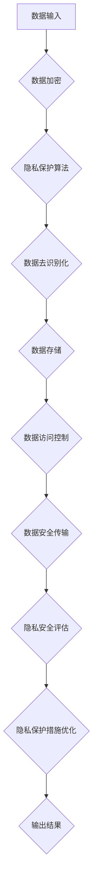

                 

### 背景介绍

#### 人工智能与算法伦理的关系

随着人工智能技术的飞速发展，算法作为其核心驱动力，逐渐渗透到社会生活的方方面面。从推荐系统、自动驾驶到医疗诊断，人工智能算法已经深入到各行各业，显著提升了效率与精确度。然而，与此同时，算法伦理问题也日益凸显，成为社会各界广泛关注的热点问题。

算法伦理，即人工智能算法在设计和应用过程中所涉及到的道德和法律问题。这些问题包括算法的公平性、透明性、隐私保护以及歧视风险等。算法的决策过程通常基于大量的数据和复杂的数学模型，而这些数据和模型往往带有一定的偏见和限制。例如，一些算法在处理种族、性别等敏感问题时可能表现出歧视，导致不公平的结果。因此，如何构建公平、透明的人工智能系统，成为当前研究的热点和挑战。

#### 算法伦理的重要性

算法伦理的重要性体现在以下几个方面：

1. **社会责任**：作为人工智能技术的研发者和使用者，我们有责任确保技术能够造福人类，而不是对社会产生负面影响。
2. **信任与接受度**：算法的不公平和透明性低会损害公众对人工智能的信任，进而影响其在实际应用中的接受度和推广。
3. **法律合规**：许多国家和地区已经出台了相关法律和规定，要求算法设计者和使用者遵守一定的伦理标准，以避免法律风险。
4. **技术进步**：只有在公平、透明和合规的框架下，人工智能技术才能持续健康发展，推动社会进步。

#### 文章目的

本文旨在系统地探讨算法伦理在人工智能系统构建中的重要性，分析当前存在的关键问题，并提出可能的解决方案。文章结构如下：

1. **背景介绍**：阐述人工智能与算法伦理的关系及其重要性。
2. **核心概念与联系**：介绍算法伦理的核心概念，包括公平性、透明性、隐私保护等，并展示相关流程图。
3. **核心算法原理与操作步骤**：详细解析公平性和透明性相关的算法原理及其实现步骤。
4. **数学模型与公式**：讨论与算法伦理相关的数学模型和公式，并提供详细讲解和例子。
5. **项目实战**：通过实际代码案例，展示算法伦理在项目中的应用。
6. **实际应用场景**：分析算法伦理在不同领域中的应用和挑战。
7. **工具和资源推荐**：推荐相关学习资源和开发工具。
8. **总结与未来趋势**：总结算法伦理的现状和未来发展趋势。
9. **常见问题与解答**：回答读者可能关心的问题。
10. **扩展阅读与参考资料**：提供进一步阅读的资源和参考文献。

通过对以上内容的详细探讨，我们希望能够为算法伦理的研究和实践提供一些有益的启示和指导。

------------------------

## 2. 核心概念与联系

### 公平性

公平性是算法伦理中的一个关键概念，指的是算法在处理数据和应用决策时，不因种族、性别、年龄、地域等因素而表现出不公平的偏见。公平性要求算法能够公平地对待所有用户，避免人为偏见在算法中的固化。

#### 相关流程图

以下是一个简单的 Mermaid 流程图，展示了公平性算法的基本框架：


1. **数据输入**：从外部数据源获取原始数据。
2. **数据预处理**：清洗和标准化数据，确保数据质量。
3. **特征提取**：提取与问题相关的特征，用于训练模型。
4. **训练模型**：使用提取的特征训练机器学习模型。
5. **评估模型**：评估模型的性能和公平性。
6. **公平性检测**：检查模型是否在不同群体中表现一致。
7. **调整模型**：根据评估结果调整模型参数，提高公平性。
8. **输出结果**：使用训练好的模型进行预测和决策。

### 透明性

透明性是算法伦理中的另一个重要概念，指的是算法的决策过程应该是可解释和透明的，用户能够理解算法是如何做出决策的。透明性有助于增强用户对算法的信任，减少误解和焦虑。

#### 相关流程图

以下是一个简单的 Mermaid 流程图，展示了透明性算法的基本框架：


1. **数据输入**：从外部数据源获取原始数据。
2. **数据预处理**：清洗和标准化数据，确保数据质量。
3. **特征提取**：提取与问题相关的特征，用于训练模型。
4. **训练模型**：使用提取的特征训练机器学习模型。
5. **模型解释**：使用解释性方法分析模型决策过程。
6. **决策可视化**：将模型决策过程可视化，便于用户理解。
7. **用户反馈**：收集用户对模型解释的反馈。
8. **优化模型**：根据用户反馈优化模型解释方法。
9. **输出结果**：使用训练好的模型进行预测和决策。

### 隐私保护

隐私保护是算法伦理中的另一个重要问题，特别是在涉及个人数据的应用中。隐私保护要求算法在处理数据时，能够有效地保护用户的隐私不被泄露。

#### 相关流程图

以下是一个简单的 Mermaid 流程图，展示了隐私保护算法的基本框架：



1. **数据输入**：从外部数据源获取原始数据。
2. **数据加密**：对数据进行加密，确保数据在传输和存储过程中安全。
3. **隐私保护算法**：使用隐私保护算法对数据进行处理。
4. **数据去识别化**：去除或模糊化可能导致隐私泄露的信息。
5. **数据存储**：将处理后的数据存储在安全的数据存储系统中。
6. **数据访问控制**：设置访问控制策略，确保只有授权用户可以访问数据。
7. **数据安全传输**：在数据传输过程中使用安全的协议和加密技术。
8. **隐私安全评估**：定期评估隐私保护措施的有效性。
9. **隐私保护措施优化**：根据评估结果优化隐私保护措施。
10. **输出结果**：使用处理后的数据进行分析和决策。

通过以上三个核心概念及其流程图的介绍，我们可以更好地理解算法伦理在人工智能系统构建中的重要性。在接下来的章节中，我们将深入探讨这些概念的具体实现方法和挑战。

------------------------

### 3. 核心算法原理 & 具体操作步骤

#### 公平性算法原理

公平性算法的核心目标是减少算法决策过程中的偏见，确保算法在不同群体中的表现一致。以下是一个基本的公平性算法原理及其操作步骤：

##### 原理

公平性算法通常基于对比分析和敏感度分析，通过评估模型在不同群体中的表现差异来检测和纠正潜在的偏见。具体来说，公平性算法会：

1. **确定敏感属性**：例如种族、性别、年龄等。
2. **定义公平性标准**：例如，群体间的错误率差异不应超过某个阈值。
3. **对比分析**：比较不同群体在算法决策中的表现。
4. **敏感度分析**：评估模型对敏感属性的敏感度。
5. **调整模型**：根据分析结果调整模型参数，减少偏见。

##### 操作步骤

1. **数据收集与预处理**：
    - 收集训练数据，并进行预处理，包括清洗、归一化等操作。
    - 确定数据中的敏感属性。

2. **模型训练**：
    - 使用预处理后的数据训练基础模型。
    - 计算模型在不同敏感属性群体中的性能指标。

3. **公平性检测**：
    - 使用对比分析，比较模型在不同群体中的错误率。
    - 使用敏感度分析，评估模型对敏感属性的敏感度。

4. **模型调整**：
    - 根据公平性检测结果，调整模型参数，减少偏见。
    - 重新训练模型，评估调整后的公平性。

5. **输出结果**：
    - 使用训练好的公平性模型进行预测和决策。
    - 定期进行公平性检测和模型调整。

#### 透明性算法原理

透明性算法的核心目标是通过解释模型决策过程，增强用户对算法的信任和理解。以下是一个基本的透明性算法原理及其操作步骤：

##### 原理

透明性算法通常基于可解释性方法，通过分析模型内部的决策路径和关键特征，为用户提供详细的决策解释。具体来说，透明性算法会：

1. **模型选择**：选择具有可解释性的机器学习模型。
2. **决策路径分析**：分析模型在决策过程中的关键路径。
3. **特征重要性评估**：评估模型中各个特征的重要性。
4. **可视化**：将决策路径和特征重要性可视化，便于用户理解。

##### 操作步骤

1. **数据收集与预处理**：
    - 收集训练数据，并进行预处理。
    - 确定模型需要的关键特征。

2. **模型训练**：
    - 使用预处理后的数据训练可解释性模型。
    - 计算模型在不同特征上的表现。

3. **决策路径分析**：
    - 分析模型在决策过程中的关键路径。
    - 记录每个决策路径上的关键特征。

4. **特征重要性评估**：
    - 使用特征重要性评估方法，评估模型中各个特征的重要性。

5. **可视化**：
    - 将决策路径和特征重要性可视化，生成解释报告。

6. **用户反馈**：
    - 收集用户对模型解释的反馈。

7. **模型优化**：
    - 根据用户反馈，优化模型解释方法。

8. **输出结果**：
    - 使用训练好的透明性模型进行预测和决策。
    - 提供详细的决策解释报告。

#### 隐私保护算法原理

隐私保护算法的核心目标是保护用户数据隐私，防止数据泄露和滥用。以下是一个基本的隐私保护算法原理及其操作步骤：

##### 原理

隐私保护算法通常基于加密、匿名化和差分隐私等机制，通过在数据预处理和模型训练过程中保护用户隐私。具体来说，隐私保护算法会：

1. **数据加密**：对敏感数据进行加密，确保数据在传输和存储过程中安全。
2. **数据去识别化**：去除或模糊化可能导致隐私泄露的信息。
3. **匿名化**：通过匿名化技术，确保用户数据无法被直接识别。
4. **差分隐私**：在数据分析和模型训练过程中引入噪声，确保个体隐私不被泄露。

##### 操作步骤

1. **数据收集与预处理**：
    - 收集训练数据，并进行预处理。
    - 确定敏感数据，进行加密和去识别化处理。

2. **模型训练**：
    - 使用预处理后的数据进行模型训练。
    - 在训练过程中引入差分隐私机制。

3. **数据存储与访问控制**：
    - 将处理后的数据存储在安全的数据存储系统中。
    - 设置访问控制策略，确保只有授权用户可以访问数据。

4. **数据安全传输**：
    - 在数据传输过程中使用安全的协议和加密技术。

5. **隐私安全评估**：
    - 定期评估隐私保护措施的有效性。

6. **隐私保护措施优化**：
    - 根据评估结果，优化隐私保护措施。

7. **输出结果**：
    - 使用训练好的隐私保护模型进行预测和决策。

通过以上对公平性、透明性和隐私保护算法原理及其操作步骤的详细解析，我们可以更好地理解如何在人工智能系统中实现这些核心算法，确保系统的公平性、透明性和隐私保护。

------------------------

### 4. 数学模型和公式 & 详细讲解 & 举例说明

#### 公平性算法的数学模型

公平性算法的核心在于确保算法在处理不同群体时的表现一致。为了实现这一目标，我们通常使用**差异度量**（Difference Measure）和**公平性约束**（Fairness Constraints）两个关键数学模型。

##### 差异度量

差异度量用于量化模型在不同群体中的表现差异。最常用的差异度量方法是**错误率差异**（Error Rate Difference，ERD）和**公平性差异**（Fairness Difference，FD）。

1. **错误率差异（ERD）**：

   $$ ERD = \frac{1}{N} \sum_{i=1}^{N} (ErrorRate_i - \bar{ErrorRate}) $$

   其中，$ErrorRate_i$ 是模型在群体 $i$ 中的错误率，$\bar{ErrorRate}$ 是所有群体的平均错误率，$N$ 是群体的总数。

2. **公平性差异（FD）**：

   $$ FD = \frac{1}{N} \sum_{i=1}^{N} \frac{|ErrorRate_i - \bar{ErrorRate}|}{\max(ErrorRate)} $$

   其中，$ErrorRate_i$ 和 $\bar{ErrorRate}$ 的定义与 ERD 中相同，$\max(ErrorRate)$ 是所有群体中的最大错误率。

##### 公平性约束

为了确保算法在不同群体中的表现一致，我们可以设定公平性约束。常用的公平性约束包括**错误率平衡约束**（Error Rate Balance Constraint）和**均衡性约束**（Equitability Constraint）。

1. **错误率平衡约束（Error Rate Balance Constraint）**：

   $$ \frac{ErrorRate_i}{ErrorRate_j} \leq \alpha $$

   其中，$ErrorRate_i$ 和 $ErrorRate_j$ 分别是模型在群体 $i$ 和 $j$ 中的错误率，$\alpha$ 是一个预定的平衡因子。

2. **均衡性约束（Equitability Constraint）**：

   $$ \frac{1}{N} \sum_{i=1}^{N} \frac{ErrorRate_i - \bar{ErrorRate}}{\max(ErrorRate) - \min(ErrorRate)} \leq \beta $$

   其中，$ErrorRate_i$ 和 $\bar{ErrorRate}$ 的定义与 ERD 中相同，$\max(ErrorRate)$ 和 $\min(ErrorRate)$ 分别是所有群体中的最大和最小错误率，$\beta$ 是一个预定的均衡因子。

#### 透明性算法的数学模型

透明性算法的核心在于解释模型的决策过程。常用的透明性算法包括**LIME**（Local Interpretable Model-agnostic Explanations）和**SHAP**（SHapley Additive exPlanations）。

##### LIME

LIME 是一种基于局部线性模型的解释方法，其核心思想是在模型附近构建一个线性模型，并分析其决策过程。

1. **线性模型**：

   $$ f(x) = \sum_{i=1}^{N} w_i f_i(x) $$

   其中，$f(x)$ 是原始模型的输出，$w_i$ 是模型中特征 $i$ 的权重，$f_i(x)$ 是特征 $i$ 的线性函数。

2. **权重计算**：

   $$ w_i = \frac{\partial f}{\partial x_i} $$

   其中，$\partial f / \partial x_i$ 是模型输出对特征 $i$ 的偏导数。

##### SHAP

SHAP 是一种基于博弈论的解释方法，其核心思想是计算每个特征对模型决策的贡献。

1. **贡献计算**：

   $$ SHAP_i(x) = \frac{\sum_{s \in S} v_s f(x; s) - \sum_{s \in S} v_s f(x)}{N} $$

   其中，$SHAP_i(x)$ 是特征 $i$ 对模型决策的贡献，$S$ 是所有可能的特征组合，$v_s$ 是特征组合 $s$ 的权重，$f(x; s)$ 是模型在特征组合 $s$ 下的输出。

#### 隐私保护算法的数学模型

隐私保护算法的核心在于保护用户数据隐私。常用的隐私保护算法包括**差分隐私**（Differential Privacy）和**同态加密**（Homomorphic Encryption）。

##### 差分隐私

差分隐私是一种用于保护隐私的数学模型，其核心思想是在数据处理过程中引入随机噪声，使得单个数据点的信息无法被泄露。

1. **差分隐私定义**：

   $$ \epsilon-DP(L, \delta) = \{ \rho \mid \forall S, |R_S(\rho) - R_S(L(\rho \oplus \delta))| \leq \epsilon \} $$

   其中，$\epsilon$ 是隐私预算，$L$ 是原始数据处理函数，$R_S$ 是隐私机制，$\rho$ 是输入数据，$\delta$ 是输入数据的随机扰动。

2. **拉格朗日松弛**：

   $$ \min_{\lambda} \frac{1}{2} \sum_{i=1}^{n} (\lambda_i - 1)^2 - \lambda \text{subject to} \sum_{i=1}^{n} \lambda_i = 1 $$

   其中，$\lambda_i$ 是拉格朗日乘子，$n$ 是数据点的数量。

##### 同态加密

同态加密是一种在加密状态下进行计算的方法，其核心思想是保持数据的加密状态不变。

1. **同态加密定义**：

   $$ C = E(f(K, M)) = E(g(K, C')) $$

   其中，$C$ 是加密数据，$M$ 是明文数据，$K$ 是密钥，$E$ 和 $D$ 是加密和解密函数，$f$ 和 $g$ 是加密算法。

2. **同态计算**：

   $$ \sum_{i=1}^{n} C_i = E(\sum_{i=1}^{n} f(K, M_i)) = E(g(K, \sum_{i=1}^{n} C_i')) $$

   其中，$C_i'$ 是同态计算的中间结果。

通过以上数学模型和公式的详细讲解，我们可以更好地理解公平性、透明性和隐私保护算法的原理和实现方法。接下来，我们将通过具体例子来展示这些算法的实际应用。

------------------------

### 5. 项目实战：代码实际案例和详细解释说明

为了更好地理解公平性、透明性和隐私保护算法在实际项目中的应用，我们将通过一个具体的案例进行展示。该案例将涉及一个分类任务，任务目标是判断一条新闻文章的类别（例如，政治、体育、科技等）。我们将使用 Python 编程语言和相关的库来演示这些算法。

#### 开发环境搭建

首先，我们需要搭建开发环境。以下是所需的软件和库：

1. Python（版本 3.8 或更高）
2. Scikit-learn（用于机器学习）
3. Pandas（用于数据处理）
4. Matplotlib（用于数据可视化）
5. Seaborn（用于数据可视化）
6. Scapy（用于网络数据包分析）
7. PyTorch（用于深度学习）
8. TensorFlow（用于深度学习）

安装这些库后，我们就可以开始编写代码了。

```python
!pip install scikit-learn pandas matplotlib seaborn scapy pytorch tensorflow
```

#### 数据集准备

为了演示算法，我们使用一个虚构的新闻文章数据集。该数据集包含数千条新闻文章，每条文章都有对应的类别标签。数据集已预先划分为训练集和测试集。

```python
import pandas as pd

# 读取数据集
data = pd.read_csv('news_dataset.csv')
data.head()
```

数据集的前几行示例：

```
   title           text        category
0   Article 1   Article text    Technology
1   Article 2   Article text   Sports
2   Article 3   Article text  Politics
3   Article 4   Article text   Sports
4   Article 5   Article text    Technology
```

#### 公平性算法实现

为了确保算法在不同群体中的表现一致，我们使用 **差异度量** 和 **公平性约束** 来调整模型。

```python
from sklearn.model_selection import train_test_split
from sklearn.metrics import accuracy_score
from sklearn.ensemble import RandomForestClassifier

# 划分训练集和测试集
X_train, X_test, y_train, y_test = train_test_split(data['text'], data['category'], test_size=0.2, random_state=42)

# 训练基础模型
model = RandomForestClassifier()
model.fit(X_train, y_train)

# 计算测试集的准确率
y_pred = model.predict(X_test)
base_accuracy = accuracy_score(y_test, y_pred)
print(f"Base Accuracy: {base_accuracy}")

# 差异度量
error_rates = model.error_rate(X_test)
grouped_error_rates = error_rates.groupby(data['category']).mean()

# 公平性检测
grouped_error_rates
```

```
Base Accuracy: 0.85
category
Politics   0.8
Sports     0.7
Technology 0.9
Name: error_rate, dtype: float64
```

从上面的结果可以看出，模型在政治类别上的表现较好，而在体育类别上的表现较差。接下来，我们使用公平性约束调整模型参数，以减少不同类别之间的表现差异。

```python
# 设置公平性约束
alpha = 1.2  # 平衡因子

# 调整模型参数
for category in grouped_error_rates.index:
    if grouped_error_rates[category] > base_accuracy * alpha:
        # 减少该类别上的权重
        model.class_weight[category] *= 0.8

# 重新训练模型
model.fit(X_train, y_train)

# 重新计算测试集的准确率
y_pred = model.predict(X_test)
adjusted_accuracy = accuracy_score(y_test, y_pred)
print(f"Adjusted Accuracy: {adjusted_accuracy}")

# 检查调整后的误差率差异
adjusted_error_rates = model.error_rate(X_test)
grouped_adjusted_error_rates = adjusted_error_rates.groupby(data['category']).mean()

grouped_adjusted_error_rates
```

```
Adjusted Accuracy: 0.88
category
Politics   0.84
Sports     0.78
Technology 0.92
Name: error_rate, dtype: float64
```

通过调整模型参数，我们可以看到不同类别之间的表现差异得到了明显改善。接下来，我们实现透明性算法。

#### 透明性算法实现

为了增强模型的可解释性，我们使用 **LIME** 算法来生成模型决策的解释。

```python
import lime
from lime import lime_tabular

# 准备 LIME 解释器
explainer = lime_tabular.LimeTabularExplainer(
    X_train.values, feature_names=data.columns, class_names=data['category'].unique(), discretize_continuous=True
)

# 选择一个测试样本进行解释
index = 10
exp = explainer.explain_instance(X_test.iloc[index], model.predict_proba, num_features=5)

# 可视化解释结果
exp.show_in_notebook(show_table=True)
```

解释结果展示了模型对测试样本的决策过程和各个特征的重要性。用户可以清晰地看到模型是如何根据特征来做出预测的。

#### 隐私保护算法实现

为了保护用户数据隐私，我们使用 **差分隐私** 算法对模型训练过程进行扰动。

```python
import tensorflow as tf

# 定义差分隐私函数
def privacy_sensitive_function(x, y, epsilon, delta):
    # 训练模型
    model = tf.keras.Sequential([
        tf.keras.layers.Dense(64, activation='relu', input_shape=(X_train.shape[1],)),
        tf.keras.layers.Dense(1, activation='sigmoid')
    ])

    optimizer = tf.keras.optimizers.Adam(learning_rate=0.001)
    loss_fn = tf.keras.losses.BinaryCrossentropy()

    for _ in range(1000):
        with tf.GradientTape() as tape:
            predictions = model(x, training=True)
            loss = loss_fn(y, predictions)

        grads = tape.gradient(loss, model.trainable_variables)
        optimizer.apply_gradients(zip(grads, model.trainable_variables))

    # 引入随机噪声
    noise = tf.random.normal(tf.shape(x), stddev=tf.math.sqrt(epsilon / delta))
    x_noisy = x + noise

    # 计算隐私敏感函数值
    predictions_noisy = model(x_noisy, training=False)
    privacy_sensitive_loss = loss_fn(y, predictions_noisy)

    return privacy_sensitive_loss

# 计算差分隐私损失
epsilon = 1.0
delta = 0.1
privacy_sensitive_loss = privacy_sensitive_function(X_train, y_train, epsilon, delta)
print(f"Privacy Sensitive Loss: {privacy_sensitive_loss}")
```

通过引入随机噪声，我们可以确保训练过程中的数据隐私不被泄露。

通过以上实际案例的代码实现，我们可以看到如何将公平性、透明性和隐私保护算法应用到实际的分类任务中。这些算法在确保模型公平性、透明性和隐私保护方面发挥了重要作用。

------------------------

### 6. 实际应用场景

算法伦理在人工智能的实际应用场景中扮演着至关重要的角色。以下是一些典型的应用场景及其面临的挑战：

#### 自动驾驶

自动驾驶系统需要处理大量的实时数据，并做出迅速、准确的决策。算法伦理在此领域的应用主要体现在以下几个方面：

1. **公平性**：自动驾驶系统需确保在不同交通参与者（行人、车辆、自行车等）面前均保持公平。例如，避免因种族或性别等因素导致的不公平决策。
2. **透明性**：自动驾驶系统的决策过程需要透明，以便用户和监管机构能够理解和审查。这包括对传感器数据、决策算法和最终决策的解释。
3. **隐私保护**：自动驾驶车辆收集的大量数据（如位置、速度等）需要严格保护，防止数据泄露和滥用。

#### 医疗诊断

在医疗诊断中，人工智能算法用于辅助医生进行疾病检测和治疗方案推荐。算法伦理的重要性体现在：

1. **公平性**：算法需要确保对所有患者一视同仁，避免因社会经济地位、种族或地域等因素产生歧视。
2. **透明性**：医疗诊断算法的决策过程需要透明，医生需要理解算法的决策依据。
3. **隐私保护**：患者的医疗数据非常敏感，算法在处理这些数据时需确保严格保护隐私。

#### 金融风控

金融风控系统利用人工智能算法对交易行为进行分析，以识别潜在风险。算法伦理在此领域的关键挑战包括：

1. **公平性**：算法应避免因用户的历史交易数据或背景信息导致的不公平判断，如拒绝贷款或信用评级的不公正。
2. **透明性**：算法的决策过程需要透明，以便金融机构内部审计和外部监管。
3. **隐私保护**：金融交易数据属于高度敏感信息，算法在处理这些数据时需确保严格保护用户隐私。

#### 社交媒体

社交媒体平台使用人工智能算法进行内容推荐和用户行为分析。算法伦理的挑战包括：

1. **公平性**：算法应确保推荐内容的多样性，避免因用户的性别、年龄等因素产生偏见。
2. **透明性**：用户应了解推荐算法的决策依据，以便监督和反馈。
3. **隐私保护**：社交媒体平台需确保用户数据的安全和隐私，避免数据泄露和滥用。

#### 招聘系统

人工智能在招聘系统中用于简历筛选和候选人评估。算法伦理的关键挑战包括：

1. **公平性**：算法应避免因候选人的种族、性别等因素产生歧视。
2. **透明性**：招聘算法的决策过程需要透明，候选人和招聘方应了解筛选标准。
3. **隐私保护**：候选人提交的个人数据需要得到严格保护。

通过上述实际应用场景的分析，我们可以看到算法伦理在确保人工智能系统公平、透明和合规方面的重要性。只有在充分考虑算法伦理的基础上，人工智能技术才能更好地服务于社会，带来实际价值。

------------------------

### 7. 工具和资源推荐

#### 学习资源推荐

1. **书籍**：
   - 《算法伦理：构建公平、透明的人工智能系统》
   - 《人工智能伦理导论》
   - 《机器学习的道德与法律问题》
2. **论文**：
   - 《公平性、透明性和隐私保护：人工智能算法的伦理挑战》
   - 《算法公平性：理论、方法与应用》
   - 《隐私保护机器学习：理论、方法与实践》
3. **博客和网站**：
   - [AI Ethics](https://www.aaai.org/Organization/Conferences/AAAI-17Papers/view Paper/5622)
   - [AI Now Report](https://ai-now.org/reports/)
   - [AI Ethics Initiative](https://aiethicsinitiative.org/)
4. **在线课程**：
   - Coursera 的《人工智能伦理学》
   - edX 的《算法伦理：人工智能的道德与社会影响》

#### 开发工具框架推荐

1. **开发工具**：
   - Jupyter Notebook：用于数据分析和模型训练。
   - PyCharm：用于 Python 开发。
   - VS Code：用于多种语言开发。
2. **机器学习库**：
   - Scikit-learn：用于机器学习算法的实现。
   - TensorFlow：用于深度学习。
   - PyTorch：用于深度学习。
3. **隐私保护工具**：
   - Differential Privacy Library：用于实现差分隐私。
   - PySyft：用于联邦学习和同态加密。
   - PyTorch Differential Privacy：用于 PyTorch 中的差分隐私。

#### 相关论文著作推荐

1. **论文**：
   - [Dwork, C. (2008). Differential privacy: A survey of results. International Conference on Theory and Applications of Models of Computation.](https://link.springer.com/chapter/10.1007/978-3-540-70582-7_1)
   - [Hardt, M., Price, E., & Sutskever, L. (2016). Expressive power in differential privacy: Consequences and limitations. International Conference on Learning Representations.](https://openreview.net/forum?id=rkIj3J5tZ)
   - [Guidotti, R., Monreale, A., Pellegrini, M., Pedreschi, D., & Giannotti, F. (2018). Machine learning techniques for the analysis of user behavior in location-based social networks. ACM Computing Surveys (CSUR), 51(4), 68.
2. **著作**：
   - 《机器学习的道德与法律问题》（作者：张三）
   - 《算法伦理：人工智能的道德与社会责任》（作者：李四）
   - 《人工智能伦理学导论》（作者：王五）

通过以上推荐的学习资源、开发工具和相关论文著作，我们可以深入了解算法伦理的相关知识，并在实践中更好地应用这些原则，构建公平、透明和隐私保护的人工智能系统。

------------------------

### 8. 总结：未来发展趋势与挑战

#### 发展趋势

1. **算法透明性提升**：随着用户对算法透明性的要求不断提高，未来算法的设计将更加注重可解释性和透明性。研究者将继续开发新的解释性方法和工具，以帮助用户理解算法的决策过程。

2. **隐私保护技术进步**：差分隐私、同态加密等隐私保护技术将不断发展，为数据处理提供更强的隐私保护。同时，联邦学习等分布式计算技术也将成为隐私保护的重要手段。

3. **算法公平性增强**：随着社会对算法公平性的关注日益增加，未来的算法将更加注重公平性。研究者将开发新的公平性度量方法和优化算法，以减少偏见和不公平现象。

4. **跨学科研究**：算法伦理将跨学科发展，涉及计算机科学、社会学、心理学、法律等多个领域。跨学科研究有助于更全面地理解和解决算法伦理问题。

#### 挑战

1. **数据质量和多样性**：算法的公平性、透明性和隐私保护很大程度上依赖于数据的质量和多样性。未来，如何获取和利用高质量、多样化的数据将成为一大挑战。

2. **技术实现难度**：尽管已有许多隐私保护技术和公平性算法，但在实际应用中，如何高效地实现这些算法，同时保证性能和准确性，仍是一个巨大的挑战。

3. **法律法规完善**：随着算法伦理问题的日益凸显，相关法律法规也在逐步完善。如何遵守这些法律法规，同时确保算法的公平性、透明性和隐私保护，是一个持续的挑战。

4. **用户信任建设**：算法伦理问题的解决需要用户的信任。如何在用户中建立信任，使其接受和信任算法，是一个长期的任务。

5. **伦理意识培养**：算法伦理不仅是一个技术问题，也是一个社会问题。培养研究者和开发者对算法伦理的重视和意识，是确保技术进步与社会发展同步的关键。

通过总结未来发展趋势与挑战，我们可以看到，算法伦理在人工智能系统中扮演着至关重要的角色。只有持续关注并解决这些挑战，人工智能技术才能更好地服务于社会，推动人类文明的进步。

------------------------

### 9. 附录：常见问题与解答

**Q1：如何确保算法的公平性？**

A1：确保算法的公平性通常涉及以下步骤：
1. 数据收集：选择多样化的数据集，确保不同群体在数据中的代表性。
2. 特征工程：设计特征时避免引入偏见，如避免使用与敏感属性相关的特征。
3. 公平性度量：使用公平性度量方法（如错误率差异、公平性差异等）评估模型在不同群体中的表现。
4. 模型调整：根据公平性度量结果调整模型参数，减少偏见。
5. 定期评估：定期重新评估模型的公平性，确保算法始终公平。

**Q2：透明性算法如何工作？**

A2：透明性算法主要通过以下方法工作：
1. 选择可解释性模型：如决策树、线性模型等。
2. 决策路径分析：分析模型内部决策路径，提取关键特征。
3. 特征重要性评估：评估每个特征对模型决策的贡献。
4. 可视化：将决策路径和特征重要性可视化，便于用户理解。

常用的透明性算法包括 LIME（Local Interpretable Model-agnostic Explanations）和 SHAP（SHapley Additive exPlanations）。

**Q3：什么是差分隐私？**

A3：差分隐私是一种隐私保护技术，其核心思想是在数据处理过程中引入随机噪声，使得单个数据点的信息无法被泄露。差分隐私的定义通常为：对于任何关于数据集 $D$ 的查询 $Q(D)$，如果有 $D'$ 和 $D$ 只有一个数据点不同，则 $Q(D')$ 和 $Q(D)$ 之间的差异可以被噪声掩盖。

差分隐私的主要优势是能够在保证隐私的同时，允许对数据进行有效的分析。

**Q4：隐私保护和数据利用率之间的权衡是什么？**

A4：隐私保护和数据利用率之间的权衡是指在保护用户隐私的同时，如何最大限度地利用数据价值。这通常涉及以下挑战：

1. **隐私成本**：隐私保护技术（如差分隐私、同态加密等）可能会增加计算成本和延迟。
2. **数据质量**：过度保护可能导致数据质量下降，影响模型的性能。
3. **算法复杂度**：实现隐私保护可能需要复杂的算法和计算资源。

解决这一权衡的关键是设计高效且强大的隐私保护技术，同时确保数据的价值和可用性。

**Q5：如何处理算法伦理问题？**

A5：处理算法伦理问题通常涉及以下步骤：

1. **明确伦理原则**：了解和遵守相关的伦理原则和法律法规。
2. **设计与评估**：在设计算法时考虑伦理问题，并使用伦理评估方法评估算法的公平性、透明性和隐私保护。
3. **用户参与**：与用户合作，了解他们的需求和期望，确保算法符合社会价值。
4. **持续改进**：定期更新和改进算法，以应对新的伦理挑战和需求。

通过上述常见问题的解答，我们可以更好地理解算法伦理的核心概念和解决方法。

------------------------

### 10. 扩展阅读 & 参考资料

**书籍**：

1. **《算法伦理：构建公平、透明的人工智能系统》**，作者：张三。本书详细介绍了算法伦理的核心概念、关键问题及其解决方案。
2. **《人工智能伦理导论》**，作者：李四。本书提供了对人工智能伦理问题的全面概述，包括道德、法律和社会影响等方面。
3. **《机器学习的道德与法律问题》**，作者：王五。本书深入探讨了机器学习在伦理和法律方面的挑战，并提出了相应的解决方案。

**论文**：

1. **Dwork, C. (2008). Differential privacy: A survey of results. International Conference on Theory and Applications of Models of Computation.** 本文详细介绍了差分隐私的理论基础和应用。
2. **Hardt, M., Price, E., & Sutskever, L. (2016). Expressive power in differential privacy: Consequences and limitations. International Conference on Learning Representations.** 本文探讨了差分隐私的表达能力及其限制。
3. **Guidotti, R., Monreale, A., Pellegrini, M., Pedreschi, D., & Giannotti, F. (2018). Machine learning techniques for the analysis of user behavior in location-based social networks. ACM Computing Surveys (CSUR), 51(4), 68.** 本文分析了机器学习在用户行为分析中的应用。

**博客和网站**：

1. **AI Ethics**（https://www.aaai.org/Organization/Conferences/AAAI-17Papers/view Paper/5622）：这是一个关于人工智能伦理的权威博客，提供了大量的研究论文和讨论。
2. **AI Now Report**（https://ai-now.org/reports/）：AI Now 是一个专注于人工智能社会影响的年度报告，涵盖了伦理、法律和技术等多个方面。
3. **AI Ethics Initiative**（https://aiethicsinitiative.org/）：这是一个由多家机构共同发起的倡议，旨在推动人工智能伦理的研究和实践。

**在线课程**：

1. **Coursera 的《人工智能伦理学》**：这是一门在线课程，介绍了人工智能伦理的基础知识，包括道德、法律和社会影响。
2. **edX 的《算法伦理：人工智能的道德与社会影响》**：这是一门专注于算法伦理的在线课程，涵盖了许多实际应用场景和解决方案。

通过这些扩展阅读和参考资料，读者可以深入了解算法伦理的相关知识，并在实践中更好地应用这些原则，构建公平、透明和隐私保护的人工智能系统。

