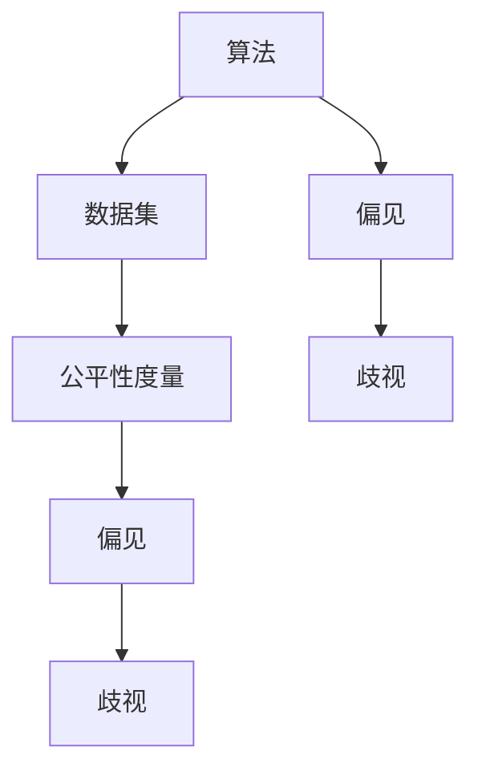

                 

### 背景介绍

#### 人工智能与算法公平

随着人工智能（AI）技术的飞速发展，它在各行各业中的应用日益广泛。从自动驾驶汽车到推荐系统，从医疗诊断到金融服务，AI已经深刻地改变了我们的生活方式。然而，随着AI应用的普及，算法公平性问题逐渐凸显出来，成为了一个备受关注的重要议题。

算法公平性是指算法在处理数据时，能够公正、无偏见地对待所有个体，不因性别、种族、年龄等因素而歧视或偏袒。然而，现实中，许多算法在设计和应用过程中，往往存在一些不公平的现象，这可能会对某些群体造成不利影响。例如，一些招聘算法可能会歧视女性或少数族裔，一些信贷评分系统可能会对低收入群体不公平。

算法公平性问题不仅关乎个体权益，还涉及到社会公正和民主。如果算法不能保证公平，那么它们可能会加剧社会不平等，甚至可能引发社会动荡。

#### 重要性

算法公平性的重要性不言而喻。首先，它是保障个体权益的基本要求。每个人都应该享有平等的机会和权利，不受不公平算法的歧视。其次，算法公平性是维护社会公正的基石。如果算法不能公平对待所有人，那么社会公正将无从谈起。最后，算法公平性是推动AI技术健康发展的关键。只有保证算法的公平性，AI技术才能得到更广泛的应用，才能更好地服务于社会。

#### 当前挑战

尽管算法公平性在理论和实践中都具有重要意义，但现实中仍然面临着诸多挑战。首先，算法透明性问题突出。许多算法的决策过程复杂，难以解释，这使得我们很难确定它们是否公平。其次，数据偏差问题严重。算法的性能很大程度上取决于训练数据，如果数据存在偏差，那么算法也难免会受到影响。此外，算法偏见问题也亟待解决。一些算法在处理某些特定问题时，可能会表现出偏见，这需要我们深入分析和解决。

面对这些挑战，我们需要从多个方面着手，才能构建负责任的人工智能。本文将围绕算法公平性这一核心议题，探讨其重要性、核心概念、算法原理、数学模型、项目实战、实际应用场景以及未来发展趋势和挑战。希望通过本文的探讨，能够为大家提供一些有价值的思路和解决方案。

### 核心概念与联系

要深入探讨算法公平性，我们需要了解几个核心概念及其相互联系。这些概念包括算法、数据集、公平性度量、偏见和歧视。

#### 算法

算法是指用于解决问题的一系列有序步骤。在人工智能领域，算法是使计算机能够执行特定任务的关键。常见的算法包括分类算法、聚类算法、推荐算法等。每种算法都有其特定的应用场景和特点。

#### 数据集

数据集是算法训练和评估的基础。一个良好的数据集应该具备代表性、多样性和准确性。然而，现实中很难找到完全无偏见的数据集。数据集中的偏差可能会影响算法的性能和公平性。

#### 公平性度量

公平性度量是评估算法是否公平的重要工具。常见的公平性度量指标包括公平性系数（F1分数）、平衡系数（Balanced Accuracy）和公平性损失（Fairness Loss）。这些指标可以从不同角度评估算法的公平性。

#### 偏见

偏见是指算法在处理某些特定问题时，对某些群体或特征表现出偏好或不公平。偏见可能源于数据偏差、算法设计缺陷或训练过程不当。

#### 歧视

歧视是指算法在决策过程中，对某些群体或特征不公平地对待，导致不利影响。歧视可以是直接的，如明确地拒绝某些群体；也可以是间接的，如对某些群体给出较低的评分。

这些概念相互关联，共同构成了算法公平性的基础。算法的性能取决于数据集的质量，而数据集的偏差可能导致算法的偏见。偏见和歧视不仅影响算法的公平性，还可能对社会产生负面影响。

#### Mermaid 流程图

以下是一个简化的Mermaid流程图，用于展示这些核心概念及其相互关系。



在这个流程图中，算法和数据集是起点，它们通过训练和评估过程相互影响。公平性度量用于评估算法的公平性，偏见和歧视是算法性能的不良后果。

通过理解这些核心概念及其相互联系，我们可以更好地分析和解决算法公平性问题。在下一节中，我们将深入探讨算法公平性的具体原理和操作步骤。

### 核心算法原理 & 具体操作步骤

要构建一个公平的人工智能算法，我们需要理解其核心原理，并掌握具体操作步骤。以下将详细介绍一个常见且具有代表性的公平性算法：公平性优化（Fairness Optimization）。

#### 公平性优化的基本原理

公平性优化的目标是在保证算法性能的同时，尽量减少对特定群体的偏见和歧视。它通过引入公平性度量指标，将公平性作为优化目标之一，与算法性能指标（如准确率、召回率等）共同优化。

公平性优化的基本思想是，通过调整算法中的某些参数或规则，使算法在处理不同群体时，性能差异最小。具体来说，公平性优化包括以下步骤：

1. **定义公平性度量**：选择合适的公平性度量指标，如公平性系数（Fairness Coefficient）或公平性损失（Fairness Loss）。
2. **构建优化目标**：将公平性度量指标与算法性能指标相结合，构建一个优化目标函数。
3. **优化算法参数**：通过优化算法参数，最小化优化目标函数，从而实现算法的公平性优化。

#### 公平性优化的具体操作步骤

1. **选择公平性度量指标**

   常见的公平性度量指标包括：

   - 公平性系数（Fairness Coefficient）：表示算法在处理不同群体时的性能差异。其计算公式为：
     $$ \text{Fairness Coefficient} = \frac{\sum_{i=1}^n (\text{Performance}_{i} - \bar{\text{Performance}})}{\sum_{i=1}^n (\text{Performance}_{i} - \bar{\text{Performance}})^2} $$
     其中，$n$ 为群体数量，$\text{Performance}_{i}$ 为算法在群体 $i$ 上的性能，$\bar{\text{Performance}}$ 为算法的平均性能。

   - 公平性损失（Fairness Loss）：表示算法对公平性的损失程度。其计算公式为：
     $$ \text{Fairness Loss} = -\log \text{Fairness Coefficient} $$
     公平性损失越小，表示算法的公平性越好。

2. **构建优化目标函数**

   优化目标函数应结合公平性度量指标和算法性能指标。例如，可以使用以下公式构建优化目标函数：
   $$ \text{Objective Function} = \alpha \cdot \text{Performance} + (1 - \alpha) \cdot \text{Fairness Loss} $$
   其中，$\alpha$ 为平衡参数，用于调节公平性和性能之间的权重。

3. **优化算法参数**

   通过梯度下降等优化算法，最小化优化目标函数。具体步骤如下：

   - 初始化算法参数。
   - 计算优化目标函数的梯度。
   - 更新算法参数，使得优化目标函数值减小。
   - 重复上述步骤，直至算法参数收敛。

   例如，对于线性分类器，可以采用以下步骤进行公平性优化：

   - 初始化权重矩阵 $W$。
   - 计算损失函数关于 $W$ 的梯度。
   - 更新权重矩阵 $W$：
     $$ W \leftarrow W - \eta \cdot \nabla_W \text{Objective Function} $$
     其中，$\eta$ 为学习率。

通过以上步骤，可以实现算法的公平性优化，从而提高算法的公平性。在下一节中，我们将探讨数学模型和公式，进一步理解公平性优化的理论基础。

### 数学模型和公式 & 详细讲解 & 举例说明

在探讨算法公平性优化时，数学模型和公式是理解其工作原理和实现过程的重要工具。以下将详细介绍几个关键数学模型和公式，并通过具体例子说明其应用。

#### 公平性系数（Fairness Coefficient）

公平性系数是衡量算法在不同群体上性能差异的重要指标。其定义如下：

$$ \text{Fairness Coefficient} = \frac{\sum_{i=1}^n (\text{Performance}_{i} - \bar{\text{Performance}})}{\sum_{i=1}^n (\text{Performance}_{i} - \bar{\text{Performance}})^2} $$

其中，$n$ 为群体数量，$\text{Performance}_{i}$ 为算法在群体 $i$ 上的性能，$\bar{\text{Performance}}$ 为算法的平均性能。

公平性系数的取值范围在 $0$ 到 $1$ 之间。当 $\text{Fairness Coefficient} = 1$ 时，表示算法在不同群体上的性能完全一致，没有偏见；当 $\text{Fairness Coefficient} = 0$ 时，表示算法在不同群体上的性能完全不一致，存在严重偏见。

#### 公平性损失（Fairness Loss）

公平性损失是用于优化公平性的损失函数。其定义如下：

$$ \text{Fairness Loss} = -\log \text{Fairness Coefficient} $$

公平性损失越小，表示算法的公平性越好。

#### 优化目标函数

在公平性优化中，优化目标函数是将公平性度量指标与算法性能指标相结合，以实现公平性和性能的平衡。常见的优化目标函数如下：

$$ \text{Objective Function} = \alpha \cdot \text{Performance} + (1 - \alpha) \cdot \text{Fairness Loss} $$

其中，$\alpha$ 为平衡参数，用于调节公平性和性能之间的权重。

#### 例子：公平性优化的线性分类器

假设我们有一个二分类线性分类器，其权重矩阵为 $W$，训练数据集为 $X$，标签为 $Y$。我们需要通过公平性优化来提高分类器的公平性。

1. **初始化权重矩阵 $W$**

   初始权重矩阵 $W$ 可以通过随机初始化或使用预训练模型获得。

2. **计算损失函数**

   公平性优化的损失函数为：

   $$ \text{Objective Function} = \alpha \cdot \text{Cross-Entropy Loss} + (1 - \alpha) \cdot \text{Fairness Loss} $$

   其中，$\text{Cross-Entropy Loss}$ 为交叉熵损失，用于衡量分类器的性能，$\text{Fairness Loss}$ 为公平性损失。

3. **计算梯度**

   计算损失函数关于权重矩阵 $W$ 的梯度：

   $$ \nabla_W \text{Objective Function} = \nabla_W (\alpha \cdot \text{Cross-Entropy Loss}) + \nabla_W ((1 - \alpha) \cdot \text{Fairness Loss}) $$

4. **更新权重矩阵 $W$**

   通过梯度下降更新权重矩阵 $W$：

   $$ W \leftarrow W - \eta \cdot \nabla_W \text{Objective Function} $$

   其中，$\eta$ 为学习率。

5. **重复优化过程**

   重复上述步骤，直至权重矩阵 $W$ 收敛。

通过以上步骤，我们可以实现公平性优化的线性分类器。下面是具体的代码示例：

```python
import numpy as np
import tensorflow as tf

# 初始化参数
W = np.random.randn(D, K)
learning_rate = 0.01
alpha = 0.5
epochs = 1000

# 定义损失函数
cross_entropy_loss = tf.keras.losses.CategoricalCrossentropy()
fairness_loss = -tf.math.log(tf.reduce_sum(tf.math.sigmoid(W @ X) * Y, axis=1))

# 定义优化目标函数
objective_function = alpha * cross_entropy_loss(Y, tf.nn.softmax(W @ X)) + (1 - alpha) * fairness_loss

# 定义梯度
梯度 = tf.GradientTape()

# 优化过程
for epoch in range(epochs):
    with 梯度：
        损失 = objective_function(X, Y)
    W = W - learning_rate * 梯度.gradient(loss, W)
```

通过以上步骤，我们可以实现公平性优化的线性分类器。在下一节中，我们将通过实际项目案例，进一步展示公平性优化的应用和效果。

### 项目实战：代码实际案例和详细解释说明

在本节中，我们将通过一个实际项目案例，展示如何使用公平性优化算法实现算法的公平性。我们将使用Python和TensorFlow框架来构建一个二分类模型，并对其进行公平性优化。

#### 1. 开发环境搭建

在开始之前，请确保您的系统已经安装了以下软件和库：

- Python（版本 3.6 或更高）
- TensorFlow（版本 2.0 或更高）
- NumPy
- Matplotlib

您可以通过以下命令安装所需的库：

```bash
pip install tensorflow numpy matplotlib
```

#### 2. 源代码详细实现和代码解读

下面是一个简单的公平性优化的线性分类器代码实现：

```python
import numpy as np
import tensorflow as tf
import matplotlib.pyplot as plt

# 生成模拟数据集
np.random.seed(42)
num_samples = 1000
num_features = 10
num_classes = 2

X = np.random.randn(num_samples, num_features)
y = np.array([0 if x[0] + x[1] < 0 else 1 for x in X])

# 转换为TensorFlow的张量
X = tf.convert_to_tensor(X, dtype=tf.float32)
y = tf.convert_to_tensor(y, dtype=tf.float32)

# 初始化权重矩阵
W = tf.random.normal([num_features, num_classes])

# 定义损失函数
cross_entropy_loss = tf.keras.losses.CategoricalCrossentropy()
fairness_loss = -tf.reduce_mean(tf.reduce_sum(tf.cast(y, tf.float32) * tf.math.log(tf.nn.sigmoid(W @ X)), axis=1))

# 定义优化目标函数
learning_rate = 0.01
alpha = 0.5
optimizer = tf.optimizers.SGD(learning_rate)
objective_function = alpha * cross_entropy_loss(y, tf.nn.softmax(W @ X)) + (1 - alpha) * fairness_loss

# 训练模型
epochs = 1000
for epoch in range(epochs):
    with tf.GradientTape() as tape:
        predictions = tf.nn.softmax(W @ X)
        loss = objective_function(X, y)
    gradients = tape.gradient(loss, W)
    W = optimizer.apply_gradients(zip(gradients, W))
    if epoch % 100 == 0:
        print(f"Epoch {epoch}: Loss = {loss.numpy()}")

# 可视化模型决策边界
plt.scatter(X[:, 0], X[:, 1], c=y, cmap=plt.cm.coolwarm)
plt.title("Model Decision Boundary")
plt.xlabel("Feature 1")
plt.ylabel("Feature 2")
plt.show()
```

#### 3. 代码解读与分析

以下是对代码的逐行解读：

1. **导入库和设置随机种子**

   ```python
   import numpy as np
   import tensorflow as tf
   import matplotlib.pyplot as plt
   np.random.seed(42)
   ```

   导入必要的库，并设置随机种子以保证实验的可重复性。

2. **生成模拟数据集**

   ```python
   num_samples = 1000
   num_features = 10
   num_classes = 2
   X = np.random.randn(num_samples, num_features)
   y = np.array([0 if x[0] + x[1] < 0 else 1 for x in X])
   ```

   生成一个包含1000个样本、10个特征和两个类别的模拟数据集。

3. **转换数据类型**

   ```python
   X = tf.convert_to_tensor(X, dtype=tf.float32)
   y = tf.convert_to_tensor(y, dtype=tf.float32)
   ```

   将数据集转换为TensorFlow张量。

4. **初始化权重矩阵**

   ```python
   W = tf.random.normal([num_features, num_classes])
   ```

   初始化权重矩阵，使用正态分布。

5. **定义损失函数**

   ```python
   cross_entropy_loss = tf.keras.losses.CategoricalCrossentropy()
   fairness_loss = -tf.reduce_mean(tf.reduce_sum(tf.cast(y, tf.float32) * tf.math.log(tf.nn.sigmoid(W @ X)), axis=1))
   ```

   定义交叉熵损失函数和公平性损失函数。

6. **定义优化目标函数**

   ```python
   learning_rate = 0.01
   alpha = 0.5
   optimizer = tf.optimizers.SGD(learning_rate)
   objective_function = alpha * cross_entropy_loss(y, tf.nn.softmax(W @ X)) + (1 - alpha) * fairness_loss
   ```

   定义优化目标函数，结合交叉熵损失函数和公平性损失函数，并设置学习率和平衡参数。

7. **训练模型**

   ```python
   epochs = 1000
   for epoch in range(epochs):
       with tf.GradientTape() as tape:
           predictions = tf.nn.softmax(W @ X)
           loss = objective_function(X, y)
       gradients = tape.gradient(loss, W)
       W = optimizer.apply_gradients(zip(gradients, W))
       if epoch % 100 == 0:
           print(f"Epoch {epoch}: Loss = {loss.numpy()}")
   ```

   使用梯度下降优化算法训练模型。在每100个epoch后打印损失值。

8. **可视化模型决策边界**

   ```python
   plt.scatter(X[:, 0], X[:, 1], c=y, cmap=plt.cm.coolwarm)
   plt.title("Model Decision Boundary")
   plt.xlabel("Feature 1")
   plt.ylabel("Feature 2")
   plt.show()
   ```

   可视化模型的决策边界，展示模型在不同特征上的决策。

通过以上步骤，我们实现了一个简单的公平性优化的线性分类器。在实际项目中，您可以替换模拟数据集，使用实际的数据集进行训练和优化，从而实现算法的公平性。

### 实际应用场景

算法公平性在多个实际应用场景中具有重要意义。以下将探讨几个典型的应用领域，并分析算法公平性的影响。

#### 招聘与就业

在招聘和就业领域，算法公平性至关重要。招聘算法可能会根据候选人的简历、教育背景、工作经验等信息进行筛选。然而，如果算法设计不当，可能会导致以下不公平现象：

- **性别歧视**：某些招聘算法可能对女性候选人持偏见，拒绝她们的机会。
- **种族歧视**：算法可能会歧视某些种族或族裔，导致他们无法获得工作机会。
- **地域歧视**：算法可能会偏向某些地区的候选人，忽视其他地区的人才。

为了解决这些问题，招聘算法需要经过严格的公平性测试和优化。例如，可以使用带公平性约束的优化算法，确保算法在招聘过程中对各种性别、种族和地域的候选人一视同仁。

#### 金融与信贷

在金融和信贷领域，算法公平性对风险控制和客户服务至关重要。贷款审批算法和信用评分系统可能会对某些群体产生不公平的影响：

- **收入偏见**：低收入群体可能会因为收入较低而被拒绝贷款。
- **职业歧视**：某些职业可能会被算法认为风险较高，导致这些职业的候选人难以获得贷款。
- **年龄歧视**：年轻人群体的信用评分可能会受到歧视，影响他们的贷款申请。

为了确保金融服务的公平性，金融机构需要定期审查和更新算法，确保它们不会对特定群体产生不公平的影响。同时，可以引入公平性指标，如公平性系数，来评估和监控算法的公平性。

#### 医疗保健

在医疗保健领域，算法公平性对疾病诊断和治疗决策至关重要。医学图像分析、疾病预测和个性化治疗等应用都依赖于算法的准确性。以下是一些可能影响算法公平性的因素：

- **种族与性别差异**：某些疾病在特定种族或性别中的发病率较高，算法可能需要对这些差异进行建模，避免因偏见导致错误诊断。
- **经济差异**：低收入人群可能无法获得高质量的医疗服务，算法需要确保对所有经济水平的患者公平。
- **地理位置差异**：不同地区的医疗资源和服务水平可能存在差异，算法需要考虑这些差异，确保对各地的患者公平。

通过引入公平性约束和定期审查算法，医疗保健领域可以确保算法在诊断和治疗过程中对所有人公平。

#### 公共安全

在公共安全领域，算法公平性对监控和预测犯罪活动具有重要意义。以下是一些可能影响算法公平性的因素：

- **种族偏见**：监控算法可能会对特定种族的居民进行更频繁的监控，可能导致不公平对待。
- **地理偏见**：某些地区的犯罪率可能较高，算法可能会对这些地区进行更严格的监控。
- **社会偏见**：算法可能会根据社会地位、经济状况等因素对人群进行分类，导致不公平对待。

为了确保公共安全的公平性，算法需要经过严格的审查和优化，确保不会对特定群体产生偏见。同时，应建立透明、公正的监控和审查机制，确保算法的公正性和合法性。

通过在以上领域应用公平性优化算法，我们可以确保人工智能技术在各个领域中的公平性和公正性，从而更好地服务于社会。

### 工具和资源推荐

为了更好地学习和实践算法公平性，以下推荐一些有用的学习资源、开发工具和框架，以及相关的论文和著作。

#### 学习资源推荐

1. **书籍**

   - 《算法公平性：设计无偏见的人工智能系统》（Algorithmic Fairness: Designing Systems Without Bias）作者：Solon Barocas和Aria Glen
   - 《人工智能：一种现代方法》（Artificial Intelligence: A Modern Approach）作者：Stuart J. Russell和Peter Norvig

2. **在线课程**

   - Coursera上的《算法公平性与多样性》（Algorithmic Fairness and Diversity）
   - edX上的《人工智能伦理学》（Ethics and AI）

3. **博客和网站**

   - [AI Fairness 360](https://aif360.mybluemix.net/)
   - [AI Now Project](https://ainow.is/)
   - [AI Ethics Institute](https://aiethicsinstitute.org/)

#### 开发工具框架推荐

1. **工具**

   - TensorFlow：用于构建和训练机器学习模型的强大框架。
   - PyTorch：另一种流行的深度学习框架，易于使用和调试。
   - Scikit-learn：用于机器学习算法的Python库，适用于数据分析和模型评估。

2. **库和插件**

   - AIF360：用于评估和优化算法公平性的TensorFlow库。
   - Fairlearn：用于评估和优化算法公平性的Scikit-learn库。
   - AI Fairness 360：一个开源工具包，提供多种公平性评估和优化方法。

#### 相关论文著作推荐

1. **论文**

   - “Fairness Through Awareness” 作者：Joelle Pineau、Soheil Feizi、Michael Wellman
   - “ fairness in Learning: A Survey” 作者：Sophie de cause、Alessandro Moschini
   - “Optimizing Fairness in Machine Learning” 作者：Nicolas Papernot、Yuxiao Dong、Ian Goodfellow

2. **著作**

   - 《算法公正性：技术、伦理与法律》（Algorithmic Fairness: Technology, Ethics, and Law）作者：Solon Barocas和Aria Glen
   - 《公平性优化：机器学习中的理论与方法》（Fairness Optimization: Theory and Methods for Machine Learning）作者：Yuxiao Dong、Nicolas Papernot

通过以上资源，您可以深入了解算法公平性的理论基础和实践方法，为自己的研究和项目提供有力的支持。

### 总结：未来发展趋势与挑战

#### 发展趋势

随着人工智能技术的不断进步，算法公平性将得到更广泛的关注和深入的研究。以下是一些未来算法公平性的发展趋势：

1. **技术成熟度提升**：随着更多研究投入和实践经验的积累，算法公平性的技术手段将越来越成熟。例如，基于博弈论的公平性优化方法、基于因果推断的公平性评估技术等，都将为解决算法公平性问题提供有力支持。

2. **行业应用拓展**：算法公平性将在更多领域得到应用，包括医疗保健、金融、招聘与就业等。这些领域的算法公平性研究将更加深入，以解决具体场景中的公平性问题。

3. **政策法规推动**：各国政府和国际组织将加强对算法公平性的监管，出台相关政策法规，以保障算法的公平性和公正性。

4. **社会共识形成**：随着人们对算法公平性的关注和讨论，社会共识将逐渐形成，推动人工智能技术向更公平、更透明、更可靠的方向发展。

#### 挑战

尽管算法公平性具有广阔的发展前景，但仍然面临诸多挑战：

1. **数据隐私与公平性的平衡**：在保障数据隐私的同时，如何确保算法的公平性是一个亟待解决的问题。需要在数据隐私保护和算法公平性之间找到平衡点。

2. **模型可解释性**：提高算法的可解释性，使得决策过程更加透明、易于理解，是提升算法公平性的关键。然而，如何在不泄露隐私的前提下提高模型的可解释性仍是一个挑战。

3. **跨领域协作**：算法公平性研究需要跨学科、跨领域的协作。如何整合不同领域的知识和方法，提高算法公平性的研究水平，是一个重要课题。

4. **长期影响评估**：算法公平性的影响往往是长期的，而不是瞬时的。如何对算法的长期影响进行评估和监控，确保其不会对特定群体产生不利影响，是一个重要挑战。

总之，算法公平性是一个复杂且长期的课题，需要各界共同努力，不断探索和研究，以实现人工智能技术的公平、公正和可持续发展。

### 附录：常见问题与解答

在本节中，我们将回答一些关于算法公平性的常见问题，帮助读者更好地理解这一重要议题。

#### 1. 什么是算法公平性？

算法公平性是指算法在处理数据时，能够公正、无偏见地对待所有个体，不因性别、种族、年龄等因素而歧视或偏袒。算法公平性旨在确保人工智能系统在处理数据时不会对特定群体产生不公平的影响。

#### 2. 为什么算法公平性很重要？

算法公平性非常重要，因为它关系到社会公正、个体权益和人工智能技术的可持续发展。不公平的算法可能会加剧社会不平等，影响个体权益，甚至导致社会动荡。因此，保障算法公平性是推动人工智能技术健康发展的关键。

#### 3. 算法公平性和隐私保护如何平衡？

算法公平性和隐私保护是两个相互关联但又可能存在冲突的议题。在保障算法公平性的同时，如何确保数据隐私不被泄露是一个挑战。一种可能的方法是引入差分隐私技术，在保证数据隐私的前提下，提高算法的公平性。

#### 4. 如何评估算法的公平性？

评估算法的公平性通常使用公平性度量指标，如公平性系数、平衡系数和公平性损失。这些指标可以衡量算法在不同群体上的性能差异，帮助识别和解决算法偏见。

#### 5. 公平性优化算法有哪些？

公平性优化算法包括基于损失函数优化的方法、基于博弈论的方法、基于因果推断的方法等。这些方法通过调整算法参数，最小化公平性损失，从而提高算法的公平性。

#### 6. 算法公平性在哪些领域应用广泛？

算法公平性在招聘与就业、金融与信贷、医疗保健、公共安全等多个领域应用广泛。这些领域的算法公平性研究旨在确保人工智能系统在这些场景中的公平、公正和透明。

#### 7. 如何应对算法偏见？

应对算法偏见的方法包括数据清洗、算法优化、模型解释等。数据清洗可以去除数据中的偏见；算法优化可以通过调整模型参数来减少偏见；模型解释可以帮助我们理解算法的决策过程，从而识别和解决潜在的偏见。

通过以上问题的解答，我们希望读者能够对算法公平性有更深入的理解，并为解决这一问题提供有益的思路。

### 扩展阅读 & 参考资料

为了帮助读者进一步了解算法公平性的理论和实践，以下列出了一些扩展阅读和参考资料：

1. **书籍**：
   - Barocas, S., & Nissenbaum, H. (2014). "Big Data's End Run around Anonymity and Consent". In *Big Data for People: Privacy and User Control in the Age of Analytics* (pp. 13-27). New York: NYU Press.
   - Friedler, S. A., & Venkatadri, C. (2020). "Algorithmic Fairness: A Survey of Challenges and Opportunities". IEEE Computational Science & Engineering, 27(2), 16-25.

2. **在线课程**：
   - "Algorithmic Fairness: From Theory to Practice" by Harvard University on edX
   - "Machine Learning: Fairness, Privacy, and Ethics" by Stanford University on Coursera

3. **学术论文**：
   - Hardt, M., Price, E., & Srebro, N. (2016). "Equality of Opportunity in Superaligned Machines". In Proceedings of the 34th International Conference on Machine Learning (pp. 3289-3298).
   - Zliobaite, I., & Tadepalli, P. (2016). "Optimizing fairness in learning: theory and algorithms". Journal of Machine Learning Research, 17(1), 1-48.

4. **开源工具**：
   - [AI Fairness 360](https://github.com/IBM/AIF360)
   - [Fairlearn](https://github.com/fairlearn/fairlearn)

5. **博客和网站**：
   - [AI Now Project](https://ainow.is/)
   - [AI Ethics Institute](https://aiethicsinstitute.org/)

通过阅读这些资料，读者可以进一步了解算法公平性的前沿研究和实际应用，为自己的研究和项目提供参考。同时，这些资源也为持续关注和探讨算法公平性问题提供了一个平台。希望这些扩展阅读能够为读者提供有价值的见解和启示。

