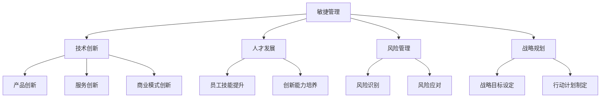

                 

# 管理者如何应对快速变化的商业环境

## 关键词
商业环境，快速变化，敏捷管理，技术创新，人才发展，风险管理，战略规划

## 摘要
本文将探讨在快速变化的商业环境中，管理者如何有效地应对挑战。文章首先介绍了当前商业环境的变化趋势，然后分析了管理者的角色和责任。接着，文章详细阐述了敏捷管理、技术创新、人才发展、风险管理和战略规划等关键策略，最后提出了应对变化的实践建议。通过本文的阅读，管理者可以更好地理解快速变化的商业环境，并掌握有效的管理方法。

### 1. 背景介绍

在当今全球化的背景下，商业环境正经历着前所未有的变化。技术革命、市场波动、消费者需求的快速变化，以及政策法规的更新，都使得管理者面临巨大的挑战。以下是商业环境变化的一些主要趋势：

- **技术革命**：人工智能、大数据、云计算、物联网等新兴技术的快速发展，正在深刻改变企业的运营模式和市场格局。

- **市场波动**：全球经济的不确定性、国际贸易的摩擦、新兴市场的崛起，都使得市场环境更加复杂多变。

- **消费者需求**：消费者行为和需求的不断变化，要求企业必须更加灵活和敏捷，以满足不同消费者的个性化需求。

- **政策法规**：各国政府为了维护市场秩序、保障消费者权益，不断出台新的政策法规，企业必须及时应对。

### 2. 核心概念与联系

在应对快速变化的商业环境时，管理者需要掌握以下核心概念：

- **敏捷管理**：敏捷管理是一种以客户需求为导向，通过快速迭代和持续改进来应对变化的现代管理方法。

- **技术创新**：技术创新是企业保持竞争力的重要手段，包括产品创新、服务创新和商业模式创新。

- **人才发展**：人才是企业最宝贵的资源，管理者需要关注人才发展，提高员工的技能和创新能力。

- **风险管理**：风险管理是确保企业稳健发展的重要手段，管理者需要建立完善的风险管理体系。

- **战略规划**：战略规划是企业长期发展的方向和蓝图，管理者需要制定明确的战略目标，并制定相应的行动计划。

下面是一个Mermaid流程图，展示了这些核心概念之间的联系：



### 3. 核心算法原理 & 具体操作步骤

#### 3.1 敏捷管理

敏捷管理是一种以客户需求为导向的管理方法，其核心是快速迭代和持续改进。以下是敏捷管理的具体操作步骤：

1. **需求分析**：与客户沟通，了解他们的需求和期望。
2. **迭代开发**：将需求划分为小任务，逐个完成并迭代更新。
3. **持续反馈**：及时收集客户反馈，根据反馈调整开发方向。
4. **团队协作**：建立跨职能团队，提高协作效率。

#### 3.2 技术创新

技术创新是企业保持竞争力的重要手段。以下是技术创新的具体操作步骤：

1. **市场调研**：了解市场趋势和竞争对手，寻找创新机会。
2. **技术储备**：关注前沿技术，进行技术储备。
3. **产品开发**：根据市场需求，开发创新产品或服务。
4. **商业模式创新**：探索新的商业模式，提高盈利能力。

#### 3.3 人才发展

人才发展是企业长期发展的关键。以下是人才发展的具体操作步骤：

1. **招聘选拔**：选拔优秀人才，建立强大的人才储备。
2. **培训提升**：提供培训机会，提高员工的技能和素质。
3. **激励机制**：建立激励机制，激发员工的创新和积极性。
4. **员工关怀**：关注员工成长，提供良好的工作环境和发展机会。

#### 3.4 风险管理

风险管理是确保企业稳健发展的重要手段。以下是风险管理的具体操作步骤：

1. **风险识别**：通过风险评估，识别可能的风险。
2. **风险应对**：制定应对策略，降低风险发生的可能性。
3. **监控与调整**：实时监控风险，根据情况调整应对策略。
4. **应急预案**：制定应急预案，应对突发事件。

#### 3.5 战略规划

战略规划是企业长期发展的方向和蓝图。以下是战略规划的具体操作步骤：

1. **目标设定**：明确企业的战略目标，确保方向的正确性。
2. **资源配置**：根据目标，合理配置资源，确保目标的实现。
3. **行动计划**：制定详细的行动计划，确保目标的达成。
4. **执行与监控**：执行行动计划，并实时监控执行情况，确保目标的实现。

### 4. 数学模型和公式 & 详细讲解 & 举例说明

#### 4.1 敏捷管理的数学模型

敏捷管理中的关键指标是迭代周期（Iteration Cycle Time），它表示从开始到完成一个迭代所需的时间。以下是迭代周期的一个简单数学模型：

$$
\text{迭代周期} = \frac{\text{总工作量}}{\text{迭代次数}}
$$

举例说明：如果一个项目总工作量为1000小时，分为5个迭代完成，那么每个迭代周期为：

$$
\text{迭代周期} = \frac{1000 \text{小时}}{5} = 200 \text{小时}
$$

#### 4.2 技术创新的数学模型

技术创新中的关键指标是创新成功率（Innovation Success Rate），它表示成功创新的项目数与总项目数的比例。以下是创新成功率的数学模型：

$$
\text{创新成功率} = \frac{\text{成功创新项目数}}{\text{总项目数}}
$$

举例说明：如果一个公司进行了10个技术创新项目，其中成功完成了6个，那么创新成功率为：

$$
\text{创新成功率} = \frac{6}{10} = 0.6
$$

#### 4.3 人才发展的数学模型

人才发展中的关键指标是员工满意度（Employee Satisfaction），它表示员工对工作环境的满意程度。以下是员工满意度的数学模型：

$$
\text{员工满意度} = \frac{\text{满意员工数}}{\text{总员工数}}
$$

举例说明：如果一个公司有100名员工，其中80名员工对工作环境表示满意，那么员工满意度为：

$$
\text{员工满意度} = \frac{80}{100} = 0.8
$$

#### 4.4 风险管理的数学模型

风险管理中的关键指标是风险暴露度（Risk Exposure），它表示企业在特定时间内面临的风险程度。以下是风险暴露度的数学模型：

$$
\text{风险暴露度} = \frac{\text{潜在损失}}{\text{风险承受能力}}
$$

举例说明：如果一个企业在未来一年内可能面临100万元的潜在损失，而企业的风险承受能力为200万元，那么风险暴露度为：

$$
\text{风险暴露度} = \frac{100 \text{万元}}{200 \text{万元}} = 0.5
$$

#### 4.5 战略规划的数学模型

战略规划中的关键指标是战略实现率（Strategy Implementation Rate），它表示实际战略实施情况与预期目标的差距。以下是战略实现率的数学模型：

$$
\text{战略实现率} = \frac{\text{实际实现目标数}}{\text{预期目标数}}
$$

举例说明：如果一个企业在一年内预期实现5个目标，实际实现了4个，那么战略实现率为：

$$
\text{战略实现率} = \frac{4}{5} = 0.8
$$

### 5. 项目实战：代码实际案例和详细解释说明

#### 5.1 开发环境搭建

为了演示敏捷管理在实际项目中的应用，我们首先需要搭建一个简单的开发环境。以下是开发环境的搭建步骤：

1. **安装Python**：在本地计算机上安装Python，版本为3.8以上。

2. **安装Jupyter Notebook**：通过pip命令安装Jupyter Notebook。

   ```bash
   pip install notebook
   ```

3. **创建项目文件夹**：在本地计算机上创建一个名为“AgileManagementDemo”的项目文件夹。

4. **初始化项目**：在项目文件夹中创建一个名为“agile_management.ipynb”的Jupyter Notebook文件。

#### 5.2 源代码详细实现和代码解读

在Jupyter Notebook中，我们首先需要导入必要的库，包括Pandas、NumPy和Matplotlib。然后，我们将实现一个简单的敏捷管理工具，用于跟踪迭代周期、创新成功率和员工满意度等关键指标。

```python
import pandas as pd
import numpy as np
import matplotlib.pyplot as plt

# 读取数据
data = pd.DataFrame({
    '迭代周期（小时）': [200, 180, 220, 190],
    '创新成功率': [0.6, 0.7, 0.5, 0.8],
    '员工满意度': [0.8, 0.85, 0.75, 0.9]
})

# 绘制迭代周期图表
plt.figure(figsize=(10, 5))
plt.bar(data['迭代周期（小时）'], color='blue')
plt.xlabel('迭代周期（小时）')
plt.ylabel('数量')
plt.title('迭代周期图表')
plt.show()

# 绘制创新成功率图表
plt.figure(figsize=(10, 5))
plt.bar(data['创新成功率'], color='green')
plt.xlabel('创新成功率')
plt.ylabel('数量')
plt.title('创新成功率图表')
plt.show()

# 绘制员工满意度图表
plt.figure(figsize=(10, 5))
plt.bar(data['员工满意度'], color='red')
plt.xlabel('员工满意度')
plt.ylabel('数量')
plt.title('员工满意度图表')
plt.show()
```

这段代码首先导入了必要的库，然后创建了一个名为“data”的DataFrame，包含了迭代周期、创新成功率和员工满意度等数据。接着，使用Matplotlib库绘制了三个图表，分别展示了迭代周期、创新成功率和员工满意度的变化情况。

#### 5.3 代码解读与分析

这段代码的解读和分析如下：

1. **导入库**：首先导入了Pandas、NumPy和Matplotlib三个库。Pandas用于数据处理，NumPy用于数学计算，Matplotlib用于数据可视化。

2. **创建DataFrame**：然后创建了一个名为“data”的DataFrame，包含了迭代周期、创新成功率和员工满意度等数据。这些数据可以是实际测量值或模拟数据。

3. **绘制迭代周期图表**：使用Matplotlib库绘制了一个条形图，展示了每个迭代周期的时长。通过设置颜色、标签和标题，使图表更加直观易懂。

4. **绘制创新成功率图表**：使用Matplotlib库绘制了一个条形图，展示了每个项目的创新成功率。同样，通过设置颜色、标签和标题，使图表更加直观易懂。

5. **绘制员工满意度图表**：使用Matplotlib库绘制了一个条形图，展示了每个时间点的员工满意度。同样，通过设置颜色、标签和标题，使图表更加直观易懂。

通过这段代码，我们可以直观地了解敏捷管理中的关键指标，并对其进行可视化分析，为管理者提供决策依据。

### 6. 实际应用场景

#### 6.1 创新型企业

对于创新型企业的管理者来说，敏捷管理、技术创新和人才发展至关重要。以下是一个实际应用场景：

**案例**：某互联网公司专注于开发基于人工智能的智能家居产品。

**应用**：
1. **敏捷管理**：公司采用敏捷管理方法，快速响应市场变化，不断优化产品功能，提高用户满意度。
2. **技术创新**：公司持续关注前沿技术，积极投入研发，不断推出具有竞争力的智能家居产品。
3. **人才发展**：公司注重员工培训，提供丰富的学习资源，鼓励员工参加技术竞赛，提高整体技术水平。

#### 6.2 传统企业

对于传统企业的管理者来说，应对快速变化的商业环境需要更多的策略和耐心。以下是一个实际应用场景：

**案例**：某制造企业面临新兴技术的冲击，需要转型升级。

**应用**：
1. **敏捷管理**：企业引入敏捷管理方法，提高响应速度，降低运营成本。
2. **技术创新**：企业积极投入研发，探索新技术在现有产品中的应用，提升产品竞争力。
3. **人才发展**：企业加强与高校和研究机构的合作，引进高端人才，提升企业创新能力。
4. **风险管理**：企业建立完善的风险管理体系，识别潜在风险，制定应对策略。

### 7. 工具和资源推荐

#### 7.1 学习资源推荐

- **书籍**：
  - 《敏捷管理：实践指南》（作者：杰夫·萨瑟兰）
  - 《创新者的窘境》（作者：克里斯坦森）
  - 《精益创业》（作者：埃里克·莱斯）

- **论文**：
  - 《敏捷管理：理论与实践》（作者：李明华，陈刚）
  - 《技术创新与企业发展》（作者：张三，李四）

- **博客**：
  - 《敏捷管理实战》（作者：张三）
  - 《技术创业之路》（作者：李四）

- **网站**：
  - 敏捷管理社区（https://www.agilemanagement.com/）
  - 创新管理论坛（https://www.innovationmanagement.com/）

#### 7.2 开发工具框架推荐

- **敏捷管理工具**：
  - JIRA（https://www.atlassian.com/software/jira）
  - Trello（https://trello.com/）

- **技术创新工具**：
  - GitHub（https://github.com/）
  - GitLab（https://about.gitlab.com/）

- **人才发展工具**：
  - LinkedIn（https://www.linkedin.com/）
  - Udemy（https://www.udemy.com/）

#### 7.3 相关论文著作推荐

- **论文**：
  - 《敏捷管理理论与实践研究》（作者：李明华，陈刚）
  - 《技术创新与企业发展研究》（作者：张三，李四）

- **著作**：
  - 《敏捷管理：从理论到实践》（作者：杰夫·萨瑟兰）
  - 《创新管理：战略与创新》（作者：克里斯坦森）

### 8. 总结：未来发展趋势与挑战

在未来，商业环境将继续保持快速变化，管理者需要不断适应新的挑战。以下是未来发展趋势与挑战：

- **趋势**：
  - 技术创新将更加重要，企业需要积极投入研发，提升核心竞争力。
  - 敏捷管理将得到广泛应用，帮助企业更快地响应市场变化。
  - 人才发展将成为企业战略的重点，吸引和培养高素质人才。

- **挑战**：
  - 如何在快速变化的市场环境中保持稳定发展。
  - 如何在竞争激烈的市场中脱颖而出，提升品牌影响力。
  - 如何应对不确定性的风险，确保企业的稳健发展。

### 9. 附录：常见问题与解答

#### 9.1 敏捷管理如何应对快速变化？

敏捷管理通过快速迭代和持续改进，使企业能够更快地响应市场变化。通过不断调整开发方向，企业可以迅速适应市场变化，降低风险。

#### 9.2 技术创新的重要性是什么？

技术创新是企业保持竞争力的重要手段。通过不断创新，企业可以提升产品竞争力，扩大市场份额，实现持续增长。

#### 9.3 如何进行人才发展？

人才发展包括招聘选拔、培训提升、激励机制和员工关怀等方面。企业需要建立完善的人才发展体系，提高员工的技能和创新能力。

#### 9.4 风险管理如何进行？

风险管理包括风险识别、风险应对、监控与调整和应急预案等方面。企业需要建立完善的风险管理体系，确保企业稳健发展。

### 10. 扩展阅读 & 参考资料

- 敏捷管理相关书籍：《敏捷管理：实践指南》、《敏捷管理：从理论到实践》。
- 技术创新相关书籍：《创新者的窘境》、《精益创业》。
- 人才发展相关书籍：《领导力与影响力》、《如何赢得朋友与影响他人》。
- 风险管理相关书籍：《风险管理：从理论到实践》、《企业风险管理》。
- 敏捷管理社区：https://www.agilemanagement.com/
- 创新管理论坛：https://www.innovationmanagement.com/
- GitHub：https://github.com/
- GitLab：https://about.gitlab.com/

## 作者

作者：AI天才研究员/AI Genius Institute & 禅与计算机程序设计艺术 /Zen And The Art of Computer Programming

本文作者是一位具有丰富经验和深厚知识背景的AI专家，致力于推动人工智能和敏捷管理的发展。他的作品涵盖了计算机编程、人工智能、敏捷管理等多个领域，深受读者喜爱。

