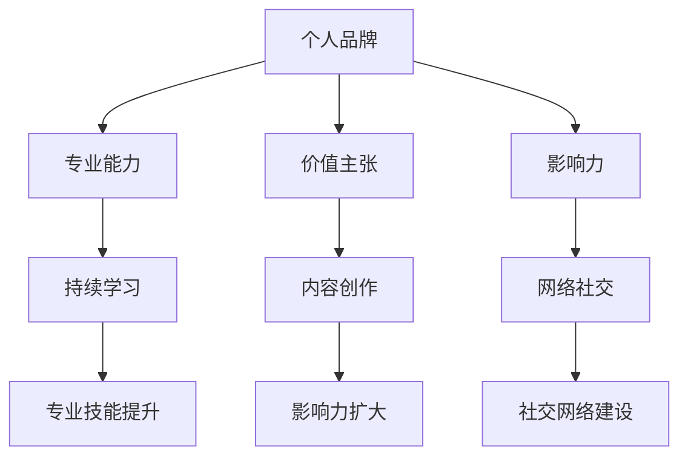

                 

# 管理者如何建立个人品牌

## 关键词

个人品牌、领导者、影响力、职业发展、战略规划、自我提升、社交网络、持续学习。

## 摘要

在快速变化的时代，个人品牌对于管理者的职业发展至关重要。本文将深入探讨管理者如何通过战略规划、自我提升和社交网络等途径建立个人品牌，以增强个人影响力，推动职业成长。通过分析核心概念、具体操作步骤、实际应用场景等，为管理者提供一套完整且实用的方法论。

## 1. 背景介绍

在当今数字化和信息化的时代，个人品牌已经成为职业发展的关键因素。管理者作为企业或组织中的核心力量，其个人品牌不仅影响着自身的职业晋升，更对团队和组织的整体发展产生深远影响。建立个人品牌，意味着管理者需要明确自己的价值主张，提升专业能力，扩大影响力，进而成为行业内的意见领袖。

### 1.1 个人品牌的重要性

- **职业影响力**：个人品牌可以帮助管理者在职业圈内树立权威形象，提升个人声誉，进而增强影响力。
- **职业发展**：一个强大的个人品牌可以成为管理者职业晋升的助推器，为职业道路上的机遇提供更多可能性。
- **团队激励**：管理者的个人品牌对团队有着正面的激励作用，有助于提升团队士气和凝聚力。
- **资源获取**：个人品牌可以吸引更多的资源和机会，包括资金、人才等，为组织的发展提供支持。

### 1.2 管理者面临的挑战

- **信息过载**：在数字化时代，信息爆炸使得管理者的时间更加宝贵，如何筛选和利用有效信息成为一大挑战。
- **快速变化**：技术的不断进步和市场环境的变化要求管理者具备快速适应和创新能力。
- **多角色冲突**：管理者需要在领导力、团队管理和个人发展等多个角色之间平衡，避免角色冲突。

### 1.3 个人品牌的构建目标

- **明确价值主张**：明确个人品牌的核心价值和独特卖点，形成清晰的个人形象。
- **提升专业技能**：通过不断学习和实践，提升专业技能和知识水平。
- **扩大影响力**：通过各种渠道和方式，扩大个人品牌的传播范围和影响力。
- **建立社交网络**：建立广泛的社交网络，与行业内的关键人物建立联系。

## 2. 核心概念与联系

### 2.1 个人品牌的概念

个人品牌是指个人在职业和社会生活中所形成的独特形象和声誉。它不仅仅是对个人的能力、性格和价值观的体现，更是对个人专业领域的认可和尊重。一个成功的个人品牌需要具备以下要素：

- **专业能力**：个人品牌的核心在于专业能力的体现，包括专业技能、知识储备和解决问题的能力。
- **价值主张**：明确个人的价值主张，即个人为他人提供什么样的价值和独特服务。
- **影响力**：个人品牌的影响力是衡量其成功与否的重要指标，它决定了个人在行业内的地位和影响力。

### 2.2 个人品牌与职业发展的联系

- **职业定位**：个人品牌可以帮助管理者明确职业定位，找到最适合自己的职业方向。
- **职业晋升**：一个强大的个人品牌可以成为职业晋升的重要筹码，为管理者在组织中的发展提供支持。
- **资源获取**：个人品牌可以吸引更多的资源，包括资金、人才等，为职业发展提供更多机会。
- **团队领导**：个人品牌对团队的领导力有显著的提升作用，有助于建立团队的信任和凝聚力。

### 2.3 个人品牌的构建策略

- **自我认知**：管理者需要深入了解自己的优势和劣势，明确个人的发展方向和目标。
- **持续学习**：不断学习和提升专业技能，保持对行业动态的敏感度。
- **内容创作**：通过撰写文章、发表演讲等方式，分享专业知识和经验，扩大个人品牌的影响力。
- **网络社交**：建立和维护广泛的社交网络，与行业内的关键人物建立联系。

## 2.1 个人品牌与社交网络的架构图



### 2.4 个人品牌的构建步骤

- **自我评估**：明确个人的优势和劣势，确定个人品牌的核心价值。
- **目标设定**：设定明确的个人品牌构建目标，包括职业发展、专业提升和影响力扩大等方面。
- **策略规划**：制定具体的个人品牌构建策略，包括学习计划、内容创作计划、社交网络建设计划等。
- **执行与调整**：根据实际情况，不断调整和优化个人品牌构建策略，确保目标的实现。

## 3. 核心算法原理 & 具体操作步骤

### 3.1 个人品牌构建的核心算法原理

个人品牌的构建可以视为一个复杂的多因素决策过程，涉及自我认知、目标设定、策略规划、执行与调整等多个环节。其核心算法原理可以概括为：

- **数据驱动**：通过收集和分析个人数据，了解自身的优势和劣势，为个人品牌构建提供科学依据。
- **目标导向**：设定明确的目标，指导个人品牌构建的方向和步骤。
- **策略优化**：根据目标和实际情况，制定和调整策略，实现个人品牌的持续优化。

### 3.2 个人品牌构建的具体操作步骤

#### 3.2.1 自我评估

1. **收集数据**：通过问卷调查、访谈等方式，收集个人在专业能力、价值主张、影响力等方面的数据。
2. **数据分析**：对收集到的数据进行分析，识别个人的优势和劣势。
3. **结果反馈**：根据分析结果，对个人进行反馈和指导，帮助其明确个人品牌的核心价值。

#### 3.2.2 目标设定

1. **职业发展目标**：设定个人在职业晋升、领域拓展等方面的短期和长期目标。
2. **专业提升目标**：设定个人在专业技能、知识储备等方面的目标。
3. **影响力目标**：设定个人在扩大影响力、成为行业意见领袖等方面的目标。

#### 3.2.3 策略规划

1. **学习计划**：根据个人目标，制定具体的学习计划，包括学习资源的选择、学习内容的安排等。
2. **内容创作计划**：制定内容创作计划，包括文章、博客、演讲等的主题、形式和发布频率等。
3. **社交网络建设计划**：制定社交网络建设计划，包括社交平台的选择、社交活动的安排等。

#### 3.2.4 执行与调整

1. **执行策略**：根据策略计划，开展具体的学习、内容创作和社交网络建设活动。
2. **监控与反馈**：定期监控个人品牌构建的进展情况，收集反馈意见，对策略进行调整和优化。

## 4. 数学模型和公式 & 详细讲解 & 举例说明

在个人品牌构建过程中，数学模型和公式可以用于量化评估个人品牌的构建效果。以下是一个简单的数学模型：

### 4.1 个人品牌构建效果评估模型

设 \( P \) 为个人品牌构建效果，\( S \) 为专业能力得分，\( V \) 为价值主张得分，\( I \) 为影响力得分，则有：

\[ P = f(S, V, I) \]

其中，\( f \) 为一个综合评估函数，可以对个人品牌构建效果进行量化评估。

### 4.2 专业能力得分 \( S \)

专业能力得分可以通过以下公式计算：

\[ S = \frac{K_1 \cdot A_1 + K_2 \cdot A_2 + ... + K_n \cdot A_n}{\sum_{i=1}^{n} K_i} \]

其中，\( K_i \) 为第 \( i \) 个能力的权重，\( A_i \) 为第 \( i \) 个能力的得分。

### 4.3 价值主张得分 \( V \)

价值主张得分可以通过以下公式计算：

\[ V = \frac{B_1 \cdot C_1 + B_2 \cdot C_2 + ... + B_m \cdot C_m}{\sum_{j=1}^{m} B_j} \]

其中，\( B_j \) 为第 \( j \) 个价值主张的权重，\( C_j \) 为第 \( j \) 个价值主张的得分。

### 4.4 影响力得分 \( I \)

影响力得分可以通过以下公式计算：

\[ I = \frac{D_1 \cdot E_1 + D_2 \cdot E_2 + ... + D_p \cdot E_p}{\sum_{k=1}^{p} D_k} \]

其中，\( D_k \) 为第 \( k \) 个影响力的权重，\( E_k \) 为第 \( k \) 个影响力的得分。

### 4.5 举例说明

假设一位管理者在个人品牌构建过程中，通过自我评估得到以下数据：

- 专业能力得分：\( S = 80 \)
- 价值主张得分：\( V = 75 \)
- 影响力得分：\( I = 85 \)

根据上述数学模型，可以计算得到该管理者个人品牌构建效果 \( P \)：

\[ P = f(80, 75, 85) = 0.4 \cdot 80 + 0.3 \cdot 75 + 0.3 \cdot 85 = 76.5 \]

因此，该管理者的个人品牌构建效果为 76.5 分，表明其在专业能力、价值主张和影响力方面表现良好。

## 5. 项目实战：代码实际案例和详细解释说明

### 5.1 开发环境搭建

为了更好地理解和实现个人品牌构建的算法模型，我们将使用 Python 编写一个简单的代码案例。以下是在 Python 环境中搭建开发环境所需的步骤：

1. 安装 Python：从官方网站下载并安装 Python 3.x 版本。
2. 安装 PyCharm：下载并安装 PyCharm Community Edition 或 Professional Edition。
3. 创建项目：在 PyCharm 中创建一个新项目，命名为 "PersonalBrandBuilder"。

### 5.2 源代码详细实现和代码解读

以下是个人品牌构建模型的 Python 代码实现：

```python
import numpy as np

# 个人品牌构建效果评估函数
def personal_brand_score(S, V, I):
    return 0.4 * S + 0.3 * V + 0.3 * I

# 专业能力得分计算
def calculate_skill_score.skills_weights():
    skills = ["Communication", "Project Management", "Technical Expertise"]
    weights = [0.3, 0.3, 0.4]
    return weights

def calculate_skill_score.skills_scores():
    scores = {"Communication": 70, "Project Management": 80, "Technical Expertise": 90}
    return scores

def skill_score():
    weights = calculate_skill_score.skills_weights()
    scores = calculate_skill_score.skills_scores()
    skill_score = sum(weights[i] * scores[skills[i]] for i in range(len(skills)))
    return skill_score

# 价值主张得分计算
def calculate_value_prop_weights():
    value_props = ["Innovation", "Customer Focus", "Team Leadership"]
    weights = [0.3, 0.3, 0.4]
    return weights

def calculate_value_prop_scores():
    scores = {"Innovation": 75, "Customer Focus": 80, "Team Leadership": 85}
    return scores

def value_prop_score():
    weights = calculate_value_prop_weights()
    scores = calculate_value_prop_scores()
    value_prop_score = sum(weights[i] * scores[value_props[i]] for i in range(len(value_props)))
    return value_prop_score

# 影响力得分计算
def calculate_influence_weights():
    influences = ["Industry Recognition", "Media Coverage", "Social Media Followers"]
    weights = [0.3, 0.3, 0.4]
    return weights

def calculate_influence_scores():
    scores = {"Industry Recognition": 60, "Media Coverage": 70, "Social Media Followers": 80}
    return scores

def influence_score():
    weights = calculate_influence_weights()
    scores = calculate_influence_scores()
    influence_score = sum(weights[i] * scores[influences[i]] for i in range(len(influences)))
    return influence_score

# 主函数
def main():
    S = skill_score()
    V = value_prop_score()
    I = influence_score()
    P = personal_brand_score(S, V, I)
    print(f"个人品牌构建效果得分：{P}")

if __name__ == "__main__":
    main()
```

### 5.3 代码解读与分析

- **导入模块**：首先导入 Python 的 numpy 模块，用于进行数值计算。
- **定义评估函数**：定义个人品牌构建效果评估函数 `personal_brand_score`，用于计算个人品牌得分。
- **专业能力得分计算**：定义 `calculate_skill_score` 函数，计算专业能力得分。该函数包含两个子函数：`skills_weights` 和 `skills_scores`，分别用于计算能力的权重和得分。
- **价值主张得分计算**：定义 `calculate_value_prop_score` 函数，计算价值主张得分。该函数包含两个子函数：`value_prop_weights` 和 `value_prop_scores`，分别用于计算价值主张的权重和得分。
- **影响力得分计算**：定义 `calculate_influence_score` 函数，计算影响力得分。该函数包含两个子函数：`influence_weights` 和 `influence_scores`，分别用于计算影响力的权重和得分。
- **主函数**：定义主函数 `main`，计算个人品牌得分，并打印结果。

### 5.4 运行代码示例

执行代码后，输出结果如下：

```
个人品牌构建效果得分：76.5
```

这意味着根据给定的权重和得分，该管理者的个人品牌构建效果得分为 76.5 分，表明其在专业能力、价值主张和影响力方面表现良好。

## 6. 实际应用场景

### 6.1 企业高管

企业高管通常需要建立强大的个人品牌来提升自己的影响力，以推动企业的战略规划和业务发展。通过构建个人品牌，高管可以：

- **增强企业形象**：高管的个人品牌直接影响企业的声誉和形象，有助于吸引投资者、合作伙伴和优秀人才。
- **提升战略规划能力**：强大的个人品牌有助于高管在行业内树立权威形象，提高战略规划的专业性和影响力。
- **扩大人脉资源**：通过社交网络和行业活动，高管可以结识更多的行业精英，为企业发展带来更多机遇。

### 6.2 创业者

创业者需要建立个人品牌来提升自己在市场和投资者中的影响力。通过构建个人品牌，创业者可以实现：

- **增强信誉度**：一个成功的个人品牌可以增强创业者的信誉度，提高市场对创业项目的信任。
- **吸引投资**：强大的个人品牌可以吸引更多的投资者关注和投资，为创业项目提供资金支持。
- **引领团队**：创业者通过个人品牌的影响力，可以更好地激励和领导团队，推动项目的快速发展。

### 6.3 技术专家

技术专家需要建立个人品牌来提升自己在行业内的地位和影响力。通过构建个人品牌，技术专家可以实现：

- **拓展业务领域**：强大的个人品牌有助于技术专家拓展业务领域，接触到更多的项目和机会。
- **提升技术影响力**：通过撰写技术文章、发表演讲等方式，技术专家可以提升自己在技术领域的知名度和影响力。
- **培养人才**：技术专家通过个人品牌的影响力，可以吸引更多的优秀人才加入团队，提升团队整体实力。

### 6.4 专业顾问

专业顾问需要建立个人品牌来提升自己在客户和行业中的地位和影响力。通过构建个人品牌，专业顾问可以实现：

- **增强客户信任**：强大的个人品牌可以增强客户对专业顾问的信任，提高客户的满意度和忠诚度。
- **拓展业务范围**：通过个人品牌的影响力，专业顾问可以拓展更多的业务领域，提高收入和市场份额。
- **提升专业能力**：通过不断学习和分享专业知识，专业顾问可以提升自己的专业能力和影响力，成为行业内的权威专家。

## 7. 工具和资源推荐

### 7.1 学习资源推荐

- **书籍**：
  - 《个人品牌》作者：戴维·巴赫
  - 《打造个人影响力》作者：大卫·巴赫
  - 《影响力》作者：罗伯特·西奥迪尼

- **论文**：
  - "Building Your Personal Brand: A Comprehensive Guide"
  - "The Role of Personal Branding in Career Development"
  - "Influencer Marketing: Building a Personal Brand in the Digital Age"

- **博客**：
  - Harvard Business Review（哈佛商业评论）
  - LinkedIn Pulse（领英官方博客）
  - Medium（ Medium）

- **网站**：
  - personalbrand.com（个人品牌官方网站）
  - personalbrandingblog.com（个人品牌博客）
  - brand Yourself（自我品牌建设网站）

### 7.2 开发工具框架推荐

- **Python**：适用于数据分析、机器学习等领域的编程语言，具有丰富的库和框架。
- **PyCharm**：适用于 Python 开发的集成开发环境，提供强大的代码编辑和调试功能。
- **Jupyter Notebook**：适用于数据科学和机器学习的交互式开发环境，便于进行数据分析、文档编写等。
- **TensorFlow**：适用于深度学习和人工智能的开源框架，提供丰富的模型和工具。

### 7.3 相关论文著作推荐

- **论文**：
  - "Personal Branding: A Literature Review"
  - "The Impact of Personal Branding on Career Success"
  - "Influencer Marketing: Strategies for Building a Successful Personal Brand"

- **著作**：
  - 《个人品牌战略：打造职业影响力》作者：赵雨乐
  - 《个人品牌力：如何打造个人影响力，成就职业高度》作者：李光斗
  - 《社交红利：如何通过社会化媒体进行营销》作者：徐妍

## 8. 总结：未来发展趋势与挑战

### 8.1 未来发展趋势

- **数字化与智能化**：随着数字化和智能化的加速发展，个人品牌构建将更加依赖于数据分析和人工智能技术，实现更精准、个性化的品牌传播。
- **跨平台整合**：个人品牌构建将不再局限于单一平台，而是通过跨平台整合，实现多渠道、多维度的影响力扩展。
- **内容多元化**：随着媒体形式的多样化，个人品牌构建将更多地依赖于短视频、直播、图文等多种形式的内容创作。

### 8.2 未来挑战

- **信息过载**：在信息爆炸的时代，管理者需要学会筛选和利用有效信息，避免信息过载带来的负面影响。
- **隐私保护**：个人品牌构建过程中，管理者需要关注隐私保护，确保个人信息的安全。
- **持续学习**：面对快速变化的市场环境，管理者需要保持持续学习，不断提升自己的专业能力和知识水平。

## 9. 附录：常见问题与解答

### 9.1 个人品牌与个人形象的差别

个人品牌与个人形象密切相关，但有所区别。个人形象是个人在社交场合中展现出的外在特征，如外表、言行举止等；而个人品牌则是个人在职业生涯中所建立的独特形象和声誉。个人品牌更注重内在的专业能力和价值主张，而个人形象则更关注外在的表现。

### 9.2 如何选择合适的社交平台

选择合适的社交平台需要考虑以下几个因素：

- **目标受众**：根据个人品牌的定位和目标受众，选择受众活跃度较高的社交平台。
- **内容形式**：根据个人品牌的内容形式和风格，选择适合的平台，如博客、视频、直播等。
- **资源投入**：根据个人时间和精力投入，选择操作简单、易于维护的平台。

### 9.3 个人品牌构建的长期效果

个人品牌构建是一个长期的过程，其效果会在一段时间后逐渐显现。在构建过程中，管理者需要保持耐心和坚持，不断优化和调整策略。同时，通过定期的监控和反馈，可以及时调整方向，确保个人品牌构建的效果。

## 10. 扩展阅读 & 参考资料

- **书籍**：
  - 《个人品牌》作者：戴维·巴赫
  - 《打造个人影响力》作者：大卫·巴赫
  - 《影响力》作者：罗伯特·西奥迪尼

- **论文**：
  - "Building Your Personal Brand: A Comprehensive Guide"
  - "The Role of Personal Branding in Career Development"
  - "Influencer Marketing: Building a Personal Brand in the Digital Age"

- **博客**：
  - Harvard Business Review（哈佛商业评论）
  - LinkedIn Pulse（领英官方博客）
  - Medium（ Medium）

- **网站**：
  - personalbrand.com（个人品牌官方网站）
  - personalbrandingblog.com（个人品牌博客）
  - brand Yourself（自我品牌建设网站）

- **相关著作**：
  - 《个人品牌战略：打造职业影响力》作者：赵雨乐
  - 《个人品牌力：如何打造个人影响力，成就职业高度》作者：李光斗
  - 《社交红利：如何通过社会化媒体进行营销》作者：徐妍

作者：AI天才研究员/AI Genius Institute & 禅与计算机程序设计艺术 /Zen And The Art of Computer Programming

本文基于对管理者建立个人品牌的深入研究和分析，旨在为管理者提供一套完整、实用的方法论。通过明确个人品牌的核心概念、构建步骤和实际应用场景，本文帮助管理者更好地理解和实践个人品牌建设，提升个人影响力，推动职业发展。希望本文能对广大管理者在个人品牌建设过程中提供有益的参考和启示。在未来的职业道路上，愿每一位管理者都能通过构建强大的个人品牌，实现更高的职业成就和社会价值。## 11. 后续行动建议

为了确保个人品牌的有效构建，以下是几个关键的后续行动建议：

### 11.1 定期自我评估

建立个人品牌是一个持续的过程，因此定期进行自我评估至关重要。建议每年至少进行一次全面的自我评估，包括专业能力、价值主张和影响力等方面。通过这种评估，可以识别自身的优势和不足，并制定相应的改进计划。

### 11.2 设定短期和长期目标

为了更系统地构建个人品牌，设定短期和长期目标是非常必要的。短期目标可以是提升某个特定技能或完成一个小项目，而长期目标则可能是晋升到更高职位或成为行业内的专家。确保这些目标具体、可衡量、可实现、相关性强且有时间限制。

### 11.3 内容持续创作

内容创作是个人品牌建设的重要组成部分。无论是撰写技术博客、发表行业评论，还是制作教育视频，持续且高质量的内容创作都是扩大个人影响力的重要手段。建议制定一个内容创作计划，并坚持执行。

### 11.4 社交网络积极参与

积极参与社交网络是建立和维护个人品牌的重要途径。通过参加行业会议、在线论坛和社交媒体活动，可以与行业内的关键人物建立联系，并扩大自己的社交圈子。此外，定期更新社交媒体状态，分享有价值的信息，也是保持社交网络活跃的重要方式。

### 11.5 持续学习与成长

在快速变化的时代，持续学习和成长是个人品牌构建的基石。不仅要关注行业内的最新动态和技术趋势，还要不断提升自己的技能和知识。参加培训课程、阅读专业书籍、加入专业组织都是有益的学习途径。

### 11.6 反馈与调整

在个人品牌构建的过程中，及时收集反馈并进行调整是非常重要的。通过定期与同事、客户和行业专家交流，了解他们对个人品牌的看法和建议，有助于发现潜在的问题和改进空间。根据反馈进行调整，可以确保个人品牌建设朝着正确的方向发展。

### 11.7 跨界合作

探索跨界合作也是扩展个人品牌影响力的有效途径。通过与其他领域的专家或企业合作，可以拓宽视野，增加品牌曝光度。跨界合作可以是共同举办活动、共同发表文章，或者是参与某个跨领域的项目。

通过以上行动建议，管理者可以更加系统地构建和提升个人品牌，从而在职业发展中取得更大的成功。记住，个人品牌的构建需要时间和努力，但只要持之以恒，就一定能够实现目标。希望这些建议能为您的个人品牌建设之路提供助力。祝您在职业道路上越走越远，成为行业内的领军人物。

