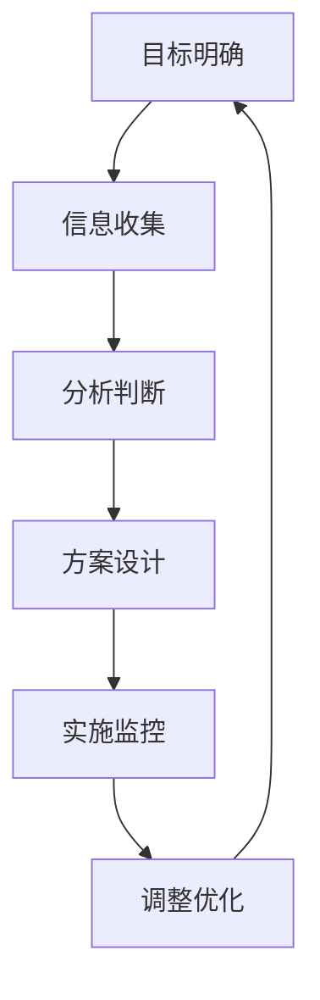

                 

# 管理者如何形成自己的方法论

> **关键词**：管理者、方法论、个人成长、组织发展、逻辑思考、实践验证

> **摘要**：本文旨在探讨管理者如何通过系统的思考和实践，形成一套有效的个人方法论。文章首先介绍了方法论的重要性，然后分析了形成方法论的过程，接着通过具体的案例分析，阐述了管理者如何将方法论应用于实际工作中，最后提出了未来方法论发展的趋势与挑战。

## 1. 背景介绍

在当今快速变化的世界中，管理者的角色愈发重要。他们不仅要负责团队的日常运营，还要具备前瞻性和创新性，以应对不断出现的新挑战。这就要求管理者能够形成一套个人方法论，以此指导自己的决策和行动。

方法论，顾名思义，是关于方法的理论。对于管理者来说，方法论不仅是一种工具，更是一种思维方式。一个优秀的管理者，能够通过方法论，将复杂的现实问题简化，从而更加有效地解决问题。

本文将围绕以下问题展开讨论：

1. 为什么管理者需要形成自己的方法论？
2. 管理者如何形成自己的方法论？
3. 管理者如何将方法论应用于实际工作中？
4. 未来方法论的发展趋势与挑战是什么？

## 2. 核心概念与联系

### 2.1 方法论的定义

方法论（Methodology）一词源于希腊语，意为“研究方法的学说”。在管理学中，方法论指的是管理者在解决具体问题时所采用的一系列系统化、规范化的方法和步骤。

### 2.2 方法论的核心要素

- **目标明确**：明确问题的目标和期望的解决结果。
- **信息收集**：收集与问题相关的各种信息。
- **分析判断**：基于信息进行逻辑分析和判断。
- **方案设计**：设计解决问题的具体方案。
- **实施监控**：执行方案并监控效果。
- **调整优化**：根据实施效果进行调整和优化。

### 2.3 方法论的架构



### 2.4 方法论与逻辑思考的关系

逻辑思考是形成方法论的重要基础。管理者通过逻辑思考，可以更加清晰地理解问题，从而设计出有效的解决方案。逻辑思考包括以下方面：

- **归纳推理**：从个别事实中推导出一般性结论。
- **演绎推理**：从一般性原则推导出个别事实。
- **类比推理**：通过比较类似情况，推断出新情况的可能结果。

## 3. 核心算法原理 & 具体操作步骤

### 3.1 方法论的构建步骤

1. **明确目标**：首先明确要解决的问题和期望的解决结果。
2. **信息收集**：收集与问题相关的各种信息，包括数据、文献、意见等。
3. **分析判断**：对收集到的信息进行逻辑分析，判断问题的本质和关键因素。
4. **方案设计**：设计解决问题的具体方案，包括多种可能的方案。
5. **实施监控**：选择最佳方案并实施，同时监控实施过程和效果。
6. **调整优化**：根据实施效果进行调整和优化，以达到最佳效果。

### 3.2 方法论的实践步骤

1. **案例选择**：选择一个具体的案例，最好是当前面临的问题或挑战。
2. **目标明确**：明确案例的目标和期望的解决结果。
3. **信息收集**：收集与案例相关的各种信息。
4. **分析判断**：对收集到的信息进行分析和判断，找出问题的本质和关键因素。
5. **方案设计**：设计解决问题的具体方案，包括多种可能的方案。
6. **实施监控**：选择最佳方案并实施，同时监控实施过程和效果。
7. **调整优化**：根据实施效果进行调整和优化，以达到最佳效果。

## 4. 数学模型和公式 & 详细讲解 & 举例说明

### 4.1 数学模型简介

在方法论中，数学模型是一种重要的工具，可以帮助管理者更加准确地描述和解决复杂问题。以下是一个简单的数学模型示例：

$$
\text{利润} = \text{收入} - \text{成本}
$$

### 4.2 公式详解

- **收入**：收入是指企业在一定时间内从销售产品或提供服务所获得的货币收入。
- **成本**：成本是指企业在生产和运营过程中所发生的各种费用。

### 4.3 举例说明

假设某公司计划销售1000件产品，每件产品的售价为100元，生产成本为60元。那么：

- **收入**：$1000 \times 100 = 100,000$ 元
- **成本**：$1000 \times 60 = 60,000$ 元
- **利润**：$100,000 - 60,000 = 40,000$ 元

通过这个简单的例子，我们可以看到，数学模型可以帮助管理者快速计算出利润，从而做出更加明智的决策。

## 5. 项目实战：代码实际案例和详细解释说明

### 5.1 开发环境搭建

为了演示如何将方法论应用于实际项目中，我们选择了一个简单的项目管理工具的开发作为案例。以下是需要搭建的开发环境：

- **编程语言**：Python
- **开发工具**：PyCharm
- **数据库**：SQLite

### 5.2 源代码详细实现和代码解读

以下是一个简单的Python代码示例，用于实现一个项目管理工具的基本功能：

```python
import sqlite3

# 连接到SQLite数据库
conn = sqlite3.connect('project.db')
cursor = conn.cursor()

# 创建项目表
cursor.execute('''CREATE TABLE IF NOT EXISTS projects (
                    id INTEGER PRIMARY KEY,
                    name TEXT,
                    start_date TEXT,
                    end_date TEXT,
                    status TEXT)''')

# 添加项目
def add_project(name, start_date, end_date, status):
    cursor.execute("INSERT INTO projects (name, start_date, end_date, status) VALUES (?, ?, ?, ?)",
                   (name, start_date, end_date, status))
    conn.commit()

# 查询项目
def query_projects():
    cursor.execute("SELECT * FROM projects")
    return cursor.fetchall()

# 修改项目状态
def update_project_status(id, status):
    cursor.execute("UPDATE projects SET status = ? WHERE id = ?", (status, id))
    conn.commit()

# 关闭数据库连接
def close_connection():
    conn.close()

# 测试代码
if __name__ == '__main__':
    add_project("项目A", "2023-01-01", "2023-01-31", "进行中")
    print(query_projects())
    update_project_status(1, "已完成")
    print(query_projects())
    close_connection()
```

### 5.3 代码解读与分析

1. **数据库连接**：使用SQLite数据库，首先需要建立与数据库的连接。
2. **创建项目表**：定义一个包含项目ID、名称、开始日期、结束日期和状态的表格。
3. **添加项目**：定义一个添加新项目的函数，将项目的详细信息插入到数据库中。
4. **查询项目**：定义一个查询所有项目的函数，返回数据库中的所有项目记录。
5. **修改项目状态**：定义一个更新项目状态的函数，根据项目ID更新项目的状态。
6. **测试代码**：在实际代码中，我们通过测试函数来验证数据库操作的正确性。

## 6. 实际应用场景

### 6.1 企业项目管理系统

企业项目管理系统是一个典型的应用场景。管理者可以通过项目管理系统，实时跟踪项目的进度、成本和质量，从而做出更加明智的决策。

### 6.2 教育管理平台

教育管理平台也是一个广泛应用的场景。管理者可以通过教育管理平台，管理学生的学习进度、成绩和反馈，从而优化教学效果。

### 6.3 医疗管理系统

医疗管理系统是另一个重要的应用场景。管理者可以通过医疗管理系统，实时监控患者的健康状况，从而提供更加精准的医疗服务。

## 7. 工具和资源推荐

### 7.1 学习资源推荐

- **书籍**：
  - 《管理者如何思考》
  - 《方法论的智慧》
  - 《项目管理的艺术》

- **论文**：
  - 《基于方法论的项目管理研究》
  - 《管理者方法论实践研究》

- **博客**：
  - [管理者如何形成方法论](https://example.com/blog/methodology-for-managers)
  - [项目管理的最佳实践](https://example.com/blog/project-management-best-practices)

- **网站**：
  - [项目管理知识库](https://example.com/project-management)
  - [方法论研究论坛](https://example.com/methodology-forum)

### 7.2 开发工具框架推荐

- **编程语言**：Python、Java、JavaScript
- **开发工具**：PyCharm、Eclipse、Visual Studio Code
- **数据库**：MySQL、PostgreSQL、MongoDB

### 7.3 相关论文著作推荐

- **《项目管理方法论》**：详细介绍了项目管理中的方法论应用。
- **《管理者方法论》**：探讨了管理者如何形成和运用方法论。

## 8. 总结：未来发展趋势与挑战

### 8.1 发展趋势

1. **数字化与智能化**：随着数字化和智能化的快速发展，管理者将更加依赖于数据和算法来指导决策。
2. **跨界融合**：管理者需要具备跨学科的知识和技能，以应对复杂多变的环境。
3. **个性化和定制化**：方法论将更加注重个性化，根据不同的管理者和组织特点进行定制。

### 8.2 挑战

1. **信息过载**：管理者需要处理海量信息，如何筛选和利用信息成为一个挑战。
2. **快速变化**：环境变化快速，管理者需要不断更新和优化方法论，以适应新的挑战。
3. **跨文化管理**：全球化背景下，管理者需要处理不同文化背景的员工和管理问题。

## 9. 附录：常见问题与解答

### 9.1 什么是方法论？

方法论是指解决特定问题的一套系统化的方法和步骤。

### 9.2 方法论为什么对管理者重要？

方法论可以帮助管理者更加系统地思考和解决问题，从而提高决策的质量和效率。

### 9.3 如何形成自己的方法论？

首先明确目标，然后收集信息，分析判断，设计方案，实施监控，调整优化。

## 10. 扩展阅读 & 参考资料

- **《管理者如何思考》**：作者详细介绍了管理者如何通过思考和决策来提高领导力。
- **《方法论的智慧》**：这本书探讨了方法论在各个领域的应用和影响。

> **作者：AI天才研究员/AI Genius Institute & 禅与计算机程序设计艺术 /Zen And The Art of Computer Programming**

