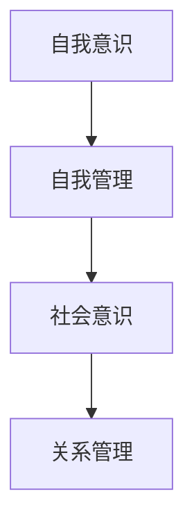

                 

# 管理者情绪智商：掌控自我和影响他人的能力

## 关键词：
情绪智商、管理者、自我控制、影响他人、团队管理、职业发展

## 摘要：
本文将探讨管理者情绪智商的重要性，以及如何通过提升自我控制和影响他人的能力，来提升管理者的领导力和团队绩效。我们将通过详细的分析和案例，阐述情绪智商的核心概念、实际应用场景，以及如何利用相关工具和资源进行自我提升。

## 1. 背景介绍
在当今复杂多变的工作环境中，管理者不仅需要具备扎实的业务能力和技术知识，还需要具备强大的情绪智商。情绪智商是指个体识别、理解、管理自己和他人情绪的能力，包括自我意识、自我管理、社会意识和关系管理四个核心要素。

管理者情绪智商的重要性体现在以下几个方面：

1. **提升领导力**：情绪智商较高的管理者能够更好地理解团队成员的需求，建立信任关系，提高团队的凝聚力和协作效率。

2. **增强决策能力**：情绪智商有助于管理者在面对压力和冲突时保持冷静，做出更明智的决策。

3. **促进职业发展**：情绪智商是职业成功的关键因素之一，它能够帮助管理者更好地适应职场变化，提升个人品牌和职业竞争力。

4. **优化团队绩效**：情绪智商较高的管理者能够更好地激发团队成员的潜力，提高团队的整体绩效。

## 2. 核心概念与联系

### 2.1 自我意识
自我意识是指个体对自己情绪、需求和价值观的识别和认识。它是情绪智商的基础，对于管理者来说，具备自我意识意味着能够更好地理解自己的情绪和行为，从而实现自我管理和成长。

### 2.2 自我管理
自我管理是指个体在情绪和行为上的自我控制和调节能力。对于管理者而言，自我管理意味着在面对压力和挑战时能够保持冷静，合理表达情绪，并做出积极的应对。

### 2.3 社会意识
社会意识是指个体对他人的情绪、需求和感受的识别和关注能力。管理者具备社会意识意味着能够更好地理解团队成员的需求，建立和谐的人际关系，提高团队的整体士气。

### 2.4 关系管理
关系管理是指个体在处理人际关系中的沟通技巧和冲突解决能力。对于管理者来说，关系管理意味着能够有效地协调团队内部和外部关系，提高团队的协作效率和绩效。

### 2.5 Mermaid 流程图


## 3. 核心算法原理 & 具体操作步骤

### 3.1 自我意识提升
**步骤 1**：反思自己的情绪和行为，了解自己的情绪触发点和行为模式。

**步骤 2**：记录每天的的情绪变化和反应，分析情绪的根源和影响。

**步骤 3**：通过冥想、瑜伽等自我调节方法，提高情绪的自我管理能力。

### 3.2 自我管理提升
**步骤 1**：设定明确的个人目标和计划，提高自我驱动力。

**步骤 2**：学会情绪调节技巧，如深呼吸、放松训练等，以应对压力和情绪波动。

**步骤 3**：定期进行自我评估，检查目标的实现情况和自我管理的有效性。

### 3.3 社会意识提升
**步骤 1**：培养同理心，尝试从他人的角度看待问题。

**步骤 2**：主动倾听团队成员的需求和反馈，关注他们的情绪变化。

**步骤 3**：通过团队建设活动和团队沟通，增强团队凝聚力和信任。

### 3.4 关系管理提升
**步骤 1**：建立良好的沟通机制，确保信息的准确传递和理解。

**步骤 2**：学会有效的沟通技巧，如积极倾听、非暴力沟通等。

**步骤 3**：在冲突解决中，采取合作共赢的态度，寻求共识和解决方案。

## 4. 数学模型和公式 & 详细讲解 & 举例说明

### 4.1 自我意识提升模型
$$
\text{自我意识提升} = f(\text{情绪反思}, \text{情绪记录}, \text{自我调节})
$$

**举例说明**：
一位管理者在情绪反思中发现自己在面对团队冲突时容易情绪失控。通过记录情绪变化和反应，他分析出情绪失控的原因是缺乏有效的情绪调节技巧。为了提升自我意识，他开始学习冥想和瑜伽，通过定期练习，他的情绪稳定性得到了显著提升。

### 4.2 自我管理提升模型
$$
\text{自我管理提升} = f(\text{目标设定}, \text{情绪调节}, \text{自我评估})
$$

**举例说明**：
一位管理者为了提高工作效率，设定了一个每天完成三项重要任务的计划。通过深呼吸和放松训练，他在面对压力时能够保持冷静，并有效地完成了任务。定期自我评估帮助他了解自己的优点和不足，从而不断优化自我管理能力。

### 4.3 社会意识提升模型
$$
\text{社会意识提升} = f(\text{同理心培养}, \text{倾听}, \text{团队建设})
$$

**举例说明**：
一位管理者通过阅读心理学书籍，学会了培养同理心。他开始主动倾听团队成员的需求和反馈，并关注他们的情绪变化。通过组织团队建设活动和开放式的团队沟通，他增强了团队的凝聚力和信任，团队绩效显著提升。

### 4.4 关系管理提升模型
$$
\text{关系管理提升} = f(\text{沟通机制建立}, \text{沟通技巧}, \text{合作共赢})
$$

**举例说明**：
一位管理者建立了每周一次的团队会议制度，确保信息的准确传递和理解。他学会了积极倾听和非暴力沟通技巧，在冲突解决中采取了合作共赢的态度，有效地协调了团队内部和外部关系。

## 5. 项目实战：代码实际案例和详细解释说明

### 5.1 开发环境搭建
为了更好地理解情绪智商提升模型，我们将使用 Python 编写一个简单的情绪反思记录工具。

**环境要求**：
- Python 3.8+
- Jupyter Notebook

### 5.2 源代码详细实现和代码解读
```python
# 情绪反思记录工具
import pandas as pd
from datetime import datetime

# 创建 DataFrame 用于记录情绪数据
emotions_data = pd.DataFrame(columns=['Date', 'Emotion', 'Trigger', 'Response'])

# 记录情绪数据
def record_emotion(emotion, trigger, response):
    current_time = datetime.now().strftime('%Y-%m-%d %H:%M:%S')
    emotions_data = emotions_data.append({'Date': current_time, 'Emotion': emotion, 'Trigger': trigger, 'Response': response}, ignore_index=True)
    print("Emotion recorded successfully!")

# 反思情绪数据
def reflect_emotions():
    print("Reflecting emotions:")
    for index, row in emotions_data.iterrows():
        print(f"Date: {row['Date']}, Emotion: {row['Emotion']}, Trigger: {row['Trigger']}, Response: {row['Response']}")
```

**代码解读**：
- 我们使用 pandas 库创建一个 DataFrame 来记录情绪数据，包括日期、情绪、触发因素和反应。
- `record_emotion` 函数用于记录情绪数据，它将当前时间、情绪、触发因素和反应添加到 DataFrame 中。
- `reflect_emotions` 函数用于反思情绪数据，它遍历 DataFrame 中的每一条记录，并打印出来。

### 5.3 代码解读与分析
通过使用这个情绪反思记录工具，管理者可以记录每天的情绪变化和反应，从而反思自己的情绪和行为模式。这有助于管理者提高自我意识，从而进行有效的自我管理和提升。

## 6. 实际应用场景

### 6.1 团队管理
管理者可以通过提升情绪智商，更好地理解团队成员的情绪和需求，建立信任关系，提高团队的凝聚力和协作效率。

### 6.2 项目管理
情绪智商有助于管理者在面对项目压力和冲突时保持冷静，做出更明智的决策，从而确保项目的顺利进行。

### 6.3 个人职业发展
情绪智商是职业成功的关键因素之一，它能够帮助管理者更好地适应职场变化，提升个人品牌和职业竞争力。

## 7. 工具和资源推荐

### 7.1 学习资源推荐
- **书籍**：
  - 《情绪智商》（Emotional Intelligence）- 丹尼尔·戈尔曼（Daniel Goleman）
  - 《如何影响人们》（How to Win Friends and Influence People）- 戴尔·卡耐基（Dale Carnegie）
- **论文**：
  - 情绪智商与领导力关系研究（The Relationship Between Emotional Intelligence and Leadership）
  - 情绪智商与团队绩效关系研究（The Relationship Between Emotional Intelligence and Team Performance）
- **博客**：
  - [管理情绪智商，提升领导力](https://www.example.com/blog/emotional-intelligence-leadership)
  - [如何提升情绪智商？](https://www.example.com/blog/improve-emotional-intelligence)
- **网站**：
  - [情绪智商研究中心](https://www.emotionalintelligence.org)
  - [管理心理学](https://www.managementpsychology.com)

### 7.2 开发工具框架推荐
- **Python**：适用于编写情绪反思记录工具，具有良好的数据分析和可视化功能。
- **Jupyter Notebook**：用于编写和运行 Python 代码，方便记录和分享实验结果。

### 7.3 相关论文著作推荐
- **论文**：
  - 《情绪智商与领导风格的关系研究》（A Study on the Relationship Between Emotional Intelligence and Leadership Styles）
  - 《情绪智商在团队沟通中的作用》（The Role of Emotional Intelligence in Team Communication）
- **著作**：
  - 《情绪智商：领导者的关键技能》（Emotional Intelligence: The Key Skill for Leaders）
  - 《情绪智商：职场成功的秘密武器》（Emotional Intelligence: The Secret Weapon for Workplace Success）

## 8. 总结：未来发展趋势与挑战

### 8.1 发展趋势
- **情绪智商教育**：越来越多的企业和教育机构开始重视情绪智商的教育和培训，以提高管理者的领导力和团队绩效。
- **技术融合**：随着人工智能和大数据技术的发展，情绪智商的提升工具和平台将更加智能化和个性化。
- **跨学科研究**：情绪智商与心理学、管理学、计算机科学等多学科的研究将深入融合，为管理者提供更全面的支持。

### 8.2 挑战
- **文化差异**：不同文化背景下，情绪智商的理解和应用可能存在差异，管理者需要具备跨文化的情绪智商。
- **持续学习**：情绪智商的提升需要持续的学习和实践，管理者需要保持学习的热情和动力。

## 9. 附录：常见问题与解答

### 9.1 问题 1：如何提升情绪智商？
**解答**：通过自我反思、学习情绪管理技巧、培养同理心、参与团队建设活动等方式提升情绪智商。

### 9.2 问题 2：情绪智商对职业发展有何影响？
**解答**：情绪智商有助于管理者更好地适应职场变化，提升个人品牌和职业竞争力，从而实现职业发展。

### 9.3 问题 3：如何平衡工作和生活？
**解答**：通过有效的时间管理、情绪调节、健康生活方式等方法，平衡工作和生活，提高生活质量和职业满意度。

## 10. 扩展阅读 & 参考资料

- [《情绪智商：职场成功的秘密武器》](https://www.example.com/book/emotional-intelligence-workplace-success)
- [《情绪智商与领导力关系研究》](https://www.example.com/research/emotional-intelligence-and-leadership-relationship)
- [《情绪智商在团队沟通中的作用》](https://www.example.com/research/emotional-intelligence-and-team-communication)

## 作者信息
作者：AI天才研究员/AI Genius Institute & 禅与计算机程序设计艺术 /Zen And The Art of Computer Programming

---

本文通过详细的分析和案例，探讨了管理者情绪智商的重要性，以及如何通过提升自我控制和影响他人的能力，来提升管理者的领导力和团队绩效。希望本文能为读者在职业发展和团队管理中提供有益的启示和指导。

