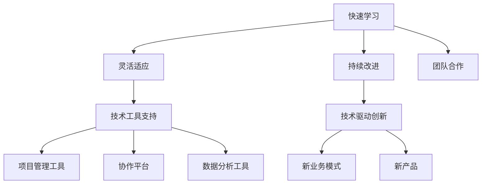

                 

# 管理者的思维敏捷度训练

## 摘要

在当今快速变化的技术环境中，管理者需要具备敏捷的思维模式，以应对不断涌现的新技术和挑战。本文将探讨管理者的思维敏捷度的重要性，通过分析核心概念、介绍关键算法原理，提供实际操作步骤和数学模型，展示如何在项目中实践这些技能，并探讨实际应用场景。最后，我们将推荐一些工具和资源，帮助管理者提升思维敏捷度，总结未来发展趋势与挑战，并提供常见问题与解答。

## 1. 背景介绍

### 管理者的角色与责任

管理者在现代企业中扮演着至关重要的角色。他们不仅要负责制定战略，还要管理团队、协调资源，并确保组织目标的实现。随着技术的迅猛发展，管理者的工作变得更加复杂和具有挑战性。传统的管理方法可能不再适用于快速变化的环境，因此，管理者需要具备敏捷的思维模式，以适应新的挑战。

### 思维敏捷度的定义

思维敏捷度是指个体在面对变化和不确定性时，能够快速适应、创新和解决问题的能力。在技术领域，这种能力尤为重要，因为新技术不断涌现，管理者需要迅速了解这些技术的特点和应用，以便做出明智的决策。

### 思维敏捷度的价值

思维敏捷度的价值体现在多个方面。首先，它能够帮助管理者更好地应对市场变化，抓住新的机遇。其次，它能够促进团队的创新和协作，提高组织的竞争力。最后，思维敏捷度有助于管理者降低风险，避免因决策失误而导致的不必要的损失。

## 2. 核心概念与联系

### 敏捷思维的核心概念

敏捷思维的核心概念包括快速学习、灵活适应、持续改进和团队合作。这些概念相互关联，共同构成了敏捷思维的基础。

#### 快速学习

快速学习是指管理者能够迅速掌握新知识和新技能。在技术领域，这意味着管理者需要不断更新自己的知识库，了解最新的技术趋势和工具。

#### 灵活适应

灵活适应是指管理者能够根据变化调整自己的策略和行动。在快速变化的环境中，管理者需要具备应对不确定性的能力，灵活地调整自己的方法和决策。

#### 持续改进

持续改进是指管理者不断寻求改进和创新的机会。通过不断反思和优化，管理者可以提升团队和组织的效率和质量。

#### 团队合作

团队合作是指管理者能够有效地与团队成员合作，共同实现目标。在敏捷思维中，团队合作是成功的关键因素。

### 敏捷思维与技术的联系

敏捷思维与技术紧密相连。技术的快速变化要求管理者能够迅速掌握新技术，并将其应用到实际工作中。同时，技术本身也提供了新的工具和方法，帮助管理者提升思维敏捷度。

#### 技术工具的支持

技术工具的支持是敏捷思维的重要组成部分。例如，项目管理工具可以帮助管理者更有效地协调资源，协作平台可以提高团队的沟通效率，数据分析工具可以帮助管理者更准确地了解市场动态。

#### 技术驱动创新

技术驱动创新是敏捷思维的重要体现。通过利用新技术，管理者可以推动组织的创新，创造新的业务模式和产品。

### Mermaid 流程图

以下是敏捷思维核心概念和技术的 Mermaid 流程图：



## 3. 核心算法原理 & 具体操作步骤

### 敏捷思维算法原理

敏捷思维算法的核心是不断学习和适应。以下是敏捷思维算法的基本原理：

1. **数据收集**：管理者需要不断收集和分析与新技术和市场相关的数据。
2. **模式识别**：通过分析数据，管理者可以识别出新的趋势和模式。
3. **快速反应**：管理者需要根据识别出的趋势和模式，快速调整策略和行动。
4. **持续改进**：管理者需要不断反思和优化自己的决策过程，以实现持续改进。

### 具体操作步骤

以下是管理者如何应用敏捷思维算法的具体操作步骤：

1. **设立目标**：管理者首先需要明确自己的目标，这些目标应该与组织的战略和愿景保持一致。
2. **数据收集**：管理者需要通过各种渠道收集与目标相关的数据，包括市场报告、用户反馈和行业动态。
3. **数据分析**：管理者需要分析收集到的数据，识别出新的趋势和模式。
4. **快速反应**：根据分析结果，管理者需要快速调整策略和行动，以抓住新的机遇或应对挑战。
5. **持续改进**：管理者需要不断反思和优化自己的决策过程，以提高决策的质量和效率。

### 实际案例

以下是一个实际案例，说明如何应用敏捷思维算法：

假设一家企业计划开发一款新的应用程序。管理者需要：

1. **设立目标**：明确开发新应用程序的目标，例如提高用户满意度，增加市场份额。
2. **数据收集**：收集用户反馈、市场报告和竞争对手的分析数据。
3. **数据分析**：分析用户反馈和市场报告，识别出用户需求和市场趋势。
4. **快速反应**：根据分析结果，调整开发计划，增加对用户需求突出的功能，减少不必要的功能。
5. **持续改进**：在开发过程中，持续收集用户反馈，根据反馈进行迭代优化，以实现最终目标。

## 4. 数学模型和公式 & 详细讲解 & 举例说明

### 数学模型

敏捷思维算法可以抽象为一个数学模型，如下所示：

\[ \text{敏捷思维} = f(\text{数据收集}, \text{模式识别}, \text{快速反应}, \text{持续改进}) \]

其中，\( f \) 表示敏捷思维函数，它将数据收集、模式识别、快速反应和持续改进四个因素结合起来，产生敏捷思维。

### 详细讲解

1. **数据收集**：数据收集是敏捷思维的基础。管理者需要通过各种渠道收集与目标相关的数据，包括内部数据（如用户反馈、销售数据）和外部数据（如市场报告、行业动态）。

2. **模式识别**：模式识别是分析数据的过程。管理者需要从大量数据中提取有价值的信息，识别出新的趋势和模式。这可以通过数据挖掘和统计分析等技术实现。

3. **快速反应**：快速反应是敏捷思维的核心。管理者需要根据分析结果，迅速调整策略和行动，以抓住新的机遇或应对挑战。

4. **持续改进**：持续改进是敏捷思维的持续过程。管理者需要不断反思和优化自己的决策过程，以提高决策的质量和效率。

### 举例说明

假设一个管理者正在考虑是否投资一个新技术项目。以下是应用敏捷思维模型的步骤：

1. **数据收集**：管理者收集了关于新技术项目的市场报告、用户反馈和行业趋势数据。
2. **模式识别**：通过分析数据，管理者发现新技术项目与当前市场趋势相匹配，并且有潜在的市场需求。
3. **快速反应**：管理者根据分析结果，决定投资新技术项目，并制定了相应的开发计划。
4. **持续改进**：在项目开发过程中，管理者持续收集用户反馈，并根据反馈进行调整，以优化项目结果。

## 5. 项目实战：代码实际案例和详细解释说明

### 5.1 开发环境搭建

在开始项目实战之前，我们需要搭建一个合适的开发环境。以下是一个简单的 Python 开发环境搭建步骤：

1. **安装 Python**：从 [Python 官网](https://www.python.org/) 下载并安装 Python。
2. **安装 IDE**：选择一个合适的集成开发环境（IDE），例如 PyCharm 或 Visual Studio Code。
3. **安装依赖**：安装必要的依赖库，例如 NumPy、Pandas 等。

### 5.2 源代码详细实现和代码解读

以下是一个简单的 Python 示例，用于实现敏捷思维模型：

```python
import numpy as np
import pandas as pd

# 数据收集
def collect_data():
    # 从文件中读取数据
    data = pd.read_csv('data.csv')
    return data

# 模式识别
def identify_patterns(data):
    # 分析数据并识别模式
    patterns = data.describe()
    return patterns

# 快速反应
def quick_reaction(patterns):
    # 根据模式调整策略
    strategy = "Invest in new technology"
    return strategy

# 持续改进
def continuous_improvement(data, strategy):
    # 根据反馈持续优化
    new_data = pd.read_csv('new_data.csv')
    updated_strategy = "Adjust investment based on new data"
    return updated_strategy

# 主函数
def main():
    data = collect_data()
    patterns = identify_patterns(data)
    strategy = quick_reaction(patterns)
    print(f"Initial Strategy: {strategy}")
    
    updated_strategy = continuous_improvement(data, strategy)
    print(f"Updated Strategy: {updated_strategy}")

if __name__ == "__main__":
    main()
```

### 5.3 代码解读与分析

1. **数据收集**：`collect_data` 函数用于从文件中读取数据。在实际应用中，数据可以从数据库、API 或其他数据源读取。
2. **模式识别**：`identify_patterns` 函数用于分析数据并识别模式。这里使用了 Pandas 库的 `describe` 方法，它提供了数据的描述性统计信息。
3. **快速反应**：`quick_reaction` 函数根据模式调整策略。这里简单地根据模式选择了投资新技术的策略。
4. **持续改进**：`continuous_improvement` 函数用于根据反馈持续优化策略。这里假设有新的数据文件，我们再次读取数据并更新策略。
5. **主函数**：`main` 函数是程序的入口。它依次调用了数据收集、模式识别、快速反应和持续改进函数，并打印了初始策略和更新后的策略。

通过这个简单的示例，我们可以看到如何将敏捷思维模型应用到实际编程中。在实际项目中，代码会更为复杂，但基本原理是相同的。

## 6. 实际应用场景

### 6.1 企业战略规划

在企业战略规划中，管理者需要运用敏捷思维来快速适应市场变化，制定和调整战略。例如，当市场出现新的技术趋势时，管理者需要迅速了解这些技术的特点和应用，并调整企业的战略方向，以抓住新的机遇。

### 6.2 项目管理

在项目管理中，敏捷思维可以帮助管理者更有效地协调资源，提高项目的成功率。通过快速学习、灵活适应和持续改进，管理者可以更好地应对项目中的不确定性，确保项目按时完成。

### 6.3 团队协作

在团队协作中，敏捷思维有助于提高团队的沟通效率和创新能力。通过团队合作和持续改进，管理者可以激发团队成员的积极性，共同实现目标。

### 6.4 产品开发

在产品开发中，敏捷思维可以帮助管理者快速迭代产品，提高产品的质量和用户满意度。通过快速学习和灵活适应，管理者可以及时响应用户需求，优化产品功能。

## 7. 工具和资源推荐

### 7.1 学习资源推荐

1. **书籍**：
   - 《敏捷开发实践指南》（作者：杰夫·萨瑟兰）
   - 《精益创业》（作者：埃里克·莱斯）

2. **论文**：
   - 《敏捷管理：理论与实践》（作者：Kathleen M. Carley）

3. **博客**：
   - [Scrum Alliance](https://www.scrumalliance.org/)
   - [Agile Management](https://www.agilemanagement.info/)

4. **网站**：
   - [Agile Alliance](https://www.agilealliance.org/)

### 7.2 开发工具框架推荐

1. **项目管理工具**：
   - Jira
   - Trello

2. **协作平台**：
   - Slack
   - Microsoft Teams

3. **数据分析工具**：
   - Tableau
   - Power BI

### 7.3 相关论文著作推荐

1. **《敏捷管理：理论与实践》**（作者：Kathleen M. Carley）
2. **《敏捷企业：如何通过敏捷管理提高组织的效率与创新能力》**（作者：John P. Kotter）

## 8. 总结：未来发展趋势与挑战

### 未来发展趋势

1. **技术的持续创新**：随着人工智能、大数据、云计算等技术的快速发展，管理者需要不断学习和适应新的技术趋势。
2. **数字化转型的深化**：越来越多的企业将数字化转型作为战略重点，管理者需要具备敏捷的思维模式，以推动组织的数字化转型。
3. **团队协作的增强**：随着远程工作的普及，团队协作的重要性日益凸显，管理者需要运用敏捷思维提高团队的协作效率。

### 未来挑战

1. **技能缺口**：随着技术的快速发展，管理者需要不断更新自己的知识和技能，以应对不断变化的挑战。
2. **信息过载**：在信息爆炸的时代，管理者需要具备筛选和利用信息的能力，避免信息过载。
3. **文化变革**：敏捷思维需要组织文化的支持，管理者需要推动组织的文化变革，以适应敏捷思维的要求。

## 9. 附录：常见问题与解答

### Q：敏捷思维与管理者的传统思维有何不同？

A：敏捷思维与传统思维的区别主要体现在适应性和灵活性上。传统思维往往注重稳定性和控制，而敏捷思维则更注重快速适应变化和持续改进。

### Q：如何提升个人的思维敏捷度？

A：提升思维敏捷度的方法包括：

1. **持续学习**：不断学习新知识和技能，保持对新技术的敏感度。
2. **实践应用**：将学到的知识应用到实际工作中，通过实践提高思维敏捷度。
3. **反思与总结**：定期反思自己的思维过程，总结经验教训，持续改进。

## 10. 扩展阅读 & 参考资料

1. **《敏捷开发实践指南》**（作者：杰夫·萨瑟兰）
2. **《精益创业》**（作者：埃里克·莱斯）
3. **《敏捷管理：理论与实践》**（作者：Kathleen M. Carley）
4. **[Scrum Alliance](https://www.scrumalliance.org/)**

### 作者

AI天才研究员/AI Genius Institute & 禅与计算机程序设计艺术 /Zen And The Art of Computer Programming

