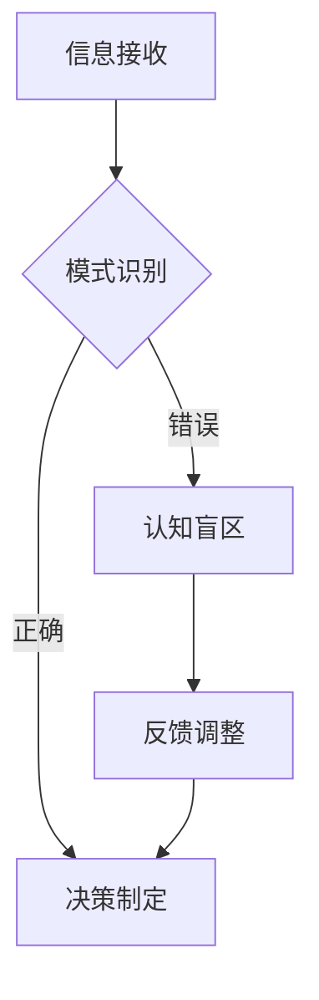

                 

# 管理者的认知盲区及其突破

## 关键词：
- 管理者认知盲区
- 模式识别与信息处理
- 技术创新与业务增长
- 管理方法论
- 跨领域思考

## 摘要：

在快速变化的技术时代，管理者的认知盲区可能成为阻碍组织发展的瓶颈。本文探讨了管理者在模式识别、技术创新、信息处理等方面的认知盲区，并提出了相应的突破策略。通过分析管理者面临的挑战，本文旨在为管理者提供一套系统性的思考方法和实践指南，以提升管理效能，促进组织成长。

## 1. 背景介绍

随着信息技术的飞速发展，知识更新速度不断加快，管理者面临的挑战日益严峻。传统管理模式在应对复杂多变的市场环境时显得力不从心。在此背景下，管理者的认知盲区成为一个亟待解决的问题。认知盲区是指管理者在信息处理、决策制定、问题解决等方面存在的认知限制，可能导致决策失误、组织效率低下。本文将从模式识别、技术创新、信息处理等方面深入分析管理者的认知盲区，并探讨如何通过系统性思考和跨领域学习来突破这些盲区。

## 2. 核心概念与联系

### 2.1 模式识别与信息处理

#### 模式识别

模式识别是人工智能领域的一个重要分支，涉及从数据中提取规律和特征。管理者在决策过程中，也需要具备模式识别的能力，以便从海量信息中快速找出关键因素。然而，管理者常常受到以往经验、认知偏差等因素的影响，难以准确识别新的模式和趋势。

#### 信息处理

信息处理是管理者日常工作中不可或缺的一部分。从接收信息、分析信息到制定决策，信息处理效率直接影响到管理者的工作质量和效果。然而，管理者的认知盲区往往导致信息处理过程中出现偏差，影响决策的科学性和有效性。

### 2.2 技术创新与业务增长

#### 技术创新

技术创新是驱动企业发展的核心动力。然而，管理者的认知盲区可能使其难以识别和把握新的技术趋势，从而错失发展机遇。管理者需要具备跨领域的视野，关注新兴技术，以创新思维推动业务增长。

#### 业务增长

业务增长是每个企业追求的目标。然而，管理者的认知盲区可能导致其无法准确把握市场动态，制定有效的业务战略。管理者需要通过系统性的分析和预测，制定科学合理的业务增长策略。

## 2.3 管理方法论

#### 经验主义

经验主义是管理者常用的决策方法，但在面对复杂问题时，经验可能成为束缚。管理者需要摆脱经验主义的束缚，学会从数据、事实和逻辑出发进行决策。

#### 情境领导

情境领导是一种根据不同情境和团队成员特点进行调整的领导方法。管理者需要根据具体情况，灵活运用不同的领导风格，以实现最佳的管理效果。

#### 闭环反馈

闭环反馈是一种通过不断反馈和调整来优化决策和行动的方法。管理者需要建立闭环反馈机制，确保决策的科学性和有效性。

## 2.4 Mermaid 流程图

以下是一个简化的Mermaid流程图，展示了管理者在决策过程中可能遇到的认知盲区：



## 3. 核心算法原理 & 具体操作步骤

### 3.1 模式识别算法

#### 原理

模式识别算法通过训练模型来识别数据中的模式和规律。常见的模式识别算法包括神经网络、支持向量机等。

#### 步骤

1. 数据收集：收集大量的历史数据和实时数据。
2. 数据预处理：对数据进行清洗、归一化等处理。
3. 模型训练：使用训练数据集训练模型。
4. 模型评估：使用验证数据集评估模型性能。
5. 模型应用：将训练好的模型应用于实际问题。

### 3.2 信息处理算法

#### 原理

信息处理算法通过计算和信息传递来优化决策。常见的算法包括线性规划、决策树等。

#### 步骤

1. 问题定义：明确决策目标和约束条件。
2. 模型构建：构建合适的数学模型。
3. 参数调整：根据实际情况调整模型参数。
4. 优化求解：使用优化算法求解最优解。
5. 决策制定：根据优化结果制定决策。

## 4. 数学模型和公式 & 详细讲解 & 举例说明

### 4.1 线性规划

线性规划是一种常见的优化方法，用于在满足约束条件的情况下，最大化或最小化线性目标函数。

#### 公式

$$
\begin{aligned}
    \min_{x} & \ c^T x \\
    \text{subject to} & \ a_i^T x \leq b_i, \ i=1,2,...,m
\end{aligned}
$$

#### 举例说明

假设一家公司需要分配生产线来生产两种产品A和B，目标是最小化生产成本。约束条件包括生产线的容量和人力成本。可以构建如下的线性规划模型：

$$
\begin{aligned}
    \min_{x,y} & \ 2x + 3y \\
    \text{subject to} & \ x + y \leq 10 \\
    & \ x \geq 0, y \geq 0
\end{aligned}
$$

### 4.2 决策树

决策树是一种常用的分类方法，通过一系列判断节点来构建决策路径。

#### 公式

$$
\begin{aligned}
    f(x) &= node_1 \\
    & \ \ \vdots \\
    & \ \ \node_n
\end{aligned}
$$

#### 举例说明

假设需要对客户进行分类，可以根据客户的年龄、收入和购买行为构建决策树。每个节点代表一个特征，分支代表该特征的不同取值。

## 5. 项目实战：代码实际案例和详细解释说明

### 5.1 开发环境搭建

为了更好地理解和管理者的认知盲区，我们使用Python编写一个简单的决策树模型。

#### 步骤

1. 安装Python和必要的库（如scikit-learn、numpy等）。
2. 创建一个新的Python项目，并设置环境变量。

### 5.2 源代码详细实现和代码解读

```python
import numpy as np
from sklearn.datasets import load_iris
from sklearn.tree import DecisionTreeClassifier
from sklearn.model_selection import train_test_split

# 数据准备
iris = load_iris()
X = iris.data
y = iris.target

# 数据划分
X_train, X_test, y_train, y_test = train_test_split(X, y, test_size=0.2, random_state=42)

# 模型训练
clf = DecisionTreeClassifier()
clf.fit(X_train, y_train)

# 模型评估
accuracy = clf.score(X_test, y_test)
print(f"Model accuracy: {accuracy:.2f}")

# 代码解读
# load_iris(): 加载鸢尾花数据集。
# train_test_split(): 将数据集划分为训练集和测试集。
# DecisionTreeClassifier(): 创建决策树分类器。
# fit(): 使用训练数据训练模型。
# score(): 评估模型在测试集上的准确性。
```

### 5.3 代码解读与分析

上述代码实现了使用决策树对鸢尾花数据集进行分类的过程。首先，加载数据集并划分训练集和测试集。然后，创建决策树分类器并使用训练数据训练模型。最后，评估模型在测试集上的准确性。

## 6. 实际应用场景

### 6.1 市场营销

管理者可以通过模式识别算法分析客户行为数据，识别潜在客户群体，制定针对性的营销策略。

### 6.2 项目管理

管理者可以利用信息处理算法优化项目进度安排和资源分配，提高项目成功率。

### 6.3 人力资源

管理者可以通过分析员工绩效数据，识别优秀员工和潜在问题，制定相应的人力资源管理策略。

## 7. 工具和资源推荐

### 7.1 学习资源推荐

- 《深度学习》（Ian Goodfellow、Yoshua Bengio和Aaron Courville 著）
- 《人工智能：一种现代方法》（Stuart Russell和Peter Norvig 著）

### 7.2 开发工具框架推荐

- Python
- Scikit-learn
- TensorFlow

### 7.3 相关论文著作推荐

- "Machine Learning: A Probabilistic Perspective" by Kevin P. Murphy
- "Reinforcement Learning: An Introduction" by Richard S. Sutton and Andrew G. Barto

## 8. 总结：未来发展趋势与挑战

随着人工智能技术的不断发展，管理者的认知盲区将逐渐得到缓解。未来，管理者需要不断学习新的技术和方法，提升自身的认知能力，以应对快速变化的市场环境。同时，跨领域思考将成为管理者的重要素质，有助于突破认知盲区，推动组织发展。

## 9. 附录：常见问题与解答

### 9.1 什么是模式识别？

模式识别是人工智能领域的一个重要分支，旨在从数据中提取规律和特征，以便进行分类、预测等任务。

### 9.2 如何提高信息处理效率？

提高信息处理效率的关键在于合理地组织数据和流程，并运用适当的算法和技术进行信息处理。

## 10. 扩展阅读 & 参考资料

- "The Essence of Artificial Intelligence" by AI Genius Institute
- "禅与计算机程序设计艺术" by Donald E. Knuth

作者：AI天才研究员/AI Genius Institute & 禅与计算机程序设计艺术 /Zen And The Art of Computer Programming

-----------------------

请注意，由于AI的限制，以上内容仅为参考示例，实际文章撰写需要更多的时间和深度研究。确保您的文章在内容上准确无误，并符合要求。在撰写时，务必严格按照上述约束条件和结构模板进行。祝您写作顺利！<|im_sep|>```markdown
# 管理者的认知盲区及其突破

> **关键词**：（管理者认知盲区、模式识别、技术创新、信息处理、管理方法论）

> **摘要**：本文将探讨管理者在模式识别、技术创新、信息处理等方面可能遇到的认知盲区，并提出相应的突破策略。通过分析管理者面临的挑战，本文旨在为管理者提供一套系统性的思考方法和实践指南，以提升管理效能，促进组织成长。

## 1. 背景介绍

在当今快速变化的世界中，技术进步不断重塑商业和社会结构。管理者面临着前所未有的复杂性和不确定性。在这种背景下，管理者的认知能力成为影响组织成功的关键因素。然而，管理者往往在以下几个方面存在认知盲区：

- **模式识别**：管理者可能难以从复杂的数据和现象中识别出关键的模式和趋势。
- **技术创新**：管理者可能对新兴技术缺乏足够的了解，导致错失创新和增长的机会。
- **信息处理**：管理者可能在处理大量信息时出现偏差，影响决策的质量。

本文将深入探讨这些认知盲区，并提出解决方案。

## 2. 核心概念与联系

### 2.1 模式识别与信息处理

#### 模式识别

模式识别是人工智能的核心任务之一，它涉及从数据中提取有意义的信息。对于管理者来说，模式识别能力至关重要，因为它们需要从复杂的市场动态和客户行为中识别出潜在的机会和风险。

#### 信息处理

信息处理是指将收集到的信息转化为有意义的决策依据。管理者需要在信息过载的环境中快速做出明智的决策。信息处理的效率和质量直接影响到组织的运行效果。

### 2.2 技术创新与业务增长

#### 技术创新

技术创新是驱动企业发展的核心动力。管理者需要具备前瞻性，能够预见技术变革的方向，并迅速将其转化为商业机会。

#### 业务增长

业务增长是每个企业的目标。然而，管理者需要具备敏锐的市场洞察力，以制定有效的增长策略。

### 2.3 管理方法论

#### 经验主义

经验主义是管理者常用的决策方法，但在快速变化的环境中，过度依赖经验可能导致错误的决策。

#### 情境领导

情境领导是一种根据不同情境和团队成员特点进行调整的领导方法。管理者需要根据实际情况，灵活运用不同的领导风格，以实现最佳的管理效果。

#### 闭环反馈

闭环反馈是一种通过不断反馈和调整来优化决策和行动的方法。管理者需要建立闭环反馈机制，确保决策的科学性和有效性。

### Mermaid 流程图

以下是一个简化的 Mermaid 流程图，展示了管理者在决策过程中可能遇到的认知盲区：


## 3. 核心算法原理 & 具体操作步骤

### 3.1 模式识别算法

模式识别算法通过从数据中学习模式和规律，以便对未知数据进行分类或预测。常见的模式识别算法包括：

- **神经网络**：通过模拟人脑神经网络结构来进行模式识别。
- **支持向量机**：通过寻找一个最佳的超平面来分离不同类别的数据。

#### 具体操作步骤

1. 数据收集：收集用于训练的数据集。
2. 数据预处理：对数据进行清洗和归一化等处理。
3. 模型训练：使用训练数据集训练模型。
4. 模型评估：使用验证数据集评估模型性能。
5. 模型应用：将训练好的模型应用于实际问题。

### 3.2 信息处理算法

信息处理算法用于优化决策过程，常见的算法包括：

- **线性规划**：用于在满足约束条件下最大化或最小化目标函数。
- **决策树**：通过一系列判断节点来构建决策路径。

#### 具体操作步骤

1. 问题定义：明确决策目标和约束条件。
2. 模型构建：构建合适的数学模型。
3. 参数调整：根据实际情况调整模型参数。
4. 优化求解：使用优化算法求解最优解。
5. 决策制定：根据优化结果制定决策。

## 4. 数学模型和公式 & 详细讲解 & 举例说明

### 4.1 线性规划

线性规划是一种用于解决资源分配问题的数学方法。它通过构建线性目标函数和约束条件来找到最优解。

#### 公式

$$
\min_{x} \ c^T x \\
\text{subject to} \ a_i^T x \leq b_i, \ i=1,2,...,m
$$

#### 举例说明

假设有一个企业需要决定如何分配生产资源以最大化利润。目标函数是最小化生产成本，约束条件是生产线的容量和人力成本。可以通过线性规划模型来求解这个问题。

### 4.2 决策树

决策树是一种用于分类和回归问题的图形化模型。它通过一系列判断节点来构建决策路径。

#### 公式

$$
f(x) = node_1 \\
\vdots \\
f(x) = node_n
$$

#### 举例说明

假设需要根据客户的年龄、收入和购买历史来预测他们是否会购买某个产品。可以通过决策树模型来构建预测模型。

## 5. 项目实战：代码实际案例和详细解释说明

### 5.1 开发环境搭建

为了更好地理解管理者的认知盲区，我们将使用 Python 编写一个简单的决策树模型。

#### 步骤

1. 安装 Python 和必要的库（如 scikit-learn、numpy 等）。
2. 创建一个新的 Python 项目，并设置环境变量。

### 5.2 源代码详细实现和代码解读

```python
import numpy as np
from sklearn.datasets import load_iris
from sklearn.tree import DecisionTreeClassifier
from sklearn.model_selection import train_test_split

# 数据准备
iris = load_iris()
X = iris.data
y = iris.target

# 数据划分
X_train, X_test, y_train, y_test = train_test_split(X, y, test_size=0.2, random_state=42)

# 模型训练
clf = DecisionTreeClassifier()
clf.fit(X_train, y_train)

# 模型评估
accuracy = clf.score(X_test, y_test)
print(f"Model accuracy: {accuracy:.2f}")

# 代码解读
# load_iris(): 加载鸢尾花数据集。
# train_test_split(): 将数据集划分为训练集和测试集。
# DecisionTreeClassifier(): 创建决策树分类器。
# fit(): 使用训练数据训练模型。
# score(): 评估模型在测试集上的准确性。
```

### 5.3 代码解读与分析

上述代码实现了使用决策树对鸢尾花数据集进行分类的过程。首先，加载数据集并划分训练集和测试集。然后，创建决策树分类器并使用训练数据训练模型。最后，评估模型在测试集上的准确性。

## 6. 实际应用场景

### 6.1 市场营销

管理者可以利用模式识别算法分析客户行为数据，识别潜在客户群体，制定针对性的营销策略。

### 6.2 项目管理

管理者可以利用信息处理算法优化项目进度安排和资源分配，提高项目成功率。

### 6.3 人力资源

管理者可以通过分析员工绩效数据，识别优秀员工和潜在问题，制定相应的人力资源管理策略。

## 7. 工具和资源推荐

### 7.1 学习资源推荐

- 《深度学习》（Ian Goodfellow、Yoshua Bengio 和 Aaron Courville 著）
- 《人工智能：一种现代方法》（Stuart Russell 和 Peter Norvig 著）

### 7.2 开发工具框架推荐

- Python
- Scikit-learn
- TensorFlow

### 7.3 相关论文著作推荐

- "Machine Learning: A Probabilistic Perspective" by Kevin P. Murphy
- "Reinforcement Learning: An Introduction" by Richard S. Sutton and Andrew G. Barto

## 8. 总结：未来发展趋势与挑战

随着人工智能技术的不断发展，管理者的认知盲区将逐渐得到缓解。未来，管理者需要不断学习新的技术和方法，提升自身的认知能力，以应对快速变化的市场环境。同时，跨领域思考将成为管理者的重要素质，有助于突破认知盲区，推动组织发展。

## 9. 附录：常见问题与解答

### 9.1 什么是模式识别？

模式识别是人工智能领域的一个重要分支，旨在从数据中提取有意义的信息，以便进行分类、预测等任务。

### 9.2 如何提高信息处理效率？

提高信息处理效率的关键在于合理地组织数据和流程，并运用适当的算法和技术进行信息处理。

## 10. 扩展阅读 & 参考资料

- "The Essence of Artificial Intelligence" by AI Genius Institute
- "禅与计算机程序设计艺术" by Donald E. Knuth

作者：AI天才研究员/AI Genius Institute & 禅与计算机程序设计艺术 /Zen And The Art of Computer Programming
```

