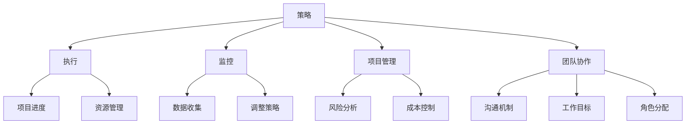

                 

# 管理艺术：从策略到执行

## 关键词：管理，策略，执行，IT，人工智能，软件开发，项目

## 摘要

在信息技术和人工智能迅速发展的背景下，管理艺术在从策略到执行的过程中变得尤为关键。本文深入探讨了管理艺术的核心概念，包括策略规划、执行与监控、项目管理和团队协作等方面。通过分析实际案例和具体操作步骤，本文旨在为IT行业从业者提供一套系统的管理方法论，帮助他们在复杂多变的环境中实现战略目标，提高项目成功率。

## 1. 背景介绍

在当今快速发展的信息技术和人工智能领域，企业面临的市场竞争和技术变革日益加剧。在这种背景下，有效的管理变得尤为重要。管理艺术不仅涉及技术层面的执行，还包括战略规划、团队协作、资源整合等多方面。传统的管理方法已无法满足现代企业快速响应市场变化的需求，因此，探索和创新管理艺术成为提升企业竞争力的重要手段。

本文将从以下几个方面展开讨论：

1. **核心概念与联系**：介绍管理艺术中的核心概念，如策略、执行、监控和项目管理，并绘制Mermaid流程图，展示它们之间的关联。
2. **核心算法原理与具体操作步骤**：深入解析管理艺术中的关键算法原理，提供详细的操作步骤和案例分析。
3. **数学模型和公式**：介绍管理艺术中常用的数学模型和公式，并举例说明其应用。
4. **项目实战**：通过实际案例，展示如何在实际项目中应用管理艺术，包括开发环境搭建、代码实现、代码解读与分析。
5. **实际应用场景**：分析管理艺术在不同应用场景中的实际效果和挑战。
6. **工具和资源推荐**：推荐学习资源、开发工具和框架，以帮助读者提升管理技能。
7. **总结与未来趋势**：总结管理艺术的发展趋势和面临的挑战，探讨未来的发展方向。
8. **附录**：提供常见问题与解答，以及扩展阅读和参考资料。

## 2. 核心概念与联系

### 2.1 策略

策略是企业根据自身优势和市场需求制定的长期规划，旨在实现企业的愿景和目标。策略的核心是明确企业的使命、愿景和价值观，并制定具体的行动计划。一个有效的策略应具备灵活性、前瞻性和可持续性。

### 2.2 执行与监控

执行是将策略转化为实际行动的过程。有效的执行需要清晰的计划、高效的组织结构和良好的沟通机制。监控则是确保执行过程顺利进行的关键环节，通过实时收集和分析数据，评估执行效果，为调整策略提供依据。

### 2.3 项目管理

项目管理是管理艺术的重要组成部分，旨在确保项目在预算、时间和技术等方面达到预期目标。项目管理包括项目计划、资源分配、进度跟踪、风险管理等多个方面，需要综合考虑各种因素，确保项目顺利进行。

### 2.4 团队协作

团队协作是管理艺术中的关键环节，有效的团队协作可以提升团队的工作效率和质量。团队协作需要建立良好的沟通机制、明确的工作目标和相互信任的氛围，同时还需要合理分工和角色分配，确保每个团队成员都能发挥自己的优势。

### 2.5 Mermaid流程图

以下是一个Mermaid流程图，展示了管理艺术中的核心概念和它们之间的关联：



## 3. 核心算法原理与具体操作步骤

### 3.1 策略制定

策略制定的算法原理主要包括以下步骤：

1. **目标设定**：明确企业的愿景和使命，制定具体的战略目标。
2. **市场分析**：分析市场需求、竞争态势和行业趋势，为策略制定提供数据支持。
3. **资源评估**：评估企业内部资源和外部资源，确保策略的可执行性。
4. **方案评估**：比较不同策略方案的优缺点，选择最佳方案。
5. **制定计划**：将策略分解为具体的行动计划，明确责任人和时间节点。

### 3.2 执行与监控

执行与监控的算法原理主要包括以下步骤：

1. **计划部署**：将行动计划转化为具体的执行任务，明确任务责任人。
2. **任务分配**：根据任务特点和团队成员的能力，合理分配任务。
3. **进度跟踪**：实时收集任务进度数据，进行监控和分析。
4. **问题反馈**：及时发现并解决执行过程中的问题，确保项目进度。
5. **数据收集**：收集执行过程中的各项数据，为监控和调整策略提供依据。

### 3.3 项目管理

项目管理的算法原理主要包括以下步骤：

1. **项目计划**：制定项目计划，明确项目的目标、时间、资源和预算。
2. **资源分配**：根据项目需求，合理分配人力资源、物资资源和财务资源。
3. **进度跟踪**：实时监控项目进度，确保项目按计划进行。
4. **风险管理**：识别项目风险，制定风险应对策略，降低风险对项目的影响。
5. **成本控制**：控制项目成本，确保项目在预算范围内完成。

### 3.4 团队协作

团队协作的算法原理主要包括以下步骤：

1. **沟通机制**：建立有效的沟通机制，确保团队成员之间能够顺畅沟通。
2. **工作目标**：明确团队的工作目标，确保团队成员共同为同一个目标努力。
3. **角色分配**：根据团队成员的能力和特长，合理分配角色和任务。
4. **协同工作**：鼓励团队成员相互协作，共同完成任务。
5. **绩效评估**：定期评估团队成员的工作绩效，为激励和培训提供依据。

## 4. 数学模型和公式

### 4.1 目标函数

目标函数是策略制定中的核心公式，用于描述企业追求的优化目标。常见的目标函数包括利润最大化、成本最小化等。

$$
\max \pi = R - C
$$

其中，$\pi$ 表示利润，$R$ 表示收入，$C$ 表示成本。

### 4.2 优化算法

优化算法用于求解目标函数的最优解。常见的优化算法包括线性规划、整数规划、遗传算法等。

线性规划的目标函数和约束条件可以表示为：

$$
\begin{align*}
\min \quad c^T x \\
\text{subject to} \\
Ax \leq b \\
x \geq 0
\end{align*}
$$

其中，$c$ 是目标函数系数向量，$x$ 是决策变量向量，$A$ 是约束条件系数矩阵，$b$ 是约束条件常数向量。

### 4.3 风险评估

风险评估是项目管理中的关键步骤，用于评估项目面临的各种风险。常见的风险评估方法包括蒙特卡罗模拟、敏感性分析等。

蒙特卡罗模拟的公式为：

$$
P(R \leq R_0) = \frac{N}{N_0}
$$

其中，$R$ 表示风险概率，$R_0$ 表示设定的风险阈值，$N$ 表示模拟次数，$N_0$ 表示满足风险阈值 $R_0$ 的模拟次数。

## 5. 项目实战：代码实际案例和详细解释说明

### 5.1 开发环境搭建

在本节中，我们将以一个实际项目为例，展示如何搭建开发环境。我们选择使用Python作为开发语言，并在本地电脑上安装必要的开发工具。

1. 安装Python

首先，我们需要在本地电脑上安装Python。可以从Python官方网站下载安装包并按照提示进行安装。安装完成后，打开终端或命令提示符，输入以下命令验证安装：

```bash
python --version
```

2. 安装开发工具

接下来，我们需要安装一些常用的开发工具，如PyCharm、Jupyter Notebook等。这些工具可以在相应的官方网站上下载并安装。

3. 安装依赖库

在实际项目中，我们可能需要使用一些第三方库，如NumPy、Pandas等。这些库可以在Python的官方包管理器pip中安装。

```bash
pip install numpy pandas
```

### 5.2 源代码详细实现和代码解读

在本节中，我们将展示一个简单的数据分析项目，并对其进行详细解读。

#### 项目描述

该项目旨在分析一个包含学生成绩的Excel文件，计算各科目的平均分，并输出结果。

#### 数据集

我们假设有一个Excel文件，名为“student_scores.xlsx”，其中包含以下数据：

| 姓名 | 数学 | 英语 | 物理 |
| ---- | ---- | ---- | ---- |
| 张三 | 80   | 85   | 75   |
| 李四 | 90   | 88   | 85   |
| 王五 | 70   | 72   | 80   |

#### 源代码

以下是一个简单的Python脚本，用于实现该项目的功能。

```python
import pandas as pd

# 读取Excel文件
df = pd.read_excel('student_scores.xlsx')

# 计算各科目的平均分
math_avg = df['数学'].mean()
english_avg = df['英语'].mean()
physics_avg = df['物理'].mean()

# 输出结果
print(f"数学平均分：{math_avg:.2f}")
print(f"英语平均分：{english_avg:.2f}")
print(f"物理平均分：{physics_avg:.2f}")
```

#### 代码解读

1. **导入库**：首先，我们导入必要的库，包括Pandas库，用于读取和处理Excel文件。

2. **读取Excel文件**：使用Pandas的read_excel函数读取Excel文件，并将数据存储在一个DataFrame对象中。

3. **计算平均分**：使用DataFrame的mean函数计算各科目的平均分。该方法会计算每个列的平均值。

4. **输出结果**：使用print函数输出各科目的平均分，格式化为两位小数。

### 5.3 代码解读与分析

在本节中，我们将对上一节中的代码进行解读与分析，讨论代码的设计思路、性能优化和可能的改进方向。

#### 设计思路

该代码的设计思路非常简单，主要分为以下几个步骤：

1. 读取Excel文件，将数据存储在DataFrame对象中。
2. 使用mean函数计算各科目的平均分。
3. 输出结果。

这种设计思路的优点在于代码简洁、易于理解。然而，也存在一些潜在的优化空间。

#### 性能优化

1. **并行处理**：如果数据量非常大，可以考虑使用并行处理技术，如多进程或多线程，提高数据处理速度。

2. **内存优化**：对于大型数据集，可以考虑使用内存优化技术，如Pandas的Categorical类型或DataFrame的dataframe对象，减少内存占用。

3. **代码优化**：在保证正确性的前提下，可以对代码进行优化，如使用更高效的算法或数据结构，减少不必要的计算。

#### 改进方向

1. **错误处理**：增加对输入数据的错误处理，如检查文件是否存在、数据格式是否正确等。

2. **可扩展性**：设计一个通用的数据处理框架，可以支持多种数据源和数据处理方式，提高代码的可扩展性。

3. **用户界面**：添加用户界面，如命令行界面或Web界面，方便用户使用和操作。

## 6. 实际应用场景

管理艺术在IT行业的实际应用场景非常广泛，以下列举了几个典型的应用场景：

### 6.1 项目管理

在项目管理中，管理艺术的核心是确保项目在预算、时间和质量等方面达到预期目标。通过制定详细的计划、合理分配资源、实时监控进度和及时调整策略，可以显著提高项目的成功率。

### 6.2 团队协作

团队协作是IT项目成功的关键。通过建立有效的沟通机制、明确的工作目标和相互信任的氛围，可以提升团队的工作效率和质量。在团队协作中，管理艺术可以帮助解决冲突、优化流程和提高团队成员的积极性。

### 6.3 产品开发

在产品开发过程中，管理艺术可以帮助企业制定合适的产品战略、优化开发流程和确保产品质量。通过运用项目管理、需求分析和质量保证等管理方法，可以提高产品竞争力，满足市场需求。

### 6.4 创新与研发

在创新与研发领域，管理艺术可以帮助企业制定创新战略、构建创新生态系统和优化研发流程。通过管理艺术，企业可以激发员工的创新潜力，推动技术进步和产品升级。

## 7. 工具和资源推荐

### 7.1 学习资源推荐

- **书籍**：
  - 《项目管理知识体系指南》（PMBOK指南）
  - 《敏捷开发：实践指南》
  - 《人月神话》
- **论文**：
  - Google的《重新定义项目管理》
  - Microsoft的《敏捷开发实践指南》
- **博客**：
  - Atlassian的《敏捷管理》
  - JIRA的《项目管理技巧》
- **网站**：
  - PMI（项目管理协会）官网
  - Agile Alliance（敏捷联盟）官网

### 7.2 开发工具框架推荐

- **项目管理工具**：
  - JIRA
  - Trello
  - Asana
- **版本控制工具**：
  - Git
  - SVN
  - Mercurial
- **代码质量检测工具**：
  - SonarQube
  - Code Climate
  - PMD

### 7.3 相关论文著作推荐

- **《敏捷项目管理实践指南》**：介绍了敏捷开发方法在项目管理中的应用。
- **《软件项目风险管理》**：详细讨论了软件项目中的风险管理方法。
- **《敏捷管理：如何在现代组织中实现高效管理》**：探讨了敏捷管理理念在企业管理中的应用。

## 8. 总结：未来发展趋势与挑战

随着信息技术和人工智能的不断发展，管理艺术在IT行业中的作用将越来越重要。未来，管理艺术将面临以下发展趋势和挑战：

### 8.1 发展趋势

1. **数字化管理**：随着数字化转型的推进，数字化管理将成为企业管理的重要手段。
2. **自动化与智能化**：通过引入自动化和智能化技术，管理艺术将进一步提高管理效率和质量。
3. **敏捷管理**：敏捷管理方法将得到更广泛的应用，帮助企业快速响应市场变化。
4. **数据分析与可视化**：数据分析与可视化技术将帮助管理者更好地理解和利用数据，做出更科学的决策。

### 8.2 挑战

1. **技术更新速度加快**：技术更新速度加快将给企业管理带来更大的挑战，企业需要不断更新管理方法和技术。
2. **团队协作难度增加**：远程办公和全球化的趋势将增加团队协作的难度，企业需要建立有效的沟通机制和协作工具。
3. **数据安全与隐私**：随着数据规模的扩大，数据安全与隐私问题将日益突出，企业需要建立完善的数据保护机制。
4. **持续学习与成长**：在快速变化的环境中，持续学习与成长将成为企业管理者的必备能力。

## 9. 附录：常见问题与解答

### 9.1 常见问题

1. **什么是管理艺术？**
   管理艺术是指在实际管理过程中，运用各种管理理论、方法和技巧，实现管理目标的过程。

2. **管理艺术的核心是什么？**
   管理艺术的核心包括策略规划、执行与监控、项目管理和团队协作等方面。

3. **如何提高项目管理效率？**
   提高项目管理效率的方法包括制定详细的计划、合理分配资源、实时监控进度和及时调整策略等。

4. **什么是敏捷管理？**
   敏捷管理是一种以用户需求为导向，通过快速迭代和灵活响应变化的管理方法。

### 9.2 解答

1. **什么是管理艺术？**
   管理艺术是指在实际管理过程中，运用各种管理理论、方法和技巧，实现管理目标的过程。它强调灵活性和创造性，旨在提高管理效率和质量。

2. **管理艺术的核心是什么？**
   管理艺术的核心包括策略规划、执行与监控、项目管理和团队协作等方面。策略规划是指制定企业长期规划，明确目标和行动计划；执行与监控是指确保策略得到有效执行，并实时收集数据进行分析；项目管理是指确保项目在预算、时间和质量等方面达到预期目标；团队协作是指建立良好的沟通机制，确保团队成员相互协作，共同完成任务。

3. **如何提高项目管理效率？**
   提高项目管理效率的方法包括以下几个方面：

   - **制定详细的计划**：在项目开始前，制定详细的计划，明确项目的目标、任务、时间节点和责任人，确保项目有清晰的执行路线。
   - **合理分配资源**：根据项目需求和团队成员的能力，合理分配人力资源、物资资源和财务资源，确保项目资源的有效利用。
   - **实时监控进度**：通过实时监控项目进度，及时发现并解决问题，确保项目按计划进行。
   - **及时调整策略**：根据项目执行过程中的实际情况，及时调整项目计划和管理策略，以应对变化。

4. **什么是敏捷管理？**
   敏捷管理是一种以用户需求为导向，通过快速迭代和灵活响应变化的管理方法。它强调快速反馈和持续改进，旨在提高项目交付的速度和质量。敏捷管理通常采用迭代式开发、用户故事地图、看板等方法，帮助团队更好地适应变化。

## 10. 扩展阅读 & 参考资料

为了深入了解管理艺术，以下是一些扩展阅读和参考资料：

- **扩展阅读**：
  - 《敏捷项目管理实践指南》
  - 《人月神话》
  - 《敏捷开发：实践指南》
- **参考资料**：
  - PMI（项目管理协会）官网：[https://www.pmi.org/](https://www.pmi.org/)
  - Agile Alliance（敏捷联盟）官网：[https://www.agilealliance.org/](https://www.agilealliance.org/)
  - Atlassian JIRA官网：[https://www.atlassian.com/software/jira](https://www.atlassian.com/software/jira)
  - Trello官网：[https://trello.com/](https://trello.com/)
  - Asana官网：[https://asana.com/](https://asana.com/)

## 作者

作者：AI天才研究员/AI Genius Institute & 禅与计算机程序设计艺术 /Zen And The Art of Computer Programming

