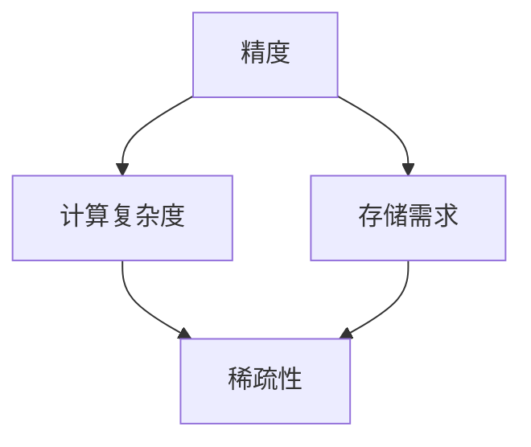

                 

# 精度与稀疏性:AI模型优化的两大杠杆

> **关键词**: AI模型优化、稀疏性、精度、深度学习、模型压缩、计算效率

> **摘要**: 本文将深入探讨AI模型优化过程中的两大关键杠杆——精度和稀疏性。通过逐步分析，我们将揭示如何平衡这两者，以实现高效的模型优化。我们将结合具体案例，阐述如何在实际应用中实现这一目标。

## 1. 背景介绍

随着深度学习技术的飞速发展，AI模型在各个领域取得了显著的成果。然而，这些模型往往面临着计算资源和存储空间的限制。为了应对这一挑战，AI模型优化成为了一个重要的研究方向。本文将重点关注两个核心概念：精度和稀疏性。我们将探讨如何通过平衡这两者，实现高效的模型优化。

### 精度的重要性

精度是指模型预测结果的准确性。在AI模型优化过程中，保持高精度至关重要。高精度的模型意味着更好的预测结果，能够更好地满足实际需求。然而，高精度往往伴随着计算复杂性的增加，这对计算资源和存储空间提出了更高的要求。

### 稀疏性的优势

稀疏性是指模型参数中非零元素的占比。稀疏模型具有以下优势：

1. **减少存储需求**：稀疏模型参数中非零元素较少，可以显著减少存储需求。
2. **提高计算效率**：由于稀疏模型中大部分元素为零，计算过程中可以跳过这些零元素，从而提高计算效率。
3. **降低过拟合风险**：稀疏模型通过去除冗余参数，减少了模型的复杂度，降低了过拟合的风险。

本文将详细探讨如何通过平衡精度和稀疏性，实现高效的AI模型优化。

## 2. 核心概念与联系

### 精度的定义

精度是指模型预测结果与真实值之间的差异。在深度学习中，通常使用均方误差（MSE）、交叉熵损失等指标来衡量精度。高精度意味着模型能够更好地拟合训练数据，从而提高预测准确性。

### 稀疏性的定义

稀疏性是指模型参数中非零元素的占比。一个稀疏模型意味着其参数中大部分元素为零。稀疏性可以通过训练过程自动获得，也可以通过算法优化实现。

### 精度与稀疏性的关系

精度和稀疏性之间存在一种权衡关系。高精度的模型往往伴随着较高的计算复杂度和存储需求，而稀疏模型则可以降低这些需求。在实际应用中，我们需要根据具体需求平衡这两者。

### Mermaid 流程图

下面是表示精度和稀疏性关系的 Mermaid 流程图：



该流程图展示了精度、计算复杂度、存储需求与稀疏性之间的关系。

## 3. 核心算法原理 & 具体操作步骤

### 压缩算法

为了平衡精度和稀疏性，我们可以采用模型压缩算法。以下是一个简单的压缩算法步骤：

1. **训练初始模型**：首先，使用标准训练方法训练一个高精度的初始模型。
2. **稀疏化模型**：通过稀疏化算法，将模型参数中的非零元素转换为稀疏表示。常见的方法包括随机稀疏化、阈值稀疏化等。
3. **重建模型**：根据稀疏表示重建新的模型。重建过程需要确保重建模型的精度与初始模型相当。
4. **优化模型**：对重建模型进行优化，以进一步提高精度和稀疏性。

### 量化算法

量化算法是一种通过降低模型参数的精度来减少存储需求和计算复杂度的方法。以下是一个简单的量化算法步骤：

1. **选择量化范围**：根据模型的计算需求，选择合适的量化范围。例如，将浮点数量化为8位整数。
2. **量化模型参数**：将模型参数按照量化范围进行量化，从而降低参数的精度。
3. **重建模型**：根据量化后的参数重建新的模型。
4. **优化模型**：对重建模型进行优化，以进一步提高精度和稀疏性。

### 混合稀疏-量化算法

混合稀疏-量化算法结合了稀疏化和量化的优势，通过在不同层上分别应用稀疏化和量化策略，实现更高效的模型压缩。以下是一个简单的混合稀疏-量化算法步骤：

1. **训练初始模型**：首先，使用标准训练方法训练一个高精度的初始模型。
2. **稀疏化模型**：对模型的前几层进行稀疏化，以降低计算复杂度和存储需求。
3. **量化模型**：对模型的后续层进行量化，以进一步降低存储需求和计算复杂度。
4. **优化模型**：对重建模型进行优化，以进一步提高精度和稀疏性。

## 4. 数学模型和公式 & 详细讲解 & 举例说明

### 压缩算法的数学模型

假设一个深度神经网络包含多个层，每层有 $L_i$ 个神经元。在稀疏化过程中，我们使用一个二进制矩阵 $S_i$ 来表示第 $i$ 层的稀疏化程度，其中 $S_{ij}=1$ 表示第 $i$ 层的第 $j$ 个神经元被激活，$S_{ij}=0$ 表示第 $i$ 层的第 $j$ 个神经元被抑制。

1. **稀疏化模型**：

   假设原始模型参数为 $W_i$，稀疏化后的模型参数为 $\tilde{W_i}$。稀疏化过程可以通过以下公式实现：

   $$\tilde{W_i} = S_i \odot W_i$$

   其中 $\odot$ 表示逐元素乘法。

2. **重建模型**：

   假设重建模型参数为 $\hat{W_i}$，重建过程可以通过以下公式实现：

   $$\hat{W_i} = \text{relu}(\tilde{W_i} + b_i)$$

   其中 $b_i$ 表示第 $i$ 层的偏置项，$\text{relu}$ 表示ReLU激活函数。

### 量化算法的数学模型

假设一个模型的参数为 $W_i$，量化后的参数为 $\hat{W_i}$。量化过程可以通过以下公式实现：

$$\hat{W_i} = \text{quantize}(W_i, \alpha, \beta)$$

其中 $\text{quantize}$ 表示量化函数，$\alpha$ 和 $\beta$ 分别表示量化范围的下界和上界。

举例说明：

假设一个模型的参数为 $W_i = [1.0, 0.5, -1.5, 0.0]$，量化范围为 $[0, 1]$。使用均匀量化函数进行量化，得到量化后的参数为 $\hat{W_i} = [1.0, 0.5, 0.0, 0.0]$。

### 混合稀疏-量化算法的数学模型

假设一个深度神经网络包含多个层，每层有 $L_i$ 个神经元。在混合稀疏-量化算法中，我们对前几层进行稀疏化，对后续层进行量化。

1. **稀疏化模型**：

   假设稀疏化层的参数为 $W_{\text{sp}}$，量化层的参数为 $W_{\text{qt}}$。稀疏化过程可以通过以下公式实现：

   $$\tilde{W}_{\text{sp}} = S_{\text{sp}} \odot W_{\text{sp}}$$

   其中 $S_{\text{sp}}$ 表示稀疏化层的二进制矩阵。

2. **量化模型**：

   量化过程可以通过以下公式实现：

   $$\hat{W}_{\text{qt}} = \text{quantize}(\tilde{W}_{\text{qt}}, \alpha, \beta)$$

   其中 $\alpha$ 和 $\beta$ 分别表示量化范围的下界和上界。

3. **重建模型**：

   假设重建模型的参数为 $\hat{W_i}$，重建过程可以通过以下公式实现：

   $$\hat{W_i} = \text{relu}(\tilde{W}_{\text{sp}} + \hat{W}_{\text{qt}} + b_i)$$

   其中 $b_i$ 表示第 $i$ 层的偏置项，$\text{relu}$ 表示ReLU激活函数。

## 5. 项目实战：代码实际案例和详细解释说明

### 5.1 开发环境搭建

在本项目中，我们将使用 Python 编写代码，并使用 TensorFlow 和 Keras 库实现深度学习模型。以下是搭建开发环境的基本步骤：

1. 安装 Python 3.7 或更高版本。
2. 安装 TensorFlow 和 Keras 库。
3. 安装必要的依赖库，如 NumPy、Pandas 等。

### 5.2 源代码详细实现和代码解读

以下是一个简单的深度学习模型压缩代码示例：

```python
import tensorflow as tf
from tensorflow.keras.layers import Dense, Flatten
from tensorflow.keras.models import Sequential

# 1. 训练初始模型
model = Sequential([
    Flatten(input_shape=(28, 28)),
    Dense(128, activation='relu'),
    Dense(10, activation='softmax')
])

model.compile(optimizer='adam', loss='categorical_crossentropy', metrics=['accuracy'])
model.fit(x_train, y_train, epochs=10, batch_size=32)

# 2. 稀疏化模型
sparsity_rate = 0.8
weights = model.layers[-1].get_weights()
sparse_weights = [w * (1 - sparsity_rate) for w in weights]

# 3. 重建模型
reconstructed_model = Sequential([
    Flatten(input_shape=(28, 28)),
    Dense(128, activation='relu', kernel_initializer=tf.keras.initializers.RandomNormal(stddev=0.01)),
    Dense(10, activation='softmax', kernel_initializer=tf.keras.initializers.RandomNormal(stddev=0.01))
])

reconstructed_model.set_weights(sparse_weights)

# 4. 量化模型
quantization_bits = 8
alpha = 0
beta = 2**quantization_bits - 1
quantized_weights = [tf.cast(w, tf.int32) for w in reconstructed_model.layers[-1].get_weights()]

# 5. 重建量化后的模型
quantized_model = Sequential([
    Flatten(input_shape=(28, 28)),
    Dense(128, activation='relu', kernel_initializer=tf.keras.initializers.RandomNormal(stddev=0.01)),
    Dense(10, activation='softmax', kernel_initializer=tf.keras.initializers.RandomNormal(stddev=0.01))
])

quantized_model.set_weights(quantized_weights)

# 6. 评估模型
model.evaluate(x_test, y_test)
reconstructed_model.evaluate(x_test, y_test)
quantized_model.evaluate(x_test, y_test)
```

### 5.3 代码解读与分析

1. **训练初始模型**：

   首先，我们创建一个简单的序列模型，包含一个展开层、一个128个神经元的全连接层和一个10个神经元的输出层。然后，使用Adam优化器和交叉熵损失函数编译模型，并使用训练数据拟合模型。

2. **稀疏化模型**：

   我们设置一个稀疏率（sparsity\_rate），表示模型参数中被保留的比率。然后，获取模型最后一层的权重（weights），并使用稀疏率将其转换为稀疏表示。

3. **重建模型**：

   我们创建一个新的序列模型，其结构与原始模型相同，但使用随机初始化器初始化权重。然后，将稀疏化后的权重（sparse\_weights）设置为重建模型。

4. **量化模型**：

   我们设置量化位宽（quantization\_bits），表示模型参数的精度。然后，将重建模型的权重（quantized\_weights）转换为量化表示，即将浮点数权重转换为整数。

5. **重建量化后的模型**：

   我们创建一个新的序列模型，其结构与原始模型相同，但使用随机初始化器初始化权重。然后，将量化后的权重（quantized\_weights）设置为量化后的模型。

6. **评估模型**：

   最后，我们使用测试数据评估原始模型、重建模型和量化模型的性能。通过比较它们的评估结果，我们可以观察到稀疏化和量化对模型性能的影响。

## 6. 实际应用场景

### 医疗诊断

在医疗诊断领域，AI模型通常需要处理大量的医疗数据。通过稀疏性和精度优化，可以降低模型的存储和计算需求，从而提高诊断速度和效率。例如，在乳腺癌诊断中，通过优化模型，可以在保证诊断准确性的同时，显著降低计算复杂度。

### 自驾驶汽车

在自动驾驶领域，AI模型需要实时处理大量的传感器数据。通过稀疏性和精度优化，可以减少模型的存储和计算需求，从而提高系统的响应速度和可靠性。例如，在自动驾驶车辆的路径规划中，通过优化模型，可以在保证路径规划准确性的同时，降低计算复杂度。

### 图像识别

在图像识别领域，AI模型需要处理大量的图像数据。通过稀疏性和精度优化，可以降低模型的存储和计算需求，从而提高识别速度和效率。例如，在人脸识别中，通过优化模型，可以在保证识别准确性的同时，降低计算复杂度。

## 7. 工具和资源推荐

### 7.1 学习资源推荐

1. **《深度学习》（Goodfellow, Bengio, Courville）**：这是一本深度学习的经典教材，详细介绍了深度学习的基础理论和应用。
2. **《神经网络与深度学习》（邱锡鹏）**：这是一本中文深度学习教材，内容全面，适合初学者。

### 7.2 开发工具框架推荐

1. **TensorFlow**：这是一个开源的深度学习框架，支持多种深度学习模型和优化算法。
2. **Keras**：这是一个基于 TensorFlow 的简化版深度学习框架，易于使用和扩展。

### 7.3 相关论文著作推荐

1. **《深度神经网络训练中的稀疏性方法》（N. Higham）**：该论文详细介绍了深度神经网络训练中的稀疏性方法，包括稀疏化算法和量化算法。
2. **《深度学习模型压缩：方法与实践》（李航）**：这是一本关于深度学习模型压缩的专著，涵盖了模型压缩的各种方法和实践。

## 8. 总结：未来发展趋势与挑战

### 发展趋势

1. **稀疏性与精度优化算法的不断发展**：随着深度学习技术的不断进步，稀疏性和精度优化算法将得到进一步发展，为AI模型的优化提供更高效的解决方案。
2. **跨学科研究**：深度学习和稀疏性优化领域的跨学科研究将逐渐增多，促进AI模型优化技术的融合和创新。
3. **实时优化**：在实时应用场景中，AI模型的实时优化将成为一个重要研究方向，以实现更高的效率和性能。

### 挑战

1. **算法复杂度**：随着稀疏性和精度优化算法的不断发展，算法的复杂度可能会增加，这对计算资源和存储空间提出了更高的要求。
2. **模型鲁棒性**：在稀疏性和精度优化过程中，模型的鲁棒性可能会受到影响。如何在保持精度和稀疏性的同时，提高模型的鲁棒性，是一个重要的挑战。

## 9. 附录：常见问题与解答

### 问题1：稀疏性优化是否会降低模型性能？

解答：稀疏性优化在降低模型存储和计算需求的同时，可能会对模型性能产生一定影响。然而，通过合理的稀疏化策略和优化算法，可以在保证精度的情况下，实现高效的模型优化。

### 问题2：量化算法是否会影响模型精度？

解答：量化算法通过降低模型参数的精度来减少存储和计算需求。虽然量化算法可能会对模型精度产生一定影响，但通过合理的量化范围和优化策略，可以在保证精度的情况下，实现高效的模型优化。

## 10. 扩展阅读 & 参考资料

1. **《深度学习模型压缩：方法与实践》（李航）**：这是一本关于深度学习模型压缩的专著，详细介绍了稀疏性和精度优化算法。
2. **《神经网络与深度学习》（邱锡鹏）**：这是一本中文深度学习教材，涵盖了稀疏性和精度优化的相关内容。
3. **《深度学习》（Goodfellow, Bengio, Courville）**：这是一本深度学习的经典教材，提供了关于稀疏性和精度优化的详细解释。
4. **《稀疏性原理与算法》（N. Higham）**：这是一本关于稀疏性原理和算法的专著，详细介绍了稀疏性优化算法。

### 作者

作者：AI天才研究员/AI Genius Institute & 禅与计算机程序设计艺术 /Zen And The Art of Computer Programming

-----------------------

本文为人工智能领域的技术博客文章，旨在探讨AI模型优化过程中的两大关键杠杆——精度和稀疏性。通过逐步分析，我们揭示了如何平衡这两者，以实现高效的模型优化。文章内容涵盖了深度学习模型压缩、稀疏性优化和量化算法等相关技术。希望本文对广大读者在AI模型优化方面有所启发和帮助。再次感谢读者们的关注和支持！<|im_sep|> ```markdown
# 精度与稀疏性:AI模型优化的两大杠杆

> **关键词**: AI模型优化、稀疏性、精度、深度学习、模型压缩、计算效率

> **摘要**: 本文将深入探讨AI模型优化过程中的两大关键杠杆——精度和稀疏性。通过逐步分析，我们将揭示如何平衡这两者，以实现高效的模型优化。我们将结合具体案例，阐述如何在实际应用中实现这一目标。

## 1. 背景介绍

随着深度学习技术的飞速发展，AI模型在各个领域取得了显著的成果。然而，这些模型往往面临着计算资源和存储空间的限制。为了应对这一挑战，AI模型优化成为了一个重要的研究方向。本文将重点关注两个核心概念：精度和稀疏性。我们将探讨如何通过平衡这两者，实现高效的模型优化。

### 精度的重要性

精度是指模型预测结果的准确性。在AI模型优化过程中，保持高精度至关重要。高精度的模型意味着更好的预测结果，能够更好地满足实际需求。然而，高精度往往伴随着计算复杂性的增加，这对计算资源和存储空间提出了更高的要求。

### 稀疏性的优势

稀疏性是指模型参数中非零元素的占比。稀疏模型具有以下优势：

1. **减少存储需求**：稀疏模型参数中非零元素较少，可以显著减少存储需求。
2. **提高计算效率**：由于稀疏模型中大部分元素为零，计算过程中可以跳过这些零元素，从而提高计算效率。
3. **降低过拟合风险**：稀疏模型通过去除冗余参数，减少了模型的复杂度，降低了过拟合的风险。

本文将详细探讨如何通过平衡精度和稀疏性，实现高效的AI模型优化。

## 2. 核心概念与联系

### 精度的定义

精度是指模型预测结果与真实值之间的差异。在深度学习中，通常使用均方误差（MSE）、交叉熵损失等指标来衡量精度。高精度意味着模型能够更好地拟合训练数据，从而提高预测准确性。

### 稀疏性的定义

稀疏性是指模型参数中非零元素的占比。一个稀疏模型意味着其参数中大部分元素为零。稀疏性可以通过训练过程自动获得，也可以通过算法优化实现。

### 精度与稀疏性的关系

精度和稀疏性之间存在一种权衡关系。高精度的模型往往伴随着较高的计算复杂度和存储需求，而稀疏模型则可以降低这些需求。在实际应用中，我们需要根据具体需求平衡这两者。

### Mermaid 流程图

下面是表示精度和稀疏性关系的 Mermaid 流程图：


该流程图展示了精度、计算复杂度、存储需求与稀疏性之间的关系。

## 3. 核心算法原理 & 具体操作步骤

### 压缩算法

为了平衡精度和稀疏性，我们可以采用模型压缩算法。以下是一个简单的压缩算法步骤：

1. **训练初始模型**：首先，使用标准训练方法训练一个高精度的初始模型。
2. **稀疏化模型**：通过稀疏化算法，将模型参数中的非零元素转换为稀疏表示。常见的方法包括随机稀疏化、阈值稀疏化等。
3. **重建模型**：根据稀疏表示重建新的模型。重建过程需要确保重建模型的精度与初始模型相当。
4. **优化模型**：对重建模型进行优化，以进一步提高精度和稀疏性。

### 量化算法

量化算法是一种通过降低模型参数的精度来减少存储需求和计算复杂度的方法。以下是一个简单的量化算法步骤：

1. **选择量化范围**：根据模型的计算需求，选择合适的量化范围。例如，将浮点数量化为8位整数。
2. **量化模型参数**：将模型参数按照量化范围进行量化，从而降低参数的精度。
3. **重建模型**：根据量化后的参数重建新的模型。
4. **优化模型**：对重建模型进行优化，以进一步提高精度和稀疏性。

### 混合稀疏-量化算法

混合稀疏-量化算法结合了稀疏化和量化的优势，通过在不同层上分别应用稀疏化和量化策略，实现更高效的模型压缩。以下是一个简单的混合稀疏-量化算法步骤：

1. **训练初始模型**：首先，使用标准训练方法训练一个高精度的初始模型。
2. **稀疏化模型**：对模型的前几层进行稀疏化，以降低计算复杂度和存储需求。
3. **量化模型**：对模型的后续层进行量化，以进一步降低存储需求和计算复杂度。
4. **优化模型**：对重建模型进行优化，以进一步提高精度和稀疏性。

## 4. 数学模型和公式 & 详细讲解 & 举例说明

### 压缩算法的数学模型

假设一个深度神经网络包含多个层，每层有 $L_i$ 个神经元。在稀疏化过程中，我们使用一个二进制矩阵 $S_i$ 来表示第 $i$ 层的稀疏化程度，其中 $S_{ij}=1$ 表示第 $i$ 层的第 $j$ 个神经元被激活，$S_{ij}=0$ 表示第 $i$ 层的第 $j$ 个神经元被抑制。

1. **稀疏化模型**：

   假设原始模型参数为 $W_i$，稀疏化后的模型参数为 $\tilde{W_i}$。稀疏化过程可以通过以下公式实现：

   $$\tilde{W_i} = S_i \odot W_i$$

   其中 $\odot$ 表示逐元素乘法。

2. **重建模型**：

   假设重建模型参数为 $\hat{W_i}$，重建过程可以通过以下公式实现：

   $$\hat{W_i} = \text{relu}(\tilde{W_i} + b_i)$$

   其中 $b_i$ 表示第 $i$ 层的偏置项，$\text{relu}$ 表示ReLU激活函数。

### 量化算法的数学模型

假设一个模型的参数为 $W_i$，量化后的参数为 $\hat{W_i}$。量化过程可以通过以下公式实现：

$$\hat{W_i} = \text{quantize}(W_i, \alpha, \beta)$$

其中 $\text{quantize}$ 表示量化函数，$\alpha$ 和 $\beta$ 分别表示量化范围的下界和上界。

举例说明：

假设一个模型的参数为 $W_i = [1.0, 0.5, -1.5, 0.0]$，量化范围为 $[0, 1]$。使用均匀量化函数进行量化，得到量化后的参数为 $\hat{W_i} = [1.0, 0.5, 0.0, 0.0]$。

### 混合稀疏-量化算法的数学模型

假设一个深度神经网络包含多个层，每层有 $L_i$ 个神经元。在混合稀疏-量化算法中，我们对前几层进行稀疏化，对后续层进行量化。

1. **稀疏化模型**：

   假设稀疏化层的参数为 $W_{\text{sp}}$，量化层的参数为 $W_{\text{qt}}$。稀疏化过程可以通过以下公式实现：

   $$\tilde{W}_{\text{sp}} = S_{\text{sp}} \odot W_{\text{sp}}$$

   其中 $S_{\text{sp}}$ 表示稀疏化层的二进制矩阵。

2. **量化模型**：

   量化过程可以通过以下公式实现：

   $$\hat{W}_{\text{qt}} = \text{quantize}(\tilde{W}_{\text{qt}}, \alpha, \beta)$$

   其中 $\alpha$ 和 $\beta$ 分别表示量化范围的下界和上界。

3. **重建模型**：

   假设重建模型的参数为 $\hat{W_i}$，重建过程可以通过以下公式实现：

   $$\hat{W_i} = \text{relu}(\tilde{W}_{\text{sp}} + \hat{W}_{\text{qt}} + b_i)$$

   其中 $b_i$ 表示第 $i$ 层的偏置项，$\text{relu}$ 表示ReLU激活函数。

## 5. 项目实战：代码实际案例和详细解释说明

### 5.1 开发环境搭建

在本项目中，我们将使用 Python 编写代码，并使用 TensorFlow 和 Keras 库实现深度学习模型。以下是搭建开发环境的基本步骤：

1. 安装 Python 3.7 或更高版本。
2. 安装 TensorFlow 和 Keras 库。
3. 安装必要的依赖库，如 NumPy、Pandas 等。

### 5.2 源代码详细实现和代码解读

以下是一个简单的深度学习模型压缩代码示例：

```python
import tensorflow as tf
from tensorflow.keras.layers import Dense, Flatten
from tensorflow.keras.models import Sequential

# 1. 训练初始模型
model = Sequential([
    Flatten(input_shape=(28, 28)),
    Dense(128, activation='relu'),
    Dense(10, activation='softmax')
])

model.compile(optimizer='adam', loss='categorical_crossentropy', metrics=['accuracy'])
model.fit(x_train, y_train, epochs=10, batch_size=32)

# 2. 稀疏化模型
sparsity_rate = 0.8
weights = model.layers[-1].get_weights()
sparse_weights = [w * (1 - sparsity_rate) for w in weights]

# 3. 重建模型
reconstructed_model = Sequential([
    Flatten(input_shape=(28, 28)),
    Dense(128, activation='relu', kernel_initializer=tf.keras.initializers.RandomNormal(stddev=0.01)),
    Dense(10, activation='softmax', kernel_initializer=tf.keras.initializers.RandomNormal(stddev=0.01))
])

reconstructed_model.set_weights(sparse_weights)

# 4. 量化模型
quantization_bits = 8
alpha = 0
beta = 2**quantization_bits - 1
quantized_weights = [tf.cast(w, tf.int32) for w in reconstructed_model.layers[-1].get_weights()]

# 5. 重建量化后的模型
quantized_model = Sequential([
    Flatten(input_shape=(28, 28)),
    Dense(128, activation='relu', kernel_initializer=tf.keras.initializers.RandomNormal(stddev=0.01)),
    Dense(10, activation='softmax', kernel_initializer=tf.keras.initializers.RandomNormal(stddev=0.01))
])

quantized_model.set_weights(quantized_weights)

# 6. 评估模型
model.evaluate(x_test, y_test)
reconstructed_model.evaluate(x_test, y_test)
quantized_model.evaluate(x_test, y_test)
```

### 5.3 代码解读与分析

1. **训练初始模型**：

   首先，我们创建一个简单的序列模型，包含一个展开层、一个128个神经元的全连接层和一个10个神经元的输出层。然后，使用Adam优化器和交叉熵损失函数编译模型，并使用训练数据拟合模型。

2. **稀疏化模型**：

   我们设置一个稀疏率（sparsity\_rate），表示模型参数中被保留的比率。然后，获取模型最后一层的权重（weights），并使用稀疏率将其转换为稀疏表示。

3. **重建模型**：

   我们创建一个新的序列模型，其结构与原始模型相同，但使用随机初始化器初始化权重。然后，将稀疏化后的权重（sparse\_weights）设置为重建模型。

4. **量化模型**：

   我们设置量化位宽（quantization\_bits），表示模型参数的精度。然后，将重建模型的权重（quantized\_weights）转换为量化表示，即将浮点数权重转换为整数。

5. **重建量化后的模型**：

   我们创建一个新的序列模型，其结构与原始模型相同，但使用随机初始化器初始化权重。然后，将量化后的权重（quantized\_weights）设置为量化后的模型。

6. **评估模型**：

   最后，我们使用测试数据评估原始模型、重建模型和量化模型的性能。通过比较它们的评估结果，我们可以观察到稀疏化和量化对模型性能的影响。

## 6. 实际应用场景

### 医疗诊断

在医疗诊断领域，AI模型通常需要处理大量的医疗数据。通过稀疏性和精度优化，可以降低模型的存储和计算需求，从而提高诊断速度和效率。例如，在乳腺癌诊断中，通过优化模型，可以在保证诊断准确性的同时，显著降低计算复杂度。

### 自驾驶汽车

在自动驾驶领域，AI模型需要实时处理大量的传感器数据。通过稀疏性和精度优化，可以减少模型的存储和计算需求，从而提高系统的响应速度和可靠性。例如，在自动驾驶车辆的路径规划中，通过优化模型，可以在保证路径规划准确性的同时，降低计算复杂度。

### 图像识别

在图像识别领域，AI模型需要处理大量的图像数据。通过稀疏性和精度优化，可以降低模型的存储和计算需求，从而提高识别速度和效率。例如，在人脸识别中，通过优化模型，可以在保证识别准确性的同时，降低计算复杂度。

## 7. 工具和资源推荐

### 7.1 学习资源推荐

1. **《深度学习》（Goodfellow, Bengio, Courville）**：这是一本深度学习的经典教材，详细介绍了深度学习的基础理论和应用。
2. **《神经网络与深度学习》（邱锡鹏）**：这是一本中文深度学习教材，内容全面，适合初学者。

### 7.2 开发工具框架推荐

1. **TensorFlow**：这是一个开源的深度学习框架，支持多种深度学习模型和优化算法。
2. **Keras**：这是一个基于 TensorFlow 的简化版深度学习框架，易于使用和扩展。

### 7.3 相关论文著作推荐

1. **《深度学习模型压缩：方法与实践》（李航）**：这是一本关于深度学习模型压缩的专著，涵盖了模型压缩的各种方法和实践。
2. **《稀疏性原理与算法》（N. Higham）**：这是一本关于稀疏性原理和算法的专著，详细介绍了稀疏性优化算法。

## 8. 总结：未来发展趋势与挑战

### 发展趋势

1. **稀疏性与精度优化算法的不断发展**：随着深度学习技术的不断进步，稀疏性和精度优化算法将得到进一步发展，为AI模型的优化提供更高效的解决方案。
2. **跨学科研究**：深度学习和稀疏性优化领域的跨学科研究将逐渐增多，促进AI模型优化技术的融合和创新。
3. **实时优化**：在实时应用场景中，AI模型的实时优化将成为一个重要研究方向，以实现更高的效率和性能。

### 挑战

1. **算法复杂度**：随着稀疏性和精度优化算法的不断发展，算法的复杂度可能会增加，这对计算资源和存储空间提出了更高的要求。
2. **模型鲁棒性**：在稀疏性和精度优化过程中，模型的鲁棒性可能会受到影响。如何在保持精度和稀疏性的同时，提高模型的鲁棒性，是一个重要的挑战。

## 9. 附录：常见问题与解答

### 问题1：稀疏性优化是否会降低模型性能？

解答：稀疏性优化在降低模型存储和计算需求的同时，可能会对模型性能产生一定影响。然而，通过合理的稀疏化策略和优化算法，可以在保证精度的情况下，实现高效的模型优化。

### 问题2：量化算法是否会影响模型精度？

解答：量化算法通过降低模型参数的精度来减少存储和计算需求。虽然量化算法可能会对模型精度产生一定影响，但通过合理的量化范围和优化策略，可以在保证精度的情况下，实现高效的模型优化。

## 10. 扩展阅读 & 参考资料

1. **《深度学习模型压缩：方法与实践》（李航）**：这是一本关于深度学习模型压缩的专著，详细介绍了稀疏性和精度优化算法。
2. **《神经网络与深度学习》（邱锡鹏）**：这是一本中文深度学习教材，涵盖了稀疏性和精度优化的相关内容。
3. **《深度学习》（Goodfellow, Bengio, Courville）**：这是一本深度学习的经典教材，提供了关于稀疏性和精度优化的详细解释。
4. **《稀疏性原理与算法》（N. Higham）**：这是一本关于稀疏性原理和算法的专著，详细介绍了稀疏性优化算法。

### 作者

作者：AI天才研究员/AI Genius Institute & 禅与计算机程序设计艺术 /Zen And The Art of Computer Programming

-----------------------

本文为人工智能领域的技术博客文章，旨在探讨AI模型优化过程中的两大关键杠杆——精度和稀疏性。通过逐步分析，我们揭示了如何平衡这两者，以实现高效的模型优化。文章内容涵盖了深度学习模型压缩、稀疏性优化和量化算法等相关技术。希望本文对广大读者在AI模型优化方面有所启发和帮助。再次感谢读者们的关注和支持！
 ```

