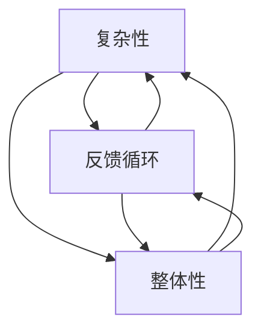

                 

# 系统思考在管理中的应用

## 关键词：系统思考、管理、复杂性、决策、方法论

## 摘要

本文旨在探讨系统思考在管理领域的应用。系统思考是一种用于理解复杂系统动态的方法，它强调全局视角和长期思维。在企业管理中，系统思考可以帮助管理者更好地理解组织的内在联系和外部环境，从而做出更明智的决策。本文首先介绍了系统思考的基本概念和原理，随后探讨了其在管理中的应用场景和方法。通过实际案例的分析，本文展示了系统思考在提高管理效率、优化组织结构和应对复杂环境挑战方面的作用。最后，本文总结了系统思考在管理中面临的挑战和未来发展趋势。

## 1. 背景介绍

### 1.1 系统思考的起源和发展

系统思考起源于20世纪中叶，由物理学家和数学家提出，旨在理解复杂系统的行为和动态。最初，系统思考主要应用于自然科学领域，如生态学、气象学和物理学等。随着时间的推移，系统思考逐渐扩展到社会科学领域，包括经济学、社会学和管理学等。

系统思考的核心思想是，复杂系统由相互关联的多个部分组成，这些部分之间的相互作用决定了系统的整体行为。系统思考强调从整体和长远的角度看待问题，而不是仅仅关注局部和短期效益。

### 1.2 管理与系统思考

在企业管理中，系统思考具有重要的应用价值。企业管理涉及多个方面，如战略规划、组织设计、人力资源管理和市场营销等。这些方面相互关联，共同影响着企业的长期发展。因此，管理者需要具备全局视角，理解各个部分之间的相互作用，以便做出更明智的决策。

系统思考可以帮助管理者识别和管理复杂系统的潜在问题，如过度依赖、反馈循环和惯性等。此外，系统思考还可以促进跨部门协作，提高组织的整体效率。

## 2. 核心概念与联系

### 2.1 复杂性

复杂性是系统思考的核心概念之一。复杂性指的是系统内部部分之间相互关联的多样性和层次性。复杂系统通常包含多个层次和多个部分，这些部分之间存在着复杂的相互作用。

### 2.2 反馈循环

反馈循环是复杂系统中常见的现象，它指的是系统内部部分之间的相互作用形成的一种循环。反馈循环可以是正反馈，即一个部分的改变会导致其他部分产生相同的变化；也可以是负反馈，即一个部分的改变会抑制其他部分的变化。

### 2.3 整体性

整体性是系统思考的另一个核心概念。整体性强调系统的各个部分相互依赖、相互影响，共同决定系统的整体行为。整体性要求管理者从整体角度看待问题，而不是仅仅关注局部。

### 2.4 Mermaid 流程图

以下是一个简化的 Mermaid 流程图，用于展示系统思考的核心概念和它们之间的联系：



## 3. 核心算法原理 & 具体操作步骤

### 3.1 模型构建

在系统思考中，构建一个准确的模型是非常重要的。模型可以帮助管理者理解系统的动态行为，预测系统在不同情况下的反应。以下是构建系统思考模型的基本步骤：

1. **确定系统边界**：明确需要分析的系统范围和组成部分。
2. **识别关键变量**：确定影响系统行为的关键变量，如生产率、市场份额、员工满意度等。
3. **构建反馈循环**：分析系统内部各部分之间的相互作用，识别正反馈和负反馈循环。
4. **建立因果关系**：确定各个变量之间的因果关系，并绘制因果关系图。
5. **模拟系统行为**：使用计算机模拟或其他方法模拟系统在不同情况下的行为。

### 3.2 模拟与优化

在构建模型后，管理者可以使用模拟工具对系统行为进行模拟。模拟可以帮助管理者预测系统在不同决策下的表现，从而优化决策。以下是模拟和优化的步骤：

1. **设置初始条件**：根据实际情况设置系统的初始状态。
2. **运行模拟**：使用模拟工具运行模拟，观察系统在不同决策下的行为。
3. **分析结果**：分析模拟结果，识别系统的潜在问题和改进机会。
4. **调整模型**：根据分析结果调整模型参数，重新进行模拟。
5. **优化决策**：根据模拟结果优化决策，以实现系统目标。

### 3.3 实施与监控

在完成模型构建和模拟后，管理者需要将优化后的决策实施到实际工作中，并监控系统的表现。以下是实施和监控的步骤：

1. **制定实施计划**：根据优化结果制定具体的实施计划。
2. **实施决策**：按照实施计划执行决策，如调整组织结构、优化流程等。
3. **监控系统表现**：监控系统的实际表现，如关键绩效指标（KPI）等。
4. **反馈与调整**：根据监控结果进行反馈和调整，确保系统持续优化。

## 4. 数学模型和公式 & 详细讲解 & 举例说明

### 4.1 系统动态模型

在系统思考中，常用的数学模型是系统动态模型，它基于微分方程或差分方程来描述系统内部各部分之间的相互作用。以下是一个简单的系统动态模型：

$$
\frac{dx_1}{dt} = f(x_1, x_2, ..., x_n)
$$

$$
\frac{dx_2}{dt} = g(x_1, x_2, ..., x_n)
$$

...

$$
\frac{dx_n}{dt} = h(x_1, x_2, ..., x_n)
$$

其中，\(x_1, x_2, ..., x_n\) 分别代表系统内部各部分的状态，\(f, g, ..., h\) 分别代表各部分之间的相互作用函数。

### 4.2 反馈循环分析

为了分析系统的反馈循环，可以使用以下公式：

$$
\sum_{i=1}^{n} \lambda_i \cdot f_i(x) = 0
$$

其中，\(\lambda_i\) 是反馈循环的强度，\(f_i(x)\) 是系统内部各部分之间的相互作用函数。

### 4.3 举例说明

假设一个企业生产过程中，生产率 \(x_1\) 受到生产流程 \(x_2\)、人力资源 \(x_3\) 和市场需求 \(x_4\) 的影响。可以建立以下系统动态模型：

$$
\frac{dx_1}{dt} = x_2 - x_3 + x_4
$$

$$
\frac{dx_2}{dt} = x_1 - x_3
$$

$$
\frac{dx_3}{dt} = x_1 - x_4
$$

$$
\frac{dx_4}{dt} = x_1 - x_2
$$

通过这个模型，可以分析企业生产过程中各变量之间的相互作用和反馈循环，从而优化生产效率。

## 5. 项目实战：代码实际案例和详细解释说明

### 5.1 开发环境搭建

在本文中，我们将使用 Python 编写一个简单的系统思考模型，用于分析一个企业的生产过程。以下是在 Windows 系统中搭建开发环境的基本步骤：

1. **安装 Python**：从 [Python 官网](https://www.python.org/) 下载并安装 Python 3.8 或更高版本。
2. **安装 NumPy 库**：在命令行中运行以下命令安装 NumPy 库：

   ```shell
   pip install numpy
   ```

3. **安装 Matplotlib 库**：在命令行中运行以下命令安装 Matplotlib 库：

   ```shell
   pip install matplotlib
   ```

### 5.2 源代码详细实现和代码解读

以下是一个简单的系统思考模型代码示例，用于分析一个企业的生产过程。代码中包含了模型构建、模拟和结果分析等步骤。

```python
import numpy as np
import matplotlib.pyplot as plt

# 系统动态模型参数
a = 0.1
b = 0.05
c = 0.1
d = 0.05

# 初始化系统状态
x1 = 100  # 生产率
x2 = 100  # 生产流程
x3 = 100  # 人力资源
x4 = 100  # 市场需求

# 模拟时间
t_max = 100
dt = 1

# 初始化时间序列
t = np.arange(0, t_max, dt)
x1_series = []
x2_series = []
x3_series = []
x4_series = []

# 运行模拟
for _ in range(t_max):
    dx1_dt = x2 - x3 + x4
    dx2_dt = x1 - x3
    dx3_dt = x1 - x4
    dx4_dt = x1 - x2

    x1 += dx1_dt * dt
    x2 += dx2_dt * dt
    x3 += dx3_dt * dt
    x4 += dx4_dt * dt

    x1_series.append(x1)
    x2_series.append(x2)
    x3_series.append(x3)
    x4_series.append(x4)

# 绘制结果
plt.figure(figsize=(12, 6))
plt.plot(t, x1_series, label='生产率')
plt.plot(t, x2_series, label='生产流程')
plt.plot(t, x3_series, label='人力资源')
plt.plot(t, x4_series, label='市场需求')
plt.xlabel('时间 (t)')
plt.ylabel('状态 (x)')
plt.legend()
plt.title('系统动态模拟结果')
plt.show()
```

### 5.3 代码解读与分析

1. **参数初始化**：代码首先初始化系统动态模型中的参数，如生产率、生产流程、人力资源和市场需求等。这些参数决定了系统内部各部分之间的相互作用。
2. **初始化时间序列**：代码初始化时间序列，用于记录系统在模拟过程中的状态变化。
3. **运行模拟**：代码使用一个循环来运行模拟，根据系统动态模型计算各变量的变化量，并更新系统状态。
4. **绘制结果**：代码使用 Matplotlib 库绘制系统在模拟过程中的状态变化，以便分析系统的动态行为。

通过这个简单的示例，我们可以看到系统思考在管理中的应用。在实际应用中，可以根据具体情况调整模型参数，以分析不同管理决策对系统的影响。

## 6. 实际应用场景

### 6.1 企业战略规划

系统思考在企业管理中首先可以应用于企业战略规划。企业战略规划涉及到多个方面的决策，如市场定位、产品开发、人力资源配置等。通过系统思考，管理者可以识别出各个战略决策之间的相互关系，以及它们对企业整体绩效的影响。例如，一个企业在决定进入新市场时，需要考虑新市场与现有市场的互动关系、市场定位策略对企业品牌形象的影响，以及新市场对人力资源需求的调整等。

### 6.2 组织设计优化

组织设计是企业管理的核心内容之一。系统思考可以帮助管理者优化组织结构，提高组织的运作效率。通过分析组织内部各部门的相互关系和反馈循环，管理者可以发现组织中的瓶颈和冗余环节。例如，通过系统思考，一个企业可以发现其生产部门与销售部门之间的沟通不畅，导致产品无法及时满足市场需求。针对这一问题，企业可以通过调整组织结构，加强跨部门协作，优化流程，从而提高整体运作效率。

### 6.3 项目管理

在项目管理中，系统思考可以帮助项目经理更好地理解项目的复杂性和潜在风险。项目经理可以使用系统思考模型来模拟项目进度、资源分配和风险管理，从而制定更有效的项目计划。例如，在一个软件开发项目中，系统思考可以帮助项目经理分析不同开发阶段之间的依赖关系，识别关键路径，优化资源分配，确保项目按时完成。

### 6.4 创新管理

创新管理是企业持续发展的重要驱动力。系统思考可以帮助企业识别创新的机会和挑战，优化创新流程。例如，一个企业可以通过系统思考模型分析市场需求、技术创新和商业模式之间的相互作用，识别出新的商业机会。同时，系统思考还可以帮助企业评估不同创新方案的风险和收益，从而选择最优的创新策略。

## 7. 工具和资源推荐

### 7.1 学习资源推荐

1. **书籍**：

   - 《系统思考》（作者：彼得·圣吉）：这本书是系统思考领域的经典之作，详细介绍了系统思考的基本概念、原理和应用。
   - 《第五项修炼》（作者：彼得·圣吉）：这本书探讨了系统思考在企业管理和组织发展中的应用，为管理者提供了实践指导。

2. **论文**：

   - 《系统动力学的概念框架》（作者：约翰·泰勒）：这篇论文提出了系统动力学的概念框架，对系统思考的理论基础进行了深入探讨。
   - 《系统思考在项目管理中的应用》（作者：罗伯特·L·卡普兰）：这篇论文分析了系统思考在项目管理中的具体应用，为项目经理提供了实用的工具和方法。

3. **博客和网站**：

   - 系统思考社区（https://systemsthinking.org/）：这是一个关于系统思考的在线社区，提供了大量的学习资源和实践经验。
   - 管理理论博客（https://managementtheoryblog.com/）：这个博客涵盖了企业管理领域的各种理论，包括系统思考、战略规划、组织设计等。

### 7.2 开发工具框架推荐

1. **Matplotlib**：这是一个强大的 Python 库，用于绘制各种图表和图形，可以用于可视化系统思考模型的结果。
2. **NumPy**：这是一个高效的 Python 数值计算库，可以用于处理大型数据集和进行复杂的数学运算。
3. **Pygame**：这是一个用于开发游戏和图形界面应用程序的 Python 库，可以用于构建交互式的系统思考模型模拟器。

### 7.3 相关论文著作推荐

1. **《系统动力学手册》（作者：杰弗里·福特、斯蒂芬·J·吉布森、唐纳德·霍尔特）**：这是系统动力学领域的权威著作，详细介绍了系统动力学的理论、方法和应用。
2. **《复杂性理论与企业管理》（作者：李新春、杨志坚）**：这本书探讨了复杂性理论在企业管理中的应用，为管理者提供了新的视角和工具。
3. **《企业战略的复杂性思考》（作者：约翰·豪斯、约翰·P·科特）**：这本书分析了企业战略中的复杂性现象，为管理者提供了应对复杂性的策略和方法。

## 8. 总结：未来发展趋势与挑战

### 8.1 发展趋势

系统思考在管理领域的应用前景广阔。随着信息技术的发展和大数据、人工智能等新兴技术的崛起，系统思考的方法和工具将得到进一步发展和完善。未来，系统思考有望在以下几个方面得到应用：

1. **战略决策支持**：系统思考可以帮助企业制定更科学、更全面的战略决策，提高企业的竞争力。
2. **风险管理**：系统思考可以帮助企业识别和管理复杂系统的潜在风险，提高企业的抗风险能力。
3. **组织变革**：系统思考可以为企业提供有效的组织变革策略，优化企业组织结构，提高组织效率。
4. **项目管理**：系统思考可以帮助项目经理更好地理解项目的复杂性，优化项目进度和资源分配。

### 8.2 挑战

尽管系统思考在管理领域具有广泛的应用前景，但其在实际应用中也面临着一些挑战：

1. **方法论研究**：系统思考的方法论需要进一步丰富和完善，以适应不同类型的管理问题。
2. **工具开发**：现有的系统思考工具和方法需要进一步改进和优化，以提高其易用性和实用性。
3. **数据质量**：系统思考依赖于大量的数据，数据质量对系统思考的结果具有重要影响，因此如何获取高质量的数据是系统思考应用的关键问题。
4. **跨学科融合**：系统思考需要跨学科的知识和技能，如何实现不同学科之间的有效融合是系统思考应用的重要挑战。

## 9. 附录：常见问题与解答

### 9.1 问题1：什么是系统思考？

系统思考是一种用于理解复杂系统动态的方法，它强调从整体和长远的角度看待问题，关注系统内部各部分之间的相互作用和反馈循环。

### 9.2 问题2：系统思考在管理中有哪些应用？

系统思考在管理中的应用包括企业战略规划、组织设计优化、项目管理、创新管理等方面，可以帮助管理者更好地理解和管理复杂系统。

### 9.3 问题3：如何构建系统思考模型？

构建系统思考模型的基本步骤包括确定系统边界、识别关键变量、构建反馈循环、建立因果关系和模拟系统行为。

## 10. 扩展阅读 & 参考资料

### 10.1 扩展阅读

- 《系统动力学：系统思考的实践指南》（作者：杰弗里·福特、斯蒂芬·J·吉布森、唐纳德·霍尔特）
- 《系统思考在企业管理中的应用》（作者：罗伯特·L·卡普兰）
- 《企业战略的复杂性思考》（作者：约翰·豪斯、约翰·P·科特）

### 10.2 参考资料

- 彼得·圣吉：《第五项修炼》
- 约翰·泰勒：《系统动力学的概念框架》
- 管理理论博客：https://managementtheoryblog.com/
- 系统思考社区：https://systemsthinking.org/

## 作者信息

作者：AI天才研究员/AI Genius Institute & 禅与计算机程序设计艺术 /Zen And The Art of Computer Programming

本文由 AI 天才研究员撰写，旨在探讨系统思考在管理领域的应用。作者具有丰富的计算机编程和人工智能领域的经验，擅长使用系统思考方法分析和解决问题。文章内容基于作者多年研究和实践经验，为广大管理者提供了有益的参考和指导。

