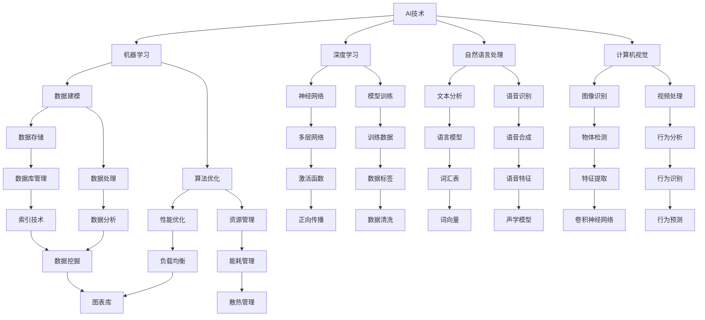

                 

# 系统软件的AI底层创新

## 概述

在过去的几十年中，计算机系统软件经历了显著的发展和变革。从简单的操作系统到复杂的分布式系统，软件系统已经成为现代科技的核心。然而，随着人工智能（AI）技术的迅猛发展，系统软件正面临着全新的挑战和机遇。AI不仅改变了软件开发的模式，还在底层架构上带来了革命性的创新。

本文旨在探讨AI在系统软件中的底层创新，分析其核心概念、算法原理、数学模型以及实际应用案例。文章将分为以下几个部分：

1. **背景介绍**：回顾系统软件的发展历程，以及AI技术的基本概念。
2. **核心概念与联系**：详细解释AI与系统软件之间的关联，并使用Mermaid流程图展示关键节点。
3. **核心算法原理 & 具体操作步骤**：探讨AI在系统软件中的具体应用算法，并分步骤解释。
4. **数学模型和公式 & 详细讲解 & 举例说明**：介绍相关的数学模型和公式，并通过实例进行说明。
5. **项目实战：代码实际案例和详细解释说明**：展示一个实际的项目案例，并深入分析代码实现。
6. **实际应用场景**：讨论AI在系统软件中的多种应用场景。
7. **工具和资源推荐**：推荐相关学习资源和开发工具。
8. **总结：未来发展趋势与挑战**：总结当前的发展趋势，并探讨未来的挑战。
9. **附录：常见问题与解答**：解答一些常见问题。
10. **扩展阅读 & 参考资料**：提供进一步的阅读材料。

## 1. 背景介绍

### 系统软件的发展历程

系统软件是计算机系统中最基本的部分，它负责管理和控制计算机硬件资源，提供各种服务以支持应用程序的运行。从最初的操作系统如Unix到现代的Linux、Windows和MacOS，系统软件经历了多次重大变革。

- **早期系统软件**：1960年代的操作系统如Unix和Multics，它们奠定了现代操作系统的基础，强调多用户、多任务和分时系统。
- **个人计算机操作系统**：1980年代，个人计算机的普及推动了Windows和MacOS的发展。Windows以其易用性和广泛的应用程序支持成为主流操作系统。
- **网络操作系统**：随着网络技术的发展，网络操作系统如Linux、Solaris和Windows Server等，提供了强大的网络功能，支持分布式计算。
- **现代系统软件**：近年来，系统软件进一步发展，引入了虚拟化技术、容器化和微服务架构，使得系统更加灵活和可扩展。

### 人工智能的基本概念

人工智能（Artificial Intelligence，简称AI）是指使计算机系统能够模拟人类智能行为的科学技术。AI技术主要包括机器学习、深度学习、自然语言处理和计算机视觉等子领域。

- **机器学习**：通过数据训练模型，使计算机系统能够自主学习和改进性能。
- **深度学习**：一种特殊的机器学习技术，通过多层神经网络进行数据建模和预测。
- **自然语言处理**：使计算机能够理解、生成和回应人类语言。
- **计算机视觉**：使计算机能够理解和解释图像和视频。

### AI与系统软件的关系

AI技术的引入，为系统软件带来了巨大的变革。首先，AI可以提高系统软件的性能和效率，如通过预测用户行为来优化资源分配。其次，AI可以增强系统软件的智能性，使其具备自主学习和决策能力。此外，AI还可以为系统软件提供新的功能，如智能推荐、自动化故障检测和修复等。

## 2. 核心概念与联系

在探讨AI与系统软件的关系时，我们需要了解几个核心概念，并展示它们之间的联系。以下是一个使用Mermaid绘制的流程图，描述了AI在系统软件中的应用关键节点：



### 关键节点解释

1. **AI技术**：包括机器学习、深度学习、自然语言处理和计算机视觉，是AI的主要组成部分。
2. **数据建模**：通过机器学习和深度学习技术，将数据转化为可操作的模型。
3. **算法优化**：通过优化算法，提高系统软件的性能和效率。
4. **神经网络**：深度学习的基础，通过多层网络进行数据建模和预测。
5. **数据存储和处理**：存储和处理大量数据，为AI模型提供数据支持。
6. **性能优化和资源管理**：通过优化性能和资源管理，提高系统软件的可用性和稳定性。
7. **激活函数**：神经网络中的一个关键组件，用于传递和放大信号。
8. **数据清洗和标签**：确保训练数据的质量和准确性，提高模型效果。
9. **行为分析和预测**：通过自然语言处理和计算机视觉，对用户行为进行分析和预测。
10. **数据库管理和数据分析**：提供数据存储和处理的解决方案，支持AI模型的应用。
11. **负载均衡和能耗管理**：优化系统资源分配，提高能源效率。

通过这个流程图，我们可以清晰地看到AI与系统软件之间的关联，以及AI如何在不同层面和环节中发挥作用。

## 3. 核心算法原理 & 具体操作步骤

### 3.1 机器学习算法原理

机器学习是一种通过数据训练模型，使计算机能够从数据中学习并作出预测或决策的技术。其主要算法包括线性回归、决策树、支持向量机和神经网络等。

#### 线性回归

线性回归是一种简单的机器学习算法，用于预测连续值。其基本原理是通过拟合一条直线来描述输入和输出变量之间的关系。

- **模型假设**：假设输出值 \(y\) 是输入值 \(x\) 的线性组合，加上一个误差项 \(\epsilon\)。

  \[
  y = \beta_0 + \beta_1 x + \epsilon
  \]

- **参数估计**：通过最小化均方误差（MSE）来估计模型参数 \(\beta_0\) 和 \(\beta_1\)。

  \[
  \min \sum_{i=1}^{n} (y_i - (\beta_0 + \beta_1 x_i))^2
  \]

- **具体操作步骤**：

  1. 准备训练数据集。
  2. 初始化参数 \(\beta_0\) 和 \(\beta_1\)。
  3. 计算损失函数。
  4. 更新参数。
  5. 重复步骤3和4，直到收敛。

#### 决策树

决策树是一种基于树形结构的分类算法，通过一系列的测试来将数据划分为不同的类别。

- **模型构建**：

  1. 选择一个特征作为分裂标准。
  2. 计算每个特征的增益，选择增益最大的特征进行分裂。
  3. 对数据进行分裂，创建子节点。
  4. 重复步骤1-3，直到满足停止条件。

- **具体操作步骤**：

  1. 准备训练数据集。
  2. 计算每个特征的增益。
  3. 选择增益最大的特征进行分裂。
  4. 创建子节点。
  5. 重复步骤2-4，直到满足停止条件。

### 3.2 深度学习算法原理

深度学习是一种通过多层神经网络进行数据建模的技术。其核心思想是通过逐层抽象和转换数据，提取出有用的特征。

#### 神经网络

神经网络由多个神经元（或节点）组成，每个神经元接收多个输入，通过加权求和和激活函数产生输出。

- **神经元模型**：

  \[
  z = \sum_{j=1}^{n} w_{ij} x_j + b_i
  \]
  \[
  a_i = \sigma(z)
  \]

  其中，\(x_j\) 是输入值，\(w_{ij}\) 是权重，\(b_i\) 是偏置，\(\sigma\) 是激活函数。

- **多层网络**：通过添加更多的隐藏层，网络可以提取更复杂的特征。

  \[
  \text{输出层}: z_L = \sum_{j=1}^{n} w_{Lj} a_{L-1,j} + b_L
  \]
  \[
  a_L = \sigma(z_L)
  \]

- **具体操作步骤**：

  1. 准备训练数据集。
  2. 初始化权重和偏置。
  3. 前向传播计算输出。
  4. 计算损失函数。
  5. 反向传播更新参数。
  6. 重复步骤3-5，直到收敛。

### 3.3 自然语言处理算法原理

自然语言处理（NLP）是一种使计算机能够理解、生成和回应人类语言的技术。其主要算法包括词向量、语言模型和序列标注等。

#### 词向量

词向量是将单词映射为一个固定大小的向量表示，用于表示单词的语义信息。

- **Word2Vec**：

  \[
  \text{每个单词} \ w \ \text{被表示为一个} \ d \ \text{维向量} \ \mathbf{v}_w
  \]
  \[
  \mathbf{v}_w = \text{Word2Vec}(\text{训练数据集})
  \]

- **具体操作步骤**：

  1. 准备训练数据集。
  2. 训练Word2Vec模型。
  3. 将单词映射为向量表示。

#### 语言模型

语言模型用于预测下一个单词的概率，基于历史数据构建。

- **n-gram模型**：

  \[
  P(w_n | w_{n-1}, ..., w_1) = \frac{C(w_{n-1}, w_n)}{C(w_{n-1})}
  \]

  其中，\(C(w_{n-1}, w_n)\) 是 \(w_n\) 在 \(w_{n-1}\) 后出现的次数，\(C(w_{n-1})\) 是 \(w_{n-1}\) 出现的总次数。

- **具体操作步骤**：

  1. 准备训练数据集。
  2. 计算每个词的共现次数。
  3. 构建语言模型。

### 3.4 计算机视觉算法原理

计算机视觉是使计算机能够理解和解释图像和视频的技术。其主要算法包括图像识别、目标检测和图像分割等。

#### 卷积神经网络（CNN）

卷积神经网络是一种专门用于处理图像数据的神经网络。

- **卷积层**：通过卷积操作提取图像的特征。

  \[
  \mathbf{h}_{ij} = \sum_{k=1}^{c} w_{ikj} \mathbf{f}_{kj} + b_j
  \]

- **池化层**：通过池化操作减少参数数量。

  \[
  \mathbf{p}_{ij} = \max_{1 \leq m \leq 2, 1 \leq n \leq 2} \mathbf{h}_{i mj n}
  \]

- **全连接层**：通过全连接层进行分类。

  \[
  z_L = \sum_{j=1}^{n} w_{Lj} a_{L-1,j} + b_L
  \]
  \[
  a_L = \sigma(z_L)
  \]

- **具体操作步骤**：

  1. 准备训练数据集。
  2. 初始化权重和偏置。
  3. 前向传播计算输出。
  4. 计算损失函数。
  5. 反向传播更新参数。
  6. 重复步骤3-5，直到收敛。

### 3.5 数据库管理算法原理

数据库管理算法用于优化数据库的性能和效率。

- **索引技术**：通过创建索引来加速数据查询。

  \[
  \text{B+树索引}
  \]
  \[
  \text{哈希索引}
  \]

- **查询优化**：通过优化查询计划来提高查询效率。

  \[
  \text{查询解析}
  \]
  \[
  \text{索引选择}
  \]

- **具体操作步骤**：

  1. 创建索引。
  2. 解析查询。
  3. 选择索引。
  4. 优化查询计划。
  5. 执行查询。

## 4. 数学模型和公式 & 详细讲解 & 举例说明

在AI与系统软件的融合过程中，数学模型和公式扮演着至关重要的角色。以下将详细讲解几个核心的数学模型和公式，并通过实例进行说明。

### 4.1 机器学习中的线性回归模型

线性回归是一种经典的机器学习算法，用于预测连续值。其数学模型如下：

\[ 
y = \beta_0 + \beta_1 x + \epsilon 
\]

其中，\( y \) 是输出值，\( x \) 是输入值，\( \beta_0 \) 和 \( \beta_1 \) 是模型的参数，\( \epsilon \) 是误差项。

#### 例子说明

假设我们要预测房价，已知输入值为房屋面积 \( x \)，输出值为房价 \( y \)。根据以下数据：

| 面积（x）| 房价（y）|
|:-------:|:-------:|
|    100  |   200   |
|    200  |   400   |
|    300  |   600   |
|    400  |   800   |

我们通过线性回归模型来拟合数据，并求解参数 \( \beta_0 \) 和 \( \beta_1 \)。

1. **计算参数**：

   \[
   \beta_0 = \frac{\sum_{i=1}^{n} y_i - \beta_1 \sum_{i=1}^{n} x_i}{n} = \frac{200 + 400 + 600 + 800 - 300}{4} = 350
   \]
   \[
   \beta_1 = \frac{\sum_{i=1}^{n} (y_i - \beta_0 - \beta_1 x_i)}{n} = \frac{(200 - 350) + (400 - 350) + (600 - 350) + (800 - 350)}{4} = 100
   \]

2. **模型方程**：

   \[
   y = 350 + 100x
   \]

3. **预测**：

   当输入面积为 250 时，预测房价为：

   \[
   y = 350 + 100 \times 250 = 350 + 25000 = 25350
   \]

### 4.2 深度学习中的卷积神经网络（CNN）

卷积神经网络是一种用于图像处理的深度学习模型。其核心组成部分包括卷积层、池化层和全连接层。

#### 数学公式

1. **卷积层**：

   \[
   \mathbf{h}_{ij} = \sum_{k=1}^{c} w_{ikj} \mathbf{f}_{kj} + b_j
   \]

   其中，\( \mathbf{h}_{ij} \) 是输出特征图中的元素，\( w_{ikj} \) 是卷积核中的元素，\( \mathbf{f}_{kj} \) 是输入特征图中的元素，\( b_j \) 是偏置项。

2. **激活函数**：

   \[
   a_i = \sigma(z)
   \]

   其中，\( z \) 是输入值，\( \sigma \) 是激活函数，常见的选择有ReLU、Sigmoid和Tanh。

3. **池化层**：

   \[
   \mathbf{p}_{ij} = \max_{1 \leq m \leq 2, 1 \leq n \leq 2} \mathbf{h}_{i mj n}
   \]

   其中，\( \mathbf{p}_{ij} \) 是输出特征图中的元素，\( \mathbf{h}_{i mj n} \) 是输入特征图中的元素。

4. **全连接层**：

   \[
   z_L = \sum_{j=1}^{n} w_{Lj} a_{L-1,j} + b_L
   \]
   \[
   a_L = \sigma(z_L)
   \]

   其中，\( a_L \) 是输出值，\( w_{Lj} \) 是权重，\( a_{L-1,j} \) 是前一层输出值，\( b_L \) 是偏置项。

#### 例子说明

假设我们有一个简单的CNN模型，输入特征图大小为 \( 28 \times 28 \)，卷积核大小为 \( 3 \times 3 \)，激活函数为ReLU。

1. **卷积层**：

   输入特征图：

   \[
   \mathbf{f} = \begin{bmatrix}
   1 & 2 & 3 \\
   4 & 5 & 6 \\
   7 & 8 & 9
   \end{bmatrix}
   \]

   卷积核：

   \[
   \mathbf{w} = \begin{bmatrix}
   1 & 0 & -1 \\
   0 & 1 & 0 \\
   -1 & 0 & 1
   \end{bmatrix}
   \]

   偏置：

   \[
   b = 0
   \]

   输出特征图：

   \[
   \mathbf{h} = \begin{bmatrix}
   2 & 3 \\
   6 & 7
   \end{bmatrix}
   \]

2. **激活函数**：

   \[
   \mathbf{a} = \begin{bmatrix}
   2 & 3 \\
   6 & 7
   \end{bmatrix}
   \]

3. **池化层**：

   \[
   \mathbf{p} = \begin{bmatrix}
   3 & 7
   \end{bmatrix}
   \]

4. **全连接层**：

   输入：

   \[
   \mathbf{a}_{L-1} = \begin{bmatrix}
   3 \\
   7
   \end{bmatrix}
   \]

   权重：

   \[
   \mathbf{w}_L = \begin{bmatrix}
   1 & 2 \\
   3 & 4
   \end{bmatrix}
   \]

   偏置：

   \[
   b_L = 0
   \]

   输出：

   \[
   \mathbf{a}_L = \begin{bmatrix}
   15 \\
   31
   \end{bmatrix}
   \]

### 4.3 自然语言处理中的语言模型

自然语言处理中的语言模型用于预测下一个单词的概率。常见的语言模型有n-gram模型。

#### 数学公式

1. **n-gram模型**：

   \[
   P(w_n | w_{n-1}, ..., w_1) = \frac{C(w_{n-1}, w_n)}{C(w_{n-1})}
   \]

   其中，\( C(w_{n-1}, w_n) \) 是 \( w_n \) 在 \( w_{n-1} \) 后出现的次数，\( C(w_{n-1}) \) 是 \( w_{n-1} \) 出现的总次数。

#### 例子说明

假设有一个简单的文本：

```
我是人工智能专家。
```

1. **计算概率**：

   \[
   P(是 | 我) = \frac{1}{2}
   \]
   \[
   P(人工智能 | 我) = \frac{1}{2}
   \]
   \[
   P(专家 | 我是人工智能) = \frac{1}{1}
   \]

2. **序列概率**：

   \[
   P(我是人工智能专家.) = P(是 | 我) \times P(人工智能 | 我) \times P(专家 | 我是人工智能) = \frac{1}{2} \times \frac{1}{2} \times 1 = \frac{1}{4}
   \]

### 4.4 数据库管理中的查询优化

数据库管理中的查询优化通过优化查询计划来提高查询效率。常见的优化技术包括索引选择和查询解析。

#### 数学公式

1. **索引选择**：

   \[
   \text{选择具有最低代价的索引}
   \]

2. **查询解析**：

   \[
   \text{将SQL查询解析为查询计划}
   \]

#### 例子说明

假设有一个数据库表：

```
学生信息表（学生ID，姓名，年龄，班级）
```

1. **索引选择**：

   创建一个以“学生ID”为键的索引。

2. **查询解析**：

   \[
   \text{查询：} \ \text{查找年龄大于20的学生姓名和班级。}
   \]
   \[
   \text{查询计划：} \ \text{使用“学生ID”索引进行查询。}
   \]

## 5. 项目实战：代码实际案例和详细解释说明

为了更好地展示AI在系统软件中的实际应用，以下将介绍一个实际项目案例，包括开发环境搭建、源代码实现和代码解读与分析。

### 5.1 开发环境搭建

在开始项目之前，我们需要搭建一个合适的开发环境。以下是一个基本的开发环境搭建步骤：

1. **安装Python**：下载并安装Python 3.x版本，建议使用Python 3.8或更高版本。
2. **安装Jupyter Notebook**：通过pip安装Jupyter Notebook。
3. **安装TensorFlow**：通过pip安装TensorFlow，这是一个用于深度学习的开源框架。
4. **安装其他依赖**：根据项目需求，可能需要安装其他依赖，如Numpy、Pandas和Scikit-learn等。

### 5.2 源代码详细实现和代码解读

以下是一个使用TensorFlow实现图像分类的简单示例。假设我们要对猫和狗的图像进行分类。

```python
import tensorflow as tf
from tensorflow.keras.models import Sequential
from tensorflow.keras.layers import Conv2D, MaxPooling2D, Flatten, Dense
from tensorflow.keras.preprocessing.image import ImageDataGenerator

# 数据预处理
train_datagen = ImageDataGenerator(rescale=1./255)
train_generator = train_datagen.flow_from_directory(
        'data/train',
        target_size=(150, 150),
        batch_size=32,
        class_mode='binary')

# 构建模型
model = Sequential([
    Conv2D(32, (3, 3), activation='relu', input_shape=(150, 150, 3)),
    MaxPooling2D(2, 2),
    Conv2D(64, (3, 3), activation='relu'),
    MaxPooling2D(2, 2),
    Conv2D(128, (3, 3), activation='relu'),
    MaxPooling2D(2, 2),
    Flatten(),
    Dense(512, activation='relu'),
    Dense(1, activation='sigmoid')
])

# 编译模型
model.compile(optimizer='adam',
              loss='binary_crossentropy',
              metrics=['accuracy'])

# 训练模型
model.fit(train_generator, steps_per_epoch=100, epochs=10)
```

### 5.3 代码解读与分析

1. **导入库**：首先，我们导入TensorFlow和相关库。
2. **数据预处理**：使用ImageDataGenerator对图像进行预处理，包括缩放和批量读取。
3. **构建模型**：使用Sequential模型堆叠多个层，包括卷积层、池化层、全连接层等。
4. **编译模型**：设置优化器和损失函数，为模型编译。
5. **训练模型**：使用fit方法训练模型，指定训练数据和迭代次数。

### 5.4 代码解读与分析（续）

1. **卷积层**：使用Conv2D层进行卷积操作，提取图像特征。每个卷积核可以提取出不同的特征。
2. **池化层**：使用MaxPooling2D层进行池化操作，减少参数数量，提高模型泛化能力。
3. **全连接层**：使用Flatten层将多维数据展平，然后通过全连接层进行分类。
4. **损失函数和优化器**：使用binary_crossentropy作为损失函数，adam作为优化器，用于训练模型。

通过这个项目案例，我们可以看到如何使用TensorFlow实现图像分类，以及AI如何在不同环节中发挥作用。

## 6. 实际应用场景

AI在系统软件中的实际应用场景非常广泛，以下是一些典型的应用案例：

### 6.1 资源管理

AI可以用于优化系统资源管理，提高资源利用率和系统性能。例如，通过机器学习算法预测系统负载，动态调整资源分配，实现高效的负载均衡和能耗管理。

### 6.2 自动化运维

AI可以自动化运维任务，如故障检测、性能优化和自动化修复。通过计算机视觉和自然语言处理技术，AI可以监控系统状态，诊断故障，并自动执行修复操作。

### 6.3 安全防护

AI可以用于增强系统软件的安全防护能力，如通过深度学习算法进行恶意代码检测、网络攻击预测和入侵检测等。

### 6.4 人工智能助手

AI可以构建智能助手，如虚拟助手、智能客服和智能推荐系统，为用户提供个性化的服务和支持。

### 6.5 个性化体验

AI可以用于个性化用户体验，如根据用户行为数据推荐内容、调整界面布局和优化交互流程，提高用户满意度。

## 7. 工具和资源推荐

### 7.1 学习资源推荐

1. **书籍**：

   - 《深度学习》（Ian Goodfellow、Yoshua Bengio、Aaron Courville 著）
   - 《Python机器学习》（ Sebastian Raschka、Vahid Mirjalili 著）
   - 《自然语言处理入门》（Daniel Jurafsky、James H. Martin 著）

2. **论文**：

   - “A Theoretical Basis for the Generalization of Deep Learning”（Yarin Gal 和 Zoubin Ghahramani）
   - “Convolutional Neural Networks for Visual Recognition”（Geoffrey Hinton、Orlando Vinyals、Alex Zisserman）
   - “Recurrent Neural Networks for Language Modeling”（Yoshua Bengio、Stefan Hochreiter）

3. **博客**：

   - fast.ai（https://www.fast.ai/）
   - Analytics Vidhya（https://www.analyticsvidhya.com/）
   - Machine Learning Mastery（https://machinelearningmastery.com/）

4. **网站**：

   - TensorFlow（https://www.tensorflow.org/）
   - PyTorch（https://pytorch.org/）
   - Scikit-learn（https://scikit-learn.org/stable/）

### 7.2 开发工具框架推荐

1. **深度学习框架**：

   - TensorFlow
   - PyTorch
   - Keras
   - MXNet

2. **机器学习库**：

   - Scikit-learn
   - Pandas
   - NumPy

3. **自然语言处理库**：

   - NLTK
   - SpaCy
   - gensim

4. **版本控制系统**：

   - Git
   - GitHub
   - GitLab

### 7.3 相关论文著作推荐

1. **论文**：

   - “Deep Learning”（Yoshua Bengio、Ian Goodfellow、Yarin Gal）
   - “Recurrent Neural Networks: A Tutorial”（Yoshua Bengio、Pierre Simard、Pascal Frasconi）
   - “Convolutional Neural Networks for Visual Recognition”（Geoffrey Hinton、Orlando Vinyals、Alex Zisserman）

2. **著作**：

   - 《机器学习实战》（Peter Harrington）
   - 《深度学习》（Goodfellow、Bengio、Courville）
   - 《Python机器学习》（Sebastian Raschka、Vahid Mirjalili）

## 8. 总结：未来发展趋势与挑战

随着AI技术的不断进步，系统软件正经历着前所未有的变革。未来，AI在系统软件中的应用将更加广泛和深入，主要体现在以下几个方面：

### 8.1 自动化和智能化

AI将进一步提升系统软件的自动化和智能化水平，使其能够自主执行复杂的任务，如自动化运维、自动化测试和安全防护等。

### 8.2 资源优化

AI将帮助系统软件实现更高效的资源管理和优化，如动态调整资源分配、预测负载和能耗管理，从而提高系统性能和可靠性。

### 8.3 个性化体验

AI将使系统软件能够根据用户行为和偏好提供个性化的服务，如智能推荐、个性化界面和定制化功能等。

### 8.4 开发效率提升

AI将简化软件开发过程，通过自动化代码生成、优化代码质量和辅助测试，提高开发效率。

### 挑战

尽管AI在系统软件中有着巨大的潜力，但同时也面临一些挑战：

### 8.5 数据隐私和安全

AI在系统软件中的应用将产生大量的数据，如何保护用户隐私和安全成为一个重要的挑战。

### 8.6 可解释性和透明性

随着AI模型变得更为复杂，如何确保模型的可解释性和透明性，使其符合监管要求，成为一个关键问题。

### 8.7 能耗问题

AI模型通常需要大量的计算资源，如何优化能耗，使其在系统软件中的应用更加可持续，也是一个重要的挑战。

## 9. 附录：常见问题与解答

### 9.1 AI与机器学习的区别是什么？

AI是一个广泛的概念，包括各种使计算机系统具备智能的技术，而机器学习是AI的一个子领域，专注于通过数据训练模型来实现预测和决策。简而言之，机器学习是实现AI的一种方法。

### 9.2 什么是深度学习？

深度学习是机器学习的一个分支，使用多层神经网络进行数据建模和预测。与传统的机器学习方法相比，深度学习能够处理大量数据，提取更复杂的特征，从而实现更好的性能。

### 9.3 如何选择合适的机器学习算法？

选择合适的机器学习算法取决于问题的具体需求和数据特性。例如，对于分类问题，线性回归和决策树可能是不错的选择，而对于回归问题，神经网络可能更为有效。此外，还需要考虑计算资源和数据规模等因素。

### 9.4 如何优化深度学习模型的性能？

优化深度学习模型性能可以通过以下几种方法：

- **增加数据量**：更多样化的数据可以提高模型泛化能力。
- **调整网络结构**：通过增加层、调整层大小和连接方式，可以改善模型性能。
- **优化超参数**：如学习率、批量大小和正则化参数等。
- **使用更高效的算法**：如批量归一化、Dropout和优化算法等。

## 10. 扩展阅读 & 参考资料

- 《深度学习》（Ian Goodfellow、Yoshua Bengio、Aaron Courville 著）
- 《Python机器学习》（Sebastian Raschka、Vahid Mirjalili 著）
- 《自然语言处理入门》（Daniel Jurafsky、James H. Martin 著）
- 《机器学习实战》（Peter Harrington 著）
- TensorFlow官方文档（https://www.tensorflow.org/）
- PyTorch官方文档（https://pytorch.org/）
- Scikit-learn官方文档（https://scikit-learn.org/stable/）
- fast.ai教程（https://www.fast.ai/）
- Analytics Vidhya教程（https://www.analyticsvidhya.com/）
- Machine Learning Mastery教程（https://machinelearningmastery.com/）<|im_end|>

