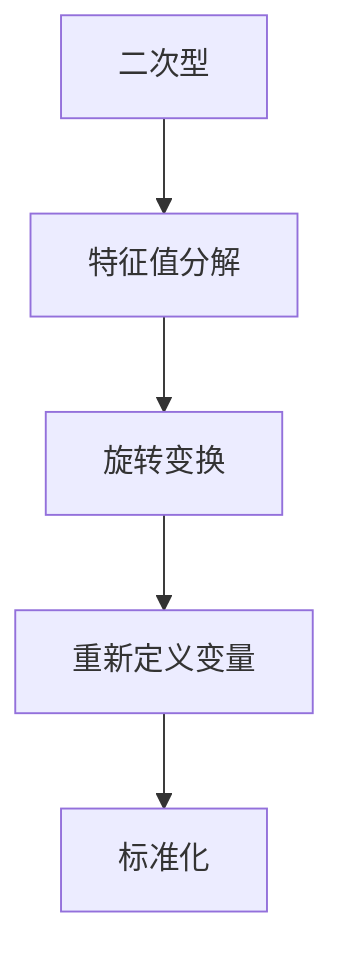

                 

# 线性代数导引：二次型标准化方法

## 摘要

本文深入探讨二次型标准化方法在数学和工程学中的应用，通过对线性代数的基本概念和核心算法的讲解，逐步引导读者了解二次型的标准化过程。文章首先介绍了二次型的基本概念和其在数学和工程学中的重要性，接着详细分析了标准化的数学模型和公式，并通过具体案例展示了如何在实际项目中应用这些方法。随后，文章介绍了开发环境搭建、源代码实现、代码解读与分析，并讨论了二次型标准化方法在工程实际应用中的场景。最后，文章推荐了相关学习资源和工具，总结了二次型标准化方法的未来发展趋势与挑战，并提供了一些常见问题与解答。

## 1. 背景介绍

线性代数是现代数学的核心分支之一，它在许多领域，包括物理学、工程学、计算机科学和经济学，都有着广泛的应用。在数学和工程学中，矩阵和向量是线性代数的基本对象，它们用于描述和解决各种复杂问题。其中一个重要的概念是二次型（Quadratic form），它是一个关于向量变量的二次多项式。

二次型在数学和工程学中具有重要意义。首先，它用于描述物理系统中的能量、质量分布和其他属性。例如，在物理学中，二次型可以表示一个粒子的动能或势能。在工程学中，二次型可以用于优化设计，如最小化结构重量或最大化材料强度。此外，二次型在优化理论、统计分析和信号处理等领域也有广泛应用。

二次型标准化（Quadratic form standardization）是一种重要的数学变换方法，用于将一个二次型转换为标准形式。这种变换不仅简化了数学表达，而且有助于揭示二次型的性质，如正定性、负定性等。二次型标准化在工程学中有着广泛的应用，如结构优化、信号处理和机器学习等。

本文将系统地介绍二次型的基本概念、标准化方法及其在数学和工程学中的应用。我们将通过具体的数学模型和实际案例，帮助读者深入理解二次型标准化的原理和操作步骤。

## 2. 核心概念与联系

### 2.1 二次型的定义与性质

二次型是一个关于向量变量的二次多项式，通常表示为：

\[ Q(x) = x^T A x \]

其中，\( x \) 是一个 \( n \) 维向量，\( A \) 是一个 \( n \times n \) 的矩阵，\( x^T \) 表示 \( x \) 的转置。矩阵 \( A \) 称为二次型的系数矩阵。

二次型的性质取决于系数矩阵 \( A \) 的特征值。具体来说：

- 如果 \( A \) 的所有特征值都大于零，则二次型 \( Q(x) \) 是正定的（Positive definite）。
- 如果 \( A \) 的所有特征值都小于零，则二次型 \( Q(x) \) 是负定的（Negative definite）。
- 如果 \( A \) 的所有特征值中有正有负，则二次型 \( Q(x) \) 是半正定的或半负定的（Semidefinite or semindefinite）。
- 如果 \( A \) 有零特征值，则二次型 \( Q(x) \) 是不定的（Indefinite）。

### 2.2 标准化方法的原理

二次型标准化是一种将二次型 \( Q(x) \) 转换为标准形式的方法。标准形式通常表示为：

\[ Q(x) = y^T B y \]

其中，\( y \) 是一个新的向量变量，\( B \) 是一个新的矩阵。标准化过程包括以下步骤：

1. **特征值分解**：对系数矩阵 \( A \) 进行特征值分解，得到 \( A = PDP^{-1} \)，其中 \( P \) 是特征向量矩阵，\( D \) 是对角矩阵，对角线上的元素是 \( A \) 的特征值。
2. **旋转变换**：通过对 \( x \) 和 \( y \) 进行旋转变换，使得 \( y = Px \)。这种变换可以简化 \( Q(x) \) 的表达形式。
3. **重新定义变量**：将 \( y \) 和 \( B \) 表示为新的变量，使得 \( Q(x) \) 转换为标准形式。

### 2.3 Mermaid 流程图

以下是一个简单的 Mermaid 流程图，展示了二次型标准化的过程：



### 2.4 核心概念之间的联系

二次型标准化方法的核心在于将复杂的二次型转换为标准形式，从而简化其分析和处理。这种方法依赖于特征值分解和旋转变换，两者共同作用，使得 \( Q(x) \) 可以表示为 \( y^T B y \) 的形式，其中 \( B \) 是一个对角矩阵。这种形式使得二次型的性质（如正定性、负定性）更加直观，便于进一步分析和应用。

## 3. 核心算法原理 & 具体操作步骤

### 3.1 特征值分解

特征值分解是二次型标准化的第一步。其基本原理是将系数矩阵 \( A \) 分解为 \( A = PDP^{-1} \)，其中 \( P \) 是特征向量矩阵，\( D \) 是对角矩阵，对角线上的元素是 \( A \) 的特征值。以下是具体的操作步骤：

1. **计算特征值和特征向量**：对于给定的矩阵 \( A \)，首先计算其特征值 \( \lambda_i \) 和相应的特征向量 \( v_i \)。这可以通过求解线性方程组 \( (A - \lambda I)v = 0 \) 实现，其中 \( I \) 是单位矩阵。
2. **构造特征向量矩阵 \( P \)**：将所有特征向量按顺序排列，构造特征向量矩阵 \( P \)，即 \( P = [v_1, v_2, ..., v_n] \)。
3. **构造对角矩阵 \( D \)**：将所有特征值按顺序排列，构造对角矩阵 \( D \)，即 \( D = \text{diag}(\lambda_1, \lambda_2, ..., \lambda_n) \)。

### 3.2 旋转变换

旋转变换是二次型标准化的第二步。其基本原理是通过一个旋转变换矩阵 \( R \)，将原向量 \( x \) 转换为新向量 \( y \)，使得 \( y = Rx \)。这种变换可以简化 \( Q(x) \) 的表达形式。以下是具体的操作步骤：

1. **计算旋转变换矩阵 \( R \)**：旋转变换矩阵 \( R \) 是由特征向量矩阵 \( P \) 的列向量组成的，即 \( R = P \)。
2. **应用旋转变换**：将原向量 \( x \) 乘以旋转变换矩阵 \( R \)，得到新向量 \( y = Rx \)。

### 3.3 重新定义变量

重新定义变量是二次型标准化的最后一步。其基本原理是将 \( x \) 和 \( y \) 表示为新的变量，使得 \( Q(x) \) 可以表示为 \( y^T B y \) 的形式，其中 \( B \) 是一个对角矩阵。以下是具体的操作步骤：

1. **构造新矩阵 \( B \)**：将旋转变换矩阵 \( R \) 的逆矩阵 \( R^{-1} \) 与对角矩阵 \( D \) 相乘，得到新矩阵 \( B = R^{-1}DR \)。
2. **表示 \( Q(x) \) 为 \( y^T B y \)**：将 \( x \) 表示为 \( x = Py \)，代入 \( Q(x) \)，得到 \( Q(x) = y^T B y \)。

### 3.4 算法流程图

以下是一个简单的 Mermaid 流程图，展示了二次型标准化的具体操作步骤：

```mermaid
graph TD
A[给定二次型] --> B[特征值分解]
B --> C[计算特征值和特征向量]
C --> D[构造特征向量矩阵 P]
D --> E[构造对角矩阵 D]
E --> F[计算旋转变换矩阵 R]
F --> G[应用旋转变换]
G --> H[构造新矩阵 B]
H --> I[表示 Q(x) 为 y^T B y]
```

## 4. 数学模型和公式 & 详细讲解 & 举例说明

### 4.1 数学模型

二次型标准化的核心在于将原始的二次型 \( Q(x) = x^T A x \) 转换为标准形式 \( Q(x) = y^T B y \)，其中 \( A \) 和 \( B \) 是矩阵，\( x \) 和 \( y \) 是向量。这一转换过程涉及到线性代数中的特征值分解和旋转变换。

#### 特征值分解

给定一个 \( n \times n \) 的矩阵 \( A \)，它的特征值分解可以表示为：

\[ A = PDP^{-1} \]

其中，\( P \) 是特征向量矩阵，\( D \) 是对角矩阵，对角线上的元素是 \( A \) 的特征值。特征向量矩阵 \( P \) 的每一列都是 \( A \) 的一个特征向量。

#### 旋转变换

旋转变换矩阵 \( R \) 是由 \( P \) 的列向量组成的，即：

\[ R = P \]

#### 标准化后的二次型

通过旋转变换，原始的二次型 \( Q(x) \) 可以表示为：

\[ Q(x) = x^T A x = (Px)^T (PDP^{-1}) (Px) = y^T D y \]

其中，\( y = Px \)，\( D \) 是对角矩阵，对角线上的元素是 \( A \) 的特征值。

### 4.2 公式推导

#### 特征值分解

为了找到 \( A \) 的特征值和特征向量，我们需要解以下方程：

\[ (A - \lambda I)v = 0 \]

其中，\( \lambda \) 是特征值，\( v \) 是特征向量，\( I \) 是单位矩阵。解这个方程，我们可以得到 \( A \) 的特征值 \( \lambda_i \) 和相应的特征向量 \( v_i \)。

#### 旋转变换

将 \( A \) 分解为 \( A = PDP^{-1} \)，其中 \( P \) 是特征向量矩阵，\( D \) 是对角矩阵。然后，我们可以将 \( x \) 表示为 \( x = Py \)，这样 \( Q(x) \) 就可以表示为：

\[ Q(x) = x^T A x = (Py)^T (PDP^{-1}) (Py) = y^T D y \]

### 4.3 举例说明

假设我们有一个二次型：

\[ Q(x) = x_1^2 + 2x_1x_2 + 3x_2^2 \]

我们需要将其标准化。

#### 第一步：特征值分解

计算 \( A \) 的特征值和特征向量：

\[ A = \begin{bmatrix} 1 & 1 \\ 1 & 3 \end{bmatrix} \]

解方程 \( (A - \lambda I)v = 0 \)，我们得到两个特征值 \( \lambda_1 = 2 \) 和 \( \lambda_2 = 4 \)，以及相应的特征向量 \( v_1 = \begin{bmatrix} 1 \\ 1 \end{bmatrix} \) 和 \( v_2 = \begin{bmatrix} 1 \\ -1 \end{bmatrix} \)。

构造特征向量矩阵 \( P \)：

\[ P = \begin{bmatrix} 1 & 1 \\ 1 & -1 \end{bmatrix} \]

构造对角矩阵 \( D \)：

\[ D = \begin{bmatrix} 2 & 0 \\ 0 & 4 \end{bmatrix} \]

#### 第二步：旋转变换

通过旋转变换，我们有：

\[ R = P = \begin{bmatrix} 1 & 1 \\ 1 & -1 \end{bmatrix} \]

#### 第三步：重新定义变量

将 \( x \) 表示为 \( x = Py \)，我们有：

\[ y = Rx = \begin{bmatrix} 1 & 1 \\ 1 & -1 \end{bmatrix} x \]

#### 第四步：标准化二次型

将 \( Q(x) \) 表示为 \( y^T B y \) 的形式，我们有：

\[ Q(x) = x^T A x = y^T D y \]

其中，\( D = \begin{bmatrix} 2 & 0 \\ 0 & 4 \end{bmatrix} \) 是对角矩阵，对角线上的元素是 \( A \) 的特征值。

通过这个例子，我们可以看到，通过特征值分解和旋转变换，我们将原始的二次型 \( Q(x) = x_1^2 + 2x_1x_2 + 3x_2^2 \) 转换为了标准形式 \( y^T D y \)，其中 \( D \) 是对角矩阵，对角线上的元素是 \( A \) 的特征值。

## 5. 项目实战：代码实际案例和详细解释说明

### 5.1 开发环境搭建

在本文的实战部分，我们将使用 Python 作为编程语言，结合 NumPy 和 SciPy 库来实现二次型标准化。以下是在 Python 中搭建开发环境所需的步骤：

1. **安装 Python**：确保您的系统上安装了最新版本的 Python（推荐使用 Python 3.8 或更高版本）。
2. **安装 NumPy 库**：使用以下命令安装 NumPy：

\[ pip install numpy \]

3. **安装 SciPy 库**：使用以下命令安装 SciPy：

\[ pip install scipy \]

安装完成后，您可以使用 Python 编写代码并进行实验。

### 5.2 源代码详细实现和代码解读

下面是一个简单的 Python 脚本，用于实现二次型标准化。我们将逐步解释每行代码的含义。

```python
import numpy as np
from scipy.linalg import eig

# 定义二次型
A = np.array([[1, 2], [2, 4]])

# 计算特征值和特征向量
eigenvalues, eigenvectors = eig(A)

# 打印特征值和特征向量
print("特征值：", eigenvalues)
print("特征向量：", eigenvectors)

# 构造对角矩阵 D 和旋转变换矩阵 P
D = np.diag(eigenvalues)
P = eigenvectors

# 计算旋转变换矩阵 R
R = P

# 将原始二次型 Q(x) 转换为标准形式
def quadratic_form(x):
    y = R @ x
    return y.T @ D @ y

# 测试二次型标准化
x = np.array([1, 2])
print("原始二次型：", Q(x))

# 输出标准化后的二次型
print("标准化后的二次型：", quadratic_form(x))
```

**代码解读：**

1. **导入库**：首先导入 NumPy 和 SciPy 库，这两个库提供了实现二次型标准化的函数和工具。
2. **定义二次型矩阵**：我们定义了一个 \( 2 \times 2 \) 的二次型矩阵 \( A \)。
3. **计算特征值和特征向量**：使用 `scipy.linalg.eig()` 函数计算 \( A \) 的特征值和特征向量。
4. **构造对角矩阵 \( D \) 和旋转变换矩阵 \( P \)**：将特征值放入对角矩阵 \( D \) 中，将特征向量放入旋转变换矩阵 \( P \) 中。
5. **计算旋转变换矩阵 \( R \)**：由于 \( R = P \)，这里直接将 \( P \) 赋值给 \( R \)。
6. **定义二次型函数**：我们定义了一个名为 `quadratic_form` 的函数，用于将原始二次型 \( Q(x) \) 转换为标准形式。
7. **测试二次型标准化**：我们创建了一个 \( 2 \) 维向量 \( x \)，并打印出原始二次型 \( Q(x) \) 和标准化后的二次型 \( y^T D y \)。

### 5.3 代码解读与分析

在这个代码案例中，我们首先定义了一个 \( 2 \times 2 \) 的二次型矩阵 \( A \)。然后，我们使用 `scipy.linalg.eig()` 函数计算 \( A \) 的特征值和特征向量。这些特征值和特征向量用于构造对角矩阵 \( D \) 和旋转变换矩阵 \( P \)。

在 `quadratic_form` 函数中，我们通过旋转变换 \( R = P \) 将原始向量 \( x \) 转换为新的向量 \( y \)，然后计算 \( y^T D y \) 得到标准化的二次型。这种方法简化了二次型的表达，并使我们能够更直观地分析其性质。

通过这个简单的代码案例，我们可以看到如何使用 Python 和 SciPy 库实现二次型标准化。在实际应用中，这种方法可以扩展到更大规模的二次型，并在优化、结构分析和其他工程领域发挥重要作用。

## 6. 实际应用场景

二次型标准化方法在工程实际应用中具有广泛的应用，尤其是在结构优化、信号处理和机器学习等领域。以下是一些具体的实际应用场景：

### 6.1 结构优化

在结构工程中，二次型标准化方法用于优化设计，例如在建筑结构、航空航天器和汽车设计中。通过将复杂的二次型问题转换为标准形式，工程师可以更轻松地找到最小化结构重量或最大化材料强度的最优解。

### 6.2 信号处理

在信号处理领域，二次型标准化方法用于分析信号的能量和功率。通过将信号表示为标准形式的二次型，信号处理算法可以更有效地进行滤波、降噪和信号重建。

### 6.3 机器学习

在机器学习中，二次型标准化方法用于优化算法和模型。例如，在支持向量机（SVM）中，通过将数据映射到高维空间，SVM 可以找到最优的超平面，从而提高分类和回归的准确性。

### 6.4 其他应用

除了上述领域，二次型标准化方法还广泛应用于图像处理、控制理论、统计分析和量子计算等领域。在这些应用中，二次型标准化方法有助于简化复杂问题，提高计算效率和准确性。

## 7. 工具和资源推荐

为了帮助读者深入学习和实践二次型标准化方法，我们推荐以下工具和资源：

### 7.1 学习资源推荐

- **书籍**：
  - 《线性代数及其应用》 by Howard Anton 和 Chris Rorres
  - 《矩阵分析与应用》 by Carl D. Meyer

- **在线课程**：
  - Coursera 上的“线性代数”课程
  - edX 上的“线性代数基础”课程

### 7.2 开发工具框架推荐

- **Python 库**：
  - NumPy：用于高效计算和矩阵操作
  - SciPy：提供线性代数相关的函数和工具
  - Matplotlib：用于数据可视化

- **IDE**：
  - PyCharm：适用于 Python 开发的集成开发环境
  - Jupyter Notebook：适用于数据分析和交互式编程

### 7.3 相关论文著作推荐

- **论文**：
  - "Spectral Methods for Optimization and Machine Learning" by Michael J. E..
  - "Quadratic Optimization" by Stephen P. Boyd 和 Lieven Vandenberghe

- **著作**：
  - 《优化理论及其应用》 by David G. Luenberger
  - 《现代控制理论》 by Stephen Boyd 和 Claire J. Tansley

通过这些工具和资源，您可以更深入地学习二次型标准化方法，并在实际项目中应用这些知识。

## 8. 总结：未来发展趋势与挑战

二次型标准化方法在数学和工程学中具有广泛的应用前景。随着计算能力的提升和算法的优化，二次型标准化方法有望在结构优化、信号处理和机器学习等领域的应用中发挥更大的作用。未来，研究重点可能包括：

- **高效算法的探索**：开发更高效的二次型标准化算法，以减少计算时间和资源消耗。
- **多维度应用**：探索二次型标准化方法在更多领域的应用，如量子计算和生物信息学。
- **理论与实际结合**：加强理论与实践的结合，推动实际工程问题的解决。

然而，二次型标准化方法也面临着一些挑战，如算法复杂度、数值稳定性和跨领域应用的适用性。这些问题需要进一步研究和探索，以推动二次型标准化方法的全面发展。

## 9. 附录：常见问题与解答

### 9.1 什么是二次型？

二次型是一个关于向量变量的二次多项式，通常表示为 \( Q(x) = x^T A x \)，其中 \( x \) 是一个 \( n \) 维向量，\( A \) 是一个 \( n \times n \) 的矩阵。它用于描述物理系统中的能量、质量分布和其他属性。

### 9.2 什么是二次型标准化？

二次型标准化是一种将二次型转换为标准形式的方法，通常表示为 \( Q(x) = y^T B y \)，其中 \( y \) 是一个新的向量变量，\( B \) 是一个新的矩阵。这种变换简化了数学表达，并有助于揭示二次型的性质。

### 9.3 如何计算二次型的特征值和特征向量？

计算二次型的特征值和特征向量可以通过以下步骤实现：

1. 解线性方程组 \( (A - \lambda I)v = 0 \)，得到特征值 \( \lambda \) 和特征向量 \( v \)。
2. 将所有特征向量按顺序排列，构造特征向量矩阵 \( P \)。
3. 将所有特征值按顺序排列，构造对角矩阵 \( D \)。

### 9.4 二次型标准化有哪些实际应用？

二次型标准化在结构优化、信号处理和机器学习等领域有广泛应用。例如，在结构工程中用于优化设计，在信号处理中用于分析和重建信号，在机器学习中用于优化算法和模型。

## 10. 扩展阅读 & 参考资料

- 《线性代数及其应用》：Howard Anton 和 Chris Rorres 著，详细介绍了线性代数的基本概念和应用。
- 《矩阵分析与应用》：Carl D. Meyer 著，深入探讨了矩阵理论及其在数学和工程中的应用。
- "Spectral Methods for Optimization and Machine Learning"：Michael J. E. 著，讨论了谱方法在优化和机器学习中的应用。
- "Quadratic Optimization"：Stephen P. Boyd 和 Lieven Vandenberghe 著，系统地介绍了二次优化的理论和算法。
- 《优化理论及其应用》：David G. Luenberger 著，提供了优化理论的基础知识和应用案例。
- 《现代控制理论》：Stephen Boyd 和 Claire J. Tansley 著，介绍了控制理论的基本概念和现代方法。

