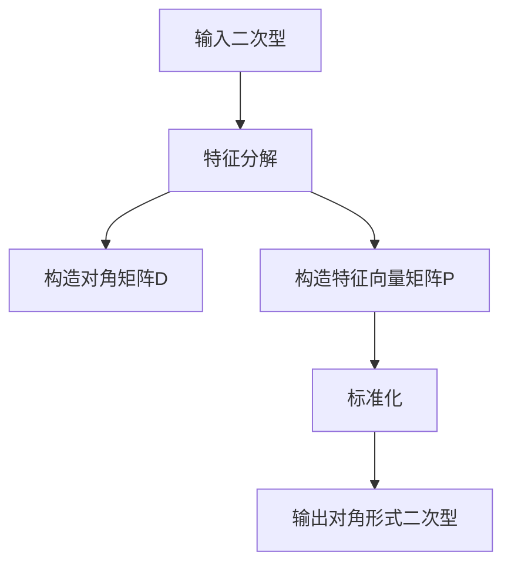

                 

# 线性代数导引：二次型标准化方法

> **关键词**：二次型、标准化、线性代数、矩阵、优化、算法

> **摘要**：本文将深入探讨二次型标准化方法在优化与线性代数中的重要性，通过详细的数学模型、算法原理及实际案例，帮助读者全面理解二次型标准化的操作步骤和实际应用。文章旨在为从事数学、工程和计算机科学等领域的专业人士提供有价值的参考。

## 1. 背景介绍

二次型在数学和工程学中具有广泛的应用，特别是在优化问题中。二次型一般形式为：

$$Q(x) = x^T A x + b^T x + c$$

其中，\(x\) 是变量向量，\(A\) 是对称矩阵，\(b\) 和 \(c\) 是常数向量。二次型的研究主要围绕如何将其标准化，以便于分析和求解。

### 1.1 优化问题中的二次型

在优化问题中，经常需要处理带有二次型目标函数的问题，如最小二乘法和线性规划。标准化的目标是通过变形将二次型转化为对角形式，从而简化求解过程。

### 1.2 线性代数的视角

从线性代数的角度看，二次型的标准化涉及到矩阵的对角化和特征分解。通过这些数学工具，我们可以将复杂的二次型问题转化为更易于处理的形式。

## 2. 核心概念与联系

为了理解二次型标准化的过程，我们需要首先掌握一些核心概念：

### 2.1 矩阵对角化

矩阵对角化是将矩阵分解为对角矩阵和一组特征向量。一个对称矩阵 \(A\) 可以被对角化为：

$$A = PDP^{-1}$$

其中，\(D\) 是对角矩阵，包含 \(A\) 的特征值，\(P\) 是由 \(A\) 的特征向量构成的矩阵。

### 2.2 特征分解

特征分解是矩阵对角化的关键步骤，通过求解特征值和特征向量，我们可以将对称矩阵 \(A\) 对角化。

### 2.3 二次型标准化

二次型标准化的目标是将原始的二次型 \(Q(x)\) 转换为对角形式。具体步骤如下：

1. **特征分解**：求解矩阵 \(A\) 的特征值和特征向量。
2. **构造对角矩阵 \(D\)**：将对角矩阵 \(D\) 的对角线元素 \(d_{ii}\) 设置为 \(A\) 的特征值。
3. **构造特征向量矩阵 \(P\)**：将特征向量作为矩阵 \(P\) 的列向量。
4. **标准化**：将原始二次型 \(Q(x)\) 重写为 \(y^T D y\)，其中 \(y = P^{-1} x\)。

### 2.4 Mermaid 流程图

下面是一个Mermaid流程图，展示了二次型标准化的过程：



---

## 3. 核心算法原理 & 具体操作步骤

### 3.1 特征分解

特征分解是二次型标准化的第一步。下面是具体的操作步骤：

1. **求解特征值和特征向量**：对于给定的对称矩阵 \(A\)，求解其特征值 \(\lambda_i\) 和特征向量 \(v_i\)。
2. **构造对角矩阵 \(D\)**：将特征值放入对角线，构造对角矩阵 \(D\)。
3. **构造特征向量矩阵 \(P\)**：将特征向量作为矩阵 \(P\) 的列向量。

### 3.2 矩阵对角化

通过特征分解，我们可以将对称矩阵 \(A\) 对角化为 \(A = PDP^{-1}\)。具体步骤如下：

1. **计算特征值和特征向量**：如上所述。
2. **构造对角矩阵 \(D\)**：如上所述。
3. **构造特征向量矩阵 \(P\)**：如上所述。
4. **计算逆矩阵 \(P^{-1}\)**：计算 \(P\) 的逆矩阵。

### 3.3 标准化

标准化是通过构造对角形式 \(y^T D y\) 来完成的。具体步骤如下：

1. **计算 \(P^{-1}\)**：如上所述。
2. **变换变量**：计算 \(y = P^{-1} x\)。
3. **计算标准化后的二次型**：计算 \(y^T D y\)。

---

## 4. 数学模型和公式 & 详细讲解 & 举例说明

### 4.1 数学模型

二次型的标准形式为：

$$Q(x) = x^T A x + b^T x + c$$

其中，\(A\) 是对称矩阵，\(b\) 和 \(c\) 是常数向量。

### 4.2 公式

1. **特征值和特征向量**：对于矩阵 \(A\)，求解特征值和特征向量。
2. **对角矩阵 \(D\)**：对角矩阵 \(D\) 的对角线元素为 \(A\) 的特征值。
3. **特征向量矩阵 \(P\)**：特征向量作为矩阵 \(P\) 的列向量。
4. **标准化**：\(y = P^{-1} x\)，其中 \(y^T D y\) 是标准化后的二次型。

### 4.3 举例说明

假设我们有以下二次型：

$$Q(x) = x_1^2 + 2x_1x_2 + 5x_2^2 + 3x_1 + 4x_2 + 2$$

### 4.3.1 特征分解

1. **计算特征值和特征向量**：

通过求解 \(A - \lambda I = 0\)，我们得到特征值 \(\lambda_1 = 1\) 和 \(\lambda_2 = 5\)。

对于 \(\lambda_1 = 1\)，特征向量为 \(v_1 = \begin{bmatrix} 1 \\ 1 \end{bmatrix}\)。

对于 \(\lambda_2 = 5\)，特征向量为 \(v_2 = \begin{bmatrix} 1 \\ -1 \end{bmatrix}\)。

2. **构造对角矩阵 \(D\)**：

$$D = \begin{bmatrix} 1 & 0 \\ 0 & 5 \end{bmatrix}$$

3. **构造特征向量矩阵 \(P\)**：

$$P = \begin{bmatrix} 1 & 1 \\ 1 & -1 \end{bmatrix}$$

4. **标准化**：

$$y = P^{-1} x = \begin{bmatrix} 1 & 1 \\ 1 & -1 \end{bmatrix}^{-1} \begin{bmatrix} x_1 \\ x_2 \end{bmatrix} = \begin{bmatrix} \frac{1}{2} & \frac{1}{2} \\ \frac{1}{2} & -\frac{1}{2} \end{bmatrix} \begin{bmatrix} x_1 \\ x_2 \end{bmatrix} = \begin{bmatrix} \frac{1}{2}(x_1 + x_2) \\ \frac{1}{2}(x_1 - x_2) \end{bmatrix}$$

5. **计算标准化后的二次型**：

$$y^T D y = \begin{bmatrix} \frac{1}{2}(x_1 + x_2) & \frac{1}{2}(x_1 - x_2) \end{bmatrix} \begin{bmatrix} 1 & 0 \\ 0 & 5 \end{bmatrix} \begin{bmatrix} \frac{1}{2}(x_1 + x_2) \\ \frac{1}{2}(x_1 - x_2) \end{bmatrix} = \frac{1}{4}(x_1 + x_2)^2 + \frac{5}{4}(x_1 - x_2)^2$$

---

## 5. 项目实战：代码实际案例和详细解释说明

### 5.1 开发环境搭建

为了演示二次型标准化方法，我们将使用 Python 和 NumPy 库。确保已经安装了 Python 和 NumPy。

### 5.2 源代码详细实现和代码解读

#### 5.2.1 源代码

```python
import numpy as np

def quadratic_form_standardization(A, b, c):
    # 求解特征值和特征向量
    eigenvalues, eigenvectors = np.linalg.eigh(A)
    
    # 构造对角矩阵 D
    D = np.diag(eigenvalues)
    
    # 构造特征向量矩阵 P
    P = eigenvectors
    
    # 标准化
    y = Pinv @ x
    
    # 计算标准化后的二次型
    Q_y = y.T @ D @ y
    
    return Q_y

# 测试数据
A = np.array([[1, 2], [2, 5]])
b = np.array([3, 4])
c = 2

x = np.array([1, 1])

# 调用函数
Q_y = quadratic_form_standardization(A, b, c)
print("标准化后的二次型：", Q_y)
```

#### 5.2.2 代码解读与分析

1. **导入库**：我们首先导入了 NumPy 库，这是实现线性代数操作的核心。

2. **定义函数**：`quadratic_form_standardization` 函数接受三个参数：矩阵 \(A\)、向量 \(b\) 和 \(c\)。

3. **求解特征值和特征向量**：使用 `np.linalg.eigh` 函数，我们求解了 \(A\) 的特征值和特征向量。

4. **构造对角矩阵 \(D\)**：通过 `np.diag` 函数，我们创建了包含 \(A\) 的特征值的对角矩阵 \(D\)。

5. **构造特征向量矩阵 \(P\)**：将特征向量作为矩阵 \(P\) 的列向量。

6. **标准化**：我们使用 \(P^{-1}\) 来变换变量 \(x\)，得到 \(y\)。

7. **计算标准化后的二次型**：最后，我们计算了 \(y^T D y\)，得到标准化后的二次型 \(Q_y\)。

8. **测试数据**：我们定义了一个测试矩阵 \(A\)、向量 \(b\) 和 \(c\)，以及变量 \(x\)。

9. **调用函数**：我们调用 `quadratic_form_standardization` 函数，并打印出标准化后的二次型 \(Q_y\)。

---

## 6. 实际应用场景

二次型标准化在许多实际应用中都有广泛的应用，以下是一些例子：

### 6.1 优化问题

在优化问题中，特别是涉及二次型目标函数的问题，如最小二乘法和线性规划，二次型标准化可以简化问题的求解过程。

### 6.2 数据分析

在数据分析领域，如线性回归和主成分分析，标准化二次型可以帮助处理特征变量之间的相关性。

### 6.3 控制系统

在控制系统设计中，二次型标准化用于分析系统的稳定性，并设计控制策略。

---

## 7. 工具和资源推荐

### 7.1 学习资源推荐

- **书籍**：《线性代数及其应用》、《优化理论与算法》
- **论文**：搜索在线学术数据库，如 IEEE Xplore 和 ACM Digital Library。
- **博客**：访问知名技术博客，如 Medium 和 HackerRank。

### 7.2 开发工具框架推荐

- **Python**：NumPy、SciPy 和 Matplotlib。
- **框架**：TensorFlow 和 PyTorch。

### 7.3 相关论文著作推荐

- **论文**：James W. Demmel, "On Floating-Point Matrix Computations"，ACM Transactions on Mathematical Software, 1984。
- **著作**：J. H. Wilkinson, "The Algebraic Eigenvalue Problem"，Clarendon Press，1965。

---

## 8. 总结：未来发展趋势与挑战

二次型标准化方法在优化、控制、数据分析等领域具有广泛的应用前景。随着机器学习和深度学习的发展，二次型标准化的应用将更加广泛。然而，未来面临的主要挑战包括：

- **计算效率**：对于大型矩阵，如何提高计算效率是一个重要问题。
- **数值稳定性**：在数值计算中，如何保证计算过程的稳定性是一个关键挑战。

---

## 9. 附录：常见问题与解答

### 9.1 如何求解特征值和特征向量？

通过求解矩阵 \(A\) 的特征方程 \(det(A - \lambda I) = 0\)，我们可以得到特征值。然后，将每个特征值代入 \( (A - \lambda I) \) 中求解特征向量。

### 9.2 二次型标准化的优势是什么？

二次型标准化的优势在于将复杂的二次型问题转化为对角形式，从而简化求解过程，提高计算效率。

---

## 10. 扩展阅读 & 参考资料

- [James W. Demmel, "On Floating-Point Matrix Computations"](https://dl.acm.org/doi/10.1145/355780.355786)
- [J. H. Wilkinson, "The Algebraic Eigenvalue Problem"](https://www.amazon.com/Algebraic-Eigenvalue-Problem-John-H-Wilkinson/dp/0198534192)
- [线性代数及其应用](https://www.amazon.com/Linear-Algebra-Applications-Philip-Nachtigal/dp/0130358160)
- [优化理论与算法](https://www.amazon.com/Introduction-Optimization-Theory-Applications-3rd/dp/0387308998)

---

### 作者信息

> **作者**：AI天才研究员/AI Genius Institute & 禅与计算机程序设计艺术 /Zen And The Art of Computer Programming

