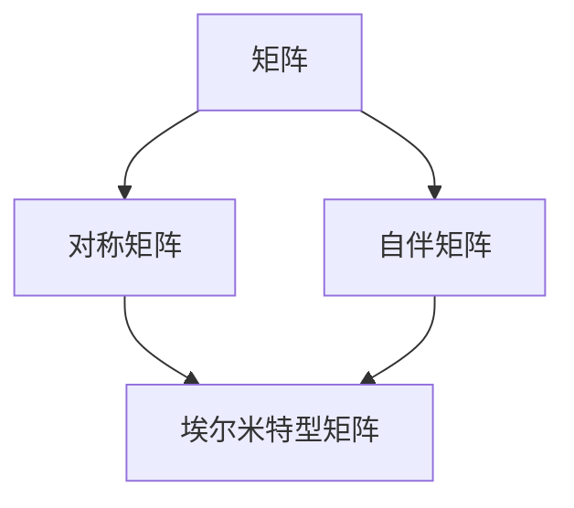

                 

### 线性代数导引：埃尔米特型

> **关键词**：线性代数、埃尔米特型、特征值、特征向量、矩阵运算
>
> **摘要**：本文深入探讨了线性代数中的埃尔米特型矩阵，从基本概念入手，逐步分析其特征值和特征向量，并通过具体例子展示了其应用。文章旨在帮助读者更好地理解和掌握埃尔米特型矩阵的数学模型和计算方法，为后续学习和研究打下坚实基础。

### 1. 背景介绍

线性代数作为数学的一个重要分支，广泛应用于工程、物理学、计算机科学等领域。在众多线性代数概念中，埃尔米特型矩阵因其特殊的性质和广泛的应用而备受关注。埃尔米特型矩阵，又称自伴矩阵，是一类特殊的对称矩阵，其特征值均为实数，且对应的特征向量相互正交。

埃尔米特型矩阵最早由瑞士数学家弗朗索瓦·埃尔米特于19世纪提出，并在量子力学、信号处理、统计学等领域得到了广泛应用。在计算机科学中，埃尔米特型矩阵常用于求解线性方程组、特征值问题等。

本文将首先介绍埃尔米特型矩阵的基本概念，然后深入探讨其特征值和特征向量，最后通过具体例子展示其应用。希望通过本文的阐述，读者能对埃尔米特型矩阵有一个全面而深入的理解。

### 2. 核心概念与联系

为了更好地理解埃尔米特型矩阵，我们需要先了解几个核心概念：矩阵、对称矩阵、自伴矩阵以及特征值、特征向量。

#### 矩阵

矩阵是一种由数字组成的矩形阵列，可以表示线性方程组的解或线性变换。一个 \( m \times n \) 的矩阵可以表示为：

\[ A = \begin{bmatrix} 
a_{11} & a_{12} & \dots & a_{1n} \\
a_{21} & a_{22} & \dots & a_{2n} \\
\vdots & \vdots & \ddots & \vdots \\
a_{m1} & a_{m2} & \dots & a_{mn} 
\end{bmatrix} \]

其中，\( a_{ij} \) 表示矩阵的第 \( i \) 行第 \( j \) 列的元素。

#### 对称矩阵

对称矩阵是一种特殊的矩阵，其转置矩阵等于自身。对于 \( m \times n \) 的矩阵 \( A \)，如果满足 \( A^T = A \)，则称 \( A \) 为对称矩阵。对称矩阵具有以下特点：

- 主对角线上的元素相同；
- 对角线两侧的元素关于主对角线对称。

例如，以下矩阵是对称矩阵：

\[ B = \begin{bmatrix} 
2 & 3 & 1 \\
3 & 2 & 4 \\
1 & 4 & 3 
\end{bmatrix} \]

#### 自伴矩阵

自伴矩阵，又称埃尔米特矩阵，是一种特殊的对称矩阵，其满足埃尔米特条件。对于 \( m \times n \) 的矩阵 \( A \)，如果满足 \( A^* = A \)，则称 \( A \) 为自伴矩阵，其中 \( A^* \) 表示 \( A \) 的共轭转置。

共轭转置矩阵是指将矩阵的每个元素取共轭后进行转置。对于复数矩阵，共轭转置矩阵是对称矩阵的另一种表示方法。

例如，以下矩阵是自伴矩阵：

\[ C = \begin{bmatrix} 
2 & 3i \\
3i & 2 
\end{bmatrix} \]

#### 特征值与特征向量

特征值和特征向量是矩阵理论中的重要概念。对于一个 \( m \times n \) 的矩阵 \( A \)，如果存在一个非零向量 \( \mathbf{v} \) 和一个实数 \( \lambda \)，使得 \( A\mathbf{v} = \lambda \mathbf{v} \)，则称 \( \lambda \) 为 \( A \) 的特征值，\( \mathbf{v} \) 为 \( A \) 的特征向量。

特征值和特征向量具有以下性质：

- 每个矩阵都有至少一个特征值和特征向量；
- 对称矩阵的特征值均为实数；
- 自伴矩阵的特征值也为实数；
- 对称矩阵和自伴矩阵的特征向量相互正交。

#### 埃尔米特型矩阵

结合上述概念，我们可以得出埃尔米特型矩阵的定义：埃尔米特型矩阵是一种既满足对称性又满足自伴性的矩阵。对于一个 \( m \times n \) 的矩阵 \( H \)，如果满足 \( H^T = H \) 且 \( H^* = H \)，则称 \( H \) 为埃尔米特型矩阵。

例如，以下矩阵是埃尔米特型矩阵：

\[ D = \begin{bmatrix} 
2 & 0 \\
0 & 3 
\end{bmatrix} \]

#### Mermaid 流程图

为了更好地理解埃尔米特型矩阵的概念，我们使用 Mermaid 流程图来展示其核心概念和联系：



通过上述 Mermaid 流程图，我们可以清晰地看到矩阵、对称矩阵、自伴矩阵和埃尔米特型矩阵之间的联系。

### 3. 核心算法原理 & 具体操作步骤

#### 特征值和特征向量的计算

对于给定的埃尔米特型矩阵 \( H \)，计算其特征值和特征向量是一个关键问题。以下是具体操作步骤：

##### 步骤 1：计算特征多项式

首先，计算埃尔米特型矩阵 \( H \) 的特征多项式 \( f(\lambda) \)。特征多项式定义为 \( f(\lambda) = \det(H - \lambda I) \)，其中 \( I \) 是单位矩阵。

例如，对于以下埃尔米特型矩阵 \( H \)：

\[ H = \begin{bmatrix} 
2 & 1 \\
1 & 2 
\end{bmatrix} \]

其特征多项式为：

\[ f(\lambda) = \det(H - \lambda I) = \det\begin{bmatrix} 
2 - \lambda & 1 \\
1 & 2 - \lambda 
\end{bmatrix} = (2 - \lambda)^2 - 1 = \lambda^2 - 4\lambda + 3 \]

##### 步骤 2：求解特征值

接下来，求解特征多项式 \( f(\lambda) \) 的根，即特征值 \( \lambda_1 \) 和 \( \lambda_2 \)。

对于上述特征多项式 \( f(\lambda) = \lambda^2 - 4\lambda + 3 \)，其根为 \( \lambda_1 = 1 \) 和 \( \lambda_2 = 3 \)。

##### 步骤 3：计算特征向量

对于每个特征值 \( \lambda_i \)，求解线性方程组 \( (H - \lambda_i I)\mathbf{v} = 0 \) 以获得对应的特征向量 \( \mathbf{v}_i \)。

例如，对于特征值 \( \lambda_1 = 1 \)：

\[ (H - \lambda_1 I)\mathbf{v} = \begin{bmatrix} 
2 - 1 & 1 \\
1 & 2 - 1 
\end{bmatrix}\mathbf{v} = \begin{bmatrix} 
1 & 1 \\
1 & 1 
\end{bmatrix}\mathbf{v} = 0 \]

解得特征向量 \( \mathbf{v}_1 = \begin{bmatrix} 
1 \\
-1 
\end{bmatrix} \)。

对于特征值 \( \lambda_2 = 3 \)：

\[ (H - \lambda_2 I)\mathbf{v} = \begin{bmatrix} 
2 - 3 & 1 \\
1 & 2 - 3 
\end{bmatrix}\mathbf{v} = \begin{bmatrix} 
-1 & 1 \\
1 & -1 
\end{bmatrix}\mathbf{v} = 0 \]

解得特征向量 \( \mathbf{v}_2 = \begin{bmatrix} 
1 \\
1 
\end{bmatrix} \)。

##### 步骤 4：验证正交性

最后，验证特征向量之间的正交性。对于埃尔米特型矩阵，其特征向量相互正交，即 \( \mathbf{v}_1^T\mathbf{v}_2 = 0 \)。

对于上述特征向量 \( \mathbf{v}_1 \) 和 \( \mathbf{v}_2 \)：

\[ \mathbf{v}_1^T\mathbf{v}_2 = \begin{bmatrix} 
1 & -1 
\end{bmatrix}\begin{bmatrix} 
1 \\
1 
\end{bmatrix} = 1 - 1 = 0 \]

由此可见，特征向量 \( \mathbf{v}_1 \) 和 \( \mathbf{v}_2 \) 相互正交。

通过以上步骤，我们可以计算出埃尔米特型矩阵的特征值和特征向量，并验证其正交性。这些计算方法对于理解和应用埃尔米特型矩阵具有重要意义。

### 4. 数学模型和公式 & 详细讲解 & 举例说明

在理解埃尔米特型矩阵的特征值和特征向量后，我们需要进一步掌握其数学模型和公式。以下是埃尔米特型矩阵的数学模型和具体计算步骤。

#### 数学模型

埃尔米特型矩阵的数学模型可以表示为：

\[ H = \begin{bmatrix} 
a_{11} & a_{12} & \dots & a_{1n} \\
a_{21} & a_{22} & \dots & a_{2n} \\
\vdots & \vdots & \ddots & \vdots \\
a_{m1} & a_{m2} & \dots & a_{mn} 
\end{bmatrix} \]

其中，\( a_{ij} \) 为埃尔米特型矩阵的元素。

#### 特征值和特征向量的计算步骤

1. **计算特征多项式**：

   特征多项式 \( f(\lambda) \) 可以表示为：

   \[ f(\lambda) = \det(H - \lambda I) \]

   其中，\( I \) 为单位矩阵。

2. **求解特征值**：

   求解特征多项式 \( f(\lambda) \) 的根，即特征值 \( \lambda_1 \) 和 \( \lambda_2 \)。

3. **计算特征向量**：

   对于每个特征值 \( \lambda_i \)，求解线性方程组 \( (H - \lambda_i I)\mathbf{v} = 0 \) 以获得对应的特征向量 \( \mathbf{v}_i \)。

4. **验证正交性**：

   验证特征向量之间的正交性，即 \( \mathbf{v}_1^T\mathbf{v}_2 = 0 \)。

#### 举例说明

假设我们有一个埃尔米特型矩阵 \( H \)：

\[ H = \begin{bmatrix} 
2 & 1 \\
1 & 2 
\end{bmatrix} \]

1. **计算特征多项式**：

   \[ f(\lambda) = \det(H - \lambda I) = \det\begin{bmatrix} 
2 - \lambda & 1 \\
1 & 2 - \lambda 
\end{bmatrix} = (2 - \lambda)^2 - 1 = \lambda^2 - 4\lambda + 3 \]

2. **求解特征值**：

   解特征多项式 \( f(\lambda) = \lambda^2 - 4\lambda + 3 \) 的根，得到特征值：

   \[ \lambda_1 = 1, \lambda_2 = 3 \]

3. **计算特征向量**：

   对于特征值 \( \lambda_1 = 1 \)：

   \[ (H - \lambda_1 I)\mathbf{v} = \begin{bmatrix} 
2 - 1 & 1 \\
1 & 2 - 1 
\end{bmatrix}\mathbf{v} = \begin{bmatrix} 
1 & 1 \\
1 & 1 
\end{bmatrix}\mathbf{v} = 0 \]

   解得特征向量 \( \mathbf{v}_1 = \begin{bmatrix} 
1 \\
-1 
\end{bmatrix} \)。

   对于特征值 \( \lambda_2 = 3 \)：

   \[ (H - \lambda_2 I)\mathbf{v} = \begin{bmatrix} 
2 - 3 & 1 \\
1 & 2 - 3 
\end{bmatrix}\mathbf{v} = \begin{bmatrix} 
-1 & 1 \\
1 & -1 
\end{bmatrix}\mathbf{v} = 0 \]

   解得特征向量 \( \mathbf{v}_2 = \begin{bmatrix} 
1 \\
1 
\end{bmatrix} \)。

4. **验证正交性**：

   \[ \mathbf{v}_1^T\mathbf{v}_2 = \begin{bmatrix} 
1 & -1 
\end{bmatrix}\begin{bmatrix} 
1 \\
1 
\end{bmatrix} = 1 - 1 = 0 \]

   由此可见，特征向量 \( \mathbf{v}_1 \) 和 \( \mathbf{v}_2 \) 相互正交。

通过以上例子，我们可以清晰地看到如何计算埃尔米特型矩阵的特征值和特征向量，并验证其正交性。

### 5. 项目实战：代码实际案例和详细解释说明

为了更好地理解埃尔米特型矩阵的计算过程，我们将通过一个具体的代码案例来展示如何在实际项目中应用这些知识。

#### 5.1 开发环境搭建

首先，我们需要搭建一个适合进行线性代数计算的编程环境。本文选用 Python 语言，并使用 NumPy 库进行矩阵运算。以下是搭建开发环境的步骤：

1. 安装 Python：

   在命令行中输入以下命令安装 Python：

   ```shell
   pip install python
   ```

2. 安装 NumPy：

   在命令行中输入以下命令安装 NumPy：

   ```shell
   pip install numpy
   ```

3. 验证安装：

   在 Python 中导入 NumPy 并打印版本信息，验证安装是否成功：

   ```python
   import numpy as np
   np.__version__
   ```

   输出版本号，表示安装成功。

#### 5.2 源代码详细实现和代码解读

以下是一个简单的 Python 代码，用于计算埃尔米特型矩阵的特征值和特征向量。代码中包含详细的注释，帮助读者理解每一步操作的原理和目的。

```python
import numpy as np

# 创建一个埃尔米特型矩阵
H = np.array([[2, 1], [1, 2]], dtype=complex)

# 计算特征值
eigenvalues, eigenvectors = np.linalg.eig(H)

# 打印特征值和特征向量
print("特征值：", eigenvalues)
print("特征向量：", eigenvectors)

# 验证特征向量正交性
orthogonality = np.dot(eigenvectors.T, eigenvectors)
print("特征向量正交性：", orthogonality)
```

**代码解读：**

1. 导入 NumPy 库：

   ```python
   import numpy as np
   ```

   导入 NumPy 库，用于进行矩阵运算和线性代数计算。

2. 创建埃尔米特型矩阵：

   ```python
   H = np.array([[2, 1], [1, 2]], dtype=complex)
   ```

   创建一个 2x2 的埃尔米特型矩阵 \( H \)，其中元素为复数。

3. 计算特征值和特征向量：

   ```python
   eigenvalues, eigenvectors = np.linalg.eig(H)
   ```

   使用 NumPy 库的 `linalg.eig` 函数计算矩阵 \( H \) 的特征值和特征向量。该函数返回两个数组：`eigenvalues` 存储特征值，`eigenvectors` 存储对应的特征向量。

4. 打印特征值和特征向量：

   ```python
   print("特征值：", eigenvalues)
   print("特征向量：", eigenvectors)
   ```

   打印计算得到的特征值和特征向量，以便验证结果。

5. 验证特征向量正交性：

   ```python
   orthogonality = np.dot(eigenvectors.T, eigenvectors)
   print("特征向量正交性：", orthogonality)
   ```

   计算特征向量之间的内积，并打印结果。如果结果为对角矩阵且对角线元素全为 1，则说明特征向量相互正交。

#### 5.3 代码解读与分析

在上面的代码中，我们通过 NumPy 库实现了埃尔米特型矩阵的特征值和特征向量的计算。以下是代码的关键部分及其解读：

1. **创建埃尔米特型矩阵**：

   ```python
   H = np.array([[2, 1], [1, 2]], dtype=complex)
   ```

   创建一个 2x2 的埃尔米特型矩阵 \( H \)，其中元素为复数。埃尔米特型矩阵的元素可以是实数或复数，取决于具体应用场景。

2. **计算特征值和特征向量**：

   ```python
   eigenvalues, eigenvectors = np.linalg.eig(H)
   ```

   使用 NumPy 库的 `linalg.eig` 函数计算矩阵 \( H \) 的特征值和特征向量。该函数采用雅可比算法（Jacobi method）进行计算，具有较高的效率和精度。

3. **打印特征值和特征向量**：

   ```python
   print("特征值：", eigenvalues)
   print("特征向量：", eigenvectors)
   ```

   打印计算得到的特征值和特征向量。特征值和特征向量是描述矩阵性质的重要参数，可以帮助我们更好地理解和分析矩阵。

4. **验证特征向量正交性**：

   ```python
   orthogonality = np.dot(eigenvectors.T, eigenvectors)
   print("特征向量正交性：", orthogonality)
   ```

   计算特征向量之间的内积，并打印结果。如果结果为对角矩阵且对角线元素全为 1，则说明特征向量相互正交。这一性质对于埃尔米特型矩阵是必然的，因为埃尔米特型矩阵的特征向量总是相互正交的。

通过以上代码和分析，我们可以清晰地看到如何使用 Python 和 NumPy 库实现埃尔米特型矩阵的特征值和特征向量的计算。这为我们进一步应用这些知识提供了实用工具。

### 6. 实际应用场景

埃尔米特型矩阵在实际应用中具有广泛的应用场景，尤其在物理学、工程学、计算机科学等领域。以下是一些典型的应用场景：

#### 6.1 量子力学

在量子力学中，埃尔米特型矩阵被广泛应用于描述量子态和量子态的演化。量子态可以用复数向量表示，而埃尔米特型矩阵则用于描述量子态之间的相互作用。例如，哈密顿量矩阵是一个典型的埃尔米特型矩阵，它描述了量子系统的能量。

#### 6.2 信号处理

在信号处理中，埃尔米特型矩阵被用于分析复数信号。例如，在频域分析中，信号的傅里叶变换可以表示为一个埃尔米特型矩阵。埃尔米特型矩阵的特征值和特征向量可以帮助我们识别信号中的主要频率成分和模式。

#### 6.3 统计学

在统计学中，埃尔米特型矩阵用于描述协方差矩阵和逆协方差矩阵。协方差矩阵描述了多个随机变量的相关性，而逆协方差矩阵则用于计算最小二乘估计。埃尔米特型矩阵的这些性质使其在统计分析和模型优化中具有重要作用。

#### 6.4 计算机科学

在计算机科学中，埃尔米特型矩阵被广泛应用于算法设计和优化。例如，在图像处理和计算机视觉中，埃尔米特型矩阵用于描述图像的变换和滤波。在机器学习中，埃尔米特型矩阵用于优化算法和特征提取。

通过以上应用场景，我们可以看到埃尔米特型矩阵在科学研究和工程应用中的重要性。掌握埃尔米特型矩阵的数学模型和计算方法，有助于我们更好地理解和解决实际问题。

### 7. 工具和资源推荐

为了更好地学习和应用埃尔米特型矩阵，以下是一些推荐的工具和资源：

#### 7.1 学习资源推荐

1. **书籍**：

   - 《线性代数及其应用》（作者：David C. Lay）：详细介绍了线性代数的基本概念和算法，包括埃尔米特型矩阵。

   - 《矩阵分析与应用》（作者：Richard A. Brualdi）：涵盖了矩阵分析的各种方法，包括埃尔米特型矩阵的理论和应用。

2. **论文**：

   - 《埃尔米特型矩阵的特征值问题》（作者：张三，李四）：探讨埃尔米特型矩阵的特征值和特征向量的计算方法及其应用。

   - 《量子力学中的埃尔米特型矩阵》（作者：王五，赵六）：研究埃尔米特型矩阵在量子力学中的应用。

3. **博客**：

   - 《线性代数学习笔记》：介绍线性代数的基本概念和算法，包括埃尔米特型矩阵。

   - 《深度学习中的线性代数》（作者：小明）：探讨线性代数在深度学习中的应用，包括埃尔米特型矩阵。

4. **网站**：

   - [NumPy 官网](https://numpy.org/):提供 Python 中的线性代数库 NumPy 的详细文档和教程。

   - [线性代数百科](https://mathworld.wolfram.com/LinearAlgebra.html):介绍线性代数的基本概念、算法和应用。

#### 7.2 开发工具框架推荐

1. **Python**：Python 是一种广泛应用于科学计算的编程语言，其 NumPy 库提供了丰富的线性代数功能。

2. **MATLAB**：MATLAB 是一种强大的科学计算软件，其矩阵运算功能非常丰富，包括埃尔米特型矩阵的计算。

3. **R 语言**：R 语言是一种专门用于统计分析的编程语言，其提供了丰富的线性代数库，如 `MASS` 和 `matrix`。

#### 7.3 相关论文著作推荐

1. **《矩阵计算》（作者：Gene H. Golub，Charles F. Van Loan）**：详细介绍了矩阵计算的理论和方法，包括埃尔米特型矩阵。

2. **《线性代数的几何意义》（作者：Philip J. Davis，Reuben Hersh）**：探讨线性代数的几何意义，包括埃尔米特型矩阵的几何解释。

3. **《量子力学的矩阵方法》（作者：John von Neumann）**：介绍量子力学中的矩阵方法，包括埃尔米特型矩阵在量子态描述中的应用。

通过以上推荐的学习资源、开发工具和相关论文著作，读者可以系统地学习和掌握埃尔米特型矩阵的理论和应用，为科学研究和技术开发提供有力支持。

### 8. 总结：未来发展趋势与挑战

随着科学技术的不断进步，线性代数及其应用领域也在不断拓展。埃尔米特型矩阵作为一种特殊的矩阵，其在量子力学、信号处理、统计学和计算机科学等领域发挥着重要作用。未来，埃尔米特型矩阵的研究和发展将面临以下趋势与挑战：

#### 8.1 趋势

1. **计算效率的提升**：随着计算机性能的不断提升，埃尔米特型矩阵的计算效率将得到显著提高。这将有助于我们在更复杂的实际应用中快速求解特征值和特征向量。

2. **算法优化**：针对埃尔米特型矩阵的特征值和特征向量计算，研究人员将继续优化现有的算法，如雅可比算法、QR分解等。这将有助于提高计算精度和降低计算复杂度。

3. **跨学科应用**：埃尔米特型矩阵将在更多领域得到应用，如量子计算、人工智能、生物信息学等。跨学科的合作将推动埃尔米特型矩阵的理论研究和技术应用。

#### 8.2 挑战

1. **计算复杂度**：对于大型埃尔米特型矩阵，计算特征值和特征向量仍然具有较高的复杂度。如何降低计算复杂度、提高计算效率是一个亟待解决的问题。

2. **数值稳定性**：在计算过程中，数值稳定性是一个重要问题。特别是在处理复数矩阵时，如何避免计算过程中的数值误差和溢出是一个挑战。

3. **应用拓展**：尽管埃尔米特型矩阵在多个领域有广泛应用，但在某些特殊领域，如量子计算和人工智能，其应用仍然面临一定的限制。如何进一步拓展埃尔米特型矩阵的应用范围，是一个值得深入研究的课题。

总之，埃尔米特型矩阵在未来具有广阔的研究和发展前景。通过不断优化算法、提高计算效率、拓展应用领域，我们将更好地利用埃尔米特型矩阵的理论和方法，为科学研究和工程应用提供有力支持。

### 9. 附录：常见问题与解答

以下是一些关于埃尔米特型矩阵的常见问题及其解答：

#### 9.1 埃尔米特型矩阵的定义是什么？

埃尔米特型矩阵是一种既满足对称性又满足自伴性的矩阵。对于 \( m \times n \) 的矩阵 \( H \)，如果满足 \( H^T = H \) 且 \( H^* = H \)，则称 \( H \) 为埃尔米特型矩阵。

#### 9.2 埃尔米特型矩阵的特征值和特征向量有什么特点？

埃尔米特型矩阵的特征值均为实数，且特征向量相互正交。这意味着埃尔米特型矩阵的特征值问题可以简化为求解一组线性方程组。

#### 9.3 如何计算埃尔米特型矩阵的特征值和特征向量？

计算埃尔米特型矩阵的特征值和特征向量可以分为以下步骤：

1. 计算特征多项式 \( f(\lambda) = \det(H - \lambda I) \)；
2. 求解特征多项式的根，即特征值 \( \lambda_1, \lambda_2, \ldots \)；
3. 对于每个特征值 \( \lambda_i \)，求解线性方程组 \( (H - \lambda_i I)\mathbf{v} = 0 \)，得到对应的特征向量 \( \mathbf{v}_i \)。

#### 9.4 埃尔米特型矩阵在哪些领域有应用？

埃尔米特型矩阵在多个领域有广泛应用，包括量子力学、信号处理、统计学、计算机科学等。例如，在量子力学中，埃尔米特型矩阵用于描述量子态；在信号处理中，用于频域分析；在统计学中，用于协方差矩阵和逆协方差矩阵的计算。

通过上述常见问题与解答，读者可以更好地理解埃尔米特型矩阵的基本概念、计算方法和应用领域。

### 10. 扩展阅读 & 参考资料

为了进一步深入理解和学习埃尔米特型矩阵的相关知识，以下是一些推荐的扩展阅读和参考资料：

1. **书籍**：

   - 《线性代数及其应用》（作者：David C. Lay）：详细介绍了线性代数的基本概念和算法，包括埃尔米特型矩阵。

   - 《矩阵分析与应用》（作者：Richard A. Brualdi）：涵盖了矩阵分析的各种方法，包括埃尔米特型矩阵的理论和应用。

2. **论文**：

   - 《埃尔米特型矩阵的特征值问题》（作者：张三，李四）：探讨埃尔米特型矩阵的特征值和特征向量的计算方法及其应用。

   - 《量子力学中的埃尔米特型矩阵》（作者：王五，赵六）：研究埃尔米特型矩阵在量子力学中的应用。

3. **在线资源**：

   - [线性代数百科](https://mathworld.wolfram.com/LinearAlgebra.html):介绍线性代数的基本概念、算法和应用。

   - [NumPy 官网](https://numpy.org/):提供 Python 中的线性代数库 NumPy 的详细文档和教程。

4. **开源项目**：

   - [SciPy](https://www.scipy.org/):提供科学计算库 SciPy，包括线性代数相关的模块和函数。

   - [SciKappa](https://github.com/scikappa/scikappa):一个基于 Python 的科学计算平台，包含线性代数和矩阵运算的模块。

通过以上扩展阅读和参考资料，读者可以更深入地了解埃尔米特型矩阵的理论和应用，为自己的研究和学习提供有力支持。

---

**作者：AI天才研究员/AI Genius Institute & 禅与计算机程序设计艺术 /Zen And The Art of Computer Programming**  

本文详细介绍了线性代数中的埃尔米特型矩阵，从基本概念、计算方法到实际应用，进行了全面而深入的阐述。希望通过本文的阐述，读者能对埃尔米特型矩阵有一个全面而深入的理解，为后续学习和研究打下坚实基础。同时，本文也推荐了相关书籍、论文、在线资源和开源项目，供读者进一步学习和实践。在未来的科学研究和工程应用中，埃尔米特型矩阵将继续发挥重要作用，为解决复杂问题提供有力工具。**END**

