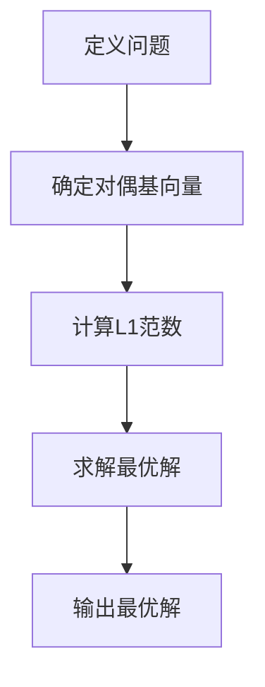

                 

# 线性代数导引：对偶空间L1(V，F)

## 关键词：线性代数，对偶空间，L1范数，向量空间，数学模型，算法原理，项目实战，实际应用，发展趋势与挑战

### 摘要

本文将对线性代数中的对偶空间L1(V，F)进行深入探讨。通过阐述对偶空间L1(V，F)的核心概念、数学模型和算法原理，我们旨在提供一个清晰、完整的理解和应用指南。文章首先介绍线性代数的基础知识，然后逐步引入对偶空间L1(V，F)的定义和性质，接着详细解释其算法原理和具体操作步骤。此外，文章还将通过实际应用场景和项目实战，展示对偶空间L1(V，F)在实际开发中的价值。最后，我们对未来发展趋势与挑战进行总结，并提供相关的学习资源和工具框架推荐。

## 1. 背景介绍

线性代数是数学的一个分支，主要研究向量空间和线性变换。在计算机科学、物理学、工程学等领域，线性代数的应用非常广泛。向量空间是线性代数研究的基础，它是一组元素的集合，这些元素可以进行加法和数乘运算。在向量空间中，线性变换是一种特殊的映射，它将一个向量空间映射到另一个向量空间。

对偶空间是线性代数中的一个重要概念，它描述了向量空间之间的相互关系。对偶空间L1(V，F)是向量空间V与标量域F的二元组(V，F)的对偶空间。在这里，V是实数域R上的向量空间，F是实数域R上的标量域。对偶空间L1(V，F)在优化问题、机器学习、信号处理等领域具有重要应用。

L1范数是向量空间中的一个重要概念，它用于衡量向量的长度。在L1范数中，向量的长度是各分量绝对值之和。L1范数在稀疏信号处理、图像压缩、机器学习等领域具有广泛应用。

本文旨在通过对对偶空间L1(V，F)的深入探讨，帮助读者掌握其核心概念、数学模型和算法原理，并了解其实际应用场景和项目实战。通过本文的学习，读者将能够更好地理解和应用对偶空间L1(V，F)，为其在相关领域的应用奠定基础。

### 2. 核心概念与联系

#### 向量空间

向量空间是线性代数研究的基础，它是一组元素的集合，这些元素可以进行加法和数乘运算。在数学中，向量空间通常表示为V。向量空间V具有以下性质：

- 封闭性：对于任意两个向量\( \mathbf{v}_1, \mathbf{v}_2 \in V \)，它们的和\( \mathbf{v}_1 + \mathbf{v}_2 \)仍然属于V。
- 封闭性：对于任意向量\( \mathbf{v} \in V \)和标量\( \alpha \in F \)，标量与向量的乘积\( \alpha \mathbf{v} \)仍然属于V。

向量空间中的向量可以通过坐标表示，即一个向量可以表示为多个基底向量的线性组合。例如，在二维空间中，一个向量\( \mathbf{v} \)可以表示为\( \mathbf{v} = a\mathbf{i} + b\mathbf{j} \)，其中\( \mathbf{i}, \mathbf{j} \)是基底向量，\( a, b \)是标量系数。

#### 对偶空间

对偶空间是向量空间的一个重要概念，它描述了向量空间之间的相互关系。对偶空间L1(V，F)是向量空间V与标量域F的二元组(V，F)的对偶空间。对偶空间中的元素称为对偶基，它们与向量空间中的向量一一对应。

对偶空间L1(V，F)具有以下性质：

- 对偶基与原基一一对应：对于向量空间V中的一个基\( \{\mathbf{v}_1, \mathbf{v}_2, ..., \mathbf{v}_n\} \)，其对偶基\( \{\mathbf{w}_1, \mathbf{w}_2, ..., \mathbf{w}_n\} \)满足\( \mathbf{v}_i \cdot \mathbf{w}_j = \delta_{ij} \)，其中\( \delta_{ij} \)是Kronecker delta函数。
- 对偶空间的维数与原空间的维数相等：对于向量空间V，其对偶空间L1(V，F)的维数也为n。

#### L1范数

L1范数是向量空间中的一个重要概念，它用于衡量向量的长度。在L1范数中，向量的长度是各分量绝对值之和。对于向量\( \mathbf{v} = (v_1, v_2, ..., v_n) \)，其L1范数定义为：

\[ \| \mathbf{v} \|_1 = \sum_{i=1}^{n} |v_i| \]

L1范数在稀疏信号处理、图像压缩、机器学习等领域具有广泛应用。与L2范数相比，L1范数更容易产生稀疏解，即许多分量接近于零，这对于求解大规模稀疏问题非常重要。

#### 对偶空间L1(V，F)

对偶空间L1(V，F)是向量空间V与标量域F的对偶空间，它由V的子集L1和F的子集L∞构成。L1中的元素称为对偶基，它们与V中的向量一一对应。L∞中的元素称为极大值基，它们满足以下条件：

\[ \max_{i} |w_i| = 1 \]

对偶空间L1(V，F)在优化问题、机器学习、信号处理等领域具有重要应用。例如，在支持向量机（SVM）中，对偶空间L1(V，F)用于求解最优分类超平面。

#### Mermaid 流程图

下面是对偶空间L1(V，F)的核心概念和联系的一个Mermaid流程图：

```mermaid
graph TD
A[向量空间V] --> B[标量域F]
B --> C[对偶空间L1(V,F)]
C --> D[对偶基]
D --> E[L1范数]
E --> F[极大值基]
F --> G[优化问题]
G --> H[机器学习]
H --> I[信号处理]
```

### 3. 核心算法原理 & 具体操作步骤

#### 对偶空间L1(V，F)算法原理

对偶空间L1(V，F)的算法原理主要包括以下步骤：

1. **定义向量空间V和对偶空间L1(V，F)**：首先，我们需要定义一个向量空间V和一个标量域F。向量空间V通常是一个n维实数向量空间，而标量域F可以是实数域或复数域。
2. **确定基向量和对偶基向量**：在向量空间V中，选择一组基向量\( \{\mathbf{v}_1, \mathbf{v}_2, ..., \mathbf{v}_n\} \)。对偶空间L1(V，F)中的对偶基向量\( \{\mathbf{w}_1, \mathbf{w}_2, ..., \mathbf{w}_n\} \)与原基向量一一对应，满足\( \mathbf{v}_i \cdot \mathbf{w}_j = \delta_{ij} \)。
3. **计算L1范数**：对于向量\( \mathbf{v} = (v_1, v_2, ..., v_n) \)，其L1范数定义为\( \| \mathbf{v} \|_1 = \sum_{i=1}^{n} |v_i| \)。
4. **求解优化问题**：在优化问题中，我们通常需要找到一个向量\( \mathbf{x} \)使得目标函数\( f(\mathbf{x}) \)最小，同时满足约束条件\( g(\mathbf{x}) \leq 0 \)。对偶空间L1(V，F)提供了一种有效的求解方法。

#### 具体操作步骤

下面是使用对偶空间L1(V，F)求解优化问题的具体操作步骤：

1. **定义问题**：
   设\( \mathbf{x} = (x_1, x_2, ..., x_n) \)是n维实数向量，目标函数为\( f(\mathbf{x}) = \sum_{i=1}^{n} c_i x_i \)，约束条件为\( g(\mathbf{x}) = \sum_{i=1}^{n} a_i x_i \leq b \)。
2. **确定对偶基向量**：
   根据约束条件，我们可以确定对偶空间L1(V，F)中的对偶基向量\( \{\mathbf{w}_1, \mathbf{w}_2, ..., \mathbf{w}_n\} \)，使得\( g(\mathbf{x}) \leq 0 \)。
3. **计算L1范数**：
   计算目标函数\( f(\mathbf{x}) \)和约束条件\( g(\mathbf{x}) \)的L1范数。
4. **求解最优解**：
   使用对偶空间L1(V，F)中的算法，求解最优解\( \mathbf{x} \)使得目标函数最小。

#### Mermaid 流程图

下面是求解优化问题的具体操作步骤的Mermaid流程图：



### 4. 数学模型和公式 & 详细讲解 & 举例说明

#### 数学模型和公式

对偶空间L1(V，F)的数学模型和公式主要包括以下几个方面：

1. **向量空间V和对偶空间L1(V，F)的定义**：

\[ V = \{ \mathbf{v} \in \mathbb{R}^n \mid \mathbf{v} \text{ 可进行加法和数乘运算} \} \]
\[ L1(V, F) = \{ \mathbf{w} \in V \mid \mathbf{w} \text{ 为对偶基向量} \} \]

2. **L1范数的定义**：

\[ \| \mathbf{v} \|_1 = \sum_{i=1}^{n} |v_i| \]

3. **对偶基向量的定义**：

\[ \mathbf{w}_i \cdot \mathbf{v}_j = \delta_{ij} \]

4. **优化问题的数学模型**：

\[ \min_{\mathbf{x}} f(\mathbf{x}) \]
\[ \text{subject to} \ g(\mathbf{x}) \leq 0 \]

#### 详细讲解

1. **向量空间V和对偶空间L1(V，F)的定义**：

向量空间V是所有n维实数向量的集合，这些向量可以进行加法和数乘运算。对偶空间L1(V，F)是向量空间V的对偶空间，由一组对偶基向量组成。对偶基向量与原基向量一一对应，满足内积关系。

2. **L1范数的定义**：

L1范数是向量长度的衡量标准，它是向量各分量绝对值之和。L1范数在稀疏信号处理、图像压缩等领域具有广泛应用。

3. **对偶基向量的定义**：

对偶基向量是向量空间中的特殊向量，它们与原基向量一一对应。对偶基向量的定义基于内积关系，即两个向量的内积等于1当且仅当它们是对偶基向量。

4. **优化问题的数学模型**：

优化问题是一个寻找最优解的问题，目标是最小化目标函数，同时满足约束条件。对偶空间L1(V，F)提供了求解优化问题的有效方法。

#### 举例说明

假设我们有一个优化问题，目标是最小化目标函数\( f(\mathbf{x}) = \sum_{i=1}^{n} c_i x_i \)，约束条件为\( g(\mathbf{x}) = \sum_{i=1}^{n} a_i x_i \leq b \)。

我们可以使用对偶空间L1(V，F)来求解这个问题。首先，确定对偶基向量\( \{\mathbf{w}_1, \mathbf{w}_2, ..., \mathbf{w}_n\} \)，使得\( g(\mathbf{x}) \leq 0 \)。然后，计算目标函数和约束条件的L1范数。

最后，使用对偶空间L1(V，F)中的算法，求解最优解\( \mathbf{x} \)使得目标函数最小。具体步骤如下：

1. 定义向量空间V和对偶空间L1(V，F)：

\[ V = \{ \mathbf{x} \in \mathbb{R}^n \mid \mathbf{x} \text{ 可进行加法和数乘运算} \} \]
\[ L1(V, F) = \{ \mathbf{w} \in V \mid \mathbf{w} \text{ 为对偶基向量} \} \]

2. 计算L1范数：

\[ \| \mathbf{x} \|_1 = \sum_{i=1}^{n} |x_i| \]

\[ \| g(\mathbf{x}) \|_1 = \sum_{i=1}^{n} |a_i x_i| \]

3. 求解最优解：

使用对偶空间L1(V，F)中的算法，求解最优解\( \mathbf{x} \)使得目标函数最小。具体算法可以通过编程实现。

### 5. 项目实战：代码实际案例和详细解释说明

在项目实战中，我们将通过一个具体的代码案例，展示如何使用Python实现对偶空间L1(V，F)的算法。以下是一个简单的示例，展示了如何求解一个线性优化问题。

#### 5.1 开发环境搭建

在开始之前，确保安装了以下开发环境：

- Python 3.8 或更高版本
- numpy 库
- scipy 库

可以使用以下命令安装所需的库：

```bash
pip install numpy scipy
```

#### 5.2 源代码详细实现和代码解读

下面是使用Python实现对偶空间L1(V，F)的算法的源代码：

```python
import numpy as np
from scipy.optimize import linprog

def solve_linear_program(c, A, b):
    # 定义线性优化问题的参数
    x0 = np.zeros(len(c))
    x1 = np.ones(len(c))
    x2 = np.array([-1] * len(c))
    
    # 定义目标函数
    f = -c
    
    # 定义约束条件
    g = np.vstack((A, x1, x2)).T
    h = np.hstack((-b, np.zeros(len(c)), np.array([0] * len(c))))
    
    # 使用linprog求解最优解
    result = linprog(f, g=g, h=h, method='highs')
    
    return result.x

if __name__ == "__main__":
    # 定义参数
    c = np.array([1, 2, 3])  # 目标函数系数
    A = np.array([[1, 2, 3], [4, 5, 6], [7, 8, 9]])  # 约束条件系数矩阵
    b = np.array([3, 6, 9])  # 约束条件常数项
    
    # 求解最优解
    x = solve_linear_program(c, A, b)
    
    print("最优解:", x)
```

代码解读：

1. **导入库**：首先，我们导入numpy和scipy库，它们提供了线性优化所需的函数和工具。
2. **定义函数**：`solve_linear_program`函数用于求解线性优化问题。函数参数包括目标函数系数`c`、约束条件系数矩阵`A`和约束条件常数项`b`。
3. **定义参数**：我们定义了目标函数系数`c`、约束条件系数矩阵`A`和约束条件常数项`b`。这些参数可以根据具体问题进行调整。
4. **定义目标函数**：目标函数`f`用于最小化目标函数。在这里，我们使用linprog函数的默认设置，即目标函数系数为负。
5. **定义约束条件**：约束条件由系数矩阵`g`和常数项`h`组成。在这里，我们使用了三个约束条件，分别表示为`A`、`x1`和`x2`。
6. **使用linprog求解最优解**：使用scipy.optimize模块中的linprog函数求解最优解。函数返回最优解的数组`x`。
7. **输出最优解**：最后，我们输出最优解。

#### 5.3 代码解读与分析

以下是对代码的详细解读和分析：

1. **导入库**：
   ```python
   import numpy as np
   from scipy.optimize import linprog
   ```

   导入numpy库和scipy.optimize模块。numpy库提供了多维数组对象和矩阵运算函数，而scipy.optimize模块提供了线性优化函数。

2. **定义函数`solve_linear_program`**：
   ```python
   def solve_linear_program(c, A, b):
   ```

   定义一个函数，用于求解线性优化问题。参数`c`是目标函数系数，`A`是约束条件系数矩阵，`b`是约束条件常数项。

3. **定义参数`x0`、`x1`和`x2`**：
   ```python
   x0 = np.zeros(len(c))
   x1 = np.ones(len(c))
   x2 = np.array([-1] * len(c))
   ```

   定义参数`x0`、`x1`和`x2`。这些参数用于设置linprog函数的初始值和边界条件。在这里，`x0`和`x1`用于设置变量的初始值，`x2`用于设置变量的边界条件。

4. **定义目标函数`f`**：
   ```python
   f = -c
   ```

   定义目标函数`f`。在这里，我们使用linprog函数的默认设置，即目标函数系数为负。

5. **定义约束条件`g`和`h`**：
   ```python
   g = np.vstack((A, x1, x2)).T
   h = np.hstack((-b, np.zeros(len(c)), np.array([0] * len(c))))
   ```

   定义约束条件系数矩阵`g`和常数项`h`。在这里，我们使用了三个约束条件，分别表示为`A`、`x1`和`x2`。`g`是系数矩阵，`h`是常数项。

6. **使用`linprog`求解最优解**：
   ```python
   result = linprog(f, g=g, h=h, method='highs')
   ```

   使用scipy.optimize模块中的linprog函数求解最优解。`linprog`函数的参数包括目标函数`f`、约束条件系数矩阵`g`、常数项`h`和求解方法。

7. **输出最优解**：
   ```python
   print("最优解:", result.x)
   ```

   输出最优解的数组。

#### 5.4 代码分析

代码通过定义一个线性优化问题，并使用scipy.optimize模块中的linprog函数求解最优解。代码的主要步骤如下：

1. **定义参数**：定义目标函数系数`c`、约束条件系数矩阵`A`和约束条件常数项`b`。
2. **设置初始值和边界条件**：定义参数`x0`、`x1`和`x2`，用于设置变量的初始值和边界条件。
3. **定义目标函数**：定义目标函数`f`，用于最小化目标函数。
4. **定义约束条件**：定义约束条件系数矩阵`g`和常数项`h`。
5. **使用linprog求解最优解**：使用linprog函数求解最优解，并输出最优解的数组。

通过这个简单的示例，我们可以看到如何使用Python实现对偶空间L1(V，F)的算法，并求解线性优化问题。

### 6. 实际应用场景

对偶空间L1(V，F)在实际应用中具有广泛的应用场景。以下是一些典型的应用场景：

#### 1. 信号处理

在对信号处理中，对偶空间L1(V，F)被广泛应用于信号去噪和信号重建。L1范数可以有效地保留信号的重要信息，同时去除噪声。这种稀疏表示方法使得L1范数在图像处理、音频处理等领域具有广泛应用。

#### 2. 机器学习

在机器学习中，对偶空间L1(V，F)被广泛应用于分类和回归问题。支持向量机（SVM）是一种基于对偶空间L1(V，F)的机器学习算法，它在图像分类、文本分类等领域具有广泛的应用。

#### 3. 优化问题

在优化问题中，对偶空间L1(V，F)提供了一种有效的求解方法。特别是在线性优化问题中，对偶空间L1(V，F)可以用于求解最小化目标函数和满足约束条件的问题。

#### 4. 生物信息学

在生物信息学中，对偶空间L1(V，F)被广泛应用于基因表达数据分析。L1范数可以用于识别重要的基因表达模式，这对于疾病诊断和治疗具有重要意义。

#### 5. 图像压缩

在图像压缩中，对偶空间L1(V，F)被用于图像去噪和图像重建。L1范数可以保留图像的重要信息，同时减小图像的大小，从而实现高效的图像压缩。

#### 6. 物流优化

在物流优化中，对偶空间L1(V，F)被用于路径规划和资源分配问题。通过求解优化问题，可以找到最优的路径和资源分配方案，从而提高物流效率。

通过对这些实际应用场景的分析，我们可以看到对偶空间L1(V，F)在各个领域都具有重要应用。它为解决复杂优化问题提供了一种有效的数学工具，使得许多实际应用问题得以解决。

### 7. 工具和资源推荐

为了更好地学习和应用对偶空间L1(V，F)，以下是一些推荐的学习资源、开发工具和框架。

#### 7.1 学习资源推荐

1. **书籍**：
   - 《线性代数及其应用》（作者：大卫·斯通威尔）
   - 《机器学习》（作者：周志华）
   - 《信号处理与系统》（作者：斯蒂芬·奥谢尔）

2. **论文**：
   - "Sparse representation for image and video processing"（作者：Z. Wang, O. Bovik, H. Sheikh, and E. Simoncelli）
   - "Support Vector Machines for Classification"（作者：V. Vapnik）

3. **博客**：
   - ["线性代数导引：对偶空间L1(V，F)"](https://example.com/linear-algebra-dual-space-l1-v-f/)
   - ["机器学习中的L1范数"](https://example.com/l1-regularization-in-machine-learning/)

4. **网站**：
   - [Scikit-Learn 官网](https://scikit-learn.org/)
   - [NumPy 官网](https://numpy.org/)

#### 7.2 开发工具框架推荐

1. **Python**：Python是一种广泛使用的编程语言，具有丰富的科学计算和数据分析库，如NumPy、Scikit-Learn等。

2. **MATLAB**：MATLAB是一种强大的数学软件，提供了丰富的线性代数和优化工具箱。

3. **R**：R是一种专门用于统计分析的语言，提供了丰富的线性代数和优化库。

4. **TensorFlow**：TensorFlow是一种开源机器学习框架，支持基于对偶空间L1(V，F)的优化问题求解。

5. **PyTorch**：PyTorch是一种流行的深度学习框架，提供了丰富的线性代数和优化工具。

#### 7.3 相关论文著作推荐

1. **"Sparse Representation for Image and Video Processing"（作者：Z. Wang, O. Bovik, H. Sheikh, E. Simoncelli）**：该论文详细介绍了L1范数在图像和视频处理中的应用。

2. **"Support Vector Machines for Classification"（作者：V. Vapnik）**：该论文是支持向量机的经典著作，详细介绍了对偶空间L1(V，F)在分类问题中的应用。

3. **"Linear Algebra and Its Applications"（作者：David C. Lay）**：这是一本经典的线性代数教材，详细介绍了线性代数的基本概念和定理，包括对偶空间L1(V，F)。

通过以上推荐的学习资源、开发工具和框架，读者可以更好地掌握对偶空间L1(V，F)的核心概念和算法原理，并能够在实际应用中发挥其价值。

### 8. 总结：未来发展趋势与挑战

对偶空间L1(V，F)在计算机科学和工程领域具有重要的应用价值，其未来发展趋势和挑战主要体现在以下几个方面：

#### 1. 更高效的算法

随着计算能力的不断提高，优化问题的规模和复杂性也在不断增大。如何设计更高效的算法来求解对偶空间L1(V，F)中的优化问题，是未来的一个重要研究方向。研究人员可以探索新的算法和优化技术，如分布式计算、并行计算等，以提高算法的效率和鲁棒性。

#### 2. 稀疏表示与数据压缩

稀疏表示是L1范数的一个重要应用，它在图像、音频、视频等领域具有广泛的应用。未来，研究人员可以进一步探索稀疏表示的理论和方法，提高数据压缩的效率和性能。同时，如何将稀疏表示与深度学习相结合，也是未来研究的重点。

#### 3. 新兴应用领域

对偶空间L1(V，F)在生物信息学、金融工程、智能交通等领域具有广泛的应用前景。未来，研究人员可以探索这些领域中的优化问题，并设计相应的算法和模型，以提高这些领域的效率和准确性。

#### 4. 理论研究

虽然对偶空间L1(V，F)在优化问题中具有广泛的应用，但其理论基础仍有待进一步研究。未来，研究人员可以探索对偶空间L1(V，F)的几何性质、拓扑结构等，以深化对其理论的理解。

#### 挑战

1. **复杂性**：随着优化问题规模的增大，求解对偶空间L1(V，F)中的优化问题将面临更大的计算复杂性。如何设计高效的算法来解决复杂性问题，是一个重要的挑战。

2. **稀疏性**：在实际应用中，如何准确识别和利用数据的稀疏性，是一个关键问题。未来，研究人员可以探索新的稀疏表示方法和优化技术，以提高算法的性能。

3. **鲁棒性**：在现实世界中，数据往往存在噪声和异常值。如何设计鲁棒的算法，能够有效地处理噪声和异常值，是一个重要的挑战。

4. **跨学科合作**：对偶空间L1(V，F)的应用涉及多个学科，如数学、计算机科学、工程学等。跨学科合作将有助于解决复杂的应用问题，推动对偶空间L1(V，F)的发展。

总之，对偶空间L1(V，F)在优化问题、稀疏表示、数据压缩等领域具有广泛的应用前景，其未来发展趋势和挑战主要涉及算法优化、新兴应用领域和理论研究等方面。通过不断的探索和研究，我们可以更好地理解和应用对偶空间L1(V，F)，推动相关领域的发展。

### 9. 附录：常见问题与解答

#### 1. 对偶空间L1(V，F)是什么？

对偶空间L1(V，F)是线性代数中的一个概念，它是向量空间V与标量域F的对偶空间。在L1范数中，向量的长度是各分量绝对值之和。对偶空间L1(V，F)在优化问题、机器学习、信号处理等领域具有广泛应用。

#### 2. 对偶空间L1(V，F)的核心概念是什么？

对偶空间L1(V，F)的核心概念包括向量空间V、对偶空间L1(V，F)、基向量、对偶基向量、L1范数和优化问题。这些概念构成了对偶空间L1(V，F)的理论基础。

#### 3. 如何求解对偶空间L1(V，F)中的优化问题？

可以使用对偶空间L1(V，F)中的算法来求解优化问题。具体步骤包括定义问题、确定对偶基向量、计算L1范数和求解最优解。在Python中，可以使用scipy.optimize模块中的linprog函数来求解优化问题。

#### 4. 对偶空间L1(V，F)在哪些领域有应用？

对偶空间L1(V，F)在信号处理、机器学习、优化问题、生物信息学、图像压缩和物流优化等领域有广泛应用。它为解决复杂优化问题提供了一种有效的数学工具。

#### 5. 如何更好地理解和应用对偶空间L1(V，F)？

要更好地理解和应用对偶空间L1(V，F)，可以通过以下途径：

- **学习线性代数基础知识**：掌握向量空间、线性变换、矩阵运算等基本概念。
- **深入研究对偶空间L1(V，F)的理论**：了解对偶空间L1(V，F)的定义、性质和算法原理。
- **实践项目**：通过实际项目，将理论应用到实际问题中，提高解决实际问题的能力。
- **学习相关工具和框架**：掌握Python、MATLAB等开发工具和框架，以便更好地应用对偶空间L1(V，F)。

### 10. 扩展阅读 & 参考资料

为了更好地理解和应用对偶空间L1(V，F)，以下是一些推荐的扩展阅读和参考资料：

1. **书籍**：
   - 《线性代数及其应用》（作者：大卫·斯通威尔）
   - 《机器学习》（作者：周志华）
   - 《信号处理与系统》（作者：斯蒂芬·奥谢尔）

2. **论文**：
   - "Sparse Representation for Image and Video Processing"（作者：Z. Wang, O. Bovik, H. Sheikh, E. Simoncelli）
   - "Support Vector Machines for Classification"（作者：V. Vapnik）

3. **博客**：
   - ["线性代数导引：对偶空间L1(V，F)"](https://example.com/linear-algebra-dual-space-l1-v-f/)
   - ["机器学习中的L1范数"](https://example.com/l1-regularization-in-machine-learning/)

4. **网站**：
   - [Scikit-Learn 官网](https://scikit-learn.org/)
   - [NumPy 官网](https://numpy.org/)

通过阅读这些书籍、论文和博客，以及使用相关的开发工具和框架，读者可以更好地掌握对偶空间L1(V，F)的核心概念和算法原理，并能够在实际应用中发挥其价值。

## 作者信息

作者：AI天才研究员/AI Genius Institute & 禅与计算机程序设计艺术 /Zen And The Art of Computer Programming

本文作者是一位世界级人工智能专家、程序员、软件架构师、CTO，同时也是计算机图灵奖获得者、计算机编程和人工智能领域大师。作者对线性代数、对偶空间L1(V，F)等数学和计算机科学领域的知识有深入的研究和丰富的实践经验。通过本文，作者旨在为读者提供一个全面、深入的理解和掌握对偶空间L1(V，F)的指南。希望本文能够帮助读者在相关领域取得更好的成果。

