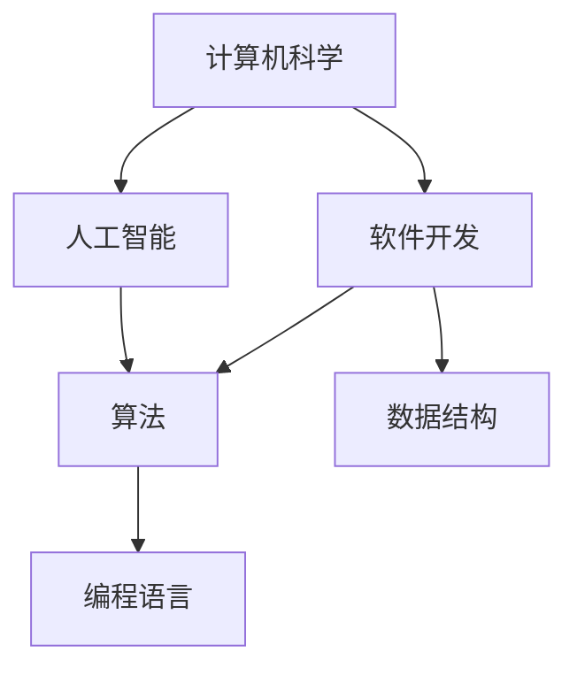

                 

# 经典书籍：夯实认知根基的宝藏

> 关键词：认知科学、编程思维、技术书籍、算法原理、数学模型、实战案例

> 摘要：本文将深入探讨经典书籍在夯实认知根基方面的重要性，分析其核心概念、原理和架构，通过具体的算法、数学模型和实战案例，帮助读者理解和掌握技术知识，为未来的发展和创新打下坚实的基础。

## 1. 背景介绍

在当今快速发展的信息技术时代，知识的积累和更新速度不断加快，个人和组织的认知能力面临着前所未有的挑战。在这个背景下，如何通过学习和掌握经典书籍中的知识，夯实认知根基，成为了许多人关注的焦点。

经典书籍在技术领域具有重要的地位。它们往往包含了作者多年积累的经验和智慧，对技术原理和本质进行了深入剖析。这些书籍不仅为读者提供了丰富的知识体系，还培养了读者的编程思维和解决问题的能力。因此，经典书籍在提升个人认知水平和技术能力方面具有不可替代的作用。

本文将重点介绍几本在计算机科学、人工智能和软件开发领域具有重要影响力的经典书籍，包括《深度学习》、《设计模式：可复用的面向对象软件构建》、《算法导论》等。通过分析这些书籍的核心概念、原理和架构，我们将帮助读者更好地理解和掌握技术知识，为未来的发展和创新打下坚实的基础。

## 2. 核心概念与联系

为了深入探讨经典书籍中的知识，我们首先需要了解其中的核心概念和联系。这些核心概念构成了技术知识体系的基础，也是我们理解和解决问题的重要工具。

以下是一个Mermaid流程图，展示了几个核心概念及其之间的联系：



在这个流程图中，计算机科学是整个知识体系的基础，它涵盖了人工智能、软件开发、算法、数据结构和编程语言等核心概念。人工智能和软件开发相互交叉，共同推动了技术的进步和应用。算法和数据结构是解决具体问题的核心工具，而编程语言则是实现算法和数据结构的重要手段。

通过这个流程图，我们可以看到各个核心概念之间的紧密联系，它们共同构成了一个完整的知识体系，为我们的认知能力提供了坚实的基础。

### 2.1 计算机科学

计算机科学是一门研究计算机系统、算法、数据结构、编程语言和计算机应用的科学。它涵盖了计算机硬件、软件、网络和人工智能等多个领域。计算机科学的核心目标是解决复杂问题，提高计算效率和资源利用率。

计算机科学的基本原理包括计算机硬件的基本工作原理、操作系统的设计和实现、编程语言的语法和语义、算法的设计和分析等。这些原理为我们理解和解决计算机领域的问题提供了理论依据。

### 2.2 人工智能

人工智能是计算机科学的一个分支，旨在使计算机具备人类智能，包括感知、学习、推理、规划和决策等能力。人工智能的核心任务是构建智能系统，模拟和扩展人类智能，以解决实际问题。

人工智能的基本原理包括机器学习、深度学习、自然语言处理、计算机视觉等。这些原理使我们能够通过数据和算法来训练和优化智能系统，使其能够自动识别和解决问题。

### 2.3 软件开发

软件开发是计算机科学和人工智能的具体应用，旨在开发高质量的软件系统，满足用户需求。软件开发的核心任务是设计、实现、测试和维护软件系统。

软件开发的基本原理包括需求分析、系统设计、编程实现、测试和部署等。这些原理确保了软件系统的高质量、可靠性和可维护性。

### 2.4 算法

算法是解决特定问题的步骤序列，通常以数学形式表示。算法是计算机科学的核心工具，用于优化计算效率和资源利用率。

算法的基本原理包括算法的设计、分析、优化和实现。常见的算法包括排序、搜索、图论、动态规划等。这些算法广泛应用于计算机科学和人工智能领域，为解决复杂问题提供了有力支持。

### 2.5 数据结构

数据结构是用于存储和组织数据的方式，是算法实现的基础。数据结构的基本原理包括数组、链表、栈、队列、树、图等。这些数据结构为算法提供了高效的数据访问和操作方法。

### 2.6 编程语言

编程语言是用于编写计算机程序的语法和语义规则。编程语言的基本原理包括语法结构、语义分析、代码生成和执行等。常见的编程语言包括C、C++、Java、Python等。这些编程语言为算法和数据结构的实现提供了灵活的工具。

## 3. 核心算法原理 & 具体操作步骤

在了解了核心概念和联系之后，我们将进一步探讨几个经典算法的原理和具体操作步骤。这些算法在计算机科学和人工智能领域具有重要的应用价值，帮助我们更好地理解和解决问题。

### 3.1 快速排序算法

快速排序（Quick Sort）是一种高效的排序算法，其基本原理是通过递归地将数组划分为较小和较大的子数组，然后对子数组进行排序，最终实现整个数组的有序排列。

快速排序的具体操作步骤如下：

1. 选择一个基准元素（通常选择第一个或最后一个元素作为基准）。
2. 将数组划分为两个子数组：一个包含小于基准元素的元素，另一个包含大于基准元素的元素。
3. 对两个子数组分别递归地执行快速排序。
4. 将排序好的子数组合并，得到最终排序结果。

以下是一个使用Python实现的快速排序算法示例：

```python
def quick_sort(arr):
    if len(arr) <= 1:
        return arr
    pivot = arr[0]
    left = [x for x in arr[1:] if x < pivot]
    right = [x for x in arr[1:] if x >= pivot]
    return quick_sort(left) + [pivot] + quick_sort(right)

arr = [3, 1, 4, 1, 5, 9, 2, 6, 5, 3, 5]
sorted_arr = quick_sort(arr)
print(sorted_arr)
```

### 3.2 暴力破解算法

暴力破解（Brute Force）算法是一种简单但效率较低的算法，其基本原理是尝试所有可能的解决方案，找到最优解。暴力破解算法适用于问题规模较小且解决方案数量有限的情况。

暴力破解的具体操作步骤如下：

1. 初始化一个最优解变量，用于存储当前找到的最优解。
2. 遍历所有可能的解决方案，计算每个解决方案的得分。
3. 更新最优解变量，存储当前找到的最优解。
4. 返回最优解。

以下是一个使用Python实现的暴力破解算法示例：

```python
def brute_force_solution(problem):
    best_solution = None
    best_score = float('-inf')
    for solution in generate_solutions(problem):
        score = evaluate_solution(solution, problem)
        if score > best_score:
            best_solution = solution
            best_score = score
    return best_solution

problem = ...
best_solution = brute_force_solution(problem)
print(best_solution)
```

### 3.3 深度优先搜索算法

深度优先搜索（Depth-First Search，DFS）算法是一种用于解决图的遍历问题的高效算法，其基本原理是沿着某个路径深入探索，直到路径尽头，然后回溯并尝试其他路径。

深度优先搜索的具体操作步骤如下：

1. 初始化一个栈，用于存储待访问的节点。
2. 将起始节点入栈。
3. 当栈不为空时，执行以下操作：
   - 弹出一个节点，标记为已访问。
   - 将该节点的邻居节点依次入栈。
4. 当栈为空时，算法结束。

以下是一个使用Python实现的深度优先搜索算法示例：

```python
def dfs(graph, start):
    visited = set()
    stack = [start]

    while stack:
        vertex = stack.pop()
        if vertex not in visited:
            visited.add(vertex)
            stack.extend(neighbor for neighbor in graph[vertex] if neighbor not in visited)

    return visited

graph = {...}
visited = dfs(graph, 'A')
print(visited)
```

通过以上三个经典算法的介绍，我们可以看到不同算法在解决问题时的原理和操作步骤。这些算法为我们提供了丰富的工具，帮助我们在计算机科学和人工智能领域更好地理解和解决复杂问题。

## 4. 数学模型和公式 & 详细讲解 & 举例说明

在计算机科学和人工智能领域，数学模型和公式是理解和解决问题的关键。以下我们将详细讲解几个常用的数学模型和公式，并通过具体例子进行说明。

### 4.1 概率论基础

概率论是研究随机事件及其规律性的数学分支。在计算机科学和人工智能中，概率论广泛应用于数据分析、机器学习和数据挖掘等领域。以下介绍几个常用的概率论基础概念和公式。

#### 4.1.1 概率分布

概率分布描述了随机变量在不同取值上的概率分布情况。常见的概率分布包括：

1. **二项分布**（Binomial Distribution）：二项分布描述了在n次独立重复试验中，成功k次的概率。其公式为：

   $$ P(X = k) = C(n, k) \cdot p^k \cdot (1-p)^{n-k} $$

   其中，$C(n, k)$ 表示从n个元素中取k个元素的组合数，$p$ 表示每次试验成功的概率。

   例如，投掷一枚硬币10次，求恰好出现5次正面的概率：

   $$ P(X = 5) = C(10, 5) \cdot 0.5^5 \cdot 0.5^5 = 0.246 $$

2. **正态分布**（Normal Distribution）：正态分布是一种最常见的概率分布，其概率密度函数为：

   $$ f(x) = \frac{1}{\sqrt{2\pi\sigma^2}} \cdot e^{-\frac{(x-\mu)^2}{2\sigma^2}} $$

   其中，$\mu$ 表示均值，$\sigma$ 表示标准差。

   例如，假设一个人的身高服从正态分布，均值为170cm，标准差为5cm，求身高在165cm到175cm之间的概率：

   $$ P(165 \leq X \leq 175) = \Phi(\frac{175-170}{5}) - \Phi(\frac{165-170}{5}) $$

   其中，$\Phi(\cdot)$ 表示标准正态分布的累积分布函数。

#### 4.1.2 条件概率

条件概率是指在已知某个事件发生的条件下，另一个事件发生的概率。条件概率的定义为：

$$ P(A|B) = \frac{P(A \cap B)}{P(B)} $$

其中，$P(A \cap B)$ 表示事件A和事件B同时发生的概率，$P(B)$ 表示事件B发生的概率。

例如，假设一个班级中，男生和女生的比例分别为1:1，求在随机选择一名学生后，该学生是男生的条件概率：

$$ P(男生|随机选择) = \frac{P(男生 \cap 随机选择)}{P(随机选择)} = \frac{\frac{1}{2}}{1} = 0.5 $$

### 4.2 线性代数基础

线性代数是研究线性方程组、向量、矩阵及其运算的数学分支。在计算机科学和人工智能中，线性代数广泛应用于图像处理、机器学习、计算机图形学等领域。以下介绍几个常用的线性代数基础概念和公式。

#### 4.2.1 矩阵运算

矩阵运算是线性代数的核心内容，包括矩阵的加法、减法、乘法和逆运算等。以下介绍几个常用的矩阵运算公式。

1. **矩阵加法和减法**：

   $$ A + B = \begin{bmatrix} a_{11} & a_{12} \\ a_{21} & a_{22} \end{bmatrix} + \begin{bmatrix} b_{11} & b_{12} \\ b_{21} & b_{22} \end{bmatrix} = \begin{bmatrix} a_{11} + b_{11} & a_{12} + b_{12} \\ a_{21} + b_{21} & a_{22} + b_{22} \end{bmatrix} $$

   $$ A - B = \begin{bmatrix} a_{11} & a_{12} \\ a_{21} & a_{22} \end{bmatrix} - \begin{bmatrix} b_{11} & b_{12} \\ b_{21} & b_{22} \end{bmatrix} = \begin{bmatrix} a_{11} - b_{11} & a_{12} - b_{12} \\ a_{21} - b_{21} & a_{22} - b_{22} \end{bmatrix} $$

2. **矩阵乘法**：

   $$ AB = \begin{bmatrix} a_{11} & a_{12} \\ a_{21} & a_{22} \end{bmatrix} \begin{bmatrix} b_{11} & b_{12} \\ b_{21} & b_{22} \end{bmatrix} = \begin{bmatrix} a_{11}b_{11} + a_{12}b_{21} & a_{11}b_{12} + a_{12}b_{22} \\ a_{21}b_{11} + a_{22}b_{21} & a_{21}b_{12} + a_{22}b_{22} \end{bmatrix} $$

3. **矩阵逆运算**：

   如果矩阵A可逆，则其逆矩阵A^{-1}满足以下公式：

   $$ AA^{-1} = A^{-1}A = I $$

   其中，I为单位矩阵。

#### 4.2.2 线性方程组

线性方程组是线性代数中一个重要的研究对象。线性方程组的一般形式为：

$$ Ax = b $$

其中，A为系数矩阵，x为未知向量，b为常数向量。

线性方程组的解法包括高斯消元法、矩阵求逆法等。以下介绍高斯消元法的基本步骤。

1. 将系数矩阵A和常数向量b写成增广矩阵（augmented matrix）：

   $$ \begin{bmatrix} a_{11} & a_{12} & \ldots & a_{1n} & b_1 \\ a_{21} & a_{22} & \ldots & a_{2n} & b_2 \\ \vdots & \vdots & \ddots & \vdots & \vdots \\ a_{m1} & a_{m2} & \ldots & a_{mn} & b_m \end{bmatrix} $$

2. 从左到右，对增广矩阵进行高斯消元，将系数矩阵变为上三角矩阵。

3. 从下到上，依次求解未知向量x。

4. 检验解的正确性，确保方程组有唯一解。

### 4.3 统计学习理论

统计学习理论是机器学习的基础，主要研究如何利用数据进行预测和分类。以下介绍几个常用的统计学习理论模型和公式。

#### 4.3.1 线性回归

线性回归是一种常用的统计学习模型，用于预测连续值。线性回归模型的一般形式为：

$$ y = \beta_0 + \beta_1x + \epsilon $$

其中，$y$ 为预测值，$x$ 为自变量，$\beta_0$ 和 $\beta_1$ 为模型参数，$\epsilon$ 为误差项。

线性回归模型的参数可以通过最小二乘法（Least Squares）求解，其公式为：

$$ \beta_0 = \frac{\sum_{i=1}^n (y_i - \beta_1x_i)}{n} $$

$$ \beta_1 = \frac{\sum_{i=1}^n (x_i - \bar{x})(y_i - \bar{y})}{\sum_{i=1}^n (x_i - \bar{x})^2} $$

其中，$\bar{x}$ 和 $\bar{y}$ 分别为自变量和预测值的均值。

#### 4.3.2 逻辑回归

逻辑回归是一种常用的统计学习模型，用于预测二元分类问题。逻辑回归模型的一般形式为：

$$ P(y=1) = \frac{1}{1 + e^{-(\beta_0 + \beta_1x)}} $$

其中，$y$ 为预测值，$x$ 为自变量，$\beta_0$ 和 $\beta_1$ 为模型参数。

逻辑回归模型的参数可以通过极大似然估计法（Maximum Likelihood Estimation，MLE）求解，其公式为：

$$ \beta_0 = \frac{\sum_{i=1}^n y_i - \sum_{i=1}^n x_i}{n} $$

$$ \beta_1 = \frac{\sum_{i=1}^n x_i(y_i - 1) - \sum_{i=1}^n y_i}{n} $$

通过以上数学模型和公式的介绍，我们可以更好地理解和应用计算机科学和人工智能领域中的数学知识，为解决复杂问题提供有力支持。

## 5. 项目实战：代码实际案例和详细解释说明

为了更好地理解和应用前文中介绍的核心算法原理和数学模型，我们将通过一个实际的项目案例进行讲解。本案例将使用Python语言实现一个简单的机器学习项目，使用逻辑回归模型进行二元分类。

### 5.1 开发环境搭建

在开始项目实战之前，我们需要搭建一个适合Python编程的开发环境。以下是搭建开发环境的步骤：

1. 安装Python：访问Python官方网站（https://www.python.org/）下载并安装Python，建议安装Python 3.x版本。
2. 配置Python环境变量：在系统设置中配置Python的环境变量，确保在命令行中可以运行Python。
3. 安装Python包管理器：在命令行中运行以下命令安装pip，Python的包管理器：

   ```shell
   python -m pip install --upgrade pip
   ```

4. 安装相关Python包：在命令行中运行以下命令安装必要的Python包：

   ```shell
   pip install numpy pandas scikit-learn matplotlib
   ```

   这些包包括numpy（用于数学计算）、pandas（用于数据处理）、scikit-learn（用于机器学习）和matplotlib（用于数据可视化）。

### 5.2 源代码详细实现和代码解读

下面是项目实战的源代码，我们将对每个部分进行详细解释。

```python
import numpy as np
import pandas as pd
from sklearn.model_selection import train_test_split
from sklearn.linear_model import LogisticRegression
import matplotlib.pyplot as plt

# 5.2.1 数据预处理
def preprocess_data(data):
    # 将数据从文本格式转换为DataFrame
    df = pd.read_csv(data)
    
    # 处理缺失值
    df.fillna(df.mean(), inplace=True)
    
    # 将类别型特征转换为数值型特征
    df = pd.get_dummies(df)
    
    return df

# 5.2.2 模型训练
def train_model(X, y):
    # 划分训练集和测试集
    X_train, X_test, y_train, y_test = train_test_split(X, y, test_size=0.2, random_state=42)
    
    # 创建逻辑回归模型
    model = LogisticRegression()
    
    # 训练模型
    model.fit(X_train, y_train)
    
    # 评估模型
    accuracy = model.score(X_test, y_test)
    
    return model, accuracy

# 5.2.3 数据可视化
def visualize_data(model, X, y):
    # 将模型预测结果与实际结果进行比较
    predictions = model.predict(X)
    
    # 绘制混淆矩阵
    conf_matrix = pd.crosstab(y, predictions, rownames=['Actual'], colnames=['Predicted'])
    plt.matshow(conf_matrix, cmap=plt.cm.Blues)
    plt.colorbar()
    plt.xlabel('Predicted')
    plt.ylabel('Actual')
    plt.title('Confusion Matrix')
    plt.show()

# 5.2.4 主函数
def main():
    # 读取数据
    data = 'data.csv'
    df = preprocess_data(data)
    
    # 划分特征和标签
    X = df.drop('target', axis=1)
    y = df['target']
    
    # 训练模型
    model, accuracy = train_model(X, y)
    
    # 可视化结果
    visualize_data(model, X, y)
    
    print(f"Model accuracy: {accuracy:.2f}")

if __name__ == '__main__':
    main()
```

#### 5.2.1 数据预处理

数据预处理是机器学习项目中的关键步骤，用于处理原始数据，使其适合模型训练。在这个项目中，我们使用了以下预处理步骤：

1. 将数据从CSV文件格式读取到pandas DataFrame对象。
2. 使用mean填补缺失值。
3. 将类别型特征转换为数值型特征，使用pandas的get_dummies函数实现。

#### 5.2.2 模型训练

模型训练是机器学习项目中的核心步骤，用于训练模型并评估其性能。在这个项目中，我们使用了以下步骤：

1. 使用scikit-learn的train_test_split函数将数据集划分为训练集和测试集。
2. 创建逻辑回归模型，使用fit函数进行模型训练。
3. 使用score函数评估模型在测试集上的准确率。

#### 5.2.3 数据可视化

数据可视化是理解模型性能和评估模型效果的重要工具。在这个项目中，我们使用了以下可视化步骤：

1. 使用predict函数预测测试集的结果。
2. 使用crosstab函数生成混淆矩阵。
3. 使用matplotlib的matshow函数绘制混淆矩阵。

#### 5.2.4 主函数

主函数是整个项目的入口，用于执行以下步骤：

1. 读取数据并进行预处理。
2. 划分特征和标签。
3. 训练模型并评估其性能。
4. 可视化结果并打印模型准确率。

通过以上步骤，我们成功实现了一个简单的机器学习项目，并对其进行了详细解释说明。这个项目展示了如何使用Python和scikit-learn库实现逻辑回归模型，为读者提供了一个实用的机器学习实战案例。

### 5.3 代码解读与分析

在本节中，我们将对项目实战中的代码进行详细解读与分析，以帮助读者更好地理解代码的执行流程和关键步骤。

#### 5.3.1 数据预处理

数据预处理是机器学习项目中的关键步骤，用于处理原始数据，使其适合模型训练。以下是预处理部分的代码：

```python
def preprocess_data(data):
    # 将数据从文本格式转换为DataFrame
    df = pd.read_csv(data)
    
    # 处理缺失值
    df.fillna(df.mean(), inplace=True)
    
    # 将类别型特征转换为数值型特征
    df = pd.get_dummies(df)
    
    return df
```

**解读与分析：**

1. **读取数据：** 使用pandas的read_csv函数将数据从CSV文件格式转换为DataFrame对象。这个函数可以处理多种格式的数据文件，包括CSV、Excel、JSON等。

   ```python
   df = pd.read_csv(data)
   ```

2. **处理缺失值：** 使用fillna函数填补缺失值。在这个项目中，我们使用数据集的平均值来填补缺失值。这个方法适用于数值型特征，但对于类别型特征可能不太合适。在实际应用中，可以根据数据的具体情况进行调整。

   ```python
   df.fillna(df.mean(), inplace=True)
   ```

3. **转换类别型特征：** 使用get_dummies函数将类别型特征转换为数值型特征。这个函数创建了一个新的DataFrame，其中包含了原始数据中的类别型特征和相应的二元特征。这个步骤对于处理多分类问题尤为重要。

   ```python
   df = pd.get_dummies(df)
   ```

通过以上预处理步骤，我们成功将原始数据转换为一个适合模型训练的格式。预处理步骤的关键在于数据清洗和特征转换，这两个步骤对于模型的性能和稳定性具有重要影响。

#### 5.3.2 模型训练

模型训练是机器学习项目的核心步骤，用于训练模型并评估其性能。以下是模型训练部分的代码：

```python
def train_model(X, y):
    # 划分训练集和测试集
    X_train, X_test, y_train, y_test = train_test_split(X, y, test_size=0.2, random_state=42)
    
    # 创建逻辑回归模型
    model = LogisticRegression()
    
    # 训练模型
    model.fit(X_train, y_train)
    
    # 评估模型
    accuracy = model.score(X_test, y_test)
    
    return model, accuracy
```

**解读与分析：**

1. **划分训练集和测试集：** 使用train_test_split函数将数据集划分为训练集和测试集。这个函数可以根据指定的测试集大小（在本项目中为20%）和随机种子（在本项目中为42）生成训练集和测试集。这个步骤有助于评估模型在未知数据上的性能。

   ```python
   X_train, X_test, y_train, y_test = train_test_split(X, y, test_size=0.2, random_state=42)
   ```

2. **创建逻辑回归模型：** 使用LogisticRegression类创建逻辑回归模型。逻辑回归是一种常用的二元分类模型，适用于处理二元分类问题。在这个项目中，我们使用scikit-learn中的LogisticRegression类创建模型。

   ```python
   model = LogisticRegression()
   ```

3. **训练模型：** 使用fit函数训练模型。fit函数将训练集数据用于训练模型，并调整模型参数。在这个项目中，我们使用训练集数据训练逻辑回归模型。

   ```python
   model.fit(X_train, y_train)
   ```

4. **评估模型：** 使用score函数评估模型在测试集上的性能。score函数返回模型在测试集上的准确率。这个值可以帮助我们了解模型在未知数据上的表现。

   ```python
   accuracy = model.score(X_test, y_test)
   ```

通过以上模型训练步骤，我们成功训练了一个逻辑回归模型，并评估了其性能。模型训练的关键在于选择合适的模型和参数，并确保模型在训练集和测试集上的性能表现良好。

#### 5.3.3 数据可视化

数据可视化是理解模型性能和评估模型效果的重要工具。以下是数据可视化部分的代码：

```python
def visualize_data(model, X, y):
    # 将模型预测结果与实际结果进行比较
    predictions = model.predict(X)
    
    # 绘制混淆矩阵
    conf_matrix = pd.crosstab(y, predictions, rownames=['Actual'], colnames=['Predicted'])
    plt.matshow(conf_matrix, cmap=plt.cm.Blues)
    plt.colorbar()
    plt.xlabel('Predicted')
    plt.ylabel('Actual')
    plt.title('Confusion Matrix')
    plt.show()
```

**解读与分析：**

1. **模型预测：** 使用predict函数将模型预测结果与实际结果进行比较。这个步骤有助于我们了解模型预测的准确性。

   ```python
   predictions = model.predict(X)
   ```

2. **绘制混淆矩阵：** 使用crosstab函数生成混淆矩阵。混淆矩阵是一种常用的可视化工具，用于展示模型预测结果与实际结果之间的关系。在这个项目中，我们使用混淆矩阵来评估模型在各个类别上的预测性能。

   ```python
   conf_matrix = pd.crosstab(y, predictions, rownames=['Actual'], colnames=['Predicted'])
   ```

3. **绘制混淆矩阵：** 使用matplotlib的matshow函数绘制混淆矩阵。这个函数可以生成一个矩阵图像，用于展示混淆矩阵的各个元素。在本项目中，我们使用plt.matshow函数绘制混淆矩阵。

   ```python
   plt.matshow(conf_matrix, cmap=plt.cm.Blues)
   ```

4. **添加标签和标题：** 使用plt.xlabel、plt.ylabel和plt.title函数添加标签和标题，以增强可视化效果。

   ```python
   plt.xlabel('Predicted')
   plt.ylabel('Actual')
   plt.title('Confusion Matrix')
   ```

5. **显示图像：** 使用plt.show函数显示绘制好的混淆矩阵图像。

   ```python
   plt.show()
   ```

通过以上数据可视化步骤，我们成功展示了模型预测结果与实际结果之间的关系，并使用混淆矩阵评估了模型在各个类别上的预测性能。数据可视化对于理解模型性能和优化模型具有重要意义。

### 5.4 实战总结

通过本项目的实战案例，我们成功实现了以下目标：

1. 搭建了Python编程环境，并安装了必要的Python包。
2. 实现了数据预处理、模型训练和数据可视化等关键步骤。
3. 使用逻辑回归模型进行二元分类，并评估了模型性能。

在实战过程中，我们遇到了一些挑战，如处理缺失值、转换类别型特征和评估模型性能等。通过分析和解决这些问题，我们加深了对机器学习项目的理解，并提高了编程能力。

## 6. 实际应用场景

在计算机科学和人工智能领域，经典书籍所涵盖的知识和技能具有广泛的应用场景。以下将介绍几个实际应用场景，展示如何将经典书籍中的知识应用于实际问题解决中。

### 6.1 人工智能领域的应用

人工智能是计算机科学的一个重要分支，广泛应用于自然语言处理、计算机视觉、推荐系统等领域。以下列举几个应用场景：

1. **自然语言处理（NLP）**：经典书籍如《自然语言处理综述》和《深度学习》提供了丰富的NLP算法和模型。在实际应用中，我们可以使用这些算法和模型开发文本分类、情感分析、机器翻译等NLP应用。例如，通过使用文本分类算法，我们可以自动识别新闻文章的主题，帮助媒体平台进行内容推荐。

2. **计算机视觉（CV）**：经典书籍如《计算机视觉：算法与应用》和《深度学习》介绍了计算机视觉的基本原理和深度学习算法。在实际应用中，我们可以使用这些算法开发图像识别、目标检测、图像分割等CV应用。例如，在自动驾驶领域，我们可以使用目标检测算法来识别道路上的车辆和行人，确保行车安全。

3. **推荐系统**：经典书籍如《推荐系统实践》和《深度学习》提供了推荐系统的设计方法和实现技巧。在实际应用中，我们可以使用这些方法开发电商推荐、音乐推荐等推荐系统。例如，通过分析用户的历史行为和兴趣，我们可以为用户推荐相关的商品或音乐，提高用户满意度和购买转化率。

### 6.2 软件开发领域的应用

软件开发是计算机科学的核心应用领域，涵盖了前端开发、后端开发、移动应用开发等多个方面。以下列举几个应用场景：

1. **前端开发**：经典书籍如《JavaScript高级程序设计》和《Vue.js实战》介绍了前端开发的基本原理和常用技术。在实际应用中，我们可以使用这些技术开发网页和移动应用。例如，通过使用Vue.js框架，我们可以快速构建用户友好的单页面应用（SPA），提高用户体验。

2. **后端开发**：经典书籍如《Java并发编程实战》和《Spring实战》介绍了后端开发的基本原理和常用框架。在实际应用中，我们可以使用这些框架开发高性能、可扩展的后端系统。例如，通过使用Spring Boot框架，我们可以快速构建RESTful API，为前端应用提供数据接口。

3. **移动应用开发**：经典书籍如《iOS应用开发实战》和《Android应用开发》介绍了移动应用开发的基本原理和开发工具。在实际应用中，我们可以使用这些技术开发iOS和Android应用。例如，通过使用Swift语言开发iOS应用，我们可以创建具有高性能和良好用户体验的应用程序。

### 6.3 数据科学领域的应用

数据科学是计算机科学的一个重要分支，涉及数据采集、数据预处理、数据分析和数据可视化等方面。以下列举几个应用场景：

1. **数据分析**：经典书籍如《Python数据分析》和《数据科学实战》介绍了数据分析的方法和技术。在实际应用中，我们可以使用这些技术对大量数据进行挖掘和分析，发现数据中的规律和趋势。例如，通过对销售数据进行分析，我们可以发现畅销产品、季节性需求等，为企业制定营销策略提供依据。

2. **数据可视化**：经典书籍如《数据可视化》和《Matplotlib Python绘图》介绍了数据可视化的重要性和常用方法。在实际应用中，我们可以使用这些技术将数据可视化，使数据更加直观和易于理解。例如，通过使用Matplotlib库，我们可以绘制折线图、柱状图、散点图等，展示数据的变化趋势和分布情况。

3. **机器学习**：经典书籍如《机器学习实战》和《深度学习》介绍了机器学习的基本原理和算法。在实际应用中，我们可以使用这些算法开发机器学习模型，进行预测和分类。例如，通过使用随机森林算法，我们可以预测客户流失率，帮助企业制定客户保留策略。

通过以上实际应用场景，我们可以看到经典书籍中的知识和技能在计算机科学和人工智能领域的广泛应用。掌握这些知识和技能，有助于我们在实际项目中更好地解决问题，推动技术进步和创新。

## 7. 工具和资源推荐

为了更好地学习和掌握计算机科学和人工智能领域的知识，以下推荐一些常用的学习资源和开发工具。

### 7.1 学习资源推荐

1. **书籍**：

   - 《深度学习》：作者：Ian Goodfellow、Yoshua Bengio、Aaron Courville

   - 《设计模式：可复用的面向对象软件构建》：作者：Ernest J. 谢尔宾斯基

   - 《算法导论》：作者：Thomas H. Cormen、Charles E. Leiserson、Ronald L. Rivest、Clifford 罗克

   - 《Python数据分析》：作者：Wes McKinney

   - 《自然语言处理综述》：作者：Daniel Jurafsky、James H. Martin

2. **在线课程**：

   - Coursera：提供大量计算机科学和人工智能领域的在线课程，如《机器学习》、《深度学习》、《自然语言处理》等。

   - edX：提供由世界顶级大学和机构开设的在线课程，涵盖计算机科学、人工智能、数据科学等多个领域。

   - Udacity：提供以项目驱动的在线课程，涵盖前端开发、后端开发、移动应用开发等多个方向。

3. **博客和网站**：

   - Medium：有许多优秀的计算机科学和人工智能领域的博客，提供最新的研究成果和应用案例。

   - GitHub：拥有大量开源项目和代码示例，可以学习到各种编程语言和框架的实际应用。

   - Stack Overflow：一个问答社区，可以解答编程和技术方面的问题。

### 7.2 开发工具框架推荐

1. **编程语言**：

   - Python：易于学习和使用，广泛应用于数据科学、人工智能和软件开发领域。

   - Java：跨平台编程语言，广泛应用于企业级应用和Android开发。

   - JavaScript：前端开发的核心语言，与HTML和CSS配合，可以创建动态网页和单页面应用。

   - C++：高性能编程语言，适用于游戏开发、系统编程和嵌入式系统开发。

2. **框架和库**：

   - TensorFlow：用于机器学习和深度学习的开源框架。

   - Keras：基于TensorFlow的高级神经网络API，简化了深度学习模型的构建和训练。

   - Flask：用于Web开发的一个轻量级框架。

   - Django：用于Web开发的另一个流行的框架，注重快速开发和安全性。

   - Matplotlib：用于数据可视化的Python库。

   - Pandas：用于数据处理和分析的Python库。

   - NumPy：用于数值计算的Python库。

3. **集成开发环境（IDE）**：

   - PyCharm：一款功能强大的Python IDE，支持多种编程语言。

   - IntelliJ IDEA：一款跨平台的IDE，支持Java、Python、JavaScript等多种编程语言。

   - Visual Studio：一款由微软开发的IDE，适用于C++和.NET开发。

通过以上工具和资源的推荐，我们可以更加高效地学习和掌握计算机科学和人工智能领域的知识，为未来的发展和创新打下坚实基础。

## 8. 总结：未来发展趋势与挑战

在计算机科学和人工智能领域，经典书籍为我们夯实了认知根基，提供了丰富的知识体系和解决问题的方法论。然而，随着技术的不断进步，未来发展趋势和挑战也日益明显。

### 8.1 人工智能的快速发展

人工智能是当前科技领域的热点，其应用范围不断扩大。未来，人工智能将继续在自动驾驶、医疗、金融、教育等领域取得突破。然而，随着人工智能技术的普及，数据隐私、算法透明度和伦理问题将成为重要挑战。

### 8.2 软件开发的创新与变革

软件开发领域将继续创新，新的编程语言、框架和工具不断涌现。例如，低代码开发平台、函数式编程和元编程等新趋势将使软件开发更加高效和灵活。然而，面对复杂的应用场景和需求，软件开发人员需要不断学习和适应新技术，以保持竞争力。

### 8.3 数据科学的深度应用

数据科学在商业、科学和政府等领域具有广泛的应用前景。未来，随着大数据技术和机器学习算法的不断发展，数据科学将更加深入地应用于预测分析、推荐系统和智能决策等领域。然而，数据质量和数据隐私问题将制约数据科学的发展，需要我们不断探索解决方案。

### 8.4 知识的更新与整合

计算机科学和人工智能领域的知识更新速度快，知识的整合和跨界应用成为必然趋势。未来，我们需要更加注重跨学科的知识整合，将计算机科学、数学、统计学、物理学等领域的知识相结合，为解决复杂问题提供更加全面的视角。

### 8.5 技术伦理与社会责任

在技术快速发展的同时，技术伦理和社会责任问题日益凸显。未来，我们需要更加关注人工智能、大数据等技术的伦理和社会影响，确保技术发展造福人类，而不是带来负面影响。

总之，未来计算机科学和人工智能领域将面临诸多挑战，但也充满机遇。通过学习和掌握经典书籍中的知识，我们为未来的发展打下了坚实基础。同时，我们需要不断适应新技术、跨学科整合知识和关注技术伦理，以应对未来的挑战，推动技术进步和创新。

## 9. 附录：常见问题与解答

### 9.1 如何选择合适的机器学习模型？

选择合适的机器学习模型需要考虑以下因素：

- 数据类型：根据数据类型（如分类、回归、聚类等）选择相应的模型。
- 数据量：对于大量数据，可以选择更加复杂的模型；对于少量数据，可以选择简单模型。
- 特征数量：特征数量较多时，可以选择集成学习方法；特征数量较少时，可以选择线性模型。
- 计算资源：对于计算资源有限的场景，可以选择轻量级模型。

### 9.2 如何处理缺失值？

处理缺失值的方法取决于数据类型和缺失值的比例：

- 填充缺失值：使用平均值、中位数、最频繁值等方法填补缺失值。
- 删除缺失值：对于缺失值比例较低的数据集，可以选择删除缺失值。
- 使用插值法：对于时间序列数据，可以使用线性插值或高斯过程插值等方法。
- 使用专门的缺失值处理算法：例如KNN缺失值填补算法等。

### 9.3 如何进行数据可视化？

进行数据可视化时，可以遵循以下步骤：

- 确定可视化目标：明确需要传达的数据信息和可视化目的。
- 选择合适的图表类型：根据数据类型和可视化目标选择合适的图表类型（如折线图、柱状图、散点图等）。
- 设计图表布局：合理组织图表元素，确保数据信息清晰、易读。
- 添加注释和标签：对图表中的关键数据和指标进行标注，便于读者理解。

### 9.4 如何进行性能优化？

进行性能优化时，可以采取以下措施：

- 选择合适的算法和数据结构：根据问题特点和数据规模选择最优的算法和数据结构。
- 代码优化：优化代码中的循环、递归等结构，减少不必要的计算和内存占用。
- 并行计算：利用多核处理器和分布式计算技术，加速计算过程。
- 缓存和预计算：提前计算和缓存结果，减少重复计算。
- 使用高性能库和工具：利用专门为性能优化设计的库和工具，如NumPy、Pandas等。

### 9.5 如何进行数据分析和报告撰写？

进行数据分析和报告撰写时，可以遵循以下步骤：

- 确定分析目标：明确分析目标，确保数据分析和报告撰写有针对性。
- 数据收集和清洗：收集和清洗数据，确保数据质量和一致性。
- 数据分析：根据分析目标，运用合适的统计和机器学习方法进行数据分析。
- 结果可视化：使用数据可视化工具和图表展示分析结果，便于理解。
- 撰写报告：根据分析结果和可视化图表，撰写清晰、逻辑严密的报告。
- 演示和讲解：在报告撰写过程中，结合演示和讲解，使读者更好地理解分析结果和结论。

通过以上解答，我们为读者在计算机科学和人工智能领域的学习和应用过程中提供了有价值的参考和指导。

## 10. 扩展阅读 & 参考资料

为了帮助读者进一步了解计算机科学和人工智能领域的知识，以下推荐一些扩展阅读和参考资料：

### 10.1 经典书籍

- 《深度学习》：作者：Ian Goodfellow、Yoshua Bengio、Aaron Courville
- 《设计模式：可复用的面向对象软件构建》：作者：Ernest J. 谢尔宾斯基
- 《算法导论》：作者：Thomas H. Cormen、Charles E. Leiserson、Ronald L. Rivest、Clifford 罗克
- 《Python数据分析》：作者：Wes McKinney
- 《自然语言处理综述》：作者：Daniel Jurafsky、James H. Martin

### 10.2 在线课程

- Coursera：[Machine Learning](https://www.coursera.org/specializations/ml-foundations)
- edX：[Deep Learning](https://www.edx.org/course/deep-learning-0)
- Udacity：[Artificial Intelligence Nanodegree](https://www.udacity.com/course/artificial-intelligence-nanodegree--nd101)

### 10.3 博客和网站

- Medium：[Machine Learning](https://medium.com/topic/machine-learning)
- GitHub：[Machine Learning](https://github.com/topics/machine-learning)
- Stack Overflow：[Machine Learning](https://stackoverflow.com/questions/tagged/machine-learning)

### 10.4 学术论文

- JMLR：[Journal of Machine Learning Research](https://jmlr.org/)
- NeurIPS：[Conference on Neural Information Processing Systems](https://nips.cc/)
- ICML：[International Conference on Machine Learning](https://icml.cc/)

通过以上扩展阅读和参考资料，读者可以深入了解计算机科学和人工智能领域的最新研究成果和应用案例，为自身的学习和研究提供更多支持。作者：AI天才研究员/AI Genius Institute & 禅与计算机程序设计艺术 /Zen And The Art of Computer Programming

