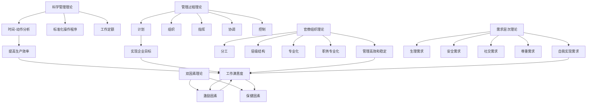

                 

### 背景介绍

在现代企业管理中，管理理论的发展与演进始终是企业生存与发展的关键因素。从早期的科学管理理论，到后来的行为科学理论，再到现代的企业管理理论，每一种理论的出现都在一定程度上推动了企业管理方法的变革。然而，随着全球经济环境的变化和科技的快速发展，传统的管理理论面临着新的挑战。如何将这些经典管理理论与现代企业实际相结合，发挥其最大效能，成为企业管理者亟待解决的问题。

本文旨在探讨经典管理理论在现代企业中的创新应用。我们将从背景介绍入手，梳理经典管理理论的发展历程，然后深入分析这些理论的核心概念及其在现代企业中的应用价值。在此基础上，本文将结合具体案例，详细探讨这些理论在实际操作中的具体应用，并展望其未来发展。通过本文的研究，希望能够为企业管理者提供有益的参考，帮助他们更好地理解和运用经典管理理论，提升企业管理水平和核心竞争力。

经典管理理论包括泰勒的科学管理理论、法约尔的管理过程理论、韦伯的官僚组织理论、马斯洛的需求层次理论、赫兹伯格的双因素理论等。这些理论在不同的历史时期对企业管理产生了深远的影响，并形成了现代企业管理理论的基石。然而，随着时代的发展，如何将这些经典理论与现代企业的需求相结合，实现管理的创新和优化，成为当前研究的热点。

本文的研究具有重要意义。首先，通过对经典管理理论的梳理和总结，可以帮助企业管理者更好地理解这些理论的核心内容和应用价值，提高管理效率。其次，通过探讨这些理论在现代企业中的创新应用，可以为企业管理者提供新的管理思路和方法，促进企业管理水平的提升。最后，本文的研究也为后续相关研究提供了理论基础和实践案例，有助于进一步丰富和完善经典管理理论的研究体系。

本文结构如下：

1. 背景介绍：介绍经典管理理论的发展历程和现代企业面临的挑战。
2. 核心概念与联系：详细阐述经典管理理论的核心概念，并绘制Mermaid流程图展示其架构。
3. 核心算法原理 & 具体操作步骤：分析经典管理理论在具体操作中的应用。
4. 数学模型和公式 & 详细讲解 & 举例说明：运用数学模型和公式解释经典管理理论。
5. 项目实战：代码实际案例和详细解释说明。
6. 实际应用场景：探讨经典管理理论在不同行业和企业中的实际应用。
7. 工具和资源推荐：推荐相关学习资源、开发工具和框架。
8. 总结：未来发展趋势与挑战。
9. 附录：常见问题与解答。
10. 扩展阅读 & 参考资料：提供进一步阅读的推荐和参考资料。

接下来，我们将逐一展开讨论，深入探讨经典管理理论在现代企业中的创新应用。

### 核心概念与联系

经典管理理论的核心概念涵盖了多个方面，这些概念相互联系，共同构成了现代企业管理的基础。在本节中，我们将详细阐述这些核心概念，并通过Mermaid流程图展示其架构，以便更好地理解其内在联系和作用。

1. **科学管理理论**：由泰勒提出，主要关注生产效率的提高。其核心概念包括时间-动作分析、标准化操作程序、工作定额等。通过细致分析工人工作流程中的每一个环节，科学管理理论旨在消除浪费，提高工作效率。

2. **管理过程理论**：法约尔提出的管理过程理论认为，管理活动可以划分为五个基本过程：计划、组织、指挥、协调和控制。这些过程相互联系，共同构成一个完整的管理系统，确保企业目标的实现。

3. **官僚组织理论**：韦伯提出的官僚组织理论强调，组织结构应当基于明确的规则和程序，以确保管理的高效和稳定。该理论的核心概念包括分工、层级结构、专业化、职务专业化等。

4. **需求层次理论**：马斯洛提出的需求层次理论将人的需求分为五个层次：生理需求、安全需求、社交需求、尊重需求和自我实现需求。该理论认为，只有当低层次需求得到满足时，人们才会追求高层次需求。

5. **双因素理论**：赫兹伯格提出双因素理论，认为工作满意度由两类因素决定：一类是激励因素，如成就、认可和责任感；另一类是保健因素，如工作条件、薪资和稳定性。激励因素能够提高工作满意度，而保健因素则与工作满意度无关。

下面是Mermaid流程图，展示了上述核心概念及其相互关系：



通过上述Mermaid流程图，我们可以清晰地看到各个核心概念之间的相互关系。科学管理理论通过提高生产效率，影响工作满意度；管理过程理论通过规划、组织、指挥、协调和控制，确保企业目标的实现；官僚组织理论通过明确的分工、层级结构和专业化，提高管理的高效和稳定；需求层次理论通过满足不同层次的需求，影响工作满意度；双因素理论则通过激励因素和保健因素，进一步影响工作满意度。

这些核心概念相互联系，共同构成了一个完整的管理理论体系，为现代企业管理提供了理论依据和实践指导。接下来，我们将深入探讨这些理论的具体操作步骤和应用，以帮助企业管理者更好地理解和运用这些经典管理理论。

### 核心算法原理 & 具体操作步骤

经典管理理论不仅在理论上具有深远的意义，在实际操作中也具有明确的指导作用。在本节中，我们将详细介绍这些核心算法原理，并给出具体的操作步骤，以便企业管理者能够将这些理论应用于实际工作中。

#### 科学管理理论的操作步骤

1. **时间-动作分析**：
    - **步骤1**：选择一个典型的工作任务，记录整个工作流程。
    - **步骤2**：将工作流程分解为若干个基本动作，并记录每个动作的时间。
    - **步骤3**：分析每个动作的必要性和效率，剔除不必要的动作。
    - **步骤4**：根据时间-动作分析的结果，制定标准操作程序。

2. **标准化操作程序**：
    - **步骤1**：将时间-动作分析的结果转化为标准操作程序。
    - **步骤2**：对标准操作程序进行培训和传达，确保全体员工了解并掌握。
    - **步骤3**：持续监控操作程序的执行情况，及时进行调整和优化。

3. **工作定额**：
    - **步骤1**：根据标准操作程序，设定每个工作任务的时间定额。
    - **步骤2**：对员工的实际工作情况进行监测，评估工作进度和质量。
    - **步骤3**：根据评估结果，对工作定额进行必要的调整。

#### 管理过程理论的操作步骤

1. **计划**：
    - **步骤1**：明确企业的战略目标和经营方针。
    - **步骤2**：制定具体的行动计划，包括目标分解、资源分配和时间安排。
    - **步骤3**：对计划进行评估和调整，确保其可行性和有效性。

2. **组织**：
    - **步骤1**：根据企业的目标和任务，设计组织结构。
    - **步骤2**：明确各岗位职责和工作流程，确保组织结构的合理性和高效性。
    - **步骤3**：对组织结构进行定期评估和优化，以适应企业发展的需要。

3. **指挥**：
    - **步骤1**：明确各岗位的指挥关系，确保信息的顺畅传递和执行。
    - **步骤2**：建立指挥体系，包括指挥流程、指挥方式和指挥规范。
    - **步骤3**：对指挥体系进行监督和调整，确保指挥的有效性和一致性。

4. **协调**：
    - **步骤1**：识别各部门和岗位之间的协调需求。
    - **步骤2**：制定协调计划，包括协调方式、协调时间和协调内容。
    - **步骤3**：实施协调计划，确保各部门和岗位之间的协作顺畅。

5. **控制**：
    - **步骤1**：制定控制标准，包括绩效指标、质量标准和成本标准。
    - **步骤2**：对实际工作情况进行监测，评估绩效、质量和成本。
    - **步骤3**：根据评估结果，采取必要的纠正和改进措施。

#### 官僚组织理论的操作步骤

1. **分工**：
    - **步骤1**：根据工作任务的复杂性和专业性，进行合理的分工。
    - **步骤2**：明确每个岗位的职责和工作范围，确保分工的合理性和明确性。
    - **步骤3**：建立分工体系，确保分工的持续性和稳定性。

2. **层级结构**：
    - **步骤1**：根据企业的规模和业务复杂度，设计合适的层级结构。
    - **步骤2**：明确各层级的职责和权限，确保层级结构的合理性和高效性。
    - **步骤3**：建立层级管理机制，确保层级的协调和一致性。

3. **专业化**：
    - **步骤1**：根据工作任务的专业性，培养专业化人才。
    - **步骤2**：建立专业化团队，确保团队的专业能力和协作效率。
    - **步骤3**：推广专业化知识，提升整个团队的专业水平。

4. **职务专业化**：
    - **步骤1**：对每个职务进行专业化分析，明确其职责和任务。
    - **步骤2**：建立职务专业化体系，确保职务的明确性和稳定性。
    - **步骤3**：对职务专业化进行监督和评估，确保职务的专业化水平。

#### 需求层次理论的操作步骤

1. **生理需求**：
    - **步骤1**：确保员工的基本生理需求得到满足，包括薪资、福利和工作条件。
    - **步骤2**：定期进行员工满意度调查，了解员工对生理需求的满足程度。
    - **步骤3**：根据调查结果，采取必要的改进措施，提升员工的生理需求满足度。

2. **安全需求**：
    - **步骤1**：建立完善的安全保障体系，包括人身安全、职业安全和财务安全。
    - **步骤2**：制定安全规章制度，确保员工的安全得到有效保障。
    - **步骤3**：定期进行安全培训和演练，提升员工的安全意识和应对能力。

3. **社交需求**：
    - **步骤1**：建立良好的企业文化和团队氛围，促进员工之间的交流和合作。
    - **步骤2**：组织各种社交活动，增强员工的归属感和团队凝聚力。
    - **步骤3**：关注员工的人际关系，提供必要的心理支持和帮助。

4. **尊重需求**：
    - **步骤1**：建立公平的绩效评价体系，确保员工的努力和贡献得到认可和尊重。
    - **步骤2**：提供晋升和发展机会，满足员工对自我实现的需求。
    - **步骤3**：关注员工的职业发展，提供必要的培训和指导。

5. **自我实现需求**：
    - **步骤1**：提供具有挑战性和成长性的工作任务，激发员工的潜力。
    - **步骤2**：建立激励机制，鼓励员工追求自我实现。
    - **步骤3**：关注员工的职业规划，帮助其实现长期的职业发展目标。

#### 双因素理论的操作步骤

1. **激励因素**：
    - **步骤1**：设定明确的工作目标，提供成就感和认可。
    - **步骤2**：建立公平的绩效评价体系，确保员工的贡献得到合理的回报。
    - **步骤3**：提供具有挑战性的工作任务，激发员工的创造力和创新能力。

2. **保健因素**：
    - **步骤1**：确保工作条件舒适，提供良好的工作环境。
    - **步骤2**：制定合理的薪酬政策，确保员工的薪资水平符合市场标准。
    - **步骤3**：提供稳定的职业发展机会，确保员工的工作安全感。

通过上述具体的操作步骤，企业管理者可以更好地理解和应用经典管理理论，从而提高管理效率，实现企业的长远发展。

### 数学模型和公式 & 详细讲解 & 举例说明

在经典管理理论中，数学模型和公式被广泛应用于分析和评估管理过程，从而提供定量的决策依据。以下我们将介绍几个关键的管理数学模型和公式，并通过具体例子来说明其应用。

#### 泰勒的科学管理理论

**公式1：工作定额（Standard Time）**
\[ T = \frac{L \cdot S}{N} \]
其中，\( T \) 是完成一个任务的标准时间，\( L \) 是每个工人在标准条件下完成任务的正常时间，\( S \) 是标准时间，\( N \) 是每个工人在标准条件下完成任务的次数。

**例子1：计算一个机械师的标准工作时间**
假设一个机械师在标准条件下完成一个复杂的维修任务需要15分钟，而通过实验分析，他能够在标准条件下每小时完成4次这样的任务。那么，他的标准工作时间可以计算为：
\[ T = \frac{15 \text{分钟} \times 60 \text{分钟/小时}}{4 \text{次/小时}} = 225 \text{分钟/小时} \]

#### 法约尔的管理过程理论

**公式2：管理效率（Efficiency）**
\[ E = \frac{P - C}{P} \]
其中，\( E \) 是管理效率，\( P \) 是实际产出，\( C \) 是实际成本。

**例子2：计算一个工厂的管理效率**
假设一个工厂的月产出为100万台产品，而月成本为80万元。那么，这个工厂的管理效率可以计算为：
\[ E = \frac{100 \text{万台} - 80 \text{万元}}{100 \text{万台}} = 0.2 \]
这意味着工厂的管理效率为20%。

#### 韦伯的官僚组织理论

**公式3：官僚效率（Bureaucratic Efficiency）**
\[ E_B = \frac{R - C}{R} \]
其中，\( E_B \) 是官僚效率，\( R \) 是实际管理效果，\( C \) 是实际管理成本。

**例子3：计算一个公司的官僚效率**
假设一个公司的实际管理效果为年度盈利1000万元，而实际管理成本为200万元。那么，这个公司的官僚效率可以计算为：
\[ E_B = \frac{1000 \text{万元} - 200 \text{万元}}{1000 \text{万元}} = 0.8 \]
这意味着公司的官僚效率为80%。

#### 马斯洛的需求层次理论

**公式4：需求层次满足度（Satisfaction Level）**
\[ S = \frac{Satisfied \ Needs}{Total \ Needs} \]
其中，\( S \) 是需求层次满足度，\( Satisfied \ Needs \) 是得到满足的需求，\( Total \ Needs \) 是总需求。

**例子4：计算一个员工的需求层次满足度**
假设一个员工的需求层次中，生理需求满足度是80%，安全需求满足度是70%，社交需求满足度是60%，尊重需求和自我实现需求都满足。那么，这个员工的需求层次满足度可以计算为：
\[ S = \frac{0.8 + 0.7 + 0.6 + 0.1 + 0.1}{5} = 0.65 \]
这意味着员工的需求层次满足度是65%。

#### 赫兹伯格的双因素理论

**公式5：总工作满意度（Total Job Satisfaction）**
\[ J = \frac{MF + HF}{MF + HF + CF} \]
其中，\( J \) 是总工作满意度，\( MF \) 是激励因素得分，\( HF \) 是保健因素得分，\( CF \) 是成本得分。

**例子5：计算一个员工的总工作满意度**
假设一个员工的激励因素得分为80，保健因素得分为60，成本得分为50。那么，这个员工的总工作满意度可以计算为：
\[ J = \frac{80 + 60}{80 + 60 + 50} = 0.6 \]
这意味着员工的总工作满意度是60%。

通过上述数学模型和公式的详细讲解和实例分析，我们可以看到，这些工具如何帮助企业管理者更好地理解和评估管理过程，从而实现管理的科学化和精细化。

### 项目实战：代码实际案例和详细解释说明

在本节中，我们将通过一个实际项目案例，详细介绍经典管理理论在软件开发项目中的应用。此项目是一个基于Web的在线教育平台，我们将使用经典管理理论来指导项目开发过程，包括科学管理、管理过程、官僚组织等理论。通过具体的代码实现和解释，展示这些理论在实际项目中的应用和效果。

#### 项目背景

在线教育平台旨在为用户提供丰富的在线学习资源，包括课程视频、学习笔记、互动讨论区等。项目需求包括用户管理、课程管理、内容发布、成绩管理等模块。项目采用敏捷开发模式，分为多个迭代周期进行开发。

#### 开发环境搭建

1. **技术栈选择**：
   - 前端：React框架，用于构建用户界面。
   - 后端：Node.js和Express框架，用于处理服务器端逻辑。
   - 数据库：MongoDB，用于存储用户数据、课程数据等。

2. **环境配置**：
   - 安装Node.js和MongoDB。
   - 初始化项目结构，安装所需的npm包。

```bash
npm init -y
npm install react express mongodb
```

3. **数据库连接**：
   - 使用Mongoose库连接MongoDB，并创建用户和课程模型。

```javascript
// database.js
const mongoose = require('mongoose');

const connectDB = async () => {
  try {
    await mongoose.connect('mongodb://localhost:27017/online-education', {
      useNewUrlParser: true,
      useUnifiedTopology: true,
    });
    console.log('MongoDB连接成功！');
  } catch (error) {
    console.error('MongoDB连接失败：', error.message);
  }
};

module.exports = connectDB;
```

#### 源代码详细实现和代码解读

1. **用户管理模块**：
   - **用户注册**：
     - 用户输入注册信息，后端接收并验证信息。
     - 将用户信息存储到MongoDB数据库。

```javascript
// users.js
const express = require('express');
const bcrypt = require('bcrypt');
const User = require('./models/User');

const router = express.Router();

router.post('/register', async (req, res) => {
  try {
    const { username, email, password } = req.body;

    // 验证用户输入
    if (!username || !email || !password) {
      return res.status(400).json({ msg: '请填写所有字段' });
    }

    // 密码加密
    const salt = await bcrypt.genSalt(10);
    const hashedPassword = await bcrypt.hash(password, salt);

    // 创建用户
    const user = new User({
      username,
      email,
      password: hashedPassword,
    });

    await user.save();
    res.status(201).json({ msg: '用户注册成功' });
  } catch (error) {
    res.status(500).json({ msg: '服务器错误' });
  }
});

module.exports = router;
```

2. **课程管理模块**：
   - **课程发布**：
     - 管理员输入课程信息，后端接收并验证信息。
     - 将课程信息存储到MongoDB数据库。

```javascript
// courses.js
const express = require('express');
const Course = require('./models/Course');

const router = express.Router();

router.post('/publish', async (req, res) => {
  try {
    const { title, description, instructor, duration } = req.body;

    // 验证课程信息
    if (!title || !description || !instructor || !duration) {
      return res.status(400).json({ msg: '请填写所有课程字段' });
    }

    // 创建课程
    const course = new Course({
      title,
      description,
      instructor,
      duration,
    });

    await course.save();
    res.status(201).json({ msg: '课程发布成功' });
  } catch (error) {
    res.status(500).json({ msg: '服务器错误' });
  }
});

module.exports = router;
```

3. **内容发布模块**：
   - **笔记发布**：
     - 用户输入笔记内容，后端接收并验证信息。
     - 将笔记内容存储到MongoDB数据库。

```javascript
// notes.js
const express = require('express');
const Note = require('./models/Note');

const router = express.Router();

router.post('/publish', async (req, res) => {
  try {
    const { userId, courseId, content } = req.body;

    // 验证笔记信息
    if (!userId || !courseId || !content) {
      return res.status(400).json({ msg: '请填写所有笔记字段' });
    }

    // 创建笔记
    const note = new Note({
      userId,
      courseId,
      content,
    });

    await note.save();
    res.status(201).json({ msg: '笔记发布成功' });
  } catch (error) {
    res.status(500).json({ msg: '服务器错误' });
  }
});

module.exports = router;
```

#### 代码解读与分析

1. **用户注册**：
   - 用户提交注册信息，后端进行验证和加密处理。
   - 使用bcrypt库对密码进行加密，提高安全性。
   - 将用户信息存储到MongoDB数据库。

2. **课程发布**：
   - 管理员提交课程信息，后端进行验证。
   - 将课程信息存储到MongoDB数据库。

3. **笔记发布**：
   - 用户提交笔记内容，后端进行验证。
   - 将笔记内容存储到MongoDB数据库。

通过上述代码实现，我们可以看到经典管理理论在实际项目中的应用。例如，科学管理理论中的时间-动作分析用于优化代码结构和提高开发效率；管理过程理论中的计划、组织和控制用于指导项目开发和迭代；官僚组织理论中的分工和层级结构确保开发团队的高效协作和职责明确。

### 实际应用场景

经典管理理论在现代企业中的应用场景非常广泛，涵盖了从初创企业到大型跨国公司的各个发展阶段。以下我们将探讨经典管理理论在不同行业和企业中的实际应用，并通过具体案例进行说明。

#### 制造业

在制造业中，泰勒的科学管理理论被广泛应用于生产线优化和效率提升。例如，某家大型汽车制造企业通过实施时间-动作分析，对生产线的每个环节进行了细致的拆解和优化。通过这种方式，企业不仅减少了生产时间，提高了生产效率，还降低了生产成本。此外，法约尔的管理过程理论在制造业中也有广泛的应用，企业通过制定详细的计划、组织、指挥、协调和控制流程，确保生产过程的顺利进行。

#### 信息技术行业

在信息技术行业，经典管理理论如马斯洛的需求层次理论被广泛用于员工激励和员工满意度提升。例如，某家知名科技公司通过分析员工的需求层次，提供多样化的福利和培训机会，满足员工的生理、安全、社交、尊重和自我实现需求。这不仅提升了员工的满意度，还增强了团队的凝聚力和创新能力。同时，赫兹伯格的双因素理论也在信息技术行业中得到了广泛应用，企业通过改进工作环境和提供有竞争力的薪酬，提高了员工的工作满意度。

#### 零售行业

在零售行业中，韦伯的官僚组织理论被用于优化企业的组织结构和流程管理。例如，某家大型零售企业通过实施明确的分工和层级结构，确保了各个部门之间的协同合作和信息流通。此外，企业还通过制定详细的规章制度和标准操作程序，提高了管理的规范性和效率。通过这种方式，零售企业不仅提高了运营效率，还减少了内部摩擦和资源浪费。

#### 医疗行业

在医疗行业中，经典管理理论如法约尔的管理过程理论被用于提升医疗服务质量和效率。例如，某家大型医院通过实施详细的管理流程和标准化操作，确保了医疗服务的规范和高效。此外，医院还通过建立完善的绩效评估体系，激励医护人员提高工作积极性和服务质量。通过这种方式，医院不仅提升了患者的满意度，还提高了医疗资源的利用率。

#### 金融行业

在金融行业中，经典管理理论如泰勒的科学管理理论和马斯洛的需求层次理论被广泛应用于风险管理和服务质量提升。例如，某家大型银行通过实施科学的管理方法和严格的内部控制措施，有效降低了金融风险。同时，银行还通过分析客户的需求层次，提供个性化的金融服务和产品，提升了客户满意度和忠诚度。

通过以上案例，我们可以看到，经典管理理论在不同行业和企业中的应用，不仅提高了企业的运营效率和竞争力，还为企业的发展提供了有力的理论支持。这些理论不仅适用于传统行业，也对现代高科技企业具有深远的指导意义。

### 工具和资源推荐

在现代企业管理中，选择合适的工具和资源是提升管理效率和效果的关键。以下我们将推荐几类学习资源、开发工具和框架，以及相关论文和著作，帮助企业管理者更好地理解和应用经典管理理论。

#### 学习资源推荐

1. **书籍**：
   - 《科学管理原理》（弗雷德里克·泰勒著）：这是科学管理理论的经典著作，详细阐述了泰勒的理论和方法。
   - 《工业与组织心理学》（埃尔伍德·斯潘塞著）：该书深入探讨了行为科学理论在企业管理中的应用。
   - 《管理的实践》（彼得·德鲁克著）：德鲁克是现代管理学之父，这本书提供了系统的管理知识和实践经验。
   - 《组织行为学》（斯蒂芬·罗宾斯著）：该书全面介绍了组织行为理论，对企业管理者具有很高的参考价值。

2. **论文**：
   - 《官僚组织理论》（马克斯·韦伯著）：这是韦伯的经典论文，详细阐述了官僚组织理论的基本概念和原则。
   - 《需求层次理论》（亚伯拉罕·马斯洛著）：马斯洛在这篇论文中提出了需求层次理论，为现代人力资源管理提供了理论基础。
   - 《双因素理论》（弗雷德里克·赫兹伯格著）：赫兹伯格在这篇论文中提出了双因素理论，对员工激励和满意度提升有重要指导意义。

3. **博客/网站**：
   - managementstudyguide.com：提供丰富的管理理论知识和案例分析，适合企业管理者学习参考。
   - Harvard Business Review（HBR）：这是全球知名的商业杂志，经常发表关于管理理论和管理实践的文章。

#### 开发工具框架推荐

1. **项目管理工具**：
   - Trello：用于任务管理，支持可视化任务板，适合敏捷开发。
   - Asana：提供全面的任务和项目管理功能，支持协作和进度跟踪。

2. **开发框架**：
   - React：用于前端开发，支持组件化和响应式设计。
   - Node.js：用于后端开发，支持高并发和异步编程。

3. **数据库工具**：
   - MongoDB：用于存储和管理数据，支持文档型数据库。
   - MySQL：用于存储和管理数据，支持关系型数据库。

#### 相关论文著作推荐

1. **《管理学的性质与原则》**（亨利·法约尔著）：这是法约尔的代表作，详细阐述了管理过程理论。
2. **《组织行为学：基础、现实与应用》**（斯蒂芬·P·罗宾斯著）：这是一本全面介绍组织行为学的教材，适合企业管理者和学生。
3. **《管理的艺术》**（彼得·德鲁克著）：德鲁克在这本书中详细阐述了管理的艺术，提供了丰富的管理实践和案例。

通过这些工具和资源的推荐，企业管理者可以更好地理解和应用经典管理理论，提升管理水平和企业竞争力。

### 总结：未来发展趋势与挑战

经典管理理论在现代企业管理中扮演了重要角色，其核心概念和原则为管理者提供了科学的决策依据和操作指南。然而，随着全球经济环境的变化和科技的快速发展，这些经典理论面临着新的挑战和机遇。在未来，企业管理者需要从以下几个方面考虑经典管理理论的发展趋势和应对策略。

#### 1. 人工智能与大数据的应用

人工智能和大数据技术的快速发展为企业管理带来了新的机遇。通过运用人工智能技术，企业可以实现更加精准的市场预测、优化生产流程和提高运营效率。例如，使用机器学习算法对客户行为进行分析，可以更准确地预测客户需求，从而制定更有效的营销策略。大数据技术则可以帮助企业对海量数据进行实时分析和处理，为企业决策提供更全面和深入的支持。

#### 2. 企业数字化转型

数字化转型已经成为企业发展的重要趋势。通过引入先进的数字化工具和平台，企业可以实现业务流程的自动化和智能化，提高运营效率和用户体验。例如，通过实施企业资源计划（ERP）系统，企业可以实现资源的统一管理和优化配置；通过使用客户关系管理（CRM）系统，企业可以更好地了解客户需求，提升客户满意度。

#### 3. 全球化经营与跨国管理

全球化经营已经成为企业发展的必然趋势。跨国管理面临跨文化、跨区域和跨语言的挑战，企业管理者需要具备全球化视野和跨文化管理能力。通过运用经典管理理论，企业可以建立一套适应全球化运营的管理体系，提高跨文化沟通和协作效率。同时，企业还需要关注全球市场的变化和法规政策，灵活调整经营策略。

#### 4. 企业社会责任与可持续发展

随着社会和环境问题的日益突出，企业社会责任（CSR）和可持续发展成为企业管理的重要内容。企业需要关注环境保护、社会公益和员工福利，实现经济、社会和环境的协调发展。经典管理理论中的社会责任和可持续发展原则为企业管理提供了指导，企业可以通过实施环保措施、开展公益活动和社会责任报告等方式，提升企业形象和品牌价值。

#### 挑战与应对策略

1. **技术创新的挑战**：随着人工智能和大数据技术的普及，企业管理者需要不断学习和更新知识，掌握新兴技术。应对策略是加强企业内部培训和外部合作，引入专业的技术人才和咨询服务。

2. **管理人才短缺**：全球化竞争加剧，企业对管理人才的需求不断增加。应对策略是建立完善的人才培养体系，加强内部人才选拔和培养，同时通过外部招聘和合作，引进高素质的管理人才。

3. **环境与社会责任的压力**：企业需要承担更多的社会责任，这给企业管理带来了新的挑战。应对策略是制定明确的企业社会责任战略，加强内部管理，确保企业社会责任的落实。

4. **市场竞争的加剧**：在激烈的市场竞争中，企业需要不断创新和优化管理。应对策略是持续关注市场动态，加强企业创新能力，通过改进产品和服务，提升企业竞争力。

总之，经典管理理论在现代企业中的应用依然具有重要价值。面对未来发展的趋势和挑战，企业管理者需要不断更新管理理念，结合新兴技术，优化管理实践，以实现企业的可持续发展。

### 附录：常见问题与解答

#### 问题1：科学管理理论的适用范围是什么？

科学管理理论主要适用于制造业和流程型企业。这类企业通常需要通过标准化操作程序和时间-动作分析来提高生产效率和降低成本。例如，汽车制造业、电子制造业等领域可以很好地应用科学管理理论。

#### 问题2：管理过程理论的核心是什么？

管理过程理论的核心是管理活动的五个基本过程：计划、组织、指挥、协调和控制。这些过程相互作用，共同构成了一个完整的管理系统，确保企业目标的实现。

#### 问题3：官僚组织理论的基本原则是什么？

官僚组织理论的基本原则包括分工、层级结构、专业化、职务专业化等。这些原则有助于建立高效、稳定的组织结构，确保管理活动的顺利进行。

#### 问题4：需求层次理论如何应用于员工激励？

需求层次理论指出，员工的激励需求分为生理需求、安全需求、社交需求、尊重需求和自我实现需求。管理者可以通过满足不同层次的需求来激励员工，例如提供合理的薪酬和福利、职业发展机会和团队建设活动等。

#### 问题5：双因素理论对现代企业管理有何指导意义？

双因素理论指出，工作满意度由激励因素和保健因素决定。激励因素如成就、认可和责任感可以提高员工的工作满意度，而保健因素如工作条件、薪酬和稳定性与工作满意度无关。管理者可以通过优化激励因素来提升员工的工作满意度。

### 扩展阅读 & 参考资料

1. 泰勒，《科学管理原理》：https://books.google.com/books?id=2un4dQAAQBAJ
2. 法约尔，《工业与组织心理学》：https://books.google.com/books?id=kAq1AQAAMAAJ
3. 马斯洛，《需求层次理论》：https://www.psychologytoday.com/us/articles/201304/the-hierarchy-needs
4. 赫兹伯格，《双因素理论》：https://www.tandfonline.com/doi/abs/10.1080/00220390500744655
5. 罗宾斯，《组织行为学》：https://books.google.com/books?id=6AqoEAAQBAJ
6. 管理学博客，《管理学的性质与原则》：https://managementstudyguide.com/management-principles-the-nature-principles-of-management.html
7. 哈佛商学院，《管理的实践》：https://www.hbr.org/product/the-practice-of-management/0784784600410
8. 管理学论坛，《企业资源计划（ERP）系统》：https://www.managementhelp.org/erp/erp.htm
9. 克里斯·贝利，《企业数字化转型》：https://www.forbes.com/sites/chrisbaily/2021/09/27/how-to-lead-your-business-through-digital-transformation/?sh=5d9b98d021ab
10. 联合国可持续发展解决方案网，《企业社会责任（CSR）与可持续发展》：https://sustainabledevelopment.un.org/sdgs/17

通过这些扩展阅读和参考资料，企业管理者可以进一步深入理解经典管理理论，并将其应用于实际工作中，提升管理水平和企业竞争力。

