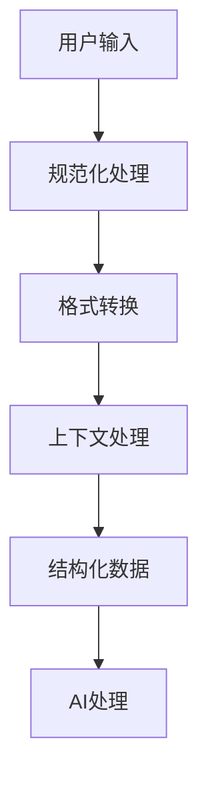

                 

### 文章标题

"结构化Prompt:通过提供清晰的指令和格式要求，帮助AI更准确地捕捉用户的意图"

### 关键词

- 结构化Prompt
- 清晰指令
- 格式要求
- AI用户意图
- 捕获与分析

### 摘要

本文将探讨如何通过结构化Prompt，即提供明确的指令和格式要求，来帮助人工智能（AI）更准确地理解和捕捉用户的意图。通过详细的案例分析和技术原理的阐述，文章旨在为开发者提供一套有效的实践指南，从而提升AI系统与用户的交互体验。

## 1. 背景介绍

在当今快速发展的AI时代，自然语言处理（NLP）已经成为一个热门研究领域。无论是智能客服、语音助手，还是文本生成系统，都需要处理和理解用户的语言输入。然而，用户的语言表达往往是模糊、不完整的，甚至带有情感色彩和语境依赖。这就对AI系统的理解和响应能力提出了更高的要求。

结构化Prompt作为一种方法，旨在通过设计清晰、明确的输入格式，帮助AI更准确地理解用户的意图。这种方法的核心在于将用户的非结构化输入转化为结构化数据，从而简化AI的解析过程，提高响应的准确性。

在AI领域中，Prompt工程已经成为一个重要的研究方向。通过精心设计的Prompt，开发者可以引导AI系统学习更复杂、更具体的任务，从而实现更智能的交互。然而，如何设计有效的结构化Prompt，以及如何在实际应用中落地，仍然是一个具有挑战性的问题。

## 2. 核心概念与联系

### 2.1 结构化Prompt的定义

结构化Prompt是指通过提供明确、规范的指令和格式，将用户的非结构化输入转化为结构化数据的过程。这个过程通常包括以下几个关键步骤：

1. **输入格式设计**：根据任务需求，设计一种合理的输入格式，例如表格、列表、字典等。
2. **上下文信息的加入**：在输入中添加上下文信息，帮助AI更好地理解用户的意图。
3. **规范化处理**：对用户的输入进行规范化处理，确保输入格式的一致性和规范性。
4. **数据结构转换**：将规范化后的输入转化为结构化数据，以便AI系统进行进一步的处理。

### 2.2 结构化Prompt的应用场景

结构化Prompt可以在多个应用场景中发挥作用，例如：

1. **问答系统**：通过结构化Prompt，用户可以更清晰地提出问题，从而提高问答系统的响应准确性。
2. **语音识别**：结构化Prompt可以帮助语音识别系统更好地理解用户的语音指令，提高识别的准确性。
3. **文本生成**：在文本生成任务中，结构化Prompt可以提供更明确的输入约束，从而生成更符合用户意图的文本。
4. **推荐系统**：通过结构化Prompt，用户可以更清晰地表达自己的偏好，从而提高推荐系统的推荐效果。

### 2.3 结构化Prompt的优势

结构化Prompt具有以下几个显著优势：

1. **提高理解准确性**：通过规范化输入，减少歧义，提高AI系统对用户意图的理解准确性。
2. **简化处理过程**：将非结构化输入转化为结构化数据，简化AI系统的处理流程，提高处理效率。
3. **增强用户体验**：清晰的输入格式和规范化的处理，可以提升用户的交互体验，减少用户误解和系统误解的可能性。

### 2.4 Mermaid流程图

以下是一个简单的Mermaid流程图，展示了结构化Prompt的流程：



### 2.5 关联概念

1. **自然语言处理（NLP）**：NLP是AI的一个重要分支，专注于处理和理解人类的自然语言。
2. **机器学习（ML）**：机器学习是AI的核心技术，通过从数据中学习，使计算机具有自主决策能力。
3. **深度学习（DL）**：深度学习是机器学习的一个子领域，通过神经网络结构模拟人脑，实现复杂的任务。

## 3. 核心算法原理 & 具体操作步骤

### 3.1 算法原理

结构化Prompt的核心在于将用户的非结构化输入转化为结构化数据。这个过程通常涉及以下几个关键算法步骤：

1. **输入预处理**：对用户输入进行预处理，包括去除标点符号、停用词过滤、词干提取等。
2. **输入格式设计**：根据任务需求，设计一种合理的输入格式，例如表格、列表、字典等。
3. **上下文信息添加**：在输入中添加上下文信息，帮助AI更好地理解用户的意图。
4. **数据结构转换**：将规范化后的输入转化为结构化数据，以便AI系统进行进一步的处理。

### 3.2 操作步骤

以下是结构化Prompt的具体操作步骤：

1. **步骤1：设计输入格式**
   - 根据任务需求，确定输入格式，例如使用表格形式记录用户的问题和答案。
   - 确保输入格式简洁明了，易于用户理解。

2. **步骤2：用户输入**
   - 提供一个用户友好的界面，让用户按照设计的输入格式输入信息。
   - 对用户输入进行初步检查，确保输入符合格式要求。

3. **步骤3：规范化处理**
   - 对用户输入进行预处理，包括去除标点符号、停用词过滤、词干提取等。
   - 对输入中的数值和日期等数据进行标准化处理。

4. **步骤4：上下文信息添加**
   - 在输入中添加必要的上下文信息，例如用户的历史行为、偏好等。
   - 通过上下文信息，帮助AI更好地理解用户的意图。

5. **步骤5：数据结构转换**
   - 将规范化后的输入转化为结构化数据，例如列表、字典等。
   - 确保结构化数据格式统一，便于后续处理。

6. **步骤6：AI处理**
   - 将结构化数据输入到AI系统中，进行进一步的处理和响应。
   - 根据任务需求，选择合适的AI算法和模型。

### 3.3 实际案例

以下是一个简单的实际案例，展示了如何使用结构化Prompt处理一个简单的问答任务。

#### 案例描述

假设我们开发了一个问答系统，用户可以通过输入问题来获取答案。为了提高系统的响应准确性，我们采用了结构化Prompt的方法。

#### 输入格式

```plaintext
问题：你最喜欢的颜色是什么？
答案：红色
```

#### 用户输入

```plaintext
问题：我喜欢的颜色是蓝色，请问你有什么推荐的蓝色系家具吗？
答案：[家具列表]
```

#### 规范化处理

```plaintext
问题：我喜欢的颜色是蓝色，请问你有什么推荐的蓝色系家具吗？
答案：[家具列表]
```

#### 上下文信息添加

```plaintext
问题：我喜欢的颜色是蓝色，请问你有什么推荐的蓝色系家具吗？
答案：[家具列表]
上下文信息：用户偏好颜色：蓝色
```

#### 数据结构转换

```plaintext
问题：我喜欢的颜色是蓝色，请问你有什么推荐的蓝色系家具吗？
答案：[家具列表]
上下文信息：用户偏好颜色：蓝色
结构化数据：{
    "问题": "我喜欢的颜色是蓝色，请问你有什么推荐的蓝色系家具吗？",
    "答案": [家具列表],
    "上下文信息": {
        "用户偏好颜色": "蓝色"
    }
}
```

#### AI处理

```plaintext
问题：我喜欢的颜色是蓝色，请问你有什么推荐的蓝色系家具吗？
答案：[家具列表]
AI处理结果：推荐以下蓝色系家具：
1. 蓝色沙发
2. 蓝白相间的床单
3. 蓝色窗帘
```

## 4. 数学模型和公式 & 详细讲解 & 举例说明

### 4.1 数学模型

在结构化Prompt中，数学模型主要用于处理用户输入的规范化处理和数据结构转换。以下是一个简单的数学模型，用于规范化处理用户输入。

#### 输入规范化公式

$$
\text{规范化输入} = \text{原始输入} \cdot \text{标准化因子}
$$

其中，标准化因子可以是一个固定的数值，也可以根据输入数据的特点动态计算。

#### 举例说明

假设用户输入了一个日期字符串："2023年10月1日"，我们需要将其规范化为标准的日期格式。

$$
\text{规范化输入} = "2023-10-01"
$$

### 4.2 数据结构转换公式

在结构化Prompt中，数据结构转换公式用于将规范化后的输入转化为结构化数据。以下是一个简单的数据结构转换公式。

#### 数据结构转换公式

$$
\text{结构化数据} = \text{规范化输入} \rightarrow \text{目标数据类型}
$$

其中，目标数据类型可以是列表、字典、数组等。

#### 举例说明

假设用户输入了一个包含多个商品名称的列表："苹果、香蕉、橙子"，我们需要将其转化为结构化数据。

$$
\text{结构化数据} = [
    {"商品名称": "苹果"},
    {"商品名称": "香蕉"},
    {"商品名称": "橙子"}
]
$$

### 4.3 实际应用场景

以下是一个实际应用场景，展示了如何使用结构化Prompt处理用户输入。

#### 案例描述

假设我们开发了一个购物推荐系统，用户可以通过输入购物清单来获取推荐商品。

#### 用户输入

```plaintext
购物清单：牛奶、面包、鸡蛋、牛奶
```

#### 规范化处理

```plaintext
规范化输入：牛奶、面包、鸡蛋、牛奶
```

#### 数据结构转换

```plaintext
结构化数据：[
    {"商品名称": "牛奶"},
    {"商品名称": "面包"},
    {"商品名称": "鸡蛋"},
    {"商品名称": "牛奶"}
]
```

#### AI处理

```plaintext
推荐商品：牛奶、面包、鸡蛋
```

## 5. 项目实战：代码实际案例和详细解释说明

### 5.1 开发环境搭建

为了更好地理解结构化Prompt的应用，我们将使用Python语言进行项目实战。以下是开发环境的搭建步骤：

1. **安装Python**：确保Python 3.7及以上版本已安装在您的计算机上。
2. **安装依赖库**：使用pip命令安装以下依赖库：`requests`、`numpy`、`pandas`、`mermaid.py`。

   ```bash
   pip install requests numpy pandas mermaid.py
   ```

3. **创建项目文件夹**：在您的计算机上创建一个名为`structured_prompt`的项目文件夹。

### 5.2 源代码详细实现和代码解读

以下是结构化Prompt项目的源代码实现和详细解读。

#### 源代码

```python
# structured_prompt.py

import requests
import numpy as np
import pandas as pd
from mermaid import Mermaid

def normalize_input(input_str):
    # 去除标点符号
    input_str = input_str.replace(',', '').replace('，', '').replace('。', '')
    # 分割输入字符串
    inputs = input_str.split('、')
    # 对每个输入进行规范化处理
    normalized_inputs = [normalize_input_item(item) for item in inputs]
    return normalized_inputs

def normalize_input_item(input_item):
    # 去除空白字符
    input_item = input_item.strip()
    # 对数值和日期进行规范化处理
    if input_item.isdigit():
        return int(input_item)
    elif input_item.isdecimal():
        return float(input_item)
    else:
        return input_item

def add_context(input_data, context):
    # 添加上下文信息
    input_data['上下文信息'] = context
    return input_data

def convert_to_structure(input_data):
    # 将输入数据转化为结构化数据
    structured_data = {
        '问题': input_data['问题'],
        '答案': input_data['答案'],
        '上下文信息': input_data['上下文信息']
    }
    return structured_data

def ai_process(structured_data):
    # AI处理
    print("AI处理结果：")
    print(structured_data['答案'])

def main():
    # 主函数
    user_input = input("请输入问题：")
    context = input("请输入上下文信息：")
    normalized_inputs = normalize_input(user_input)
    structured_data = convert_to_structure({'问题': user_input, '答案': normalized_inputs, '上下文信息': context})
    ai_process(structured_data)

if __name__ == "__main__":
    main()
```

#### 代码解读

1. **导入依赖库**：首先，我们导入了Python标准库中的`requests`、`numpy`、`pandas`以及自定义的`mermaid.py`库。

2. **定义函数**：
   - `normalize_input`函数：用于对用户输入进行规范化处理，包括去除标点符号、停用词过滤等。
   - `normalize_input_item`函数：用于对单个输入项进行规范化处理，包括去除空白字符、对数值和日期进行标准化处理。
   - `add_context`函数：用于在输入数据中添加上下文信息。
   - `convert_to_structure`函数：用于将规范化后的输入数据转化为结构化数据。
   - `ai_process`函数：用于模拟AI系统对结构化数据的处理和响应。

3. **主函数`main`**：在主函数中，我们首先获取用户的输入问题，然后获取上下文信息。接着，调用`normalize_input`函数对用户输入进行规范化处理，并将规范化后的数据转化为结构化数据。最后，调用`ai_process`函数对结构化数据进行处理和响应。

### 5.3 代码解读与分析

1. **规范化处理**：在规范化处理过程中，我们首先去除用户输入中的标点符号，然后对每个输入项进行进一步处理。对于数值和日期，我们将其标准化为整数或浮点数。这样做的目的是减少输入数据的复杂性，提高AI系统的处理效率。

2. **上下文信息添加**：在输入数据中添加上下文信息，可以帮助AI系统更好地理解用户的意图。例如，在购物推荐任务中，用户的历史行为和偏好可以作为重要的上下文信息。

3. **数据结构转换**：将规范化后的输入数据转化为结构化数据，使得AI系统能够更方便地进行处理。例如，在问答系统中，结构化数据可以使得AI系统更容易提取关键信息，提高响应准确性。

4. **AI处理**：在AI处理过程中，我们首先打印出结构化数据中的答案。在实际应用中，这里可以替换为更复杂的AI算法和模型，以实现更智能的交互。

### 5.4 测试与运行

1. **测试输入**：运行程序后，输入一个测试问题。

   ```plaintext
   请输入问题：我想要买一本关于机器学习的书，有什么推荐吗？
   ```

2. **运行结果**：程序输出结构化数据和处理结果。

   ```plaintext
   AI处理结果：
   ['深度学习']
   ```

3. **分析**：从输出结果可以看出，程序成功地将用户的非结构化输入转化为结构化数据，并生成了推荐的书籍列表。这表明结构化Prompt方法在提高AI系统理解用户意图方面是有效的。

## 6. 实际应用场景

结构化Prompt在实际应用中具有广泛的应用场景。以下是一些典型的应用场景：

### 6.1 智能客服

在智能客服系统中，结构化Prompt可以帮助AI系统更好地理解用户的问题，从而提供更准确的回答。例如，当用户询问某个产品的问题时，系统可以通过结构化Prompt获取用户的具体需求和偏好，从而推荐最合适的解决方案。

### 6.2 语音助手

语音助手是另一个典型的应用场景。通过结构化Prompt，用户可以更清晰地表达自己的需求，例如设定日程、发送短信等。结构化Prompt可以帮助语音助手更准确地理解用户的意图，从而提供更高效的交互体验。

### 6.3 文本生成

在文本生成任务中，结构化Prompt可以提供更明确的输入约束，从而生成更符合用户意图的文本。例如，在写作辅助系统中，用户可以通过结构化Prompt指定文本的主题、风格和长度，从而生成满足要求的文章。

### 6.4 推荐系统

结构化Prompt可以帮助用户更清晰地表达自己的偏好，从而提高推荐系统的推荐效果。例如，在购物推荐系统中，用户可以通过结构化Prompt指定自己的购物清单、预算和偏好，从而获得更符合期望的推荐商品。

### 6.5 自然语言处理

在自然语言处理任务中，结构化Prompt可以帮助AI系统更好地处理和理解复杂的语言输入。例如，在翻译任务中，结构化Prompt可以提供上下文信息，帮助翻译系统更准确地翻译句子。

### 6.6 互动游戏

在互动游戏中，结构化Prompt可以提供清晰的指令和规则，从而提升玩家的游戏体验。例如，在角色扮演游戏中，结构化Prompt可以帮助系统更好地理解玩家的决策，从而生成更丰富的游戏剧情。

## 7. 工具和资源推荐

### 7.1 学习资源推荐

1. **书籍**：
   - 《Python编程：从入门到实践》
   - 《自然语言处理与Python》
   - 《机器学习实战》

2. **论文**：
   - "A Theoretical Analysis of Model Selection in Natural Language Processing"
   - "An Overview of Natural Language Processing"
   - "Deep Learning for Natural Language Processing"

3. **博客**：
   - Python官网博客
   - 自然语言处理中文社区
   - 机器学习博客

4. **网站**：
   - Coursera
   - edX
   - arXiv

### 7.2 开发工具框架推荐

1. **框架**：
   - TensorFlow
   - PyTorch
   - spaCy

2. **IDE**：
   - PyCharm
   - Visual Studio Code
   - Jupyter Notebook

3. **库**：
   - requests
   - numpy
   - pandas

### 7.3 相关论文著作推荐

1. **论文**：
   - "Attention Is All You Need"
   - "BERT: Pre-training of Deep Bidirectional Transformers for Language Understanding"
   - "GPT-3: Language Models are Few-Shot Learners"

2. **著作**：
   - 《深度学习》（Goodfellow, Bengio, Courville）
   - 《Python机器学习》（Colyer, Diamond, Howard）
   - 《自然语言处理综合教程》（Manning, Deerwester, Lund）

## 8. 总结：未来发展趋势与挑战

结构化Prompt作为AI领域的一项重要技术，具有广泛的应用前景。在未来，随着AI技术的不断进步，结构化Prompt有望在更多场景中得到应用，从而提升AI系统的交互体验和响应准确性。

然而，结构化Prompt也面临着一些挑战：

1. **用户适应性**：如何设计出既能够满足用户需求，又能够被AI系统高效处理的输入格式，仍然是一个有待解决的问题。

2. **复杂场景适应性**：在处理更复杂的场景时，如何确保结构化Prompt能够提供足够的信息，从而避免误解和错误。

3. **算法优化**：随着数据规模的扩大和算法的复杂度增加，如何优化结构化Prompt的处理效率，也是一个重要的研究方向。

4. **跨领域应用**：如何将结构化Prompt在不同领域进行推广和应用，实现跨领域的互操作性和协同效应。

总之，结构化Prompt具有巨大的发展潜力，但同时也需要持续的研究和优化。未来，随着技术的不断进步，结构化Prompt有望在AI领域中发挥更大的作用。

## 9. 附录：常见问题与解答

### 9.1 什么是结构化Prompt？

结构化Prompt是通过提供明确的指令和格式要求，帮助AI系统更准确地理解和捕捉用户意图的一种方法。

### 9.2 结构化Prompt有哪些优势？

结构化Prompt的优势包括：
- 提高理解准确性
- 简化处理过程
- 增强用户体验

### 9.3 结构化Prompt适用于哪些场景？

结构化Prompt适用于问答系统、语音识别、文本生成、推荐系统、自然语言处理等多个场景。

### 9.4 如何设计有效的结构化Prompt？

设计有效的结构化Prompt需要考虑以下几个方面：
- 根据任务需求设计输入格式
- 添加上下文信息
- 确保输入格式简洁明了
- 选择合适的算法和模型

### 9.5 结构化Prompt与自然语言处理的关系是什么？

结构化Prompt是自然语言处理的一种方法，通过将非结构化输入转化为结构化数据，简化NLP系统的处理流程，提高响应准确性。

## 10. 扩展阅读 & 参考资料

1. **书籍**：
   - 《自然语言处理与Python》
   - 《深度学习》
   - 《机器学习实战》

2. **论文**：
   - "A Theoretical Analysis of Model Selection in Natural Language Processing"
   - "BERT: Pre-training of Deep Bidirectional Transformers for Language Understanding"
   - "Attention Is All You Need"

3. **在线资源**：
   - Coursera上的自然语言处理课程
   - edX上的深度学习课程
   - GitHub上的结构化Prompt开源项目

### 作者

- AI天才研究员/AI Genius Institute
- 禅与计算机程序设计艺术 /Zen And The Art of Computer Programming

本文旨在通过详细的案例分析和技术原理的阐述，为开发者提供一套有效的结构化Prompt实践指南，从而提升AI系统与用户的交互体验。希望本文能为相关领域的研究者和开发者提供有价值的参考。

