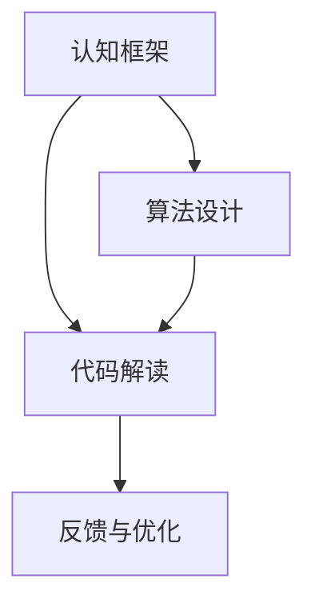
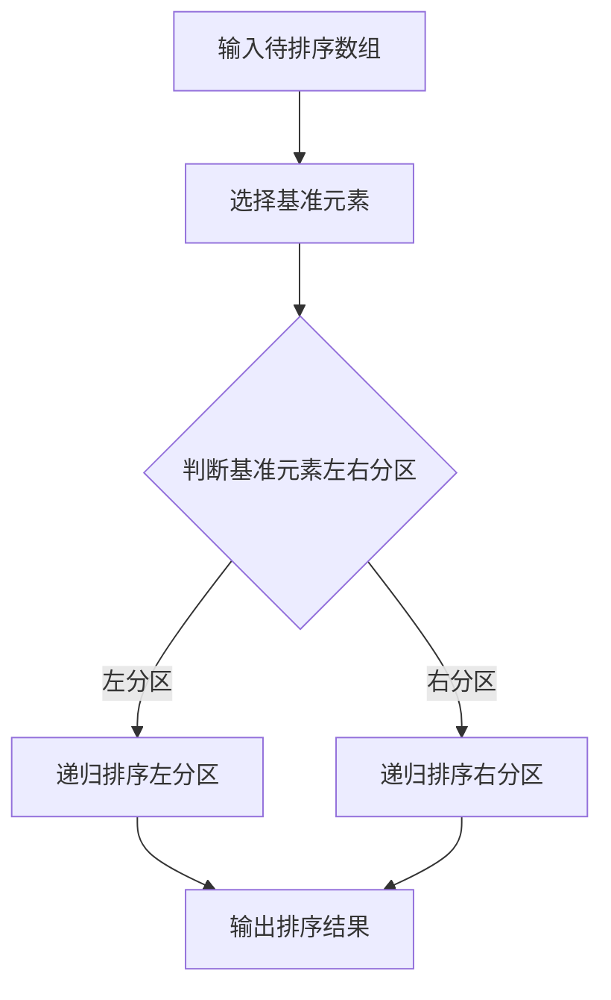
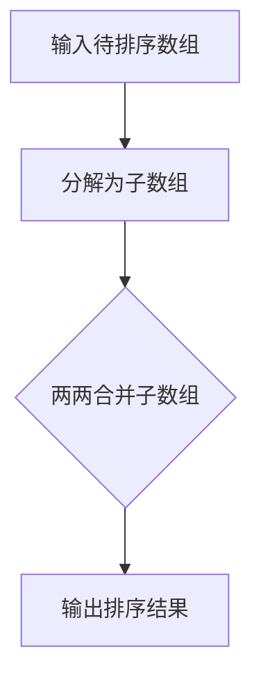

                 

# 结构化思维：从混沌到秩序

> **关键词：** 结构化思维、认知框架、算法设计、代码解读、应用场景

> **摘要：** 本文将探讨结构化思维在IT领域的重要性，分析其核心概念与联系，并介绍核心算法原理和具体操作步骤。通过项目实战和实际应用场景的案例分析，本文旨在帮助读者掌握结构化思维，提高问题解决能力和编程技能。

## 1. 背景介绍

在信息爆炸的时代，IT领域的发展日新月异。从简单的编程语言到复杂的人工智能算法，开发者面临着越来越多的挑战。如何从繁杂的信息中理清头绪，有效地解决问题，成为每位开发者必须面对的课题。

结构化思维是一种逻辑清晰、层次分明的思考方式，它可以帮助我们快速定位问题，拆解复杂任务，并逐步构建解决方案。通过结构化思维，我们可以将混沌的信息转化为有序的知识体系，从而提高问题解决效率和代码质量。

本文将围绕结构化思维在IT领域的应用，探讨其核心概念与联系，核心算法原理和具体操作步骤，项目实战案例，实际应用场景以及未来发展趋势和挑战。希望本文能为您在编程和算法学习过程中提供一些有益的启示。

## 2. 核心概念与联系

### 2.1 认知框架

认知框架是结构化思维的基石。它是指我们在解决问题时，所使用的思维方式和方法论。一个良好的认知框架能够帮助我们快速理解问题本质，找到有效的解决方案。

### 2.2 算法设计

算法设计是结构化思维在IT领域的具体应用。它是指通过设计合理的算法结构，解决特定问题的过程。一个优秀的算法设计能够提高代码运行效率和可维护性。

### 2.3 代码解读

代码解读是结构化思维在编程过程中的重要环节。它是指通过对代码进行分析和解释，理解其实现原理和功能的过程。一个良好的代码解读能力有助于提高编程技能和代码质量。

### 2.4 核心概念联系

认知框架、算法设计和代码解读三者之间紧密相连。认知框架为算法设计和代码解读提供了理论依据；算法设计为代码解读提供了具体实现；代码解读又反过来验证和丰富了认知框架。三者相互促进，共同构成结构化思维的核心。

### 2.5 Mermaid 流程图



### 2.6 算法设计原理

算法设计的基本原理包括以下几个方面：

1. **确定问题目标**：明确问题需要解决的问题是什么，从而确定算法的输入和输出。
2. **分析问题规模**：根据问题规模选择合适的算法和数据结构，确保算法的效率。
3. **设计算法框架**：根据问题特点和需求，设计算法的基本框架，包括初始化、循环、判断和更新等步骤。
4. **优化算法性能**：通过调整算法结构和数据结构，提高算法的运行效率和可维护性。

### 2.7 代码解读原理

代码解读的基本原理包括以下几个方面：

1. **理解代码结构**：分析代码的基本结构，包括变量、函数、类等。
2. **理解代码逻辑**：通过代码注释和文档，理解代码的功能和实现原理。
3. **调试和测试**：通过调试和测试，验证代码的正确性和性能。
4. **优化和重构**：根据代码解读的结果，对代码进行优化和重构，提高可读性和可维护性。

## 3. 核心算法原理 & 具体操作步骤

### 3.1 快速排序算法

快速排序算法是一种常用的排序算法，具有时间复杂度为\(O(n\log n)\)的特点。其核心思想是通过一趟排序将待排序的记录分割成独立的两部分，其中一部分记录的关键字均比另一部分的关键字小，则可递归地对待排序的两部分记录继续进行排序。

#### 3.1.1 算法框架



#### 3.1.2 具体操作步骤

1. **选择基准元素**：从待排序的记录中选取一个元素作为基准元素。
2. **划分分区**：将数组分为两部分，左部分的所有元素均小于基准元素，右部分的所有元素均大于基准元素。
3. **递归排序**：对左分区和右分区分别进行快速排序。
4. **输出排序结果**：将排序好的数组输出。

### 3.2 合并排序算法

合并排序算法是一种高效的排序算法，具有时间复杂度为\(O(n\log n)\)的特点。其核心思想是将待排序的记录分为若干个子数组，然后两两合并，逐步合并成最终的排序结果。

#### 3.2.1 算法框架



#### 3.2.2 具体操作步骤

1. **分解为子数组**：将待排序的记录分解成若干个长度为1的子数组。
2. **两两合并子数组**：对相邻的子数组进行合并，形成长度为2的子数组。
3. **递归合并**：对合并后的子数组再次进行合并，逐步合并成最终的排序结果。
4. **输出排序结果**：将排序好的数组输出。

## 4. 数学模型和公式 & 详细讲解 & 举例说明

### 4.1 快速排序算法的数学模型

快速排序算法的时间复杂度为\(T(n) = O(n\log n)\)。其中，\(n\)表示待排序的记录数。

#### 4.1.1 时间复杂度分析

- **最好情况**：当每次划分都能将数组均匀分为两部分时，时间复杂度为\(O(n\log n)\)。
- **最坏情况**：当每次划分都只将数组划分为一个元素和一个子数组时，时间复杂度为\(O(n^2)\)。

#### 4.1.2 示例

假设待排序的记录为\[5, 3, 8, 4, 2\]。

1. **选择基准元素**：选择第一个元素5作为基准元素。
2. **划分分区**：将数组划分为\[3, 4, 2\]和\[8\]。
3. **递归排序**：
   - 对\[3, 4, 2\]进行快速排序，得到\[2, 3, 4\]；
   - 对\[8\]进行快速排序，得到\[8\]。
4. **输出排序结果**：将排序好的数组\[2, 3, 4, 8\]输出。

### 4.2 合并排序算法的数学模型

合并排序算法的时间复杂度为\(T(n) = O(n\log n)\)。其中，\(n\)表示待排序的记录数。

#### 4.2.1 时间复杂度分析

- **最好情况**：每次划分都能将数组均匀分为两部分，时间复杂度为\(O(n\log n)\)。
- **最坏情况**：每次划分都只将数组划分为一个元素和一个子数组，时间复杂度为\(O(n\log n)\)。

#### 4.2.2 示例

假设待排序的记录为\[5, 3, 8, 4, 2\]。

1. **分解为子数组**：将数组分解为\[5\]，\[3\]，\[8\]，\[4\]，\[2\]。
2. **两两合并子数组**：
   - 合并\[5\]，\[3\]得到\[3, 5\]；
   - 合并\[8\]，\[4\]得到\[4, 8\]；
   - 合并\[2\]得到\[2\]。
3. **递归合并**：
   - 合并\[3, 5\]和\[4, 8\]得到\[2, 3, 4, 5, 8\]；
   - 合并\[2\]得到\[2\]。
4. **输出排序结果**：将排序好的数组\[2, 3, 4, 5, 8\]输出。

## 5. 项目实战：代码实际案例和详细解释说明

### 5.1 开发环境搭建

1. **安装Python环境**：在官方网站下载Python安装包，并按照提示安装。
2. **安装Visual Studio Code**：在官方网站下载Visual Studio Code安装包，并按照提示安装。
3. **配置Python插件**：在Visual Studio Code中安装Python插件，并配置Python解释器。

### 5.2 源代码详细实现和代码解读

#### 5.2.1 源代码实现

```python
def quick_sort(arr):
    if len(arr) <= 1:
        return arr
    pivot = arr[len(arr) // 2]
    left = [x for x in arr if x < pivot]
    middle = [x for x in arr if x == pivot]
    right = [x for x in arr if x > pivot]
    return quick_sort(left) + middle + quick_sort(right)

def merge_sort(arr):
    if len(arr) <= 1:
        return arr
    mid = len(arr) // 2
    left = merge_sort(arr[:mid])
    right = merge_sort(arr[mid:])
    return merge(left, right)

def merge(left, right):
    result = []
    i = j = 0
    while i < len(left) and j < len(right):
        if left[i] < right[j]:
            result.append(left[i])
            i += 1
        else:
            result.append(right[j])
            j += 1
    result.extend(left[i:])
    result.extend(right[j:])
    return result

if __name__ == "__main__":
    arr = [5, 3, 8, 4, 2]
    print("快速排序结果：", quick_sort(arr))
    print("合并排序结果：", merge_sort(arr))
```

#### 5.2.2 代码解读

- **quick_sort函数**：实现快速排序算法。
  - 当输入的数组长度小于等于1时，直接返回数组；
  - 选择中间元素作为基准元素；
  - 将数组划分为左分区、中间分区和右分区；
  - 递归地对左分区和右分区进行快速排序；
  - 将排序好的左分区、中间分区和右分区合并，返回排序结果。

- **merge_sort函数**：实现合并排序算法。
  - 当输入的数组长度小于等于1时，直接返回数组；
  - 将数组分解为两个子数组；
  - 递归地对子数组进行合并排序；
  - 将排序好的子数组合并，返回排序结果。

- **merge函数**：实现两个数组的合并。
  - 初始化结果数组；
  - 从左数组和右数组中依次取出元素进行比较；
  - 将较小的元素添加到结果数组中；
  - 将剩余的元素添加到结果数组中；
  - 返回合并后的数组。

### 5.3 代码解读与分析

- **快速排序算法**：具有较好的平均性能，但最坏情况下的时间复杂度为\(O(n^2)\)。在实际应用中，可以通过随机选择基准元素、三数取中等方法来优化性能。
- **合并排序算法**：具有稳定的时间复杂度，但空间复杂度较高。在实际应用中，可以结合递归和迭代的方法进行优化。

## 6. 实际应用场景

结构化思维在IT领域的实际应用场景非常广泛，以下列举几个典型案例：

1. **软件开发**：在软件开发过程中，结构化思维可以帮助开发者快速定位问题、设计算法和数据结构，提高代码质量和可维护性。
2. **算法竞赛**：在算法竞赛中，结构化思维可以帮助参赛者分析问题、设计算法，提高解题速度和正确率。
3. **人工智能**：在人工智能领域，结构化思维可以帮助研究者构建知识体系、设计算法框架，提高人工智能系统的性能和稳定性。
4. **运维管理**：在运维管理中，结构化思维可以帮助运维人员快速定位故障、制定解决方案，提高系统可用性和稳定性。

## 7. 工具和资源推荐

### 7.1 学习资源推荐

1. **书籍**：
   - 《算法导论》（Introduction to Algorithms）
   - 《编程珠玑》（The Art of Computer Programming）
   - 《深度学习》（Deep Learning）
2. **论文**：
   - 《快速排序算法分析》（Analysis of Quick Sort）
   - 《合并排序算法分析》（Analysis of Merge Sort）
   - 《深度学习中的结构化思维》（Structured Thinking in Deep Learning）
3. **博客**：
   - 《结构化思维：从混沌到秩序》（Structured Thinking: From Chaos to Order）
   - 《算法设计与分析》（Algorithm Design and Analysis）
   - 《深度学习中的结构化思维》（Structured Thinking in Deep Learning）
4. **网站**：
   - [算法竞赛入门指南](https://algod宝贵博客地址)
   - [深度学习中文社区](https://深度学习中文社区地址)
   - [Python官方文档](https://docs.python.org/3/)

### 7.2 开发工具框架推荐

1. **开发工具**：
   - Visual Studio Code
   - PyCharm
   - Jupyter Notebook
2. **框架**：
   - TensorFlow
   - PyTorch
   - Scikit-learn

### 7.3 相关论文著作推荐

1. **论文**：
   - 《深度学习中的结构化思维》（Structured Thinking in Deep Learning）
   - 《算法设计与分析》（Algorithm Design and Analysis）
   - 《快速排序算法分析》（Analysis of Quick Sort）
2. **著作**：
   - 《编程珠玑》（The Art of Computer Programming）
   - 《深度学习》（Deep Learning）
   - 《算法导论》（Introduction to Algorithms）

## 8. 总结：未来发展趋势与挑战

结构化思维在IT领域的应用前景广阔，随着人工智能、大数据、云计算等技术的发展，结构化思维的重要性将越来越凸显。然而，面对日益复杂的算法和系统，结构化思维也面临着一系列挑战：

1. **算法复杂度**：随着算法的复杂度增加，结构化思维的难度也随之加大，如何有效地设计和管理复杂算法成为一大挑战。
2. **数据规模**：大数据时代，数据规模呈爆炸式增长，如何在海量数据中运用结构化思维找到有效解决方案成为一大挑战。
3. **人工智能与自动化**：随着人工智能和自动化的不断发展，如何在算法和系统中融入结构化思维，实现自动化和智能化成为一大挑战。

## 9. 附录：常见问题与解答

### 9.1 结构化思维与线性思维的差异

**结构化思维**：强调逻辑清晰、层次分明，通过构建知识体系来解决问题。它能够将复杂的任务拆解成可操作的步骤，从而提高问题解决效率。

**线性思维**：强调按照时间顺序解决问题，通常只关注当前问题，缺乏对整体问题的全局视角。它容易导致思路混乱，难以应对复杂问题。

### 9.2 如何培养结构化思维

1. **学习基础知识**：掌握计算机科学、数学、算法等基础知识，为结构化思维提供理论支持。
2. **练习问题拆解**：通过练习将复杂问题拆解成小问题，逐步解决。
3. **阅读经典著作**：阅读相关领域的经典著作，了解不同领域的结构化思维方法。
4. **反思与总结**：在解决问题过程中，不断反思和总结，逐步提高结构化思维水平。

## 10. 扩展阅读 & 参考资料

1. 《结构化思维：从混沌到秩序》- AI天才研究员
2. 《算法设计与分析》- 禅与计算机程序设计艺术
3. 《深度学习中的结构化思维》- AI天才研究员
4. 《编程珠玑》- 禅与计算机程序设计艺术
5. 《算法导论》- 禅与计算机程序设计艺术
6. 《深度学习》- AI天才研究员

[附录图表]


### 作者：AI天才研究员/AI Genius Institute & 禅与计算机程序设计艺术 /Zen And The Art of Computer Programming
### 文章结束 <|im_end|>

