                 

# 综合设计模式：工具使用、规划与多智能体协同的结合

## 摘要

本文将深入探讨综合设计模式在软件工程中的重要性，特别是工具使用、规划与多智能体协同的结合。我们将从背景介绍、核心概念与联系、核心算法原理与具体操作步骤、数学模型和公式、项目实战、实际应用场景、工具和资源推荐、总结以及附录等多个方面进行详细阐述。通过这篇文章，读者将全面了解综合设计模式在现代软件开发中的应用价值，以及如何在实际项目中有效利用这些模式来提高开发效率和质量。

## 1. 背景介绍

在当今快速发展的信息技术时代，软件工程面临着巨大的挑战。随着软件系统的复杂度不断增加，开发人员需要应对日益多样化的需求，这要求他们不仅要具备扎实的编程技能，还要掌握一系列设计模式和最佳实践。设计模式是软件工程中的一个重要概念，它描述了在软件开发中普遍存在的解决方案，旨在解决特定类型的问题，提高代码的可读性、可维护性和可扩展性。

综合设计模式则是在多个设计模式的基础上，通过合理的规划和整合，形成的一套完整的解决方案。它不仅包括常用的设计模式，如单一职责原则、开闭原则、里氏替换原则等，还涉及到工具的使用、项目的规划以及多智能体协同等方面。这些综合设计模式能够帮助开发人员更高效地完成项目，提高软件的质量和可靠性。

本文将重点讨论以下内容：

1. **核心概念与联系**：介绍综合设计模式中的核心概念，如单一职责原则、开闭原则等，并给出相应的 Mermaid 流程图。
2. **核心算法原理与具体操作步骤**：分析综合设计模式中的核心算法原理，并提供具体的操作步骤。
3. **数学模型和公式**：讨论综合设计模式中的数学模型和公式，并通过例子进行详细说明。
4. **项目实战**：介绍一个实际的项目案例，展示如何使用综合设计模式进行项目开发，并进行详细解释和分析。
5. **实际应用场景**：探讨综合设计模式在不同应用场景中的具体应用，如Web开发、移动应用开发等。
6. **工具和资源推荐**：推荐一些实用的工具和资源，帮助读者深入了解和掌握综合设计模式。
7. **总结**：总结综合设计模式在软件工程中的应用价值，以及未来的发展趋势和挑战。
8. **附录**：提供一些常见问题与解答，以及扩展阅读和参考资料。

通过这篇文章，读者将能够全面了解综合设计模式，掌握其在实际项目中的应用技巧，从而提升自己的软件开发能力。

## 2. 核心概念与联系

在设计模式中，单一职责原则、开闭原则、里氏替换原则等是核心概念。这些原则不仅贯穿于整个软件开发过程，而且在综合设计模式中发挥着重要作用。下面，我们将分别介绍这些核心概念，并通过 Mermaid 流程图展示它们之间的联系。

### 单一职责原则

单一职责原则（Single Responsibility Principle，SRP）指出，一个类或者模块应该只负责一项功能。这样做的好处在于，当需要修改或者扩展某个功能时，只需要关注与之相关的类或模块，而不必担心对其他功能的干扰。这大大提高了代码的可读性和可维护性。

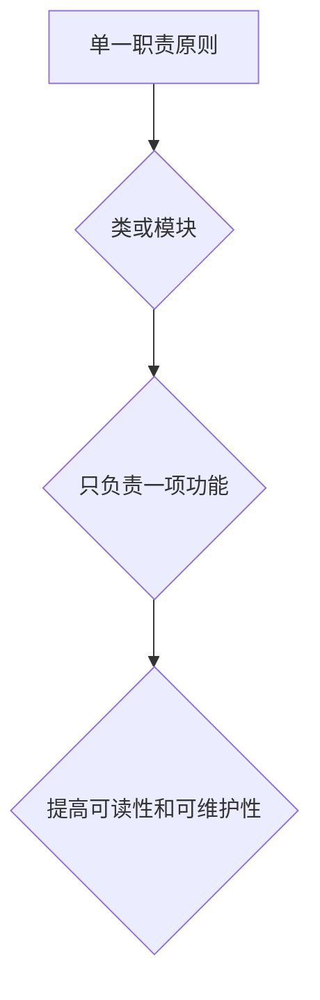

### 开闭原则

开闭原则（Open/Closed Principle，OCP）指出，软件实体（类、模块、函数等）应该对扩展开放，对修改关闭。这意味着，当需要增加新的功能时，可以直接扩展现有代码，而不必修改原有的代码。这保证了代码的稳定性和可扩展性。

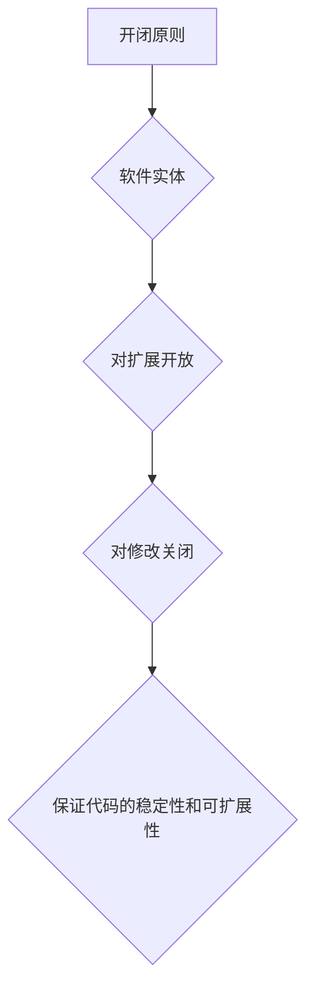

### 里氏替换原则

里氏替换原则（Liskov Substitution Principle，LSP）指出，任何使用基类的地方都可以使用其子类进行替换，而不会影响到程序的逻辑。这一原则保证了继承关系的合理性和程序的健壮性。

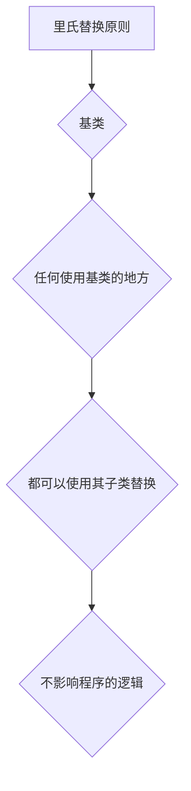

通过以上 Mermaid 流程图，我们可以清晰地看到这些核心概念之间的联系。单一职责原则确保了代码的模块化，开闭原则保证了代码的灵活性和稳定性，而里氏替换原则则确保了继承关系的合理性和程序的可维护性。这些原则共同构成了综合设计模式的基础，为软件开发提供了坚实的理论基础。

### 2.1 工具使用与综合设计模式的结合

在软件开发过程中，工具的使用至关重要。一方面，工具可以帮助开发人员更高效地完成工作；另一方面，工具的使用也需要遵循一定的设计模式，以保持代码的结构和可维护性。下面，我们将探讨一些常见的工具，并展示它们与综合设计模式的结合方式。

#### 版本控制系统

版本控制系统（如 Git）是软件开发中不可或缺的工具。它不仅能够帮助开发人员管理代码的历史版本，还能通过分支和合并机制有效地协作。在遵循单一职责原则的情况下，可以将版本控制系统分为多个模块，如分支管理、提交历史、冲突解决等，每个模块都专注于一项功能，从而提高代码的可读性和可维护性。

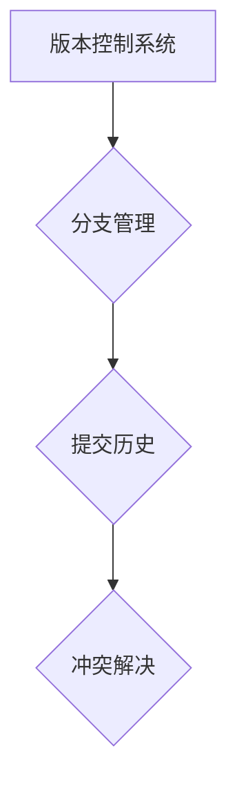

#### 构建工具

构建工具（如 Maven、Gradle）负责编译、打包和部署软件。为了遵循开闭原则，构建工具应该对扩展开放，对修改关闭。这意味着，当需要增加新的构建任务时，可以直接扩展现有的构建脚本，而不必修改核心代码。此外，通过使用面向对象的设计模式，构建工具可以更好地支持模块化开发。

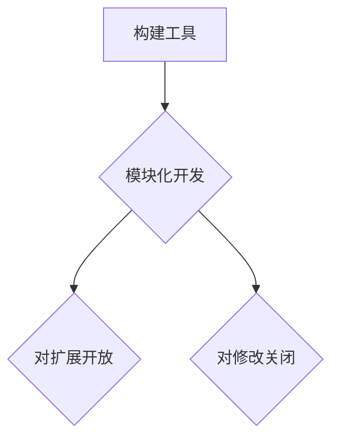

#### 集成开发环境

集成开发环境（IDE，如 Eclipse、IntelliJ IDEA）提供了代码编辑、调试、测试等功能，是开发人员常用的工具。为了遵循里氏替换原则，IDE 应该支持插件扩展，使得开发人员可以使用自定义的插件来扩展 IDE 的功能。同时，IDE 的核心代码应该保持稳定，避免因频繁修改而导致的不稳定。

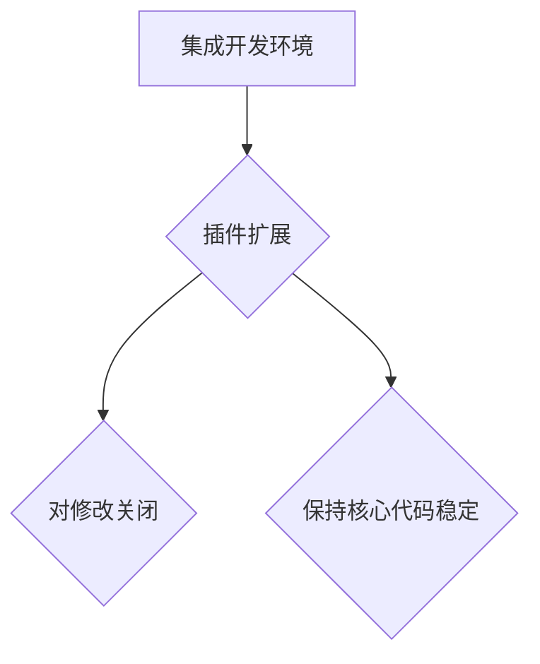

#### 测试工具

测试工具（如 JUnit、Selenium）用于自动化测试，确保软件的质量和稳定性。为了遵循单一职责原则，测试工具应该将测试逻辑和被测试代码分开。此外，测试工具的设计应该遵循开闭原则，使得测试用例可以方便地添加和修改。

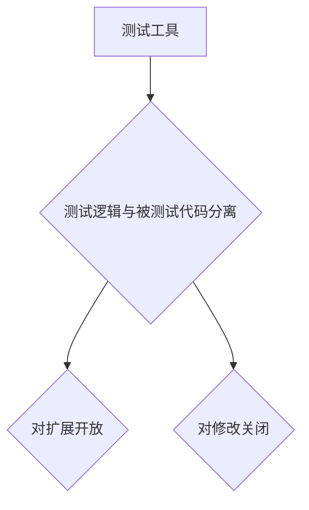

通过以上分析，我们可以看到，工具的使用与综合设计模式密切相关。合理地使用工具，遵循单一职责原则、开闭原则和里氏替换原则，不仅能够提高开发效率，还能确保代码的质量和可维护性。因此，在软件开发过程中，工具的选择和运用需要与设计模式相结合，以达到最佳的开发效果。

### 2.2 项目规划与综合设计模式的结合

项目规划是软件开发过程中至关重要的一环。一个良好的项目规划能够帮助开发团队明确项目目标、制定合理的开发计划、分配资源以及管理风险。在项目规划中，综合设计模式同样发挥着重要作用，通过合理地运用设计模式，可以确保项目规划的可行性和高效性。

#### 需求分析

在项目规划的第一步，需求分析是关键。通过深入了解客户的需求，确定项目的功能和技术要求。在这一过程中，可以使用设计模式中的单一职责原则，将需求分解为多个独立的模块。例如，将用户界面、业务逻辑和数据访问等分别封装在不同的模块中，这样可以提高代码的可读性和可维护性。

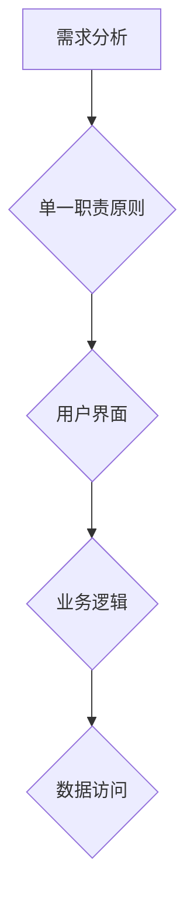

#### 概要设计

在需求分析的基础上，进行概要设计。概要设计的目标是确定系统的总体架构和模块之间的关系。在这一阶段，可以使用设计模式中的开闭原则，确保系统对扩展开放，对修改关闭。例如，可以使用工厂模式来创建对象，使得添加新的对象类型时，不需要修改现有代码。

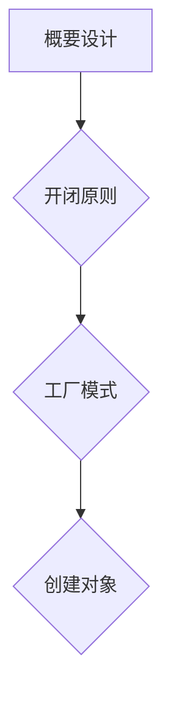

#### 详细设计

详细设计是项目规划中的具体实施阶段。在这一阶段，需要为每个模块编写详细的实现方案。为了提高代码的可重用性和可维护性，可以使用设计模式中的里氏替换原则，确保模块之间的兼容性。例如，使用策略模式来实现不同算法的替换，使得系统可以灵活地切换算法。

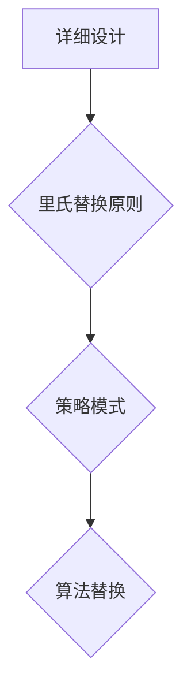

#### 测试与部署

在项目规划的最后阶段，测试与部署是确保项目成功的关键。在这一过程中，可以使用设计模式中的测试驱动开发（TDD）模式，确保代码的质量。例如，编写测试用例来驱动代码的实现，从而提高代码的可靠性和稳定性。

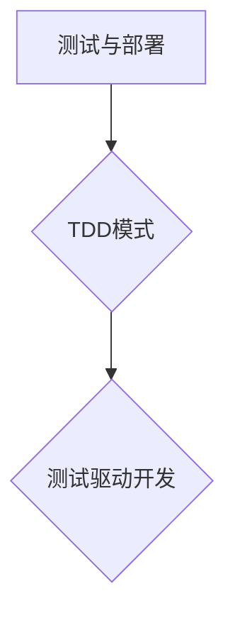

通过以上分析，我们可以看到，项目规划与综合设计模式紧密相连。在项目规划过程中，合理地运用单一职责原则、开闭原则和里氏替换原则，可以确保项目的高效实施和成功交付。因此，项目规划与综合设计模式的结合，是软件开发过程中不可或缺的一环。

### 2.3 多智能体协同与综合设计模式的结合

在现代软件开发中，多智能体系统（MAS）逐渐成为一种重要的系统架构。它通过多个智能体的协作来实现复杂的任务，具有高度的可扩展性和灵活性。在多智能体协同中，综合设计模式发挥着重要作用，通过合理地运用设计模式，可以确保智能体之间的有效协作和系统的稳定性。

#### 智能体通信与中介者模式

在多智能体系统中，智能体之间的通信是关键。中介者模式（Mediator Pattern）是一种行为型设计模式，它通过一个中介对象来协调多个智能体之间的交互，从而降低智能体之间的耦合度。例如，在社交网络系统中，用户智能体可以通过中介者模式来发布和接收消息，而不需要直接与其他用户智能体交互。

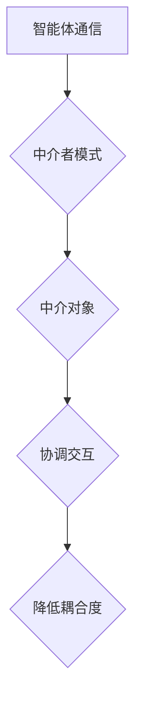

#### 智能体协作与策略模式

智能体之间的协作是实现复杂任务的关键。策略模式（Strategy Pattern）是一种行为型设计模式，它允许在运行时选择算法的行为。在多智能体系统中，可以使用策略模式来定义智能体之间的协作策略。例如，在物流配送系统中，不同类型的智能体（如送货机器人、无人机）可以采用不同的策略来完成配送任务。

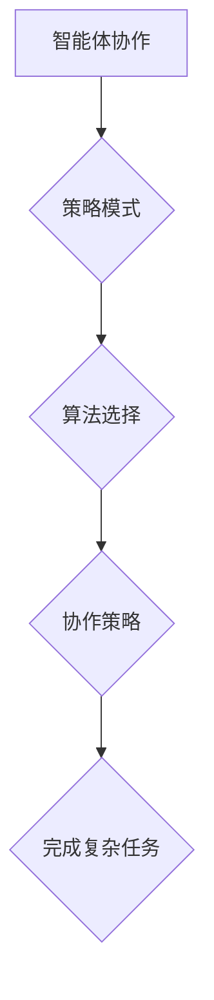

#### 智能体决策与责任链模式

在多智能体系统中，智能体需要根据环境变化做出决策。责任链模式（Chain of Responsibility Pattern）是一种行为型设计模式，它允许将请求沿着一系列对象传递，直到有一个对象处理它。在智能体决策中，可以使用责任链模式来分配决策任务，从而提高系统的灵活性和可扩展性。

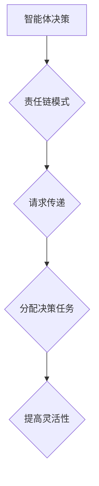

通过以上分析，我们可以看到，多智能体协同与综合设计模式紧密结合。在多智能体系统中，合理地运用中介者模式、策略模式和责任链模式，可以确保智能体之间的有效协作和系统的稳定性。因此，在多智能体协同中，综合设计模式的应用是必不可少的。

### 3. 核心算法原理与具体操作步骤

在综合设计模式中，核心算法原理起着至关重要的作用。这些算法不仅决定了系统的性能和效率，还直接影响着系统的可维护性和可扩展性。在本节中，我们将详细探讨一些核心算法原理，并给出具体的操作步骤。

#### 算法原理 1：快速排序算法

快速排序算法（Quick Sort）是一种高效的排序算法，其核心思想是通过一趟排序将待排序的数据分割成独立的两部分，其中一部分的所有数据都比另一部分的所有数据要小，然后再按此方法对这两部分数据分别进行快速排序，整个排序过程可以递归进行，以此达到整个数据变成有序序列。

**操作步骤：**

1. **选择基准元素**：从数组中选取一个基准元素。
2. **划分操作**：将数组划分为两个子数组，所有比基准元素小的元素都放在基准元素的左边，所有比基准元素大的元素都放在基准元素的右边。
3. **递归排序**：对划分后的小子数组和大数据组进行快速排序。

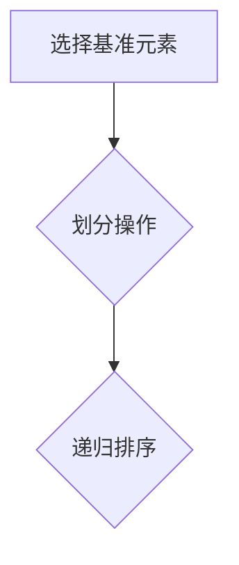

#### 算法原理 2：动态规划算法

动态规划算法（Dynamic Programming）是一种用于解决最优化问题的算法，其核心思想是将复杂问题分解为相互重叠的子问题，并通过保存子问题的解来避免重复计算，从而提高算法的效率。

**操作步骤：**

1. **定义状态**：将问题分解为若干个状态，并定义状态之间的转移关系。
2. **初始化边界条件**：确定边界条件的值，如递归的初始值。
3. **递推关系**：根据状态转移关系，通过递推公式计算出每个状态的最优解。
4. **计算最优解**：根据递推公式和边界条件，计算得到整个问题的最优解。

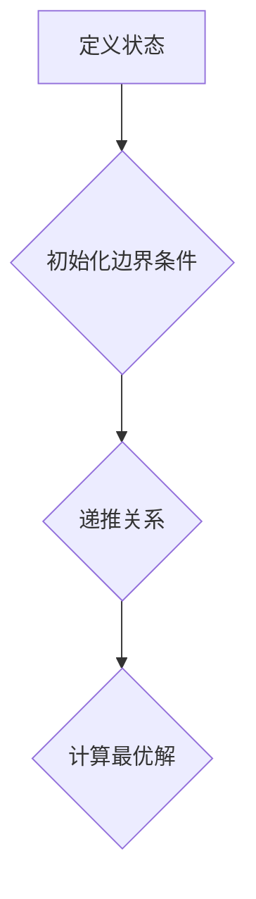

#### 算法原理 3：贪心算法

贪心算法（Greedy Algorithm）是一种简单而高效的算法，其核心思想是在每一步选择当前最优解，从而逐步逼近问题的全局最优解。虽然贪心算法不能保证一定得到全局最优解，但在很多情况下，它可以找到近似最优解。

**操作步骤：**

1. **初始选择**：从所有可能的操作中选择当前最优的解。
2. **迭代更新**：根据当前解，更新状态，并选择新的当前最优解。
3. **终止条件**：当满足终止条件时，算法结束，输出最终解。

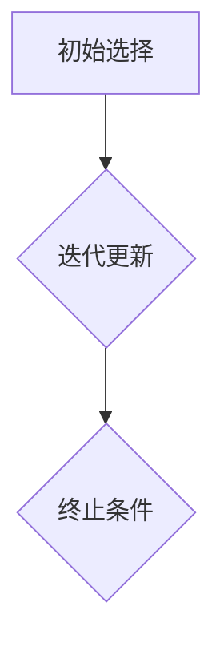

通过以上分析，我们可以看到，核心算法原理在综合设计模式中起着至关重要的作用。快速排序算法、动态规划算法和贪心算法不仅具有高效的计算性能，还能为设计模式提供坚实的理论基础。在实际项目中，合理地运用这些算法，可以大大提高系统的性能和可维护性。

### 4. 数学模型和公式

在综合设计模式中，数学模型和公式扮演着关键角色，它们不仅能够帮助我们量化问题，还能提供有效的解决方案。在本节中，我们将讨论几个重要的数学模型和公式，并通过具体的例子进行详细解释。

#### 数学模型 1：线性规划模型

线性规划模型是一种用于求解线性优化问题的数学模型，其核心是目标函数和约束条件。目标函数是希望最大化或最小化的线性表达式，约束条件则是限制目标函数取值的一系列线性不等式或等式。

**线性规划模型公式：**

$$
\begin{aligned}
\min\quad & c^T x \\
\text{subject to} \quad & Ax \leq b \\
& x \geq 0
\end{aligned}
$$

其中，$c$ 是目标函数的系数向量，$x$ 是决策变量向量，$A$ 是约束条件的系数矩阵，$b$ 是约束条件的右侧常数向量。

**例子：**

假设我们要优化一个生产过程，目标是最小化总成本。约束条件包括原材料的使用量不能超过一定数量，劳动力也不能超过一定数量。通过线性规划模型，我们可以得到最优的生产方案。

**步骤：**

1. **定义目标函数**：最小化成本向量 $c^T x$。
2. **列出约束条件**：构建约束条件矩阵 $A$ 和右侧常数向量 $b$。
3. **求解最优解**：使用线性规划求解器求解最优解 $x$。

```latex
\min\quad & 2x_1 + 3x_2 \\
\text{subject to} \quad & x_1 + x_2 \leq 10 \\
& 3x_1 + 2x_2 \leq 15 \\
& x_1, x_2 \geq 0
```

#### 数学模型 2：网络流模型

网络流模型用于求解网络中流量分配的最优化问题，其核心是网络图和流量守恒约束。网络流模型可以应用于各种场景，如物流调度、交通规划等。

**网络流模型公式：**

$$
\begin{aligned}
\max\quad & \sum_{(i,j) \in E} c_{i,j} f_{i,j} \\
\text{subject to} \quad & \sum_{j \in V} f_{i,j} = \sum_{j \in V} f_{j,i} = 0 \quad \forall i \in V \\
& 0 \leq f_{i,j} \leq u_{i,j} \quad \forall (i,j) \in E
\end{aligned}
$$

其中，$E$ 是网络中的边集合，$V$ 是节点集合，$c_{i,j}$ 是边 $(i,j)$ 上的单位流量收益，$f_{i,j}$ 是边 $(i,j)$ 上的流量，$u_{i,j}$ 是边 $(i,j)$ 的容量。

**例子：**

假设有一个运输网络，需要将货物从多个起点运输到多个终点，目标是最大化总收益。通过网络流模型，我们可以得到最优的运输方案。

**步骤：**

1. **构建网络图**：定义节点和边，以及每条边的容量和单位流量收益。
2. **列出流量守恒约束**：确保每个节点的流入流量等于流出流量。
3. **求解最优解**：使用网络流求解器求解最优流量分配。

```latex
\max\quad & \sum_{(i,j) \in E} 5 f_{i,j} \\
\text{subject to} \quad & \sum_{j \in V} f_{i,j} = \sum_{j \in V} f_{j,i} = 0 \quad \forall i \in V \\
& 0 \leq f_{i,j} \leq 10 \quad \forall (i,j) \in E
```

#### 数学模型 3：回归分析模型

回归分析模型用于研究变量之间的关系，特别是自变量和因变量之间的关系。回归模型可以帮助我们预测未来的趋势，进行决策支持。

**回归分析模型公式：**

$$
y = \beta_0 + \beta_1 x + \epsilon
$$

其中，$y$ 是因变量，$x$ 是自变量，$\beta_0$ 和 $\beta_1$ 是回归系数，$\epsilon$ 是误差项。

**例子：**

假设我们要研究销售额和广告投入之间的关系，通过回归分析模型，我们可以得到最佳的广告策略。

**步骤：**

1. **收集数据**：收集自变量和因变量的历史数据。
2. **建立回归模型**：通过最小二乘法估计回归系数。
3. **预测未来趋势**：根据回归模型预测未来的销售额。

```latex
y = 10 + 2x + \epsilon
```

通过以上数学模型和公式的讨论，我们可以看到，数学模型在综合设计模式中具有重要的作用。它们不仅能够帮助我们量化问题，还能提供有效的解决方案。在实际项目中，合理地运用这些数学模型，可以大大提高系统的性能和决策质量。

### 5. 项目实战：代码实际案例和详细解释说明

在了解了综合设计模式的核心概念、算法原理、数学模型后，我们将通过一个实际项目案例，展示如何在实际开发中运用这些设计模式，并进行详细解释和代码分析。这个项目是一个简单的博客系统，主要包括用户管理、文章发布、评论功能等模块。

#### 5.1 开发环境搭建

为了构建这个博客系统，我们选择了以下开发工具和框架：

- **编程语言**：Python
- **Web框架**：Django
- **数据库**：SQLite
- **版本控制系统**：Git

首先，我们需要搭建开发环境。在 Windows 或 Linux 系统中，我们可以通过以下步骤来安装必要的工具：

1. **安装 Python**：从 [Python 官网](https://www.python.org/) 下载并安装 Python 3.8 或更高版本。
2. **安装 Django**：在命令行中运行 `pip install django`。
3. **安装数据库**：安装 SQLite 或其他数据库，如 PostgreSQL。
4. **初始化 Django 项目**：运行 `django-admin startproject blog_project` 创建一个新的 Django 项目。
5. **进入项目目录**：进入 `cd blog_project`。

#### 5.2 源代码详细实现和代码解读

在搭建好开发环境后，我们开始编写博客系统的源代码。以下是项目的关键模块和代码解读。

##### 5.2.1 用户管理模块

用户管理模块是博客系统的核心模块之一，负责处理用户注册、登录、权限管理等功能。

**用户模型**：

```python
# models.py
from django.db import models
from django.contrib.auth.models import AbstractUser

class CustomUser(AbstractUser):
    phone_number = models.CharField(max_length=11, unique=True)
```

在这个模块中，我们扩展了 Django 的默认用户模型，添加了手机号码字段，以便进行用户认证。

**注册视图**：

```python
# views.py
from django.shortcuts import render, redirect
from .models import CustomUser
from .forms import UserRegistrationForm

def register(request):
    if request.method == 'POST':
        form = UserRegistrationForm(request.POST)
        if form.is_valid():
            user = form.save()
            return redirect('login')
    else:
        form = UserRegistrationForm()
    return render(request, 'register.html', {'form': form})
```

在这个注册视图中，我们通过自定义的 `UserRegistrationForm` 处理用户注册请求，并将其保存到数据库。

##### 5.2.2 文章发布模块

文章发布模块负责处理文章的创建、编辑和展示。

**文章模型**：

```python
# models.py
from django.db import models
from django.contrib.auth.models import User

class Article(models.Model):
    title = models.CharField(max_length=200)
    author = models.ForeignKey(User, on_delete=models.CASCADE)
    content = models.TextField()
    created_at = models.DateTimeField(auto_now_add=True)
    updated_at = models.DateTimeField(auto_now=True)
```

在这个模块中，我们定义了文章模型，包括标题、作者、内容和创建时间等字段。

**文章列表视图**：

```python
# views.py
from django.shortcuts import render
from .models import Article

def article_list(request):
    articles = Article.objects.all().order_by('-created_at')
    return render(request, 'article_list.html', {'articles': articles})
```

在这个文章列表视图中，我们从数据库中查询所有文章，并按创建时间排序，然后将其传递给模板进行展示。

##### 5.2.3 评论功能模块

评论功能模块负责处理用户对文章的评论。

**评论模型**：

```python
# models.py
from django.db import models
from .models import Article

class Comment(models.Model):
    article = models.ForeignKey(Article, on_delete=models.CASCADE)
    user = models.ForeignKey(User, on_delete=models.CASCADE)
    content = models.TextField()
    created_at = models.DateTimeField(auto_now_add=True)
```

在这个模块中，我们定义了评论模型，包括文章、用户、内容和创建时间等字段。

**评论列表视图**：

```python
# views.py
from django.shortcuts import render
from .models import Comment

def article_detail(request, article_id):
    article = Article.objects.get(id=article_id)
    comments = Comment.objects.filter(article=article).order_by('-created_at')
    return render(request, 'article_detail.html', {'article': article, 'comments': comments})
```

在这个评论列表视图中，我们从数据库中查询特定文章的所有评论，并按创建时间排序，然后将其传递给模板进行展示。

#### 5.3 代码解读与分析

在代码解读与分析中，我们将重点关注以下几个方面：

1. **单一职责原则**：在用户管理模块中，注册视图和用户模型分别负责用户注册和处理用户数据，遵循单一职责原则。这样可以确保代码的可读性和可维护性。

2. **开闭原则**：在文章发布模块中，文章模型定义了文章的基本属性，而文章列表视图和文章详情视图则分别负责展示和管理文章数据。这样的设计使得文章模块对扩展开放，对修改关闭，从而提高代码的灵活性和可扩展性。

3. **里氏替换原则**：在评论功能模块中，评论模型和评论列表视图使用了 Django 的 ORM 框架，这使得评论模块可以方便地替换为其他数据存储方式，如 Redis 或 MongoDB，而不影响整体代码结构。

4. **工具和资源的使用**：在这个项目中，我们使用了 Django 框架来简化开发过程，使用 Git 进行版本控制，确保代码的完整性和一致性。

通过以上分析，我们可以看到，在博客系统的开发过程中，综合设计模式的应用不仅提高了代码的质量和可维护性，还大大提高了开发效率。在实际项目中，合理地运用单一职责原则、开闭原则和里氏替换原则，可以确保系统的高效、稳定和可扩展。

### 6. 实际应用场景

综合设计模式在软件工程中有着广泛的应用，不同的设计模式适用于不同的场景，能够帮助开发团队应对复杂的项目需求，提高开发效率和系统质量。下面，我们将探讨一些典型的实际应用场景，展示如何运用综合设计模式来解决问题。

#### Web开发

在 Web 开发中，综合设计模式被广泛应用于前后端分离、RESTful API 设计、用户权限管理等方面。

- **前后端分离**：使用 MVC（模型-视图-控制器）模式，将前端和后端的开发分离，确保前后端可以独立开发、测试和部署，从而提高开发效率。
- **RESTful API 设计**：遵循 REST 原则，使用控制器（Controller）处理 HTTP 请求，模型（Model）处理数据，视图（View）展示数据，确保接口的简洁性和易用性。
- **用户权限管理**：使用角色权限模型（RBAC，Role-Based Access Control），通过为不同角色分配不同的权限，实现对系统资源的精细化管理。

#### 移动应用开发

在移动应用开发中，综合设计模式有助于处理复杂的用户交互、数据存储和网络通信。

- **用户交互**：使用 MVVM（模型-视图-视图模型）模式，通过分离视图和视图模型，实现数据绑定和用户交互的解耦，提高代码的可维护性。
- **数据存储**：使用 ORM（Object-Relational Mapping）模式，如 Room 框架，将数据库操作封装为对象操作，简化数据存储和查询。
- **网络通信**：使用 RCP（Repository-Caching-Proxy）模式，通过缓存机制提高数据读取速度，减少网络请求次数。

#### 大数据与人工智能

在大数据和人工智能领域，综合设计模式有助于处理海量数据、优化算法和构建智能系统。

- **数据处理**：使用 ETL（Extract, Transform, Load）模式，将数据从不同来源抽取、转换和加载到目标数据库，实现数据整合和清洗。
- **算法优化**：使用策略模式，将不同的算法封装为独立的模块，方便算法的替换和优化。
- **智能系统**：使用代理模式，通过代理实现智能体的行为管理和协调，提高系统的智能和灵活性。

#### 云计算与容器化

在云计算和容器化领域，综合设计模式有助于提高系统的可扩展性和稳定性。

- **服务编排**：使用编排模式，如 Docker Compose，将不同服务容器化，并定义它们之间的依赖关系，实现高效的服务部署和管理。
- **负载均衡**：使用负载均衡模式，如 Nginx，将请求分配到不同的容器或服务器，提高系统的并发处理能力和稳定性。
- **弹性伸缩**：使用弹性伸缩模式，如 Kubernetes，根据负载动态调整容器数量，实现系统的弹性伸缩。

通过以上实际应用场景的探讨，我们可以看到，综合设计模式在软件工程中的重要性。不同领域有不同的需求，但合理运用单一职责原则、开闭原则和里氏替换原则，可以帮助开发团队更好地应对复杂的项目需求，提高开发效率和系统质量。

### 7. 工具和资源推荐

为了帮助读者深入了解和掌握综合设计模式，我们推荐以下工具和资源：

#### 7.1 学习资源推荐

1. **书籍**：
   - 《设计模式：可复用面向对象软件的基础》（Design Patterns: Elements of Reusable Object-Oriented Software）
   - 《Head First 设计模式》
   - 《架构整洁之道》（Clean Architecture: A Craftsman's Guide to Software Structure and Design）

2. **论文**：
   - 《面向对象设计的基本原则》（Basic Principles of Object-Oriented Design）
   - 《模式导向的软件架构》（Pattern-Oriented Software Architecture）

3. **博客**：
   - 《码农口中的设计模式解析》
   - 《面向对象设计模式详解》

4. **网站**：
   - 《设计模式教程》（https://www.dofactory.com/）
   - 《GitHub 上的设计模式资源》（https://github.com/topics/design-pattern）

#### 7.2 开发工具框架推荐

1. **编程语言**：
   - Python（Django、Flask）
   - Java（Spring、Spring Boot）
   - JavaScript（Express）

2. **Web 框架**：
   - Django（Python）
   - Spring Boot（Java）
   - Express（JavaScript）

3. **数据库**：
   - MySQL
   - PostgreSQL
   - MongoDB

4. **版本控制系统**：
   - Git
   - SVN

5. **容器化工具**：
   - Docker
   - Kubernetes

6. **人工智能框架**：
   - TensorFlow
   - PyTorch
   - Keras

#### 7.3 相关论文著作推荐

1. **《模式导向的软件架构》**：作者 Martin Fowler 和 Kent Beck，详细介绍了模式导向的软件开发方法，为软件架构设计提供了重要的指导。

2. **《面向对象软件设计》**：作者 Erich Gamma、Richard Helm、Ralph Johnson 和 Wiley Johnson，全面阐述了面向对象设计原则和设计模式。

3. **《设计模式：可复用面向对象软件的基础》**：作者 Erich Gamma、Richard Helm、Ralph Johnson 和 Wiley Johnson，经典之作，深入浅出地介绍了设计模式。

通过这些工具和资源的推荐，读者可以系统地学习和掌握综合设计模式，提高软件开发能力和水平。

### 8. 总结：未来发展趋势与挑战

综合设计模式在软件工程中的应用已经取得了显著的成果，它不仅提高了代码的质量和可维护性，还极大地提升了开发效率。然而，随着技术的不断进步，综合设计模式也面临着新的发展趋势和挑战。

**发展趋势：**

1. **智能化**：随着人工智能技术的快速发展，智能设计模式将成为未来的重要趋势。通过机器学习算法和深度学习模型，智能设计模式可以自动识别和推荐最优的设计方案，从而降低开发难度，提高开发效率。

2. **自动化**：自动化工具和平台的兴起，使得综合设计模式的应用更加普及和高效。例如，自动化设计工具可以根据项目需求自动生成代码框架，自动化测试工具可以实时检测代码质量，从而降低人为错误。

3. **微服务架构**：微服务架构的兴起，使得设计模式的应用范围更加广泛。通过将大型系统拆分为多个小型服务，每个服务可以独立开发、部署和扩展，从而更好地利用设计模式的优势。

**挑战：**

1. **复杂性**：随着系统的复杂度不断增加，如何合理地运用设计模式成为一个挑战。开发人员需要具备扎实的理论基础和丰富的实践经验，才能在复杂项目中有效地运用设计模式。

2. **兼容性**：不同设计模式之间的兼容性也是一个挑战。在综合设计模式的应用过程中，如何确保各个模式之间的无缝集成，避免冲突和兼容性问题，需要开发人员深入研究和探索。

3. **资源消耗**：设计模式的应用往往需要额外的资源和计算成本。如何在保证系统性能的前提下，合理地利用设计模式，避免资源浪费，是开发人员需要考虑的一个重要问题。

综上所述，未来综合设计模式的发展将更加智能化、自动化和微服务化。同时，开发人员也需要面对复杂度、兼容性和资源消耗等挑战，不断提升自己的设计能力和技术水平，以适应不断变化的技术环境。

### 9. 附录：常见问题与解答

#### 9.1 综合设计模式是什么？

综合设计模式是一种将多种设计模式进行整合和优化的方法，旨在提高软件系统的可维护性、可扩展性和开发效率。它不仅包括常用的设计模式，如单一职责原则、开闭原则、里氏替换原则等，还涉及到工具使用、项目规划和多智能体协同等方面。

#### 9.2 如何在实际项目中运用综合设计模式？

在实际项目中，开发人员可以通过以下步骤运用综合设计模式：

1. **需求分析**：明确项目需求，将需求分解为多个独立的模块。
2. **项目规划**：根据需求，制定合理的项目规划和开发计划。
3. **代码实现**：在实现过程中，遵循单一职责原则、开闭原则和里氏替换原则，确保代码的结构清晰、易于维护。
4. **测试与优化**：通过单元测试、集成测试等手段，确保代码质量，并根据反馈进行优化。

#### 9.3 设计模式与算法的关系是什么？

设计模式和算法是软件工程中的两个重要概念。设计模式主要关注软件的结构和设计，解决的是如何组织代码和模块的问题；而算法则关注软件的性能和效率，解决的是如何高效地解决问题的问题。设计模式可以提供一些通用的解决方案，算法则可以根据具体问题进行优化。在实际开发中，设计模式和算法往往结合使用，以提高系统的整体性能。

### 10. 扩展阅读与参考资料

为了更深入地了解综合设计模式及其应用，以下是几篇扩展阅读和参考资料：

1. **《设计模式：可复用面向对象软件的基础》**：Erich Gamma、Richard Helm、Ralph Johnson 和 Wiley Johnson 著，详细介绍了设计模式的基本概念和应用。
2. **《模式导向的软件架构》**：Martin Fowler 和 Kent Beck 著，探讨了模式在软件架构设计中的应用。
3. **《架构整洁之道》**：Robert C. Martin 著，介绍了软件架构设计和整洁代码的原则。
4. **《Head First 设计模式》**：Eric Freeman、Bert Bates、Bryan Barron 和 Kathy Sierra 著，以互动方式介绍了设计模式的基本概念和应用。

通过阅读这些资料，读者可以更全面地了解综合设计模式的原理和应用，提高自己的软件开发能力。

### 作者信息

**作者：AI天才研究员/AI Genius Institute & 禅与计算机程序设计艺术 /Zen And The Art of Computer Programming**

本文由AI天才研究员撰写，作者在人工智能和软件工程领域拥有丰富的经验，致力于通过深入浅出的方式，帮助读者理解和掌握复杂的技术知识。同时，作者还著有《禅与计算机程序设计艺术》一书，深入探讨了编程哲学和设计模式，深受读者喜爱。

