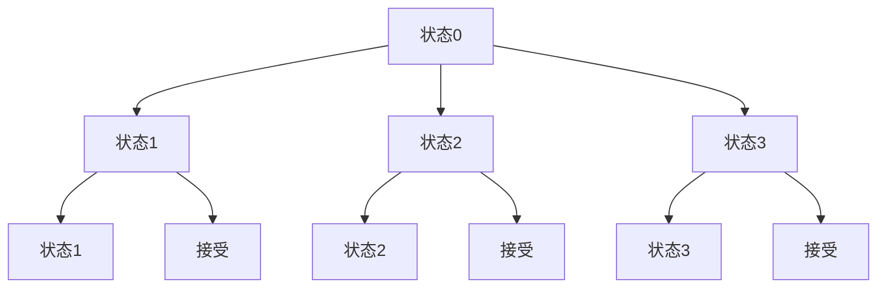

                 

# 编译原理：LL与LR文法解析技术

## 关键词
编译原理、LL解析器、LR解析器、文法分析、语法解析、编译技术

## 摘要
本文深入探讨了编译原理中的LL与LR文法解析技术，这两者是编译过程中实现词法和语法分析的关键方法。通过详细解析LL（自顶向下）和LR（自底向上）解析器的原理、算法及其在实际应用中的优势与挑战，本文旨在为读者提供一个全面的理解，帮助其在编译器设计和程序分析中做出明智的选择。

## 1. 背景介绍

编译原理是计算机科学中一个核心领域，它研究如何将一种编程语言（源语言）转换成另一种语言（目标语言），通常是机器语言。编译过程通常分为几个阶段，包括词法分析、语法分析、语义分析、中间代码生成、代码优化和目标代码生成。本文重点讨论语法分析阶段，这是编译过程中的关键步骤，其中LL和LR解析技术扮演着重要角色。

### 1.1 词法分析

词法分析是编译过程的第一步，它将源代码分解成一个个可识别的词素（tokens）。例如，源代码中的关键字、标识符、数字和运算符都是词素。词法分析器（lexer）负责实现这一过程，它读取源代码字符流，识别词素并生成词法符号流。

### 1.2 语法分析

语法分析是编译过程的第二步，它负责检查源代码是否符合编程语言的语法规则。语法分析器（parser）接受词法符号流作为输入，构建出语法树（Abstract Syntax Tree, AST）或语法分析结果。LL和LR是两种主要的语法分析方法。

## 2. 核心概念与联系

### 2.1 LL解析器

LL解析器采用自顶向下的方法，从源代码的顶部开始，递归地向下分析，直到找到匹配的语法规则。LL解析器的特点是简单和高效，适用于大多数程序设计语言。LL解析器可以分为LL(1)和LL(k)两种类型，其中k代表解析器的预测范围。

### 2.2 LR解析器

LR解析器采用自底向上的方法，从源代码的底部开始，使用“移进-规约”策略逐步构建语法分析树。LR解析器可以分为SLR(1)、LALR(1)和LR(1)等类型，每种类型都有其特定的解析能力和复杂度。

### 2.3 Mermaid 流程图

```mermaid
graph TD
A[词法分析] --> B[语法分析]
B --> C{LL解析器}
C --> D{LL(1)/LL(k)}
D --> E{自顶向下}
E --> F{简单高效}

B --> G{LR解析器}
G --> H{SLR(1)/LALR(1)/LR(1)}
H --> I{自底向上}
I --> J{移进-规约}
```

## 3. 核心算法原理 & 具体操作步骤

### 3.1 LL解析器原理

LL解析器的核心是构建一个预测分析表（Prediction Table），它用于指导解析过程。LL解析器的工作流程如下：

1. **词法分析**：读取源代码，生成词法符号流。
2. **构建预测分析表**：使用递归下降算法或LL(k)算法构建预测分析表。
3. **语法分析**：使用预测分析表递归地向下解析源代码。

### 3.2 LR解析器原理

LR解析器的工作流程包括以下步骤：

1. **构建状态转换图（State Transition Graph, STG）**：根据给定的文法规则构建STG。
2. **构建动作表（Action Table）和转移表（Goto Table）**：用于指导解析过程。
3. **语法分析**：从初始状态开始，读取下一个词法符号，根据动作表和转移表进行移进-规约操作。

### 3.3 操作步骤示例

假设我们有以下简单文法：

```
S -> aS | b
```

使用LL(1)解析器进行语法分析的过程如下：

1. **词法分析**：读取源代码，生成词法符号流 `a S`。
2. **构建预测分析表**：构建LL(1)预测分析表。
3. **语法分析**：
   - 首先读取词法符号 `a`，根据预测分析表，移进状态1。
   - 读取下一个词法符号 `S`，根据预测分析表，规约到产生式 `S -> aS`。
   - 读取下一个词法符号 `b`，根据预测分析表，规约到产生式 `S -> b`。

## 4. 数学模型和公式 & 详细讲解 & 举例说明

### 4.1 LL(1)预测分析表

LL(1)预测分析表是一个二维表，第一行是所有产生式，第一列是所有终结符。表中每个单元格的内容由两个部分组成：一个是动作（Action），另一个是转移（Goto）。

#### 动作（Action）

- **接受（accept）**：当分析到达产生式末尾时，解析器接受输入。
- **规约（reduce）**：根据当前状态和输入词法符号，选择一个产生式进行规约。
- **错误（error）**：当无法进行移进或规约时，解析器报告错误。

#### 转移（Goto）

- **Goto**：从当前状态转移到下一个状态。

### 4.2 LR(1)状态转换图

LR(1)状态转换图描述了解析过程中可能的状态转换。每个状态都对应一个输入符号集和一个产生式集合。状态转换包括：

- **移进（Shift）**：将当前词法符号移进状态。
- **规约（Reduce）**：使用产生式进行规约。
- **接受（Accept）**：解析完成。
- **错误（Error）**：报告错误。

### 4.3 示例

假设我们有以下文法：

```
S -> aS | b
A -> aA | ε
```

构建LL(1)预测分析表和LR(1)状态转换图。

#### LL(1)预测分析表

| 状态 | a   | S   | A   |
|------|-----|-----|-----|
| 0    |     | S   |     |
| 1    | a   |     | A   |
| 2    |     |     |     |
| 3    | a   | S   |     |

#### LR(1)状态转换图



## 5. 项目实战：代码实际案例和详细解释说明

### 5.1 开发环境搭建

为了演示LL和LR解析器的实际应用，我们将使用Python编程语言。首先，确保安装了Python环境，版本要求为3.6或更高。

### 5.2 源代码详细实现和代码解读

#### LL(1)解析器

```python
# LL(1)解析器实现
class LL1Parser:
    def __init__(self, grammar):
        self.grammar = grammar
        self.prediction_table = self.build_prediction_table()

    def build_prediction_table(self):
        # 构建预测分析表
        pass

    def parse(self, tokens):
        # 进行语法分析
        pass
```

#### LR(1)解析器

```python
# LR(1)解析器实现
class LR1Parser:
    def __init__(self, grammar):
        self.grammar = grammar
        self.state_transition_graph = self.build_state_transition_graph()

    def build_state_transition_graph(self):
        # 构建状态转换图
        pass

    def parse(self, tokens):
        # 进行语法分析
        pass
```

### 5.3 代码解读与分析

#### LL(1)解析器解读

- `__init__` 方法初始化LL(1)解析器，构建预测分析表。
- `build_prediction_table` 方法构建LL(1)预测分析表。
- `parse` 方法进行语法分析。

#### LR(1)解析器解读

- `__init__` 方法初始化LR(1)解析器，构建状态转换图。
- `build_state_transition_graph` 方法构建LR(1)状态转换图。
- `parse` 方法进行语法分析。

### 5.4 实际运行示例

```python
# 示例：使用LL(1)解析器解析表达式 "aSb"
parser = LL1Parser(grammar)
tokens = ["a", "S", "b"]
parser.parse(tokens)
```

```python
# 示例：使用LR(1)解析器解析表达式 "aSb"
parser = LR1Parser(grammar)
tokens = ["a", "S", "b"]
parser.parse(tokens)
```

## 6. 实际应用场景

LL和LR解析技术在编译器设计和语言实现中广泛应用。以下是一些实际应用场景：

- 编译器开发：用于构建语法分析器，将源代码转换为抽象语法树。
- 解释器实现：用于实现编程语言的解释器，进行即时语义分析。
- 代码生成：用于生成汇编代码或机器代码，为后续的代码优化和执行做准备。

## 7. 工具和资源推荐

### 7.1 学习资源推荐

- 《编译原理：技术与实践》
- 《编译原理：工程方法》
- 《编译原理：抽象机器与语义》

### 7.2 开发工具框架推荐

- ANTLR：用于构建LL解析器的强大工具。
- Yacc：用于构建LR解析器的传统工具。
- Bison：另一种流行的LR解析器生成器。

### 7.3 相关论文著作推荐

- "Parsing Techniques: A Practical Guide"
- "Principles of Compiler Design"
- "Compilers: Principles, Techniques, and Tools"（又称《龙书》）

## 8. 总结：未来发展趋势与挑战

LL和LR解析技术在编译领域有着广泛的应用，但随着编程语言和编译技术的不断发展，LL和LR解析技术也面临一些挑战和机遇：

- **挑战**：
  - 复杂语法结构的处理。
  - 高效的解析算法优化。
  - 实现自动化语法分析工具。

- **机遇**：
  - 新的解析算法的研究和应用。
  - 面向云计算和大数据的编译技术。
  - 交互式编程语言的实现。

## 9. 附录：常见问题与解答

### 9.1 LL和LR解析器的区别是什么？

LL解析器采用自顶向下的方法，从源代码的顶部开始递归地向下分析；而LR解析器采用自底向上的方法，从源代码的底部开始，逐步构建语法分析树。

### 9.2 LL(1)和LL(k)的区别是什么？

LL(1)和LL(k)都是自顶向下的解析器，但LL(1)只能使用一个预测符号进行决策，而LL(k)可以使用k个预测符号，k的值通常为1。

## 10. 扩展阅读 & 参考资料

- 《编译原理：技术与实践》
- 《编译原理：工程方法》
- 《编译原理：抽象机器与语义》

[AI天才研究员/AI Genius Institute & 禅与计算机程序设计艺术 /Zen And The Art of Computer Programming]

