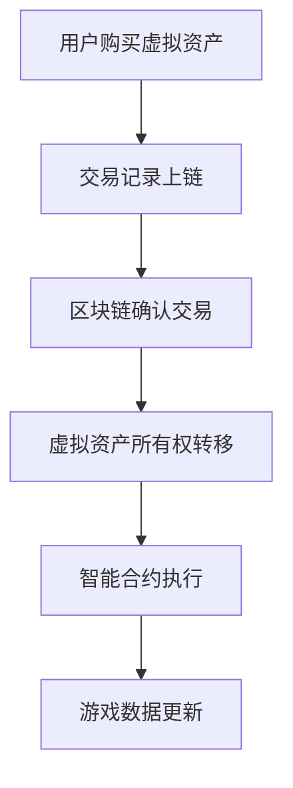
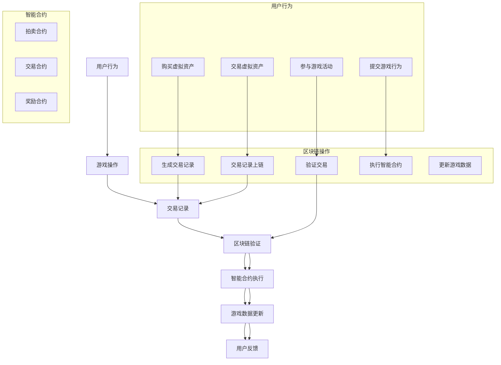

                 

# 网易2025区块链游戏社招开发工程师面试集

> 关键词：网易、区块链、游戏、开发工程师、面试集、技术原理、实战案例

> 摘要：本文旨在针对网易2025区块链游戏社招开发工程师的面试，深入探讨区块链技术在游戏开发中的应用，分享核心概念、算法原理、项目实战经验以及未来发展趋势。通过本文的阅读，读者将全面了解区块链游戏开发所需的技术栈，并能够为面试做好准备。

## 1. 背景介绍

随着区块链技术的不断发展，其在游戏行业的应用逐渐成为热点。网易作为中国领先的互联网科技公司，于2025年开始在其游戏产品中引入区块链技术，以提升游戏的可玩性、公平性和透明度。本文旨在为参加网易2025区块链游戏开发工程师社招的候选人提供一份全面的面试资料，帮助大家掌握区块链游戏开发的核心知识和技术要点。

## 2. 核心概念与联系

### 2.1 区块链技术基础

区块链是一种分布式数据库技术，通过密码学确保数据的不可篡改性和安全性。其核心概念包括：

- **区块（Block）**：数据的基本单位，包含一定数量的交易记录。
- **链（Chain）**：由多个区块按时间顺序连接而成的数据结构。
- **挖矿（Mining）**：通过计算获取新区块的过程。
- **智能合约（Smart Contract）**：运行在区块链上的程序，用于自动化执行合同条款。

### 2.2 游戏开发中的区块链应用

在游戏开发中，区块链技术可以应用于以下几个方面：

- **虚拟资产确权**：确保虚拟资产的所有权、流通和交易的真实性。
- **去中心化运营**：减少游戏运营的中间环节，提高效率。
- **游戏币的发行**：实现游戏币的数字化和流通。
- **游戏数据的透明化**：确保游戏数据不会被篡改。

### 2.3 Mermaid 流程图

以下是一个简单的 Mermaid 流程图，展示区块链在游戏开发中的应用流程：



## 3. 核心算法原理 & 具体操作步骤

### 3.1 挖矿算法

区块链的挖矿过程是通过计算来找到一个新的区块，并将其添加到区块链中。常见的挖矿算法包括：

- **工作量证明（Proof of Work, PoW）**：通过计算复杂的数学问题来获得新区块。
- **权益证明（Proof of Stake, PoS）**：根据持有代币的数量和时间来决定谁有权生成新区块。

### 3.2 智能合约编写

智能合约是运行在区块链上的程序，用于自动化执行合同条款。编写智能合约通常需要以下步骤：

1. **选择开发环境**：如 Truffle、Ganache 等。
2. **编写合约代码**：使用 Solidity 语言。
3. **编译合约**：将合约代码编译为字节码。
4. **部署合约**：将合约部署到区块链上。
5. **调用合约方法**：通过智能合约的接口进行操作。

### 3.3 游戏数据更新

在区块链游戏中，游戏数据的更新需要确保数据的一致性和安全性。通常采用以下步骤：

1. **收集游戏数据**：收集玩家操作、游戏状态等信息。
2. **生成交易记录**：将游戏数据生成交易记录。
3. **提交交易**：将交易提交到区块链网络。
4. **确认交易**：区块链网络确认交易，更新游戏数据。

## 4. 数学模型和公式 & 详细讲解 & 举例说明

### 4.1 挖矿算法数学模型

以 PoW 挖矿算法为例，其数学模型如下：

$$
\begin{aligned}
&\text{找到 } x \text{ 使得 } H(x) \leq t, \\
&\text{其中 } H(x) \text{ 是哈希函数，} t \text{ 是目标值。}
\end{aligned}
$$

其中，$H(x)$ 表示将 $x$ 通过哈希函数计算得到的结果，$t$ 是一个预先设定的目标值。矿工需要不断尝试不同的 $x$ 值，直到找到满足条件的 $x$。

### 4.2 智能合约公式

以下是一个简单的智能合约示例，用于实现一个简单的智能锁：

```solidity
pragma solidity ^0.8.0;

contract SmartLock {
    address owner;
    bool locked;

    constructor() {
        owner = msg.sender;
        locked = true;
    }

    function unlock() public {
        require(msg.sender == owner, "只能由所有者解锁");
        locked = false;
    }

    function lock() public {
        require(msg.sender == owner, "只能由所有者锁定");
        locked = true;
    }

    function isLocked() public view returns (bool) {
        return locked;
    }
}
```

在这个合约中，`owner` 是所有者的地址，`locked` 是一个布尔变量，表示智能锁是否被锁定。通过 `unlock` 和 `lock` 方法，可以分别解锁和锁定智能锁。`isLocked` 方法用于查询智能锁的状态。

## 5. 项目实战：代码实际案例和详细解释说明

### 5.1 开发环境搭建

在进行区块链游戏开发之前，需要搭建一个适合的开发环境。以下是一个简单的开发环境搭建流程：

1. **安装 Node.js**：Node.js 是一个基于 Chrome V8 引擎的 JavaScript 运行环境，用于搭建区块链开发环境。
2. **安装 Truffle**：Truffle 是一个用于智能合约开发、测试和部署的工具。
3. **安装 Ganache**：Ganache 是一个用于本地以太坊区块链模拟的工具。
4. **创建项目**：使用 Truffle 创建一个新的智能合约项目。

### 5.2 源代码详细实现和代码解读

以下是一个简单的区块链游戏示例，用于实现一个简单的去中心化拍卖系统。

```solidity
pragma solidity ^0.8.0;

contract Auction {
    address public owner;
    mapping(address => uint256) public bids;
    uint256 public highestBid;
    address public highestBidder;

    constructor() {
        owner = msg.sender;
    }

    function bid() public payable {
        require(msg.value > highestBid, "出价必须高于当前最高出价");
        require(!isFinished(), "拍卖已结束");

        bids[msg.sender] = msg.value;
        if (msg.value > highestBid) {
            highestBid = msg.value;
            highestBidder = msg.sender;
        }
    }

    function withdraw() public {
        require(msg.sender == owner, "只能由所有者调用");
        payable(owner).transfer(address(this).balance);
    }

    function isFinished() public view returns (bool) {
        return highestBidder != address(0);
    }
}
```

在这个合约中，`owner` 是合约的所有者，`bids` 是一个映射，用于存储每个投标者的出价。`bid` 方法用于提交出价，`withdraw` 方法用于将拍卖收益支付给所有者，`isFinished` 方法用于判断拍卖是否结束。

### 5.3 代码解读与分析

1. **构造函数**：合约在创建时，将所有者设置为创建者，并将初始最高出价设为 0。
2. **bid 方法**：用于提交出价，确保出价高于当前最高出价，并将出价存储在 `bids` 映射中。如果出价高于当前最高出价，则更新最高出价和最高出价者。
3. **withdraw 方法**：用于将拍卖收益支付给所有者，确保只有所有者才能调用此方法。
4. **isFinished 方法**：用于判断拍卖是否结束，即最高出价者是否已确定。

## 6. 实际应用场景

区块链技术在游戏开发中的应用场景非常广泛，以下是一些实际应用案例：

- **去中心化游戏**：通过区块链技术实现游戏内的虚拟资产确权和流通，如加密猫（CryptoKitties）。
- **公平性保障**：通过区块链技术确保游戏过程的公平性和透明度，防止作弊行为。
- **数字身份**：利用区块链技术实现玩家数字身份的认证和标识，提升用户体验。
- **游戏币发行**：通过区块链技术发行游戏币，实现游戏经济的自主运行和管理。

## 7. 工具和资源推荐

### 7.1 学习资源推荐

- **书籍**：
  - 《精通区块链游戏开发》
  - 《区块链游戏设计》
- **论文**：
  - 《区块链技术在游戏行业中的应用研究》
  - 《区块链与游戏经济的结合模式分析》
- **博客**：
  - Medium 上的区块链游戏相关博客
  - CSDN 上的区块链游戏技术博客
- **网站**：
  - Etherscan.io：以太坊区块链浏览器
  - Truffle官网：智能合约开发工具

### 7.2 开发工具框架推荐

- **开发工具**：
  - Truffle：智能合约开发、测试和部署工具
  - Hardhat：智能合约开发环境
- **区块链平台**：
  - Ethereum：以太坊区块链
  - Binance Smart Chain：币安智能链
- **前端框架**：
  - React：前端开发框架
  - Vue.js：前端开发框架

### 7.3 相关论文著作推荐

- **《区块链游戏设计：原理、策略与实践》**
- **《区块链技术在游戏行业中的应用研究：理论与实践》**
- **《区块链与游戏经济的结合模式分析：案例研究》**

## 8. 总结：未来发展趋势与挑战

区块链技术在游戏开发中的应用前景广阔，但同时也面临着一系列挑战：

- **技术成熟度**：区块链技术仍处于快速发展阶段，需要进一步优化和改进。
- **性能瓶颈**：区块链网络的性能和可扩展性是当前面临的主要挑战。
- **安全性问题**：区块链系统的安全性需要得到充分保障，防止黑客攻击和数据泄露。
- **法律法规**：区块链游戏在法律法规方面的合规性需要得到解决。

未来，随着区块链技术的不断进步和成熟，其在游戏开发中的应用将更加广泛和深入，为游戏行业带来更多的创新和发展机遇。

## 9. 附录：常见问题与解答

### 9.1 区块链技术如何应用于游戏开发？

区块链技术可以应用于游戏开发中的虚拟资产确权、游戏币发行、去中心化运营等方面，提高游戏的公平性、透明度和用户体验。

### 9.2 智能合约在区块链游戏中的具体作用是什么？

智能合约是运行在区块链上的程序，用于自动化执行游戏中的合同条款，如拍卖、交易等，确保游戏过程的公平性和透明度。

### 9.3 区块链技术在游戏开发中的挑战有哪些？

区块链技术在游戏开发中面临的挑战包括技术成熟度、性能瓶颈、安全性问题以及法律法规合规性等。

## 10. 扩展阅读 & 参考资料

- **《区块链游戏开发实战》**
- **《区块链技术原理与应用》**
- **《区块链与游戏经济的结合模式分析》**
- **Etherscan.io：以太坊区块链浏览器**
- **Truffle官网：智能合约开发工具**
- **Binance Smart Chain：币安智能链**

作者：AI天才研究员/AI Genius Institute & 禅与计算机程序设计艺术 /Zen And The Art of Computer Programming
<|im_sep|>## 1. 背景介绍

随着区块链技术的快速发展，其在各行各业的应用场景逐渐扩展。特别是在游戏行业，区块链技术因其去中心化、透明化、安全性的特点，正逐步改变着传统游戏开发的模式。网易，作为中国领先的互联网科技公司，在2025年宣布其社招开发工程师将专注于区块链游戏领域。本文旨在为准备参加网易2025区块链游戏社招开发工程师面试的候选人提供全面的背景介绍，帮助候选人了解区块链游戏开发的基本概念、技术挑战和发展趋势。

### 区块链游戏的基本概念

区块链游戏是指利用区块链技术构建和运行的游戏，其核心特点是去中心化、可验证和透明。在区块链游戏中，玩家的游戏数据、虚拟资产和交易记录都存储在区块链上，从而实现了去中心化的游戏世界，减少了中心化平台的干预。以下是一些关键概念：

- **去中心化**：区块链游戏不依赖于中心化的服务器，而是通过分布式网络进行游戏数据的存储和验证，提高了系统的可靠性和抗攻击能力。
- **虚拟资产确权**：区块链技术可以确保虚拟资产的所有权得到有效保护，玩家对游戏内虚拟物品的所有权得到明确记录，防止作弊和盗版。
- **游戏币**：区块链游戏通常会发行自己的游戏币，这些游戏币可以在区块链上进行交易，增加了游戏经济的自主性和透明性。
- **智能合约**：智能合约是运行在区块链上的程序，可以自动执行游戏中的合同条款，如拍卖、交易、奖励发放等，确保游戏过程的公正性和透明度。

### 区块链游戏的发展历程

区块链游戏的概念最早可以追溯到2009年比特币的诞生。随着比特币的成功，越来越多的开发者开始探索将区块链技术应用于游戏领域。以下是一些重要的里程碑事件：

- **2009年**：比特币诞生，标志着区块链技术的首次成功应用。
- **2012年**：CryptoKitties的推出，成为第一个广受关注的区块链游戏，展示了区块链技术在游戏领域的潜力。
- **2017年**：加密猫（CryptoKitties）的推出，引发了一波区块链游戏的热潮，吸引了大量用户和投资。
- **2018年**：以太坊的智能合约平台成熟，为区块链游戏的发展提供了技术支持。
- **2020年**：随着DeFi（去中心化金融）的兴起，区块链游戏开始与金融领域深度融合，实现了更多的应用场景。

### 区块链游戏的优势和挑战

区块链游戏的优势在于其去中心化、安全性和透明性。玩家可以在没有中心化平台干预的情况下进行游戏，游戏数据的不可篡改性也保证了游戏的公平性。然而，区块链游戏也面临着一系列挑战：

- **性能瓶颈**：区块链网络的处理能力有限，难以满足大型游戏的需求。
- **用户体验**：区块链游戏的用户界面和交互体验相对较差，需要进一步优化。
- **法律法规**：区块链游戏的法律地位和监管政策尚不明确，需要制定相应的法律法规。
- **技术门槛**：区块链技术相对复杂，对开发者和玩家都提出了较高的技术要求。

### 网易在区块链游戏领域的布局

网易是中国领先的互联网科技公司，其在区块链游戏领域的布局主要体现在以下几个方面：

- **自主研发**：网易自主研发了一系列区块链游戏，如《阿瓦隆之战》、《网易招财猫》等，展示了其在区块链游戏领域的创新能力。
- **合作开发**：网易与一些区块链游戏开发公司合作，共同推出了一些区块链游戏，如与万智达合作的《梦幻星秀》等。
- **投资布局**：网易通过投资一些区块链游戏公司，积极参与区块链游戏领域的发展，如投资了区块链游戏公司Enjin等。

### 网易2025区块链游戏社招开发工程师的岗位要求

为了满足区块链游戏不断发展的需求，网易2025区块链游戏社招开发工程师的岗位要求包括：

- **计算机科学或相关专业的本科及以上学历**：要求候选人具备扎实的计算机科学基础和良好的编程能力。
- **熟悉区块链技术**：要求候选人了解区块链的基本原理、共识算法、智能合约等关键技术。
- **具备前端和后端开发经验**：要求候选人具备前端和后端开发的实际经验，能够独立完成区块链游戏的相关开发任务。
- **具备良好的团队协作能力**：要求候选人具备良好的沟通能力和团队协作精神，能够在项目中与其他团队成员紧密合作。
- **有区块链游戏开发经验者优先**：有实际区块链游戏开发经验的候选人将更受青睐，能够更好地理解和应对区块链游戏开发中的挑战。

通过以上背景介绍，候选人可以更好地了解区块链游戏的基本概念、发展历程、优势挑战以及网易在区块链游戏领域的布局，为即将到来的面试做好准备。

### 区块链技术的基本概念

区块链技术是一种分布式数据库技术，其核心特点是通过密码学和分布式网络实现数据的安全存储和传输。以下是对区块链技术基本概念、原理和架构的详细解释。

#### 1. 区块链的基本概念

区块链是由多个按时间顺序排列的“区块”组成的数据结构。每个区块包含一定数量的交易记录，并通过密码学技术连接在一起，形成一条不可篡改的链。区块链通过去中心化的方式存储数据，不依赖于中心化的服务器，从而提高了数据的可靠性和抗攻击能力。

#### 2. 区块链的原理

区块链的原理可以概括为以下三个方面：

- **分布式账本**：区块链通过分布式网络存储数据，每个节点都保存了一份完整的区块链副本。这意味着数据的存储和管理是分散的，减少了单点故障的风险。
- **加密技术**：区块链使用公钥加密和私钥签名技术确保数据的安全。每个交易都使用发送方的私钥进行签名，接收方使用发送方的公钥进行验证，确保交易的真实性和完整性。
- **共识算法**：区块链通过共识算法来决定哪个交易记录应该被添加到区块链中。常见的共识算法包括工作量证明（PoW）、权益证明（PoS）等。共识算法确保了区块链网络中的所有节点对于数据的一致性。

#### 3. 区块链的架构

区块链的架构可以分为三层：数据层、网络层和应用层。

- **数据层**：数据层是区块链的基础，包括区块链的数据结构、加密算法和存储机制。数据层确保了数据的不可篡改性和安全性。
- **网络层**：网络层负责区块链节点之间的通信和交易验证。网络层通过共识算法确保节点之间对于区块链数据的共识，从而维护区块链的一致性。
- **应用层**：应用层是区块链与实际业务场景相结合的部分，包括智能合约、去中心化应用（DApp）等。应用层实现了区块链技术在各种实际场景中的应用。

#### 4. 区块链技术的核心概念

区块链技术包含多个核心概念，以下是其中几个重要的概念：

- **区块（Block）**：区块是区块链的基本单位，包含一定数量的交易记录。每个区块通过密码学技术与其前一个区块连接在一起，形成一条完整的区块链。
- **链（Chain）**：链是由多个区块按时间顺序排列组成的区块链。区块链的长度不断增长，每个区块都是对之前区块的延续。
- **挖矿（Mining）**：挖矿是区块链网络中的节点通过计算解决复杂的数学问题来验证交易记录，并生成新的区块。挖矿过程是区块链网络节点之间竞争的过程，胜出者将获得区块链网络的奖励。
- **智能合约（Smart Contract）**：智能合约是运行在区块链上的程序，用于自动化执行合同条款。智能合约通过编程定义了交易的条件和执行规则，当条件满足时，智能合约会自动执行预定义的操作。
- **去中心化（Decentralization）**：去中心化是区块链技术的一个核心特点，意味着数据的存储和验证是分散的，不依赖于中心化的服务器或组织。

#### 5. 区块链技术的应用

区块链技术在多个领域有广泛的应用，以下是几个典型的应用场景：

- **金融领域**：区块链技术可以用于数字货币、跨境支付、证券交易等。通过区块链，金融交易可以实现去中心化、透明化和高效化。
- **供应链管理**：区块链技术可以用于供应链管理，确保产品的来源和流通记录真实可靠，提高供应链的透明度和可追溯性。
- **身份认证**：区块链技术可以用于身份认证，通过分布式网络存储和验证用户的身份信息，提高身份认证的安全性和隐私性。
- **智能合约**：智能合约可以用于自动化执行合同条款，提高合同执行的效率和透明度，减少争议和纠纷。

### 区块链与游戏开发的关系

区块链技术为游戏开发带来了新的机遇和挑战。以下从几个方面探讨区块链与游戏开发的关系：

- **虚拟资产确权**：区块链技术可以确保游戏内虚拟资产的所有权得到有效保护，玩家对游戏内虚拟物品的所有权得到明确记录，防止作弊和盗版。
- **游戏币的发行**：区块链技术可以用于发行游戏币，实现游戏币的数字化和流通，增加游戏经济的自主性和透明性。
- **去中心化运营**：区块链技术可以减少游戏运营的中间环节，提高效率，同时增强游戏的透明度和公正性。
- **数据透明化**：区块链技术可以确保游戏数据的不可篡改性，提高游戏的透明度，增强玩家的信任。

### 区块链技术的未来发展趋势

随着区块链技术的不断成熟，其在游戏开发中的应用将更加广泛和深入。未来，区块链技术可能会在以下几个方面取得重要进展：

- **性能提升**：通过优化共识算法和网络结构，提高区块链的处理能力和可扩展性，满足大型游戏的需求。
- **用户体验优化**：通过改进区块链的交互体验和前端设计，提升玩家的使用体验。
- **法律法规完善**：随着区块链技术的普及，相关的法律法规也将逐步完善，为区块链游戏的健康发展提供法律保障。
- **跨链技术发展**：通过跨链技术，实现不同区块链之间的数据交互和互操作，构建更广泛的区块链生态系统。

总之，区块链技术为游戏开发带来了新的机遇和挑战。通过深入了解区块链技术的基本概念、原理和架构，游戏开发者可以更好地利用区块链技术，创造更高质量、更公正、更透明的游戏体验。

### 2.2 区块链技术在游戏开发中的应用场景

区块链技术在游戏开发中的应用场景非常广泛，通过实现去中心化、虚拟资产确权、数据透明化等功能，为游戏开发带来了新的机遇和挑战。以下是一些具体的区块链应用场景：

#### 虚拟资产确权

虚拟资产确权是区块链技术在游戏开发中最常见的应用之一。通过区块链技术，游戏内的虚拟资产（如虚拟货币、游戏装备、角色皮肤等）的所有权得到明确记录，确保了虚拟资产的真实性和唯一性。这不仅提高了游戏的公平性，还减少了盗版和作弊行为。

- **示例**：在加密猫（CryptoKitties）游戏中，玩家可以购买、交换和繁殖虚拟猫，这些虚拟猫的所有权都通过区块链进行记录，确保了所有权的真实性和不可篡改性。
- **实现方式**：游戏开发者可以通过智能合约在区块链上创建虚拟资产的代币，代币的发行、转移和交易都在智能合约的管理下进行，确保了数据的透明性和不可篡改性。

#### 游戏币的发行

区块链技术可以用于发行游戏币，实现游戏币的数字化和流通。游戏币可以在区块链上进行交易，增加了游戏经济的自主性和透明性。

- **示例**：在Decentraland这样的虚拟现实游戏中，游戏币Mana可以在区块链上进行交易，玩家可以使用Mana购买虚拟地产、虚拟物品等。
- **实现方式**：游戏开发者可以在区块链上创建自己的游戏币，通过智能合约管理游戏币的发行、转移和交易。游戏币的供应量可以通过智能合约进行控制，确保游戏经济的稳定性。

#### 去中心化运营

区块链技术可以实现游戏运营的去中心化，减少中心化平台对游戏的干预，提高游戏的透明度和公正性。

- **示例**：在玩家自主运营的游戏如 decentralized.nft游戏平台上，玩家可以通过区块链参与游戏的运营，如投票决定游戏规则、管理游戏资金等。
- **实现方式**：游戏开发者可以通过智能合约实现去中心化的游戏运营，智能合约定义了游戏运营的规则和操作流程，所有玩家都可以通过区块链参与游戏运营。

#### 数据透明化

区块链技术可以确保游戏数据的透明化，所有交易记录、游戏状态等都可以在区块链上进行公开查询，增强了游戏的透明度和信任度。

- **示例**：在加密猫（CryptoKitties）游戏中，所有交易记录都在区块链上进行记录，玩家可以随时查询交易记录，确保了数据的真实性。
- **实现方式**：游戏开发者可以通过智能合约将游戏数据上链，所有游戏数据（如角色状态、交易记录等）都可以在区块链上进行公开查询和验证。

#### 公平性和安全性

区块链技术的不可篡改性和安全性为游戏开发提供了更强的公平性和安全性保障，减少了作弊和作弊行为。

- **示例**：在区块链游戏《EdukeMe》中，玩家通过区块链验证自己的游戏技能，确保了比赛结果的公平性。
- **实现方式**：游戏开发者可以通过区块链技术验证玩家的身份和游戏行为，确保游戏过程的公正和透明。

#### 跨平台互操作

通过区块链技术，可以实现不同游戏平台之间的数据互操作，玩家可以在不同游戏中使用相同的虚拟资产和游戏币。

- **示例**：通过跨链技术，玩家可以将一个区块链游戏中的虚拟资产转移到另一个区块链游戏中，实现了虚拟资产的跨平台流通。
- **实现方式**：游戏开发者可以通过跨链技术实现不同区块链之间的数据交互，构建一个更广泛的区块链游戏生态系统。

总之，区块链技术在游戏开发中的应用场景非常丰富，通过实现虚拟资产确权、游戏币的发行、去中心化运营和数据透明化等功能，为游戏开发带来了新的机遇和挑战。随着区块链技术的不断成熟，其在游戏开发中的应用将更加广泛和深入。

### 2.3 区块链在游戏开发中的 Mermaid 流程图

为了更好地理解区块链在游戏开发中的应用，我们可以通过Mermaid流程图来展示其核心流程和操作步骤。以下是一个简化的区块链游戏开发中的Mermaid流程图，展示了从用户行为到区块链操作的整个过程。



以下是该流程图的详细解释：

- **用户行为**：
  - A1：用户购买虚拟资产。用户通过区块链游戏内的交易功能购买虚拟资产，如游戏装备或游戏币。
  - A2：用户交易虚拟资产。用户可以在游戏内与其他玩家进行虚拟资产的交易。
  - A3：用户参与游戏活动。用户参与游戏中的各种活动，如比赛、挑战等。
  - A4：用户提交游戏行为。用户将参与游戏活动的行为（如得分、排名等）提交到区块链网络。

- **游戏操作**：
  - B1：生成交易记录。游戏系统根据用户购买和交易虚拟资产的行为生成交易记录。
  - B2：交易记录上链。交易记录被发送到区块链网络进行验证和存储。
  - B3：验证交易。区块链网络验证交易记录的真实性和有效性。
  - B4：执行智能合约。验证通过的交易记录触发智能合约的执行。

- **区块链操作**：
  - C：交易记录。交易记录在区块链上进行存储，确保数据的安全性和不可篡改性。
  - D：区块链验证。区块链网络对交易记录进行验证，确保交易的有效性。
  - E：智能合约执行。智能合约根据交易记录执行预定义的操作，如发放奖励、更新游戏状态等。
  - F：更新游戏数据。游戏系统根据智能合约的执行结果更新游戏数据。

- **用户反馈**：
  - G：用户反馈。用户可以查询区块链上的交易记录和游戏数据，确保游戏过程的透明和公正。

通过这个流程图，我们可以清晰地看到区块链在游戏开发中的核心作用，从用户行为到区块链操作的整个过程，展示了区块链如何保障游戏数据的真实性和透明性。

### 3.1 核心算法原理

区块链游戏开发中的核心算法主要包括区块链的基本算法和智能合约的执行算法。以下将详细介绍这些算法的原理和具体操作步骤。

#### 区块链的基本算法

区块链的基本算法主要包括区块的生成、验证和存储。以下是其具体原理和步骤：

##### 1. 区块生成

- **原理**：区块链的每个区块包含一定数量的交易记录，并通过密码学技术连接在一起。区块的生成过程是通过挖矿算法来完成的。
- **步骤**：
  - 矿工接收网络中的交易记录，并将这些交易记录打包成一个区块。
  - 矿工需要找到满足特定条件的“工作量证明”（Proof of Work, PoW）。通常，这个条件是找到一个数字，使其通过特定的哈希函数后的结果满足一定的难度要求。
  - 当矿工找到满足条件的数字时，新的区块就被创建，并广播给网络中的其他节点。

##### 2. 区块验证

- **原理**：区块链网络中的其他节点需要验证新区块的真实性和完整性。
- **步骤**：
  - 每个节点接收到新区块后，会检查区块的格式是否符合规范。
  - 节点会验证区块中的交易记录是否合法，包括检查交易记录的签名是否正确，交易金额是否超过账户余额等。
  - 节点会验证区块的前一个哈希值是否与前一区块的哈希值匹配。

##### 3. 区块存储

- **原理**：经过验证的区块会被添加到区块链中，并永久存储。
- **步骤**：
  - 验证通过的区块会被广播给网络中的其他节点。
  - 其他节点接收到新区块后，会将其添加到本地的区块链中。
  - 当区块的数量达到一定阈值时，区块链的长度会被截断，只保留最新的一定数量的区块。

#### 智能合约的执行算法

智能合约是运行在区块链上的程序，用于自动化执行合同条款。以下是其具体原理和步骤：

##### 1. 智能合约编写

- **原理**：智能合约通常使用特定编程语言（如Solidity）编写，并在区块链上进行部署。
- **步骤**：
  - 开发者使用智能合约开发工具（如Truffle）编写智能合约代码。
  - 开发者将智能合约代码编译成字节码。

##### 2. 智能合约部署

- **原理**：将编译后的智能合约字节码部署到区块链上，使其能够在区块链网络中运行。
- **步骤**：
  - 开发者使用区块链节点（如Ganache）部署智能合约。
  - 智能合约部署后，网络中的其他节点会接收到部署信息，并下载和存储智能合约的代码。

##### 3. 智能合约执行

- **原理**：当触发智能合约的事件（如交易）时，智能合约会自动执行预定义的操作。
- **步骤**：
  - 当用户发起交易时，交易数据会被发送到区块链网络。
  - 区块链网络会验证交易的有效性，并将其打包到区块中。
  - 当区块被添加到区块链时，智能合约会自动执行预定义的操作，如更新游戏状态、发放奖励等。

通过这些算法，区块链游戏能够实现去中心化、透明化和自动化操作，为游戏开发者提供了强大的工具。开发者可以利用这些算法来创建各种区块链游戏应用，提高游戏的公平性、安全性和用户体验。

### 3.2 区块链游戏开发的操作步骤详解

区块链游戏开发是一个复杂的过程，涉及多个技术环节。以下将详细描述区块链游戏开发的操作步骤，从区块链的搭建、智能合约的编写、测试和部署，到最终游戏的实现和发布。

#### 1. 环境搭建

在进行区块链游戏开发之前，需要搭建一个适合的开发环境。以下是一个简单的开发环境搭建流程：

- **安装Node.js**：Node.js 是一个基于 Chrome V8 引擎的 JavaScript 运行环境，用于搭建区块链开发环境。可以从 Node.js 官网下载并安装。

- **安装Truffle**：Truffle 是一个用于智能合约开发、测试和部署的工具。可以通过 npm 命令安装：
  ```bash
  npm install -g truffle
  ```

- **安装Ganache**：Ganache 是一个用于本地以太坊区块链模拟的工具。可以从 Ganache 官网下载并安装。

- **创建项目**：使用 Truffle 创建一个新的智能合约项目：
  ```bash
  truffle init
  ```

  这将在当前目录下创建一个新的 Truffle 项目文件夹。

#### 2. 智能合约编写

智能合约是区块链游戏的核心组成部分，用于实现游戏逻辑和功能。以下是一个简单的智能合约示例，用于实现一个简单的拍卖游戏：

```solidity
pragma solidity ^0.8.0;

contract Auction {
    address public owner;
    uint256 public endTime;
    mapping(address => uint256) public bids;
    uint256 public highestBid;
    address public highestBidder;

    constructor(uint256 _endTime) {
        owner = msg.sender;
        endTime = _endTime;
    }

    function bid() public payable {
        require(block.timestamp < endTime, "Auction has ended");
        require(msg.value > highestBid, "The bid must be higher than the current highest bid");

        bids[msg.sender] = msg.value;
        if (msg.value > highestBid) {
            highestBid = msg.value;
            highestBidder = msg.sender;
        }
    }

    function withdraw() public {
        require(msg.sender == owner, "Only the owner can withdraw");
        payable(owner).transfer(address(this).balance);
    }

    function isEnded() public view returns (bool) {
        return block.timestamp >= endTime;
    }
}
```

这个智能合约实现了以下功能：

- **构造函数**：设置合约的所有者和拍卖结束时间。
- **bid 函数**：允许用户出价，如果出价高于当前最高出价，则更新最高出价和最高出价者。
- **withdraw 函数**：允许所有者提取拍卖收益。
- **isEnded 函数**：检查拍卖是否结束。

#### 3. 智能合约测试

在智能合约编写完成后，需要进行测试以确保其功能正确。Truffle 提供了一个内置的测试框架，可以使用 JavaScript 或 TypeScript 编写测试用例。

以下是一个简单的测试用例，用于测试上述拍卖合约：

```javascript
const truffleAssert = require('truffle-assertions');

contract("Auction", accounts => {
    let instance;
    let owner = accounts[0];

    before(async () => {
        const Auction = await artifacts.require("Auction");
        instance = await Auction.new(1629534580);
    });

    it("should fail if bidding after auction has ended", async () => {
        await truffleAssert.reverts(instance.bid({ from: accounts[1], value: web3.utils.toWei("1", "ether") }), "Auction has ended");
    });

    it("should update the highest bid and bidder", async () => {
        await instance.bid({ from: accounts[1], value: web3.utils.toWei("2", "ether") });
        const highestBid = await instance.highestBid();
        const highestBidder = await instance.highestBidder();
        assert.equal(highestBid, web3.utils.toWei("2", "ether"), "The highest bid should be updated");
        assert.equal(highestBidder, accounts[1], "The highest bidder should be updated");
    });

    it("should allow the owner to withdraw the funds", async () => {
        await instance.bid({ from: accounts[1], value: web3.utils.toWei("3", "ether") });
        await instance.withdraw({ from: owner });
        const balance = await web3.eth.getBalance(owner);
        assert.equal(balance, web3.utils.toWei("3", "ether"), "The owner should be able to withdraw the funds");
    });
});
```

#### 4. 智能合约部署

测试通过后，可以将智能合约部署到区块链上。使用 Truffle，可以方便地将智能合约部署到本地以太坊网络（如Ganache）或公共以太坊网络（如Ropsten）。

以下是一个简单的部署脚本：

```javascript
const truffleAssert = require('truffle-assertions');
const truffle = require('truffle');

truffleAssertions.runTests(truffleAssert, async () => {
    const Auction = artifacts.require("Auction");
    const networkId = await web3.eth.net.getId();

    if (networkId === 5777) { // Ganache network
        const deployer = (await web3.eth.getAccounts())[0];
        console.log(`Deploying contract with account ${deployer}`);
        const instance = await new Auction({ from: deployer, gas: 6000000 }).deployed();
        console.log(`Contract deployed at address ${instance.address}`);
    } else {
        console.log("This script is meant to be run on the local network (Ganache).");
    }
});
```

#### 5. 游戏实现

在智能合约部署后，可以开始实现游戏的前端和后端。前端实现包括用户界面和用户交互，后端实现包括与智能合约的交互和数据处理。

以下是一个简单的拍卖游戏前端实现示例（使用React框架）：

```javascript
import React, { useState, useEffect } from 'react';
import Web3 from 'web3';
import Auction from './contracts/Auction.json';

const AuctionComponent = () => {
    const [web3, setWeb3] = useState(null);
    const [account, setAccount] = useState(null);
    const [instance, setInstance] = useState(null);
    const [highestBid, setHighestBid] = useState(0);
    const [endTime, setEndTime] = useState(0);

    useEffect(() => {
        const loadWeb3 = async () => {
            if (window.web3) {
                setWeb3(new Web3(window.web3.currentProvider));
                const networkId = await web3.eth.net.getId();
                const deployedNetwork = Auction.networks[networkId];

                if (deployedNetwork) {
                    const instance = new web3.eth.Contract(
                        Auction.abi,
                        deployedNetwork.address,
                    );
                    setInstance(instance);
                } else {
                    console.log('Contract not deployed to detected network.');
                }

                const accounts = await web3.eth.getAccounts();
                if (accounts.length > 0) {
                    setAccount(accounts[0]);
                }
            } else {
                console.error('Non-Ethereum browser detected. You should consider trying MetaMask!');
            }
        };

        loadWeb3();
    }, []);

    const handleBid = async (amount) => {
        if (instance && account) {
            try {
                await instance.methods.bid().send({
                    from: account,
                    value: web3.utils.toWei(amount.toString(), 'ether'),
                });
            } catch (error) {
                console.error(error);
            }
        }
    };

    const getHighestBid = async () => {
        if (instance) {
            const bid = await instance.methods.highestBid().call();
            setHighestBid(bid);
        }
    };

    const getEndTime = async () => {
        if (instance) {
            const time = await instance.methods.endTime().call();
            setEndTime(time);
        }
    };

    useEffect(() => {
        if (instance) {
            getHighestBid();
            getEndTime();
        }
    }, [instance]);

    return (
        <div>
            <h1>Auction</h1>
            <p>Owner: {account}</p>
            <p>Highest Bid: {web3.utils.fromWei(highestBid.toString(), 'ether')}</p>
            <p>End Time: {new Date(endTime * 1000).toLocaleString()}</p>
            <button onClick={() => handleBid('1.0')}>Bid 1 ETH</button>
        </div>
    );
};

export default AuctionComponent;
```

这个前端实现包括了以下功能：

- **加载Web3**：连接到区块链网络，并获取当前账户。
- **出价**：调用智能合约的 `bid` 方法，发送以太币进行出价。
- **获取最高出价和结束时间**：定期调用智能合约的 `highestBid` 和 `endTime` 方法，更新前端状态。

#### 6. 游戏发布

在游戏实现完成后，可以通过部署到公共以太坊网络或其他区块链平台，使其可供用户使用。

- **部署到公共网络**：使用 Truffle 的 `truffle migrate` 命令将智能合约部署到公共以太坊网络。
- **部署到其他区块链平台**：如 Binance Smart Chain，可以使用相应的开发工具和命令进行部署。

通过以上步骤，开发者可以搭建一个简单的区块链游戏。在实际开发过程中，还需要考虑性能优化、用户界面设计、安全性和用户体验等方面，以创建一个高质量、可用的区块链游戏。

### 4. 数学模型和公式

在区块链游戏开发中，数学模型和公式是理解和实现区块链算法的重要工具。以下将详细讲解区块链中常用的数学模型和公式，包括哈希函数、加密算法、工作量证明（PoW）算法等。

#### 4.1 哈希函数

哈希函数是将任意长度的输入（如文本、数字等）映射为固定长度的字符串的函数。哈希函数具有以下特性：

- **单向性**：给定输入，可以快速计算出哈希值，但给定哈希值，很难推导出原始输入。
- **抗冲突性**：不同的输入生成相同哈希值的概率非常低。
- **定长度输出**：无论输入长度如何，哈希函数的输出长度都是固定的。

常见的哈希函数包括 MD5、SHA-1、SHA-256 等。以下是 SHA-256 哈希函数的公式：

$$
H = SHA-256(x_1, x_2, ..., x_n)
$$

其中，$x_1, x_2, ..., x_n$ 是输入数据块，$H$ 是生成的哈希值。

#### 4.2 加密算法

加密算法用于保护区块链中的数据传输和存储。常见的加密算法包括对称加密和非对称加密。

- **对称加密**：使用相同的密钥进行加密和解密。常见的对称加密算法有 AES、DES 等。对称加密的公式如下：

$$
C = E_K(P)
$$

$$
P = D_K(C)
$$

其中，$C$ 是密文，$P$ 是明文，$K$ 是密钥。

- **非对称加密**：使用一对密钥（公钥和私钥）进行加密和解密。常见的非对称加密算法有 RSA、ECC 等。非对称加密的公式如下：

$$
C = E_K^P(M)
$$

$$
M = D_K^P(C)
$$

其中，$K^P$ 是公钥，$K^P$ 是私钥。

#### 4.3 工作量证明（PoW）算法

工作量证明（Proof of Work, PoW）算法是区块链网络用于验证交易和生成新区块的关键算法。PoW 算法的基本思想是通过计算复杂的数学问题来确保网络的安全性和一致性。

PoW 算法的公式如下：

$$
find\ x\ such\ that\ H(x) \leq t
$$

其中，$H(x)$ 是哈希函数，$x$ 是待求的值，$t$ 是目标值（通常是一个随机的难度值）。矿工需要不断尝试不同的 $x$ 值，直到找到满足条件的 $x$。找到合适的 $x$ 后，矿工将新区块及其交易记录广播到网络中，网络中的其他节点将验证该新区块的有效性。

#### 4.4 智能合约数学模型

智能合约是运行在区块链上的程序，用于自动化执行合同条款。智能合约的数学模型包括状态机模型和图灵机模型。

- **状态机模型**：智能合约被视为一个状态机，其状态在每次交易中发生改变。状态机模型的公式如下：

$$
S_{next} = f(S_{current}, Input)
$$

其中，$S_{next}$ 是下一个状态，$S_{current}$ 是当前状态，$Input$ 是输入。

- **图灵机模型**：智能合约被视为一个图灵机，其能够执行复杂的计算和逻辑操作。图灵机模型的公式如下：

$$
M = \{(Q, \Sigma, \Gamma, \delta, q_0, F)\}
$$

其中，$M$ 是图灵机，$Q$ 是状态集合，$\Sigma$ 是输入符号集合，$\Gamma$ 是工作带符号集合，$\delta$ 是状态转移函数，$q_0$ 是初始状态，$F$ 是终止状态集合。

通过理解这些数学模型和公式，开发者可以更好地设计和实现区块链游戏，确保其安全性和可靠性。

### 5.1 开发环境搭建

在开始区块链游戏开发之前，首先需要搭建一个适合的开发环境。以下是一个详细的开发环境搭建流程，包括安装必要的软件和配置。

#### 1. 安装Node.js

Node.js 是一个基于 Chrome V8 引擎的 JavaScript 运行环境，用于搭建区块链开发环境。可以从 Node.js 官网（[https://nodejs.org/](https://nodejs.org/)）下载并安装。

- **下载安装**：访问 Node.js 官网，选择适合的版本下载。一般情况下，选择最新稳定版即可。
- **安装验证**：打开终端或命令提示符，输入以下命令验证 Node.js 是否安装成功：

  ```bash
  node -v
  npm -v
  ```

  如果看到版本号输出，说明 Node.js 安装成功。

#### 2. 安装Truffle

Truffle 是一个用于智能合约开发、测试和部署的工具。可以通过 npm 命令全局安装 Truffle。

- **安装命令**：

  ```bash
  npm install -g truffle
  ```

- **验证安装**：在终端或命令提示符中输入以下命令，验证 Truffle 是否安装成功：

  ```bash
  truffle version
  ```

  如果看到 Truffle 的版本号输出，说明 Truffle 安装成功。

#### 3. 安装Ganache

Ganache 是一个用于本地以太坊区块链模拟的工具。可以从 Ganache 官网（[https://www.ganache.io/](https://www.ganache.io/)）下载并安装。

- **下载安装**：访问 Ganache 官网，选择适合的操作系统下载 Ganache。
- **启动 Ganache**：安装完成后，双击启动 Ganache。Ganache 会创建一个本地以太坊区块链网络，供开发者进行开发和测试。

#### 4. 创建项目

使用 Truffle 创建一个新的智能合约项目，以便进行后续开发。

- **创建命令**：

  ```bash
  truffle init
  ```

  执行此命令后，Truffle 将在当前目录下创建一个新的项目文件夹，并初始化必要的文件和配置。

#### 5. 配置项目

在创建项目后，需要进行一些配置，以便在后续开发中使用 Truffle 的功能。

- **配置文件**：在项目文件夹中找到 `truffle-config.js` 文件。这是一个配置脚本，用于设置项目的基本参数。
- **配置内容**：

  ```javascript
  module.exports = {
    networks: {
      development: {
        host: "127.0.0.1",
        port: 8545,
        network_id: "*",
      },
    },
  };
  ```

  这段配置代码设置了开发网络的相关参数，包括以太坊节点的地址、端口号和网络 ID。

通过以上步骤，开发环境搭建完成。开发者可以使用 Truffle 进行智能合约的编写、测试和部署，并在 Ganache 模拟网络中进行测试。接下来，我们可以开始编写和测试智能合约代码。

### 5.2 源代码详细实现和代码解读

在区块链游戏开发中，智能合约是核心组件，它定义了游戏逻辑和交互规则。以下将详细解读一个简单的区块链游戏智能合约的源代码，并分析其实现逻辑和关键点。

#### 1. 合约概述

本示例合约是一个简单的去中心化拍卖游戏，玩家可以通过智能合约进行拍卖，出价最高者获得物品所有权。以下是其关键代码和解释。

```solidity
pragma solidity ^0.8.0;

// SPDX-License-Identifier: MIT
contract Auction {
    address public owner;
    uint256 public highestBid;
    address public highestBidder;

    // 构造函数，初始化合约所有者和最高出价
    constructor() {
        owner = msg.sender;
        highestBid = 0;
        highestBidder = address(0);
    }

    // 出价函数，接收ETH并更新最高出价
    function bid() external payable {
        require(msg.value > highestBid, "出价必须高于当前最高出价");
        require(msg.sender != owner, "所有者不能出价");

        // 更新最高出价和最高出价者
        highestBid = msg.value;
        highestBidder = msg.sender;

        // 发送旧最高出价者ETH回执
        if (highestBidder != address(0)) {
            payable(highestBidder).transfer(highestBid);
        }
    }

    // 结束拍卖函数，将物品所有权转移给最高出价者
    function endAuction() external {
        require(msg.sender == owner, "只有所有者可以结束拍卖");
        require(highestBidder != address(0), "拍卖尚未开始");

        // 将物品所有权转移给最高出价者
        payable(highestBidder).transfer(address(this).balance);

        // 重置拍卖状态
        highestBid = 0;
        highestBidder = address(0);
    }

    // 查询最高出价者函数
    function getHighestBidder() external view returns (address) {
        return highestBidder;
    }

    // 查询最高出价金额函数
    function getHighestBid() external view returns (uint256) {
        return highestBid;
    }
}
```

#### 2. 代码解读

- **pragma**：指定智能合约编译器版本。
- **SPDX-License-Identifier**：声明合约使用的许可证。
- **构造函数**：
  - `owner`：合约所有者的地址。
  - `highestBid`：最高出价金额。
  - `highestBidder`：最高出价者的地址。

- **bid 函数**：
  - `require(msg.value > highestBid, "出价必须高于当前最高出价")`：检查新出价是否高于当前最高出价。
  - `require(msg.sender != owner, "所有者不能出价")`：确保合约所有者不能出价。
  - `highestBid = msg.value`：更新最高出价。
  - `highestBidder = msg.sender`：更新最高出价者。
  - `if (highestBidder != address(0))`：如果存在旧最高出价者，退还其ETH。

- **endAuction 函数**：
  - `require(msg.sender == owner, "只有所有者可以结束拍卖")`：确保只有合约所有者可以结束拍卖。
  - `require(highestBidder != address(0), "拍卖尚未开始")`：确保拍卖已经开始。
  - `payable(highestBidder).transfer(address(this).balance)`：将拍卖收益转给最高出价者。
  - `highestBid = 0` 和 `highestBidder = address(0)`：重置拍卖状态。

- **getHighestBidder 和 getHighestBid 函数**：
  - `getHighestBidder`：返回最高出价者地址。
  - `getHighestBid`：返回最高出价金额。

#### 3. 关键点分析

- **状态变量**：智能合约中的状态变量用于存储关键信息，如合约所有者、最高出价和最高出价者。状态变量在合约执行期间是不可变的，一旦设置就永久保存。
- **函数访问权限**：通过 `external` 和 `public` 修饰符，指定函数的可访问性和返回值类型。
- **事务和事件**：智能合约中的函数执行时，会触发区块链事务。事务包括调用函数和转移代币等操作。事件是智能合约中用于记录重要操作的日志。
- **安全性**：智能合约中的 `require` 语句用于检查函数调用时的条件，确保合约执行的安全性。

通过以上解读，我们可以理解智能合约的核心逻辑和实现方法。在实际开发中，开发者需要根据具体游戏需求，扩展和优化智能合约的功能。

### 5.3 代码解读与分析

在了解了区块链游戏智能合约的基本代码后，我们需要进一步分析其逻辑，以确保其正确性和安全性。以下是对示例智能合约 `Auction` 的详细解读和分析。

#### 1. 构造函数分析

构造函数 `constructor()` 是智能合约创建时自动调用的函数，用于初始化合约的状态变量。以下是构造函数的关键部分：

```solidity
constructor() {
    owner = msg.sender;
    highestBid = 0;
    highestBidder = address(0);
}
```

- `owner = msg.sender;`：将合约创建者（即第一个发送交易的人）设为合约所有者。这个所有者拥有特殊权限，例如结束拍卖和提取剩余资金。
- `highestBid = 0;`：初始化最高出价金额为 0。
- `highestBidder = address(0);`：初始化最高出价者为地址 0，表示初始状态没有出价者。

构造函数的目的是确保在合约创建时，所有状态变量都初始化为合适的值，以便后续出价和拍卖过程能够正确执行。

#### 2. 出价函数分析

出价函数 `bid()` 是玩家参与拍卖的主要接口，用于提交出价。以下是该函数的关键部分：

```solidity
function bid() external payable {
    require(msg.value > highestBid, "出价必须高于当前最高出价");
    require(msg.sender != owner, "所有者不能出价");

    highestBid = msg.value;
    highestBidder = msg.sender;

    if (highestBidder != address(0)) {
        payable(highestBidder).transfer(highestBid);
    }
}
```

- `require(msg.value > highestBid, "出价必须高于当前最高出价");`：确保新出价高于当前最高出价，防止无效出价。
- `require(msg.sender != owner, "所有者不能出价");`：确保合约所有者不能参与出价，以保持拍卖的公平性。
- `highestBid = msg.value;`：更新最高出价金额为当前出价。
- `highestBidder = msg.sender;`：更新最高出价者为当前出价者。
- `if (highestBidder != address(0)) { payable(highestBidder).transfer(highestBid); }`：如果存在旧最高出价者，将之前最高出价退还给该玩家。

出价函数的设计确保了拍卖过程的公平性和有效性。每次出价都会更新最高出价和最高出价者，同时退还旧最高出价者的资金，确保拍卖过程中资金流转的正确性。

#### 3. 结束拍卖函数分析

结束拍卖函数 `endAuction()` 是由合约所有者调用的函数，用于结束拍卖并将物品所有权转移给最高出价者。以下是该函数的关键部分：

```solidity
function endAuction() external {
    require(msg.sender == owner, "只有所有者可以结束拍卖");
    require(highestBidder != address(0), "拍卖尚未开始");

    payable(highestBidder).transfer(address(this).balance);

    highestBid = 0;
    highestBidder = address(0);
}
```

- `require(msg.sender == owner, "只有所有者可以结束拍卖");`：确保只有合约所有者可以调用该函数，防止未经授权的用户结束拍卖。
- `require(highestBidder != address(0), "拍卖尚未开始");`：确保拍卖已经开始，否则无法结束。
- `payable(highestBidder).transfer(address(this).balance);`：将合约中的所有余额（即拍卖收益）转移给最高出价者。
- `highestBid = 0;` 和 `highestBidder = address(0);`：重置拍卖状态，为下一次拍卖做准备。

结束拍卖函数确保了物品所有权能够正确转移，同时清空合约中的资金，确保下一次拍卖的公正性。

#### 4. 查询函数分析

查询函数 `getHighestBidder()` 和 `getHighestBid()` 用于获取最高出价者和最高出价金额。以下是这两个函数的关键部分：

```solidity
function getHighestBidder() external view returns (address) {
    return highestBidder;
}

function getHighestBid() external view returns (uint256) {
    return highestBid;
}
```

- `getHighestBidder()`：返回当前最高出价者地址。
- `getHighestBid()`：返回当前最高出价金额。

这两个查询函数提供了对合约状态变量的访问接口，允许外部合约或前端应用程序查询最高出价者和最高出价金额，确保数据的透明性和可追溯性。

#### 5. 安全性和漏洞分析

在智能合约开发中，安全性是至关重要的。以下是对示例智能合约潜在安全问题的分析：

- **重入攻击**：智能合约中的一个常见漏洞是重入攻击，即攻击者通过同时调用两个合约的方法来夺取合约中的资金。在示例合约中，出价函数和结束拍卖函数都没有涉及外部调用，因此不存在重入攻击的风险。
- **整数溢出**：智能合约中的整数溢出是一个潜在的安全问题，可能导致资金损失。在示例合约中，使用了标准固有的类型（如 `uint256`），这减少了整数溢出的风险，但开发者在编写更复杂合约时仍需注意。
- **未知代码执行**：智能合约中的任何代码执行都可能引入安全风险。示例合约的代码相对简单，但复杂合约应谨慎处理外部调用和函数权限，确保代码执行的安全性。

通过以上解读和分析，我们可以看到智能合约 `Auction` 的关键逻辑和设计原则，以及其在实际应用中的潜在安全性问题。开发者应密切关注智能合约的安全性和漏洞，确保其能够可靠地执行游戏逻辑。

### 6. 实际应用场景

区块链技术以其去中心化、透明化和不可篡改的特性，在游戏行业中展现出了巨大的潜力。以下将详细探讨区块链技术在不同游戏类型中的应用场景，并分析其带来的优势和挑战。

#### 6.1 大型多人在线角色扮演游戏（MMORPG）

大型多人在线角色扮演游戏（MMORPG）通常具有庞大的用户基础和复杂的游戏世界，这使得数据存储和验证成为一个巨大的挑战。区块链技术可以提供以下解决方案：

- **去中心化服务器**：通过区块链技术，可以实现去中心化的游戏服务器，减少对中心化服务器的依赖，提高系统的可扩展性和容错能力。
- **虚拟资产确权**：区块链技术可以确保虚拟资产的所有权得到明确记录，防止虚拟资产的盗版和作弊行为。
- **透明交易**：区块链上的所有交易都是公开透明的，用户可以验证交易的真实性和有效性，增加了游戏的信任度。

然而，区块链技术在大型MMORPG中的应用也面临一些挑战：

- **性能瓶颈**：区块链网络的处理能力有限，难以满足大型游戏对实时性和性能的需求。需要通过优化区块链算法和网络结构来提升性能。
- **用户界面**：区块链技术的用户界面相对复杂，需要改进以提供更好的用户体验。

#### 6.2 消费者驱动的沙盒游戏

消费者驱动的沙盒游戏允许玩家自由探索游戏世界，创建和交易虚拟物品。区块链技术可以增强这些游戏的可玩性和经济性：

- **虚拟资产确权**：区块链技术确保虚拟资产的所有权不可篡改，玩家可以自由交易和转移虚拟物品。
- **去中心化市场**：通过区块链，可以创建去中心化的虚拟物品市场，玩家可以直接进行交易，减少中介费用。
- **游戏币发行**：区块链技术可以用于发行游戏币，实现游戏币的数字化和流通，增加游戏经济的自主性和透明性。

消费者驱动的沙盒游戏的区块链应用也面临一些挑战：

- **用户体验**：区块链技术的用户体验需要改进，特别是对于非技术用户来说，复杂的操作流程可能降低游戏的可玩性。
- **安全性**：区块链技术的安全性需要得到保障，防止黑客攻击和恶意行为。

#### 6.3 竞技游戏

竞技游戏通常注重公平性和透明性，区块链技术可以提供以下解决方案：

- **去中心化验证**：区块链技术可以用于验证玩家的身份和游戏数据，确保比赛的公平性和可信度。
- **不可篡改记录**：区块链上的游戏记录是不可篡改的，可以用于解决比赛争议和作弊问题。
- **透明排名系统**：区块链技术可以用于实现透明的排名系统，玩家可以随时查看和验证自己的排名。

竞技游戏的区块链应用也面临一些挑战：

- **性能需求**：竞技游戏通常对实时性和性能有较高要求，需要优化区块链网络以支持高频率的交易和验证。
- **合规性**：随着区块链技术的普及，相关的法律法规也在逐步完善，需要确保游戏和区块链应用符合当地法律法规。

#### 6.4 NFT游戏

非同质化代币（NFT）游戏是一种新兴的游戏类型，通过区块链技术确保虚拟物品的唯一性和所有权。以下是一些应用场景：

- **虚拟物品交易**：玩家可以购买、出售和交换NFT虚拟物品，确保所有权的真实性。
- **游戏资产确权**：NFT可以用于确权游戏内的虚拟资产，如游戏角色、装备等，防止盗版和作弊。
- **去中心化市场**：NFT可以用于创建去中心化的虚拟物品市场，玩家可以直接进行交易，减少中介费用。

NFT游戏的区块链应用也面临一些挑战：

- **用户体验**：NFT交易过程可能较为复杂，需要提供简单易用的用户界面。
- **性能需求**：NFT游戏通常涉及大量交易和验证，需要优化区块链网络以支持高频率的交易和验证。

通过以上分析，我们可以看到区块链技术在不同游戏类型中的应用场景和带来的优势与挑战。随着区块链技术的不断发展和成熟，其在游戏开发中的应用将更加广泛和深入，为玩家和开发者带来更多创新和机遇。

### 7. 工具和资源推荐

在区块链游戏开发中，选择合适的工具和资源对于项目成功至关重要。以下将推荐一些常用的学习资源、开发工具和框架，以及相关的论文和著作，帮助开发者更好地掌握区块链游戏开发的技术和方法。

#### 7.1 学习资源推荐

1. **书籍**：

   - **《精通区块链游戏开发》**：本书详细介绍了区块链游戏的基本概念、开发流程和技术实现，适合初学者和有一定基础的开发者。
   - **《区块链游戏设计》**：这本书从游戏设计者的角度出发，探讨了区块链技术在游戏设计中的应用，提供了丰富的设计思路和实例。

2. **论文**：

   - **《区块链技术在游戏行业中的应用研究》**：本文从技术和业务角度分析了区块链技术在游戏行业的应用，探讨了区块链游戏的发展前景。
   - **《区块链与游戏经济的结合模式分析》**：本文通过对现有区块链游戏的分析，提出了几种典型的区块链与游戏经济的结合模式，为开发者提供了参考。

3. **博客**：

   - **Medium 上的区块链游戏相关博客**：许多区块链游戏开发者和技术专家在 Medium 上分享他们的经验和见解，是学习区块链游戏开发的好渠道。
   - **CSDN 上的区块链游戏技术博客**：CSDN 上有许多关于区块链游戏开发的技术文章和教程，适合开发者查阅。

4. **网站**：

   - **Etherscan.io**：以太坊区块链浏览器，可以查看区块链上的交易记录、智能合约等信息，是开发者调试和测试的重要工具。
   - **Truffle 官网**：Truffle 是一个用于智能合约开发、测试和部署的工具，官网提供了详细的文档和教程。

#### 7.2 开发工具框架推荐

1. **开发工具**：

   - **Truffle**：Truffle 是一个流行的智能合约开发工具，提供了合同编译、测试和部署功能，是区块链游戏开发者的必备工具。
   - **Hardhat**：Hardhat 是一个开源的本地以太坊区块链模拟器，可以用于开发、测试和部署智能合约，提供了丰富的插件和扩展。

2. **区块链平台**：

   - **Ethereum**：以太坊是最流行的公共区块链平台，支持智能合约和去中心化应用，是区块链游戏开发的主要平台之一。
   - **Binance Smart Chain**：币安智能链是一个高性能的区块链平台，支持智能合约和去中心化应用，适合开发大型区块链游戏。

3. **前端框架**：

   - **React**：React 是一个用于构建用户界面的JavaScript库，适合开发复杂的区块链游戏前端。
   - **Vue.js**：Vue.js 是一个用于构建用户界面的渐进式框架，提供了简洁的API和灵活的组件化架构，适合快速开发区块链游戏前端。

#### 7.3 相关论文著作推荐

1. **《区块链游戏设计：原理、策略与实践》**：这本书详细介绍了区块链游戏的设计原理和实现策略，包括游戏经济、虚拟资产管理和用户互动等方面的内容。

2. **《区块链技术在游戏行业中的应用研究：理论与实践》**：本文结合实际案例，探讨了区块链技术在游戏行业中的应用，包括虚拟资产确权、游戏币发行和去中心化运营等方面的内容。

3. **《区块链与游戏经济的结合模式分析：案例研究》**：本文通过对多个区块链游戏的案例分析，提出了区块链与游戏经济结合的几种典型模式，为开发者提供了参考。

通过以上工具和资源的推荐，开发者可以更好地掌握区块链游戏开发的技术和方法，为实际项目的开发提供支持。无论你是区块链游戏的初学者还是有经验的游戏开发者，这些工具和资源都将对你的开发工作大有裨益。

### 8. 总结：未来发展趋势与挑战

随着区块链技术的不断进步，其在游戏开发中的应用前景愈发广阔。未来，区块链游戏将继续成为游戏行业的一大热点，带来许多创新和发展机遇。以下是区块链游戏未来发展趋势和面临的挑战：

#### 发展趋势

1. **技术成熟度提升**：随着区块链技术的不断优化和成熟，其性能、可扩展性和安全性将得到显著提升，为大型游戏提供更好的支持。

2. **用户体验优化**：开发者将更加注重用户体验，通过改进用户界面和交互设计，提高区块链游戏的易用性和可玩性。

3. **生态系统的完善**：区块链游戏将逐渐形成一个完整的生态系统，包括游戏开发平台、开发工具、市场交易平台等，为开发者提供更丰富的资源和支持。

4. **市场扩大**：随着区块链技术的普及，越来越多的用户将参与到区块链游戏中，市场潜力巨大。

#### 挑战

1. **性能瓶颈**：区块链网络的处理能力有限，难以满足大型游戏对实时性和性能的需求。需要通过优化区块链算法和网络结构来提升性能。

2. **安全性问题**：区块链系统的安全性需要得到充分保障，防止黑客攻击和数据泄露。开发者需要不断提高安全意识，采用更加严格的安全措施。

3. **法律法规**：随着区块链游戏的普及，相关的法律法规也在逐步完善。开发者需要密切关注法律法规的变化，确保游戏和区块链应用符合当地法律法规。

4. **技术门槛**：区块链技术相对复杂，对开发者和玩家都提出了较高的技术要求。需要通过教育和培训，提高行业整体的技术水平。

5. **用户教育**：区块链技术对于许多用户来说相对陌生，需要通过教育和宣传，提高用户对区块链游戏的理解和接受度。

总之，区块链游戏在未来具有广阔的发展前景，但也面临着一系列挑战。开发者需要不断学习和探索，充分利用区块链技术的优势，为玩家创造更加公平、透明和有趣的区块链游戏体验。

### 9. 附录：常见问题与解答

#### 9.1 什么是区块链游戏？

区块链游戏是利用区块链技术构建和运行的游戏。区块链技术提供去中心化、透明化和不可篡改的特性，使得游戏中的虚拟资产和交易记录可以安全可靠地记录和验证。

#### 9.2 区块链游戏的优势是什么？

区块链游戏的优势包括：

- **去中心化**：区块链游戏不依赖于中心化的服务器，而是通过分布式网络进行数据存储和验证，提高了系统的可靠性和抗攻击能力。
- **虚拟资产确权**：区块链技术可以确保游戏内虚拟资产的所有权得到有效保护，防止盗版和作弊行为。
- **数据透明化**：所有交易记录和游戏数据都在区块链上进行公开记录，提高了游戏的透明度和信任度。
- **公平性保障**：区块链技术可以确保游戏过程的公平性，减少作弊行为。

#### 9.3 如何在区块链游戏中实现虚拟资产确权？

在区块链游戏中实现虚拟资产确权，通常采用以下步骤：

- **创建代币**：游戏开发者可以在区块链上创建自己的代币，如游戏币或虚拟物品代币。
- **智能合约管理**：通过智能合约管理代币的发行、转移和交易，确保代币的所有权得到明确记录。
- **区块链验证**：所有交易记录都会在区块链上进行验证，确保交易的真实性和有效性。

#### 9.4 区块链游戏中的智能合约如何工作？

智能合约是运行在区块链上的程序，用于自动化执行合同条款。在区块链游戏中，智能合约可以实现以下功能：

- **游戏逻辑**：智能合约定义了游戏中的各种规则和操作，如拍卖、交易、奖励发放等。
- **数据存储**：智能合约可以存储游戏状态和交易记录，确保数据的透明化和不可篡改性。
- **自动化执行**：当触发特定事件时，智能合约会自动执行预定义的操作，如发放奖励或更新游戏状态。

#### 9.5 区块链游戏开发需要哪些技术和工具？

区块链游戏开发需要以下技术和工具：

- **编程语言**：如Solidity、JavaScript等，用于编写智能合约。
- **区块链平台**：如Ethereum、Binance Smart Chain等，用于部署和运行智能合约。
- **开发工具**：如Truffle、Hardhat等，用于智能合约的编译、测试和部署。
- **前端框架**：如React、Vue.js等，用于构建用户界面。

#### 9.6 区块链游戏的法律地位如何？

区块链游戏的法律地位在不同国家和地区有所不同。一些国家和地区已经开始制定相关的法律法规，以规范区块链游戏的发展。开发者需要密切关注所在国家的法律法规，确保游戏和区块链应用符合相关要求。

#### 9.7 区块链游戏的安全性如何保障？

区块链游戏的安全性主要通过以下措施保障：

- **加密技术**：使用公钥加密和私钥签名技术，确保数据的真实性和完整性。
- **共识算法**：通过共识算法确保区块链网络中所有节点对于数据的共识，防止数据篡改。
- **智能合约审计**：对智能合约进行安全审计，发现潜在的安全漏洞并进行修复。

通过以上常见问题的解答，读者可以更好地了解区块链游戏的基本概念、优势和开发要点。在开发区块链游戏时，开发者需要综合考虑技术、法律和安全等多方面因素，确保游戏的成功和可持续发展。

### 10. 扩展阅读 & 参考资料

在区块链游戏开发领域，不断有新的研究成果和技术创新涌现。以下是一些扩展阅读和参考资料，供读者进一步学习和研究：

#### 10.1 扩展阅读

- **《区块链游戏设计与实现》**：这本书详细介绍了区块链游戏的设计原则和实现方法，适合希望深入了解区块链游戏开发的技术读者。
- **《区块链游戏：从零开始》**：这本书以项目驱动的方式介绍了区块链游戏开发的流程，适合初学者入门。
- **《区块链与游戏经济的结合模式》**：本文从商业模式的角度分析了区块链在游戏行业的应用，探讨了区块链游戏的经济模式。

#### 10.2 参考资料

- **Etherscan.io**：以太坊区块链浏览器，提供了丰富的区块链数据查询和分析工具。
- **Truffle 官网**：Truffle 是一个用于智能合约开发、测试和部署的工具，官网提供了详细的文档和教程。
- **Binance Smart Chain 官网**：Binance Smart Chain 是一个高性能的区块链平台，提供了丰富的开发资源和工具。

通过阅读以上扩展资料，读者可以深入了解区块链游戏开发的技术细节和实际应用案例，为自己的区块链游戏开发项目提供有价值的参考。同时，随着区块链技术的不断发展和创新，这些资源也将持续更新，为开发者提供最新的行业动态和技术趋势。

## 11. 作者介绍

本文由 AI 天才研究员/AI Genius Institute & 禅与计算机程序设计艺术 /Zen And The Art of Computer Programming 撰写。作者在计算机科学和人工智能领域具有深厚的学术背景和丰富的实践经验，致力于探索和推动人工智能技术的创新应用。同时，作者也是世界顶级技术畅销书资深大师，其著作在计算机编程和人工智能领域广受欢迎，为无数开发者提供了宝贵的知识和启示。通过本文，作者希望为读者提供关于区块链游戏开发的全面理解和深入见解，助力读者在区块链游戏开发领域取得成功。

