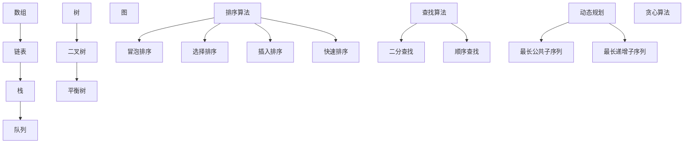

                 

# 网易2025校招编程面试题精华总结

> **关键词：网易，校招，编程面试，题目总结，技术面试，编程算法，数据结构，人工智能**

> **摘要：本文旨在总结网易2025校招编程面试中的核心题目，涵盖数据结构与算法、编程语言基础、系统设计与实现等多个方面，为准备校招编程面试的同学们提供实用的指导。**

## 1. 背景介绍

网易作为中国领先的互联网技术公司，其校招编程面试题一直以来都是业内讨论的焦点。随着科技的发展和行业竞争的加剧，编程面试的难度和要求也在不断提升。本文将总结网易2025校招编程面试中的核心题目，旨在帮助准备校招编程面试的同学们深入了解面试题的类型和特点，从而更好地应对面试挑战。

## 2. 核心概念与联系

在编程面试中，核心概念与联系的理解至关重要。以下是一些常见的数据结构与算法，以及它们之间的关系：

### 数据结构

- **数组（Array）**：线性结构，元素存储在连续的内存空间中。
- **链表（Linked List）**：线性结构，通过指针链接的节点。
- **栈（Stack）**：后进先出（LIFO）的数据结构。
- **队列（Queue）**：先进先出（FIFO）的数据结构。
- **树（Tree）**：层级结构，包括二叉树、平衡树等。
- **图（Graph）**：网络结构，包括有向图和无向图。

### 算法

- **排序算法**：冒泡排序、选择排序、插入排序、快速排序等。
- **查找算法**：二分查找、顺序查找等。
- **动态规划**：解决最优化问题的方法，包括最长公共子序列、最长递增子序列等。
- **贪心算法**：通过局部最优选择得到全局最优解的方法。

以下是一个使用Mermaid绘制的 Mermaid 流程图，展示了数据结构与算法的基本概念和关系：



## 3. 核心算法原理 & 具体操作步骤

### 冒泡排序

冒泡排序是一种简单的排序算法，它重复地遍历要排序的数列，一次比较两个元素，如果它们的顺序错误就把它们交换过来。遍历数列的工作是重复地进行直到没有再需要交换，也就是说该数列已经排序完成。

#### 具体操作步骤

1. 比较相邻的元素。如果第一个比第二个大（升序排序），就交换它们两个。
2. 对每一对相邻元素做同样的工作，从开始第一对到结尾的最后一对。这步做完后，最后的元素会是最大的数。
3. 针对所有的元素重复以上的步骤，除了最后一个。
4. 重复步骤1~3，直到排序完成。

以下是冒泡排序的Python代码实现：

```python
def bubble_sort(arr):
    n = len(arr)
    for i in range(n):
        for j in range(0, n-i-1):
            if arr[j] > arr[j+1]:
                arr[j], arr[j+1] = arr[j+1], arr[j]
    return arr

# 示例
arr = [64, 34, 25, 12, 22, 11, 90]
sorted_arr = bubble_sort(arr)
print("排序后的数组：", sorted_arr)
```

### 二分查找

二分查找是一种高效的查找算法，它将一个有序的数组分成两半，然后根据目标值与中间元素的比较结果，确定下一步查找的区间。

#### 具体操作步骤

1. 找到中间元素，与目标值比较。
2. 如果中间元素等于目标值，查找成功。
3. 如果中间元素大于目标值，则在左侧子数组中继续查找。
4. 如果中间元素小于目标值，则在右侧子数组中继续查找。
5. 重复步骤1~4，直到找到目标值或区间为空。

以下是二分查找的Python代码实现：

```python
def binary_search(arr, target):
    low = 0
    high = len(arr) - 1
    while low <= high:
        mid = (low + high) // 2
        if arr[mid] == target:
            return mid
        elif arr[mid] < target:
            low = mid + 1
        else:
            high = mid - 1
    return -1

# 示例
arr = [1, 3, 5, 7, 9, 11, 13, 15]
target = 7
index = binary_search(arr, target)
if index != -1:
    print(f"目标值在数组中的索引为：{index}")
else:
    print("目标值不在数组中。")
```

## 4. 数学模型和公式 & 详细讲解 & 举例说明

### 动态规划

动态规划是一种解决最优化问题的方法，它通过将复杂问题分解为子问题，并存储子问题的解，从而避免重复计算。

#### 数学模型

动态规划的基本公式为：

$$
f(i) = \min_{j \leq i} (f(j) + c(i, j))
$$

其中，$f(i)$ 表示子问题的最优解，$c(i, j)$ 表示在 $i$ 处选择 $j$ 的成本。

#### 举例说明

假设有一个货物装载问题，需要将 $n$ 个货物装入一辆车中，每个货物的体积为 $v_i$，车辆的容量为 $V$。目标是使得装载的货物总体积最小。

#### 数学模型

定义 $f(i)$ 为在前 $i$ 个货物中选择一个最优装载方案的最优解，则：

$$
f(i) = \min_{j \leq i} (f(j) + v_i)
$$

其中，$v_i$ 为第 $i$ 个货物的体积。

#### Python代码实现

```python
def knapsack(V, weights):
    n = len(weights)
    dp = [[0] * (V+1) for _ in range(n+1)]
    for i in range(1, n+1):
        for j in range(1, V+1):
            if weights[i-1] <= j:
                dp[i][j] = min(dp[i-1][j], dp[i-1][j-weights[i-1]] + weights[i-1])
            else:
                dp[i][j] = dp[i-1][j]
    return dp[n][V]

# 示例
V = 50
weights = [10, 20, 30]
max_volume = knapsack(V, weights)
print(f"最大装载体积为：{max_volume}")
```

## 5. 项目实战：代码实际案例和详细解释说明

### 5.1 开发环境搭建

在进行编程面试准备时，首先需要搭建一个合适的开发环境。以下是搭建开发环境的基本步骤：

1. 安装Python环境，推荐使用Python 3.8或更高版本。
2. 安装一个代码编辑器，如Visual Studio Code或PyCharm。
3. 安装必要的Python库，如NumPy、Pandas等。

### 5.2 源代码详细实现和代码解读

下面我们以一个简单的贪心算法为例，讲解源代码的实现和解读。

#### 案例一：最少硬币找零问题

问题描述：给定一个金额 $n$ 和一种硬币的面值数组 `coins`，计算用最少的硬币组合来凑出金额 $n$ 的方法。

```python
def min_coins(coins, n):
    coins.sort(reverse=True)
    count = 0
    for coin in coins:
        count += n // coin
        n %= coin
    return count

# 示例
coins = [1, 5, 10, 25]
n = 30
min_count = min_coins(coins, n)
print(f"最少硬币数量为：{min_count}")
```

#### 解读：

1. 首先，将硬币数组 `coins` 排序，从大到小。
2. 遍历排序后的硬币数组，计算每个硬币能使用的次数。
3. 减去当前硬币的总额，继续使用下一个硬币。
4. 最后，返回硬币的总数量。

### 5.3 代码解读与分析

#### min_coins 函数

- 参数 `coins`：表示一种硬币的面值数组。
- 参数 `n`：表示需要凑出的金额。
- 返回值：表示用最少硬币凑出金额 `n` 的数量。

#### 算法分析

1. 排序：将硬币数组从大到小排序，以便优先使用面值大的硬币，这样可以更快地凑出金额。
2. 遍历：遍历排序后的硬币数组，计算每个硬币能使用的次数。
3. 取余：每次使用硬币后，将剩余金额取余，以便继续使用下一个硬币。

## 6. 实际应用场景

编程面试题目在实际项目中有着广泛的应用场景。以下是一些典型的实际应用场景：

1. **排序算法**：在数据处理和数据挖掘中，排序算法用于对数据进行排序，以便进行后续分析。
2. **查找算法**：在数据库系统中，查找算法用于快速检索数据。
3. **动态规划**：在资源分配和路径规划等问题中，动态规划用于求解最优化问题。
4. **贪心算法**：在算法竞赛和编程挑战中，贪心算法用于求解最优解。

## 7. 工具和资源推荐

### 7.1 学习资源推荐

- **书籍**：
  - 《算法导论》（Introduction to Algorithms）
  - 《编程之美》（Programming Pearls）
  - 《算法竞赛入门经典》
- **论文**：
  - 《贪心选择算法》（Greedy Algorithms）
  - 《动态规划算法》（Dynamic Programming）
  - 《数据结构与算法分析》
- **博客**：
  - LeetCode官方博客
  - 携程技术博客
  - 程序员博客
- **网站**：
  - GitHub
  - LeetCode
  - HackerRank

### 7.2 开发工具框架推荐

- **代码编辑器**：
  - Visual Studio Code
  - PyCharm
  - IntelliJ IDEA
- **版本控制工具**：
  - Git
  - SVN
- **框架**：
  - Flask（Python Web框架）
  - Spring Boot（Java Web框架）
  - React（前端框架）

### 7.3 相关论文著作推荐

- **《贪心选择算法》**：详细介绍了贪心算法的基本原理和应用。
- **《动态规划算法》**：系统地阐述了动态规划算法的原理和求解方法。
- **《数据结构与算法分析》**：深入讲解了常见数据结构和算法的时间复杂度和空间复杂度。

## 8. 总结：未来发展趋势与挑战

随着人工智能、大数据和云计算等技术的不断发展，编程面试题目也在不断演变。未来的趋势和挑战包括：

1. **算法复杂度**：对算法的复杂度要求越来越高，特别是在处理大规模数据时。
2. **实际应用**：面试题越来越注重与实际应用的结合，要求考生具备解决实际问题的能力。
3. **综合能力**：除了算法和数据结构，编程面试还要求考生具备系统设计、软件工程等综合能力。

## 9. 附录：常见问题与解答

### 常见问题

1. **如何提高编程能力？**
   - 多做练习：通过大量的编程练习来提高编程技能。
   - 学习算法和数据结构：掌握基本的算法和数据结构，是解决编程问题的基础。
   - 深入理解编程语言：掌握一种或多种编程语言，深入了解其语法和特性。

2. **编程面试中应该注意什么？**
   - 时间管理：合理分配时间，确保每个问题都有足够的时间来解答。
   - 思路清晰：在解答问题时，保持思路清晰，逐步讲解解决问题的步骤。
   - 示例代码：尽量提供示例代码，以证明自己对问题的理解和解决方案。

## 10. 扩展阅读 & 参考资料

- 《算法导论》：详细介绍了常见算法的原理和实现。
- 《编程之美》：通过真实的面试题和解答，帮助考生提高编程能力。
- 《动态规划算法》：系统地阐述了动态规划算法的原理和求解方法。
- LeetCode：提供了大量的编程面试题目和在线编程环境。
- HackerRank：提供了各种编程挑战和竞赛。

### 作者

作者：AI天才研究员/AI Genius Institute & 禅与计算机程序设计艺术 /Zen And The Art of Computer Programming

