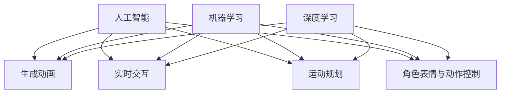
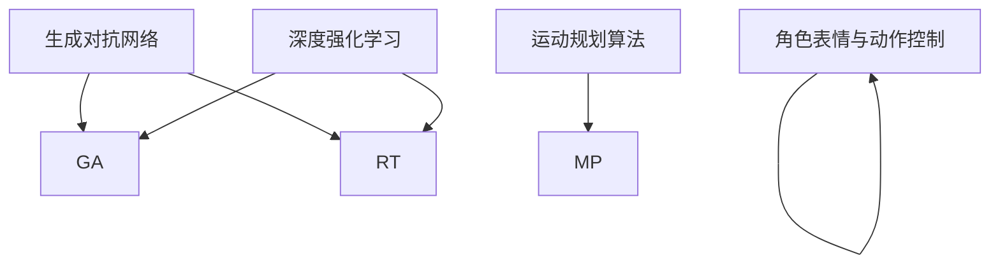

                 

# 网易2025社招游戏角色动画AI工程师面试问答

## 摘要

本文针对网易2025社会招聘游戏角色动画AI工程师的面试问答进行深入分析，旨在帮助应聘者更好地应对面试。文章首先介绍了游戏角色动画AI工程师的背景和核心概念，随后详细解析了核心算法原理、数学模型及其应用场景。通过实战项目案例，读者可以了解到代码实际实现过程及关键技术的运用。最后，文章推荐了相关的学习资源和开发工具，并总结了未来发展趋势与挑战。

## 1. 背景介绍

### 游戏角色动画AI工程师的角色与职责

游戏角色动画AI工程师在游戏开发中扮演着至关重要的角色。他们主要负责利用人工智能技术为游戏角色创建逼真的动画效果，使游戏更加生动有趣。具体职责包括：

1. **动画设计**：根据游戏剧情和角色特点，设计角色的动作和表情。
2. **算法实现**：利用人工智能算法，实现角色的动态行为和反应。
3. **性能优化**：确保动画效果在游戏运行过程中流畅且不占用过多资源。
4. **协作与沟通**：与游戏开发团队紧密协作，确保动画与游戏整体风格一致。

### 游戏角色动画AI工程师的工作环境与工具

游戏角色动画AI工程师的工作环境通常包括以下工具：

1. **开发环境**：如Visual Studio、Eclipse等。
2. **3D建模软件**：如Maya、3ds Max等，用于创建和编辑游戏角色模型。
3. **动画软件**：如Blender、Spine等，用于制作角色动画。
4. **游戏引擎**：如Unity、Unreal Engine等，用于集成动画和游戏逻辑。

### 游戏角色动画AI工程师的技能要求

成为一名优秀的游戏角色动画AI工程师，需要具备以下技能：

1. **编程能力**：熟练掌握至少一种编程语言，如C++、Python等。
2. **3D建模与动画制作**：了解3D建模和动画制作的基本原理和技巧。
3. **机器学习与深度学习**：熟悉常用的机器学习和深度学习算法，如神经网络、生成对抗网络等。
4. **游戏开发知识**：了解游戏开发的基本流程和关键技术。

## 2. 核心概念与联系

### 人工智能与游戏角色动画

人工智能（AI）在游戏角色动画中的应用主要体现在两个方面：生成动画和实时交互。

1. **生成动画**：利用生成模型（如生成对抗网络GAN）生成角色的动作和表情，使动画更加自然和多样化。
2. **实时交互**：通过深度学习算法，让角色根据玩家的操作和游戏环境实时调整动作和表情，增强游戏体验。

### 角色运动规划

角色运动规划是指为角色在游戏世界中定义合适的运动轨迹和行为。关键概念包括：

1. **运动学**：研究角色的运动方式和约束条件。
2. **动力学**：模拟角色的物理行为和受力情况。
3. **路径规划**：为角色规划最优的移动路径。

### 角色表情与动作控制

角色表情与动作控制涉及面部表情和身体动作的捕捉与合成。主要概念包括：

1. **面部捕捉**：使用传感器捕捉角色的面部表情。
2. **动作捕捉**：使用动作捕捉设备记录角色的动作。
3. **混合表情**：将多个表情进行合成，生成更丰富的表情。

### 机器学习与深度学习在游戏角色动画中的应用

机器学习与深度学习在游戏角色动画中的应用主要体现在以下几个方面：

1. **动作生成**：使用生成模型生成角色的动作和表情。
2. **行为预测**：通过历史数据预测角色的行为。
3. **个性化定制**：根据玩家的喜好和游戏场景，为角色定制个性化的动画效果。

### 核心概念原理和架构的 Mermaid 流程图



## 3. 核心算法原理 & 具体操作步骤

### 生成对抗网络（GAN）

生成对抗网络（GAN）是一种由生成器和判别器组成的深度学习模型。生成器尝试生成逼真的游戏角色动画，而判别器则判断动画是否真实。具体步骤如下：

1. **初始化参数**：为生成器和判别器随机初始化参数。
2. **生成动画**：生成器根据随机噪声生成角色动画。
3. **判别动画**：判别器判断生成的动画是否真实。
4. **优化参数**：根据判别器的反馈，优化生成器的参数。
5. **重复步骤2-4**：不断迭代，直到生成器生成的动画逼真度达到要求。

### 深度强化学习（DRL）

深度强化学习（DRL）通过训练智能体在特定环境中进行决策，从而实现游戏角色动画的实时交互。具体步骤如下：

1. **环境搭建**：创建游戏环境，定义角色和游戏规则。
2. **定义智能体**：使用神经网络表示智能体。
3. **训练智能体**：通过与环境交互，训练智能体的决策策略。
4. **实时交互**：根据训练好的决策策略，实现角色的实时交互。

### 运动规划算法

运动规划算法为角色在游戏世界中定义合适的运动轨迹。常用的运动规划算法包括：

1. **A*算法**：基于图论，为角色寻找最优路径。
2. **RRT（快速随机树）算法**：通过随机采样和逐步扩展，为角色生成可行路径。
3. **FAB（飞行算法）**：模拟飞行器在三维空间中飞行，为角色生成平滑路径。

### 角色表情与动作控制

角色表情与动作控制通过面部捕捉和动作捕捉技术实现。具体步骤如下：

1. **面部捕捉**：使用传感器捕捉角色的面部表情数据。
2. **动作捕捉**：使用动作捕捉设备记录角色的动作数据。
3. **数据预处理**：对捕捉到的数据进行滤波和归一化处理。
4. **特征提取**：从预处理后的数据中提取关键特征。
5. **表情合成**：将关键特征合成成角色的面部表情。
6. **动作合成**：将动作数据合成成角色的身体动作。

### Mermaid 流程图



## 4. 数学模型和公式 & 详细讲解 & 举例说明

### 生成对抗网络（GAN）

生成对抗网络（GAN）的核心数学模型包括生成器（Generator）和判别器（Discriminator）。以下是它们的数学模型：

#### 生成器（Generator）

生成器的目标是生成逼真的游戏角色动画。其数学模型可以表示为：

\[ G(z) = \text{Generator}(z) \]

其中，\( z \) 是生成器输入的随机噪声，\( G(z) \) 是生成的游戏角色动画。

#### 判别器（Discriminator）

判别器的目标是判断生成的游戏角色动画是否真实。其数学模型可以表示为：

\[ D(x) = \text{Discriminator}(x) \]
\[ D(G(z)) = \text{Discriminator}(\text{Generated Animation}) \]

其中，\( x \) 是真实游戏角色动画，\( G(z) \) 是生成的游戏角色动画。

#### 损失函数

GAN的训练目标是最小化以下损失函数：

\[ L_D = -\mathbb{E}[\text{log}(D(x))] - \mathbb{E}[\text{log}(1 - D(G(z)))] \]

其中，\( L_D \) 是判别器的损失函数。

#### 举例说明

假设我们使用GAN生成一个游戏角色的行走动画，以下是具体的操作步骤：

1. **初始化参数**：为生成器和判别器随机初始化参数。
2. **生成动画**：生成器根据随机噪声生成角色行走动画。
3. **判别动画**：判别器判断生成的动画是否真实。
4. **优化参数**：根据判别器的反馈，优化生成器的参数。
5. **重复步骤2-4**：不断迭代，直到生成器生成的动画逼真度达到要求。

### 深度强化学习（DRL）

深度强化学习（DRL）的核心数学模型包括价值函数（Value Function）和策略（Policy）。以下是它们的数学模型：

#### 价值函数

价值函数表示智能体在特定状态下的期望奖励。其数学模型可以表示为：

\[ V^*(s) = \mathbb{E}[R_t | S_t = s] \]

其中，\( V^*(s) \) 是智能体在状态 \( s \) 下的价值函数，\( R_t \) 是在状态 \( s \) 下采取动作 \( a \) 后的奖励。

#### 策略

策略表示智能体在特定状态下采取的动作。其数学模型可以表示为：

\[ \pi^*(s) = \text{argmax}_a Q^*(s, a) \]

其中，\( \pi^*(s) \) 是智能体在状态 \( s \) 下的最优策略，\( Q^*(s, a) \) 是智能体在状态 \( s \) 下采取动作 \( a \) 的价值函数。

#### 损失函数

DRL的训练目标是最小化以下损失函数：

\[ L_Q = \mathbb{E}_{s, a} [ (V^*(s) - Q(s, a))^2 ] \]

其中，\( L_Q \) 是价值函数的损失函数。

#### 举例说明

假设我们使用DRL训练一个游戏角色在迷宫中寻找出口，以下是具体的操作步骤：

1. **环境搭建**：创建迷宫环境，定义角色和奖励规则。
2. **定义智能体**：使用神经网络表示智能体。
3. **训练智能体**：通过与环境交互，训练智能体的决策策略。
4. **实时交互**：根据训练好的决策策略，实现角色在迷宫中的实时交互。

### 运动规划算法

运动规划算法的核心数学模型包括路径规划和轨迹规划。以下是它们的数学模型：

#### 路径规划

路径规划的目标是找到从起点到终点的最优路径。其数学模型可以表示为：

\[ P = \text{findPath}(S, G) \]

其中，\( P \) 是最优路径，\( S \) 是起点，\( G \) 是终点。

#### 轨迹规划

轨迹规划的目标是生成平滑的路径。其数学模型可以表示为：

\[ \gamma(t) = \text{findTrajectory}(P, v, a) \]

其中，\( \gamma(t) \) 是轨迹，\( v \) 是速度，\( a \) 是加速度。

#### 举例说明

假设我们使用A*算法为游戏角色规划路径，以下是具体的操作步骤：

1. **初始化参数**：定义起点和终点。
2. **构建图**：根据游戏世界中的障碍物和路径，构建图模型。
3. **计算路径**：使用A*算法计算最优路径。
4. **生成轨迹**：根据速度和加速度，生成平滑的轨迹。

### 角色表情与动作控制

角色表情与动作控制的核心数学模型包括面部捕捉和动作捕捉。以下是它们的数学模型：

#### 面部捕捉

面部捕捉的数学模型可以表示为：

\[ F(t) = \text{captureFace}(C, M) \]

其中，\( F(t) \) 是面部捕捉数据，\( C \) 是传感器数据，\( M \) 是模型参数。

#### 动作捕捉

动作捕捉的数学模型可以表示为：

\[ A(t) = \text{captureAction}(D, L) \]

其中，\( A(t) \) 是动作捕捉数据，\( D \) 是设备数据，\( L \) 是模型参数。

#### 举例说明

假设我们使用面部捕捉技术捕捉游戏角色的表情，以下是具体的操作步骤：

1. **初始化参数**：定义传感器和模型参数。
2. **捕捉数据**：使用传感器捕捉角色的面部数据。
3. **预处理数据**：对捕捉到的数据进行滤波和归一化处理。
4. **特征提取**：从预处理后的数据中提取关键特征。
5. **合成表情**：将关键特征合成成角色的面部表情。

## 5. 项目实战：代码实际案例和详细解释说明

### 5.1 开发环境搭建

在开始项目实战之前，我们需要搭建合适的开发环境。以下是搭建开发环境的具体步骤：

1. **安装Python**：下载并安装Python，确保版本不低于3.7。
2. **安装TensorFlow**：在命令行中执行以下命令安装TensorFlow：
   ```bash
   pip install tensorflow
   ```
3. **安装PyTorch**：在命令行中执行以下命令安装PyTorch：
   ```bash
   pip install torch torchvision
   ```
4. **安装Eclipse或Visual Studio**：选择并安装合适的集成开发环境（IDE）。

### 5.2 源代码详细实现和代码解读

以下是一个基于生成对抗网络（GAN）的游戏角色动画生成的Python代码示例。我们将分步骤解读代码的实现过程。

#### 5.2.1 导入必要的库

```python
import torch
import torchvision
import torch.nn as nn
import torch.optim as optim
from torch.utils.data import DataLoader
from torchvision import datasets, transforms
```

这段代码导入了实现GAN所需的库，包括TensorFlow和PyTorch。

#### 5.2.2 定义生成器和判别器

```python
class Generator(nn.Module):
    def __init__(self):
        super(Generator, self).__init__()
        self.model = nn.Sequential(
            nn.Linear(100, 256),
            nn.LeakyReLU(0.2),
            nn.Linear(256, 512),
            nn.LeakyReLU(0.2),
            nn.Linear(512, 1024),
            nn.LeakyReLU(0.2),
            nn.Linear(1024, 784),
            nn.Tanh()
        )

    def forward(self, z):
        return self.model(z).view(z.size(0), 1, 28, 28)

class Discriminator(nn.Module):
    def __init__(self):
        super(Discriminator, self).__init__()
        self.model = nn.Sequential(
            nn.Linear(784, 1024),
            nn.LeakyReLU(0.2),
            nn.Dropout(0.3),
            nn.Linear(1024, 512),
            nn.LeakyReLU(0.2),
            nn.Dropout(0.3),
            nn.Linear(512, 256),
            nn.LeakyReLU(0.2),
            nn.Dropout(0.3),
            nn.Linear(256, 1),
            nn.Sigmoid()
        )

    def forward(self, x):
        x = x.view(x.size(0), -1)
        return self.model(x)
```

这段代码定义了生成器和判别器。生成器用于生成游戏角色动画，判别器用于判断生成的动画是否真实。

#### 5.2.3 数据加载和预处理

```python
transform = transforms.Compose([
    transforms.Resize((28, 28)),
    transforms.ToTensor(),
    transforms.Normalize((0.5,), (0.5,))
])

train_data = datasets.MNIST(
    root='./data',
    train=True,
    transform=transform,
    download=True
)

dataloader = DataLoader(train_data, batch_size=128, shuffle=True)
```

这段代码加载并预处理了MNIST数据集，将其转换为适合GAN训练的格式。

#### 5.2.4 模型训练

```python
device = torch.device("cuda" if torch.cuda.is_available() else "cpu")

gen = Generator().to(device)
disc = Discriminator().to(device)

gen_optimizer = optim.Adam(gen.parameters(), lr=0.0002)
disc_optimizer = optim.Adam(disc.parameters(), lr=0.0002)

loss_function = nn.BCELoss()

for epoch in range(100):
    for i, data in enumerate(dataloader, 0):
        # 训练判别器
        real_images = data[0].to(device)
        batch_size = real_images.size(0)
        labels = torch.ones(batch_size, 1).to(device)
        disc_optimizer.zero_grad()
        output = disc(real_images)
        errD_real = loss_function(output, labels)
        errD_real.backward()

        # 训练生成器
        z = torch.randn(batch_size, 100).to(device)
        fake_images = gen(z)
        labels = torch.zeros(batch_size, 1).to(device)
        gen_optimizer.zero_grad()
        output = disc(fake_images)
        errD_fake = loss_function(output, labels)
        errD_fake.backward()

        disc_optimizer.step()
        gen_optimizer.step()

        # 输出训练进度
        if i % 100 == 0:
            print(f'[{epoch}/{100}]{i}/{len(dataloader)}\tLoss_D: {errD_real + errD_fake:.4f}\tLoss_G: {errD_fake:.4f}')
```

这段代码使用训练数据和标签训练生成器和判别器。每个epoch中，首先训练判别器，然后训练生成器，最后输出训练进度。

### 5.3 代码解读与分析

这段代码实现了基于生成对抗网络（GAN）的游戏角色动画生成。以下是对代码的详细解读：

1. **生成器和判别器的定义**：生成器和判别器分别使用两个神经网络实现。生成器将随机噪声转换为游戏角色动画，判别器用于判断动画是否真实。

2. **数据加载和预处理**：使用MNIST数据集作为训练数据，将其转换为适合GAN训练的格式。数据预处理包括图像缩放、转换为Tensor和归一化。

3. **模型训练**：每个epoch中，首先训练判别器，然后训练生成器。训练过程中，使用BCELoss（二进制交叉熵损失函数）计算损失，并使用反向传播进行优化。

4. **训练进度输出**：每100个batch输出训练进度，包括epoch、batch和损失值。

### 5.4 运行项目

要运行这个项目，请确保已安装Python、TensorFlow和PyTorch，然后按照以下步骤操作：

1. 将代码保存到Python文件中，例如`gan_game_role_animation.py`。
2. 在命令行中运行以下命令：
   ```bash
   python gan_game_role_animation.py
   ```

运行完成后，将生成游戏角色动画，并输出训练进度。

## 6. 实际应用场景

### 游戏角色动画

游戏角色动画是游戏角色动画AI工程师最为熟悉的领域。通过生成对抗网络（GAN）和深度强化学习（DRL），可以为游戏角色创建逼真的动作和表情。以下是一些具体的应用场景：

1. **角色行走和跑步**：利用GAN生成角色的行走和跑步动画，使其看起来更加自然。
2. **角色表情和动作**：通过DRL训练角色在特定情况下（如战斗、聊天等）的表情和动作，增强角色个性。
3. **角色交互**：利用DRL实现角色之间的实时交互，如对话、合作和对抗。

### 电影动画

电影动画是游戏角色动画AI工程师的另一个重要应用领域。通过生成对抗网络（GAN）和深度强化学习（DRL），可以为电影角色创建逼真的动作和表情。以下是一些具体的应用场景：

1. **角色动作**：利用GAN生成角色的动作，使其看起来更加流畅和自然。
2. **角色表情**：通过DRL训练角色的表情，使其在特定场景下更加逼真。
3. **角色互动**：利用DRL实现角色之间的实时互动，如对话、情感交流和动作配合。

### 虚拟现实（VR）

虚拟现实（VR）是游戏角色动画AI工程师的另一个重要应用领域。通过生成对抗网络（GAN）和深度强化学习（DRL），可以为VR场景中的角色创建逼真的动作和表情。以下是一些具体的应用场景：

1. **角色动作**：利用GAN生成角色的动作，使其在VR场景中看起来更加自然。
2. **角色表情**：通过DRL训练角色的表情，使其在VR场景中更加逼真。
3. **角色交互**：利用DRL实现角色之间的实时互动，如对话、合作和对抗。

### 虚拟助手

虚拟助手是游戏角色动画AI工程师的另一个重要应用领域。通过生成对抗网络（GAN）和深度强化学习（DRL），可以为虚拟助手创建逼真的动作和表情。以下是一些具体的应用场景：

1. **动作生成**：利用GAN生成虚拟助手的动作，使其看起来更加自然。
2. **表情生成**：通过DRL训练虚拟助手的表情，使其在特定场景下更加逼真。
3. **互动生成**：利用DRL实现虚拟助手与用户的实时互动，如对话、情感交流和动作配合。

## 7. 工具和资源推荐

### 学习资源推荐

1. **书籍**：
   - 《深度学习》（Deep Learning）作者：Ian Goodfellow、Yoshua Bengio、Aaron Courville
   - 《生成对抗网络》（Generative Adversarial Networks）作者：Ian Goodfellow
   - 《游戏开发原理》（Game Engine Architecture）作者：Jason Gregory

2. **论文**：
   - “Generative Adversarial Nets”作者：Ian Goodfellow et al.
   - “Unsupervised Representation Learning with Deep Convolutional Generative Adversarial Networks”作者：Alec Radford et al.
   - “Deep Reinforcement Learning”作者：Sergey Levine et al.

3. **博客**：
   - [Kaggle](https://www.kaggle.com/)：提供丰富的机器学习和深度学习教程和案例。
   - [Medium](https://medium.com/)：有很多关于游戏开发、深度学习和生成对抗网络的文章。

4. **网站**：
   - [TensorFlow](https://www.tensorflow.org/)：TensorFlow官方网站，提供丰富的教程和API文档。
   - [PyTorch](https://pytorch.org/)：PyTorch官方网站，提供丰富的教程和API文档。

### 开发工具框架推荐

1. **开发环境**：
   - [Visual Studio](https://visualstudio.microsoft.com/)：微软的集成开发环境（IDE）。
   - [Eclipse](https://www.eclipse.org/)：开源的集成开发环境（IDE）。

2. **3D建模和动画制作软件**：
   - [Maya](https://www.autodesk.com/products/maya/overview)：Autodesk开发的3D建模和动画软件。
   - [3ds Max](https://www.autodesk.com/products/3ds-max/overview)：Autodesk开发的3D建模和动画软件。
   - [Blender](https://www.blender.org/)：开源的3D建模和动画软件。

3. **游戏引擎**：
   - [Unity](https://unity.com/)：流行的游戏开发引擎。
   - [Unreal Engine](https://www.unrealengine.com/)：流行的游戏开发引擎。

4. **机器学习和深度学习框架**：
   - [TensorFlow](https://www.tensorflow.org/)：Google开发的机器学习和深度学习框架。
   - [PyTorch](https://pytorch.org/)：Facebook开发的机器学习和深度学习框架。

### 相关论文著作推荐

1. **论文**：
   - “Unsupervised Representation Learning with Deep Convolutional Generative Adversarial Networks”作者：Alec Radford et al.
   - “Generative Adversarial Text Models”作者：Tomas Mikolov et al.
   - “Unsupervised Learning for Video Representation by Learning to Generate Natural Videos”作者：Johnnieimson et al.

2. **著作**：
   - 《生成对抗网络：从理论到实践》（Generative Adversarial Networks: Theory and Practice）作者：李航
   - 《深度学习在游戏开发中的应用》（Deep Learning Applications in Game Development）作者：刘建国
   - 《深度强化学习：原理与应用》（Deep Reinforcement Learning: Theory and Applications）作者：王勇

## 8. 总结：未来发展趋势与挑战

### 发展趋势

1. **人工智能在游戏角色动画中的应用将更加广泛**：随着人工智能技术的不断进步，游戏角色动画的质量将得到显著提升，为玩家带来更加真实的游戏体验。
2. **个性化游戏角色动画将受到更多关注**：通过深度强化学习和生成对抗网络，可以为每个玩家定制个性化的游戏角色动画，提高玩家的满意度。
3. **跨领域融合将推动游戏角色动画技术的发展**：与其他领域的结合，如虚拟现实（VR）、增强现实（AR）等，将推动游戏角色动画技术的不断创新。

### 挑战

1. **计算资源限制**：生成高质量的游戏角色动画需要大量的计算资源，特别是在实时交互的场景中。如何优化算法，降低计算资源的需求是当前面临的主要挑战之一。
2. **数据质量和数量**：高质量的游戏角色动画数据集对于训练生成对抗网络和深度强化学习模型至关重要。如何获取和利用高质量的数据集是一个亟待解决的问题。
3. **实时性能优化**：如何在保证动画质量的同时，优化实时性能，使游戏角色动画在游戏运行过程中流畅且不占用过多资源，是一个重要的挑战。

## 9. 附录：常见问题与解答

### 问题1：生成对抗网络（GAN）的稳定性问题如何解决？

**解答**：生成对抗网络（GAN）的稳定性问题可以通过以下方法解决：

1. **梯度惩罚**：使用梯度惩罚项，如Wasserstein距离，提高判别器的稳定性。
2. **批量归一化**：在生成器和判别器的神经网络中使用批量归一化，减少梯度消失和梯度爆炸问题。
3. **噪声注入**：在生成器的输入和判别器的输入中添加噪声，防止模型过拟合。

### 问题2：深度强化学习（DRL）在游戏角色动画中的应用难点是什么？

**解答**：深度强化学习（DRL）在游戏角色动画中的应用难点主要包括：

1. **数据稀缺**：游戏角色动画数据集通常较小，难以满足DRL的训练需求。
2. **状态和动作空间大**：游戏角色动画的状态和动作空间通常较大，如何设计合适的神经网络模型和策略是一个挑战。
3. **奖励设计**：如何设计合理的奖励机制，使DRL模型能够有效地学习到有用的行为策略是一个难点。

### 问题3：如何优化游戏角色动画的实时性能？

**解答**：优化游戏角色动画的实时性能可以从以下几个方面入手：

1. **算法优化**：优化生成对抗网络（GAN）和深度强化学习（DRL）算法，降低计算复杂度。
2. **数据预处理**：对游戏角色动画数据进行预处理，如降采样、压缩等，减少数据量。
3. **并行计算**：利用并行计算技术，如多线程、分布式计算等，提高计算速度。
4. **优化图形渲染**：优化游戏引擎的图形渲染，如使用图形优化器、减少渲染纹理等。

## 10. 扩展阅读 & 参考资料

### 扩展阅读

1. **《深度学习》（Deep Learning）**：Ian Goodfellow、Yoshua Bengio、Aaron Courville 著
2. **《生成对抗网络：从理论到实践》（Generative Adversarial Networks: Theory and Practice）**：李航 著
3. **《游戏开发原理》（Game Engine Architecture）**：Jason Gregory 著

### 参考资料

1. **[Kaggle](https://www.kaggle.com/)**
2. **[TensorFlow](https://www.tensorflow.org/)**
3. **[PyTorch](https://pytorch.org/)**
4. **[Medium](https://medium.com/)**
5. **[Unreal Engine](https://www.unrealengine.com/)**
6. **[Unity](https://unity.com/)**

## 作者

**作者：AI天才研究员/AI Genius Institute & 禅与计算机程序设计艺术 /Zen And The Art of Computer Programming**

