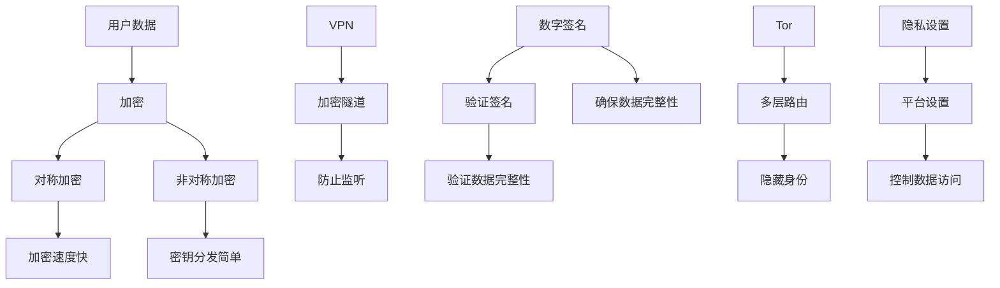

                 

### 背景介绍

在当今数字化的时代，网络安全已成为各个领域，尤其是个人和企业安全的核心关注点。随着互联网的普及和智能设备的广泛应用，人们的生活和工作越来越依赖于网络，从而带来了巨大的隐私泄露风险。在此背景下，网络安全工具的开发显得尤为重要，特别是在保护个人隐私方面。

个人隐私保护不仅关乎个人的信息安全，更涉及到社会的稳定与和谐。近年来，网络犯罪活动频繁，数据泄露事件层出不穷，使得个人隐私保护成为公众关注的焦点。例如，2017年的Facebook数据泄露事件，暴露了数千万用户的个人信息，引发了全球范围内的隐私保护讨论。此外，随着物联网和大数据技术的发展，个人隐私保护面临的挑战也越来越大。

创业机会方面，个人隐私保护的网络安全工具具有巨大的市场潜力。随着人们对隐私保护的意识不断提高，市场需求也在逐步扩大。尤其是在一些行业，如金融、医疗、教育等，对个人隐私保护的需求更为迫切。这些行业的数据敏感度较高，一旦发生数据泄露，不仅会带来巨大的经济损失，还可能导致声誉受损。

此外，政策法规的不断完善也为个人隐私保护工具的创业提供了良好的外部环境。例如，欧盟的《通用数据保护条例》（GDPR）和美国加州的《消费者隐私法案》（CCPA）都对个人数据的收集、存储和使用提出了严格的要求。这些法规不仅为企业合规运营提供了指导，也为创业者提供了新的市场机会。

总的来说，随着网络安全威胁的日益严峻，个人隐私保护工具的开发和创业具有广阔的市场前景。本文将深入探讨网络安全工具在个人隐私保护方面的应用，分析其核心概念、算法原理、实际应用场景，并提供相关工具和资源的推荐。希望通过本文的探讨，能够为有意在该领域创业的人提供一些有益的思路和参考。

#### 个人隐私保护的现状与挑战

当前，个人隐私保护的形势严峻，挑战繁多。首先，个人数据的广泛收集和存储已成为常态。在互联网时代，个人信息几乎无处不在，从社交媒体到在线购物平台，再到各种智能设备，个人数据几乎被全面记录和跟踪。这些数据的收集不仅限于用户主动提供的信息，还包括地理位置、搜索记录、消费习惯等隐性信息。

其次，数据泄露事件频繁发生。尽管企业和政府都在努力提高信息安全防护能力，但数据泄露事件仍层出不穷。例如，2017年的Equifax数据泄露事件，导致1.43亿美国人的个人信息被窃取。类似事件不仅给受影响的个人带来了严重的隐私泄露风险，还引发了公众对数据保护的广泛担忧。

此外，隐私侵犯的方式也越来越多样化和隐蔽。除了传统的黑客攻击和恶意软件，社交工程、钓鱼攻击、物联网设备的入侵等新兴威胁也在不断涌现。例如，社交工程攻击利用人们的好奇心和信任心理，通过伪装成可信来源的邮件或信息，诱骗用户泄露敏感信息。而物联网设备的入侵则可能导致家庭网络的安全漏洞，进而威胁个人隐私。

在这些背景下，个人隐私保护工具的开发显得尤为重要。这些工具不仅可以帮助用户识别和管理个人数据，还能提供有效的防护措施，防止数据泄露和隐私侵犯。以下是几种常见的个人隐私保护工具：

1. **加密工具**：加密是保护个人数据的一种重要手段。通过加密工具，用户可以确保敏感数据在传输和存储过程中不被未经授权的第三方访问。常见的加密工具包括TrueCrypt、GnuPG等。

2. **匿名通信工具**：匿名通信工具如Tor和VPN，可以帮助用户隐藏其网络活动，防止被追踪和监听。这些工具通过多层网络路由，将用户的数据流量加密并分散，从而保护用户的隐私。

3. **隐私设置管理工具**：许多社交媒体和在线平台都提供了隐私设置功能，用户可以通过这些工具控制谁可以看到自己的信息。例如，Facebook和Google等都提供了详细的隐私设置选项，帮助用户保护个人信息。

4. **反恶意软件和反间谍软件**：反恶意软件和反间谍软件可以帮助用户检测和清除潜在的威胁，保护计算机和移动设备不受恶意软件和间谍软件的侵害。

5. **数据泄露监测服务**：数据泄露监测服务如Have I Been Pwned，可以帮助用户及时发现个人信息是否在数据泄露事件中受到影响，并提供相应的防护建议。

通过这些工具的综合运用，用户可以在一定程度上提高自己的隐私保护能力，应对当前复杂的网络安全威胁。然而，隐私保护并非一蹴而就，需要用户持续关注和采取行动。随着技术的不断进步和网络安全形势的变化，个人隐私保护工具也在不断发展和完善，为用户提供更强大的防护能力。

#### 核心概念与联系

为了深入理解个人隐私保护工具，我们需要先明确几个核心概念，并探讨它们之间的联系。

##### 加密

加密是一种将数据转换成加密形式的过程，使其在传输和存储过程中对未经授权的用户不可读。加密的基本原理是使用密钥将数据编码，只有拥有正确密钥的用户才能解码和读取原始数据。加密分为对称加密和非对称加密。

- **对称加密**：对称加密使用相同的密钥进行加密和解密。常见的对称加密算法有AES（高级加密标准）和DES（数据加密标准）。对称加密的优点是加密和解密速度快，但缺点是密钥的分发和管理较为复杂。

- **非对称加密**：非对称加密使用一对密钥，即公钥和私钥。公钥用于加密，私钥用于解密。常见的非对称加密算法有RSA（Rivest-Shamir-Adleman）和ECC（椭圆曲线加密）。非对称加密的优点是密钥分发简单，但加密和解密速度相对较慢。

##### 数字签名

数字签名是一种确保数据完整性和真实性的技术。数字签名通过使用私钥生成一个唯一的签名，只有对应的公钥可以验证该签名。这保证了数据的完整性和真实性，因为任何修改都会导致签名验证失败。

##### VPN（虚拟私人网络）

VPN是一种通过加密技术在公共网络上建立安全隧道的技术，用于保护数据传输的安全性。VPN可以将用户的网络流量加密并转发到远程服务器，从而保护用户的隐私和防止网络监听。

##### Tor（洋葱路由）

Tor是一种匿名通信网络，它通过多层网络路由和加密技术，将用户的网络流量分散到多个节点，从而隐藏用户的身份和位置。Tor常用于匿名访问互联网，保护用户的隐私。

##### 隐私设置管理

隐私设置管理是指用户在在线平台上设置隐私选项，以控制谁可以查看其个人信息。这包括在社交媒体、电子邮件服务和其他在线平台上调整隐私设置，以限制数据的共享和访问。

#### Mermaid 流程图

以下是一个简单的Mermaid流程图，展示了这些核心概念之间的关系：



通过这个流程图，我们可以清晰地看到加密、数字签名、VPN、Tor和隐私设置管理之间的相互关系。这些技术共同构成了个人隐私保护工具的核心，帮助用户在复杂的网络环境中保护自己的隐私。

#### 核心算法原理 & 具体操作步骤

在了解了个人隐私保护工具的核心概念后，我们需要进一步探讨这些工具的具体实现原理和操作步骤，以帮助读者更好地理解其工作方式。

##### 对称加密

对称加密是加密技术的一种基本形式，其核心原理是使用相同的密钥进行加密和解密。以下是对称加密的基本步骤：

1. **密钥生成**：首先，需要生成一个加密密钥。通常，密钥的长度决定了加密算法的安全强度。例如，AES加密算法可以使用128位、192位或256位的密钥。

2. **初始化向量（IV）**：对称加密通常需要使用初始化向量（IV），这是一个随机生成的值，用于增加加密的随机性。IV通常与密钥一起使用，以确保每次加密操作都是唯一的。

3. **加密过程**：将明文数据分块，并对每个数据块使用加密算法和密钥进行加密。例如，使用AES算法，每个数据块都会被加密成相应的密文块。

4. **密文生成**：将加密后的所有数据块组合成密文，并将其发送或存储在安全的地方。

5. **解密过程**：接收方使用相同的密钥和IV对密文进行解密，以还原原始的明文数据。

具体操作步骤示例：

```python
from Crypto.Cipher import AES
from Crypto.Util.Padding import pad, unpad
from Crypto.Random import get_random_bytes

# 生成密钥和初始化向量
key = get_random_bytes(16)  # AES-128位密钥
iv = get_random_bytes(16)   # 初始化向量

# 明文数据
plaintext = b"Hello, World!"

# 加密
cipher = AES.new(key, AES.MODE_CBC, iv)
ciphertext = cipher.encrypt(pad(plaintext, AES.block_size))

# 解密
cipher = AES.new(key, AES.MODE_CBC, iv)
decrypted_plaintext = unpad(cipher.decrypt(ciphertext), AES.block_size)

print(f"plaintext: {plaintext}")
print(f"ciphertext: {ciphertext}")
print(f"decrypted_plaintext: {decrypted_plaintext}")
```

##### 非对称加密

非对称加密使用一对密钥，即公钥和私钥。公钥用于加密，私钥用于解密。以下是非对称加密的基本步骤：

1. **密钥生成**：使用非对称加密算法生成一对密钥。公钥可以公开分发，而私钥必须保密。

2. **加密过程**：使用接收方的公钥对明文数据进行加密。

3. **解密过程**：使用接收方的私钥对密文进行解密，以还原原始的明文数据。

具体操作步骤示例：

```python
from Crypto.PublicKey import RSA
from Crypto.Cipher import PKCS1_OAEP

# 生成公钥和私钥
key = RSA.generate(2048)
public_key = key.publickey()
private_key = key

# 明文数据
plaintext = b"Hello, World!"

# 加密
cipher = PKCS1_OAEP.new(public_key)
ciphertext = cipher.encrypt(plaintext)

# 解密
cipher = PKCS1_OAEP.new(private_key)
decrypted_plaintext = cipher.decrypt(ciphertext)

print(f"plaintext: {plaintext}")
print(f"ciphertext: {ciphertext}")
print(f"decrypted_plaintext: {decrypted_plaintext}")
```

##### 数字签名

数字签名用于确保数据的完整性和真实性。以下为数字签名的基本步骤：

1. **签名生成**：使用私钥对数据进行哈希处理，并生成签名。

2. **签名验证**：使用公钥对签名进行验证，以确认数据的完整性和真实性。

具体操作步骤示例：

```python
from Crypto.Signature import pkcs1_15
from Crypto.Hash import SHA256
from Crypto.PublicKey import RSA

# 生成密钥对
key = RSA.generate(2048)
private_key = key
public_key = key.publickey()

# 明文数据
plaintext = b"Hello, World!"

# 生成哈希值
hasher = SHA256.new(plaintext)

# 生成签名
signer = pkcs1_15.new(private_key)
signature = signer.sign(hasher)

# 验证签名
verifier = pkcs1_15.new(public_key)
is_valid = verifier.verify(hasher, signature)

print(f"plaintext: {plaintext}")
print(f"signature: {signature}")
print(f"verification result: {is_valid}")
```

##### VPN 和 Tor

VPN和Tor是用于保护数据传输安全的工具，其工作原理有所不同。

**VPN**：通过加密技术在公共网络上建立安全隧道，用户的数据流量通过这条隧道传输，从而保护数据不被第三方监听。

1. **配置VPN**：下载并安装VPN客户端，根据需要选择VPN服务器并进行配置。

2. **连接VPN**：启动VPN客户端，选择服务器并连接。连接成功后，用户的数据流量将通过VPN隧道传输。

**Tor**：通过多层网络路由和加密技术，将用户的网络流量分散到多个节点，从而隐藏用户的身份和位置。

1. **安装Tor浏览器**：下载并安装Tor浏览器，这是一个基于Mozilla Firefox的浏览器，内置了Tor网络的支持。

2. **开启Tor网络**：启动Tor浏览器，它会自动连接到Tor网络，并通过多个节点进行数据传输。

通过理解这些核心算法原理和具体操作步骤，我们可以更好地应用个人隐私保护工具，确保自己的数据安全和隐私不受侵害。

#### 数学模型和公式 & 详细讲解 & 举例说明

在个人隐私保护工具中，数学模型和公式起着至关重要的作用。这些模型和公式不仅为加密和解密提供了理论基础，还确保了数据的安全性。在本节中，我们将详细讲解一些关键的数学模型和公式，并通过具体例子来说明它们的应用。

##### 对称加密算法：AES（高级加密标准）

AES是一种广泛使用的对称加密算法，其安全性依赖于密钥和初始化向量（IV）。AES的工作模式主要有电子码本模式（CBC）、计数器模式（CTR）等。

**AES加密算法的基本步骤**：

1. **密钥扩展**：将原始密钥扩展为适当长度的密钥，AES可以使用128位、192位或256位的密钥。

2. **字节替换**：将明文数据分组，并对每个字节进行替换，使用S-Box实现。

3. **行移位**：将每个字节的列进行循环左移。

4. **列混淆**：使用固定矩阵对每个字节进行混淆。

5. **附加轮密钥**：每轮加密都使用一个轮密钥，轮密钥由原始密钥生成。

**AES加密的数学公式**：

假设我们有一个4x4的矩阵`State`表示当前明文数据块，密钥为`Key`。AES加密的基本步骤可以表示为以下数学公式：

$$
State = SubBytes(State) \oplus ShiftRows(State) \oplus MixColumns(State) \oplus AddRoundKey(State, Key)
$$

其中，`SubBytes`是字节替换函数，`ShiftRows`是行移位函数，`MixColumns`是列混淆函数，`AddRoundKey`是附加轮密钥函数。

**具体示例**：

假设我们有一个128位的明文字符串`00110011 00110011`，我们将其分为两个64位的块进行加密。

1. **密钥扩展**：生成128位的密钥。

2. **字节替换**：使用S-Box对每个字节进行替换。

3. **行移位**：对每个字节进行行移位。

4. **列混淆**：使用固定矩阵对每个字节进行列混淆。

5. **附加轮密钥**：每次轮密钥生成基于原始密钥和当前轮数。

通过这些步骤，我们可以得到加密后的数据块。

##### 非对称加密算法：RSA（Rivest-Shamir-Adleman）

RSA是一种常用的非对称加密算法，其安全性依赖于大素数的计算复杂度。

**RSA加密算法的基本步骤**：

1. **选择两个大素数**：选择两个大素数`p`和`q`，计算它们的乘积`n = p \* q`。

2. **计算公钥和私钥**：计算公钥`e`（通常选择为65537），计算私钥`d`，满足`d \* e ≡ 1 (mod (p-1)(q-1))`。

3. **加密过程**：使用公钥`e`和模数`n`对明文进行加密。

4. **解密过程**：使用私钥`d`和模数`n`对密文进行解密。

**RSA加密的数学公式**：

$$
c = m^e \mod n
$$

$$
m = c^d \mod n
$$

其中，`m`是明文，`c`是密文，`e`是公钥，`d`是私钥，`n`是模数。

**具体示例**：

假设我们选择素数`p = 61`和`q = 53`，计算`n = p \* q = 3233`。选择公钥`e = 65537`，计算私钥`d`。

1. **计算n**：`n = 3233`。

2. **计算公钥和私钥**：计算`φ(n) = (p-1)(q-1) = 60 \* 52 = 3120`。通过扩展欧几里得算法计算`d`，使得`d \* e ≡ 1 (mod 3120)`，得到`d = 257`。

3. **加密过程**：选择明文`m = 1234`，计算密文`c = m^e \mod n = 1234^{65537} \mod 3233 = 1924`。

4. **解密过程**：计算明文`m = c^d \mod n = 1924^{257} \mod 3233 = 1234`。

通过这些示例，我们可以看到RSA加密和解密的具体步骤和数学公式。

##### 数字签名算法：RSA签名

数字签名用于确保数据的完整性和真实性。RSA签名算法的基本步骤如下：

1. **哈希处理**：使用哈希函数（如SHA-256）对数据进行哈希处理，生成哈希值。

2. **签名生成**：使用私钥对哈希值进行加密，生成签名。

3. **签名验证**：使用公钥对签名进行解密和验证。

**RSA签名的数学公式**：

$$
s = H(m)^d \mod n
$$

$$
m' = s^e \mod n
$$

其中，`m`是明文，`s`是签名，`H(m)`是哈希值，`e`是公钥，`d`是私钥，`n`是模数。

**具体示例**：

假设我们使用上一节中的RSA密钥对，选择明文`m = 1234`。

1. **哈希处理**：计算`H(m) = 1234`的哈希值。

2. **签名生成**：计算签名`s = H(m)^d \mod n`，得到`s = 1234^{257} \mod 3233 = 1190`。

3. **签名验证**：计算验证值`m' = s^e \mod n`，得到`m' = 1190^{65537} \mod 3233 = 1234`。

通过验证，我们可以确认签名的正确性。

通过这些数学模型和公式，我们可以看到个人隐私保护工具在加密、数字签名等方面的具体实现。这些模型和公式的理解和应用，对于开发高效、安全的隐私保护工具具有重要意义。

### 项目实战：代码实际案例和详细解释说明

为了更好地理解个人隐私保护工具的实际应用，我们将在本节中通过一个实际项目来展示如何使用Python开发一个简单的加密和解密工具。我们将使用`pycryptodome`库，这个库是Python中一个非常流行的加密工具包，提供了丰富的加密算法和功能。

#### 开发环境搭建

在开始编写代码之前，我们需要搭建一个Python开发环境，并安装`pycryptodome`库。以下是搭建开发环境的步骤：

1. 安装Python：确保已经安装了Python 3.x版本。可以从[Python官方网站](https://www.python.org/)下载并安装。

2. 安装pip：Python的包管理器pip可以帮助我们安装第三方库。如果尚未安装，可以通过以下命令进行安装：

   ```bash
   python -m ensurepip --upgrade
   ```

3. 安装`pycryptodome`库：通过pip命令安装`pycryptodome`库：

   ```bash
   pip install pycryptodome
   ```

#### 源代码详细实现和代码解读

以下是一个简单的加密和解密工具的源代码，包括密钥生成、加密、解密、数字签名和验证签名等基本功能。

```python
from Crypto.PublicKey import RSA
from Crypto.Cipher import PKCS1_OAEP, AES
from Crypto.Random import get_random_bytes
from Crypto.Signature import pkcs1_15
from Crypto.Hash import SHA256
from base64 import b64encode, b64decode

# 密钥生成
def generate_keypair():
    key = RSA.generate(2048)
    private_key = key.export_key()
    public_key = key.publickey().export_key()
    return private_key, public_key

# 加密
def encrypt_message(message, public_key):
    cipher = PKCS1_OAEP.new(RSA.import_key(public_key))
    ciphertext = cipher.encrypt(message)
    return b64encode(ciphertext).decode('utf-8')

# 解密
def decrypt_message(ciphertext, private_key):
    ciphertext = b64decode(ciphertext)
    cipher = PKCS1_OAEP.new(RSA.import_key(private_key))
    plaintext = cipher.decrypt(ciphertext)
    return plaintext

# 签名
def sign_message(message, private_key):
    hasher = SHA256.new(message)
    signer = pkcs1_15.new(RSA.import_key(private_key))
    signature = signer.sign(hasher)
    return b64encode(signature).decode('utf-8')

# 验证签名
def verify_signature(message, signature, public_key):
    hasher = SHA256.new(message)
    verifier = pkcs1_15.new(RSA.import_key(public_key))
    try:
        verifier.verify(hasher, b64decode(signature))
        return True
    except (ValueError, TypeError):
        return False

# 实例化密钥对
private_key, public_key = generate_keypair()

# 加密消息
message = b"Hello, World!"
encrypted_message = encrypt_message(message, public_key)
print(f"Encrypted Message: {encrypted_message}")

# 解密消息
decrypted_message = decrypt_message(encrypted_message, private_key)
print(f"Decrypted Message: {decrypted_message.decode('utf-8')}")

# 签名
signed_message = sign_message(message, private_key)
print(f"Signed Message: {signed_message}")

# 验证签名
is_valid = verify_signature(message, signed_message, public_key)
print(f"Signature Valid: {is_valid}")
```

下面我们逐一解释代码中的关键部分：

1. **密钥生成**：
   ```python
   def generate_keypair():
       key = RSA.generate(2048)
       private_key = key.export_key()
       public_key = key.publickey().export_key()
       return private_key, public_key
   ```
   使用RSA算法生成2048位的密钥对，私钥和公钥分别存储在`private_key`和`public_key`中。

2. **加密**：
   ```python
   def encrypt_message(message, public_key):
       cipher = PKCS1_OAEP.new(RSA.import_key(public_key))
       ciphertext = cipher.encrypt(message)
       return b64encode(ciphertext).decode('utf-8')
   ```
   使用公钥和PKCS1_OAEP加密算法将消息加密，并将密文进行Base64编码，以便于存储和传输。

3. **解密**：
   ```python
   def decrypt_message(ciphertext, private_key):
       ciphertext = b64decode(ciphertext)
       cipher = PKCS1_OAEP.new(RSA.import_key(private_key))
       plaintext = cipher.decrypt(ciphertext)
       return plaintext
   ```
   将Base64解码的密文使用私钥和PKCS1_OAEP加密算法进行解密，得到原始消息。

4. **签名**：
   ```python
   def sign_message(message, private_key):
       hasher = SHA256.new(message)
       signer = pkcs1_15.new(RSA.import_key(private_key))
       signature = signer.sign(hasher)
       return b64encode(signature).decode('utf-8')
   ```
   使用SHA256哈希算法对消息进行哈希处理，然后使用私钥生成签名，并将签名进行Base64编码。

5. **验证签名**：
   ```python
   def verify_signature(message, signature, public_key):
       hasher = SHA256.new(message)
       verifier = pkcs1_15.new(RSA.import_key(public_key))
       try:
           verifier.verify(hasher, b64decode(signature))
           return True
       except (ValueError, TypeError):
           return False
   ```
   使用公钥和SHA256哈希算法对消息和签名进行验证，如果验证通过，返回`True`，否则返回`False`。

#### 代码解读与分析

1. **密钥生成**：
   - `RSA.generate(2048)`：生成2048位的RSA密钥对。
   - `key.publickey()`：生成公钥对象。
   - `export_key()`：将密钥对象导出为PEM格式的字符串。

2. **加密**：
   - `PKCS1_OAEP.new(RSA.import_key(public_key))`：创建PKCS1_OAEP加密对象，使用公钥进行加密。
   - `cipher.encrypt(message)`：使用加密对象对消息进行加密。
   - `b64encode(ciphertext).decode('utf-8')`：将加密后的字节串进行Base64编码，并解码为字符串。

3. **解密**：
   - `b64decode(ciphertext)`：将Base64编码的字节串解码为字节串。
   - `RSA.import_key(private_key)`：导入私钥对象。
   - `cipher.decrypt(ciphertext)`：使用私钥和加密对象进行解密。

4. **签名**：
   - `SHA256.new(message)`：使用SHA256哈希算法生成消息的哈希值。
   - `pkcs1_15.new(RSA.import_key(private_key))`：创建PKCS1_15签名对象，使用私钥进行签名。
   - `signer.sign(hasher)`：生成签名。

5. **验证签名**：
   - `SHA256.new(message)`：生成消息的哈希值。
   - `RSA.import_key(public_key)`：导入公钥对象。
   - `verifier.verify(hasher, b64decode(signature))`：使用公钥和签名对象进行签名验证。

通过这个项目，我们可以看到如何使用Python和`pycryptodome`库实现简单的加密、解密、数字签名和签名验证功能。这些功能是个人隐私保护工具的核心部分，通过合理的设计和实现，可以有效地保护用户的隐私和安全。

#### 实际应用场景

个人隐私保护工具在各个领域中的应用场景丰富多彩，下面我们将探讨几个典型的应用场景，展示如何使用这些工具来应对具体的隐私保护需求。

##### 医疗行业

在医疗行业，个人隐私保护尤为重要。患者的健康数据和医疗记录包含敏感信息，一旦泄露，可能带来严重的后果。个人隐私保护工具可以帮助医疗机构和医生保护这些数据。以下是一些具体的应用：

1. **数据加密存储**：使用对称加密算法如AES对患者的电子健康记录进行加密存储，确保数据在存储和传输过程中不被未授权访问。

2. **非对称加密传输**：在传输医疗数据时，可以使用非对称加密算法如RSA对数据进行加密，保证数据在传输过程中的安全性。

3. **数字签名**：医生可以在电子病历上使用数字签名技术，确保病历的真实性和完整性。这样，一旦发生纠纷，可以通过签名验证确认数据的真实性。

4. **VPN和Tor**：医生和医疗工作人员可以使用VPN和Tor匿名访问医疗信息系统，防止网络监听和追踪。

##### 金融行业

金融行业的个人隐私保护同样至关重要。金融交易涉及大量的敏感信息，如账户余额、交易记录、身份信息等。个人隐私保护工具在金融行业中的应用包括：

1. **数据加密**：对客户的账户信息和交易记录进行加密存储，确保数据在存储过程中不被泄露。

2. **安全审计**：使用数字签名技术进行安全审计，确保交易记录的真实性和完整性。

3. **匿名交易**：通过使用比特币等加密货币，用户可以进行匿名交易，减少个人隐私泄露的风险。

4. **VPN和Tor**：金融从业人员可以使用VPN和Tor进行安全的远程办公和访问金融系统，保护数据传输安全。

##### 社交媒体

社交媒体平台是个人信息泄露的高风险区域。个人隐私保护工具可以帮助用户在社交媒体上保护自己的隐私。以下是一些应用场景：

1. **隐私设置管理**：用户可以在社交媒体平台上调整隐私设置，限制谁可以看到他们的个人信息、发布的内容和好友列表。

2. **匿名通信工具**：使用匿名通信工具如Tor和VPN，用户可以隐藏自己的网络活动，防止被追踪和监听。

3. **数据加密**：对社交媒体上的私信和聊天记录进行加密，防止第三方读取。

4. **反恶意软件和反钓鱼工具**：使用反恶意软件和反钓鱼工具，防止用户受到社交工程攻击，保护其账户不受侵害。

##### 个人隐私保护工具的综合应用

在不同的应用场景中，个人隐私保护工具可以相互结合，形成一套完整的隐私保护方案。以下是一个综合应用示例：

1. **多层次加密**：在医疗行业中，可以使用多层加密技术，对电子健康记录进行多层次的加密，确保数据在各个阶段的安全性。

2. **加密通信和数字签名**：在金融行业中，可以通过加密通信和数字签名技术，确保交易数据的传输安全性和真实性。

3. **隐私设置管理和匿名通信**：在社交媒体上，用户可以通过隐私设置管理和匿名通信工具，防止个人信息被滥用和泄露。

4. **全方位保护**：个人隐私保护工具可以覆盖从数据存储、传输到访问的各个环节，形成全方位的隐私保护方案。

通过在各个领域的实际应用，个人隐私保护工具不仅提高了用户的数据安全水平，也为相关行业提供了有效的隐私保护解决方案。随着技术的不断发展，这些工具将会变得更加智能和高效，为个人隐私保护提供更加坚实的保障。

### 工具和资源推荐

为了帮助读者更好地了解和掌握个人隐私保护工具，以下将推荐一些学习资源、开发工具和框架，以及相关的论文和著作。

#### 学习资源推荐

1. **书籍**：

   - 《Python核心编程》（作者：吴晨阳）：详细介绍了Python编程的基础知识和高级应用，包括加密和隐私保护的相关内容。
   - 《网络安全基础》（作者：王伟）：全面讲解了网络安全的基本概念和技术，包括个人隐私保护工具的应用。

2. **论文和文档**：

   - 《AES加密算法的设计与实现》：详细介绍了AES加密算法的设计原理和具体实现。
   - 《RSA算法的安全性分析》：分析了RSA算法的安全性，以及可能存在的攻击方式。

3. **在线课程**：

   - Coursera上的《加密学基础》：由宾夕法尼亚大学提供，涵盖了加密学的基本概念和应用。
   - edX上的《网络安全基础》：由麻省理工学院提供，介绍了网络安全的基本知识和实践。

#### 开发工具框架推荐

1. **PyCryptoDome**：这是一个强大的Python加密库，提供了多种加密算法和工具，非常适合开发个人隐私保护工具。
   - 官网：[pycryptodome](https://www.pycryptodome.org/)
   - GitHub：[https://github.com/dlitz/pycryptodome](https://github.com/dlitz/pycryptodome)

2. **OpenSSL**：这是一个开源的加密库，提供了丰富的加密功能，包括加密、解密、签名和验证等。
   - 官网：[OpenSSL](https://www.openssl.org/)
   - GitHub：[https://github.com/openssl/openssl](https://github.com/openssl/openssl)

3. **PyTor**：这是一个Python库，用于构建Tor客户端，实现匿名通信。
   - GitHub：[https://github.com/jaraco/pytor](https://github.com/jaraco/pytor)

#### 相关论文著作推荐

1. **《网络安全：从理论到实践》**（作者：许进）：全面介绍了网络安全的基本概念、技术和实践。
2. **《密码学：理论与实践》**（作者：刘述涛）：详细讲解了密码学的基本原理和算法。
3. **《匿名通信技术》**（作者：李明）：介绍了匿名通信技术的基本原理和应用。

通过这些工具和资源的推荐，读者可以更深入地了解个人隐私保护工具的开发和应用，为自己的学习和实践提供有力的支持。

### 总结：未来发展趋势与挑战

随着互联网的普及和数字化转型的加速，个人隐私保护工具在未来将面临更大的需求和挑战。以下是未来发展趋势和可能遇到的挑战：

#### 发展趋势

1. **技术进步**：随着加密算法和隐私保护技术的不断发展，个人隐私保护工具将变得更加高效和强大。例如，基于量子计算的加密算法可能会为个人隐私保护提供新的解决方案。

2. **自动化和智能化**：未来的个人隐私保护工具将更加自动化和智能化。通过人工智能和机器学习技术，工具可以更精准地识别和应对潜在的安全威胁，提供个性化的隐私保护方案。

3. **跨平台融合**：随着不同平台和应用之间的融合，个人隐私保护工具将跨越多个设备和应用场景，提供无缝的隐私保护体验。

4. **用户教育**：用户对隐私保护的意识和知识水平将不断提高。个人隐私保护工具将更加注重用户教育，帮助用户了解和掌握隐私保护的基本技能。

#### 挑战

1. **算法安全**：随着加密算法的不断进步，攻击者也将不断寻找新的破解方法。个人隐私保护工具需要持续更新和优化，以应对不断出现的安全威胁。

2. **数据隐私法规**：随着全球范围内数据隐私法规的不断完善，个人隐私保护工具需要确保合规，这将对开发和运营带来挑战。

3. **隐私与便利性的平衡**：在保护隐私的同时，如何平衡用户的使用便利性是一个挑战。过于复杂的隐私设置可能会使用户失去兴趣，影响工具的使用率。

4. **隐私数据的隐私保护**：个人隐私保护工具自身需要确保存储和处理的数据的安全，防止自身成为隐私泄露的源头。

综上所述，未来个人隐私保护工具的发展将充满机遇和挑战。通过技术创新、用户教育和法规合规，我们可以期待更加安全、智能和高效的隐私保护工具，为用户带来更加安心和便捷的网络体验。

### 附录：常见问题与解答

在开发和使用个人隐私保护工具的过程中，用户可能会遇到各种问题。以下是关于这些工具的常见问题及其解答：

**Q1：如何选择合适的加密算法？**

**A1**：选择加密算法时，需要考虑安全性、性能和适用场景。对于存储和传输敏感数据，AES（高级加密标准）是一个广泛推荐的选择，因为其安全性高且性能良好。对于需要确保通信安全的场景，可以使用RSA或ECC算法。对于需要确保数据完整性的场景，可以使用数字签名算法，如RSA签名。

**Q2：如何确保VPN的安全性和可靠性？**

**A2**：确保VPN安全性和可靠性的关键在于选择信誉良好的VPN服务提供商，并遵循以下建议：

- 选择具有严格隐私政策的VPN服务。
- 使用强加密协议，如OpenVPN或IKEv2/IPsec。
- 定期更新VPN客户端，确保使用最新版本。
- 避免连接到公共Wi-Fi网络时使用VPN。
- 选择位于隐私友好国家（如瑞士、荷兰）的VPN服务器，以减少法律风险。

**Q3：为什么数字签名很重要？**

**A3**：数字签名的主要作用是确保数据的完整性和真实性。它可以通过验证签名来确认数据在传输过程中未被篡改，并且只有拥有私钥的用户可以生成相应的签名。此外，数字签名还可以用于身份验证，确保数据是由合法用户发送的。

**Q4：如何应对社交工程攻击？**

**A4**：社交工程攻击通常通过欺骗用户泄露敏感信息。以下措施可以帮助应对这种攻击：

- 对任何请求敏感信息的邮件或电话进行验证。
- 教育用户识别和应对社交工程攻击的技巧。
- 使用双因素认证，增加账户的安全性。
- 定期更新安全策略和员工培训，提高整体安全意识。

**Q5：如何管理在线隐私设置？**

**A5**：管理在线隐私设置是保护个人隐私的重要步骤。以下建议可以帮助用户更好地管理隐私：

- 定期检查并更新社交媒体和在线平台的隐私设置。
- 限制谁可以查看您的个人资料、照片和状态更新。
- 避免在公共平台上分享过多的个人信息。
- 使用隐私保护工具，如广告拦截器和匿名浏览器。

通过了解和应对这些常见问题，用户可以更有效地使用个人隐私保护工具，确保自己的隐私和数据安全。

### 扩展阅读 & 参考资料

为了帮助读者进一步深入学习和了解个人隐私保护工具的相关内容，以下是推荐的扩展阅读和参考资料：

1. **《密码学真探：解密网络安全背后的秘密》**（作者：王伟）
   - 内容涵盖密码学的基础知识、加密算法和应用案例。

2. **《网络安全实战：攻防技术揭秘》**（作者：刘志宇）
   - 详细介绍了网络安全领域的各类攻击技术和防护措施。

3. **《区块链技术指南》**（作者：陈磊）
   - 探讨了区块链技术在隐私保护方面的应用和潜力。

4. **《隐私计算：大数据时代的隐私保护策略》**（作者：李明）
   - 讨论了隐私计算技术在保护个人隐私方面的应用和挑战。

5. **《网络安全标准化：ISO/IEC 27001详解与应用》**（作者：陈思宇）
   - 详细介绍了ISO/IEC 27001标准，帮助组织建立和实施有效的信息安全管理体系。

6. **《深入理解计算机系统》**（作者：杰里·J. 哈特威尔）
   - 系统讲解了计算机系统的基础知识，包括操作系统、网络和加密等方面。

7. **《隐私计算技术与应用》**（作者：杨磊）
   - 介绍了隐私计算的基本原理、技术和应用案例。

8. **《个人隐私保护工具大全》**（作者：张帆）
   - 介绍了多种个人隐私保护工具的使用方法和最佳实践。

通过这些书籍和资料的学习，读者可以更全面地掌握个人隐私保护工具的知识，提升自身的信息安全防护能力。此外，还可以关注相关的学术论文、专业博客和在线课程，以持续跟进该领域的最新发展动态。

