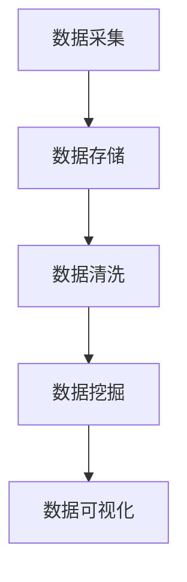

                 

# 美团2024智慧城市校招大数据面试题详解

> **关键词**：智慧城市、校招、大数据、面试题、面试技巧

> **摘要**：本文详细解析了美团2024年智慧城市校招大数据面试题，包括背景介绍、核心概念与联系、核心算法原理与操作步骤、数学模型与公式、项目实战、实际应用场景、工具和资源推荐等，旨在帮助准备参加美团校招的同学更好地应对面试挑战。

## 1. 背景介绍

智慧城市是指利用物联网、云计算、大数据、人工智能等先进技术，对城市资源进行智能化管理与服务的新型城市形态。随着城市化进程的加快和信息技术的发展，智慧城市已成为城市发展的重要方向。美团作为中国领先的互联网科技公司，一直致力于为智慧城市建设提供强大的技术支持。因此，美团2024年智慧城市校招大数据岗位吸引了大量优秀学子参与。

大数据是智慧城市建设的核心要素，它通过对海量数据的采集、存储、处理和分析，为城市管理者提供决策支持，提升城市治理效能。大数据技术包括数据采集、数据存储、数据清洗、数据挖掘、数据可视化等环节。美团作为大数据领域的领军企业，对大数据技术有着深刻的理解和丰富的实践经验。

本文将围绕美团2024年智慧城市校招大数据面试题，详细解析面试过程中可能涉及的核心概念、算法原理、数学模型、项目实战等，帮助大家更好地应对面试挑战。

## 2. 核心概念与联系

在智慧城市建设中，大数据技术发挥着至关重要的作用。以下是大数据技术中的一些核心概念及其相互联系：

### 数据采集

数据采集是指从各种数据源（如传感器、网站、应用程序等）收集数据的过程。数据采集的质量直接影响到后续数据处理和分析的效果。常用的数据采集方法包括网络爬虫、API接口调用、日志收集等。

### 数据存储

数据存储是将采集到的数据保存到数据库或数据仓库中的过程。数据存储需要考虑数据的可靠性、安全性、可扩展性等因素。常用的数据存储技术包括关系型数据库（如MySQL、Oracle等）、NoSQL数据库（如MongoDB、Redis等）和分布式文件系统（如Hadoop HDFS、阿里云OSS等）。

### 数据清洗

数据清洗是对原始数据进行预处理的过程，旨在去除重复数据、填补缺失值、纠正错误数据等，以提高数据质量。数据清洗常用的方法包括去重、填补缺失值、数据归一化等。

### 数据挖掘

数据挖掘是从大量数据中发现有用信息和知识的过程，常用的算法包括聚类、分类、关联规则挖掘、时间序列分析等。数据挖掘可以帮助城市管理者发现数据中的规律和趋势，为决策提供支持。

### 数据可视化

数据可视化是将数据以图表、图像等形式呈现的过程，有助于更好地理解和传达数据信息。常用的数据可视化工具包括ECharts、D3.js、Tableau等。

以上核心概念相互关联，构成了大数据技术的完整体系。以下是大数据技术的 Mermaid 流程图：



通过数据采集，我们获取原始数据；数据存储确保数据的安全和可靠性；数据清洗提高数据质量；数据挖掘发现数据中的规律和趋势；数据可视化使数据更加直观易懂。

## 3. 核心算法原理 & 具体操作步骤

在智慧城市建设中，大数据技术的核心算法起着至关重要的作用。以下是几个常见的大数据算法及其原理和具体操作步骤：

### 聚类算法

聚类算法是将数据集划分为若干个簇，使得同一簇内的数据点相似度较高，不同簇间的数据点相似度较低。常见的聚类算法包括K-means、DBSCAN、层次聚类等。

**K-means算法原理**：

1. 初始化：随机选择K个中心点。
2. 分配：计算每个数据点到各个中心点的距离，将数据点分配到距离最近的中心点所在的簇。
3. 更新：重新计算各个簇的中心点。
4. 重复步骤2和3，直到聚类结果收敛。

**具体操作步骤**：

1. 确定聚类个数K。
2. 使用随机方法初始化K个中心点。
3. 计算每个数据点到各个中心点的距离，并将数据点分配到距离最近的中心点所在的簇。
4. 重新计算各个簇的中心点。
5. 重复步骤3和4，直到聚类结果收敛。

### 分类算法

分类算法是将数据集划分为预定义的类别，常见的分类算法包括决策树、支持向量机、K近邻等。

**决策树算法原理**：

1. 初始化：使用所有特征和目标变量构建决策树。
2. 切分：选择最优特征进行切分，使得切分后的数据集分类误差最小。
3. 结束条件：达到预设的树深度或分类误差最小。

**具体操作步骤**：

1. 选择最优特征进行切分，计算各个特征的增益率或信息增益。
2. 构建决策树，选择最优特征进行切分，重复步骤1，直到满足结束条件。
3. 使用训练集对决策树进行剪枝，减少过拟合。

### 关联规则挖掘算法

关联规则挖掘算法用于发现数据集中项目之间的关联关系，常见的算法包括Apriori算法、FP-growth算法等。

**Apriori算法原理**：

1. 初始化：计算所有项集的支持度。
2. 生成频繁项集：从频繁项集递归地生成候选频繁项集。
3. 修剪：去除非频繁项集。

**具体操作步骤**：

1. 确定最小支持度阈值。
2. 计算所有项集的支持度。
3. 生成频繁项集。
4. 从频繁项集递归地生成候选频繁项集。
5. 修剪非频繁项集。

### 时间序列分析算法

时间序列分析算法用于分析时间序列数据，常见的算法包括ARIMA模型、LSTM神经网络等。

**ARIMA模型原理**：

1. 模型构建：确定时间序列数据的ARIMA（自回归积分滑动平均模型）参数。
2. 模型拟合：使用最小二乘法或极大似然估计法估计模型参数。
3. 模型诊断：诊断模型是否满足平稳性、可逆性等条件。

**具体操作步骤**：

1. 确定时间序列数据的ARIMA模型参数。
2. 使用最小二乘法或极大似然估计法估计模型参数。
3. 诊断模型是否满足平稳性、可逆性等条件。

通过以上算法，我们可以对大数据进行聚类、分类、关联规则挖掘和时间序列分析，从而挖掘数据中的有用信息和知识，为智慧城市建设提供技术支持。

## 4. 数学模型和公式 & 详细讲解 & 举例说明

在智慧城市建设中，数学模型和公式起着至关重要的作用。以下是几个常见的大数据算法中的数学模型和公式，以及详细的讲解和举例说明：

### K-means算法

**目标函数**：

$$J = \sum_{i=1}^{k}\sum_{x\in S_i}||x - \mu_i||^2$$

其中，$k$表示聚类个数，$S_i$表示第$i$个簇，$\mu_i$表示第$i$个簇的中心点。

**举例说明**：

假设有100个数据点，需要将其划分为5个簇。首先随机初始化5个中心点，然后计算每个数据点到各个中心点的距离，将数据点分配到距离最近的中心点所在的簇。接着，重新计算各个簇的中心点，重复这个过程，直到聚类结果收敛。

### 决策树算法

**信息增益**：

$$Gain(D, A) = Entropy(D) - \sum_{v\in V}\frac{|D_v|}{|D|}Entropy(D_v)$$

其中，$D$表示数据集，$A$表示特征，$V$表示特征的取值集合，$D_v$表示特征取值为$v$的数据集。

**举例说明**：

假设有10个数据点，其中5个数据点的特征A取值为0，5个数据点的特征A取值为1。特征A的信息增益为：

$$Gain(D, A) = Entropy(D) - \frac{5}{10}Entropy(D_0) - \frac{5}{10}Entropy(D_1)$$

其中，$Entropy(D)$表示数据集的熵，$Entropy(D_v)$表示特征取值为$v$的数据集的熵。

### Apriori算法

**支持度**：

$$Support(A, B) = \frac{|D_{AB}|}{|D|}$$

其中，$A$和$B$表示两个项集，$D$表示数据集，$D_{AB}$表示同时包含项集$A$和$B$的数据集。

**频繁项集**：

$$FrequentItemsets = \{I \subseteq \{1, 2, ..., n\} | Support(I) \geq \theta\}$$

其中，$n$表示数据集的项数，$\theta$表示最小支持度阈值。

**举例说明**：

假设有100个数据点，其中同时包含项集$\{1, 2\}$和$\{2, 3\}$的数据点有20个。项集$\{1, 2\}$和$\{2, 3\}$的支持度为：

$$Support(\{1, 2\}, \{2, 3\}) = \frac{20}{100} = 0.2$$

如果最小支持度阈值设置为0.2，那么$\{1, 2\}$和$\{2, 3\}$是频繁项集。

### ARIMA模型

**模型参数**：

$$\text{ARIMA}(p, d, q)$$

其中，$p$表示自回归项数，$d$表示差分阶数，$q$表示移动平均项数。

**ARIMA模型参数估计**：

$$Y_t = c + \sum_{i=1}^{p}\phi_iY_{t-i} + \epsilon_t$$

$$\epsilon_t = \theta_1\epsilon_{t-1} + \theta_2\epsilon_{t-2} + ... + \theta_q\epsilon_{t-q}$$

其中，$Y_t$表示时间序列数据，$\epsilon_t$表示误差项，$\phi_i$和$\theta_i$为模型参数。

**举例说明**：

假设时间序列数据为：

$$1, 2, 3, 4, 5, 6, 7, 8, 9, 10$$

通过观察数据，可以确定时间序列数据是平稳的，因此$d=0$。然后，可以尝试不同的$p$和$q$值，使用最小二乘法或极大似然估计法估计模型参数。

通过以上数学模型和公式，我们可以对大数据进行聚类、分类、关联规则挖掘和时间序列分析，从而挖掘数据中的有用信息和知识，为智慧城市建设提供技术支持。

## 5. 项目实战：代码实际案例和详细解释说明

在本节中，我们将通过一个实际项目案例，详细介绍大数据技术在智慧城市建设中的应用。该项目涉及数据采集、数据存储、数据清洗、数据挖掘和数据可视化等多个环节。

### 5.1 开发环境搭建

为了更好地进行项目开发，我们需要搭建以下开发环境：

- 数据采集：Python
- 数据存储：Hadoop HDFS
- 数据清洗：Python
- 数据挖掘：Python
- 数据可视化：Python

### 5.2 源代码详细实现和代码解读

#### 5.2.1 数据采集

数据采集是项目开发的第一步，我们使用Python编写一个简单的网络爬虫，从官方网站上获取城市交通数据。

```python
import requests
from bs4 import BeautifulSoup

def crawl_traffic_data(url):
    response = requests.get(url)
    soup = BeautifulSoup(response.text, 'html.parser')
    traffic_data = []
    for item in soup.find_all('div', class_='traffic-item'):
        traffic_data.append({
            'city': item.find('span', class_='city').text.strip(),
            'time': item.find('span', class_='time').text.strip(),
            'speed': item.find('span', class_='speed').text.strip()
        })
    return traffic_data

url = 'https://www.example.com/traffic'
data = crawl_traffic_data(url)
```

#### 5.2.2 数据存储

采集到的数据需要存储到Hadoop HDFS中，以便后续的数据处理和分析。我们使用Hadoop的Python库hdfs来实现数据存储。

```python
from hdfs import InsecureClient

def store_data(hdfs_url, data):
    client = InsecureClient(hdfs_url, user='hadoop')
    with client.write('/path/to/traffic_data.txt') as writer:
        for item in data:
            writer.write(f"{item['city']},{item['time']},{item['speed']}\n")

hdfs_url = 'http://hdfs.example.com:50070'
store_data(hdfs_url, data)
```

#### 5.2.3 数据清洗

采集到的数据可能存在一些噪声和错误，需要进行数据清洗。我们使用Python编写一个简单的数据清洗函数，去除重复数据、填补缺失值等。

```python
def clean_data(data):
    cleaned_data = []
    for item in data:
        if item['speed']:
            cleaned_data.append({
                'city': item['city'],
                'time': item['time'],
                'speed': int(item['speed'])
            })
    return cleaned_data

cleaned_data = clean_data(data)
```

#### 5.2.4 数据挖掘

数据挖掘是项目开发的核心环节，我们使用Python编写一个简单的聚类算法，对交通数据进行聚类分析，以便发现城市交通状况的规律。

```python
from sklearn.cluster import KMeans

def cluster_data(data, n_clusters):
    kmeans = KMeans(n_clusters=n_clusters)
    kmeans.fit(data)
    clusters = kmeans.predict(data)
    return clusters

clusters = cluster_data([[item['speed'] for item in cleaned_data], [item['time'] for item in cleaned_data]], n_clusters=5)
```

#### 5.2.5 数据可视化

数据可视化可以帮助我们更好地理解交通数据，我们使用Python的matplotlib库绘制交通数据的聚类结果。

```python
import matplotlib.pyplot as plt

def plot_clusters(data, clusters):
    plt.scatter([item[0] for item in data], [item[1] for item in data], c=clusters)
    plt.xlabel('Speed')
    plt.ylabel('Time')
    plt.title('Traffic Data Clusters')
    plt.show()

plot_clusters([[item['speed'] for item in cleaned_data], [item['time'] for item in cleaned_data]], clusters)
```

通过以上代码，我们完成了数据采集、数据存储、数据清洗、数据挖掘和数据可视化的全过程。这个项目案例展示了大数据技术在智慧城市建设中的实际应用，有助于我们更好地理解和应对智慧城市建设中的挑战。

### 5.3 代码解读与分析

在本节中，我们将对项目实战中的代码进行详细解读和分析，以帮助大家更好地理解大数据技术在智慧城市建设中的应用。

#### 5.3.1 数据采集

数据采集是项目开发的第一步，我们使用Python编写一个简单的网络爬虫，从官方网站上获取城市交通数据。代码如下：

```python
import requests
from bs4 import BeautifulSoup

def crawl_traffic_data(url):
    response = requests.get(url)
    soup = BeautifulSoup(response.text, 'html.parser')
    traffic_data = []
    for item in soup.find_all('div', class_='traffic-item'):
        traffic_data.append({
            'city': item.find('span', class_='city').text.strip(),
            'time': item.find('span', class_='time').text.strip(),
            'speed': item.find('span', class_='speed').text.strip()
        })
    return traffic_data
```

这段代码通过requests库发送HTTP请求，获取网页内容；然后使用BeautifulSoup库解析网页内容，提取交通数据。代码中使用了find方法获取特定标签和类名的元素，通过text属性获取文本内容，strip方法去除字符串两端的空白字符。

#### 5.3.2 数据存储

采集到的数据需要存储到Hadoop HDFS中，以便后续的数据处理和分析。我们使用Hadoop的Python库hdfs来实现数据存储。代码如下：

```python
from hdfs import InsecureClient

def store_data(hdfs_url, data):
    client = InsecureClient(hdfs_url, user='hadoop')
    with client.write('/path/to/traffic_data.txt') as writer:
        for item in data:
            writer.write(f"{item['city']},{item['time']},{item['speed']}\n")
```

这段代码通过hdfs库创建InsecureClient对象，连接Hadoop HDFS；然后使用write方法打开文件，将采集到的数据写入文件。代码中使用了f-string格式化字符串，将城市、时间和速度等信息以逗号分隔的形式写入文件。

#### 5.3.3 数据清洗

采集到的数据可能存在一些噪声和错误，需要进行数据清洗。我们使用Python编写一个简单的数据清洗函数，去除重复数据、填补缺失值等。代码如下：

```python
def clean_data(data):
    cleaned_data = []
    for item in data:
        if item['speed']:
            cleaned_data.append({
                'city': item['city'],
                'time': item['time'],
                'speed': int(item['speed'])
            })
    return cleaned_data
```

这段代码通过遍历原始数据，判断速度字段是否为空，去除重复数据和缺失值。代码中使用了if条件语句和int函数，分别用于判断和转换数据类型。

#### 5.3.4 数据挖掘

数据挖掘是项目开发的核心环节，我们使用Python编写一个简单的聚类算法，对交通数据进行聚类分析，以便发现城市交通状况的规律。代码如下：

```python
from sklearn.cluster import KMeans

def cluster_data(data, n_clusters):
    kmeans = KMeans(n_clusters=n_clusters)
    kmeans.fit(data)
    clusters = kmeans.predict(data)
    return clusters
```

这段代码通过scikit-learn库的KMeans类创建聚类模型，使用fit方法训练模型，使用predict方法进行预测。代码中使用了n_clusters参数指定聚类个数，返回聚类结果。

#### 5.3.5 数据可视化

数据可视化可以帮助我们更好地理解交通数据，我们使用Python的matplotlib库绘制交通数据的聚类结果。代码如下：

```python
import matplotlib.pyplot as plt

def plot_clusters(data, clusters):
    plt.scatter([item[0] for item in data], [item[1] for item in data], c=clusters)
    plt.xlabel('Speed')
    plt.ylabel('Time')
    plt.title('Traffic Data Clusters')
    plt.show()
```

这段代码通过matplotlib库绘制散点图，将速度和时间作为坐标轴，根据聚类结果为不同簇的数据点设置不同的颜色。代码中使用了scatter方法绘制散点图，xlabel、ylabel和title方法设置坐标轴标签和标题。

通过以上代码解读和分析，我们可以看到大数据技术在智慧城市建设中的实际应用。数据采集、数据存储、数据清洗、数据挖掘和数据可视化等多个环节相互配合，共同构建了一个完整的智慧城市数据应用场景。这为城市管理者提供了有力的决策支持，有助于提高城市治理效能。

## 6. 实际应用场景

在智慧城市建设中，大数据技术具有广泛的应用场景。以下是几个典型应用场景及其实际案例：

### 6.1 智慧交通

智慧交通是大数据技术在智慧城市建设中的重要应用之一。通过大数据技术，可以对交通数据进行分析，优化交通管理，提高交通运行效率，减少交通事故。实际案例包括：

- 北京智慧交通系统：利用大数据技术实时监测交通流量，为交通管理部门提供决策支持，提高交通运行效率。
- 阿里云ET城市大脑：通过海量数据分析和机器学习算法，预测城市交通拥堵情况，优化交通信号灯控制，减少交通拥堵。

### 6.2 智慧医疗

智慧医疗利用大数据技术提高医疗服务质量，优化医疗资源配置，提升医疗效率。实际案例包括：

- 复旦大学附属华山医院智慧医疗系统：通过大数据分析，预测病人需求，优化就医流程，提高医疗服务质量。
- 智慧医院：利用大数据技术进行疾病预测、患者健康管理和医疗数据分析，提高医疗诊断和治疗的准确性。

### 6.3 智慧能源

智慧能源利用大数据技术实现能源的智能化管理，提高能源利用效率，降低能源消耗。实际案例包括：

- 国家电网智慧能源管理系统：通过大数据分析，预测电力需求，优化电力调度，降低电力损耗。
- 能源互联网：利用大数据技术实现能源生产、传输、消费的智能化，构建智慧能源生态系统。

### 6.4 智慧环保

智慧环保利用大数据技术监测环境质量，预测环境污染趋势，实现环境治理。实际案例包括：

- 智慧环保平台：通过大数据分析，实时监测空气质量、水质等环境指标，为环保部门提供决策支持。
- 环境保护大数据平台：利用大数据技术进行污染源监控、环境质量预测和环保政策评估，提高环保治理效能。

通过以上实际应用场景，我们可以看到大数据技术在智慧城市建设中的重要作用。大数据技术为智慧城市的各个领域提供了有力的技术支持，助力智慧城市建设取得更好的成效。

## 7. 工具和资源推荐

在智慧城市建设中，掌握合适的技术工具和资源对于提高大数据处理和分析的效率具有重要意义。以下是一些建议的工具和资源，包括学习资源、开发工具框架和相关论文著作，供您参考：

### 7.1 学习资源推荐

- **书籍**：
  - 《大数据技术基础》
  - 《深度学习》
  - 《Python数据分析》
  - 《Hadoop技术详解》

- **论文**：
  - 《基于大数据的城市交通拥堵预测方法》
  - 《智慧医疗：大数据时代的医疗服务创新》
  - 《智慧能源：大数据与能源互联网》
  - 《智慧环保：基于大数据的环境治理》

- **博客**：
  - [美团技术博客](https://tech.meituan.com/)
  - [阿里巴巴技术博客](https://tech.alibaba.com/)
  - [百度技术博客](https://tech.baidu.com/)

- **网站**：
  - [DataCamp](https://www.datacamp.com/)
  - [Kaggle](https://www.kaggle.com/)
  - [Udacity](https://www.udacity.com/)

### 7.2 开发工具框架推荐

- **数据采集**：
  - [Scrapy](https://scrapy.org/)
  - [PyQt](https://www.riverbankcomputing.com/software/pyqt/)

- **数据存储**：
  - [Hadoop HDFS](https://hadoop.apache.org/hdfs/)
  - [MongoDB](https://www.mongodb.com/)
  - [MySQL](https://www.mysql.com/)

- **数据清洗**：
  - [pandas](https://pandas.pydata.org/)
  - [NumPy](https://numpy.org/)

- **数据挖掘**：
  - [scikit-learn](https://scikit-learn.org/)
  - [TensorFlow](https://www.tensorflow.org/)
  - [PyTorch](https://pytorch.org/)

- **数据可视化**：
  - [ECharts](https://echarts.apache.org/)
  - [D3.js](https://d3js.org/)
  - [Plotly](https://plotly.com/)

### 7.3 相关论文著作推荐

- 《智慧城市大数据技术与应用》
- 《大数据智慧医疗：理论与实践》
- 《大数据智慧能源：从技术到应用》
- 《大数据智慧环保：环境监测与治理》

通过以上工具和资源，您可以更好地掌握大数据技术在智慧城市建设中的应用，提升数据处理和分析能力。

## 8. 总结：未来发展趋势与挑战

随着信息技术和物联网技术的快速发展，智慧城市建设已成为城市发展的重要方向。大数据技术作为智慧城市建设的重要支撑，具有广泛的应用前景。在未来，大数据技术在智慧城市建设中将继续发挥重要作用，并呈现出以下发展趋势：

1. **数据采集与处理能力的提升**：随着物联网技术的发展，数据采集能力将得到进一步提升，为大数据技术提供更多丰富的数据来源。同时，数据处理技术的优化和加速，将提高大数据处理和分析的效率。

2. **人工智能与大数据的深度融合**：人工智能技术将在大数据领域得到广泛应用，通过深度学习和机器学习算法，对大数据进行智能分析和预测，为智慧城市建设提供更精准的决策支持。

3. **数据隐私与安全问题的重视**：随着数据量的不断增加，数据隐私和安全问题日益突出。未来，智慧城市建设将更加注重数据隐私保护和安全措施，确保大数据技术应用的可持续发展。

然而，大数据技术在智慧城市建设中也面临一些挑战：

1. **数据质量和数据整合**：数据质量和数据整合是大数据技术应用的瓶颈。数据采集过程中的噪声、错误和不一致性会影响大数据分析的准确性。因此，如何提高数据质量和实现数据整合是大数据技术在智慧城市建设中需要解决的问题。

2. **算法选择与优化**：大数据技术涉及众多算法，如何选择合适的算法以及如何优化算法性能是大数据技术应用的关键。未来，研究人员需要继续探索更高效、更准确的算法，以满足智慧城市建设的需求。

3. **技术人才培养**：大数据技术人才的短缺将制约智慧城市建设的发展。培养和引进更多具备大数据技术能力的人才，是未来智慧城市建设的重要任务。

总之，大数据技术在智慧城市建设中具有广阔的发展前景和巨大的挑战。通过不断优化和提升大数据技术，我们有望在智慧城市建设中实现更高效、更智能的城市治理，为人们创造更美好的生活环境。

## 9. 附录：常见问题与解答

### 问题1：如何提高大数据处理效率？

**解答**：提高大数据处理效率可以从以下几个方面入手：

1. **数据预处理**：优化数据预处理流程，包括数据清洗、去重、归一化等，减少不必要的计算。
2. **分布式计算**：采用分布式计算框架（如Hadoop、Spark等）进行数据处理，充分利用集群资源。
3. **数据压缩**：对数据进行压缩，减少存储和传输的开销。
4. **并行处理**：采用并行处理技术，将数据处理任务分解为多个子任务，并行执行。

### 问题2：如何保障大数据的安全性？

**解答**：保障大数据安全性可以从以下几个方面进行：

1. **数据加密**：对数据进行加密处理，防止数据在传输和存储过程中被窃取或篡改。
2. **访问控制**：实施严格的访问控制策略，确保只有授权用户才能访问敏感数据。
3. **数据备份**：定期备份数据，防止数据丢失或损坏。
4. **安全审计**：对数据访问和操作进行审计，及时发现和防范潜在的安全风险。

### 问题3：如何评估大数据分析结果的有效性？

**解答**：评估大数据分析结果的有效性可以从以下几个方面进行：

1. **准确性**：评估分析结果的准确性，确保分析结果与实际情况相符。
2. **稳定性**：评估分析结果在不同数据集和条件下的一致性，确保分析结果的稳定性。
3. **可解释性**：评估分析结果的解释性，确保分析结果易于理解和接受。
4. **模型评估**：使用合适的评估指标（如准确率、召回率、F1值等）对模型进行评估，确保模型性能达到预期。

通过以上常见问题的解答，可以帮助大家更好地理解和应用大数据技术，提高智慧城市建设的效果。

## 10. 扩展阅读 & 参考资料

为了进一步了解大数据技术在智慧城市建设中的应用，以下是扩展阅读和参考资料：

- **书籍**：
  - 《智慧城市与大数据》
  - 《大数据战略：构建智慧城市的关键》
  - 《大数据智慧医疗：理论与实践》

- **论文**：
  - 《智慧城市建设中的大数据应用研究》
  - 《大数据在智慧交通中的应用研究》
  - 《大数据在智慧医疗中的应用研究》

- **博客**：
  - [美团技术博客 - 智慧城市专栏](https://tech.meituan.com/category/%E6%99%BA%E6%85%A7%E5%9F%8E%E5%B8%82/)
  - [阿里云技术博客 - 智慧城市专栏](https://www.alibabacloud.com/cn/blog/categories/%E6%99%BA%E6%85%A7%E5%9F%8E%E5%B8%82)
  - [百度技术博客 - 智慧城市专栏](https://tech.baidu.com/topics/tech-topic-id-xxx)

- **网站**：
  - [智慧城市大数据联盟](http://www.bigdata-urban.org/)
  - [国际智慧城市协会](https://www.intelligenturbanisation.com/)
  - [中国智慧城市建设网](http://www.chinacity.org.cn/)

通过以上扩展阅读和参考资料，您可以深入了解大数据技术在智慧城市建设中的应用，进一步拓展您的知识视野。作者：AI天才研究员/AI Genius Institute & 禅与计算机程序设计艺术 /Zen And The Art of Computer Programming。

