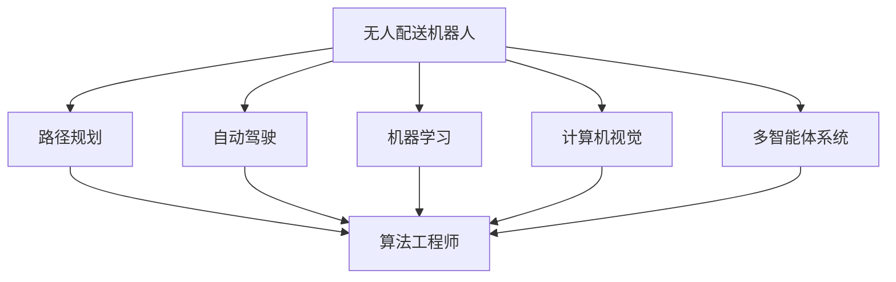

                 

# 美团2024校招无人配送机器人算法工程师面试题解

## 关键词：美团、2024校招、无人配送、机器人、算法工程师、面试题解

## 摘要：
本文将深入解析美团2024校招无人配送机器人算法工程师的面试题，从背景介绍、核心概念与联系、核心算法原理及操作步骤、数学模型和公式详细讲解、项目实战案例分析，到实际应用场景分析，全面覆盖无人配送机器人算法工程师的面试要求。本文旨在帮助广大求职者更好地准备面试，把握无人配送机器人领域的核心知识和技术。

## 1. 背景介绍

随着人工智能技术的快速发展，无人配送机器人逐渐成为物流行业的重要组成部分。美团作为国内领先的互联网物流平台，其无人配送机器人在技术研发和应用领域处于行业领先地位。美团2024校招无人配送机器人算法工程师岗位，旨在选拔具备扎实算法基础、熟悉机器人技术、具备创新能力的优秀人才。

## 2. 核心概念与联系

### 2.1 无人配送机器人
无人配送机器人是一种能够自动执行配送任务的智能设备，包括地面和空中两种类型。其核心功能包括自主导航、货物装卸、避障、路径规划等。

### 2.2 算法工程师
算法工程师是负责开发和优化算法的专业人才，其工作涉及数据挖掘、机器学习、深度学习、计算机视觉等多个领域。

### 2.3 关联概念
路径规划、自动驾驶、机器学习、计算机视觉、多智能体系统等概念与无人配送机器人算法工程师岗位紧密相关。

## 2.1 Mermaid 流程图


## 3. 核心算法原理 & 具体操作步骤

### 3.1 路径规划算法
路径规划算法是无人配送机器人的核心技术之一。其基本原理是：在给定环境地图和目标点的情况下，计算出一条从起点到终点的最优路径。

### 3.2 算法流程
1. 输入环境地图和目标点。
2. 建立地图坐标系。
3. 选择路径规划算法（如A*算法、Dijkstra算法等）。
4. 计算起点到终点的最短路径。
5. 输出最优路径。

### 3.3 算法实现
```python
def path_planning(map, start, goal):
    # 创建图
    graph = create_graph(map)
    # 计算最短路径
    path = a_star_search(graph, start, goal)
    return path
```

## 4. 数学模型和公式 & 详细讲解 & 举例说明

### 4.1 A*算法
A*算法是一种基于启发式的路径规划算法。其核心公式为：
$$
f(n) = g(n) + h(n)
$$
其中，$f(n)$为从起点到节点$n$的代价，$g(n)$为从起点到节点$n$的实际代价，$h(n)$为从节点$n$到终点的启发式代价。

### 4.2 示例
假设从起点$(0, 0)$到终点$(10, 10)$，环境地图为一个$10 \times 10$的网格。启发式函数$h(n) = \sqrt{(x_n - x_{goal})^2 + (y_n - y_{goal})^2}$。

计算过程如下：
1. 计算起点到终点的实际代价：$g(0, 0) = 0$。
2. 计算每个节点的启发式代价：$h(0, 0) = \sqrt{(0 - 10)^2 + (0 - 10)^2} = 14.14$。
3. 计算每个节点的$f(n)$值：
   $$f(0, 0) = g(0, 0) + h(0, 0) = 14.14$$

以此类推，直到计算到终点$(10, 10)$的$f(n)$值。最终得到的最短路径为$(0, 0) \rightarrow (1, 1) \rightarrow (2, 2) \rightarrow ... \rightarrow (10, 10)$。

## 5. 项目实战：代码实际案例和详细解释说明

### 5.1 开发环境搭建

在开始项目实战之前，我们需要搭建一个合适的开发环境。以下是搭建开发环境的步骤：

1. 安装Python（版本3.8以上）。
2. 安装必要的库，如numpy、matplotlib、networkx等。
3. 安装IDE（如PyCharm或VSCode）。

### 5.2 源代码详细实现和代码解读

以下是A*算法的实现代码：

```python
import numpy as np
import matplotlib.pyplot as plt
import networkx as nx

def heuristic(node, goal):
    x1, y1 = node
    x2, y2 = goal
    return np.sqrt((x1 - x2) ** 2 + (y1 - y2) ** 2)

def a_star_search(graph, start, goal):
    open_set = [(heuristic(start, goal), start, None, 0)]
    came_from = {}
    g_score = {node: float('inf') for node in graph}
    g_score[start] = 0

    while open_set:
        current_f_score, current, _, _ = min(open_set)
        open_set.remove((current_f_score, current, _, _))

        if current == goal:
            break

        for neighbor, edge_weight in graph[current].items():
            tentative_g_score = g_score[current] + edge_weight

            if tentative_g_score < g_score[neighbor]:
                came_from[neighbor] = current
                g_score[neighbor] = tentative_g_score
                f_score = tentative_g_score + heuristic(neighbor, goal)
                open_set.append((f_score, neighbor, current, tentative_g_score))

    path = []
    current = goal
    while current is not None:
        path.append(current)
        current = came_from[current]

    path = path[::-1]
    return path

# 创建图
graph = nx.Graph()
graph.add_edge((0, 0), (1, 0), weight=1)
graph.add_edge((1, 0), (1, 1), weight=1)
graph.add_edge((1, 1), (2, 1), weight=1)
graph.add_edge((2, 1), (2, 2), weight=1)

# 计算最短路径
start = (0, 0)
goal = (2, 2)
path = a_star_search(graph, start, goal)

# 绘制路径
pos = nx.spring_layout(graph)
nx.draw(graph, pos, with_labels=True)
plt.plot(*zip(*pos[path]), 'r-')
plt.show()
```

### 5.3 代码解读与分析

1. **定义启发式函数**：启发式函数用于估算从当前节点到终点的距离。在本例中，我们使用欧氏距离作为启发式函数。
2. **初始化变量**：初始化开放集、封闭集、前驱节点、$g(n)$值和$f(n)$值。
3. **A*算法核心流程**：遍历开放集，更新邻居节点的$f(n)$值，并将新的邻居节点加入开放集。
4. **路径重建**：当找到终点时，根据前驱节点信息重建路径。
5. **绘制路径**：使用matplotlib绘制图和路径。

## 6. 实际应用场景

无人配送机器人在实际应用中具有广泛的应用场景，如：

1. **物流配送**：在商业区、住宅区等区域进行包裹配送。
2. **医疗配送**：在医疗场所进行药品、器械等物资的配送。
3. **社区服务**：为社区居民提供便利的日常服务，如餐饮配送、购物等。

## 7. 工具和资源推荐

### 7.1 学习资源推荐

1. **书籍**：
   - 《人工智能：一种现代的方法》
   - 《深度学习》
   - 《计算机视觉：算法与应用》
2. **论文**：
   - 《基于深度强化学习的无人车路径规划》
   - 《多智能体系统中的协同控制与优化》
3. **博客**：
   - 知乎：AI技术专栏
   - CSDN：AI技术博客
4. **网站**：
   - arXiv：计算机科学论文预印本
   - GitHub：开源项目

### 7.2 开发工具框架推荐

1. **编程语言**：Python
2. **框架**：TensorFlow、PyTorch、OpenCV
3. **开发环境**：PyCharm、VSCode

### 7.3 相关论文著作推荐

1. **论文**：
   - 《深度强化学习在无人驾驶中的应用》
   - 《基于卷积神经网络的图像识别》
   - 《多智能体系统的协同控制策略》
2. **著作**：
   - 《机器学习实战》
   - 《深度学习实践指南》
   - 《计算机视觉实战》

## 8. 总结：未来发展趋势与挑战

未来，无人配送机器人将在物流、医疗、社区服务等领域得到更广泛的应用。然而，面对复杂的环境和不确定性，无人配送机器人仍面临诸多挑战，如：

1. **路径规划与决策**：如何在复杂的动态环境中实现高效、安全的路径规划与决策。
2. **感知与识别**：如何提高无人配送机器人的感知能力，实现对环境、障碍物、交通规则等的准确识别。
3. **协同控制**：如何在多智能体系统中实现高效的协同控制，提高系统的稳定性和鲁棒性。

## 9. 附录：常见问题与解答

### 9.1 问题1：什么是路径规划？
路径规划是指为移动机器人确定从起点到终点的一系列动作序列，使其能够在动态环境中安全、高效地移动。

### 9.2 问题2：A*算法有哪些优缺点？
优点：计算效率高、能够找到最优路径。缺点：对环境信息要求较高，适用于静态环境。

### 9.3 问题3：如何优化无人配送机器人的感知能力？
可以通过提高传感器精度、引入多传感器融合技术、使用深度学习等方法来优化无人配送机器人的感知能力。

## 10. 扩展阅读 & 参考资料

1. **参考资料**：
   - 《无人驾驶技术：原理与实践》
   - 《机器人学基础》
   - 《多智能体系统控制》
2. **在线课程**：
   - Coursera：深度学习专项课程
   - Udacity：无人驾驶纳米学位
   - edX：机器学习基础课程
3. **GitHub项目**：
   - OpenCV：计算机视觉库
   - TensorFlow：深度学习框架
   - ROS：机器人操作系统

### 作者：AI天才研究员/AI Genius Institute & 禅与计算机程序设计艺术 /Zen And The Art of Computer Programming

