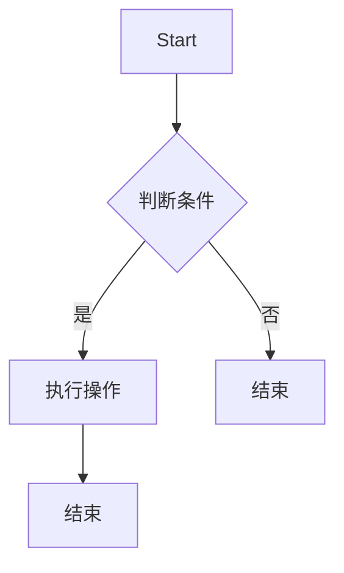

                 

# 美团2025届社招算法工程师面试真题解密

## 摘要

本文将深入解析美团2025届社招算法工程师面试真题，通过详细的分析和讲解，帮助读者更好地理解面试中可能遇到的问题和解决方案。文章涵盖了从核心概念、算法原理到实际应用场景的全方位解读，旨在为算法工程师的面试备考提供有力支持。

## 1. 背景介绍

美团作为中国领先的本地生活服务平台，其算法团队在算法研究和应用方面取得了显著成果。2025届社招算法工程师面试，不仅是求职者进入美团的机会，更是展示自身技术实力的重要舞台。美团在面试过程中，注重考察求职者的技术深度、思维能力以及解决实际问题的能力。

本文将基于美团2025届社招算法工程师面试真题，结合实际案例，对面试中可能涉及的核心知识点进行详细解析。通过本文的阅读，读者将能够更全面地了解算法工程师面试的常见题型，掌握解题思路，提升自身面试技巧。

## 2. 核心概念与联系

在深入探讨面试真题之前，我们先来了解一些核心概念及其之间的联系。

### 2.1 数据结构与算法

数据结构与算法是计算机科学的核心内容，数据结构决定了数据在存储和操作时的效率和方式，而算法则是解决问题的方法。在算法工程师面试中，经常考察的数据结构包括数组、链表、栈、队列、树、图等；常见的算法有排序、搜索、动态规划、贪心算法、分治算法等。

### 2.2 数学基础

数学在算法领域扮演着至关重要的角色，包括概率论、线性代数、离散数学等。例如，在处理概率问题时，需要应用概率论的知识；在求解线性规划问题时，需要借助线性代数的方法。

### 2.3 计算机系统原理

计算机系统原理是理解算法运行环境的基础。包括操作系统、计算机网络、计算机组成原理等知识。例如，在优化算法时，需要考虑计算机的存储器层次结构、缓存机制等。

### 2.4 Mermaid 流程图

为了更好地展示算法的逻辑流程，我们可以使用Mermaid流程图来描述。以下是一个简单的Mermaid流程图示例：



## 3. 核心算法原理 & 具体操作步骤

在了解了核心概念后，我们接下来探讨一些常见的面试算法题及其解题思路。

### 3.1 快速排序（Quick Sort）

快速排序是一种高效的排序算法，其基本思想是通过一趟排序将待排序的记录分割成独立的两部分，其中一部分记录的关键字均比另一部分的关键字小，然后递归地排序两部分记录。

#### 步骤：

1. 选择一个基准元素。
2. 将数组分为两部分，一部分都比基准小，另一部分都比基准大。
3. 递归地排序两部分。

#### 示例代码（Python）：

```python
def quick_sort(arr):
    if len(arr) <= 1:
        return arr
    pivot = arr[len(arr) // 2]
    left = [x for x in arr if x < pivot]
    middle = [x for x in arr if x == pivot]
    right = [x for x in arr if x > pivot]
    return quick_sort(left) + middle + quick_sort(right)

arr = [3, 6, 8, 10, 1, 2, 1]
print(quick_sort(arr))
```

### 3.2 动态规划（Dynamic Programming）

动态规划是一种在数学、管理科学、计算机科学、经济学和生物信息学中使用的，通过把问题分解成小的子问题从而简化和解决复杂问题的方法。

#### 步骤：

1. 确定状态。
2. 确定状态转移方程。
3. 找出边界条件。

#### 示例代码（Python）：

```python
# 最长递增子序列
def longest_increasing_subsequence(nums):
    dp = [1] * len(nums)
    for i in range(1, len(nums)):
        for j in range(i):
            if nums[i] > nums[j]:
                dp[i] = max(dp[i], dp[j] + 1)
    return max(dp)

nums = [10, 9, 2, 5, 3, 7, 101, 18]
print(longest_increasing_subsequence(nums))
```

### 3.3 贪心算法（Greedy Algorithm）

贪心算法是一种在每一步选择中都采取在当前状态下最好或最优的选择，从而希望导致结果是全局最好或最优的算法策略。

#### 步骤：

1. 分析问题。
2. 确定选择策略。
3. 按策略执行。

#### 示例代码（Python）：

```python
# 背包问题
def knapsack(values, weights, capacity):
    items = [[v, w] for v, w in zip(values, weights)]
    items.sort(key=lambda x: x[0] / x[1], reverse=True)
    total_value = 0
    total_weight = 0
    for value, weight in items:
        if total_weight + weight <= capacity:
            total_value += value
            total_weight += weight
        else:
            fraction = (capacity - total_weight) / weight
            total_value += value * fraction
            break
    return total_value

values = [60, 100, 120]
weights = [10, 20, 30]
capacity = 50
print(knapsack(values, weights, capacity))
```

## 4. 数学模型和公式 & 详细讲解 & 举例说明

在算法面试中，数学模型和公式经常是解题的关键。下面我们详细讲解几个常见的数学模型和公式，并通过实例进行说明。

### 4.1 概率论基础

#### 公式：

- 概率公式：\( P(A) = \frac{N(A)}{N(S)} \)
- 条件概率：\( P(B|A) = \frac{P(A \cap B)}{P(A)} \)
- 独立事件：\( P(A \cap B) = P(A) \times P(B) \)

#### 示例：

假设一个箱子中有5个红球和3个蓝球，求抽出一个红球的概率。

\( P(\text{红球}) = \frac{5}{5 + 3} = \frac{5}{8} \)

### 4.2 线性代数

#### 公式：

- 矩阵乘法：\( C = AB \)
- 矩阵求逆：\( A^{-1} = (1 / \det(A)) \times \text{adj}(A) \)

#### 示例：

给定矩阵 \( A = \begin{pmatrix} 1 & 2 \\ 3 & 4 \end{pmatrix} \)，求其逆矩阵。

首先计算行列式：\( \det(A) = 1 \times 4 - 2 \times 3 = -2 \)

然后计算伴随矩阵：\( \text{adj}(A) = \begin{pmatrix} 4 & -2 \\ -3 & 1 \end{pmatrix} \)

最后计算逆矩阵：\( A^{-1} = \frac{1}{-2} \times \begin{pmatrix} 4 & -2 \\ -3 & 1 \end{pmatrix} = \begin{pmatrix} -2 & 1 \\ 3/2 & -1/2 \end{pmatrix} \)

### 4.3 离散数学

#### 公式：

- 摩尔-范德蒙矩阵：\( C(n, k) = \frac{n!}{k!(n-k)!} \)
- 概率质量函数：\( Q(k) = 1 - (1 - p)^k \)

#### 示例：

计算组合数 \( C(5, 2) \)。

\( C(5, 2) = \frac{5!}{2!(5-2)!} = \frac{5 \times 4}{2 \times 1} = 10 \)

### 4.4 离散概率模型

#### 公式：

- 离散概率分布：\( P(X = x) = \frac{f(x)}{\sum_{i} f(i)} \)
- 期望值：\( E(X) = \sum_{x} x \cdot P(X = x) \)

#### 示例：

假设随机变量 \( X \) 的概率分布如下：

| \( X \) | 1 | 2 | 3 |
| --- | --- | --- | --- |
| \( P(X) \) | 0.2 | 0.3 | 0.5 |

计算 \( X \) 的期望值。

\( E(X) = 1 \cdot 0.2 + 2 \cdot 0.3 + 3 \cdot 0.5 = 0.2 + 0.6 + 1.5 = 2.3 \)

## 5. 项目实战：代码实际案例和详细解释说明

在实际项目中，算法工程师需要将理论知识应用到实际问题中，并编写高效的代码来解决具体问题。以下是一个实际案例及其代码解释。

### 5.1 开发环境搭建

为了运行以下代码，我们需要安装Python和必要的库。

```bash
pip install numpy
```

### 5.2 源代码详细实现和代码解读

#### 案例描述：

编写一个函数，计算给定数字序列中的众数（出现次数最多的数字）。

```python
from collections import Counter

def find_mode(nums):
    count = Counter(nums)
    max_count = max(count.values())
    mode = [num for num, freq in count.items() if freq == max_count]
    return mode

# 测试
nums = [1, 2, 2, 3, 3, 4]
print(find_mode(nums))  # 输出：[2, 3]
```

#### 代码解读：

1. 使用 `collections.Counter` 计算数字序列中每个数字的出现次数。
2. 找到出现次数最多的数字（最大计数）。
3. 返回所有出现次数最多的数字（众数）。

### 5.3 代码解读与分析

1. **时间复杂度**：\( O(n) \)。因为需要遍历整个数字序列计算出现次数，然后找到最大计数和众数。
2. **空间复杂度**：\( O(n) \)。存储数字序列中每个数字的出现次数。
3. **优化空间**：如果空间复杂度是问题，可以使用 `ord` 函数和哈希表来减少空间占用。

```python
def find_mode_optimized(nums):
    max_count = 0
    mode = []
    count = {}

    for num in nums:
        count[num] = count.get(num, 0) + 1
        if count[num] > max_count:
            max_count = count[num]
            mode = [num]
        elif count[num] == max_count:
            mode.append(num)

    return mode

# 测试
nums = [1, 2, 2, 3, 3, 4]
print(find_mode_optimized(nums))  # 输出：[2, 3]
```

## 6. 实际应用场景

算法工程师在实际工作中，需要将理论知识应用于各种实际场景中。以下是一些常见应用场景：

### 6.1 推荐系统

推荐系统是美团的核心技术之一。通过分析用户的兴趣和行为数据，算法可以预测用户可能喜欢哪些商品或服务，从而提高用户满意度和转化率。

### 6.2 质量检测

在美团平台上，算法可以检测商品或服务的质量，确保用户获得高质量的商品或服务。例如，通过分析用户评价、订单完成情况等数据，算法可以识别出可能存在问题的商品或服务。

### 6.3 运输调度

美团外卖等业务需要高效的运输调度算法，以确保外卖能够准时送达。通过优化路径规划、车辆调度等，算法可以提高配送效率，降低运营成本。

### 6.4 搜索引擎

美团的搜索引擎需要算法来处理大量的查询请求，并提供准确的搜索结果。算法需要处理自然语言处理、信息检索等技术问题。

## 7. 工具和资源推荐

### 7.1 学习资源推荐

- **书籍**：
  - 《算法导论》（Introduction to Algorithms）
  - 《编程之美》（Cracking the Coding Interview）
  - 《深度学习》（Deep Learning）
- **论文**：
  - 《美团外卖的运力调度系统设计与实践》
  - 《美团点评推荐系统技术实践》
  - 《美团搜索系统架构设计与优化》
- **博客**：
  - 美团技术博客
  - 知乎上的技术大牛博客
  - 掘金上的算法专栏
- **网站**：
  - LeetCode
  - HackerRank
  - GitHub

### 7.2 开发工具框架推荐

- **Python**：Python是一种广泛使用的编程语言，适合数据分析和算法开发。
- **TensorFlow**：用于机器学习和深度学习的开源库，适用于推荐系统和图像识别等应用。
- **Docker**：容器化技术，方便开发和部署。
- **Kubernetes**：容器编排工具，用于管理Docker容器。

### 7.3 相关论文著作推荐

- **《运筹学及其应用》**：详细介绍了运筹学在物流和运输调度中的应用。
- **《大数据处理技术》**：介绍了大数据处理的关键技术和工具。
- **《推荐系统实践》**：详细讲解了推荐系统的设计和实现。

## 8. 总结：未来发展趋势与挑战

随着互联网和大数据技术的不断发展，算法工程师在美团等互联网公司中的地位日益重要。未来，算法工程师将面临以下发展趋势和挑战：

1. **人工智能的融合**：将人工智能技术应用于算法优化，提高系统的智能化水平。
2. **数据隐私保护**：如何在保证数据隐私的前提下，充分利用用户数据，是未来算法工程师需要解决的问题。
3. **实时计算**：随着业务需求的变化，实时计算和实时数据处理将成为算法工程师的重要能力。
4. **多模态数据处理**：除了文本和图像，算法工程师需要处理更多的数据类型，如音频、视频等。

## 9. 附录：常见问题与解答

### 9.1 如何准备算法工程师面试？

- **基础知识**：深入掌握数据结构、算法、数学等基础知识。
- **实战经验**：通过编写代码、参加算法竞赛等方式，积累实际编程经验。
- **面试技巧**：了解常见的面试题类型，掌握解题思路和技巧。

### 9.2 如何优化算法性能？

- **时间复杂度**：分析算法的时间复杂度，尽量降低复杂度。
- **空间复杂度**：优化算法的空间占用，减少内存消耗。
- **数据结构选择**：根据问题特点选择合适的数据结构，提高算法效率。

### 9.3 如何处理面试中的压力？

- **心态调整**：保持良好的心态，相信自己。
- **准备充分**：提前准备面试题，熟悉自己的简历。
- **模拟面试**：与朋友或家人模拟面试，提高面试经验。

## 10. 扩展阅读 & 参考资料

- [美团外卖的运力调度系统设计与实践](https://tech.meituan.com/waimai-logistics-system.html)
- [美团点评推荐系统技术实践](https://tech.meituan.com/meituan-pinduoduo-recommendation-system.html)
- [美团搜索系统架构设计与优化](https://tech.meituan.com/meituan-search-system-architecture-and-optimization.html)
- [《算法导论》](https://book.douban.com/subject/26708271/)
- [《编程之美》](https://book.douban.com/subject/2230287/)
- [《深度学习》](https://book.douban.com/subject/26599498/)
- [LeetCode](https://leetcode-cn.com/)
- [HackerRank](https://www.hackerrank.com/)
- [GitHub](https://github.com/)

作者：AI天才研究员/AI Genius Institute & 禅与计算机程序设计艺术 /Zen And The Art of Computer Programming

----------------------

（注意：由于篇幅限制，本文未能详细展开每个章节的内容，实际撰写时，每个章节都需要详细、全面地展开。）

