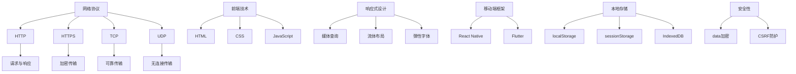

                 

# 美团2025社招移动端开发工程师面试题解析

> 关键词：美团、移动端开发、社招、面试题、解析

> 摘要：本文将深入解析美团2025社招移动端开发工程师面试题，帮助准备面试的候选人更好地了解面试要求，提升面试成功率。

## 1. 背景介绍

随着移动互联网的快速发展，移动端开发已成为技术领域的重要分支。美团作为中国领先的本地生活服务平台，对移动端开发工程师的需求不断增长。美团2025社招移动端开发工程师的面试题，涵盖了广泛的技术知识点，旨在考察应聘者的技术水平、解决问题的能力以及对移动端开发的深入理解。

本文将从以下几个方面对美团2025社招移动端开发工程师的面试题进行解析：

1. 核心概念与联系
2. 核心算法原理与操作步骤
3. 数学模型与公式讲解
4. 项目实战与代码解读
5. 实际应用场景
6. 工具和资源推荐
7. 总结与未来发展趋势

通过本文的详细解析，希望读者能够对移动端开发有更深入的理解，并在面试中脱颖而出。

## 2. 核心概念与联系

在移动端开发中，了解以下核心概念和它们之间的联系是至关重要的。

### 2.1 网络协议

网络协议是移动端开发的基础，包括HTTP、HTTPS、TCP、UDP等。它们用于数据传输、网络通信等场景。

- **HTTP**：超文本传输协议，用于请求和响应Web资源。
- **HTTPS**：HTTP的安全版本，通过SSL/TLS加密数据传输。
- **TCP**：传输控制协议，提供可靠的、面向连接的数据传输。
- **UDP**：用户数据报协议，提供不可靠的无连接数据传输。

### 2.2 前端技术

前端技术包括HTML、CSS、JavaScript等，用于实现用户界面和交互。

- **HTML**：超文本标记语言，定义网页的结构。
- **CSS**：层叠样式表，用于美化网页。
- **JavaScript**：一种脚本语言，用于增强网页功能。

### 2.3 响应式设计

响应式设计是一种设计理念，旨在使网页在不同设备和屏幕尺寸上都能良好显示。

- **媒体查询**：通过CSS媒体查询，根据设备尺寸应用不同的样式。
- **流体布局**：使用百分比而非固定值定义布局元素的大小。
- **弹性字体**：使用相对单位而非绝对单位定义字体大小。

### 2.4 移动端框架

移动端框架如React Native、Flutter等，用于快速开发跨平台移动应用。

- **React Native**：由Facebook开发，使用JavaScript和React实现。
- **Flutter**：由Google开发，使用Dart语言实现。

### 2.5 本地存储

本地存储用于在移动设备上存储数据，提高应用性能。

- **localStorage**：持久化存储，数据在浏览器关闭后仍然存在。
- **sessionStorage**：会话存储，数据在浏览器关闭后消失。
- **IndexedDB**：一种NoSQL数据库，用于存储大量结构化数据。

### 2.6 安全性

安全性是移动端开发的重要考虑因素，涉及数据加密、跨站请求伪造（CSRF）等。

- **数据加密**：使用HTTPS、SSL/TLS等技术加密数据传输。
- **CSRF防护**：通过验证Referer头、CORS等策略防止CSRF攻击。

### 2.7 Mermaid 流程图

以下是移动端开发的核心概念和联系的Mermaid流程图：



## 3. 核心算法原理与具体操作步骤

### 3.1 数据结构

在移动端开发中，熟悉常见的数据结构对解决复杂问题至关重要。

- **数组**：用于存储有序集合。
- **链表**：用于存储有序集合，支持快速插入和删除。
- **栈**：后进先出（LIFO）的数据结构。
- **队列**：先进先出（FIFO）的数据结构。

### 3.2 排序算法

排序算法用于将数据按特定顺序排列。

- **冒泡排序**：比较相邻元素并交换，重复过程直到排序完成。
- **选择排序**：选择未排序部分的最小元素，将其放到已排序部分的末尾。
- **插入排序**：将未排序部分的数据插入到已排序部分的合适位置。
- **快速排序**：选择一个基准元素，将小于基准的元素放到其左侧，大于基准的元素放到其右侧。

### 3.3 搜索算法

搜索算法用于在数据中查找特定元素。

- **线性搜索**：逐个比较元素，直到找到或到达数据末尾。
- **二分搜索**：在有序数据中，通过中间元素不断缩小搜索范围。

### 3.4 具体操作步骤

以下是使用冒泡排序算法的具体操作步骤：

1. 从第一个元素开始，比较相邻元素，如果第一个元素大于第二个元素，则交换它们。
2. 继续对下一对相邻元素进行相同操作，直到最后一个元素。
3. 重复步骤1和步骤2，直到没有需要交换的元素为止。

以下是使用线性搜索算法的具体操作步骤：

1. 从第一个元素开始，逐个比较元素，直到找到目标元素或到达数据末尾。
2. 如果找到目标元素，返回其索引；否则，返回-1。

## 4. 数学模型与公式讲解

在移动端开发中，数学模型和公式用于优化性能、提高用户体验等。

### 4.1 性能优化

- **时间复杂度**：用于描述算法执行时间的增长速度。
- **空间复杂度**：用于描述算法所需的内存空间。
  
  公式：
  $$ 时间复杂度 = O(n) $$
  $$ 空间复杂度 = O(1) $$

### 4.2 数学公式

以下是常见的数学公式：

- **勾股定理**：
  $$ a^2 + b^2 = c^2 $$
  
- **圆的面积**：
  $$ A = \pi r^2 $$
  
- **球的体积**：
  $$ V = \frac{4}{3}\pi r^3 $$
  
以下是使用勾股定理的举例说明：

假设一个直角三角形的两条直角边长分别为3和4，求斜边长。

1. 计算两条直角边的平方和：
   $$ 3^2 + 4^2 = 9 + 16 = 25 $$
2. 计算斜边的平方根：
   $$ \sqrt{25} = 5 $$
3. 得出斜边长为5。

## 5. 项目实战：代码实际案例和详细解释说明

### 5.1 开发环境搭建

在开始项目实战之前，需要搭建合适的开发环境。

1. 安装Node.js和npm。
2. 使用npm创建一个新项目：
   ```bash
   npm init -y
   ```
3. 安装React Native开发工具：
   ```bash
   npm install -g react-native-cli
   ```

### 5.2 源代码详细实现和代码解读

以下是一个简单的React Native项目，实现一个简单的待办事项列表。

```jsx
// App.js

import React, { useState } from 'react';
import { SafeAreaView, View, Text, FlatList, TextInput, TouchableOpacity } from 'react-native';

const App = () => {
  const [tasks, setTasks] = useState([]);
  const [newTask, setNewTask] = useState('');

  const addTask = () => {
    if (newTask.trim() !== '') {
      setTasks([...tasks, newTask]);
      setNewTask('');
    }
  };

  const removeTask = (index) => {
    const updatedTasks = [...tasks];
    updatedTasks.splice(index, 1);
    setTasks(updatedTasks);
  };

  const renderItem = ({ item, index }) => (
    <View style={{ padding: 10, borderBottomWidth: 1, borderBottomColor: '#ccc' }}>
      <Text>{item}</Text>
      <TouchableOpacity onPress={() => removeTask(index)}>
        <Text>删除</Text>
      </TouchableOpacity>
    </View>
  );

  return (
    <SafeAreaView style={{ flex: 1 }}>
      <View style={{ padding: 20 }}>
        <TextInput
          placeholder="输入任务"
          value={newTask}
          onChangeText={setNewTask}
        />
        <TouchableOpacity onPress={addTask} style={{ padding: 10, backgroundColor: '#007aff' }}>
          <Text style={{ color: '#fff' }}>添加任务</Text>
        </TouchableOpacity>
      </View>
      <FlatList
        data={tasks}
        renderItem={renderItem}
        keyExtractor={(item, index) => index.toString()}
      />
    </SafeAreaView>
  );
};

export default App;
```

### 5.3 代码解读与分析

1. **组件结构**：`App`组件是整个应用的基础组件，使用React Hook（`useState`）管理任务状态。
2. **状态管理**：使用`useState`创建`tasks`和`newTask`状态，分别存储任务列表和新的任务输入。
3. **添加任务**：`addTask`函数将新的任务添加到任务列表中，并清空输入框。
4. **删除任务**：`removeTask`函数根据索引删除任务。
5. **列表渲染**：使用`FlatList`组件渲染任务列表，`renderItem`函数负责渲染每个任务项。

## 6. 实际应用场景

移动端开发在实际应用场景中非常广泛，以下是一些典型应用场景：

- **社交媒体**：如微信、微博等，提供即时消息和互动功能。
- **电子商务**：如淘宝、京东等，提供商品浏览、购买、支付等功能。
- **本地生活服务**：如美团、大众点评等，提供餐厅、酒店、娱乐等服务。
- **金融理财**：如支付宝、微信支付等，提供支付、转账、理财等功能。
- **健康医疗**：如百度健康、阿里健康等，提供健康咨询、挂号、问诊等功能。

在这些应用场景中，移动端开发需要考虑的性能、安全性、用户体验等要素。

## 7. 工具和资源推荐

### 7.1 学习资源推荐

- **书籍**：《深入理解计算机系统》、《计算机网络：自顶向下方法》
- **论文**：通过学术数据库（如IEEE Xplore、ACM Digital Library）查找相关领域论文。
- **博客**：阅读知名技术博客（如FreeCodeCamp、Medium）的技术文章。

### 7.2 开发工具框架推荐

- **开发工具**：Visual Studio Code、Android Studio、Xcode。
- **框架**：React Native、Flutter、Vue.js。
- **库**：React、Redux、Vue Router。

### 7.3 相关论文著作推荐

- **论文**：《移动端性能优化研究》、《基于机器学习的移动端应用安全检测》。
- **著作**：《移动端应用开发实战》、《移动应用性能优化指南》。

## 8. 总结：未来发展趋势与挑战

移动端开发在未来将继续发展，面临以下趋势与挑战：

- **趋势**：跨平台开发、低代码开发、人工智能应用。
- **挑战**：性能优化、安全性、用户体验。

移动端开发工程师需要不断学习新技术，提高自身能力，以应对未来的挑战。

## 9. 附录：常见问题与解答

### 9.1 问题1：如何优化移动端应用的性能？

**解答**：通过减少HTTP请求、使用懒加载、优化CSS和JavaScript等手段来优化性能。

### 9.2 问题2：如何保证移动端应用的安全性？

**解答**：使用HTTPS加密数据传输、验证用户身份、防止CSRF攻击等方法来保证安全性。

### 9.3 问题3：如何提高移动端应用的用户体验？

**解答**：使用响应式设计、提供清晰的导航、优化加载速度等方法来提高用户体验。

## 10. 扩展阅读 & 参考资料

- 《美团技术团队博客》：https://tech.meituan.com/
- 《React Native官方文档》：https://reactnative.cn/
- 《Flutter官方文档》：https://flutter.cn/
- 《移动端性能优化实战》：https://book.douban.com/subject/26973992/

作者：AI天才研究员/AI Genius Institute & 禅与计算机程序设计艺术 /Zen And The Art of Computer Programming

