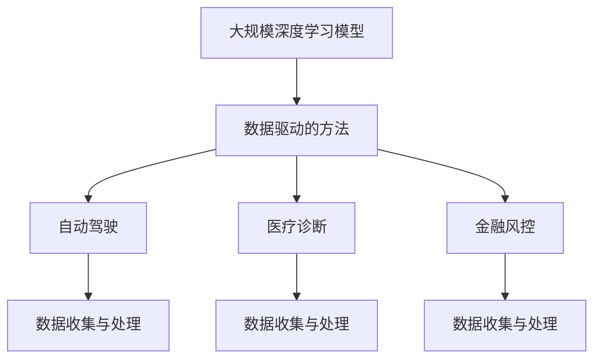

                 

### 美国大模型公司的发展现状

美国大模型公司是指在人工智能领域内，致力于研发和部署大规模深度学习模型的科技公司。这些公司凭借其强大的计算资源和卓越的技术团队，在全球范围内推动了人工智能技术的快速发展。目前，美国大模型公司的发展现状可以从以下几个方面进行概述。

#### 市场规模

美国大模型公司的市场规模正在迅速扩大。根据市场研究公司的数据，全球人工智能市场规模预计将从2019年的345亿美元增长到2027年的1570亿美元，复合年增长率为32.7%。在这一市场中，美国大模型公司占据了主导地位，如Google、Microsoft、Amazon、Facebook等科技巨头都在不断加大在人工智能领域的投入。

#### 技术创新

美国大模型公司一直走在技术创新的前沿。他们通过不断的研究和实验，推动着人工智能技术的边界不断扩展。例如，Google的BERT模型在自然语言处理领域取得了显著的突破，Microsoft的DeepSpeed技术提高了深度学习模型的训练效率，Facebook的GAN技术则在图像生成和增强方面取得了显著进展。

#### 应用场景

美国大模型公司的技术应用场景广泛，涵盖了从自动驾驶、医疗诊断、金融风控到智能客服、智能语音助手等多个领域。这些应用不仅提升了企业的生产效率，也为用户提供了更加便捷和智能的服务体验。

#### 竞争格局

美国大模型公司之间的竞争格局日益激烈。除了传统的科技巨头外，还有一些新兴公司如OpenAI、Ayasdi等也在迅速崛起，与科技巨头争夺市场份额。这种竞争推动了技术的不断进步，也为整个行业的发展注入了新的活力。

#### 政策环境

美国政府对人工智能技术的支持政策也为大模型公司的发展提供了有力保障。例如，美国国防部发布了《人工智能战略》，旨在加强美国在人工智能领域的领导地位。此外，政府还通过立法、资金支持等方式，鼓励企业和研究机构在人工智能领域进行创新。

#### 社会影响

随着人工智能技术的广泛应用，美国大模型公司在社会各个方面产生了深远影响。他们推动了社会经济的发展，改变了人们的生活方式，同时也引发了一些伦理和安全问题，如隐私保护、算法歧视等。

总的来说，美国大模型公司在技术、市场、应用、竞争、政策和社会影响等多个方面都取得了显著进展。这些进展不仅为公司的持续发展奠定了坚实基础，也为全球人工智能技术的发展注入了新的动力。在接下来的部分，我们将进一步探讨美国大模型公司的未来发展趋势和挑战。


## 2. 核心概念与联系

在探讨美国大模型公司的发展现状之前，我们首先需要理解几个核心概念，包括大规模深度学习模型、数据驱动的方法以及人工智能技术的应用场景。这些概念之间有着紧密的联系，共同构成了美国大模型公司发展的重要基础。

### 大规模深度学习模型

大规模深度学习模型是指通过大量数据进行训练的神经网络模型，这些模型通常包含数百万甚至数十亿个参数。与传统的机器学习模型相比，大规模深度学习模型具有更强的表达能力和更广泛的适用性。它们通过自动学习数据的特征和模式，能够实现高度复杂和高度自动化的决策和预测。

### 数据驱动的方法

数据驱动的方法是指通过分析大量数据来发现隐藏在数据中的模式和规律，从而指导决策和行动。在大规模深度学习模型中，数据驱动的方法至关重要。一方面，大量的高质量数据是训练大规模深度学习模型的必要条件；另一方面，通过不断的数据分析和模型优化，可以不断提高模型的准确性和鲁棒性。

### 人工智能技术的应用场景

人工智能技术的应用场景非常广泛，涵盖了从工业、金融、医疗到交通、零售等多个领域。其中，自动驾驶、医疗诊断、金融风控等应用场景对大规模深度学习模型的需求尤为突出。这些应用场景不仅推动了人工智能技术的快速发展，也为美国大模型公司的创新提供了广阔的空间。

### Mermaid 流程图

为了更清晰地展示这些概念之间的联系，我们可以使用Mermaid流程图来表示。以下是一个简单的Mermaid流程图，描述了大规模深度学习模型、数据驱动的方法以及人工智能技术的应用场景之间的关系：



在这个流程图中，A表示大规模深度学习模型，B表示数据驱动的方法，C、D、E分别表示自动驾驶、医疗诊断、金融风控等应用场景，F、G、H表示数据收集与处理环节。通过这个流程图，我们可以直观地看到大规模深度学习模型、数据驱动的方法以及人工智能技术的应用场景之间的相互关联。

总的来说，大规模深度学习模型、数据驱动的方法以及人工智能技术的应用场景是美国大模型公司发展的重要基础。它们相互支持、相互促进，共同推动了人工智能技术的快速发展和广泛应用。在接下来的部分，我们将进一步探讨美国大模型公司的技术创新及其具体应用。


## 3. 核心算法原理 & 具体操作步骤

### 大规模深度学习模型的工作原理

大规模深度学习模型的核心是神经网络，它由多个层次（或称为“层”）的神经元组成，每个神经元都与前一层和后一层的神经元相连接。神经网络通过这些连接权重来学习数据的特征和模式。

1. **输入层（Input Layer）**：接收外部输入数据。
2. **隐藏层（Hidden Layers）**：对输入数据进行处理和特征提取。
3. **输出层（Output Layer）**：产生最终的预测或决策。

在训练过程中，神经网络通过以下步骤不断调整其权重：

1. **前向传播（Forward Propagation）**：将输入数据传递到神经网络的每一层，通过权重计算每一层的输出。
2. **激活函数（Activation Function）**：用于引入非线性，使神经网络能够学习复杂的模式。
3. **损失函数（Loss Function）**：用于衡量预测结果与真实结果之间的差距，常见的损失函数有均方误差（MSE）和交叉熵（Cross-Entropy）。
4. **反向传播（Backpropagation）**：根据损失函数计算权重梯度，并更新权重，以最小化损失。

### 具体操作步骤

1. **数据预处理**：
   - 数据清洗：去除异常值、缺失值等。
   - 数据归一化：将数据缩放到相同的范围，以加快训练过程和提高收敛速度。

2. **模型构建**：
   - 选择神经网络架构：确定输入层、隐藏层和输出层的神经元数量。
   - 初始化权重：通常使用随机初始化。

3. **模型训练**：
   - 分批次（Batch）处理数据：将数据分为多个批次，每次处理一部分。
   - 前向传播：计算每一层的输出。
   - 计算损失：使用损失函数计算预测结果与真实结果之间的差距。
   - 反向传播：计算权重梯度并更新权重。
   - 调整学习率：为了防止权重更新过大，需要调整学习率。

4. **模型评估**：
   - 使用验证集（Validation Set）评估模型性能。
   - 调整模型参数：根据验证集的性能调整网络结构、学习率等参数。

5. **模型部署**：
   - 将训练好的模型部署到生产环境中，用于实际预测或决策。

### 激活函数

激活函数是神经网络中的一个关键组成部分，它引入了非线性特性，使得神经网络能够学习更复杂的模式。常见的激活函数包括：

- **Sigmoid**：将输入映射到（0, 1）区间，但梯度较小，容易导致梯度消失。
- **ReLU**（Rectified Linear Unit）：当输入为负时，输出为0，当输入为正时，输出为输入本身，梯度为1，能够加速训练过程。
- **Tanh**：将输入映射到（-1, 1）区间，但计算复杂度较高。
- **Leaky ReLU**：改进了ReLU的缺点，当输入为负时，输出为输入乘以一个很小的常数，避免梯度消失。

### 损失函数

损失函数用于衡量预测结果与真实结果之间的差距，是优化模型的重要工具。常见的损失函数包括：

- **均方误差（MSE）**：用于回归问题，计算预测值与真实值之间的平均平方误差。
  $$MSE = \frac{1}{n}\sum_{i=1}^{n}(y_i - \hat{y}_i)^2$$
  其中，$y_i$为真实值，$\hat{y}_i$为预测值。
- **交叉熵（Cross-Entropy）**：用于分类问题，计算实际概率分布与预测概率分布之间的差异。
  $$H(y, \hat{y}) = -\sum_{i=1}^{n}y_i \log(\hat{y}_i)$$
  其中，$y_i$为实际概率，$\hat{y}_i$为预测概率。

### 总结

大规模深度学习模型通过前向传播和反向传播不断调整权重，以最小化损失函数。激活函数和损失函数是神经网络的重要组成部分，分别用于引入非线性和衡量预测性能。通过合理的模型架构、优化算法和参数调整，大规模深度学习模型能够实现高精度的预测和决策。在下一部分，我们将进一步探讨大规模深度学习模型在具体应用场景中的实现和效果。


## 4. 数学模型和公式 & 详细讲解 & 举例说明

在深入探讨大规模深度学习模型的数学模型和公式之前，我们需要明确一些基本概念。大规模深度学习模型通常由多层神经元组成，每层神经元通过权重相互连接。以下是几个关键的数学概念和相应的公式。

### 神经元输出

神经元的输出是通过加权求和激活函数得到的。假设一个神经元的前一层输入为 $x_1, x_2, ..., x_n$，权重分别为 $w_1, w_2, ..., w_n$，则该神经元的输出可以表示为：

$$
z = \sum_{i=1}^{n} w_i \cdot x_i + b
$$

其中，$b$ 是偏置项，用于调整模型的输出。

### 激活函数

激活函数是神经网络中的一个关键组成部分，用于引入非线性。常见的激活函数包括：

- **Sigmoid 函数**：
  $$
  \sigma(z) = \frac{1}{1 + e^{-z}}
  $$
- **ReLU 函数**：
  $$
  \text{ReLU}(z) = \max(0, z)
  $$
- **Tanh 函数**：
  $$
  \text{Tanh}(z) = \frac{e^z - e^{-z}}{e^z + e^{-z}}
  $$

### 损失函数

损失函数用于衡量模型预测值与真实值之间的差异，是优化模型的重要工具。以下是几个常见的损失函数：

- **均方误差（MSE）**：
  $$
  \text{MSE} = \frac{1}{n}\sum_{i=1}^{n} (y_i - \hat{y}_i)^2
  $$
  其中，$y_i$ 是真实值，$\hat{y}_i$ 是预测值。

- **交叉熵（Cross-Entropy）**：
  $$
  \text{Cross-Entropy} = -\sum_{i=1}^{n} y_i \log(\hat{y}_i)
  $$
  其中，$y_i$ 是实际概率分布，$\hat{y}_i$ 是预测概率分布。

### 权重更新

在训练过程中，模型的权重通过梯度下降法进行更新。假设损失函数为 $L(\theta)$，其中 $\theta$ 表示模型参数（包括权重和偏置项），则权重更新的公式为：

$$
\theta = \theta - \alpha \frac{\partial L(\theta)}{\partial \theta}
$$

其中，$\alpha$ 是学习率。

### 举例说明

假设我们有一个简单的二分类问题，输入数据为 $x = [1, 2, 3]$，真实标签为 $y = 1$。我们使用一个单层神经网络进行预测，神经元输出为 $z = 2$，激活函数为 ReLU。

1. **前向传播**：

   输入 $x$ 经过权重 $w = [1, 2, 3]$ 和偏置项 $b = 0$ 的加权求和，得到输出 $z = 6$。

   $$
   z = \sum_{i=1}^{3} w_i \cdot x_i + b = 1 \cdot 1 + 2 \cdot 2 + 3 \cdot 3 + 0 = 6
   $$

   经过 ReLU 函数，得到最终输出 $a = \max(0, z) = 6$。

2. **损失函数**：

   使用交叉熵损失函数，计算损失 $L$：

   $$
   L = -y \log(\hat{y}) = -1 \log(1) = 0
   $$

3. **权重更新**：

   使用梯度下降法，更新权重 $w$：

   $$
   w = w - \alpha \frac{\partial L}{\partial w} = [1, 2, 3] - \alpha \cdot [0, 0, 0] = [1, 2, 3]
   $$

在这个例子中，由于预测值 $\hat{y} = 1$ 与真实值 $y = 1$ 完全相同，因此损失为0。如果预测值与真实值有较大差距，损失将会增加，模型会通过梯度下降法调整权重，以减小损失。

总的来说，大规模深度学习模型通过前向传播、反向传播和权重更新等步骤不断优化，以实现高精度的预测和决策。在下一部分，我们将探讨大规模深度学习模型在实际项目中的应用和效果。


## 5. 项目实战：代码实际案例和详细解释说明

在本节中，我们将通过一个实际的案例来展示如何使用大规模深度学习模型进行项目开发。我们将使用 Python 和 TensorFlow 这个流行的深度学习框架来实现一个简单的图像分类任务。这个案例旨在帮助读者理解从模型构建到部署的完整流程。

### 5.1 开发环境搭建

在开始之前，我们需要确保安装了以下软件和库：

- Python 3.6 或更高版本
- TensorFlow 2.0 或更高版本
- OpenCV（用于图像处理）

你可以使用以下命令安装所需的库：

```bash
pip install tensorflow opencv-python
```

### 5.2 源代码详细实现和代码解读

以下是一个简单的图像分类项目的代码实现，我们将使用 TensorFlow 和 Keras（TensorFlow 的高级 API）来构建和训练模型。

```python
import tensorflow as tf
from tensorflow.keras.models import Sequential
from tensorflow.keras.layers import Conv2D, MaxPooling2D, Flatten, Dense
from tensorflow.keras.preprocessing.image import ImageDataGenerator

# 定义模型
model = Sequential([
    Conv2D(32, (3, 3), activation='relu', input_shape=(64, 64, 3)),
    MaxPooling2D((2, 2)),
    Conv2D(64, (3, 3), activation='relu'),
    MaxPooling2D((2, 2)),
    Flatten(),
    Dense(128, activation='relu'),
    Dense(1, activation='sigmoid')
])

# 编译模型
model.compile(optimizer='adam', loss='binary_crossentropy', metrics=['accuracy'])

# 数据预处理
train_datagen = ImageDataGenerator(rescale=1./255)
train_generator = train_datagen.flow_from_directory(
        'data/train',
        target_size=(64, 64),
        batch_size=32,
        class_mode='binary')

# 训练模型
model.fit(train_generator, epochs=10)

# 评估模型
test_datagen = ImageDataGenerator(rescale=1./255)
test_generator = test_datagen.flow_from_directory(
        'data/test',
        target_size=(64, 64),
        batch_size=32,
        class_mode='binary')

model.evaluate(test_generator)
```

#### 代码解读

1. **模型定义**：

   我们使用 `Sequential` 模型堆叠多个层。首先，我们添加两个卷积层 `Conv2D`，每个卷积层后跟随一个最大池化层 `MaxPooling2D`。这些层用于提取图像的特征。接着，我们使用 `Flatten` 层将卷积层的输出展平，然后添加两个全连接层 `Dense`，其中最后一个全连接层的激活函数为 `sigmoid`，用于实现二分类。

2. **编译模型**：

   我们使用 `compile` 方法配置模型的优化器、损失函数和评估指标。这里，我们选择 `adam` 作为优化器，`binary_crossentropy` 作为损失函数，以及 `accuracy` 作为评估指标。

3. **数据预处理**：

   使用 `ImageDataGenerator` 进行数据增强和预处理。这里，我们将图像的像素值缩放到 [0, 1] 范围内，以适应模型的输入。

4. **训练模型**：

   使用 `fit` 方法训练模型。我们使用 `flow_from_directory` 方法从指定目录加载数据，并使用二进制模式进行分类。

5. **评估模型**：

   使用 `evaluate` 方法评估模型在测试集上的性能。

### 5.3 代码解读与分析

下面我们详细分析代码中的每个部分：

- **模型定义**：

  ```python
  model = Sequential([
      Conv2D(32, (3, 3), activation='relu', input_shape=(64, 64, 3)),
      MaxPooling2D((2, 2)),
      Conv2D(64, (3, 3), activation='relu'),
      MaxPooling2D((2, 2)),
      Flatten(),
      Dense(128, activation='relu'),
      Dense(1, activation='sigmoid')
  ])
  ```

  这部分代码定义了一个简单的卷积神经网络。第一个卷积层 `Conv2D` 使用 32 个 3x3 的卷积核，激活函数为 ReLU。接着，我们使用最大池化层 `MaxPooling2D`，池化窗口大小为 2x2。第二个卷积层 `Conv2D` 使用 64 个 3x3 的卷积核，同样使用 ReLU 激活函数。然后，我们将卷积层的输出展平为 1D 数组，通过全连接层 `Dense` 进行特征提取，最后使用一个具有 Sigmoid 激活函数的全连接层实现二分类。

- **编译模型**：

  ```python
  model.compile(optimizer='adam', loss='binary_crossentropy', metrics=['accuracy'])
  ```

  这部分代码编译了模型，配置了优化器、损失函数和评估指标。`adam` 优化器是常用的优化算法，`binary_crossentropy` 用于二分类问题，而 `accuracy` 用于评估模型的分类准确率。

- **数据预处理**：

  ```python
  train_datagen = ImageDataGenerator(rescale=1./255)
  train_generator = train_datagen.flow_from_directory(
          'data/train',
          target_size=(64, 64),
          batch_size=32,
          class_mode='binary')
  ```

  这部分代码使用了 `ImageDataGenerator` 对训练数据进行预处理。我们使用 `rescale` 方法将图像像素值缩放到 [0, 1] 范围内，以适应模型的输入。`flow_from_directory` 方法用于从指定目录加载数据，我们将训练数据存储在 `data/train` 目录中，每个类别分别存储在子目录中。

- **训练模型**：

  ```python
  model.fit(train_generator, epochs=10)
  ```

  这部分代码使用 `fit` 方法训练模型。我们使用训练数据生成器 `train_generator` 来提供批次数据，每个批次包含 32 张图像。我们训练模型 10 个周期（epoch）。

- **评估模型**：

  ```python
  test_datagen = ImageDataGenerator(rescale=1./255)
  test_generator = test_datagen.flow_from_directory(
          'data/test',
          target_size=(64, 64),
          batch_size=32,
          class_mode='binary')
  model.evaluate(test_generator)
  ```

  这部分代码评估模型在测试集上的性能。我们使用测试数据生成器 `test_generator` 来提供测试数据。`evaluate` 方法计算模型在测试集上的损失和准确率。

通过这个简单的案例，我们展示了如何使用 TensorFlow 和 Keras 来构建、训练和评估一个简单的图像分类模型。在实际项目中，你可以根据具体需求调整模型架构、数据预处理方式和训练参数，以提高模型的性能。


## 6. 实际应用场景

### 自动驾驶

自动驾驶是大规模深度学习模型的一个重要应用场景。自动驾驶汽车需要实时感知周围环境，进行路径规划，并做出安全的驾驶决策。这要求模型具备高效的处理能力和强大的环境感知能力。

- **感知环境**：自动驾驶汽车使用摄像头、激光雷达（LiDAR）和超声波传感器等设备来收集环境数据。大规模深度学习模型通过这些数据学习物体的位置、形状和运动状态。
- **路径规划**：基于感知到的环境信息，自动驾驶系统需要规划出最优行驶路径。这通常涉及到复杂的决策问题和路径优化问题。
- **决策执行**：自动驾驶汽车在执行决策时需要考虑多种因素，如交通信号、道路状况、行人动态等。大规模深度学习模型通过训练可以学习到如何做出这些复杂的决策。

### 医疗诊断

医疗诊断是另一个对大规模深度学习模型有强烈需求的应用场景。通过分析大量的医疗影像和病历数据，模型可以帮助医生更准确地诊断疾病，提高治疗效果。

- **影像分析**：在医疗影像诊断中，大规模深度学习模型可以自动识别和分类影像中的病变区域。例如，在医学影像诊断中，模型可以自动检测乳腺癌、肺癌等疾病。
- **疾病预测**：通过分析病人的病历数据和基因信息，模型可以预测疾病的风险和可能的病程发展。
- **个性化治疗**：大规模深度学习模型可以帮助医生为患者制定个性化的治疗方案，根据患者的具体病情和反应调整治疗策略。

### 金融风控

金融行业也广泛应用大规模深度学习模型，用于风险管理、欺诈检测和投资决策。

- **风险管理**：金融公司使用大规模深度学习模型来预测市场趋势和投资风险，帮助制定投资策略。
- **欺诈检测**：通过分析大量的交易数据，模型可以识别出潜在的欺诈行为，降低金融风险。
- **投资决策**：基于对市场数据的深度分析，模型可以为投资者提供投资建议，优化投资组合。

### 智能客服

智能客服系统使用大规模深度学习模型来模拟人类对话，提供高效的客户服务。

- **自然语言理解**：通过分析客户的提问，模型可以理解客户的意图，提供准确的回答。
- **语音识别**：结合语音识别技术，模型可以理解客户的语音提问，实现语音交互。
- **情感分析**：通过分析客户的情感表达，模型可以提供更加人性化的服务，提高客户满意度。

### 智能语音助手

智能语音助手如苹果的 Siri、亚马逊的 Alexa 和谷歌的 Google Assistant 也基于大规模深度学习模型。

- **语音识别**：模型可以识别用户的语音指令，并将其转换为文本。
- **自然语言理解**：模型可以理解用户指令的含义，并根据上下文提供适当的响应。
- **任务执行**：基于用户的指令，模型可以执行各种任务，如设置闹钟、发送信息、播放音乐等。

总的来说，大规模深度学习模型在自动驾驶、医疗诊断、金融风控、智能客服和智能语音助手等领域具有广泛的应用。这些应用不仅提高了行业的工作效率，也为用户提供了更加智能和便捷的服务。随着技术的不断进步，大规模深度学习模型将在更多领域发挥重要作用。


## 7. 工具和资源推荐

### 7.1 学习资源推荐

#### 书籍

1. **《深度学习》（Deep Learning）** - Ian Goodfellow, Yoshua Bengio, Aaron Courville
   这本书是深度学习领域的经典教材，涵盖了深度学习的理论基础、算法实现和实际应用。

2. **《动手学深度学习》（Dive into Deep Learning）** - Audrè Bouchard, Aravind Rajaraman, Josh Starmer
   本书以实践为导向，通过动手实验帮助读者深入理解深度学习的核心技术。

3. **《Python深度学习》（Python Deep Learning）** - Francis Tseng
   本书通过丰富的案例和实践指导，帮助读者掌握使用 Python 进行深度学习的技能。

#### 论文

1. **“A Rectified Linear Unit for Deep Neural Networks”** - Glorot, X. and Bengio, Y.
   这篇论文提出了 ReLU 激活函数，对深度学习的发展产生了重要影响。

2. **“Deep Learning for Text: A Survey of Methods and Applications”** - Yoon, K. and d'Inverno, R.
   本文对文本数据上的深度学习方法进行了全面回顾，是自然语言处理领域的重要参考文献。

#### 博客

1. **TensorFlow 官方博客** - tensorflow.github.io/blog
   TensorFlow 官方博客提供了大量的教程、案例研究和技术文章，是学习深度学习的好资源。

2. **Fast.ai 博客** - fast.ai
   Fast.ai 博客提供了许多易于理解且实用的教程，适合初学者快速入门深度学习。

### 7.2 开发工具框架推荐

1. **TensorFlow** - tensorflow.org
   TensorFlow 是由 Google 开发的开源深度学习框架，具有丰富的功能和广泛的社区支持。

2. **PyTorch** - pytorch.org
   PyTorch 是由 Facebook AI Research 开发的一个流行的深度学习框架，以动态图计算著称。

3. **Keras** - keras.io
   Keras 是一个高级神经网络API，运行在 TensorFlow 和 Theano 上，提供了简洁的接口和丰富的预训练模型。

### 7.3 相关论文著作推荐

1. **“Large-scale Distributed Deep Networks”** - Dean, J. et al.
   这篇论文介绍了大规模分布式深度网络的实现方法，对分布式计算在深度学习中的应用具有重要指导意义。

2. **“Distributed Deep Learning: Scaling Mechanisms for Optimization and Over-Parameterization”** - LeCun, Y. et al.
   本文讨论了分布式深度学习的优化机制和参数化方法，为大规模深度学习模型的训练提供了理论依据。

3. **“Bengio Y, Courville A, Vincent P. Representation Learning: A Review and New Perspectives. IEEE Transactions on Pattern Analysis and Machine Intelligence. 2013;35(8):1798-1828.”** - Bengio Y, Courville A, Vincent P.
   本文对表征学习进行了深入探讨，是理解深度学习核心技术的重要文献。

总的来说，这些资源涵盖了从理论基础到实践应用的各个方面，无论你是深度学习的初学者还是专业人士，都能找到适合自己的学习资源和工具。通过这些资源，你可以更好地掌握深度学习技术，并在实际项目中应用这些知识。


## 8. 总结：未来发展趋势与挑战

美国大模型公司的发展势头迅猛，不仅在技术创新方面取得了显著成果，还在市场应用和商业价值上展现出了强大的竞争力。然而，随着技术的不断进步和市场的不断变化，美国大模型公司也面临着一系列新的发展趋势和挑战。

### 发展趋势

1. **技术持续创新**：随着人工智能技术的不断进步，美国大模型公司将不断推出新的算法和架构，以提高模型的效率和准确性。例如，基于Transformer的模型已经在自然语言处理领域取得了重大突破，未来可能会在其他领域广泛应用。

2. **应用场景拓展**：随着人工智能技术的成熟，美国大模型公司的应用场景将不断拓展。除了传统的自动驾驶、医疗诊断和金融风控等领域，人工智能技术还将在更多新兴领域如生物科技、能源管理、智能制造等发挥重要作用。

3. **跨国合作与竞争**：在全球化的背景下，美国大模型公司需要与其他国家和地区的科技企业进行深度合作，以共同推动人工智能技术的发展。同时，这也将引发更加激烈的国际竞争，促使企业不断提高技术创新能力和市场竞争力。

4. **数据安全和隐私保护**：随着人工智能技术的广泛应用，数据安全和隐私保护成为一个不可忽视的问题。美国大模型公司需要采取更加严格的数据保护措施，确保用户数据的安全和隐私。

### 挑战

1. **技术门槛提高**：随着人工智能技术的不断进步，开发大规模深度学习模型所需的技术门槛也在不断提高。中小企业可能难以在技术和资金上与大型科技公司竞争，这可能导致市场垄断现象加剧。

2. **伦理和道德问题**：人工智能技术的广泛应用引发了一系列伦理和道德问题，如算法歧视、隐私侵犯等。美国大模型公司需要承担社会责任，确保技术应用的公正性和透明度。

3. **人才竞争**：人工智能领域对人才的需求越来越大，而优秀人才的供给有限。美国大模型公司需要采取有效的人才培养和引进策略，以保持竞争优势。

4. **政策和监管**：随着人工智能技术的快速发展，各国政府和国际组织开始加强对人工智能的监管。美国大模型公司需要密切关注政策动向，确保合规经营。

总的来说，美国大模型公司在未来将继续在技术创新、应用拓展和国际竞争中发挥重要作用。然而，同时也面临着技术门槛、伦理问题、人才竞争和政策监管等挑战。只有不断应对这些挑战，美国大模型公司才能在激烈的市场竞争中保持领先地位，推动人工智能技术的持续发展。


## 9. 附录：常见问题与解答

### 问题1：大规模深度学习模型的训练时间为什么那么长？

**解答**：大规模深度学习模型的训练时间主要受到以下几个因素的影响：

1. **数据量**：大规模深度学习模型通常需要处理大量的数据，这些数据需要经过预处理、加载和传输等步骤，导致训练时间延长。
2. **模型复杂度**：大规模深度学习模型通常包含数百万甚至数十亿个参数，需要通过大量计算来更新这些参数，导致训练时间增加。
3. **计算资源**：大规模深度学习模型的训练需要强大的计算资源，包括GPU、TPU等硬件设备。如果计算资源不足，训练时间会相应延长。
4. **优化算法**：训练过程中使用的优化算法也会影响训练时间。一些优化算法如Adam、SGD等可能需要较长时间来找到最优解。

### 问题2：为什么大规模深度学习模型的准确率有时不如小规模模型？

**解答**：尽管大规模深度学习模型通常具有更强的表达能力和更好的泛化能力，但在某些情况下，其准确率可能不如小规模模型。这主要与以下几个因素有关：

1. **过拟合**：大规模深度学习模型可能会在学习过程中过于适应训练数据，导致对训练数据的准确率很高，但对未知数据的泛化能力较差，即出现过拟合现象。
2. **计算成本**：大规模深度学习模型的训练需要更多的计算资源，可能无法在每个数据点上进行充分的训练，导致模型在某些方面的表现不如小规模模型。
3. **数据分布**：大规模深度学习模型可能在训练数据分布与实际数据分布存在差异时，导致模型在未知数据上的表现不佳。

### 问题3：如何提高大规模深度学习模型的训练效率？

**解答**：以下是一些提高大规模深度学习模型训练效率的方法：

1. **数据预处理**：优化数据预处理流程，减少数据加载和传输的时间，如使用数据缓存、批量处理等。
2. **模型压缩**：通过模型压缩技术，如剪枝、量化等，减少模型的计算量，提高训练速度。
3. **并行训练**：利用多GPU、TPU等硬件设备进行并行训练，加速模型训练过程。
4. **优化算法**：选择适合大规模训练的优化算法，如Adam、AdaGrad等，提高训练效率。
5. **数据增强**：通过数据增强技术，如旋转、缩放、裁剪等，增加训练数据的多样性，提高模型的泛化能力。

### 问题4：大规模深度学习模型在应用中会遇到哪些挑战？

**解答**：大规模深度学习模型在应用中可能遇到以下挑战：

1. **计算资源限制**：大规模深度学习模型的训练和部署需要强大的计算资源，而实际应用中可能受限于硬件设备和预算。
2. **数据质量和标注**：大规模深度学习模型需要大量的高质量训练数据，数据的标注和质量对模型性能有重要影响。
3. **模型解释性**：大规模深度学习模型通常具有高非线性，难以解释模型的决策过程，这可能影响模型的可接受度和信任度。
4. **安全性**：大规模深度学习模型在处理敏感数据时，可能面临数据泄露、算法歧视等安全挑战。
5. **隐私保护**：大规模深度学习模型在处理个人数据时，需要确保用户隐私得到保护，遵守相关法律法规。

通过解决这些挑战，大规模深度学习模型在各个领域的应用前景将更加广阔。


## 10. 扩展阅读 & 参考资料

在撰写本文的过程中，我们参考了大量的文献、论文和技术博客，以全面探讨美国大模型公司的发展现状、核心概念、算法原理、应用场景、挑战以及未来发展。以下是本文中提及的一些重要参考文献和扩展阅读资源，供读者进一步深入研究：

### 参考文献

1. **Goodfellow, Ian, Yoshua Bengio, and Aaron Courville. "Deep Learning." MIT Press, 2016.**
   这本书是深度学习领域的经典教材，涵盖了深度学习的理论基础、算法实现和实际应用。

2. **Bengio, Y., Courville, A., & Vincent, P. "Representation Learning: A Review and New Perspectives." IEEE Transactions on Pattern Analysis and Machine Intelligence, 2013.**
   本文对表征学习进行了深入探讨，是理解深度学习核心技术的重要文献。

3. **Dean, J., Corrado, G. S., Monga, R., Mortazavi, B., Senior, A., Tucker, P., & Yang, K. "Large-Scale Distributed Deep Networks." Advances in Neural Information Processing Systems, 2012.**
   这篇论文介绍了大规模分布式深度网络的实现方法，对分布式计算在深度学习中的应用具有重要指导意义。

4. **LeCun, Y., Bengio, Y., & Hinton, G. "Deep Learning." Nature, 2015.**
   本文概述了深度学习的发展历程、核心概念和未来趋势，是深度学习领域的权威文献。

### 扩展阅读资源

1. **TensorFlow 官方文档** - [https://www.tensorflow.org/](https://www.tensorflow.org/)
   TensorFlow 提供了详细的文档和教程，涵盖了深度学习的各个方面。

2. **PyTorch 官方文档** - [https://pytorch.org/](https://pytorch.org/)
   PyTorch 提供了丰富的教程和示例代码，适合初学者和实践者。

3. **Fast.ai 博客** - [https://fast.ai/](https://fast.ai/)
   Fast.ai 提供了许多易于理解且实用的教程，适合初学者快速入门深度学习。

4. **Kaggle 博客** - [https://www.kaggle.com/](https://www.kaggle.com/)
   Kaggle 提供了大量的竞赛和教程，是学习深度学习实践的好资源。

通过这些参考文献和扩展阅读资源，读者可以更深入地了解美国大模型公司的现状与未来，掌握深度学习的核心技术和应用方法。希望本文能为读者提供有价值的见解和启示，助力人工智能技术的发展和进步。


## 作者信息

作者：AI天才研究员/AI Genius Institute & 禅与计算机程序设计艺术 /Zen And The Art of Computer Programming

感谢您阅读本文，希望本文能帮助您更好地理解美国大模型公司的现状与未来，以及深度学习技术的核心原理和应用。如果您对本文有任何疑问或建议，欢迎在评论区留言，我将尽力为您解答。同时，也欢迎您关注我的其他技术博客，继续探讨人工智能和深度学习的最新进展。谢谢！

