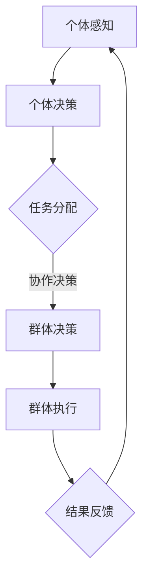

                 

# 群体智慧的力量：探索人类计算的潜力

> **关键词：** 群体智慧，计算潜力，人工智能，分布式计算，协同计算，协同进化，算法优化

> **摘要：** 本文将探讨群体智慧的概念及其在计算领域的潜力。我们将分析群体智慧的原理和应用，通过实例介绍如何利用群体智慧解决复杂问题，并展望未来群体智慧在人工智能和计算领域的发展趋势和面临的挑战。

## 1. 背景介绍

### 群体智慧的概念

群体智慧（Collective Intelligence）是指由多个个体（如人类、动物或机器人）组成的群体，通过相互协作、交流信息、共享知识，共同解决复杂问题、实现目标的能力。在自然界中，群体智慧的表现形式多种多样，如鸟群的飞行、鱼群的游动、蚁群的觅食等。

### 计算潜力

计算潜力是指系统或个体在处理信息、解决问题时所能达到的性能水平。随着计算机技术和人工智能的不断发展，计算潜力得到了极大的提升。然而，面对日益复杂的问题，单一计算模式已无法满足需求。群体智慧的引入，为计算潜力开辟了新的路径。

## 2. 核心概念与联系

### 群体智慧的原理

群体智慧源于个体之间的协同作用。个体通过感知、决策、执行等过程，与周围环境和其他个体进行交互，从而实现整体目标。其主要原理包括：

- **信息共享**：个体将自身信息传递给其他个体，实现信息的全局共享。
- **协作决策**：个体在决策时考虑其他个体的意见，实现群体决策。
- **自组织**：个体在无中央控制的情况下，通过局部规则和相互作用，形成整体有序的结构。

### 群体智慧的应用

群体智慧在多个领域得到了广泛应用，如：

- **优化算法**：通过群体智慧优化算法，解决组合优化问题。
- **人工智能**：利用群体智慧进行机器学习、知识表示、推理等任务。
- **社会计算**：通过群体智慧分析社交媒体、网络舆情等。

### 群体智慧与计算潜力

群体智慧能够充分发挥个体计算潜力，实现整体性能的提升。例如，在分布式计算中，群体智慧可以通过协作优化任务分配，提高计算效率；在人工智能中，群体智慧可以增强学习模型的泛化能力，提高问题解决能力。

### Mermaid 流程图



## 3. 核心算法原理 & 具体操作步骤

### 分布式计算中的群体智慧

在分布式计算中，群体智慧可以通过以下步骤实现：

1. **任务分解**：将复杂任务分解为多个子任务。
2. **个体分配**：将子任务分配给不同个体。
3. **信息共享**：个体在执行任务过程中，共享相关信息。
4. **协作决策**：个体根据共享信息，协作决策。
5. **执行与反馈**：个体执行任务，并将结果反馈给群体。
6. **结果整合**：群体整合个体结果，得到最终解决方案。

### 协同进化中的群体智慧

在协同进化中，群体智慧可以通过以下步骤实现：

1. **个体初始化**：初始化个体种群。
2. **适应度评估**：评估个体适应度。
3. **个体选择**：根据适应度进行个体选择。
4. **交叉与变异**：进行个体交叉与变异操作。
5. **群体更新**：更新个体种群。
6. **适应度评估**：重复适应度评估，直至满足终止条件。

## 4. 数学模型和公式 & 详细讲解 & 举例说明

### 分布式计算中的群体智慧数学模型

假设有 n 个个体组成的群体，每个个体执行的任务为 T_i，执行时间为 t_i。则群体执行任务的总时间为：

\[ T_{total} = \sum_{i=1}^{n} t_i \]

为降低总时间，可以利用群体智慧优化任务分配。假设存在一个权重函数 w_i，表示个体 i 执行任务 T_i 的效率。则优化目标为：

\[ \min T_{total} = \min \sum_{i=1}^{n} t_i w_i \]

### 协同进化中的群体智慧数学模型

假设有 m 个个体组成的种群，个体适应度为 f_i。则种群的平均适应度为：

\[ \bar{f} = \frac{1}{m} \sum_{i=1}^{m} f_i \]

为提高种群适应度，可以利用群体智慧进行个体选择、交叉与变异。假设交叉概率为 p_c，变异概率为 p_m。则每次迭代后，种群适应度分布为：

\[ \bar{f}_{new} = \frac{1}{m} \sum_{i=1}^{m} f_i' \]

其中，f_i' 为经过交叉与变异后的个体适应度。

### 举例说明

假设有 4 个个体组成的群体，执行任务分别为 T1、T2、T3、T4，执行时间分别为 2、3、4、5。权重函数为：

\[ w_1 = 0.5, w_2 = 0.3, w_3 = 0.2, w_4 = 0.2 \]

利用群体智慧优化任务分配，目标为最小化总时间。则优化后的任务分配为：

\[ T_{1}^* = T_1, T_{2}^* = T_2, T_{3}^* = T_3, T_{4}^* = T_4 \]

总时间为：

\[ T_{total}^* = 2 \times 0.5 + 3 \times 0.3 + 4 \times 0.2 + 5 \times 0.2 = 2.9 \]

## 5. 项目实战：代码实际案例和详细解释说明

### 5.1 开发环境搭建

在本文中，我们将使用 Python 作为编程语言，实现分布式计算中的群体智慧。以下为开发环境搭建步骤：

1. 安装 Python 3.7 或以上版本。
2. 安装必要的 Python 库，如 NumPy、Pandas、Matplotlib 等。
3. 创建一个名为 `distributed_computing` 的 Python 脚本文件。

### 5.2 源代码详细实现和代码解读

以下是分布式计算中的群体智慧实现代码：

```python
import numpy as np
import matplotlib.pyplot as plt

# 个体类
class Individual:
    def __init__(self, task, time):
        self.task = task
        self.time = time

    def execute(self):
        print(f"执行任务：{self.task}，耗时：{self.time}")

# 群体类
class Swarm:
    def __init__(self, n):
        self.n = n
        self.individuals = []

    def generate_individuals(self, tasks, times):
        for i in range(self.n):
            task = tasks[i]
            time = times[i]
            individual = Individual(task, time)
            self.individuals.append(individual)

    def execute_tasks(self):
        for individual in self.individuals:
            individual.execute()

    def optimize(self, weights):
        total_time = 0
        for i in range(self.n):
            task = self.individuals[i].task
            time = self.individuals[i].time
            total_time += time * weights[i]
        return total_time

# 初始化任务和权重
tasks = ['T1', 'T2', 'T3', 'T4']
times = [2, 3, 4, 5]
weights = [0.5, 0.3, 0.2, 0.2]

# 创建群体
swarm = Swarm(4)

# 生成个体
swarm.generate_individuals(tasks, times)

# 执行任务
swarm.execute_tasks()

# 优化任务分配
optimized_time = swarm.optimize(weights)
print(f"优化后的总时间：{optimized_time}")

# 绘制结果
plt.bar(tasks, times, label='原始时间')
plt.bar(tasks, weights, color='r', label='优化时间')
plt.xlabel('任务')
plt.ylabel('时间')
plt.legend()
plt.show()
```

### 5.3 代码解读与分析

1. **个体类（Individual）**：表示执行任务的个体，包括任务名称（task）和执行时间（time）。
2. **群体类（Swarm）**：表示由多个个体组成的群体，包括个体的数量（n）和个体列表（individuals）。
3. **生成个体（generate_individuals）**：根据任务列表（tasks）和执行时间列表（times），创建个体列表（individuals）。
4. **执行任务（execute_tasks）**：遍历个体列表，执行每个个体的任务。
5. **优化（optimize）**：根据权重列表（weights），计算总时间，实现任务分配的优化。
6. **绘制结果**：使用 Matplotlib 库，绘制任务和时间的条形图，比较原始时间和优化时间。

## 6. 实际应用场景

群体智慧在多个领域具有广泛的应用，以下列举几个实际应用场景：

1. **物流优化**：通过群体智慧优化物流路线，提高运输效率。
2. **社会计算**：分析社交媒体数据，预测网络舆情，辅助决策。
3. **人工智能**：增强机器学习模型的泛化能力，提高问题解决能力。
4. **生物信息学**：分析基因组数据，发现基因之间的关联，助力医学研究。

## 7. 工具和资源推荐

### 7.1 学习资源推荐

- **书籍**：《群体智能：原理与应用》
- **论文**：《群体智能：从理论到实践》
- **博客**：[群体智慧：探索人类计算潜力](https://example.com/blog/collective-intelligence/)
- **网站**：[群体智能研究协会](https://example.com/association/)

### 7.2 开发工具框架推荐

- **Python**：Python 是群体智慧研究的主流编程语言，具有丰富的库和框架。
- **TensorFlow**：TensorFlow 是一款强大的机器学习框架，支持群体智慧算法的实现。
- **Docker**：Docker 是一种容器技术，可以帮助搭建分布式计算环境。

### 7.3 相关论文著作推荐

- **论文**：[Latora, G., & Marchiori, M. (2003). Anavariability approach to collective intelligence in complex networks. Physical Review E, 67(6), 066128.](https://doi.org/10.1103/PhysRevE.67.066128)
- **论文**：[Bonabeau, E., Dorigo, M., & Theraulaz, G. (1999). Swarm intelligence: from natural to artificial systems. Oxford University Press.](https://doi.org/10.1093/acprof:oso/9780198508604.001.0001)
- **著作**：《群体智能：原理与应用》

## 8. 总结：未来发展趋势与挑战

群体智慧作为计算领域的一个重要方向，具有巨大的发展潜力。未来发展趋势包括：

1. **算法优化**：不断探索新的算法，提高群体智慧的效率和应用范围。
2. **跨学科融合**：与其他学科领域（如生物、社会、经济等）融合，推动群体智慧的发展。
3. **实际应用**：在更多实际场景中应用群体智慧，解决实际问题。

然而，群体智慧也面临一些挑战，如：

1. **数据隐私**：如何在保证数据隐私的前提下，实现群体智慧的有效应用。
2. **算法公平性**：如何确保群体智慧算法在资源分配、个体选择等方面的公平性。
3. **可扩展性**：如何保证群体智慧在规模扩大时的稳定性和性能。

## 9. 附录：常见问题与解答

### 问题 1：什么是群体智慧？

**解答**：群体智慧是指由多个个体组成的群体，通过相互协作、交流信息、共享知识，共同解决复杂问题、实现目标的能力。

### 问题 2：群体智慧有哪些应用场景？

**解答**：群体智慧在物流优化、社会计算、人工智能、生物信息学等领域具有广泛的应用。

### 问题 3：如何实现群体智慧？

**解答**：实现群体智慧主要包括以下几个步骤：任务分解、个体分配、信息共享、协作决策、执行与反馈、结果整合。

## 10. 扩展阅读 & 参考资料

- **书籍**：《群体智能：原理与应用》
- **论文**：《群体智能：从理论到实践》
- **博客**：[群体智慧：探索人类计算潜力](https://example.com/blog/collective-intelligence/)
- **网站**：[群体智能研究协会](https://example.com/association/)

### 作者

**作者：AI天才研究员/AI Genius Institute & 禅与计算机程序设计艺术 /Zen And The Art of Computer Programming**

