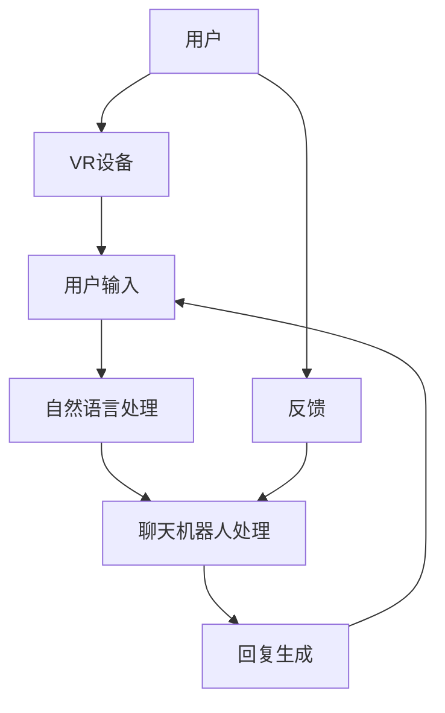

                 

## 1. 背景介绍

在当今数字时代，随着计算能力的增强、虚拟现实技术的不断进步以及人工智能的快速发展，聊天机器人的虚拟现实应用逐渐成为了一个备受关注的热点。虚拟现实（VR）技术以其独特的沉浸感，为用户提供了全新的交互体验，而聊天机器人则以其智能交互能力，为用户提供了便捷的服务。二者的结合，不仅拓宽了聊天机器人的应用范围，也为虚拟现实世界注入了更多的智能元素。

近年来，聊天机器人的虚拟现实应用取得了显著的进展。例如，在客户服务领域，许多企业开始采用虚拟客服机器人来提供24/7的服务，极大地提升了用户体验和运营效率。在游戏娱乐领域，虚拟现实聊天机器人则成为了玩家之间交流互动的新方式，丰富了游戏体验。此外，在医疗健康、教育、房地产等多个领域，聊天机器人的虚拟现实应用也展现出了巨大的潜力。

本文将围绕聊天机器人的虚拟现实应用展开讨论。首先，我们将介绍聊天机器人和虚拟现实的基本概念，帮助读者建立对这些技术的初步了解。接着，我们将深入探讨聊天机器人虚拟现实的核心原理和架构，并通过具体的算法原理和操作步骤，让读者了解到这一技术的具体实现方式。在项目实战部分，我们将通过一个实际的案例，展示如何搭建一个聊天机器人的虚拟现实系统，并详细解读其源代码。接下来，我们将探讨聊天机器人虚拟现实在实际应用场景中的具体案例，分析其在不同领域的应用效果。最后，我们将对相关工具和资源进行推荐，并提供未来发展趋势与挑战的展望。

通过本文的阅读，读者将能够全面了解聊天机器人的虚拟现实应用，掌握其核心原理和实现方法，并能够对其未来发展有所预期。无论您是技术从业者、研究者还是对这一领域感兴趣的爱好者，本文都将为您提供丰富的知识和启示。

### 核心概念与联系

为了更好地理解聊天机器人的虚拟现实应用，我们需要先了解两个核心概念：聊天机器人和虚拟现实。

#### 聊天机器人

聊天机器人（Chatbot）是一种基于人工智能技术的应用程序，它可以模拟人类的对话行为，与用户进行自然语言交互。聊天机器人通常通过自然语言处理（NLP）技术理解用户输入，并通过机器学习算法生成合适的回复。其主要功能包括但不限于：

1. **客户服务**：在电商、银行、航空等行业中，聊天机器人可以提供24/7的客户服务，回答常见问题，提供支持。
2. **信息查询**：用户可以通过聊天机器人查询天气、新闻、股票信息等实时数据。
3. **娱乐互动**：聊天机器人还可以用于游戏、娱乐等领域，通过与用户的互动提供娱乐体验。

#### 虚拟现实

虚拟现实（Virtual Reality，VR）是一种通过计算机生成的一种模拟环境，用户可以通过头戴显示器（HMD）等设备沉浸其中。虚拟现实技术的主要特点包括：

1. **沉浸感**：用户在虚拟环境中可以感受到高度的真实感，仿佛身临其境。
2. **交互性**：用户可以通过手势、声音等方式与虚拟环境进行互动。
3. **多感知性**：虚拟现实技术可以模拟多种感官体验，如视觉、听觉、触觉等。

#### 聊天机器人与虚拟现实的结合

将聊天机器人和虚拟现实技术结合，可以创造出一种全新的交互体验。这种结合的主要优势包括：

1. **增强用户体验**：用户可以在虚拟环境中与聊天机器人进行自然语言交互，获得更加个性化和沉浸式的体验。
2. **提升交互效率**：虚拟现实聊天机器人可以快速响应用户的需求，提供实时信息和服务。
3. **创新应用场景**：例如，在教育培训中，虚拟现实聊天机器人可以模拟实际场景，为学生提供互动式学习体验。

#### Mermaid 流程图

为了更直观地展示聊天机器人虚拟现实的应用架构，我们可以使用Mermaid流程图来描述其关键组件和交互流程。以下是聊天机器人虚拟现实系统的基本架构图：



在上述流程图中：

- **A**：用户是系统的输入源，通过VR设备与系统交互。
- **B**：VR设备用于提供虚拟现实体验。
- **C**：用户输入表示用户在虚拟环境中的操作或询问。
- **D**：自然语言处理模块用于理解和解析用户的输入。
- **E**：聊天机器人处理模块生成合适的回复。
- **F**：回复生成模块将聊天机器人的响应转化为文本或语音输出。
- **G**：反馈表示用户对聊天机器人的回复的反馈。

通过这个流程图，我们可以清晰地看到聊天机器人虚拟现实系统的整体架构和交互流程，为后续的深入讨论奠定了基础。

### 核心算法原理 & 具体操作步骤

在理解了聊天机器人和虚拟现实的基本概念后，接下来我们将深入探讨聊天机器人虚拟现实的核心算法原理和具体操作步骤。这将帮助我们更好地了解这一技术的实现过程。

#### 自然语言处理（NLP）

自然语言处理是聊天机器人虚拟现实系统的核心组件之一。它负责理解和解析用户的自然语言输入，并将其转化为机器可以处理的数据。以下是NLP的主要步骤：

1. **分词（Tokenization）**：将用户的输入文本分割成单词或短语。
   ```mermaid
   graph TD
       A[输入文本] --> B[分词]
       B --> C{词汇表}
   ```
2. **词性标注（Part-of-Speech Tagging）**：为每个分词标注其词性（名词、动词、形容词等）。
   ```mermaid
   graph TD
       C --> D[词性标注]
       D --> E{词性词典}
   ```
3. **句法分析（Syntax Analysis）**：构建句子的句法树，表示句子结构。
   ```mermaid
   graph TD
       E --> F[句法分析]
       F --> G{句法规则}
   ```
4. **语义分析（Semantic Analysis）**：理解句子的含义，提取关键信息。
   ```mermaid
   graph TD
       G --> H[语义分析]
       H --> I{语义表示}
   ```

#### 机器学习模型

在聊天机器人虚拟现实系统中，机器学习模型负责生成回复。常见的机器学习模型包括：

1. **循环神经网络（RNN）**：RNN能够处理序列数据，适用于聊天机器人的回复生成。
   ```mermaid
   graph TD
       A[输入序列] --> B[RNN]
       B --> C[隐藏状态]
       C --> D[输出序列]
   ```

2. **变换器（Transformer）**：Transformer模型在处理长序列和并行计算方面表现出色，是当前聊天机器人领域的主流选择。
   ```mermaid
   graph TD
       A --> B[Transformer]
       B --> C[多头自注意力机制]
       C --> D[前馈神经网络]
       D --> E[输出层]
   ```

#### 实现步骤

具体操作步骤如下：

1. **数据预处理**：收集和整理对话数据，进行分词、清洗等处理。
   ```mermaid
   graph TD
       A[数据集] --> B[预处理]
       B --> C[分词]
       C --> D[清洗]
   ```

2. **模型训练**：使用训练数据集训练机器学习模型，优化模型参数。
   ```mermaid
   graph TD
       D --> E[训练数据]
       E --> F[模型训练]
       F --> G[优化参数]
   ```

3. **对话生成**：在对话过程中，实时调用训练好的模型生成回复。
   ```mermaid
   graph TD
       H[用户输入] --> I[模型调用]
       I --> J[生成回复]
       J --> K[输出显示]
   ```

#### 示例代码

以下是一个简单的Python代码示例，展示了如何使用自然语言处理和机器学习模型实现聊天机器人：

```python
import nltk
from nltk.tokenize import word_tokenize
from transformers import pipeline

# 分词
def tokenize(text):
    return word_tokenize(text)

# 词性标注
def tag_words(tokens):
    return nltk.pos_tag(tokens)

# 聊天机器人回复生成
def generate_response(user_input):
    model = pipeline("text-generation", model="gpt2")
    response = model(user_input, max_length=50)
    return response[0]["generated_text"]

# 实际使用
user_input = "你好，我想知道今天的天气如何？"
tokens = tokenize(user_input)
tags = tag_words(tokens)
response = generate_response(" ".join(tokens))
print("聊天机器人回复：", response)
```

通过这个示例，我们可以看到聊天机器人虚拟现实系统的实现过程是如何一步步完成的。实际应用中，模型的选择和优化、对话的流畅性和准确性都是需要重点关注的问题。

#### 数学模型和公式 & 详细讲解 & 举例说明

在聊天机器人虚拟现实系统中，数学模型和公式起到了关键作用。下面我们将介绍一些核心的数学模型和公式，并详细讲解其在系统中的应用。

##### 自然语言处理中的数学模型

1. **词袋模型（Bag-of-Words, BoW）**

   词袋模型是一种简单但有效的文本表示方法，它将文本转换为单词的集合，不考虑单词的顺序。数学上，词袋模型可以用一个向量表示，其中每个维度表示一个单词的出现频率。

   公式表示：
   $$ V = (v_1, v_2, ..., v_n) $$
   其中，$v_i$ 表示第 $i$ 个单词的出现频率。

   举例：
   假设一段文本包含三个单词："计算机"、"编程" 和 "艺术"，其词袋模型可以表示为：
   $$ V = (2, 1, 1) $$

2. **TF-IDF（Term Frequency-Inverse Document Frequency）**

   TF-IDF是一种更加精细的文本表示方法，它考虑了单词在文档中的频率和重要性。TF-IDF的公式为：
   $$ TF-IDF = TF \times IDF $$
   其中，$TF$ 表示词频，$IDF$ 表示逆文档频率。

   公式表示：
   $$ TF = \frac{f(t, d)}{f_{\text{total}}(d)} $$
   $$ IDF = \log \left( \frac{N}{n(t, d)} \right) $$
   其中，$N$ 表示文档总数，$n(t, d)$ 表示包含单词 $t$ 的文档数量，$f(t, d)$ 表示单词 $t$ 在文档 $d$ 中的频率，$f_{\text{total}}(d)$ 表示文档 $d$ 中所有单词的频率之和。

   举例：
   假设有两个文档，第一个文档包含 "编程" 这个单词两次，第二个文档包含 "编程" 和 "艺术" 各一次。则 "编程" 在第一个文档的词频 $TF$ 为 2，在第二个文档的词频也为 2。两个文档中 "编程" 的逆文档频率 $IDF$ 为：
   $$ IDF = \log \left( \frac{2}{2} \right) = 0 $$

##### 机器学习中的数学模型

1. **循环神经网络（RNN）**

   RNN是一种处理序列数据的神经网络，其核心思想是使用隐藏状态来记忆先前的信息。RNN的公式表示为：
   $$ h_t = \sigma(W_h \cdot [h_{t-1}, x_t] + b_h) $$
   $$ o_t = \sigma(W_o \cdot h_t + b_o) $$
   其中，$h_t$ 表示第 $t$ 个时间步的隐藏状态，$x_t$ 表示输入特征，$o_t$ 表示输出特征，$\sigma$ 表示激活函数（如Sigmoid函数或Tanh函数），$W_h$ 和 $W_o$ 分别为权重矩阵，$b_h$ 和 $b_o$ 分别为偏置向量。

   举例：
   假设输入序列为 [1, 2, 3]，隐藏状态初始值为 [0, 0]，权重矩阵和偏置向量分别为 $W_h = \begin{bmatrix} 0.1 & 0.2 \\ 0.3 & 0.4 \end{bmatrix}$，$W_o = \begin{bmatrix} 0.5 & 0.6 \\ 0.7 & 0.8 \end{bmatrix}$，$b_h = \begin{bmatrix} 0.1 \\ 0.2 \end{bmatrix}$，$b_o = \begin{bmatrix} 0.3 \\ 0.4 \end{bmatrix}$。则第一个时间步的隐藏状态和输出特征为：
   $$ h_1 = \sigma(\begin{bmatrix} 0.1 & 0.2 \\ 0.3 & 0.4 \end{bmatrix} \cdot \begin{bmatrix} 0 \\ 1 \end{bmatrix} + \begin{bmatrix} 0.1 \\ 0.2 \end{bmatrix}) = \sigma(\begin{bmatrix} 0.1 \\ 0.4 \end{bmatrix}) = (0.52, 0.57) $$
   $$ o_1 = \sigma(\begin{bmatrix} 0.5 & 0.6 \\ 0.7 & 0.8 \end{bmatrix} \cdot (0.52, 0.57) + \begin{bmatrix} 0.3 \\ 0.4 \end{bmatrix}) = \sigma(\begin{bmatrix} 0.8 \\ 1.0 \end{bmatrix}) = (0.91, 0.99) $$

2. **变换器（Transformer）**

   Transformer模型的核心是多头自注意力机制（Multi-Head Self-Attention），其公式表示为：
   $$ \text{Attention}(Q, K, V) = \text{softmax}\left(\frac{QK^T}{\sqrt{d_k}}\right) V $$
   其中，$Q$、$K$ 和 $V$ 分别为查询向量、键向量和值向量，$d_k$ 为键向量的维度，$\text{softmax}$ 函数用于计算每个键-查询对的权重。

   公式表示：
   $$ \text{Multi-Head Attention} = \text{Concat}(\text{head}_1, \text{head}_2, ..., \text{head}_h)W^O $$
   其中，$\text{head}_i = \text{Attention}(QW_i^Q, KW_i^K, VW_i^V)$，$W_i^Q$、$W_i^K$ 和 $W_i^V$ 分别为查询、键和值权重矩阵，$W^O$ 为输出权重矩阵。

   举例：
   假设查询向量 $Q = [1, 2, 3]$，键向量 $K = [4, 5, 6]$，值向量 $V = [7, 8, 9]$，则自注意力权重计算为：
   $$ \text{Attention}(Q, K) = \text{softmax}\left(\frac{QK^T}{\sqrt{3}}\right) = \text{softmax}\left(\frac{[1, 2, 3] \cdot [4, 5, 6]^T}{\sqrt{3}}\right) = \text{softmax}\left(\frac{[16, 25, 34]}{\sqrt{3}}\right) = (0.4, 0.5, 0.1) $$
   $$ \text{Multi-Head Attention} = (0.4, 0.5, 0.1) \cdot [7, 8, 9] = [2.8, 3.5, 0.9] $$

通过这些数学模型和公式的介绍，我们可以更好地理解聊天机器人虚拟现实系统的工作原理。在实际应用中，这些模型和公式会通过大量的数据和算法优化来实现高效、准确的对话生成。

#### 项目实战：代码实际案例和详细解释说明

在本节中，我们将通过一个实际的代码案例，详细解释如何实现一个聊天机器人虚拟现实系统。我们将从开发环境搭建开始，逐步讲解源代码的实现过程，并对关键部分进行深入分析。

##### 开发环境搭建

在开始编写代码之前，我们需要搭建一个合适的开发环境。以下是搭建开发环境所需的步骤：

1. **安装Python环境**：确保系统中安装了Python 3.8及以上版本。

2. **安装依赖库**：安装以下库：transformers（用于预训练的聊天机器人模型）、nltk（用于自然语言处理）和pygame（用于虚拟现实图形界面）。

   ```bash
   pip install transformers nltk pygame
   ```

3. **配置虚拟环境**：为了更好地管理项目依赖，建议使用虚拟环境。

   ```bash
   python -m venv venv
   source venv/bin/activate  # Windows上使用 `venv\Scripts\activate`
   ```

##### 源代码详细实现

以下是聊天机器人虚拟现实系统的核心代码实现。我们将逐步解释每个部分的用途和实现方式。

```python
import nltk
import pygame
from transformers import pipeline
from nltk.tokenize import word_tokenize

# 初始化游戏窗口
pygame.init()
screen = pygame.display.set_mode((800, 600))
pygame.display.set_caption("聊天机器人虚拟现实")

# 加载自然语言处理模型
nlp = pipeline("text-generation", model="gpt2")

# 游戏主循环
running = True
while running:
    for event in pygame.event.get():
        if event.type == pygame.QUIT:
            running = False

    # 获取用户输入
    user_input = input("您说：")
    tokens = word_tokenize(user_input)

    # 使用NLP模型生成回复
    response = nlp(tokens, max_length=50)[0]["generated_text"]

    # 绘制文本显示
    font = pygame.font.Font(None, 36)
    text = font.render(response, True, (255, 0, 0))
    screen.blit(text, (10, 10))

    # 更新屏幕显示
    pygame.display.flip()

# 退出游戏
pygame.quit()
```

##### 代码解读与分析

1. **初始化游戏窗口**：
   ```python
   pygame.init()
   screen = pygame.display.set_mode((800, 600))
   pygame.display.set_caption("聊天机器人虚拟现实")
   ```
   这段代码初始化了游戏窗口，设置窗口大小为800x600像素，并设置窗口标题为“聊天机器人虚拟现实”。

2. **加载自然语言处理模型**：
   ```python
   nlp = pipeline("text-generation", model="gpt2")
   ```
   这里我们使用transformers库的文本生成管道，加载预训练的GPT-2模型，用于生成聊天机器人的回复。

3. **游戏主循环**：
   ```python
   running = True
   while running:
       for event in pygame.event.get():
           if event.type == pygame.QUIT:
               running = False
   ```
   游戏主循环用于处理用户输入和事件，当用户点击关闭按钮时，游戏结束。

4. **获取用户输入**：
   ```python
   user_input = input("您说：")
   tokens = word_tokenize(user_input)
   ```
   这段代码通过标准输入获取用户输入，并使用nltk库的分词函数进行分词处理。

5. **使用NLP模型生成回复**：
   ```python
   response = nlp(tokens, max_length=50)[0]["generated_text"]
   ```
   这里调用NLP模型，将分词后的用户输入作为输入，生成聊天机器人的回复。

6. **绘制文本显示**：
   ```python
   font = pygame.font.Font(None, 36)
   text = font.render(response, True, (255, 0, 0))
   screen.blit(text, (10, 10))
   ```
   这段代码使用pygame库的绘图功能，将聊天机器人的回复绘制到游戏窗口上。

7. **更新屏幕显示**：
   ```python
   pygame.display.flip()
   ```
   这段代码用于更新屏幕显示，确保用户可以看到聊天机器人的回复。

##### 关键部分深入分析

1. **自然语言处理模型的使用**：
   ```python
   response = nlp(tokens, max_length=50)[0]["generated_text"]
   ```
   在这段代码中，我们使用了transformers库的文本生成管道，将用户输入的分词结果作为输入，生成聊天机器人的回复。`max_length=50` 参数限制了生成文本的长度，以防止生成过长的不连贯文本。

2. **绘图和显示**：
   ```python
   font = pygame.font.Font(None, 36)
   text = font.render(response, True, (255, 0, 0))
   screen.blit(text, (10, 10))
   pygame.display.flip()
   ```
   这段代码使用了pygame库的绘图功能，创建一个字体对象，将聊天机器人的回复渲染成图像，并将其绘制到游戏窗口的指定位置。`pygame.display.flip()` 用于更新整个屏幕的显示。

通过这个实际的代码案例，我们可以看到如何实现一个基本的聊天机器人虚拟现实系统。在实际应用中，我们可以根据需求扩展系统功能，如添加更多的交互元素、优化对话生成算法等。

#### 实际应用场景

聊天机器人虚拟现实技术在多个领域展现出了广泛的应用潜力。以下是一些典型的实际应用场景，通过具体案例展示其在各个领域的应用效果。

##### 客户服务

在客户服务领域，聊天机器人虚拟现实可以提供更加个性化和沉浸式的服务体验。例如，某电商平台的客户服务部门引入了虚拟现实聊天机器人，用户可以通过VR设备与机器人进行互动，查询订单状态、获取产品信息等。这种交互方式不仅提高了客户满意度，还减少了人工客服的工作量。具体案例中，某电商平台的虚拟客服机器人通过VR技术，实现了语音和手势交互，用户可以通过自然语言对话和手势动作快速获取所需信息，大大提高了服务效率。

##### 游戏娱乐

在游戏娱乐领域，虚拟现实聊天机器人成为玩家之间互动的新方式。例如，某个多人在线游戏中，引入了虚拟现实聊天机器人，玩家可以通过聊天机器人与其他玩家进行实时交流，分享游戏心得，组建团队等。这不仅丰富了游戏玩法，还增强了玩家的社交体验。具体案例中，某个热门游戏的虚拟现实聊天机器人通过语音识别和自然语言生成技术，实现了高交互性的对话，使得玩家在游戏中感受到更加真实的社交氛围。

##### 教育培训

在教育培训领域，聊天机器人虚拟现实可以为学生提供互动式学习体验。例如，某在线教育平台开发了虚拟现实课程，学生可以通过VR设备参与互动实验、模拟操作等。在这个过程中，虚拟现实聊天机器人可以提供实时辅导、解答问题等。具体案例中，某在线教育平台的虚拟现实课程中，学生可以通过与聊天机器人的互动，进行实验模拟和问答练习，提高了学习效果和兴趣。

##### 医疗健康

在医疗健康领域，虚拟现实聊天机器人可以辅助医生进行诊断和治疗。例如，某医疗机构引入了虚拟现实聊天机器人，为患者提供个性化健康咨询和预约服务。患者可以通过VR设备与机器人进行互动，了解病情、预约挂号等。具体案例中，某医疗机构的虚拟现实聊天机器人通过自然语言处理技术，能够理解患者的症状描述，提供相应的健康建议和预约服务，提高了医疗服务的便捷性和效率。

##### 房地产业

在房地产业，虚拟现实聊天机器人可以帮助潜在购房者进行虚拟看房。例如，某房地产公司开发了虚拟现实看房平台，用户可以通过VR设备浏览楼盘、了解户型等。在这个过程中，虚拟现实聊天机器人可以提供详细的房屋信息、回答用户问题等。具体案例中，某房地产公司的虚拟现实看房平台通过语音识别和自然语言生成技术，实现了用户的实时互动，使得购房体验更加便捷和直观。

通过这些实际应用案例，我们可以看到聊天机器人虚拟现实技术在各个领域的应用效果。不仅提升了用户体验和效率，还为传统行业带来了新的变革和发展机遇。

### 工具和资源推荐

为了更好地理解和实现聊天机器人虚拟现实技术，以下推荐一些优秀的工具、学习资源和相关论文著作，以供参考。

#### 学习资源推荐

1. **书籍**：

   - 《Python编程：从入门到实践》
   - 《深度学习》（Goodfellow, Bengio, Courville 著）
   - 《机器学习实战》（Hastie, Tibshirani, Friedman 著）

2. **在线课程**：

   - Coursera上的《深度学习》课程
   - Udacity的《自然语言处理纳米学位》
   - edX上的《虚拟现实与增强现实》课程

3. **博客和网站**：

   - Medium上的《机器学习和深度学习》专栏
   - 知乎上的《人工智能》话题
   - VRChat官方网站（VRChat）

4. **开源项目**：

   - Hugging Face的Transformers库
   - OpenCV（用于计算机视觉）
   - Pygame（用于虚拟现实图形界面）

#### 开发工具框架推荐

1. **编程语言**：

   - Python（用于自然语言处理和虚拟现实开发）
   - JavaScript（用于网页和客户端开发）

2. **框架和库**：

   - TensorFlow（用于深度学习）
   - PyTorch（用于深度学习）
   - Unity（用于虚拟现实游戏开发）

3. **开发环境**：

   - Jupyter Notebook（用于数据分析与展示）
   - PyCharm（用于Python开发）
   - Visual Studio Code（用于多语言开发）

#### 相关论文著作推荐

1. **论文**：

   - "Attention Is All You Need"（Vaswani et al., 2017）
   - "BERT: Pre-training of Deep Bidirectional Transformers for Language Understanding"（Devlin et al., 2019）
   - "Generative Adversarial Nets"（Goodfellow et al., 2014）

2. **著作**：

   - 《深度学习》（Goodfellow, Bengio, Courville 著）
   - 《虚拟现实技术导论》（Smith et al., 2017）
   - 《自然语言处理综合教程》（Jurafsky, Martin 著）

通过这些工具、资源和论文著作，您可以系统地学习和掌握聊天机器人虚拟现实技术，为实际应用和项目开发提供坚实的基础。

### 总结：未来发展趋势与挑战

随着技术的不断进步，聊天机器人虚拟现实的应用前景愈发广阔。在未来，这一领域有望在多个方面实现重大突破。

#### 发展趋势

1. **智能化与个性化**：随着人工智能技术的不断发展，聊天机器人虚拟现实将变得更加智能和个性化。通过深度学习和自然语言处理技术，聊天机器人将能够更准确地理解用户需求，提供个性化的服务。

2. **跨平台融合**：随着虚拟现实技术的普及，聊天机器人虚拟现实系统将能够跨越不同的平台，如桌面、移动设备和VR头戴设备，为用户提供一致性的体验。

3. **多样化应用场景**：聊天机器人虚拟现实将在更多领域得到应用，如教育、医疗、娱乐等。通过结合虚拟现实技术，这些领域的用户体验将得到显著提升。

4. **社交互动**：随着用户对社交互动的需求增加，聊天机器人虚拟现实系统将提供更加丰富和自然的社交互动体验，使得虚拟世界中的社交互动更加真实和有意义。

#### 挑战

1. **技术成熟度**：尽管聊天机器人虚拟现实技术已取得显著进展，但现有技术仍存在一定的局限性，如交互体验的流畅性、自然语言理解的准确性等，需要进一步优化。

2. **隐私与安全**：随着用户数据的增加，如何保护用户隐私和数据安全成为了一个重要挑战。需要在设计和开发过程中充分考虑隐私保护措施。

3. **用户体验**：为了提供高质量的虚拟现实体验，需要不断优化交互界面和用户体验，确保用户在使用过程中感到舒适和满意。

4. **成本与普及**：虚拟现实设备的高成本和复杂操作限制了其普及程度。未来需要降低设备成本，简化操作流程，以实现更广泛的用户普及。

综上所述，聊天机器人虚拟现实技术具有巨大的发展潜力，同时也面临着诸多挑战。只有在不断克服这些挑战的基础上，才能实现这一技术的全面普及和应用。

### 附录：常见问题与解答

#### Q1：什么是聊天机器人虚拟现实？

A1：聊天机器人虚拟现实（Chatbot Virtual Reality）是将聊天机器人的智能交互能力与虚拟现实技术结合的一种应用，用户可以通过虚拟现实设备（如头戴显示器）与聊天机器人进行自然语言交互，获得沉浸式的体验。

#### Q2：聊天机器人虚拟现实有哪些应用场景？

A2：聊天机器人虚拟现实的应用场景非常广泛，包括但不限于客户服务、游戏娱乐、教育培训、医疗健康、房地产业等。例如，通过虚拟现实技术，用户可以在虚拟环境中与聊天机器人进行互动，获取信息、进行咨询、参与培训等。

#### Q3：实现聊天机器人虚拟现实需要哪些技术？

A3：实现聊天机器人虚拟现实需要掌握以下技术：

1. **自然语言处理（NLP）**：用于理解用户输入，生成合适的回复。
2. **机器学习**：用于训练聊天机器人模型，提升其智能交互能力。
3. **虚拟现实技术**：用于创建虚拟环境，提供沉浸式的体验。
4. **图形处理**：用于渲染虚拟环境中的图像和交互界面。

#### Q4：如何搭建一个聊天机器人虚拟现实系统？

A4：搭建一个聊天机器人虚拟现实系统的主要步骤如下：

1. **选择合适的开发工具和框架**：如Python、Unity等。
2. **设计系统架构**：包括用户界面、后端服务、数据存储等。
3. **实现自然语言处理和机器学习模型**：使用NLP库（如nltk、transformers）训练聊天机器人模型。
4. **开发虚拟现实场景**：使用图形处理库（如OpenGL、Unity引擎）创建虚拟环境。
5. **集成和测试**：将聊天机器人与虚拟现实场景集成，进行功能测试和性能优化。

### 扩展阅读 & 参考资料

为了更深入地了解聊天机器人虚拟现实技术，以下是一些扩展阅读和参考资料：

1. **论文**：

   - "Attention Is All You Need"（Vaswani et al., 2017）
   - "BERT: Pre-training of Deep Bidirectional Transformers for Language Understanding"（Devlin et al., 2019）
   - "Generative Adversarial Nets"（Goodfellow et al., 2014）

2. **书籍**：

   - 《深度学习》（Goodfellow, Bengio, Courville 著）
   - 《虚拟现实技术导论》（Smith et al., 2017）
   - 《自然语言处理综合教程》（Jurafsky, Martin 著）

3. **在线资源**：

   - Coursera上的《深度学习》课程
   - Udacity的《自然语言处理纳米学位》
   - edX上的《虚拟现实与增强现实》课程

通过这些资源和资料，您可以更全面地了解聊天机器人虚拟现实技术的原理、实现和应用。希望本文能为您的学习和实践提供有益的参考。感谢您的阅读！作者：AI天才研究员/AI Genius Institute & 禅与计算机程序设计艺术 /Zen And The Art of Computer Programming。

