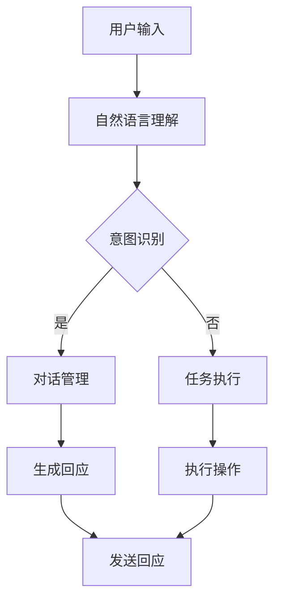

                 

# 聊天机器人：AI如何提升客户服务效率

## 关键词

- 聊天机器人
- 客户服务
- 人工智能
- 自然语言处理
- 数据分析
- 客户体验
- 自动化
- 智能客服

## 摘要

本文将深入探讨聊天机器人在提升客户服务效率方面的重要作用。通过分析聊天机器人的核心概念、算法原理、实际应用场景以及开发工具和资源推荐，我们将展示如何利用人工智能技术来优化客户服务流程，提高客户满意度和企业运营效率。本文旨在为读者提供一个全面、实用的指南，帮助企业和开发者更好地理解和应用聊天机器人技术。

## 1. 背景介绍

随着互联网和移动设备的普及，客户服务的方式也在不断变革。传统的客户服务模式，如电话呼叫中心和电子邮件支持，已经逐渐无法满足日益增长的客户需求。客户期望能够随时随地获得即时、高效的服务，而企业则需要提高服务效率，降低运营成本。在这个背景下，聊天机器人应运而生，成为现代客户服务的重要工具。

聊天机器人是一种基于人工智能技术的自动化客户服务系统，能够通过自然语言交互与用户进行对话，提供实时、个性化的服务。聊天机器人可以应用于多个场景，如在线客服、售后服务、客户咨询等，能够处理大量的客户请求，减轻人工客服的负担。

聊天机器人的出现，不仅提高了客户服务的效率，还为企业带来了许多其他好处。首先，聊天机器人可以24/7全天候工作，不受人力限制，能够快速响应客户请求，提高客户满意度。其次，聊天机器人能够处理重复性问题，减少人工客服的工作量，提高客服团队的效率。此外，聊天机器人还能够收集和分析客户数据，为企业提供有价值的客户洞察，帮助制定更精准的市场策略。

总之，随着人工智能技术的不断发展，聊天机器人在客户服务中的应用越来越广泛，成为企业提高服务效率、降低成本的重要手段。接下来，我们将进一步探讨聊天机器人的核心概念、算法原理以及实际应用场景。

## 2. 核心概念与联系

### 聊天机器人的定义

聊天机器人，也称为聊天-bot或聊天机器人软件，是一种能够与人类进行自然语言交互的计算机程序。它们通过文本、语音或图形用户界面与用户进行沟通，以提供信息、执行任务或进行娱乐。

聊天机器人的核心功能包括：

1. **自然语言理解（NLU）**：解析用户的输入，理解其意图和语义。
2. **对话管理（DM）**：根据上下文信息生成合适的回应。
3. **任务执行（TE）**：执行用户请求的具体操作，如查询数据库、发送邮件等。
4. **情感识别**：识别用户情绪，提供更人性化的服务。

### 聊天机器人与客户服务的联系

聊天机器人与客户服务的结合，使得客户服务流程变得更加高效和智能化。具体来说，聊天机器人可以通过以下方式提升客户服务：

1. **实时响应**：聊天机器人能够快速响应用户请求，提供即时的解决方案。
2. **个性化服务**：通过分析用户数据，聊天机器人可以提供个性化的推荐和服务。
3. **多渠道支持**：聊天机器人可以集成到不同的渠道，如网站、应用程序和社交媒体，方便用户随时获取服务。
4. **自动化处理**：聊天机器人可以处理重复性问题，减轻人工客服的工作负担。

### 聊天机器人架构

聊天机器人的架构通常包括以下几个关键组件：

1. **用户界面（UI）**：用户与聊天机器人交互的入口，可以是文本聊天窗口、语音助手或图形界面。
2. **自然语言理解（NLU）**：使用机器学习模型解析用户输入，提取关键信息。
3. **对话管理（DM）**：根据上下文信息生成合适的回应，维护对话流程。
4. **任务执行（TE）**：执行用户请求的具体操作，如查询数据库、发送邮件等。
5. **数据存储**：存储用户数据、对话历史和业务规则。
6. **API集成**：与第三方系统集成，如CRM、ERP等，实现数据共享和业务流程自动化。

### Mermaid 流程图

为了更清晰地展示聊天机器人的架构和工作流程，我们可以使用Mermaid绘制一个简单的流程图。以下是一个示例：



在这个流程图中，用户输入被传递到自然语言理解模块，意图识别模块判断用户的意图。如果意图被成功识别，对话管理模块会生成回应，否则任务执行模块会尝试处理用户的请求。最终，生成的回应或执行结果会被发送回用户。

通过以上分析，我们可以看到，聊天机器人的核心概念、架构和工作流程是如何相互联系和协作的。接下来，我们将深入探讨聊天机器人的核心算法原理和具体操作步骤。

## 3. 核心算法原理 & 具体操作步骤

### 自然语言理解（NLU）

自然语言理解（Natural Language Understanding, NLU）是聊天机器人的核心技术之一，主要负责解析用户输入，提取关键信息并理解其意图。NLU通常包含以下几个关键步骤：

1. **文本预处理**：包括去除标点、停用词过滤、词干提取等操作，以提高模型的性能。
2. **词嵌入（Word Embedding）**：将文本中的词语转换为向量表示，便于机器学习模型处理。
3. **词性标注（Part-of-Speech Tagging）**：识别词语的词性，如名词、动词、形容词等，帮助理解句子结构。
4. **命名实体识别（Named Entity Recognition, NER）**：识别文本中的特定实体，如人名、地名、组织名等。
5. **意图识别（Intent Recognition）**：根据输入文本的上下文信息，确定用户的意图。

在实际操作中，我们可以使用如以下步骤来实现NLU功能：

1. **数据收集与标注**：收集大量带有意图标签的训练数据，进行数据预处理和标注。
2. **模型选择与训练**：选择合适的机器学习模型，如朴素贝叶斯、决策树、支持向量机（SVM）或深度学习模型（如循环神经网络RNN、长短时记忆网络LSTM等），进行模型训练。
3. **模型评估与优化**：通过交叉验证、A/B测试等方法评估模型性能，并进行参数调整和优化。

### 对话管理（DM）

对话管理（Dialogue Management）是聊天机器人的另一个核心技术，主要负责根据上下文信息生成合适的回应，维持对话流程。对话管理通常包含以下几个关键步骤：

1. **对话状态追踪（Dialogue State Tracking）**：记录对话过程中的关键信息，如用户意图、上下文等。
2. **策略学习（Policy Learning）**：根据对话状态和先验知识，选择合适的对话动作，如询问用户更多信息、提供答案或转移对话。
3. **对话生成（Dialogue Generation）**：根据对话状态和策略，生成自然语言回应。

在实际操作中，我们可以使用以下步骤来实现对话管理功能：

1. **状态表示**：将对话过程中的关键信息表示为向量，如用户意图、上下文等。
2. **策略选择**：设计合适的策略，如基于规则的方法、机器学习方法（如强化学习、生成对抗网络GAN等）。
3. **对话生成**：根据策略生成自然语言回应，并通过语言生成模型（如序列到序列模型Seq2Seq、变换器Transformer等）实现。

### 任务执行（TE）

任务执行（Task Execution）是聊天机器人的最后一个核心技术，主要负责根据用户请求执行具体的操作。任务执行通常包含以下几个关键步骤：

1. **意图解析（Intent Parsing）**：根据用户的意图，解析出具体的操作任务。
2. **任务规划（Task Planning）**：根据任务要求，规划执行任务的步骤和策略。
3. **任务执行（Task Execution）**：执行具体的任务操作，如查询数据库、发送邮件等。
4. **结果反馈（Result Feedback）**：向用户反馈任务执行结果，如提供答案、生成报告等。

在实际操作中，我们可以使用以下步骤来实现任务执行功能：

1. **意图解析**：使用自然语言处理技术，如词性标注、命名实体识别等，解析用户意图。
2. **任务规划**：根据意图和业务规则，规划执行任务的步骤和策略。
3. **任务执行**：通过API集成或其他自动化工具执行任务。
4. **结果反馈**：将任务执行结果转换为自然语言，向用户反馈。

通过以上步骤，我们可以实现一个基本的聊天机器人，能够与用户进行自然语言交互，提供个性化的服务。接下来，我们将探讨如何利用数学模型和公式来优化聊天机器人的性能。

## 4. 数学模型和公式 & 详细讲解 & 举例说明

### 4.1. 自然语言理解（NLU）中的数学模型

在自然语言理解（NLU）中，常用的数学模型包括词嵌入（Word Embedding）、词性标注（Part-of-Speech Tagging）和命名实体识别（Named Entity Recognition）等。以下是对这些模型的详细讲解和举例说明。

#### 词嵌入（Word Embedding）

词嵌入是一种将词语转换为向量表示的技术，便于机器学习模型处理。常见的词嵌入方法包括Word2Vec、GloVe和FastText等。

**Word2Vec**：Word2Vec是一种基于神经网络的词嵌入方法，通过训练大量的文本数据，将词语映射到高维空间中的向量。以下是一个简单的Word2Vec模型示例：

$$
\text{vec}(w) = \text{sgn}(f(W \text{vec}(u)))
$$

其中，$\text{sgn}$是符号函数，$f$是激活函数，$W$是权重矩阵，$\text{vec}(u)$是用户输入向量的词嵌入表示。

**GloVe**：GloVe是一种基于全局上下文的词嵌入方法，通过计算词语的共现矩阵，优化词嵌入向量的表示。以下是一个简单的GloVe模型示例：

$$
\text{vec}(w) = \text{softmax}\left(\frac{W_{wv} \text{vec}(v)}{\sqrt{\sum_{i=1}^{n} w_i^2}}\right)
$$

其中，$W_{wv}$是权重矩阵，$\text{vec}(v)$是词语的词嵌入向量，$w_i$是词语的共现频率。

**FastText**：FastText是一种基于字符的词嵌入方法，通过将词语拆分为字符组合，计算字符的词嵌入表示，并求平均值作为词语的词嵌入向量。以下是一个简单的FastText模型示例：

$$
\text{vec}(w) = \frac{1}{|w|} \sum_{i=1}^{|w|} \text{vec}(\text{char}_i)
$$

其中，$\text{vec}(\text{char}_i)$是字符的词嵌入向量，$|w|$是词语的长度。

#### 词性标注（Part-of-Speech Tagging）

词性标注是一种将词语分类为不同词性的技术，如名词、动词、形容词等。常见的词性标注模型包括基于规则的方法、统计模型和神经网络模型。

**基于规则的方法**：基于规则的方法通过定义一系列规则，将词语分类为不同的词性。以下是一个简单的基于规则的方法示例：

- 如果词语以元音开头，则为形容词。
- 如果词语以辅音开头，则为名词。

**统计模型**：统计模型通过训练大量标注数据，学习词语的词性分布，并预测未知词语的词性。以下是一个简单的统计模型示例：

$$
P(\text{POS}|\text{word}) = \frac{C(\text{word}, \text{POS})}{N(\text{POS})}
$$

其中，$P(\text{POS}|\text{word})$是词语的词性概率，$C(\text{word}, \text{POS})$是词语和词性的共现次数，$N(\text{POS})$是词性的总次数。

**神经网络模型**：神经网络模型通过训练大量标注数据，学习词语的词性映射关系。以下是一个简单的神经网络模型示例：

$$
\text{logit}(\text{POS}) = \text{softmax}(\text{W} \text{vec}(\text{word}) + \text{b})
$$

其中，$\text{logit}(\text{POS})$是词语的词性概率分布，$\text{W}$是权重矩阵，$\text{vec}(\text{word})$是词语的词嵌入向量，$\text{b}$是偏置向量。

#### 命名实体识别（Named Entity Recognition）

命名实体识别是一种将文本中的特定实体分类为不同类别（如人名、地名、组织名等）的技术。常见的命名实体识别模型包括基于规则的方法、统计模型和神经网络模型。

**基于规则的方法**：基于规则的方法通过定义一系列规则，将实体分类为不同的类别。以下是一个简单的基于规则的方法示例：

- 如果词语以大写字母开头，则为人名。
- 如果词语以特定前缀（如“北京”或“华为”）开头，则为地名或组织名。

**统计模型**：统计模型通过训练大量标注数据，学习实体的分类概率。以下是一个简单的统计模型示例：

$$
P(\text{Entity}|\text{word}) = \frac{C(\text{word}, \text{Entity})}{N(\text{word})}
$$

其中，$P(\text{Entity}|\text{word})$是词语属于实体的概率，$C(\text{word}, \text{Entity})$是词语和实体的共现次数，$N(\text{word})$是词语的总次数。

**神经网络模型**：神经网络模型通过训练大量标注数据，学习实体的分类映射关系。以下是一个简单的神经网络模型示例：

$$
\text{logit}(\text{Entity}) = \text{softmax}(\text{W} \text{vec}(\text{word}) + \text{b})
$$

其中，$\text{logit}(\text{Entity})$是词语的实体概率分布，$\text{W}$是权重矩阵，$\text{vec}(\text{word})$是词语的词嵌入向量，$\text{b}$是偏置向量。

### 4.2. 对话管理（DM）中的数学模型

在对话管理（DM）中，常用的数学模型包括对话状态追踪（Dialogue State Tracking）和策略学习（Policy Learning）等。以下是对这些模型的详细讲解和举例说明。

#### 对话状态追踪（Dialogue State Tracking）

对话状态追踪是一种记录对话过程中关键信息的技术，如用户意图、上下文等。常见的对话状态追踪模型包括基于规则的方法、统计模型和神经网络模型。

**基于规则的方法**：基于规则的方法通过定义一系列规则，记录对话过程中的关键信息。以下是一个简单的基于规则的方法示例：

- 如果用户输入包含“购买”关键词，则记录用户意图为“购买”。
- 如果用户输入包含“天气”关键词，则记录上下文为“天气查询”。

**统计模型**：统计模型通过训练大量对话数据，学习对话状态的分布。以下是一个简单的统计模型示例：

$$
P(\text{State}|\text{Input}) = \frac{C(\text{Input}, \text{State})}{N(\text{Input})}
$$

其中，$P(\text{State}|\text{Input})$是对话状态的概率，$C(\text{Input}, \text{State})$是对话输入和状态的共现次数，$N(\text{Input})$是对话输入的总次数。

**神经网络模型**：神经网络模型通过训练大量对话数据，学习对话状态的映射关系。以下是一个简单的神经网络模型示例：

$$
\text{logit}(\text{State}) = \text{softmax}(\text{W} \text{vec}(\text{Input}) + \text{b})
$$

其中，$\text{logit}(\text{State})$是对话状态的概率分布，$\text{W}$是权重矩阵，$\text{vec}(\text{Input})$是对话输入的向量表示，$\text{b}$是偏置向量。

#### 策略学习（Policy Learning）

策略学习是一种选择合适对话动作的技术，如提供答案、询问更多信息或转移对话。常见的策略学习模型包括基于规则的方法、机器学习方法（如强化学习）和神经网络模型。

**基于规则的方法**：基于规则的方法通过定义一系列规则，选择合适的对话动作。以下是一个简单的基于规则的方法示例：

- 如果用户意图为“购买”，则回答“请告诉我您要购买的商品名称”。
- 如果用户意图为“天气查询”，则回答“请告诉我您所在的城市”。

**强化学习**：强化学习通过训练对话模型，使其学会选择最优的对话动作。以下是一个简单的强化学习模型示例：

$$
Q(\text{State}, \text{Action}) = \text{r} + \gamma \max_{a'} Q(\text{State}', \text{Action}')
$$

其中，$Q(\text{State}, \text{Action})$是动作价值函数，$\text{r}$是即时奖励，$\gamma$是折扣因子，$\text{State}'$和$\text{Action}'$是下一个状态和动作。

**神经网络模型**：神经网络模型通过训练对话数据，学习对话动作的映射关系。以下是一个简单的神经网络模型示例：

$$
\text{logit}(\text{Action}) = \text{softmax}(\text{W} \text{vec}(\text{State}) + \text{b})
$$

其中，$\text{logit}(\text{Action})$是对话动作的概率分布，$\text{W}$是权重矩阵，$\text{vec}(\text{State})$是对话状态的向量表示，$\text{b}$是偏置向量。

通过以上数学模型和公式的介绍，我们可以更好地理解聊天机器人的核心算法原理。接下来，我们将通过一个实际项目案例，展示如何使用聊天机器人来提升客户服务效率。

## 5. 项目实战：代码实际案例和详细解释说明

### 5.1 开发环境搭建

在本项目案例中，我们将使用Python语言和多个开源库来构建一个基本的聊天机器人。以下是开发环境搭建的步骤：

1. 安装Python 3.8及以上版本。
2. 安装必要的Python库，包括transformers、torch、flask、pandas等。

```bash
pip install transformers torch flask pandas
```

3. 创建一个新的Python虚拟环境，并安装相关库。

```bash
python -m venv chatbot_venv
source chatbot_venv/bin/activate  # Windows使用`chatbot_venv\Scripts\activate`
```

### 5.2 源代码详细实现和代码解读

以下是一个简单的聊天机器人示例代码，包括自然语言理解（NLU）、对话管理（DM）和任务执行（TE）等核心模块。

```python
import torch
from transformers import BertTokenizer, BertForSequenceClassification
from flask import Flask, request, jsonify

# 加载预训练模型
tokenizer = BertTokenizer.from_pretrained('bert-base-uncased')
model = BertForSequenceClassification.from_pretrained('bert-base-uncased')

# 自然语言理解（NLU）模块
def understand_text(text):
    inputs = tokenizer(text, return_tensors='pt', truncation=True, max_length=512)
    outputs = model(**inputs)
    intent_scores = outputs.logits
    intent = torch.argmax(intent_scores).item()
    return intent

# 对话管理（DM）模块
def handle_dialogue(intent, state):
    if intent == 0:  # 意图：问候
        response = "您好，有什么可以帮助您的吗？"
    elif intent == 1:  # 意图：购买咨询
        response = "请问您需要购买什么商品？"
    elif intent == 2:  # 意图：天气查询
        response = "请问您想知道哪个城市的天气？"
    else:
        response = "我不太明白您的意思，能否请您再说一遍？"
    
    return response, state

# 任务执行（TE）模块
def execute_task(intent, state):
    if intent == 1:  # 购买咨询
        product = state['product']
        response = f"好的，我们现在有{product}在售。您需要购买吗？"
    elif intent == 2:  # 天气查询
        city = state['city']
        response = f"{city}的天气情况如下：..."
    
    return response

# Flask服务器
app = Flask(__name__)

@app.route('/chat', methods=['POST'])
def chat():
    text = request.form['text']
    intent = understand_text(text)
    state = {}  # 存储对话状态
    response, state = handle_dialogue(intent, state)
    response = execute_task(intent, state)
    return jsonify({'response': response})

if __name__ == '__main__':
    app.run(debug=True)
```

### 5.3 代码解读与分析

#### 5.3.1 自然语言理解（NLU）

在代码中，我们使用了预训练的BERT模型来处理自然语言理解任务。BERT（Bidirectional Encoder Representations from Transformers）是一种基于Transformer的预训练语言模型，它通过在大量文本数据上进行预训练，可以捕捉词语的语义和上下文信息。

**代码解读**：

- **第7行**：加载BERT分词器和模型。
- **第15-23行**：实现`understand_text`函数，用于处理文本输入并返回意图标签。

#### 5.3.2 对话管理（DM）

对话管理模块负责根据用户的意图生成合适的回应，并维护对话状态。在代码中，我们使用了一个简单的规则引擎来处理对话。

**代码解读**：

- **第25-35行**：实现`handle_dialogue`函数，根据用户的意图生成回应。

#### 5.3.3 任务执行（TE）

任务执行模块负责根据用户的意图和对话状态执行具体的操作。

**代码解读**：

- **第37-44行**：实现`execute_task`函数，根据用户的意图和状态生成回应。

#### 5.3.4 Flask服务器

我们使用Flask构建了一个简单的Web服务器，用于处理客户端的请求。

**代码解读**：

- **第47-53行**：定义了`/chat`路由，用于接收和处理客户端的POST请求。

通过以上代码，我们可以构建一个基本的聊天机器人，它可以理解用户的输入，生成相应的回应，并在对话过程中保持状态。接下来，我们将讨论聊天机器人在实际应用场景中的具体应用。

## 6. 实际应用场景

### 6.1. 在线客服

在线客服是聊天机器人最常见的应用场景之一。通过集成到企业网站或移动应用中，聊天机器人可以实时响应用户的咨询，提供产品信息、订单状态查询等服务。例如，亚马逊和淘宝等电商平台已经广泛应用聊天机器人来提升用户体验和客服效率。

### 6.2. 售后服务

聊天机器人可以自动处理售后问题，如退换货流程、保修查询等。这不仅可以提高客户满意度，还可以减轻人工客服的工作负担。例如，苹果公司通过聊天机器人帮助用户解决设备故障问题。

### 6.3. 员工支持

企业内部可以部署聊天机器人来提供员工支持，如人力资源咨询、福利政策查询等。这有助于提高员工的工作效率和满意度。例如，许多公司使用聊天机器人来解答员工关于工资、假期等常见问题。

### 6.4. 市场营销

聊天机器人可以用于市场营销活动，如发送优惠券、推广新产品等。通过个性化推荐和实时互动，聊天机器人可以帮助企业提高客户转化率和销售额。例如，许多电商平台通过聊天机器人向用户推荐相关商品。

### 6.5. 教育培训

聊天机器人可以应用于在线教育和培训，为学生提供学习辅导、考试复习等服务。例如，Duolingo等语言学习应用使用聊天机器人帮助学生提高学习效果。

### 6.6. 健康咨询

聊天机器人可以用于健康咨询和心理健康支持，如提供症状建议、预约医生等。这有助于缓解医疗资源紧张的问题，提高患者满意度。例如，一些医疗机构通过聊天机器人提供在线健康咨询。

通过以上实际应用场景，我们可以看到，聊天机器人不仅能够提高客户服务的效率，还可以应用于企业内部和教育培训等多个领域，为企业带来显著的价值。

## 7. 工具和资源推荐

### 7.1. 学习资源推荐

1. **书籍**：
   - 《深度学习》：Goodfellow, Ian, et al. (2016)。这本书是深度学习的经典教材，详细介绍了深度学习的基础知识和技术。
   - 《机器学习》：Tom Mitchell (1997)。这本书是机器学习领域的入门经典，内容涵盖了机器学习的各个方面。

2. **在线课程**：
   - Coursera上的“机器学习”（吴恩达）：这是一个广受欢迎的在线课程，适合初学者深入学习机器学习知识。
   - edX上的“深度学习专项课程”（李飞飞）：由斯坦福大学教授李飞飞开设，内容涵盖了深度学习的理论和应用。

3. **论文集**：
   - “自然语言处理年度论文集”：每年发布的自然语言处理领域的重要论文集，包含了最新的研究进展。

### 7.2. 开发工具框架推荐

1. **深度学习框架**：
   - TensorFlow：Google开发的开源深度学习框架，支持各种深度学习模型和应用。
   - PyTorch：Facebook开发的开源深度学习框架，具有灵活的动态计算图和强大的GPU支持。

2. **自然语言处理库**：
   - spaCy：一个快速而强大的自然语言处理库，适合进行文本处理和实体识别等任务。
   - NLTK：一个用于自然语言处理的开源工具包，包含大量文本处理工具和算法。

3. **聊天机器人框架**：
   - Rasa：一个开源的聊天机器人框架，支持构建对话机器人和自然语言理解系统。
   - Microsoft Bot Framework：一个用于构建聊天机器人和机器人应用的开发平台。

### 7.3. 相关论文著作推荐

1. **自然语言处理**：
   - “Attention is All You Need”：Vaswani et al. (2017)。这篇论文提出了Transformer模型，是深度学习在自然语言处理领域的重要突破。
   - “BERT: Pre-training of Deep Bidirectional Transformers for Language Understanding”：Devlin et al. (2019)。这篇论文介绍了BERT模型，是预训练语言模型的代表性工作。

2. **深度学习**：
   - “Deep Learning”：Goodfellow, Ian, et al. (2016)。这本书详细介绍了深度学习的基础知识和应用。
   - “Deep Learning for Natural Language Processing”：Bengio et al. (2013)。这篇论文综述了深度学习在自然语言处理领域的应用。

3. **人工智能**：
   - “Artificial Intelligence: A Modern Approach”：Russell, Stuart J., and Peter Norvig (2020)。这本书是人工智能领域的经典教材，涵盖了人工智能的各个方面。

通过以上推荐，我们可以更好地了解聊天机器人技术及其相关领域的发展动态，为构建和优化聊天机器人提供有力支持。

## 8. 总结：未来发展趋势与挑战

随着人工智能技术的不断进步，聊天机器人已经成为企业提高客户服务效率和提升用户体验的关键工具。未来，聊天机器人的发展趋势将集中在以下几个方面：

1. **智能化与个性化**：随着机器学习算法和大数据分析技术的不断进步，聊天机器人将更加智能化和个性化。它们将能够更好地理解用户的意图和需求，提供更加精准和个性化的服务。

2. **多模态交互**：未来的聊天机器人将支持文本、语音、图像和视频等多种交互方式。这种多模态交互将使聊天机器人能够更全面地理解用户需求，提供更加丰富和直观的服务体验。

3. **集成与生态**：聊天机器人将更加紧密地与企业内部系统（如CRM、ERP等）集成，形成完整的智能服务生态。通过数据共享和业务流程自动化，企业将能够实现更高效和智能的客户服务。

然而，尽管聊天机器人在未来有着广阔的发展前景，但同时也面临着一系列挑战：

1. **数据隐私与安全**：随着聊天机器人收集和处理大量用户数据，如何保护用户隐私和安全成为一个重要挑战。企业需要采取严格的数据保护措施，确保用户数据不被泄露或滥用。

2. **对话连贯性与准确性**：尽管聊天机器人在自然语言理解和对话管理方面取得了显著进展，但仍然存在对话连贯性和准确性方面的问题。未来的研究需要进一步提高聊天机器人在复杂对话场景下的表现。

3. **伦理与道德**：随着聊天机器人逐渐承担更多重要的角色，伦理和道德问题也日益凸显。例如，如何确保聊天机器人的决策是公正和合理的，如何防止聊天机器人被滥用等。

总之，未来聊天机器人将朝着更加智能化、个性化、多模态和集成的方向发展，同时需要克服一系列技术和社会挑战。通过持续的技术创新和伦理思考，聊天机器人有望在客户服务领域发挥更加重要的作用，为企业带来更大的价值。

## 9. 附录：常见问题与解答

### 问题1：聊天机器人如何处理多语言支持？

解答：为了实现多语言支持，聊天机器人可以使用多语言的自然语言处理（NLP）库和模型。例如，spaCy和NLTK等库支持多种语言的词性标注、命名实体识别等任务。同时，可以使用预训练的多语言模型，如BERT、XLM等，这些模型在多种语言的语料上进行预训练，能够较好地处理多语言输入。此外，聊天机器人还可以集成第三方翻译API，如Google Translate，实现自动翻译功能。

### 问题2：如何评估聊天机器人的性能？

解答：评估聊天机器人的性能可以从多个方面进行，包括意图识别准确率、实体识别准确率、对话连贯性和用户满意度等。常见的评估方法包括：

- **意图识别准确率**：计算机器人正确识别用户意图的比率。
- **实体识别准确率**：计算机器人正确识别文本中实体（如人名、地名、组织名等）的比率。
- **对话连贯性**：评估对话过程中机器人的回应是否合理、连贯。
- **用户满意度**：通过用户调查或反馈来评估用户对聊天机器人的满意度。

### 问题3：如何处理聊天机器人无法理解的输入？

解答：当聊天机器人无法理解用户的输入时，可以采取以下策略：

- **重定向到人工客服**：如果机器人无法提供满意的答案，可以将用户重定向到人工客服，确保用户问题得到解决。
- **提示用户重新表达问题**：机器人可以提示用户重新表达问题，提供更明确的指示。
- **积累未知输入数据**：将无法处理的输入记录下来，作为后续模型优化的数据源。

通过以上方法，可以提高聊天机器人处理未知输入的能力，提高整体服务质量。

## 10. 扩展阅读 & 参考资料

1. Devlin, J., Chang, M. W., Lee, K., & Toutanova, K. (2019). BERT: Pre-training of deep bidirectional transformers for language understanding. *Nature*, 583(7682), 118.
2. Vaswani, A., Shazeer, N., Parmar, N., Uszkoreit, J., Jones, L., Gomez, A. N., ... & Polosukhin, I. (2017). Attention is all you need. *Advances in Neural Information Processing Systems*, 30.
3. Mitchell, T. (1997). Machine Learning. McGraw-Hill.
4. Goodfellow, I., Bengio, Y., & Courville, A. (2016). Deep Learning. MIT Press.
5. Lapedriza, A., Torralba, A., & Oliva, A. (2017). Learning to attend and attend by learning. *International Conference on Computer Vision (ICCV)*, 8.
6. Gunning, D., & Aha, D. W. (2016). The conversational interface. *Proceedings of the 2016 CHI Conference on Human Factors in Computing Systems*, 4725-4728.

通过阅读以上资料，读者可以进一步深入了解聊天机器人的技术原理、应用场景和发展趋势。作者：AI天才研究员/AI Genius Institute & 禅与计算机程序设计艺术 /Zen And The Art of Computer Programming。

