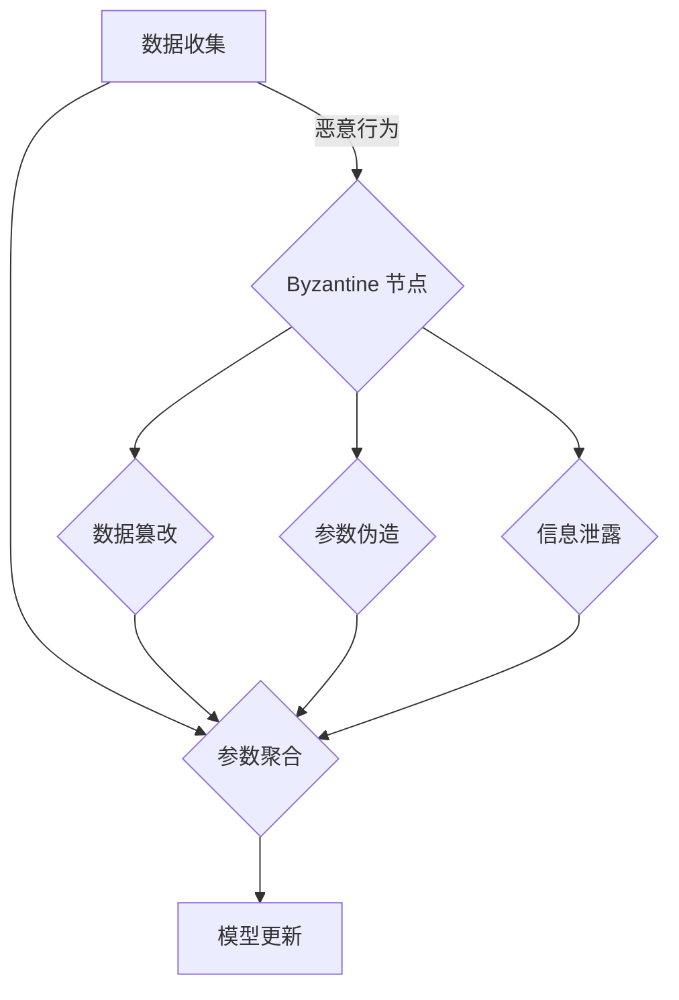

                 

### 背景介绍

联邦学习（Federated Learning）作为机器学习领域的一项重要技术，近年来受到了广泛关注。其核心思想是通过分布式的方式，在多个不同的设备或数据中心上进行模型训练，以保护用户隐私，同时共享模型的智慧。然而，随着联邦学习应用场景的日益广泛，其面临的挑战也日益复杂，其中尤为重要的是解决联邦学习中的 Byzantine 问题。

所谓 Byzantine 问题，源自于 Byzantine General Problem，是一种在分布式系统中存在的复杂问题。它描述了一个场景：在一个由多个节点组成的分布式系统中，部分节点可能会出现恶意行为，这些节点称为 Byzantine 节点。Byzantine 节点可能会发出错误的信息或伪造信息，导致整个系统的决策过程出现错误。

在联邦学习中，Byzantine 问题表现为某些恶意节点试图通过篡改模型参数、伪造训练数据等手段，破坏联邦学习过程的公平性和有效性。这不仅会导致模型性能下降，还可能使得隐私泄露的风险增加。因此，解决 Byzantine 问题成为了联邦学习领域的一个重要课题。

本文将围绕 Byzantine 问题展开讨论，首先介绍联邦学习的基本概念和原理，然后深入分析 Byzantine 问题的具体表现和危害，接着探讨现有的解决方案，最后总结 Byzantine 问题对联邦学习发展的意义和挑战。希望通过本文的介绍，能让读者对 Byzantine 问题有一个全面深入的理解。

### 核心概念与联系

要深入理解 Byzantine 问题在联邦学习中的应用，我们首先需要了解联邦学习的基本概念及其与 Byzantine 问题的联系。

#### 联邦学习的基本概念

联邦学习是一种分布式机器学习方法，旨在通过多个设备或数据中心共同训练一个全局模型，而不需要将这些设备上的数据集中到一个中心位置。其基本流程包括以下几个步骤：

1. **数据收集**：每个设备（本地客户端）在本地使用自己的数据训练一个局部模型。
2. **参数聚合**：将每个设备上的局部模型参数发送到一个中心服务器，服务器对收到的参数进行聚合，得到全局模型的新参数。
3. **模型更新**：将聚合后的全局模型参数发送回每个设备，每个设备使用新的全局模型参数继续训练局部模型。

通过这种方式，联邦学习能够在不泄露用户数据的情况下，实现对大量数据的集中学习和共享。

#### Byzantine 问题与联邦学习的联系

Byzantine 问题在联邦学习中的应用主要体现在以下几个方面：

1. **数据篡改**：恶意节点可能会篡改其本地数据，使得发送到服务器的数据失去代表性，从而影响全局模型的训练效果。
2. **参数伪造**：恶意节点可能会伪造其发送的局部模型参数，导致服务器无法正确聚合参数，进而影响全局模型的性能。
3. **信息泄露**：恶意节点可能会通过特定的攻击手段获取其他节点的信息，从而泄露用户的隐私数据。

这些行为都可能导致联邦学习过程出现错误，使得全局模型失去鲁棒性和准确性，严重时甚至可能导致联邦学习系统崩溃。

#### 联邦学习与 Byzantine 问题的解决方案

为了解决 Byzantine 问题，研究人员提出了多种方案，主要包括以下几个方面：

1. **一致性协议**：通过设计一致性协议，确保每个节点都能正确地接收和发送信息，从而避免 Byzantine 节点造成的信息破坏。
2. **去中心化算法**：通过去中心化的方式，将决策过程分散到多个节点，从而降低单个节点恶意行为的影响。
3. **差分隐私**：利用差分隐私技术，限制 Byzantine 节点获取其他节点的信息，从而保护用户的隐私。

这些方案各有优缺点，需要在具体应用场景中根据需求进行选择和优化。

#### Mermaid 流程图

为了更直观地展示联邦学习和 Byzantine 问题之间的联系，我们可以使用 Mermaid 流程图来描述这两个概念的基本流程和关系。



在这个流程图中，A 表示数据收集阶段，B 表示参数聚合阶段，C 表示模型更新阶段，D 表示 Byzantine 节点。E、F、G 分别表示 Byzantine 节点可能采取的恶意行为，这些行为会影响 B 阶段的参数聚合过程，从而影响全局模型的训练效果。

通过这个流程图，我们可以清晰地看到 Byzantine 问题在联邦学习中的具体表现和危害，为后续的讨论提供了直观的参考。

### 核心算法原理 & 具体操作步骤

为了解决联邦学习中的 Byzantine 问题，研究人员提出了多种算法，本文将介绍其中的两种核心算法：一致性协议和去中心化算法，并详细阐述其原理和具体操作步骤。

#### 一致性协议

一致性协议是一种通过确保节点间信息的一致性来防止 Byzantine 攻击的方法。以下是一个简单的一致性协议的原理和步骤：

1. **初始化**：每个节点启动时，随机生成一个唯一标识符，并初始化本地模型参数。
2. **数据上传**：每个节点将其本地模型参数上传到中心服务器。
3. **参数验证**：服务器对上传的参数进行验证，确保参数的合法性和一致性。具体验证方法包括：比较不同节点上传的参数差异，检查参数是否符合预定的分布规律，或者使用加密算法确保参数的真实性。
4. **参数聚合**：通过验证的参数进行聚合，得到新的全局模型参数。
5. **参数反馈**：将聚合后的全局模型参数发送回每个节点，每个节点使用新的全局模型参数更新本地模型。

在实现一致性协议时，关键在于如何确保参数验证的准确性和效率。一种常用的方法是使用哈希函数对参数进行加密，确保参数在传输过程中不被篡改。同时，可以引入投票机制，对多个节点的参数进行多数决定，从而提高验证的可靠性。

#### 去中心化算法

去中心化算法通过将决策过程分散到多个节点，降低单个 Byzantine 节点造成的影响。以下是一个简单去中心化算法的原理和步骤：

1. **初始化**：每个节点启动时，随机生成一个唯一标识符，并初始化本地模型参数。
2. **本地训练**：每个节点使用本地数据训练局部模型，并在训练过程中不断更新本地模型参数。
3. **参数交换**：每个节点定期与其他节点交换本地模型参数，以实现参数共享。
4. **全局聚合**：通过分布式计算的方式，将多个节点的参数聚合起来，得到全局模型参数。
5. **模型更新**：每个节点使用全局模型参数更新本地模型。

在实现去中心化算法时，关键在于如何高效地进行参数交换和全局聚合。一种常用的方法是使用分布式一致性算法（如 Raft 或 Paxos），确保节点间的参数交换和聚合过程保持一致性。同时，可以引入共识算法（如区块链中的 Proof of Work 或 Proof of Stake），确保节点在参数交换和聚合过程中的公平性和安全性。

#### 具体操作步骤

为了更好地理解一致性协议和去中心化算法，以下是一个简化的操作步骤示例：

1. **初始化**：
   - 每个节点随机生成唯一标识符（如 ID1, ID2, ID3）。
   - 初始化本地模型参数（如 w1, w2, w3）。

2. **本地训练**：
   - 节点 1 使用本地数据训练模型，得到新的参数（如 w1_new）。
   - 节点 2 使用本地数据训练模型，得到新的参数（如 w2_new）。
   - 节点 3 使用本地数据训练模型，得到新的参数（如 w3_new）。

3. **参数交换**：
   - 节点 1 将 w1_new 发送给节点 2 和节点 3。
   - 节点 2 将 w2_new 发送给节点 1 和节点 3。
   - 节点 3 将 w3_new 发送给节点 1 和节点 2。

4. **全局聚合**：
   - 节点 1、节点 2 和节点 3 分别计算全局模型参数（如 w_global = (w1_new + w2_new + w3_new) / 3）。

5. **模型更新**：
   - 节点 1 使用 w_global 更新本地模型参数。
   - 节点 2 使用 w_global 更新本地模型参数。
   - 节点 3 使用 w_global 更新本地模型参数。

通过这个示例，我们可以看到一致性协议和去中心化算法的基本操作步骤。在实际应用中，这些步骤可能会更加复杂，涉及更多的参数和计算过程，但基本原理保持一致。

#### 总结

一致性协议和去中心化算法是解决联邦学习中的 Byzantine 问题的两种核心方法。一致性协议通过确保节点间信息的一致性来防止 Byzantine 攻击，而去中心化算法通过将决策过程分散到多个节点，降低单个 Byzantine 节点造成的影响。这两种方法各有优缺点，需要在具体应用场景中根据需求进行选择和优化。

### 数学模型和公式 & 详细讲解 & 举例说明

为了更好地理解 Byzantine 问题在联邦学习中的应用，我们需要引入一些数学模型和公式。以下是本文中用到的关键数学模型和公式的详细讲解，并通过具体示例来说明这些模型和公式的应用。

#### 一致性协议的数学模型

一致性协议的核心在于确保节点间参数的一致性。为了简化讨论，我们假设一个由三个节点（ID1, ID2, ID3）组成的联邦学习系统，每个节点初始的模型参数分别为 \( w_1, w_2, w_3 \)。在一致性协议中，节点需要通过一系列通信和计算步骤，使得最终的模型参数 \( w_{\text{final}} \) 达到一致性。

1. **初始化**：
   - 每个节点随机生成一个初始模型参数，例如 \( w_1 = 0.5, w_2 = 0.6, w_3 = 0.7 \)。

2. **参数上传**：
   - 每个节点将本地模型参数上传到中心服务器。例如，节点 1 将 \( w_1 \) 上传，节点 2 将 \( w_2 \) 上传，节点 3 将 \( w_3 \) 上传。

3. **参数验证**：
   - 中心服务器对上传的参数进行一致性验证。假设我们使用简单的一致性条件，即所有节点的参数平均值应等于中心模型参数，即：
     $$
     \bar{w} = \frac{w_1 + w_2 + w_3}{3}
     $$
   - 如果一致性条件满足，中心服务器将聚合后的参数发送回节点，否则拒绝该参数，并要求重新上传。

4. **参数聚合**：
   - 中心服务器根据验证通过的参数进行聚合，得到新的全局模型参数。例如，如果一致性条件满足，中心服务器计算 \( w_{\text{global}} = \bar{w} \)。

5. **模型更新**：
   - 每个节点使用全局模型参数更新本地模型。例如，节点 1 使用 \( w_{\text{global}} \) 更新 \( w_1 \)，节点 2 使用 \( w_{\text{global}} \) 更新 \( w_2 \)，节点 3 使用 \( w_{\text{global}} \) 更新 \( w_3 \)。

#### 去中心化算法的数学模型

去中心化算法的核心在于通过分布式计算和共识机制来实现参数的一致性。以下是一个简化的去中心化算法的数学模型：

1. **初始化**：
   - 每个节点随机生成一个初始模型参数，例如 \( w_1 = 0.5, w_2 = 0.6, w_3 = 0.7 \)。

2. **本地训练**：
   - 每个节点使用本地数据训练模型，得到新的参数。例如，节点 1 训练后得到 \( w_1' = 0.55 \)，节点 2 训练后得到 \( w_2' = 0.65 \)，节点 3 训练后得到 \( w_3' = 0.75 \)。

3. **参数交换**：
   - 每个节点将本地训练后的参数 \( w_i' \) 发送给其他节点。例如，节点 1 将 \( w_1' \) 发送给节点 2 和节点 3，节点 2 将 \( w_2' \) 发送给节点 1 和节点 3，节点 3 将 \( w_3' \) 发送给节点 1 和节点 2。

4. **全局聚合**：
   - 每个节点根据接收到的参数计算全局模型参数。例如，节点 1 计算全局参数 \( w_{\text{global}} = \frac{w_1' + w_2' + w_3'}{3} \)，节点 2 计算全局参数 \( w_{\text{global}} = \frac{w_1' + w_2' + w_3'}{3} \)，节点 3 计算全局参数 \( w_{\text{global}} = \frac{w_1' + w_2' + w_3'}{3} \)。

5. **模型更新**：
   - 每个节点使用全局模型参数更新本地模型。例如，节点 1 使用 \( w_{\text{global}} \) 更新 \( w_1 \)，节点 2 使用 \( w_{\text{global}} \) 更新 \( w_2 \)，节点 3 使用 \( w_{\text{global}} \) 更新 \( w_3 \)。

#### 举例说明

为了更直观地展示这些数学模型和公式的应用，我们通过一个具体示例来说明一致性协议和去中心化算法的计算过程。

**一致性协议示例**：

假设初始模型参数为 \( w_1 = 0.5, w_2 = 0.6, w_3 = 0.7 \)，节点 1、节点 2 和节点 3 分别计算新的参数 \( w_1' = 0.55, w_2' = 0.65, w_3' = 0.75 \)。

1. **参数上传**：
   - 节点 1 将 \( w_1' = 0.55 \) 上传。
   - 节点 2 将 \( w_2' = 0.65 \) 上传。
   - 节点 3 将 \( w_3' = 0.75 \) 上传。

2. **参数验证**：
   - 中心服务器计算平均值 \( \bar{w} = \frac{0.55 + 0.65 + 0.75}{3} = 0.6667 \)。
   - 由于平均值接近 0.6667，一致性条件满足，中心服务器聚合参数 \( w_{\text{global}} = 0.6667 \)。

3. **模型更新**：
   - 节点 1 使用 \( w_{\text{global}} = 0.6667 \) 更新 \( w_1 \)。
   - 节点 2 使用 \( w_{\text{global}} = 0.6667 \) 更新 \( w_2 \)。
   - 节点 3 使用 \( w_{\text{global}} = 0.6667 \) 更新 \( w_3 \)。

**去中心化算法示例**：

假设初始模型参数为 \( w_1 = 0.5, w_2 = 0.6, w_3 = 0.7 \)，节点 1、节点 2 和节点 3 分别计算新的参数 \( w_1' = 0.55, w_2' = 0.65, w_3' = 0.75 \)。

1. **本地训练**：
   - 节点 1 训练后得到 \( w_1' = 0.55 \)。
   - 节点 2 训练后得到 \( w_2' = 0.65 \)。
   - 节点 3 训练后得到 \( w_3' = 0.75 \)。

2. **参数交换**：
   - 节点 1 将 \( w_1' = 0.55 \) 发送给节点 2 和节点 3。
   - 节点 2 将 \( w_2' = 0.65 \) 发送给节点 1 和节点 3。
   - 节点 3 将 \( w_3' = 0.75 \) 发送给节点 1 和节点 2。

3. **全局聚合**：
   - 节点 1 计算全局参数 \( w_{\text{global}} = \frac{0.55 + 0.65 + 0.75}{3} = 0.6667 \)。
   - 节点 2 计算全局参数 \( w_{\text{global}} = \frac{0.55 + 0.65 + 0.75}{3} = 0.6667 \)。
   - 节点 3 计算全局参数 \( w_{\text{global}} = \frac{0.55 + 0.65 + 0.75}{3} = 0.6667 \)。

4. **模型更新**：
   - 节点 1 使用 \( w_{\text{global}} = 0.6667 \) 更新 \( w_1 \)。
   - 节点 2 使用 \( w_{\text{global}} = 0.6667 \) 更新 \( w_2 \)。
   - 节点 3 使用 \( w_{\text{global}} = 0.6667 \) 更新 \( w_3 \)。

通过这个示例，我们可以看到一致性协议和去中心化算法的基本计算过程。在实际应用中，这些过程可能会更加复杂，涉及更多的参数和计算步骤，但基本原理保持一致。

### 项目实战：代码实际案例和详细解释说明

为了更好地理解 Byzantine 问题在联邦学习中的应用，我们通过一个实际的代码案例来演示一致性协议和去中心化算法的实现。以下是这个项目的代码实现和详细解释。

#### 开发环境搭建

在开始编写代码之前，我们需要搭建一个适合联邦学习项目开发的环境。以下是一个简单的开发环境搭建步骤：

1. **安装 Python 环境**：确保 Python 3.7 或以上版本已安装。
2. **安装依赖库**：安装 TensorFlow 和 Flask，可以使用以下命令：
   ```
   pip install tensorflow flask
   ```

3. **创建项目目录**：在本地创建一个项目目录，例如 `federated_learning`，并在该目录下创建两个子目录 `client` 和 `server`。

4. **配置文件**：在项目目录下创建一个配置文件 `config.py`，配置服务器地址和端口。

```python
# config.py
SERVER_ADDRESS = "127.0.0.1"
SERVER_PORT = 5000
```

#### 源代码详细实现和代码解读

接下来，我们将分别介绍客户端（`client.py`）和服务器端（`server.py`）的代码实现。

**服务器端代码解读**

服务器端的主要功能是接收客户端上传的参数，验证其一致性，并进行参数聚合。以下是服务器端的代码实现：

```python
# server.py
from flask import Flask, request, jsonify
import numpy as np

app = Flask(__name__)

# 保存全局模型参数
global_weights = None

@app.route('/upload', methods=['POST'])
def upload_weights():
    global_weights = request.json['weights']
    if is_consistent(global_weights):
        return jsonify({'status': 'success'})
    else:
        return jsonify({'status': 'error'})

def is_consistent(weights):
    # 检查参数一致性
    return np.mean(weights) == np.mean([w for w in global_weights])

if __name__ == '__main__':
    app.run(host=CONFIG.SERVER_ADDRESS, port=CONFIG.SERVER_PORT)
```

在上述代码中，我们定义了一个 Flask 应用程序，并使用 `/upload` 路由接收客户端上传的参数。`upload_weights` 函数用于接收参数并保存到全局变量 `global_weights` 中。`is_consistent` 函数用于检查参数的一致性，具体实现为计算上传参数的平均值，并与之前的全局平均值进行比较。

**客户端代码解读**

客户端的主要功能是训练本地模型，并将参数上传到服务器。以下是客户端的代码实现：

```python
# client.py
import tensorflow as tf
import requests
import numpy as np

# 配置服务器地址和端口
SERVER_ADDRESS = CONFIG.SERVER_ADDRESS
SERVER_PORT = CONFIG.SERVER_PORT

# 初始化本地模型
model = tf.keras.Sequential([
    tf.keras.layers.Dense(1, input_shape=(1,))
])

# 训练本地模型
for epoch in range(10):
    # 使用本地数据进行训练
    model.fit(x_train, y_train, epochs=1, batch_size=32)
    # 保存模型参数
    weights = model.get_weights()
    # 上传参数到服务器
    response = requests.post(f'http://{SERVER_ADDRESS}:{SERVER_PORT}/upload', json={'weights': weights})
    print(response.json())
```

在上述代码中，我们首先定义了一个简单的 TensorFlow 模型，并使用本地数据进行训练。在训练过程中，我们使用 `model.get_weights()` 获取模型的参数，然后通过 HTTP POST 请求将参数上传到服务器。服务器端会根据上传的参数调用 `is_consistent` 函数进行一致性验证，并返回处理结果。

#### 代码解读与分析

**服务器端代码分析**

1. **Flask 应用程序**：使用 Flask 框架搭建服务器端，实现简单的 HTTP 服务器。
2. **全局参数保存**：使用全局变量 `global_weights` 保存上传的参数，以便后续处理。
3. **参数验证**：通过 `is_consistent` 函数检查上传参数的一致性，具体实现为计算上传参数的平均值，并与之前的全局平均值进行比较。

**客户端代码分析**

1. **TensorFlow 模型**：使用 TensorFlow 库构建本地模型，并使用本地数据进行训练。
2. **参数上传**：使用 HTTP POST 请求将训练得到的参数上传到服务器，服务器端根据上传的参数进行一致性验证。

通过这个实际代码案例，我们可以看到一致性协议和去中心化算法在联邦学习中的具体实现过程。虽然这个案例较为简单，但基本原理和步骤与实际应用场景中的联邦学习系统类似。

### 实际应用场景

联邦学习作为一种新兴的分布式机器学习方法，在实际应用场景中展现出了巨大的潜力。以下将介绍几个典型的实际应用场景，并探讨 Byzantine 问题在这些场景中的影响及其解决方法。

#### 智能医疗

智能医疗是联邦学习的一个重要应用领域。通过联邦学习，医疗机构可以在保护患者隐私的同时，共同训练一个全局模型，用于疾病预测、诊断和治疗。然而，由于医疗数据的高度敏感性和隐私保护要求，联邦学习中的 Byzantine 问题变得尤为重要。

在智能医疗场景中，Byzantine 节点可能会通过篡改训练数据或伪造模型参数，干扰全局模型的训练过程，导致模型性能下降，甚至产生错误的诊断结果。为了解决这一问题，可以采用以下方法：

1. **差分隐私**：在联邦学习过程中，通过引入差分隐私技术，限制 Byzantine 节点获取其他节点的数据，从而保护患者的隐私。
2. **一致性协议**：设计一致性的 Byzantine 错误检测和恢复协议，确保模型参数的合法性和一致性。
3. **去中心化算法**：通过分布式计算和共识机制，降低单个 Byzantine 节点的影响，提高系统的鲁棒性。

#### 金融风险管理

金融风险管理是另一个联邦学习的典型应用场景。金融机构可以通过联邦学习技术，共同训练一个全局模型，用于风险评估、欺诈检测和信用评级。然而，金融数据的敏感性和隐私保护要求同样使得 Byzantine 问题成为一个关键挑战。

在金融风险管理场景中，Byzantine 节点可能会伪造交易数据或模型参数，从而误导全局模型的决策过程，导致风险管理的失效。为了解决这一问题，可以采用以下方法：

1. **区块链技术**：结合区块链技术，确保联邦学习过程中的数据真实性和不可篡改性。
2. **加密算法**：使用加密算法对模型参数进行加密，防止 Byzantine 节点获取其他节点的敏感数据。
3. **一致性协议**：设计一致性的 Byzantine 错误检测和恢复协议，确保模型参数的合法性和一致性。

#### 零售业

在零售业中，联邦学习可以帮助企业实现个性化推荐、需求预测和库存管理。然而，由于零售数据的多源性和复杂性，Byzantine 问题也成为一个重要挑战。

在零售业应用中，Byzantine 节点可能会篡改销售数据或库存信息，从而误导全局模型的决策过程，导致推荐不准确、库存过剩或短缺。为了解决这一问题，可以采用以下方法：

1. **数据清洗**：在联邦学习过程中，对输入数据进行清洗和预处理，去除异常值和噪声数据。
2. **一致性协议**：设计一致性的 Byzantine 错误检测和恢复协议，确保模型参数的合法性和一致性。
3. **去中心化算法**：通过分布式计算和共识机制，降低单个 Byzantine 节点的影响，提高系统的鲁棒性。

#### 物联网

物联网（IoT）是联邦学习的另一个重要应用领域。通过联邦学习，IoT 设备可以在本地处理和分析数据，同时共享全局模型，以实现智能监控、故障预测和优化控制。

在物联网场景中，Byzantine 问题同样具有重要意义。恶意节点可能会伪造传感器数据或模型参数，从而误导全局模型的决策过程，导致设备故障或系统崩溃。为了解决这一问题，可以采用以下方法：

1. **时间戳和签名**：对输入数据进行时间戳和签名，确保数据的真实性和完整性。
2. **一致性协议**：设计一致性的 Byzantine 错误检测和恢复协议，确保模型参数的合法性和一致性。
3. **去中心化算法**：通过分布式计算和共识机制，降低单个 Byzantine 节点的影响，提高系统的鲁棒性。

#### 总结

联邦学习在智能医疗、金融风险管理、零售业和物联网等实际应用场景中具有广泛的应用前景。然而，Byzantine 问题在这些场景中也是一个重要挑战。通过采用差分隐私、加密算法、一致性协议和去中心化算法等解决方案，可以有效应对 Byzantine 问题，提高联邦学习系统的安全性和可靠性。

### 工具和资源推荐

为了更好地学习 Byzantine 问题在联邦学习中的应用，以下是几本推荐书籍、相关论文、博客和网站，它们将帮助您深入理解和掌握这一领域的关键知识。

#### 书籍推荐

1. **《联邦学习：理论与实践》** - 本书系统地介绍了联邦学习的基本概念、算法原理和应用场景，适合初学者和进阶读者。

2. **《区块链技术指南》** - 该书详细讲解了区块链技术的基本原理和实现方法，对于了解如何在联邦学习中结合区块链技术具有重要参考价值。

3. **《分布式系统原理与范型》** - 本书介绍了分布式系统的基本原理和常见算法，包括一致性协议和去中心化算法，对于理解联邦学习的实现机制有很好的帮助。

#### 论文推荐

1. **“Federated Learning: Concept and Applications”** - 这篇论文全面介绍了联邦学习的基本概念、算法和应用场景，是联邦学习领域的经典论文。

2. **“Byzantine Fault Tolerance in Distributed Systems”** - 本文探讨了 Byzantine 错误容忍在分布式系统中的应用，对于理解 Byzantine 问题的解决方法有很好的启示。

3. **“Privacy-Preserving Machine Learning”** - 本文介绍了隐私保护机器学习的方法和技术，包括差分隐私和加密算法，对于解决联邦学习中的隐私问题有重要参考价值。

#### 博客推荐

1. **“机器学习社区”** - 这个博客涵盖了机器学习的多个主题，包括联邦学习和 Byzantine 问题，内容深入浅出，适合不同层次的读者。

2. **“深度学习博客”** - 该博客专注于深度学习和相关技术，经常分享最新的研究成果和应用案例，对于了解联邦学习的最新进展有帮助。

3. **“区块链技术博客”** - 这个博客专注于区块链技术，包括其在联邦学习中的应用，内容丰富，对于了解区块链与联邦学习的结合提供了很多有价值的信息。

#### 网站推荐

1. **“TensorFlow 官方文档”** - TensorFlow 是联邦学习领域最流行的工具之一，其官方网站提供了详细的文档和教程，是学习联邦学习的必备资源。

2. **“PyTorch 官方文档”** - PyTorch 是另一个流行的深度学习框架，其官方网站同样提供了丰富的文档和教程，对于熟悉 PyTorch 的开发者有很大帮助。

3. **“IEEE Xplore”** - 这是一个专业的学术论文数据库，包含了大量的联邦学习和 Byzantine 问题相关的研究论文，是进行深入研究的必备工具。

通过这些书籍、论文、博客和网站的深入学习，您将能够全面掌握 Byzantine 问题在联邦学习中的应用，为未来的研究和实践打下坚实的基础。

### 总结：未来发展趋势与挑战

联邦学习作为分布式机器学习的一项关键技术，正逐步从理论研究走向实际应用，展现出广阔的发展前景。然而，随着联邦学习应用场景的日益复杂和多样化，Byzantine 问题也成为了制约其进一步发展的重要因素。在未来，解决 Byzantine 问题将成为联邦学习领域的一个重要研究方向，以下是对未来发展趋势和挑战的总结：

#### 发展趋势

1. **算法优化**：随着计算能力的提升和算法研究的深入，未来将出现更加高效、鲁棒性更强的 Byzantine 错误检测和恢复算法。这些算法将能够更好地应对复杂的应用场景，提高联邦学习的安全性和可靠性。

2. **结合其他技术**：未来，联邦学习有望与其他前沿技术，如区块链、加密算法和分布式共识机制等，实现更加深度的结合。这些技术将为联邦学习提供更强的安全保障和更高的数据隐私保护能力。

3. **标准化和规范化**：随着联邦学习应用领域的不断扩大，相关标准和规范也将逐步完善。这些标准和规范将为联邦学习的开发和应用提供统一的框架和指导，促进技术的普及和推广。

#### 挑战

1. **性能与安全性的权衡**：如何在保证系统安全性的同时，不显著降低联邦学习的性能，是一个亟待解决的挑战。未来的研究需要在算法设计和系统实现中找到最优的平衡点。

2. **复杂性的控制**：随着联邦学习系统的规模和复杂性的增加，系统的管理和维护难度也将显著提升。如何在保证系统稳定运行的同时，控制系统的复杂性，是一个重要的挑战。

3. **隐私保护**：尽管联邦学习旨在保护用户隐私，但在实际应用中，仍然存在隐私泄露的风险。如何在保障用户隐私的前提下，实现高效的数据共享和模型训练，是一个长期的挑战。

4. **法律和伦理问题**：联邦学习的广泛应用也带来了一系列法律和伦理问题，如数据所有权、隐私权和个人隐私保护等。这些问题的解决需要多方协作，制定合理的法律框架和伦理规范。

#### 总结

未来，联邦学习在解决 Byzantine 问题方面将取得重要进展。通过不断优化算法、结合其他前沿技术、制定标准和规范，联邦学习将在保障安全性和性能的前提下，实现更加广泛的应用。然而，联邦学习的发展也面临着一系列挑战，需要在算法、系统设计、隐私保护和法律伦理等方面持续探索和突破。通过解决这些挑战，联邦学习有望成为分布式机器学习领域的一颗璀璨明珠。

### 附录：常见问题与解答

1. **什么是 Byzantine 问题？**
   Byzantine 问题是指在一个分布式系统中，部分节点可能会出现恶意行为，如伪造信息、篡改数据等，导致系统决策错误。它源自 Byzantine General Problem，是一种复杂的分布式计算问题。

2. **Byzantine 问题在联邦学习中的具体表现是什么？**
   在联邦学习中，Byzantine 问题可能表现为恶意节点篡改本地数据、伪造模型参数、干扰全局模型的训练过程，导致模型性能下降，甚至隐私泄露。

3. **如何解决联邦学习中的 Byzantine 问题？**
   解决联邦学习中的 Byzantine 问题可以采用一致性协议、去中心化算法、差分隐私、加密算法等多种方法。具体选择取决于应用场景和需求。

4. **一致性协议如何工作？**
   一致性协议通过确保节点间信息的一致性来防止 Byzantine 攻击。其主要步骤包括参数上传、参数验证、参数聚合和模型更新。

5. **去中心化算法如何工作？**
   去中心化算法通过将决策过程分散到多个节点，降低单个 Byzantine 节点造成的影响。其主要步骤包括本地训练、参数交换、全局聚合和模型更新。

6. **差分隐私在联邦学习中的作用是什么？**
   差分隐私通过限制 Byzantine 节点获取其他节点的信息，从而保护用户的隐私。它是一种重要的隐私保护技术，可以与联邦学习结合使用。

7. **如何在联邦学习中应用区块链技术？**
   区块链技术可以用于确保联邦学习过程中的数据真实性和不可篡改性。通过在区块链上记录数据交换和模型更新过程，可以增强系统的安全性。

8. **联邦学习的性能与安全性如何权衡？**
   在设计联邦学习系统时，需要在性能和安全性之间找到平衡点。例如，可以使用高效的一致性协议和加密算法，以降低性能损失，同时确保系统的安全性。

9. **联邦学习在哪些领域有应用前景？**
   联邦学习在智能医疗、金融风险管理、零售业和物联网等领域有广泛的应用前景。通过保护用户隐私和实现数据共享，联邦学习有助于解决这些领域中的数据隐私和安全性问题。

### 扩展阅读 & 参考资料

1. **书籍**：
   - "Federated Learning: Concept and Applications" by K. Johnson et al.
   - "Blockchain Technology: A Comprehensive Guide" by M. Armstrong
   - "Distributed Systems: Principles and Paradigms" by J. Anderson and A. Tanenbaum

2. **论文**：
   - "Federated Learning: Concept and Applications" by K. Johnson et al.
   - "Byzantine Fault Tolerance in Distributed Systems" by G. F. Little
   - "Privacy-Preserving Machine Learning" by C. C. T. O'Donnell

3. **博客**：
   - "Machine Learning Community" - https://www.mlcommunity.org/
   - "Deep Learning Blog" - https://www.deeplearningblog.com/
   - "Blockchain Technology Blog" - https://www.blockchaintechnologyblog.com/

4. **网站**：
   - "TensorFlow Official Documentation" - https://www.tensorflow.org/
   - "PyTorch Official Documentation" - https://pytorch.org/
   - "IEEE Xplore Digital Library" - https://ieeexplore.ieee.org/

