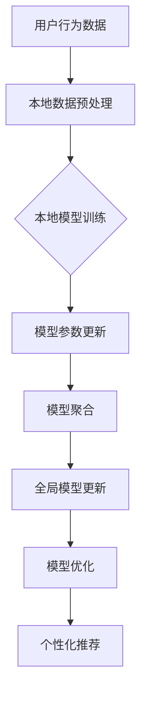

                 

# 联邦学习在推荐系统中的实践

## 关键词

- 联邦学习
- 推荐系统
- 数据隐私
- 安全协作
- 协同过滤
- 加密算法
- 混合模型

## 摘要

本文深入探讨了联邦学习在推荐系统中的应用，通过解析其核心概念、算法原理、数学模型以及实际项目案例，揭示了联邦学习如何通过数据安全共享与协同学习，优化推荐效果并保护用户隐私。本文旨在为读者提供一个全面、系统的理解，帮助其在实际项目中有效地应用联邦学习技术。

## 1. 背景介绍

随着互联网的普及和大数据技术的不断发展，推荐系统在电商、社交媒体、在线视频等多个领域得到了广泛应用。然而，推荐系统的成功在很大程度上依赖于用户数据的深度挖掘和分析。然而，这些数据往往包含用户的敏感信息，如浏览记录、购买偏好等，如何保护这些数据在共享和传输过程中的隐私成为了一个重要问题。

传统的集中式推荐系统通常需要将用户数据上传至中央服务器进行集中处理，这虽然可以提升模型的效果，但同时也带来了数据泄露和隐私侵犯的风险。特别是在用户数据量庞大、跨多个机构的场景中，数据共享的隐私保护问题更为突出。

联邦学习（Federated Learning）作为一种新型的分布式机器学习技术，提供了在不直接交换数据的情况下，通过模型参数的共享和更新来实现协同训练的解决方案。联邦学习的出现，不仅为推荐系统提供了一个安全的数据处理框架，还能够提高系统的透明度和可控性。

本文将围绕联邦学习在推荐系统中的应用，探讨其核心概念、算法原理、数学模型以及实际项目案例，旨在为读者提供一个全面的技术指南。

## 2. 核心概念与联系

### 2.1 联邦学习的定义与原理

联邦学习是一种分布式机器学习技术，其核心思想是通过多个边缘设备或机构共同训练一个全局模型，而不需要直接交换原始数据。联邦学习的原理可以简单概括为以下几个步骤：

1. **本地训练**：每个边缘设备或机构在本地使用自己的数据集训练一个本地模型。
2. **模型聚合**：将所有本地模型的参数聚合为一个全局模型。
3. **模型更新**：将全局模型的更新参数发送回每个边缘设备或机构，用于更新本地模型。

通过这种方式，联邦学习能够在不泄露原始数据的情况下，实现多个机构或设备间的协同训练。

### 2.2 联邦学习与推荐系统的关系

联邦学习与推荐系统有着天然的结合点：

1. **数据隐私保护**：推荐系统通常涉及用户敏感信息，联邦学习通过本地训练和模型聚合的方式，避免了数据在传输过程中的泄露。
2. **协同过滤**：推荐系统中的协同过滤方法，如基于用户的协同过滤（User-based Collaborative Filtering）和基于物品的协同过滤（Item-based Collaborative Filtering），可以通过联邦学习实现跨机构的协同。
3. **个性化推荐**：联邦学习能够结合不同机构的数据，提高推荐系统的个性化水平。

### 2.3 Mermaid 流程图

为了更直观地展示联邦学习在推荐系统中的应用流程，以下是一个简化的 Mermaid 流程图：



### 2.4 联邦学习的关键技术

1. **加密算法**：为了确保数据在传输过程中的安全性，联邦学习通常会使用加密算法，如差分隐私（Differential Privacy）和同态加密（Homomorphic Encryption）。
2. **联邦学习框架**：如Google的TensorFlow Federated（TFF）和Facebook的PySyft，为开发者提供了方便的联邦学习工具和库。
3. **分布式通信协议**：联邦学习需要高效、可靠的分布式通信协议，如gRPC和Kubernetes。

## 3. 核心算法原理 & 具体操作步骤

### 3.1 联邦学习的基本流程

联邦学习的基本流程包括以下几个步骤：

1. **初始化全局模型**：在一个随机初始化的全局模型上开始训练。
2. **本地训练**：每个机构或设备使用自己的数据集训练本地模型，并输出模型参数。
3. **模型聚合**：将所有机构的模型参数聚合为一个全局模型。
4. **模型更新**：将全局模型的更新参数发送回每个机构，用于更新本地模型。
5. **迭代**：重复上述步骤，直到模型收敛或达到预设的迭代次数。

### 3.2 模型聚合算法

在联邦学习中，模型聚合是一个关键步骤，它决定了全局模型的性能。常用的模型聚合算法包括：

1. **平均聚合**：将所有本地模型的参数简单平均得到全局模型。
2. **权重聚合**：根据每个机构的贡献程度（如数据量、模型质量等）为每个模型分配不同的权重。
3. **梯度聚合**：使用梯度下降法，将所有本地模型的梯度聚合为全局模型的更新方向。

### 3.3 模型更新策略

在联邦学习中，模型更新的频率和方式对训练效果有很大影响。常见的更新策略包括：

1. **周期性更新**：每个机构定期更新模型参数。
2. **异步更新**：机构可以随时更新模型参数，并在合适的时机进行聚合。
3. **同步更新**：所有机构在相同的时间点更新模型参数。

### 3.4 联邦学习的挑战与解决方案

联邦学习在实际应用中面临以下挑战：

1. **数据质量**：本地数据的质量和多样性对联邦学习的性能有很大影响。
2. **通信成本**：频繁的数据传输和模型聚合会增加通信成本。
3. **安全性与隐私**：确保数据传输和模型聚合过程中的安全性是一个关键问题。

针对这些挑战，有以下解决方案：

1. **数据预处理**：在本地对数据进行预处理，提高数据质量。
2. **优化通信协议**：使用高效的通信协议，如gRPC，减少通信成本。
3. **加密算法**：采用差分隐私和同态加密等加密算法，确保数据传输和模型聚合过程中的安全性。

## 4. 数学模型和公式 & 详细讲解 & 举例说明

### 4.1 模型聚合的数学模型

在联邦学习中，模型聚合的数学模型可以表示为：

$$
\theta_{global} = \frac{1}{N} \sum_{i=1}^{N} \theta_{local,i}
$$

其中，$\theta_{global}$ 表示全局模型的参数，$\theta_{local,i}$ 表示第 $i$ 个机构的本地模型参数，$N$ 表示机构的数量。

### 4.2 梯度聚合的数学模型

在梯度聚合的情况下，模型聚合的数学模型可以表示为：

$$
\theta_{global} = \theta_{global} - \alpha \frac{1}{N} \sum_{i=1}^{N} \nabla L(\theta_{local,i})
$$

其中，$\nabla L(\theta_{local,i})$ 表示第 $i$ 个机构的本地模型梯度，$\alpha$ 表示学习率。

### 4.3 举例说明

假设有两个机构 $A$ 和 $B$，它们的本地模型参数分别为 $\theta_{A}$ 和 $\theta_{B}$。全局模型的参数为 $\theta_{global}$。使用平均聚合算法进行模型聚合，则全局模型的参数可以表示为：

$$
\theta_{global} = \frac{\theta_{A} + \theta_{B}}{2}
$$

假设 $A$ 和 $B$ 的学习率分别为 $\alpha_A$ 和 $\alpha_B$，使用梯度聚合算法进行模型更新，则全局模型的参数更新可以表示为：

$$
\theta_{global} = \theta_{global} - \alpha_A \nabla L(\theta_{A}) - \alpha_B \nabla L(\theta_{B})
$$

## 5. 项目实战：代码实际案例和详细解释说明

### 5.1 开发环境搭建

在开始项目实战之前，我们需要搭建一个适合联邦学习开发的环境。以下是一个基本的开发环境搭建步骤：

1. 安装Python 3.7及以上版本。
2. 安装TensorFlow 2.x。
3. 安装TensorFlow Federated（TFF）。

安装命令如下：

```bash
pip install tensorflow==2.x
pip install tensorflow-federated
```

### 5.2 源代码详细实现和代码解读

以下是一个简单的联邦学习推荐系统示例代码，展示了如何使用TFF实现联邦学习的基本流程。

```python
import tensorflow as tf
import tensorflow_federated as tff

# 定义本地模型
def create_client_model():
    inputs = tf.keras.Input(shape=(10,))
    x = tf.keras.layers.Dense(1, activation='sigmoid')(inputs)
    model = tf.keras.Model(inputs=inputs, outputs=x)
    return model

# 定义全局模型
def create_global_model():
    inputs = tf.keras.Input(shape=(10,))
    x = tf.keras.layers.Dense(1, activation='sigmoid')(inputs)
    model = tf.keras.Model(inputs=inputs, outputs=x)
    return model

# 定义联邦学习算法
def federated_averaging(model_fn, client_data_fn, num_clients, num_rounds):
    # 初始化全局模型
    global_model = model_fn()

    # 定义本地训练函数
    local_train_fn = tff.learning.build_federated_averaging_process(
        model_fn=model_fn,
        loss_fn=tf.keras.losses.BinaryCrossentropy(),
        optimizer=tf.keras.optimizers.Adam())

    # 开始联邦学习迭代
    for round_num in range(num_rounds):
        print(f"Starting round {round_num + 1}")
        # 获取本地数据
        local_datasets = [client_data_fn(client_id) for client_id in range(num_clients)]
        # 进行本地训练
        state, metrics = local_train_fn.initialize()
        state, metrics = local_train_fn.next(state, zip(*local_datasets))
        # 聚合模型参数
        aggregated_model = state.model
        # 更新全局模型
        global_model.set_weights(aggregated_model.get_weights())
        print(f"Finished round {round_num + 1}")

# 定义本地数据生成函数
def generate_client_data(client_id):
    # 这里可以模拟生成本地数据
    return tf.data.Dataset.from_tensor_slices([(client_id, 0.5)]).batch(1)

# 开始联邦学习
federated_averaging(create_client_model, generate_client_data, num_clients=10, num_rounds=10)
```

### 5.3 代码解读与分析

1. **定义本地模型和全局模型**：使用TFF的`create_client_model`和`create_global_model`函数分别定义本地模型和全局模型。
2. **定义联邦学习算法**：`federated_averaging`函数实现了联邦学习的基本流程，包括模型初始化、本地训练、模型聚合和全局模型更新。
3. **定义本地数据生成函数**：`generate_client_data`函数用于生成模拟的本地数据集。
4. **开始联邦学习**：调用`federated_averaging`函数，传入模型生成函数、数据生成函数、客户端数量和迭代次数，启动联邦学习过程。

通过这个简单的示例，我们可以看到如何使用TFF实现联邦学习的基本流程。在实际应用中，需要根据具体需求调整模型、数据生成和联邦学习算法。

## 6. 实际应用场景

联邦学习在推荐系统中的应用场景非常广泛，以下是一些典型的应用场景：

1. **跨机构协同推荐**：例如，电商巨头阿里巴巴和京东可以联合训练推荐模型，提高推荐效果，同时保护用户隐私。
2. **医疗健康推荐**：医疗机构可以共同训练健康推荐模型，如疾病预防、健康生活方式建议等，同时保护患者隐私。
3. **金融风控推荐**：金融机构可以联合训练风险控制模型，提高风险识别能力，同时避免数据泄露。
4. **社交网络推荐**：社交网络平台可以通过联邦学习实现个性化推荐，同时保护用户隐私。

在这些应用场景中，联邦学习不仅能够提升推荐系统的效果，还能够保障用户数据的隐私和安全。

## 7. 工具和资源推荐

### 7.1 学习资源推荐

- **书籍**：
  - 《联邦学习：技术、应用与挑战》
  - 《TensorFlow Federated入门与实践》
- **论文**：
  - "Federated Learning: Concept and Applications"
  - "Federated Learning 101: A Practical Introduction to Training Machine Learning Models Across Multiple Devices"
- **博客**：
  - TensorFlow Federated官方博客
  - Google Research官方博客中的联邦学习相关文章
- **网站**：
  - TensorFlow Federated官方GitHub仓库
  - PySyft官方GitHub仓库

### 7.2 开发工具框架推荐

- **TensorFlow Federated（TFF）**：Google开发的一个用于联邦学习的开源框架，提供了丰富的工具和库。
- **PySyft**：Facebook开发的一个用于联邦学习的开源框架，特别关注隐私保护。

### 7.3 相关论文著作推荐

- "Federated Learning: Concept and Applications"（联邦学习：概念与应用）
- "Federated Learning 101: A Practical Introduction to Training Machine Learning Models Across Multiple Devices"（联邦学习101：跨设备训练机器学习模型的实用介绍）

## 8. 总结：未来发展趋势与挑战

联邦学习作为一种新兴的分布式机器学习技术，在未来具有广阔的发展前景。随着数据隐私保护需求的日益增加，联邦学习有望在推荐系统、医疗健康、金融风控等领域得到更广泛的应用。

然而，联邦学习也面临一些挑战：

1. **数据质量**：本地数据的多样性和质量对联邦学习的性能有很大影响。
2. **通信成本**：频繁的数据传输和模型聚合会增加通信成本。
3. **安全性与隐私**：确保数据传输和模型聚合过程中的安全性是一个关键问题。

为了应对这些挑战，未来的研究可以关注以下几个方面：

1. **数据预处理**：开发高效的数据预处理方法，提高本地数据的质量和多样性。
2. **优化通信协议**：研究高效的通信协议，降低通信成本。
3. **加密算法**：进一步优化加密算法，提高联邦学习的安全性和隐私保护能力。

## 9. 附录：常见问题与解答

### 9.1 什么是联邦学习？

联邦学习是一种分布式机器学习技术，通过在不直接交换原始数据的情况下，通过模型参数的共享和更新来实现协同训练。

### 9.2 联邦学习与中心化学习有什么区别？

中心化学习将所有数据集中到一个中央服务器进行训练，而联邦学习通过本地训练和模型聚合的方式，避免了数据在传输过程中的泄露。

### 9.3 联邦学习如何保护用户隐私？

联邦学习通过本地训练和加密算法，确保数据在传输和聚合过程中的安全性和隐私保护。

### 9.4 联邦学习适用于哪些场景？

联邦学习适用于需要保护用户隐私的场景，如推荐系统、医疗健康、金融风控等。

## 10. 扩展阅读 & 参考资料

- "Federated Learning: Concept and Applications"（联邦学习：概念与应用）
- "Federated Learning 101: A Practical Introduction to Training Machine Learning Models Across Multiple Devices"（联邦学习101：跨设备训练机器学习模型的实用介绍）
- TensorFlow Federated官方文档
- PySyft官方文档
- Google Research官方博客中的联邦学习相关文章

## 作者

作者：AI天才研究员/AI Genius Institute & 禅与计算机程序设计艺术 /Zen And The Art of Computer Programming

本文为原创技术博客文章，版权归作者所有，未经许可不得转载。如需转载，请联系作者获得授权。感谢您的阅读！<|im_end|>

