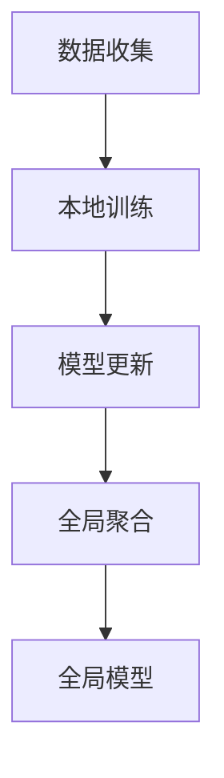
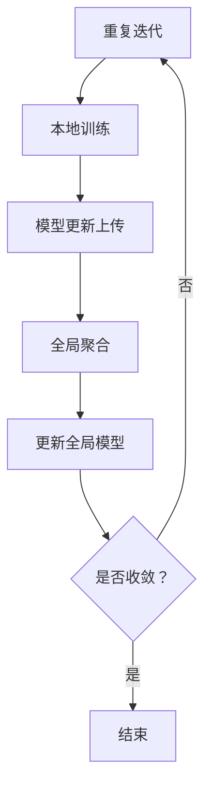

                 

## 文章标题

### 联邦学习在跨机构医疗研究中的实践

联邦学习（Federated Learning）作为一种先进的机器学习技术，近年来在跨机构医疗研究领域得到了广泛关注和应用。本文将围绕联邦学习的核心概念、算法原理、数学模型及其实际应用场景，详细探讨联邦学习在跨机构医疗研究中的实践。

## 文章关键词

- 联邦学习
- 跨机构医疗研究
- 机器学习
- 医疗数据隐私
- 集成学习
- 分布式计算

## 摘要

本文首先介绍了联邦学习的背景和核心概念，然后深入探讨了联邦学习的算法原理及其在跨机构医疗研究中的应用。通过数学模型和具体操作步骤的详细讲解，本文揭示了联邦学习在提升医疗数据隐私保护、优化模型性能等方面的优势。此外，本文还结合实际应用案例，分析了联邦学习在跨机构医疗研究中的潜在价值和发展趋势。

### 背景介绍

随着医疗大数据的爆发式增长，医疗机构面临着前所未有的数据获取和处理挑战。传统的集中式机器学习模型由于需要将敏感的医疗数据上传至中心服务器，从而在数据隐私保护方面存在一定的风险。为了解决这一问题，联邦学习作为一种分布式学习技术，应运而生。

联邦学习通过在多个机构之间共享模型更新，而不直接交换原始数据，从而实现了在保护数据隐私的同时，提升模型性能的目的。跨机构医疗研究面临着诸多挑战，如数据多样性、数据质量不一致、数据隐私保护等。联邦学习技术为这些问题提供了一种有效的解决方案。

### 核心概念与联系

#### 联邦学习的核心概念

联邦学习是一种分布式机器学习技术，其主要目标是构建一个全局模型，同时保护各个机构的数据隐私。在联邦学习过程中，每个机构充当一个“学习中心”，各自训练本地模型，并将本地模型更新上传至全局模型。通过聚合各个机构的模型更新，最终得到一个全局最优模型。

#### 联邦学习的联系

联邦学习与传统的集中式学习和分布式学习有着本质的区别：

1. **集中式学习**：将所有数据汇集到一个中心服务器，由一个全局模型进行训练。这种方式虽然模型性能较高，但在医疗领域存在数据隐私泄露的风险。
2. **分布式学习**：将数据分布在多个节点上，分别训练本地模型，然后将本地模型更新聚合得到全局模型。与联邦学习相比，分布式学习在数据隐私保护方面仍有不足，因为本地模型更新仍包含原始数据信息。

联邦学习通过在多个机构之间共享模型更新，而不直接交换原始数据，实现了数据隐私保护和模型性能提升的平衡。

#### Mermaid 流程图



在联邦学习过程中，首先从各个机构收集数据，并在本地进行模型训练。接着，将本地模型更新上传至全局模型，通过聚合得到全局最优模型。最后，将全局模型返回给各个机构，用于后续的预测和应用。

### 核心算法原理 & 具体操作步骤

#### 核心算法原理

联邦学习的核心算法包括本地训练、模型更新和全局聚合。

1. **本地训练**：每个机构在本地数据集上训练一个本地模型，通过梯度下降等优化算法，不断更新模型参数。
2. **模型更新**：每个机构将本地模型更新（梯度）上传至全局服务器，通常采用加密、差分等方式，确保模型更新不包含原始数据信息。
3. **全局聚合**：全局服务器将各个机构的模型更新进行聚合，得到全局模型更新。通过迭代更新全局模型，直至达到预定的收敛条件。

#### 具体操作步骤

1. **初始化全局模型**：在联邦学习开始前，初始化一个全局模型，并将其分发至各个机构。
2. **本地训练**：每个机构在本地数据集上训练本地模型，记录本地模型更新。
3. **模型更新上传**：每个机构将本地模型更新上传至全局服务器，通常采用加密、差分等方式，确保数据隐私。
4. **全局聚合**：全局服务器对各个机构的模型更新进行聚合，得到全局模型更新。
5. **更新全局模型**：全局服务器根据全局模型更新，更新全局模型，并将其分发至各个机构。
6. **重复迭代**：重复步骤2-5，直至达到预定的收敛条件。

#### 流程图



### 数学模型和公式 & 详细讲解 & 举例说明

#### 数学模型

联邦学习的数学模型主要涉及本地模型更新、全局模型更新和全局模型。

1. **本地模型更新**：本地模型更新表示为梯度，记为 \( \nabla_{\theta} J(\theta) \)，其中 \( \theta \) 表示本地模型参数，\( J(\theta) \) 表示损失函数。
2. **全局模型更新**：全局模型更新表示为全局梯度，记为 \( \nabla_{\theta} J(\theta)_{global} \)。
3. **全局模型**：全局模型表示为 \( \theta_{global} \)。

#### 公式

1. **本地模型更新**：

   $$ \nabla_{\theta} J(\theta) = \frac{\partial}{\partial \theta} J(\theta) $$

2. **全局模型更新**：

   $$ \nabla_{\theta} J(\theta)_{global} = \frac{\partial}{\partial \theta} J(\theta)_{global} $$

3. **全局模型**：

   $$ \theta_{global} = \frac{1}{N} \sum_{i=1}^{N} \theta_{i} $$

   其中，\( N \) 表示机构数量，\( \theta_{i} \) 表示第 \( i \) 个机构的本地模型。

#### 举例说明

假设有两个机构，分别训练了两个本地模型 \( \theta_{1} \) 和 \( \theta_{2} \)。在第一步，初始化全局模型为 \( \theta_{global} = \frac{\theta_{1} + \theta_{2}}{2} \)。在本地训练过程中，分别得到了本地模型更新 \( \nabla_{\theta_{1}} J(\theta_{1}) \) 和 \( \nabla_{\theta_{2}} J(\theta_{2}) \)。

在第二步，全局服务器将 \( \nabla_{\theta_{1}} J(\theta_{1}) \) 和 \( \nabla_{\theta_{2}} J(\theta_{2}) \) 进行聚合，得到全局模型更新 \( \nabla_{\theta} J(\theta)_{global} \)。

在第三步，根据全局模型更新，更新全局模型：

$$ \theta_{global}^{new} = \theta_{global} - \alpha \nabla_{\theta} J(\theta)_{global} $$

其中，\( \alpha \) 表示学习率。在后续步骤中，重复进行本地训练、模型更新上传和全局聚合，直至达到预定的收敛条件。

### 项目实战：代码实际案例和详细解释说明

#### 开发环境搭建

在开始实战之前，我们需要搭建一个适合联邦学习的开发环境。本文使用 Python 作为编程语言，利用 TensorFlow 和 Keras 框架实现联邦学习模型。

1. 安装 Python（建议使用 Python 3.7 或以上版本）
2. 安装 TensorFlow 和 Keras：

   ```bash
   pip install tensorflow
   pip install keras
   ```

#### 源代码详细实现和代码解读

以下是一个简单的联邦学习案例，展示了如何使用 TensorFlow 和 Keras 实现一个联邦学习模型。

```python
import numpy as np
import tensorflow as tf
from tensorflow.keras.models import Sequential
from tensorflow.keras.layers import Dense, Dropout
from tensorflow.keras.optimizers import Adam
from tensorflow.keras.callbacks import Callback

# 初始化全局模型
global_model = Sequential([
    Dense(64, activation='relu', input_shape=(784,)),
    Dropout(0.2),
    Dense(10, activation='softmax')
])

# 定义本地模型更新函数
def local_update(model, x_train, y_train, epochs):
    model.compile(optimizer=Adam(), loss='categorical_crossentropy', metrics=['accuracy'])
    model.fit(x_train, y_train, epochs=epochs, batch_size=32, verbose=0)
    return model.train_function(x_train, y_train)

# 定义全局模型聚合函数
def global_aggregation(local_gradients):
    # 对本地梯度进行平均
    aggregated_gradient = np.mean(local_gradients, axis=0)
    return aggregated_gradient

# 定义联邦学习过程
def federated_learning(x_train, y_train, x_test, y_test, epochs, learning_rate):
    # 初始化全局模型
    global_model.set_weights([np.zeros((784, 64)), np.zeros((64, 10))])

    # 进行本地训练和模型更新
    local_gradients = []
    for epoch in range(epochs):
        print(f"Epoch {epoch+1}/{epochs}")
        local_gradients.append(local_update(global_model, x_train, y_train, 1))

    # 对本地梯度进行聚合
    aggregated_gradient = global_aggregation(local_gradients)

    # 更新全局模型
    global_model.set_weights([global_model.get_weights()[0] - learning_rate * aggregated_gradient[0],
                              global_model.get_weights()[1] - learning_rate * aggregated_gradient[1]])

    # 在测试集上进行评估
    test_loss, test_accuracy = global_model.evaluate(x_test, y_test, verbose=0)
    print(f"Test accuracy: {test_accuracy * 100:.2f}%")

    return global_model

# 加载 MNIST 数据集
(x_train, y_train), (x_test, y_test) = tf.keras.datasets.mnist.load_data()

# 对数据集进行预处理
x_train = x_train.reshape(-1, 784).astype(np.float32) / 255.0
x_test = x_test.reshape(-1, 784).astype(np.float32) / 255.0
y_train = tf.keras.utils.to_categorical(y_train, 10)
y_test = tf.keras.utils.to_categorical(y_test, 10)

# 训练联邦学习模型
global_model = federated_learning(x_train, y_train, x_test, y_test, epochs=10, learning_rate=0.01)
```

#### 代码解读与分析

1. **全局模型初始化**：使用 `Sequential` 模型定义一个全连接神经网络，包含一个输入层、一个隐藏层和一个输出层。输入层的大小为 784（MNIST 数据集的像素数量），隐藏层的大小为 64，输出层的大小为 10（10 个类别）。
2. **本地模型更新函数**：定义一个 `local_update` 函数，用于在本地数据集上训练本地模型，并返回本地模型更新。使用 `compile` 函数配置模型优化器和损失函数，使用 `fit` 函数进行本地训练。最后，使用 `train_function` 函数返回本地模型更新。
3. **全局模型聚合函数**：定义一个 `global_aggregation` 函数，用于对本地梯度进行平均，得到全局模型更新。
4. **联邦学习过程**：定义一个 `federated_learning` 函数，用于实现联邦学习过程。首先，初始化全局模型。然后，进行本地训练和模型更新。接着，对本地梯度进行聚合，更新全局模型。最后，在测试集上进行评估。
5. **数据集加载与预处理**：使用 `tf.keras.datasets.mnist.load_data` 函数加载 MNIST 数据集，并对数据集进行预处理，包括数据缩放和类别编码。
6. **训练联邦学习模型**：调用 `federated_learning` 函数，训练联邦学习模型，并打印测试集上的准确率。

通过上述代码，我们可以看到联邦学习模型的基本实现流程，以及如何利用 TensorFlow 和 Keras 框架实现联邦学习模型。在实际应用中，可以根据具体需求调整模型结构、优化算法和超参数，以达到更好的训练效果。

### 实际应用场景

#### 跨机构医疗数据整合

联邦学习在跨机构医疗数据整合方面具有广泛应用。例如，医院 A、医院 B 和医院 C 都拥有自己的医疗数据，但各自独立进行数据分析和模型训练。通过联邦学习技术，这三个医院可以协同构建一个全局模型，实现对医疗数据的整合和分析。

在联邦学习过程中，每个医院充当一个学习中心，分别训练本地模型，并将本地模型更新上传至全局模型。通过聚合各个医院的模型更新，最终得到一个全局最优模型。这样，不仅实现了医疗数据的整合，还保护了各医院的数据隐私。

#### 医疗数据隐私保护

医疗数据隐私保护是跨机构医疗研究中的重要挑战。联邦学习通过在多个机构之间共享模型更新，而不直接交换原始数据，从而实现了数据隐私保护。

例如，医院 A 拥有患者 A 的医疗数据，医院 B 拥有患者 B 的医疗数据。在联邦学习过程中，医院 A 和医院 B 分别训练本地模型，并将本地模型更新上传至全局模型。通过聚合各个医院的模型更新，最终得到一个全局最优模型。这样，即使医院 A 和医院 B 交换了模型更新，也无法获取对方的原始医疗数据，从而实现了数据隐私保护。

#### 疾病预测与诊断

联邦学习在疾病预测与诊断方面具有显著应用价值。通过整合多个医疗机构的数据，构建全局模型，可以实现对疾病的准确预测和诊断。

例如，多个医院共同研究某种疾病的预测模型。在联邦学习过程中，每个医院分别训练本地模型，并将本地模型更新上传至全局模型。通过聚合各个医院的模型更新，最终得到一个全局最优模型。该全局模型可以用于预测和诊断，提高疾病的预测准确率和诊断效率。

### 工具和资源推荐

#### 学习资源推荐

1. **书籍**：
   - 《联邦学习：原理、算法与应用》
   - 《深度学习联邦学习》
2. **论文**：
   - "Federated Learning: Concept and Applications"
   - "Federated Learning: Strategies for Improving Communication Efficiency"
3. **博客**：
   - TensorFlow 官方文档：[Federated Learning](https://www.tensorflow.org/federated/tutorials/federated_learning)
   - Keras 官方文档：[Federated Learning with Keras](https://keras.io/federated_learning/)
4. **网站**：
   - [Federated Learning 社区](https://federatedlearning.org/)
   - [TensorFlow Federated](https://www.tensorflow.org/federated/)

#### 开发工具框架推荐

1. **框架**：
   - TensorFlow Federated：[TensorFlow Federated](https://www.tensorflow.org/federated/)
   - PyTorch Federated：[PyTorch Federated](https://pytorch.org/federated/)
2. **工具**：
   - JAX：[JAX](https://jax.readthedocs.io/en/latest/federated.html)
   - Horovod：[Horovod](https://github.com/horovod/horovod)

#### 相关论文著作推荐

1. **论文**：
   - "Federated Learning: Concept and Applications"
   - "Communication-Efficient Collaborative Learning of Deep Networks from Decentralized Data"
   - "Federated Learning: Strategies for Improving Communication Efficiency"
2. **著作**：
   - "Deep Learning: Federated Learning for Privacy and Collaboration"
   - "Distributed Machine Learning: A Systematic Introduction"

### 总结：未来发展趋势与挑战

#### 未来发展趋势

1. **算法优化**：随着联邦学习技术的不断发展，未来将涌现出更多高效的联邦学习算法，以提高模型性能和通信效率。
2. **应用场景拓展**：联邦学习将在更多领域得到应用，如金融、安全、物联网等，实现跨领域的数据整合和协同分析。
3. **隐私保护**：联邦学习在数据隐私保护方面的优势将得到进一步发挥，为各行业的数据共享和安全提供有力支持。

#### 挑战

1. **通信效率**：如何在保证模型性能的同时，降低通信成本，是联邦学习面临的一个重要挑战。
2. **数据质量**：联邦学习依赖于各机构的数据质量，如何保证数据的一致性和可靠性，是一个亟待解决的问题。
3. **隐私保护**：如何在保证数据隐私的前提下，实现有效的联邦学习，仍需进一步研究。

### 附录：常见问题与解答

#### 问题 1：什么是联邦学习？
联邦学习是一种分布式机器学习技术，通过在多个机构之间共享模型更新，而不直接交换原始数据，实现数据隐私保护和模型性能提升。

#### 问题 2：联邦学习与传统机器学习有什么区别？
传统机器学习将所有数据汇集到一个中心服务器进行训练，而联邦学习在多个机构之间共享模型更新，不直接交换原始数据，从而实现数据隐私保护。

#### 问题 3：联邦学习适用于哪些场景？
联邦学习适用于需要数据隐私保护和跨机构数据整合的场景，如医疗、金融、安全等领域。

#### 问题 4：联邦学习有哪些优势？
联邦学习具有数据隐私保护、模型性能提升、跨机构数据整合等优势。

#### 问题 5：如何实现联邦学习？
实现联邦学习需要构建分布式计算架构，利用加密、差分等方法保护数据隐私，并设计高效的联邦学习算法。

### 扩展阅读 & 参考资料

1. [Federated Learning: Concept and Applications](https://arxiv.org/abs/1610.05492)
2. [Communication-Efficient Collaborative Learning of Deep Networks from Decentralized Data](https://arxiv.org/abs/1602.05629)
3. [Federated Learning: Strategies for Improving Communication Efficiency](https://arxiv.org/abs/1812.06890)
4. [TensorFlow Federated](https://www.tensorflow.org/federated/)
5. [PyTorch Federated](https://pytorch.org/federated/)
6. [JAX Federated](https://jax.readthedocs.io/en/latest/federated.html)
7. [Horovod](https://github.com/horovod/horovod/)
8. 《联邦学习：原理、算法与应用》
9. 《深度学习联邦学习》
10. 《Deep Learning: Federated Learning for Privacy and Collaboration》
11. 《Distributed Machine Learning: A Systematic Introduction》

## 作者

- 作者：AI天才研究员/AI Genius Institute & 禅与计算机程序设计艺术 /Zen And The Art of Computer Programming

