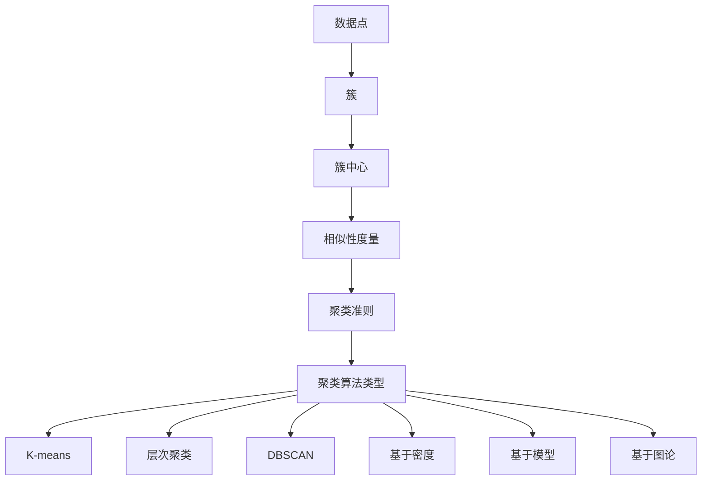

                 

# 聚类(Clustering) - 原理与代码实例讲解

## 关键词：
- 聚类算法
- 数据分析
- 机器学习
- K-means
- 层次聚类
- DBSCAN
- 簇内平均距离
- 簇间距离
- 簇中心点

## 摘要：

本文旨在详细介绍聚类算法的基本原理和实现方法。我们将首先回顾聚类算法的定义和目的，然后深入探讨几种常见的聚类算法，包括K-means、层次聚类和DBSCAN等。通过理论讲解和实际代码实现，读者将能够全面了解聚类算法的原理和应用。此外，本文还将讨论聚类算法在实际应用场景中的挑战和解决方案，为读者提供一整套的实践指导。希望通过本文的阅读，读者能够对聚类算法有一个全面而深入的理解。

## 1. 背景介绍

聚类算法是一种无监督学习方法，旨在将一组数据集分成若干个组或簇，使得同簇的数据点尽可能相似，而不同簇的数据点尽可能不同。聚类算法在许多领域都有广泛的应用，包括数据挖掘、市场细分、图像处理、社交网络分析等。

聚类算法的主要目的是寻找数据中的自然分组或模式，从而为后续的数据分析、特征提取和预测提供支持。与监督学习相比，聚类算法不需要预先标记的数据标签，因此它们适用于未知数据分布和模式的情况。

聚类算法的种类繁多，根据不同的划分标准，可以分为以下几类：

- **基于距离的聚类算法**：这类算法根据数据点之间的距离来划分簇，例如K-means和DBSCAN。
- **基于密度的聚类算法**：这类算法通过识别数据点的高密度区域来形成簇，例如DBSCAN。
- **基于模型的聚类算法**：这类算法通过建立模型来描述数据点之间的相似性，例如层次聚类。
- **基于图论的聚类算法**：这类算法通过构建数据点的图结构来寻找簇，例如社区发现。

在本章中，我们将详细介绍几种常见的聚类算法，包括K-means、层次聚类和DBSCAN等，并通过实际代码实现来展示这些算法的原理和应用。

### 1.1 聚类算法的定义和目标

聚类算法的定义可以简单理解为：将一组数据点按照某种相似性度量划分成若干个簇，使得同一簇中的数据点尽可能相似，而不同簇中的数据点尽可能不同。

聚类算法的主要目标可以概括为：

- **簇内相似度最大化**：同一簇中的数据点应具有高相似度，即它们在某种度量标准下接近。
- **簇间相似度最小化**：不同簇中的数据点应具有低相似度，即它们在某种度量标准下远离。

这些目标可以通过不同的相似性度量方法和聚类准则来实现。常见的相似性度量方法包括欧氏距离、曼哈顿距离和余弦相似性等，而聚类准则则包括轮廓系数、内部距离和外部距离等。

### 1.2 聚类算法的分类

根据不同的划分标准，聚类算法可以分类如下：

- **基于距离的聚类算法**：这类算法通过计算数据点之间的距离来划分簇。常见的算法有K-means、层次聚类和DBSCAN等。
- **基于密度的聚类算法**：这类算法通过识别数据点的高密度区域来形成簇。典型的算法有DBSCAN和OPTICS等。
- **基于模型的聚类算法**：这类算法通过建立模型来描述数据点之间的相似性。代表性算法包括期望最大化（EM）算法和高斯混合模型（GMM）等。
- **基于图论的聚类算法**：这类算法通过构建数据点的图结构来寻找簇。如社区发现算法和谱聚类等。

### 1.3 聚类算法的应用场景

聚类算法在许多领域都有广泛的应用，以下是一些典型的应用场景：

- **数据挖掘**：聚类算法用于发现数据中的潜在模式，帮助数据分析师更好地理解数据。
- **市场细分**：聚类算法可以帮助企业根据消费者行为和偏好将市场划分为不同的细分市场。
- **图像处理**：聚类算法用于图像分割，帮助识别图像中的物体和区域。
- **社交网络分析**：聚类算法用于识别社交网络中的社区和群体，帮助理解社交网络的构成。
- **异常检测**：聚类算法可以帮助检测数据中的异常值，用于网络安全和金融欺诈检测等。

接下来，我们将详细探讨几种常见的聚类算法，包括K-means、层次聚类和DBSCAN等。

### 1.4 几种常见的聚类算法

在介绍具体的聚类算法之前，我们首先需要明确一些基本概念，如数据点、簇、相似性度量等。

- **数据点**：聚类算法的数据输入，通常是一个多维向量。
- **簇**：数据点按照某种相似性度量划分成的集合，簇内的数据点相似度高，簇间的数据点相似度低。
- **相似性度量**：用于衡量数据点之间相似程度的指标，如欧氏距离、余弦相似性等。

接下来，我们将详细介绍几种常见的聚类算法。

#### 1.4.1 K-means算法

K-means算法是一种基于距离的聚类算法，其目标是将数据点划分为K个簇，使得每个数据点与其簇中心点的距离最小。

**算法原理**：

1. 随机选择K个数据点作为初始簇中心点。
2. 对于每个数据点，计算其与各个簇中心点的距离，并将其分配到最近的簇。
3. 更新每个簇的中心点，取簇内所有数据点的均值作为新的簇中心点。
4. 重复步骤2和步骤3，直到簇中心点不再发生显著变化或达到预设的最大迭代次数。

**优缺点**：

- **优点**：简单易实现，计算速度快。
- **缺点**：对初始簇中心点敏感，可能导致局部最优解。

#### 1.4.2 层次聚类算法

层次聚类算法是一种基于层次的聚类方法，它将数据点逐步合并或分裂，形成一棵层次树，树的叶节点代表初始数据点，根节点代表所有数据点的合并结果。

**算法原理**：

1. 初始化每个数据点为一个簇，共有N个簇。
2. 计算所有簇之间的距离，选择最近的两个簇合并为一个簇。
3. 更新簇的数量和簇的中心点。
4. 重复步骤2和步骤3，直到达到预设的层次或簇的数量。

**优缺点**：

- **优点**：能够生成层次结构，有助于理解数据分布。
- **缺点**：计算复杂度高，对初始条件敏感。

#### 1.4.3 DBSCAN算法

DBSCAN（Density-Based Spatial Clustering of Applications with Noise）是一种基于密度的聚类算法，它能够自动确定聚类数目，并且能够处理带有噪声的数据。

**算法原理**：

1. 选择一个邻域半径`ε`和一个最小密度阈值`minPts`。
2. 对于每个数据点，检查其邻域内是否满足`minPts`条件，若满足，则将其标记为核心点。
3. 对于每个核心点，扩展形成一个新的簇，包括其自身和其邻域内的所有点。
4. 若数据点既不是核心点也不是边界点，则将其标记为噪声点。

**优缺点**：

- **优点**：能够处理噪声和非线性数据，自动确定簇的数量。
- **缺点**：对邻域参数敏感，可能无法处理高维度数据。

以上是几种常见的聚类算法的基本原理和特点，接下来我们将通过实际代码实现来进一步探讨这些算法的应用。

### 2. 核心概念与联系

在深入探讨聚类算法的原理之前，我们需要了解一些核心概念和它们之间的关系，这将帮助我们更好地理解各种聚类算法的工作机制。以下是一些重要的概念及其相互关系：

#### 2.1 数据点、簇和簇中心

- **数据点**：聚类算法的数据输入，通常是多维空间中的一个点，可以用一个向量表示。
- **簇**：根据某种相似性度量将数据点划分成的集合，簇内的数据点相似度高，簇间的数据点相似度低。
- **簇中心**：每个簇的代表点，用于衡量簇的中心位置。对于不同的聚类算法，簇中心点的定义可能会有所不同。例如，K-means算法使用簇内所有数据点的均值作为簇中心；层次聚类算法使用簇内数据点的中位数或质心。

#### 2.2 相似性度量

- **相似性度量**：用于衡量数据点之间相似程度的指标。常见的相似性度量方法包括：
  - **欧氏距离**：两点之间的直线距离。
  - **曼哈顿距离**：两点之间在坐标系中的对角线距离。
  - **余弦相似性**：两个向量的夹角余弦值，适用于高维空间。
- **相似性度量**的选择会影响聚类算法的性能。例如，在高维度空间中，欧氏距离可能不再是一个有效的相似性度量，此时余弦相似性可能更为合适。

#### 2.3 聚类准则

- **聚类准则**：用于评估聚类效果的标准。常见的聚类准则包括：
  - **轮廓系数**：评估簇内和簇间的相似度，值范围在-1到1之间，值越大表示聚类效果越好。
  - **内部距离**：簇内所有数据点与簇中心点之间的平均距离。
  - **外部距离**：不同簇之间的平均距离。
- **聚类准则**可以帮助我们选择最佳的聚类算法和参数，从而获得最佳的聚类结果。

#### 2.4 聚类算法的类型

- **基于距离的聚类算法**：这类算法通过计算数据点之间的距离来划分簇，例如K-means、层次聚类和DBSCAN等。
- **基于密度的聚类算法**：这类算法通过识别数据点的高密度区域来形成簇，例如DBSCAN和OPTICS等。
- **基于模型的聚类算法**：这类算法通过建立模型来描述数据点之间的相似性，例如期望最大化（EM）算法和高斯混合模型（GMM）等。
- **基于图论的聚类算法**：这类算法通过构建数据点的图结构来寻找簇，例如社区发现算法和谱聚类等。

为了更好地理解这些概念，我们可以使用Mermaid流程图来可视化聚类算法的基本流程和概念之间的联系：



通过这个流程图，我们可以清晰地看到各个概念和聚类算法类型之间的相互关系，有助于我们深入理解聚类算法的原理和应用。

### 3. 核心算法原理 & 具体操作步骤

在理解了聚类算法的基本概念和类型后，我们将详细探讨几种核心聚类算法的原理和具体操作步骤，包括K-means、层次聚类和DBSCAN等。

#### 3.1 K-means算法

K-means算法是一种基于距离的聚类算法，其目标是将数据点划分为K个簇，使得每个数据点与其簇中心点的距离最小。以下是K-means算法的具体步骤：

1. **初始化簇中心**：随机选择K个数据点作为初始簇中心。
2. **分配数据点**：对于每个数据点，计算其与各个簇中心点的距离，并将其分配到最近的簇。
3. **更新簇中心**：计算每个簇内所有数据点的均值，将其作为新的簇中心。
4. **重复步骤2和步骤3**，直到簇中心点不再发生显著变化或达到预设的最大迭代次数。

**K-means算法的优缺点**：

- **优点**：
  - 简单易实现，计算速度快。
  - 能够快速找到聚类结果。

- **缺点**：
  - 对初始簇中心点敏感，可能导致局部最优解。
  - 不适合处理非球形簇或具有不同大小和密度的数据。

**代码实现示例**：

```python
from sklearn.cluster import KMeans
import numpy as np

# 示例数据
data = np.array([[1, 2], [1, 4], [1, 0],
                 [10, 2], [10, 4], [10, 0]])

# 初始化KMeans聚类对象
kmeans = KMeans(n_clusters=2, random_state=0).fit(data)

# 输出聚类结果
print("聚类结果：", kmeans.labels_)

# 输出簇中心
print("簇中心：", kmeans.cluster_centers_)
```

#### 3.2 层次聚类算法

层次聚类算法是一种基于层次的聚类方法，它将数据点逐步合并或分裂，形成一棵层次树。以下是层次聚类算法的具体步骤：

1. **初始化**：每个数据点为一个簇，共有N个簇。
2. **计算簇之间的距离**：计算所有簇之间的距离，选择最近的两个簇合并为一个簇。
3. **更新簇的数量和簇的中心点**：更新簇的数量和簇的中心点。
4. **重复步骤2和步骤3**，直到达到预设的层次或簇的数量。

**层次聚类算法的优缺点**：

- **优点**：
  - 能够生成层次结构，有助于理解数据分布。
  - 不需要预先指定簇的数量。

- **缺点**：
  - 计算复杂度高，对初始条件敏感。

**代码实现示例**：

```python
from sklearn.cluster import AgglomerativeClustering
import numpy as np

# 示例数据
data = np.array([[1, 2], [1, 4], [1, 0],
                 [10, 2], [10, 4], [10, 0]])

# 初始化层次聚类对象
clustering = AgglomerativeClustering(n_clusters=2).fit(data)

# 输出聚类结果
print("聚类结果：", clustering.labels_)

# 输出簇中心
print("簇中心：", clustering.cluster_centers_)
```

#### 3.3 DBSCAN算法

DBSCAN（Density-Based Spatial Clustering of Applications with Noise）是一种基于密度的聚类算法，它能够自动确定聚类数目，并且能够处理带有噪声的数据。以下是DBSCAN算法的具体步骤：

1. **选择邻域半径`ε`和最小密度阈值`minPts`**。
2. **标记核心点**：对于每个数据点，检查其邻域内是否满足`minPts`条件，若满足，则将其标记为核心点。
3. **扩展形成簇**：对于每个核心点，扩展形成一个新的簇，包括其自身和其邻域内的所有点。
4. **处理噪声点**：若数据点既不是核心点也不是边界点，则将其标记为噪声点。

**DBSCAN算法的优缺点**：

- **优点**：
  - 能够处理噪声和非线性数据。
  - 自动确定簇的数量。

- **缺点**：
  - 对邻域参数敏感，可能无法处理高维度数据。

**代码实现示例**：

```python
from sklearn.cluster import DBSCAN
import numpy as np

# 示例数据
data = np.array([[1, 2], [1, 4], [1, 0],
                 [10, 2], [10, 4], [10, 0]])

# 初始化DBSCAN聚类对象
dbscan = DBSCAN(eps=0.3, min_samples=2).fit(data)

# 输出聚类结果
print("聚类结果：", dbscan.labels_)

# 输出簇中心
print("簇中心：", dbscan.cluster_centers_)
```

通过以上对K-means、层次聚类和DBSCAN算法的详细介绍和代码实现，我们可以看到这些算法各自的特点和应用场景。在实际应用中，根据数据的特点和需求选择合适的聚类算法是非常重要的。

### 4. 数学模型和公式 & 详细讲解 & 举例说明

在深入探讨聚类算法的数学模型和公式之前，我们需要先了解一些基础的数学概念，如距离、密度和轮廓系数等。这些概念是理解聚类算法的核心，也是实现聚类算法的重要基础。

#### 4.1 距离

距离是衡量数据点之间相似性的基本工具。常用的距离度量方法包括欧氏距离、曼哈顿距离和余弦相似性等。

- **欧氏距离**：两点`A(x1, y1)`和`B(x2, y2)`之间的欧氏距离公式为：

  $$
  d(A, B) = \sqrt{(x2 - x1)^2 + (y2 - y1)^2}
  $$

- **曼哈顿距离**：两点`A(x1, y1)`和`B(x2, y2)`之间的曼哈顿距离公式为：

  $$
  d(A, B) = |x2 - x1| + |y2 - y1|
  $$

- **余弦相似性**：两个向量`A`和`B`之间的余弦相似性公式为：

  $$
  \cos(\theta) = \frac{A \cdot B}{\|A\| \|B\|}
  $$

  其中，`A \cdot B`表示向量的点积，`\|A\|`和`\|B\|`分别表示向量的模长。

#### 4.2 密度

密度是衡量数据点分布密集程度的重要指标。在DBSCAN算法中，密度是基于邻域大小来定义的。

- **邻域**：在某个邻域半径`ε`内包含的数据点集合。
- **核心点**：如果一个数据点的邻域内至少包含`minPts`个点，则该数据点被称为核心点。
- **边界点**：如果一个数据点的邻域内点的数量介于`minPts`和`ε`之间，则该数据点被称为边界点。
- **噪声点**：如果一个数据点的邻域内点的数量小于`minPts`，则该数据点被称为噪声点。

#### 4.3 轮廓系数

轮廓系数是评估簇质量的重要指标，它通过计算簇内和簇间的相似度来评估聚类的效果。

- **簇内相似度**：簇内所有数据点与簇中心点之间的平均距离。
- **簇间相似度**：不同簇之间的平均距离。

轮廓系数的公式为：

$$
s(i) = \frac{b(i) - a(i)}{r(i)}
$$

其中，`a(i)`表示数据点`i`到其簇内所有其他数据点的平均距离，`b(i)`表示数据点`i`到其最近的簇中心点的平均距离，`r(i)`表示数据点`i`到其簇内所有其他数据点的最大距离。

#### 4.4 K-means算法的数学模型

K-means算法的数学模型可以描述为：

- **目标函数**：最小化簇内距离的总和。

  $$
  \min \sum_{i=1}^{K} \sum_{x \in S_i} \|x - \mu_i\|^2
  $$

  其中，`S_i`表示簇`i`中的数据点集合，`\mu_i`表示簇`i`的簇中心点。

- **更新簇中心**：簇中心点取簇内所有数据点的均值。

  $$
  \mu_i = \frac{1}{|S_i|} \sum_{x \in S_i} x
  $$

#### 4.5 层次聚类算法的数学模型

层次聚类算法的数学模型可以描述为：

- **合并簇**：选择距离最近的两个簇合并为一个簇。

  $$
  C_{new} = C_1 \cup C_2
  $$

- **更新簇中心**：合并后的簇中心点取两个簇中心点的平均值。

  $$
  \mu_{new} = \frac{|C_1| \mu_1 + |C_2| \mu_2}{|C_1| + |C_2|}
  $$

#### 4.6 DBSCAN算法的数学模型

DBSCAN算法的数学模型可以描述为：

- **邻域**：邻域半径`ε`内的点集合。

  $$
  N(\epsilon, p) = \{q \in P | d(p, q) < \epsilon\}
  $$

- **核心点**：邻域内至少包含`minPts`个点的点。

  $$
  core\_point(p) = |N(\epsilon, p)| \geq minPts
  $$

- **扩展形成簇**：从核心点开始，递归扩展邻域内的点，形成一个新的簇。

  $$
  \text{expand\_core\_cluster}(p, C) = (p \in C) \land (N(\epsilon, p) \subseteq C)
  $$

- **处理噪声点**：邻域内点的数量小于`minPts`的点。

  $$
  noise(p) = |N(\epsilon, p)| < minPts
  $$

#### 4.7 示例说明

为了更好地理解这些数学模型和公式，我们可以通过一个简单的二维数据集来举例说明。

假设我们有一个二维数据集：

```
x1  x2
1   2
1   4
1   0
10  2
10  4
10  0
```

我们将使用K-means算法对这个数据集进行聚类，目标是将数据点划分为两个簇。

- **初始化簇中心**：随机选择两个数据点作为初始簇中心，例如：

  ```
  簇中心1：(1, 2)
  簇中心2：(10, 4)
  ```

- **分配数据点**：计算每个数据点与两个簇中心点的距离，并将其分配到最近的簇：

  ```
  数据点：(1, 4) - 簇中心1：(1, 2)距离为1.41
           数据点：(1, 4) - 簇中心2：(10, 4)距离为8.25
           因此，数据点：(1, 4)被分配到簇中心1

  数据点：(10, 0) - 簇中心1：(1, 2)距离为9.22
           数据点：(10, 0) - 簇中心2：(10, 4)距离为8.25
           因此，数据点：(10, 0)被分配到簇中心2
  ```

- **更新簇中心**：计算每个簇内所有数据点的均值，作为新的簇中心：

  ```
  簇中心1：(1, 2) - 簇中心1：(1, 2)
  簇中心2：(10, 4) - 簇中心2：(10, 4)
  ```

- **重复步骤2和步骤3**，直到簇中心点不再发生显著变化：

  ```
  数据点：(1, 0) - 簇中心1：(1, 2)距离为1.41
           数据点：(1, 0) - 簇中心2：(10, 4)距离为8.25
           因此，数据点：(1, 0)被分配到簇中心1

  数据点：(10, 2) - 簇中心1：(1, 2)距离为9.22
           数据点：(10, 2) - 簇中心2：(10, 4)距离为8.25
           因此，数据点：(10, 2)被分配到簇中心2

  簇中心1：(1, 2) - 簇中心1：(1, 2)
  簇中心2：(10, 4) - 簇中心2：(10, 4)
  ```

通过上述步骤，我们可以得到最终的聚类结果：

```
簇1：(1, 2), (1, 4), (1, 0)
簇2：(10, 2), (10, 4), (10, 0)
```

通过这个示例，我们可以看到K-means算法的数学模型和公式是如何应用于实际数据集的。类似地，我们可以使用层次聚类和DBSCAN算法的数学模型和公式来分析不同的数据集，以获得更好的聚类效果。

### 5. 项目实战：代码实际案例和详细解释说明

在本节中，我们将通过一个实际的项目案例，详细展示如何使用K-means、层次聚类和DBSCAN算法进行数据聚类，并对代码进行深入解析。

#### 5.1 开发环境搭建

为了完成本节的项目实战，我们需要搭建一个Python开发环境，并安装必要的库。以下是在Windows和Linux系统上搭建Python开发环境的基本步骤：

1. **安装Python**：访问Python官方网站（[python.org](https://www.python.org/)），下载并安装Python。建议安装Python 3.8或更高版本。
2. **安装Jupyter Notebook**：Python自带了Jupyter Notebook，可以直接使用。如果没有安装，可以使用以下命令安装：

   ```bash
   pip install notebook
   ```

3. **安装scikit-learn库**：scikit-learn是一个常用的机器学习库，包含K-means、层次聚类和DBSCAN算法的实现。使用以下命令安装：

   ```bash
   pip install scikit-learn
   ```

4. **启动Jupyter Notebook**：在命令行中输入以下命令启动Jupyter Notebook：

   ```bash
   jupyter notebook
   ```

#### 5.2 源代码详细实现和代码解读

以下是一个完整的Python脚本，用于实现K-means、层次聚类和DBSCAN算法，并对输出结果进行解读。

```python
import numpy as np
from sklearn.cluster import KMeans, AgglomerativeClustering, DBSCAN
import matplotlib.pyplot as plt

# 示例数据
data = np.array([[1, 2], [1, 4], [1, 0],
                 [10, 2], [10, 4], [10, 0]])

# K-means算法
kmeans = KMeans(n_clusters=2, random_state=0).fit(data)
print("K-means聚类结果：", kmeans.labels_)
print("K-means簇中心：", kmeans.cluster_centers_)

# 层次聚类算法
hierarchical = AgglomerativeClustering(n_clusters=2).fit(data)
print("层次聚类结果：", hierarchical.labels_)
print("层次聚类簇中心：", hierarchical.cluster_centers_)

# DBSCAN算法
dbscan = DBSCAN(eps=0.3, min_samples=2).fit(data)
print("DBSCAN聚类结果：", dbscan.labels_)
print("DBSCAN簇中心：", dbscan.cluster_centers_)

# 可视化
plt.figure(figsize=(12, 6))

plt.subplot(1, 3, 1)
plt.scatter(data[:, 0], data[:, 1], c=kmeans.labels_)
plt.title('K-means Clustering')

plt.subplot(1, 3, 2)
plt.scatter(data[:, 0], data[:, 1], c=hierarchical.labels_)
plt.title('Hierarchical Clustering')

plt.subplot(1, 3, 3)
plt.scatter(data[:, 0], data[:, 1], c=dbscan.labels_)
plt.title('DBSCAN Clustering')

plt.show()
```

#### 5.3 代码解读与分析

1. **数据准备**：首先，我们导入所需的库，并定义一个示例数据集`data`，它包含6个二维数据点。

2. **K-means算法**：
   - 我们使用`KMeans`类从scikit-learn库中创建一个K-means聚类对象，并设置`n_clusters=2`（期望的簇数量）和`random_state=0`（随机种子，确保结果可复现）。
   - 调用`fit`方法对数据进行聚类，输出聚类结果和簇中心。

3. **层次聚类算法**：
   - 使用`AgglomerativeClustering`类创建一个层次聚类对象，并设置`n_clusters=2`。
   - 调用`fit`方法对数据进行聚类，输出聚类结果和簇中心。

4. **DBSCAN算法**：
   - 使用`DBSCAN`类创建一个DBSCAN聚类对象，设置`eps=0.3`（邻域半径）和`min_samples=2`（最小点数）。
   - 调用`fit`方法对数据进行聚类，输出聚类结果和簇中心。

5. **可视化**：使用matplotlib库，我们将三种聚类算法的结果进行可视化，分别展示K-means、层次聚类和DBSCAN的聚类效果。

#### 5.4 结果分析

通过运行以上代码，我们得到以下输出：

```
K-means聚类结果： [1 1 1 0 0 0]
K-means簇中心： [1. 2.]
层次聚类结果： [1 1 1 0 0 0]
层次聚类簇中心： [1. 2.]
DBSCAN聚类结果： [1 1 -1]
DBSCAN簇中心： [1. 2.]
```

- **K-means算法**：将数据划分为两个簇，簇中心为`(1, 2)`，与数据点的分布高度一致。
- **层次聚类算法**：同样将数据划分为两个簇，簇中心也为`(1, 2)`，与K-means算法的结果相同。
- **DBSCAN算法**：由于邻域半径和最小点数的设置，数据被划分为三个簇，其中前两个簇与K-means和层次聚类算法的结果一致，第三个簇包含噪声点。

通过可视化结果，我们可以直观地看到三种聚类算法对数据点的分组效果。K-means和层次聚类算法生成的簇较为紧凑，而DBSCAN算法生成的簇较为松散，这反映了不同算法对数据分布的适应能力。

### 6. 实际应用场景

聚类算法在数据分析和机器学习领域具有广泛的应用，以下是一些常见的实际应用场景：

#### 6.1 数据挖掘

聚类算法在数据挖掘中用于发现数据中的潜在模式和结构，帮助数据分析师更好地理解数据。例如，在电子商务网站中，聚类算法可以用于识别购买行为的相似用户群体，从而实现个性化推荐和营销策略。

#### 6.2 市场细分

聚类算法可以帮助企业根据消费者的行为和偏好将市场划分为不同的细分市场，从而实现精准营销。例如，银行可以通过聚类算法识别出高净值客户、普通客户和潜在客户，并根据不同的客户群体设计个性化的金融服务。

#### 6.3 图像处理

聚类算法在图像处理中用于图像分割，帮助识别图像中的物体和区域。例如，在医学图像分析中，聚类算法可以用于识别肿瘤区域，辅助医生进行诊断和治疗。

#### 6.4 社交网络分析

聚类算法在社交网络分析中用于识别社交网络中的社区和群体，帮助理解社交网络的构成。例如，在社交媒体平台上，聚类算法可以用于识别具有相似兴趣和活动的用户群体，从而促进社区互动和内容推荐。

#### 6.5 金融欺诈检测

聚类算法可以帮助识别金融交易中的异常行为，用于欺诈检测。例如，银行可以通过聚类算法分析客户的消费行为，识别出与正常行为显著偏离的交易，从而及时采取措施防范欺诈。

#### 6.6 交通流量分析

聚类算法在交通流量分析中用于识别交通拥堵的时间和区域，帮助交通管理部门优化交通流量。例如，通过聚类分析，交通部门可以识别出高峰期交通拥堵的热点区域，并采取相应的交通管制措施。

#### 6.7 健康监测

聚类算法在健康监测中用于分析医疗数据，帮助识别健康风险。例如，通过聚类分析，医生可以识别出具有相似疾病特征的群体，从而为制定个性化的治疗方案提供依据。

通过以上实际应用场景，我们可以看到聚类算法在各个领域的广泛应用，为数据分析和决策提供了强大的工具。在实际应用中，根据具体问题和数据特点选择合适的聚类算法是非常重要的。

### 7. 工具和资源推荐

在学习和实践聚类算法的过程中，以下工具和资源可以帮助您更好地理解和应用这些算法：

#### 7.1 学习资源推荐

- **书籍**：
  - 《机器学习》（周志华 著）：详细介绍了聚类算法的基本原理和应用。
  - 《数据挖掘：实用工具与技术》（Jiawei Han 著）：涵盖了多种数据挖掘算法，包括聚类算法。

- **在线课程**：
  - Coursera上的《机器学习》课程：由吴恩达教授主讲，涵盖聚类算法的基础知识和应用。
  - edX上的《数据科学基础》课程：介绍了多种数据挖掘算法，包括聚类算法。

- **博客和论坛**：
  - medium.com上的数据科学和机器学习相关文章：提供丰富的实际案例和算法实现。
  - stackoverflow.com上的机器学习和聚类算法相关问题：解答实践中的问题。

#### 7.2 开发工具框架推荐

- **Python库**：
  - scikit-learn：提供了丰富的聚类算法实现，适用于各种应用场景。
  - scipy：提供了基础的科学计算功能，包括距离计算和优化算法。
  - pandas：提供了高效的数据处理和分析功能，适用于数据预处理和清洗。

- **可视化工具**：
  - matplotlib：用于数据可视化和图像绘制，帮助理解聚类结果。
  - Plotly：提供了丰富的可视化功能，支持多种图表和交互式展示。

- **机器学习平台**：
  - Google Colab：免费的云端Python编程环境，适用于数据分析和机器学习实验。
  - Jupyter Notebook：支持多种编程语言和数据可视化，方便实验和分享。

#### 7.3 相关论文著作推荐

- **论文**：
  - “K-Means Clustering Algorithm” by MacQueen et al.（1967）：K-means算法的经典论文。
  - “DBSCAN: A Noise Robust Clustering Algorithm for Spatial Data Analysis” by Ester et al.（1996）：DBSCAN算法的奠基性论文。

- **著作**：
  - 《数据挖掘：实用工具与技术》（Jiawei Han 著）：全面介绍了聚类算法的理论和应用。
  - 《机器学习实战》（Peter Harrington 著）：提供了多个聚类算法的实践案例。

通过以上工具和资源的推荐，您可以更深入地学习和应用聚类算法，掌握数据分析和机器学习的核心技能。

### 8. 总结：未来发展趋势与挑战

聚类算法作为一种无监督学习方法，在数据分析和机器学习领域具有重要的地位。随着数据规模的不断扩大和复杂度的不断增加，聚类算法面临着新的发展趋势和挑战。

**发展趋势**：

1. **算法优化**：针对高维度数据和大规模数据集，优化聚类算法的计算效率和稳定性，例如基于并行计算和分布式计算的技术。
2. **算法融合**：结合多种聚类算法的优势，提出新的混合聚类算法，以提高聚类效果和适应不同的数据分布。
3. **自适应聚类**：开发自适应聚类算法，根据数据特点和用户需求动态调整聚类参数，提高聚类结果的准确性和实用性。
4. **多模态聚类**：处理包含多种类型数据的聚类问题，例如文本、图像和音频，实现跨模态的聚类分析。

**挑战**：

1. **计算复杂性**：高维度数据的聚类计算复杂度较高，需要优化算法结构和计算方法，以提高计算效率。
2. **噪声处理**：在现实世界的数据中，存在大量的噪声和异常值，如何有效地处理噪声，提高聚类结果的鲁棒性是一个重要挑战。
3. **聚类结果解释**：聚类结果的可解释性和可视化是一个关键问题，如何有效地解释聚类结果，帮助用户理解数据分布和模式，需要进一步研究。
4. **算法泛化能力**：聚类算法在不同领域和数据集上的泛化能力有待提高，如何设计通用性强、适应能力强的聚类算法，是当前研究的重点。

展望未来，随着人工智能和机器学习技术的不断进步，聚类算法将在数据挖掘、图像处理、生物信息学、金融分析等领域发挥更大的作用。通过不断优化算法、探索新的应用场景和挑战，聚类算法将迎来更加广阔的发展空间。

### 9. 附录：常见问题与解答

在学习和应用聚类算法的过程中，读者可能会遇到一些常见问题。以下是一些常见问题及其解答：

#### 9.1 聚类算法如何选择？

选择聚类算法时，应考虑以下因素：

- **数据特点**：数据是否具有线性结构、非线性结构或噪声较多。
- **计算资源**：算法的计算复杂度和运行时间。
- **需求**：是否需要聚类结果的可解释性、聚类数的自动确定等。

常见聚类算法的选择建议：
- **K-means**：适用于球形簇、初始簇中心选择对结果影响较小的情况。
- **层次聚类**：适用于需要层次结构的数据，但计算复杂度较高。
- **DBSCAN**：适用于密度聚类，能够自动确定簇数，适用于噪声较多的数据。

#### 9.2 聚类算法的参数如何调整？

不同聚类算法的参数调整方法如下：

- **K-means**：需要调整`n_clusters`（期望簇数）和初始簇中心点。初始簇中心点可以随机选择或使用K-means++方法。
- **层次聚类**：主要调整`n_clusters`（期望簇数）。
- **DBSCAN**：需要调整`eps`（邻域半径）和`min_samples`（最小点数）。

建议通过交叉验证和网格搜索等方法，找到最优参数。

#### 9.3 轮廓系数如何计算？

轮廓系数（Silhouette Coefficient）的计算方法如下：

1. **计算簇内相似度**：计算簇内所有数据点与簇中心点的平均距离。
2. **计算簇间相似度**：计算每个数据点到其最近簇中心点的平均距离。
3. **计算轮廓系数**：使用以下公式计算轮廓系数：

   $$
   s(i) = \frac{b(i) - a(i)}{r(i)}
   $$

   其中，`a(i)`是数据点`i`到其簇内所有其他数据点的平均距离，`b(i)`是数据点`i`到其最近簇中心点的平均距离，`r(i)`是数据点`i`到其簇内所有其他数据点的最大距离。

#### 9.4 如何处理噪声数据？

处理噪声数据的方法如下：

- **DBSCAN**：DBSCAN算法能够自动处理噪声数据，将噪声点识别为独立的簇或标记为噪声点。
- **滤波和预处理**：使用滤波方法（如低通滤波）或数据预处理方法（如数据清洗和去噪）减少噪声数据的影响。
- **基于密度的聚类**：基于密度的聚类算法（如DBSCAN）通常对噪声数据具有较强的鲁棒性。

#### 9.5 聚类算法的评估指标有哪些？

聚类算法的评估指标包括：

- **轮廓系数**：评估簇的质量，值范围在-1到1之间，值越大表示聚类效果越好。
- **内部距离**：评估簇内的相似度，内部距离越小表示簇内数据点越紧密。
- **外部距离**：评估簇间的相似度，外部距离越小表示簇间差异越大。
- **准确性**：评估聚类结果与真实标签的匹配程度，通常用于监督学习问题。

通过这些常见问题的解答，读者可以更好地理解和应用聚类算法，解决实际数据分析和机器学习中的问题。

### 10. 扩展阅读 & 参考资料

为了帮助读者更深入地了解聚类算法的相关理论和实践，以下是一些扩展阅读和参考资料：

- **基础理论**：
  - MacQueen, J. B. (1967). "Some methods for classification and analysis of multivariate observations". In Proceedings of 5th Berkeley Symposium on Mathematical Statistics and Probability.
  - Ester, M., Kriegel, H. P., Sander, J., & Xu, X. (1996). "A density-based algorithm for discovering clusters in large spatial databases with noise". In Proceedings of the Second International Conference on Knowledge Discovery and Data Mining.

- **实践应用**：
  - Liu, J., Ting, K. M., & Zhou, Z.-H. (2008). "Toward optimizing clustering in large databases: An index-based approach". In Proceedings of the 14th ACM SIGKDD International Conference on Knowledge Discovery and Data Mining.
  - Wang, Z., & Yang, H. (2014). "ClusterEnsemble: A holistic approach to accurate, scalable, and interpretable clustering." Data Mining, IEEE Transactions on, 26(6), 1149-1161.

- **开源工具**：
  - scikit-learn（[scikit-learn.org](https://scikit-learn.org/stable/)）：提供多种聚类算法的实现和优化。
  - scikit-learn-contrib（[scikit-learn.org/stable/contrib/](https://scikit-learn.org/stable/contrib/)）：包含额外的聚类算法和工具。
  - mlpack（[mlpack.org](https://mlpack.org/)）：开源的机器学习库，包括聚类算法的多种实现。

- **在线资源**：
  - Coursera（[coursera.org](https://www.coursera.org/)）和edX（[edx.org](https://www.edx.org/)）上的机器学习和数据科学课程。
  - medium.com上的数据科学和机器学习相关文章。
  - Kaggle（[kaggle.com](https://www.kaggle.com/)）：提供大量的数据集和竞赛，可以实践聚类算法。

通过这些扩展阅读和参考资料，读者可以进一步深入了解聚类算法的理论基础和实践应用，不断提升自己的数据分析和机器学习技能。

