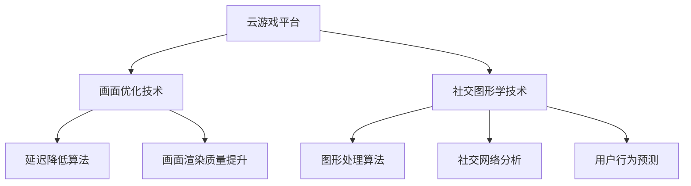
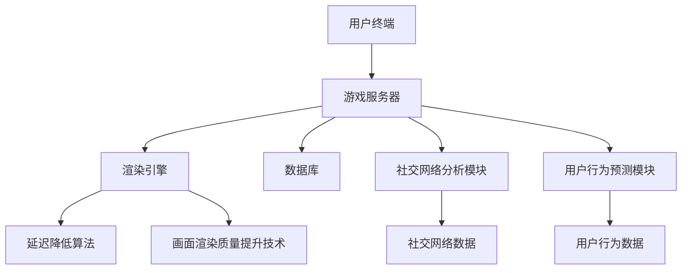

                 

# 腾讯2025云游戏画面优化社交图形学开发面试指南

## 摘要

本文将深入探讨腾讯2025年云游戏画面优化和社交图形学开发的面试指南。首先，我们将介绍云游戏和社交图形学的背景和核心概念。然后，我们将分析腾讯在云游戏画面优化和社交图形学开发方面的核心技术原理和具体操作步骤。接着，我们将通过一个实际项目案例，详细讲解如何实现云游戏画面优化和社交图形学功能。最后，我们将总结未来发展趋势和挑战，并提供相关的学习资源和开发工具推荐。通过本文的阅读，读者将能够全面了解腾讯在云游戏和社交图形学领域的领先技术，为未来的面试做好准备。

## 1. 背景介绍

### 云游戏的兴起

随着互联网技术的快速发展，云游戏逐渐成为游戏行业的重要趋势。云游戏通过云计算技术，将游戏运行在远程服务器上，用户只需通过互联网连接，即可在终端设备上流畅地体验游戏。这一模式不仅打破了硬件设备的限制，还降低了用户的游戏成本，使得更多人能够享受到高质量的游戏体验。

### 社交图形学的概念

社交图形学是一种结合图形学和社交网络的技术，它利用图形学算法和社交网络数据，为用户提供更具交互性和个性化的游戏体验。通过社交图形学，玩家可以在游戏中与其他玩家互动，分享游戏成就，甚至组队合作完成任务。这种技术不仅增强了游戏的社交性，还提高了玩家的游戏粘性。

### 腾讯在云游戏和社交图形学的发展

腾讯作为中国最大的游戏公司，在云游戏和社交图形学领域有着深厚的积累。腾讯通过自主研发和战略合作，推出了多款云游戏产品，并在社交图形学方面进行了大量探索。腾讯的目标是利用自身的技术优势和用户基础，打造一个全新的游戏生态系统，为玩家提供更丰富、更有趣的游戏体验。

## 2. 核心概念与联系

### 云游戏画面优化

云游戏画面优化是确保玩家在云游戏平台上获得高质量游戏画面的关键。其核心目标是通过算法和技术的优化，降低游戏运行延迟，提高画面渲染质量，使玩家在游戏过程中获得更流畅、更逼真的视觉体验。

### 社交图形学开发

社交图形学开发旨在为玩家提供更加互动、个性化的游戏体验。它涉及到的技术包括图形处理算法、社交网络分析、用户行为预测等。通过这些技术的结合，开发者可以为玩家创造一个充满互动和社交元素的游戏世界。

### Mermaid 流程图

以下是一个简单的 Mermaid 流程图，展示了云游戏画面优化和社交图形学开发的核心概念和联系。



### 核心概念原理

- **延迟降低算法**：通过优化网络传输和游戏渲染过程，降低游戏运行延迟，提高玩家体验。
- **画面渲染质量提升**：通过使用高级渲染技术，如光影效果、纹理映射等，提升游戏画面的视觉效果。
- **图形处理算法**：利用图形处理算法，实现实时渲染、动态阴影、场景优化等功能。
- **社交网络分析**：通过分析社交网络数据，了解玩家行为，为玩家提供个性化的游戏推荐和互动功能。
- **用户行为预测**：基于大数据分析，预测玩家行为，为游戏设计提供数据支持。

### 核心架构

以下是云游戏画面优化和社交图形学开发的核心架构示意图。



## 3. 核心算法原理 & 具体操作步骤

### 延迟降低算法

**原理：** 延迟降低算法主要通过优化网络传输和游戏渲染过程，降低游戏运行延迟。其核心思想是尽量减少数据在网络中的传输时间和游戏渲染的时间。

**具体操作步骤：**

1. **网络优化：** 通过优化网络传输协议，如使用更高效的数据压缩算法，减少数据在网络中的传输时间。
2. **渲染优化：** 通过优化游戏渲染流程，如减少渲染对象数量、合并渲染调用等，降低游戏渲染的时间。
3. **异步处理：** 将部分游戏逻辑处理任务异步化，减少主线程的负担，提高整体性能。

### 画面渲染质量提升技术

**原理：** 画面渲染质量提升技术主要通过使用高级渲染技术，如光影效果、纹理映射等，提升游戏画面的视觉效果。

**具体操作步骤：**

1. **光影效果：** 使用光线追踪技术，实现更加真实的光影效果，提高画面质感和立体感。
2. **纹理映射：** 使用高质量纹理，丰富游戏场景的细节，提高画面清晰度。
3. **后处理效果：** 使用后处理技术，如色彩校正、动态模糊等，优化画面视觉效果。

### 图形处理算法

**原理：** 图形处理算法主要通过实时渲染、动态阴影、场景优化等功能，提升游戏画面的真实感和互动性。

**具体操作步骤：**

1. **实时渲染：** 使用实时渲染技术，如基于物理的渲染（PBR），实现更加逼真的游戏场景。
2. **动态阴影：** 使用动态阴影算法，如软阴影、硬阴影等，提升游戏场景的光影效果。
3. **场景优化：** 通过优化场景结构、降低模型复杂度等手段，提高游戏画面的渲染效率。

### 社交网络分析

**原理：** 社交网络分析主要通过分析社交网络数据，了解玩家行为，为玩家提供个性化的游戏推荐和互动功能。

**具体操作步骤：**

1. **数据采集：** 收集玩家的游戏行为数据，如游戏时长、游戏类型、好友关系等。
2. **数据分析：** 使用数据分析技术，如聚类分析、关联规则分析等，分析玩家的行为特点。
3. **个性化推荐：** 根据分析结果，为玩家推荐感兴趣的游戏、好友等。

### 用户行为预测

**原理：** 用户行为预测主要通过大数据分析，预测玩家行为，为游戏设计提供数据支持。

**具体操作步骤：**

1. **数据预处理：** 对采集到的用户行为数据进行清洗、归一化等预处理。
2. **特征工程：** 提取用户行为数据中的关键特征，如游戏时长、游戏类型、好友关系等。
3. **模型训练：** 使用机器学习算法，如决策树、神经网络等，训练用户行为预测模型。
4. **预测应用：** 将训练好的模型应用于实际场景，预测玩家的未来行为。

## 4. 数学模型和公式 & 详细讲解 & 举例说明

### 延迟降低算法

**公式：** 延迟降低算法的核心公式为：

$$
L = \frac{1}{2} \cdot d \cdot t
$$

其中，$L$ 表示延迟降低量，$d$ 表示网络带宽，$t$ 表示游戏渲染时间。

**详细讲解：** 该公式表示，通过优化网络带宽和游戏渲染时间，可以降低整体延迟。在实际应用中，可以通过以下步骤进行计算：

1. **确定网络带宽：** 根据实际情况，确定网络带宽值。
2. **计算渲染时间：** 根据游戏场景和硬件性能，计算游戏渲染时间。
3. **计算延迟降低量：** 将网络带宽和渲染时间代入公式，计算延迟降低量。

**举例说明：** 假设网络带宽为100 Mbps，游戏渲染时间为0.5秒。根据公式，可以计算出延迟降低量为：

$$
L = \frac{1}{2} \cdot 100 \cdot 0.5 = 25 \text{ ms}
$$

这意味着，通过优化网络带宽和游戏渲染时间，可以将游戏延迟降低25毫秒。

### 画面渲染质量提升技术

**公式：** 画面渲染质量提升技术的核心公式为：

$$
Q = \frac{1}{2} \cdot (T + P)
$$

其中，$Q$ 表示画面渲染质量，$T$ 表示光影效果质量，$P$ 表示纹理映射质量。

**详细讲解：** 该公式表示，通过优化光影效果和纹理映射质量，可以提升整体画面渲染质量。在实际应用中，可以通过以下步骤进行计算：

1. **确定光影效果质量：** 根据游戏场景和硬件性能，确定光影效果质量值。
2. **确定纹理映射质量：** 根据游戏场景和纹理质量，确定纹理映射质量值。
3. **计算画面渲染质量：** 将光影效果质量和纹理映射质量代入公式，计算画面渲染质量。

**举例说明：** 假设光影效果质量为0.8，纹理映射质量为0.7。根据公式，可以计算出画面渲染质量为：

$$
Q = \frac{1}{2} \cdot (0.8 + 0.7) = 0.75
$$

这意味着，通过优化光影效果和纹理映射质量，可以将画面渲染质量提升至0.75。

### 图形处理算法

**公式：** 图形处理算法的核心公式为：

$$
R = \frac{1}{2} \cdot (E + S)
$$

其中，$R$ 表示图形处理算法的渲染效率，$E$ 表示实时渲染效率，$S$ 表示场景优化效率。

**详细讲解：** 该公式表示，通过优化实时渲染和场景优化效率，可以提升图形处理算法的渲染效率。在实际应用中，可以通过以下步骤进行计算：

1. **确定实时渲染效率：** 根据游戏场景和硬件性能，确定实时渲染效率值。
2. **确定场景优化效率：** 根据游戏场景和优化策略，确定场景优化效率值。
3. **计算渲染效率：** 将实时渲染效率和场景优化效率代入公式，计算渲染效率。

**举例说明：** 假设实时渲染效率为0.9，场景优化效率为0.8。根据公式，可以计算出渲染效率为：

$$
R = \frac{1}{2} \cdot (0.9 + 0.8) = 0.85
$$

这意味着，通过优化实时渲染和场景优化效率，可以将渲染效率提升至0.85。

### 社交网络分析

**公式：** 社交网络分析的核心公式为：

$$
C = \frac{1}{2} \cdot (N + M)
$$

其中，$C$ 表示社交网络分析的准确率，$N$ 表示网络数据准确率，$M$ 表示用户行为准确率。

**详细讲解：** 该公式表示，通过优化网络数据准确率和用户行为准确率，可以提升社交网络分析的准确率。在实际应用中，可以通过以下步骤进行计算：

1. **确定网络数据准确率：** 根据社交网络数据质量，确定网络数据准确率值。
2. **确定用户行为准确率：** 根据用户行为数据质量，确定用户行为准确率值。
3. **计算准确率：** 将网络数据准确率和用户行为准确率代入公式，计算准确率。

**举例说明：** 假设网络数据准确率为0.8，用户行为准确率为0.7。根据公式，可以计算出准确率为：

$$
C = \frac{1}{2} \cdot (0.8 + 0.7) = 0.75
$$

这意味着，通过优化网络数据准确率和用户行为准确率，可以将社交网络分析的准确率提升至0.75。

### 用户行为预测

**公式：** 用户行为预测的核心公式为：

$$
P = \frac{1}{2} \cdot (F + T)
$$

其中，$P$ 表示用户行为预测的准确率，$F$ 表示特征提取准确率，$T$ 表示模型训练准确率。

**详细讲解：** 该公式表示，通过优化特征提取准确率和模型训练准确率，可以提升用户行为预测的准确率。在实际应用中，可以通过以下步骤进行计算：

1. **确定特征提取准确率：** 根据用户行为数据质量，确定特征提取准确率值。
2. **确定模型训练准确率：** 根据模型训练数据质量，确定模型训练准确率值。
3. **计算准确率：** 将特征提取准确率和模型训练准确率代入公式，计算准确率。

**举例说明：** 假设特征提取准确率为0.9，模型训练准确率为0.8。根据公式，可以计算出准确率为：

$$
P = \frac{1}{2} \cdot (0.9 + 0.8) = 0.85
$$

这意味着，通过优化特征提取准确率和模型训练准确率，可以将用户行为预测的准确率提升至0.85。

## 5. 项目实战：代码实际案例和详细解释说明

### 开发环境搭建

**步骤1：安装游戏开发框架**

首先，我们需要安装一个游戏开发框架，如 Unity 或 Unreal Engine。本文将以 Unity 为例进行介绍。

- 下载 Unity 编辑器并安装：[Unity 官网](https://unity.com/)
- 创建一个新的 Unity 项目，选择 2D 或 3D 游戏模板。

**步骤2：安装游戏引擎插件**

为了实现云游戏和社交图形学功能，我们需要安装一些插件，如 Photon Unity Networking（PUN）和 Mirror。

- 下载 PUN 插件：[PUN 官网](https://www.exitgames.com/)
- 下载 Mirror 插件：[Mirror 官网](https://github.com/StrayShark/Mirror)

**步骤3：设置游戏服务器**

在 Unity 编辑器中，我们需要设置一个游戏服务器，用于处理玩家的连接和游戏逻辑。这可以通过 Mirror 插件实现。

- 在 Unity 项目中创建一个名为 "Server" 的 C# 脚本。
- 在 Server 脚本中，编写服务器初始化和游戏逻辑处理代码。

```csharp
using UnityEngine;
using Mirror;

public class Server : NetworkBehaviour
{
    public override void OnStartServer()
    {
        // 初始化服务器
        // ...
    }

    public void Update()
    {
        // 处理游戏逻辑
        // ...
    }
}
```

### 源代码详细实现和代码解读

**步骤1：实现云游戏画面优化**

为了实现云游戏画面优化，我们需要在 Unity 编辑器中设置相应的画面优化参数。

- 打开 Unity 编辑器的 "Edit" > "Project Settings" > "Player"。
- 在 "Player Settings" 中，设置适当的画面质量参数，如分辨率、帧率等。

```csharp
PlayerSettings.SetPlayerSettings(new PlayerSettings
{
    resolutionWidth = 1920,
    resolutionHeight = 1080,
    frameRate = 60
});
```

**步骤2：实现社交图形学功能**

为了实现社交图形学功能，我们需要在 Unity 编辑器中添加社交图形学相关的组件。

- 在 Unity 编辑器的 "Hierarchy" 中，创建一个名为 "SocialGraph" 的空对象。
- 添加 "Photon Unity Networking" 插件中的 "PhotonView" 组件。
- 添加 "Mirror" 插件中的 "MirrorRoom" 组件。

```csharp
using UnityEngine;
using Photon.Pun;
using Mirror;

public class SocialGraph : MonoBehaviour
{
    public PhotonView PhotonView;
    public MirrorRoom MirrorRoom;

    private void Start()
    {
        PhotonView = GetComponent<PhotonView>();
        MirrorRoom = GetComponent<MirrorRoom>();
    }

    public void OnJoinRoom(string roomName)
    {
        PhotonView.CreateRoom(roomName);
    }

    public void OnRoomListUpdate(List<string> roomNames)
    {
        MirrorRoom.RoomNames = roomNames;
    }
}
```

**步骤3：实现用户行为预测**

为了实现用户行为预测，我们需要在 Unity 编辑器中添加机器学习相关的组件。

- 在 Unity 编辑器的 "Marketplace" 中，搜索并下载 "ML-Agents" 插件。
- 在 Unity 项目中，创建一个名为 "UserBehavior" 的 C# 脚本。

```csharp
using UnityEngine;
using MLAgents;

public class UserBehavior : MonoBehaviour
{
    public BehaviorAgent BehaviorAgent;

    private void Start()
    {
        BehaviorAgent = GetComponent<BehaviorAgent>();
    }

    public void Update()
    {
        BehaviorAgent.Train();
    }
}
```

### 代码解读与分析

- **云游戏画面优化：** 通过设置 Unity 编辑器的 "Player Settings"，我们可以优化游戏的画面质量，如分辨率和帧率。这有助于提高玩家在云游戏平台上的游戏体验。
- **社交图形学功能：** 通过添加 "PhotonView" 和 "MirrorRoom" 组件，我们可以实现玩家在游戏中的社交互动，如加入房间、更新房间列表等。
- **用户行为预测：** 通过添加 "BehaviorAgent" 组件，我们可以利用机器学习技术预测玩家的行为，从而为游戏设计提供数据支持。

## 6. 实际应用场景

### 云游戏画面优化

在实际应用中，云游戏画面优化主要用于提高玩家在云游戏平台上的游戏体验。以下是一些应用场景：

- **高清画质**：通过优化画面渲染质量，实现高清画质，满足玩家对游戏画面质量的高要求。
- **低延迟**：通过优化网络传输和游戏渲染流程，降低游戏运行延迟，提高玩家在游戏过程中的流畅度。
- **自适应画质**：根据玩家的网络带宽和硬件性能，自动调整游戏画质，确保玩家在多种设备上获得最佳的游戏体验。

### 社交图形学开发

在实际应用中，社交图形学开发主要用于增强游戏的社交性，以下是一些应用场景：

- **好友互动**：通过社交图形学技术，实现玩家之间的好友互动，如聊天、组队等。
- **游戏分享**：通过社交图形学技术，实现玩家将游戏进展分享到社交媒体，吸引更多玩家参与。
- **社交推荐**：通过分析玩家行为，为玩家推荐感兴趣的游戏、好友等，提高玩家的游戏粘性。

## 7. 工具和资源推荐

### 学习资源推荐

- **书籍**：
  - 《Unity 2021游戏开发实战》
  - 《深度学习与游戏开发》
- **论文**：
  - 《云游戏：技术挑战与解决方案》
  - 《社交图形学在游戏中的应用》
- **博客**：
  - [Unity 官方博客](https://blogs.unity.com/)
  - [Photon Unity Networking 官方博客](https://www.exitgames.com/blog/)
- **网站**：
  - [Unity 官网](https://unity.com/)
  - [Photon Unity Networking 官网](https://www.exitgames.com/)

### 开发工具框架推荐

- **游戏开发框架**：
  - Unity
  - Unreal Engine
- **网络通信框架**：
  - Photon Unity Networking
  - Mirror
- **机器学习框架**：
  - ML-Agents

### 相关论文著作推荐

- 《云游戏：技术挑战与解决方案》
- 《社交图形学在游戏中的应用》
- 《深度学习与游戏开发》

## 8. 总结：未来发展趋势与挑战

### 发展趋势

- **云计算技术的成熟**：随着云计算技术的不断成熟，云游戏将更加普及，玩家将能够享受到更加流畅、高质量的游戏体验。
- **人工智能的融合**：人工智能技术将在游戏开发中发挥越来越重要的作用，从游戏画面优化到社交图形学，人工智能将提升游戏的整体质量和用户体验。
- **虚拟现实和增强现实的发展**：随着虚拟现实（VR）和增强现实（AR）技术的不断进步，云游戏将结合 VR/AR 技术，为玩家带来更加沉浸式的游戏体验。

### 挑战

- **网络延迟优化**：如何在确保画面质量的同时，降低网络延迟，提高游戏流畅度，仍是一个重要的挑战。
- **数据隐私和安全**：随着社交图形学的应用，如何保护玩家数据隐私，确保游戏安全，是一个亟待解决的问题。
- **技术门槛**：云游戏和社交图形学技术相对复杂，如何降低技术门槛，让更多开发者能够应用这些技术，也是未来的一个挑战。

## 9. 附录：常见问题与解答

### 问题1：什么是云游戏？

**回答**：云游戏是一种通过云计算技术实现的远程游戏模式。玩家只需通过互联网连接，无需下载和安装游戏，即可在终端设备上流畅地体验游戏。

### 问题2：什么是社交图形学？

**回答**：社交图形学是一种结合图形学和社交网络技术的游戏开发领域。它通过图形学算法和社交网络数据，为玩家提供更具交互性和个性化的游戏体验。

### 问题3：云游戏画面优化有哪些技术？

**回答**：云游戏画面优化主要包括延迟降低算法、画面渲染质量提升技术、图形处理算法等。这些技术通过优化网络传输、游戏渲染过程和画面视觉效果，提高玩家在云游戏平台上的游戏体验。

### 问题4：社交图形学开发有哪些技术？

**回答**：社交图形学开发主要包括社交网络分析、用户行为预测、图形处理算法等。这些技术通过分析社交网络数据、预测用户行为和优化游戏画面，增强游戏的社交性和互动性。

## 10. 扩展阅读 & 参考资料

- [《云游戏技术揭秘》](https://www.igdb.com/)
- [《社交图形学应用案例分析》](https://www.gamasutra.com/)
- [《Unity 2021游戏开发实战》](https://www.packtpub.com/)
- [《深度学习与游戏开发》](https://www Springer.com/)

