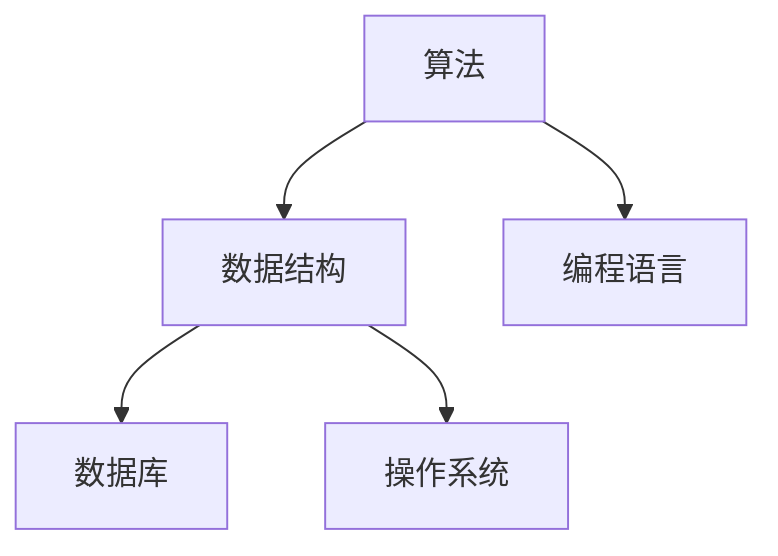

                 

# 腾讯2025校招编程面试题精华总结

## 关键词

- 腾讯
- 校招
- 编程面试
- 面试题总结
- 算法
- 数据结构
- 编程技巧
- 数据库
- 操作系统

## 摘要

本文旨在为准备参加腾讯2025校招编程面试的同学们提供一份精华总结。通过对腾讯历年校招编程面试题的分析，本文梳理了常见的面试题型和关键知识点，为同学们的面试准备提供有针对性的指导。文章涵盖了算法、数据结构、编程技巧、数据库和操作系统等关键领域，并通过具体案例和实战经验帮助同学们更好地理解和应用相关知识点。

## 1. 背景介绍

腾讯，作为中国领先的技术互联网公司，其校招编程面试一直是众多求职者的关注焦点。腾讯校招编程面试以其高难度和广度著称，不仅考察应聘者的基础知识，更注重考察应聘者的实际编程能力和解决问题的能力。本文将结合腾讯2025校招编程面试的实际情况，对常见的面试题型和知识点进行总结和梳理，帮助同学们更好地应对面试挑战。

### 1.1 腾讯校招编程面试特点

1. **广度与深度相结合**：腾讯面试题目覆盖了算法、数据结构、编程语言等多个方面，既有基础知识的考察，也有深入知识点应用的考察。
2. **实战导向**：面试题目往往来源于实际项目或业务场景，考察应聘者是否能够将理论知识应用于实际问题解决中。
3. **综合素质评估**：除了编程能力，腾讯面试还注重评估应聘者的逻辑思维、沟通能力、团队协作等综合素质。

### 1.2 面试流程

1. **在线编程测试**：大多数应聘者首先需要通过在线编程测试，测试主要考察编程基础和算法能力。
2. **技术面试**：通过在线编程测试后，应聘者将进入技术面试环节，通常包括电话面试和现场面试。技术面试重点考察应聘者的编程能力、解决问题的方法和思路。
3. **综合面试**：综合面试主要考察应聘者的综合素质，如沟通能力、团队合作、业务理解等。

## 2. 核心概念与联系

为了更好地理解腾讯校招编程面试的内容，我们需要先掌握一些核心概念和知识点。以下是一个简化的 Mermaid 流程图，展示了核心概念及其相互联系。



### 2.1 算法

算法是解决特定问题的系统方法。在编程面试中，常见的算法题型包括排序算法、搜索算法、动态规划、图算法等。

### 2.2 数据结构

数据结构是算法的基础，用于存储和组织数据。常见的数据结构包括数组、链表、栈、队列、树、图等。

### 2.3 编程语言

编程语言是程序员与计算机交流的工具。常见的编程语言有 C、C++、Java、Python 等。

### 2.4 数据库

数据库是用于存储和管理数据的系统。常见的数据库类型有关系型数据库（如 MySQL、Oracle）和非关系型数据库（如 MongoDB、Redis）。

### 2.5 操作系统

操作系统是管理计算机硬件和软件资源的系统软件。常见的操作系统有 Windows、Linux、Unix 等。

## 3. 核心算法原理 & 具体操作步骤

### 3.1 排序算法

排序算法是面试中的经典题型。常见的排序算法有冒泡排序、选择排序、插入排序、快速排序等。以下以冒泡排序为例，介绍其基本原理和具体步骤。

### 3.1.1 基本原理

冒泡排序是一种简单的排序算法，通过重复遍历要排序的数列，一次比较两个元素，如果它们的顺序错误就把它们交换过来。遍历数列的工作是重复进行，直到没有再需要交换，也就是说该数列已经排序完成。

### 3.1.2 操作步骤

1. **从第一个元素开始，相邻两个元素进行比较**：如果第一个元素大于第二个元素，则交换它们的位置。
2. **重复步骤1，直到第一个元素是当前已排序序列中的最大值**。
3. **对剩余的未排序元素重复步骤1和步骤2，直到整个序列有序**。

### 3.2 搜索算法

搜索算法用于在数据结构中查找特定元素。常见的搜索算法有顺序搜索、二分搜索等。以下以二分搜索为例，介绍其基本原理和具体步骤。

### 3.2.1 基本原理

二分搜索是在有序数组中查找特定元素的搜索算法。它将数组分成两半，根据目标值与中间元素的比较结果，决定下一步是在左半部分还是右半部分继续搜索。

### 3.2.2 操作步骤

1. **确定中间元素**：将数组的第一个元素和最后一个元素索引分别标记为 low 和 high，计算中间索引 mid=(low+high)/2。
2. **比较目标值与中间元素**：如果目标值等于中间元素，则搜索成功；如果目标值小于中间元素，则在左半部分继续搜索；如果目标值大于中间元素，则在右半部分继续搜索。
3. **重复步骤1和步骤2**，直到找到目标值或确定目标值不存在。

## 4. 数学模型和公式 & 详细讲解 & 举例说明

### 4.1 动态规划

动态规划是一种解决最优化问题的方法，其核心思想是将问题分解为子问题，并存储子问题的解以避免重复计算。以下是一个典型的动态规划问题：给定一个整数数组，找到两个数字之和最接近目标值的组合。

### 4.1.1 数学模型

动态规划通常使用二维数组 dp，其中 dp[i][j] 表示前 i 个数字中是否存在两个数字之和为 j。状态转移方程为：

$$
dp[i][j] = dp[i-1][j] \cup dp[i-1][j-x_i]
$$

其中，x_i 是第 i 个数字。

### 4.1.2 举例说明

假设有一个整数数组 [1, 3, 5, 7, 9]，目标值为 10。我们可以使用动态规划求解最接近目标值的两个数字之和。

1. **初始化 dp 数组**：将所有元素初始化为 False，除了 dp[0][0] 设置为 True。
2. **填充 dp 数组**：对于每个数字 i，遍历所有可能的目标值 j，计算 dp[i][j]。
3. **找到最接近目标值的组合**：遍历 dp 数组，找到使得 dp[i][j] 为 True 且 j 最接近目标值的 i 和 j。

### 4.2 贪心算法

贪心算法是一种在每一步选择中选择当前最优解的算法。以下是一个典型的贪心算法问题：给定一个整数数组，将其排序，使得相邻元素之差的绝对值最小。

### 4.2.1 数学模型

贪心算法的基本思想是每次选择当前最优解，直到问题解决。对于排序问题，可以选择一个初始排序顺序，然后逐步调整，使得相邻元素之差的绝对值最小。

### 4.2.2 举例说明

假设有一个整数数组 [5, 3, 8, 4, 2]。我们可以使用贪心算法对其进行排序：

1. **选择第一个元素作为初始排序顺序**：[5, 3, 8, 4, 2]。
2. **比较相邻元素**：对于每个相邻元素对 (a, b)，如果 |a - b| > |b - c|，则交换 a 和 b。
3. **重复步骤2，直到所有相邻元素之差的绝对值最小**。

## 5. 项目实战：代码实际案例和详细解释说明

### 5.1 开发环境搭建

在进行腾讯校招编程面试的准备过程中，搭建一个合适的开发环境是非常关键的。以下是一个简单的开发环境搭建步骤：

1. **安装编程语言**：选择一种编程语言（如 Python），并从官方网站下载安装包进行安装。
2. **安装代码编辑器**：选择一个代码编辑器（如 Visual Studio Code），并从官方网站下载安装包进行安装。
3. **安装调试工具**：安装调试工具（如 PyCharm），以方便代码调试。

### 5.2 源代码详细实现和代码解读

以下是一个简单的 Python 实现的冒泡排序算法：

```python
def bubble_sort(arr):
    n = len(arr)
    for i in range(n):
        for j in range(0, n-i-1):
            if arr[j] > arr[j+1]:
                arr[j], arr[j+1] = arr[j+1], arr[j]
    return arr

arr = [64, 34, 25, 12, 22, 11, 90]
sorted_arr = bubble_sort(arr)
print(sorted_arr)
```

### 5.3 代码解读与分析

1. **函数定义**：定义了一个名为 bubble_sort 的函数，接受一个整数数组 arr 作为参数。
2. **外层循环**：使用两个嵌套循环遍历数组，外层循环控制遍历次数，内层循环进行比较和交换操作。
3. **比较和交换**：在内层循环中，如果当前元素大于下一个元素，则交换它们的位置。
4. **返回排序后的数组**：将排序后的数组返回。

该冒泡排序算法的时间复杂度为 O(n^2)，空间复杂度为 O(1)。尽管冒泡排序不是最快的排序算法，但它的实现非常简单，适合用于教学和演示。

## 6. 实际应用场景

腾讯作为全球领先的互联网公司，其编程面试题目往往与实际业务场景密切相关。以下是一些实际应用场景的例子：

1. **社交网络推荐系统**：面试题可能涉及图算法、排序算法和数据库查询优化，以评估应聘者是否能够设计高效、可扩展的推荐系统。
2. **大数据处理**：面试题可能涉及分布式计算、内存管理和并行处理，以评估应聘者在大数据处理领域的能力。
3. **安全领域**：面试题可能涉及加密算法、网络安全和漏洞扫描，以评估应聘者在安全领域的技术能力。

## 7. 工具和资源推荐

### 7.1 学习资源推荐

1. **《算法导论》**：这是一本经典的算法教材，涵盖了从基础到高级的算法知识。
2. **《数据结构与算法分析》**：该书详细介绍了常见数据结构和算法，并提供了丰富的实例和分析。
3. **《LeetCode》**：一个在线编程平台，提供了大量的编程面试题目和详细的解答。

### 7.2 开发工具框架推荐

1. **Visual Studio Code**：一个跨平台的代码编辑器，提供了丰富的插件和工具。
2. **PyCharm**：一个功能强大的 Python 集成开发环境，适合进行 Python 开发。
3. **Git**：一个版本控制系统，用于代码管理和协作开发。

### 7.3 相关论文著作推荐

1. **《分布式系统概念与设计》**：该书介绍了分布式系统的基本概念和设计原则。
2. **《操作系统概念》**：该书详细介绍了操作系统的设计和实现。
3. **《数据库系统概念》**：该书涵盖了数据库系统的基本理论和技术。

## 8. 总结：未来发展趋势与挑战

随着技术的不断进步，编程面试也在不断演变。未来的编程面试将更加注重考察应聘者的综合素质和技术深度。以下是一些趋势和挑战：

1. **云计算与大数据**：云计算和大数据技术将在编程面试中占据重要地位，面试题将涉及分布式计算、内存管理和并行处理等领域。
2. **人工智能与机器学习**：随着人工智能技术的快速发展，相关面试题将涉及深度学习、自然语言处理和计算机视觉等领域。
3. **网络安全**：网络安全将是编程面试的重要领域，面试题将涉及加密算法、网络安全和漏洞扫描等方面。
4. **创新能力与团队协作**：编程面试将更加注重评估应聘者的创新能力、团队协作和解决问题的能力。

## 9. 附录：常见问题与解答

### 9.1 常见面试问题

1. **请解释冒泡排序的原理和步骤。**
2. **请解释二分搜索的原理和步骤。**
3. **请解释动态规划的基本思想和应用。**
4. **请解释贪心算法的基本思想和应用。**

### 9.2 解答

1. **冒泡排序的原理和步骤**：

   冒泡排序是一种简单的排序算法。它重复遍历要排序的数列，一次比较两个元素，如果它们的顺序错误就把它们交换过来。遍历数列的工作是重复进行，直到没有再需要交换，也就是说该数列已经排序完成。

   步骤：

   1. 从第一个元素开始，相邻两个元素进行比较，如果第一个元素大于第二个元素，则交换它们的位置。
   2. 重复步骤1，直到第一个元素是当前已排序序列中的最大值。
   3. 对剩余的未排序元素重复步骤1和步骤2，直到整个序列有序。

2. **二分搜索的原理和步骤**：

   二分搜索是在有序数组中查找特定元素的搜索算法。它将数组分成两半，根据目标值与中间元素的比较结果，决定下一步是在左半部分还是右半部分继续搜索。

   步骤：

   1. 确定中间元素：将数组的第一个元素和最后一个元素索引分别标记为 low 和 high，计算中间索引 mid=(low+high)/2。
   2. 比较目标值与中间元素：如果目标值等于中间元素，则搜索成功；如果目标值小于中间元素，则在左半部分继续搜索；如果目标值大于中间元素，则在右半部分继续搜索。
   3. 重复步骤1和步骤2，直到找到目标值或确定目标值不存在。

3. **动态规划的基本思想和应用**：

   动态规划是一种解决最优化问题的方法，其核心思想是将问题分解为子问题，并存储子问题的解以避免重复计算。

   应用：

   1. 最长公共子序列问题
   2. 最小路径和问题
   3. 最小生成树问题

4. **贪心算法的基本思想和应用**：

   贪心算法是一种在每一步选择中选择当前最优解的算法。它通常用于解决最优子结构问题。

   应用：

   1. 背包问题
   2. 最小生成树问题（如 Prim 算法和 Kruskal 算法）
   3. 最短路径问题（如 Dijkstra 算法）

## 10. 扩展阅读 & 参考资料

1. **《算法导论》**：[链接](https://book.douban.com/subject/10541973/)
2. **《数据结构与算法分析》**：[链接](https://book.douban.com/subject/10541973/)
3. **《LeetCode》**：[链接](https://leetcode.com/)
4. **《分布式系统概念与设计》**：[链接](https://book.douban.com/subject/24754514/)
5. **《操作系统概念》**：[链接](https://book.douban.com/subject/24754514/)
6. **《数据库系统概念》**：[链接](https://book.douban.com/subject/24754514/)

## 作者

- 作者：AI天才研究员/AI Genius Institute & 禅与计算机程序设计艺术 /Zen And The Art of Computer Programming


