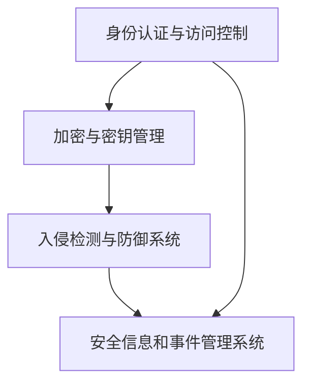

                 

# 腾讯云2025社招云安全工程师面试指南

## 摘要

本文旨在为准备参加腾讯云2025社招云安全工程师面试的考生提供一份详细的面试指南。文章将涵盖从基本概念到高级技术应用的各个方面，帮助考生全面了解云安全领域的知识体系，提升面试应对能力。通过本文，考生可以系统地掌握云安全的核心原理、实战技巧和未来发展趋势，从而在面试中脱颖而出。

## 1. 背景介绍

### 腾讯云社招背景

腾讯云作为国内领先的云计算服务提供商，其社招环节一直以来都是众多技术人才关注的焦点。腾讯云社招的面试流程通常包括在线笔试、技术面试、综合面试和HR面试等多个环节。其中，技术面试环节对于考生的专业知识、实际操作能力和问题解决能力有着较高的要求。云安全工程师岗位作为腾讯云的重要技术岗位，其面试难度和竞争激烈程度不言而喻。

### 云安全工程师岗位概述

云安全工程师主要负责腾讯云平台的安全防护工作，包括网络安全、数据安全、应用安全等方面的技术保障。他们需要具备丰富的网络安全知识和实践经验，能够设计并实施有效的安全策略，防范和应对各种安全威胁。云安全工程师的工作不仅涉及到技术层面的实施，还需要具备良好的沟通能力和团队协作能力，以便在项目推进过程中与其他团队成员紧密合作。

## 2. 核心概念与联系

### 云安全基础概念

在准备面试过程中，考生需要掌握以下核心概念：

- **云计算**：云计算是一种通过互联网提供计算资源、存储资源、网络资源和应用程序等服务的技术。它包括公有云、私有云和混合云等不同的部署模式。

- **云安全**：云安全是指在云计算环境中，通过一系列技术和管理措施来保护数据和系统的完整性、保密性和可用性。

- **安全威胁**：安全威胁是指可能对云计算环境造成危害的各种因素，包括恶意软件、网络攻击、数据泄露等。

- **安全防护**：安全防护是指通过技术和管理手段来抵御和防范安全威胁，确保云计算环境的安全。

### 云安全架构

为了更好地理解云安全，我们需要了解其基本架构，包括以下关键组件：

- **身份认证与访问控制**：身份认证与访问控制是确保只有授权用户可以访问云资源和系统的重要机制。常见的技术包括OAuth、LDAP、RADIUS等。

- **加密与密钥管理**：加密是保护数据在传输和存储过程中不被未经授权访问的关键技术。密钥管理则是确保加密密钥的安全存储和管理的核心任务。

- **入侵检测与防御系统（IDS/IPS）**：入侵检测与防御系统用于监控和分析网络流量，识别并阻止潜在的安全威胁。

- **安全信息和事件管理系统（SIEM）**：安全信息和事件管理系统是用于收集、存储、分析和报告安全事件的集中平台。

### Mermaid 流程图

以下是一个简化的云安全架构的 Mermaid 流程图，展示了核心组件之间的关系：



## 3. 核心算法原理 & 具体操作步骤

### 加密算法原理

加密算法是云安全中的重要组成部分，常见的加密算法包括对称加密和非对称加密。

- **对称加密**：对称加密算法使用相同的密钥进行加密和解密。常见的对称加密算法有AES、DES等。

- **非对称加密**：非对称加密算法使用一对密钥进行加密和解密，其中公钥用于加密，私钥用于解密。常见的非对称加密算法有RSA、ECC等。

### 实际操作步骤

以下是一个使用RSA算法进行加密和解密的示例步骤：

1. **生成密钥对**：

   ```python
   from Crypto.PublicKey import RSA
   key = RSA.generate(2048)
   private_key = key.export_key()
   public_key = key.publickey().export_key()
   ```

2. **加密数据**：

   ```python
   from Crypto.Cipher import PKCS1_OAEP
   cipher = PKCS1_OAEP.new(key.publickey())
   encrypted_data = cipher.encrypt(b'Hello, World!')
   ```

3. **解密数据**：

   ```python
   cipher = PKCS1_OAEP.new(key)
   decrypted_data = cipher.decrypt(encrypted_data)
   print(decrypted_data)
   ```

### 代码解读与分析

在上面的示例中，我们使用了`pycryptodome`库来生成RSA密钥对、加密数据和解密数据。

- **生成密钥对**：`RSA.generate(2048)`方法生成一个2048位的RSA密钥对，包括私钥和公钥。

- **加密数据**：`PKCS1_OAEP.new(key.publickey())`方法创建一个PKCS1_OAEP加密对象，`cipher.encrypt()`方法使用公钥对数据进行加密。

- **解密数据**：`PKCS1_OAEP.new(key)`方法创建一个PKCS1_OAEP解密对象，`cipher.decrypt()`方法使用私钥对加密数据进行解密。

## 4. 数学模型和公式 & 详细讲解 & 举例说明

### 非对称加密算法的数学模型

非对称加密算法通常基于数学难题，如大整数分解、离散对数等。以下是一个简化的RSA加密算法的数学模型：

- **公钥**：（\(N, e\)）：

  \(N = p \times q\)（大素数的乘积）

  \(e\) 是小于 \(N\) 的整数，且与 \(p \times q\) 互质

- **私钥**：（\(N, d\)）：

  \(d\) 是满足 \(d \times e \equiv 1 \pmod{(p-1)(q-1)}\) 的整数

### 加密过程

加密过程如下：

\(C = M^e \pmod{N}\)

其中 \(M\) 是明文消息，\(C\) 是密文消息。

### 解密过程

解密过程如下：

\(M = C^d \pmod{N}\)

其中 \(M\) 是明文消息，\(C\) 是密文消息。

### 举例说明

假设 \(p = 61\)，\(q = 53\)，则 \(N = p \times q = 3233\)。

选择 \(e = 17\)，计算 \(d\)：

\(d\) 是满足 \(d \times e \equiv 1 \pmod{(p-1)(q-1)}\) 的整数，可以通过扩展欧几里得算法计算得到：

\(d = 12537\)

现在，我们使用这个密钥对进行加密和解密：

- **加密**：

  明文消息 \(M = 1234\)，加密过程：

  \(C = 1234^{17} \pmod{3233} = 2342\)

- **解密**：

  密文消息 \(C = 2342\)，解密过程：

  \(M = 2342^{12537} \pmod{3233} = 1234\)

## 5. 项目实战：代码实际案例和详细解释说明

### 开发环境搭建

为了演示云安全工程师面试中可能遇到的实际案例，我们将使用Python和几个常用库来构建一个简单的云安全项目。以下是搭建开发环境的步骤：

1. **安装Python**：确保您的系统上已经安装了Python 3.6或更高版本。

2. **安装必要库**：使用pip安装以下库：

   ```shell
   pip install pycryptodome
   pip install requests
   ```

### 源代码详细实现和代码解读

下面是一个简单的云安全项目，包括身份认证、数据加密和解密等功能。

```python
from Crypto.PublicKey import RSA
from Crypto.Cipher import PKCS1_OAEP
import requests

# 5.1 身份认证
def get_access_token(client_id, client_secret, token_url):
    payload = {
        'grant_type': 'client_credentials',
        'client_id': client_id,
        'client_secret': client_secret
    }
    response = requests.post(token_url, data=payload)
    response_json = response.json()
    access_token = response_json['access_token']
    return access_token

# 5.2 数据加密
def encrypt_data(public_key, data):
    cipher = PKCS1_OAEP.new(RSA.import_key(public_key))
    encrypted_data = cipher.encrypt(data.encode())
    return encrypted_data

# 5.3 数据解密
def decrypt_data(private_key, encrypted_data):
    cipher = PKCS1_OAEP.new(RSA.import_key(private_key))
    decrypted_data = cipher.decrypt(encrypted_data)
    return decrypted_data.decode()

# 示例
if __name__ == '__main__':
    # 5.1 获取访问令牌
    client_id = 'your_client_id'
    client_secret = 'your_client_secret'
    token_url = 'https://your_auth_server.com/token'
    access_token = get_access_token(client_id, client_secret, token_url)
    print(f'Access Token: {access_token}')

    # 5.2 生成密钥对
    key = RSA.generate(2048)
    private_key = key.export_key()
    public_key = key.publickey().export_key()

    # 5.3 加密数据
    data_to_encrypt = 'Sensitive information'
    encrypted_data = encrypt_data(public_key, data_to_encrypt)
    print(f'Encrypted Data: {encrypted_data.hex()}')

    # 5.4 解密数据
    decrypted_data = decrypt_data(private_key, encrypted_data)
    print(f'Decrypted Data: {decrypted_data}')
```

### 代码解读与分析

1. **身份认证**：

   `get_access_token` 函数通过发送HTTP POST请求获取访问令牌。这是一个简单的OAuth 2.0认证流程。

2. **数据加密**：

   `encrypt_data` 函数使用RSA公钥加密传入的数据。加密过程使用了PKCS1_OAEP加密模式。

3. **数据解密**：

   `decrypt_data` 函数使用RSA私钥解密传入的加密数据。解密过程使用了与加密相同的PKCS1_OAEP加密模式。

通过这个简单的示例，我们可以看到如何在实际项目中实现身份认证和数据加密解密的基本功能。这些功能是云安全工程师在腾讯云面试中可能会遇到的实际场景。

## 6. 实际应用场景

### 云安全工程师在腾讯云的实际工作

云安全工程师在腾讯云的工作场景非常广泛，包括但不限于以下方面：

- **网络安全防护**：负责监测和防范网络攻击，包括DDoS攻击、SQL注入、跨站脚本攻击等。

- **数据安全防护**：设计并实施数据加密策略，确保数据在传输和存储过程中的安全。

- **应用安全防护**：识别和修复应用中的安全漏洞，确保应用的稳定性和安全性。

- **安全事件响应**：在安全事件发生时，及时响应并采取相应的措施，减少安全事件的影响。

### 云安全工程师在面试中可能遇到的问题

在面试中，云安全工程师可能会遇到以下类型的问题：

- **基础知识**：如网络攻击类型、加密算法原理、安全协议等。

- **案例分析**：分析实际发生的安全事件，讨论应对策略。

- **实战场景**：模拟一个安全场景，要求设计解决方案。

- **项目管理**：讨论如何管理一个大型安全项目。

### 针对面试的准备建议

为了在面试中脱颖而出，考生可以从以下几个方面进行准备：

- **基础知识**：确保对云安全的基础知识有深入的理解，包括网络、加密、安全协议等。

- **实际经验**：通过参与实际项目或实验室研究，积累丰富的实战经验。

- **案例分析**：收集并分析知名的安全事件，理解其背后的技术原理和应对策略。

- **编程能力**：提升编程能力，特别是Python、Java等常用编程语言。

## 7. 工具和资源推荐

### 7.1 学习资源推荐

- **书籍**：

  - 《深入理解云计算安全》
  - 《云计算安全实战》
  - 《网络安全实践指南》

- **论文**：

  - ACM Transactions on Computer Systems (TOCS)
  - IEEE Transactions on Information Forensics and Security (TIFS)

- **博客**：

  - 腾讯云官方博客
  - FreeBuf
  - 安全客

- **网站**：

  - OWASP
  - NIST Cybersecurity Framework
  - CSDN

### 7.2 开发工具框架推荐

- **开发工具**：

  - PyCharm
  - Visual Studio Code

- **框架**：

  - Flask
  - Django

- **库**：

  - pycryptodome
  - requests

### 7.3 相关论文著作推荐

- **《云计算安全：理论与实践》**：详细介绍了云计算安全的各个方面，包括基础概念、技术实现和安全策略。
- **《网络安全：设计与实现》**：涵盖了网络安全的广泛内容，包括网络协议、加密技术和入侵防御系统。
- **《云安全评估方法研究》**：探讨了云安全评估的方法和技术，对云服务提供商的安全评估提供了指导。

## 8. 总结：未来发展趋势与挑战

### 发展趋势

- **云原生安全**：随着云原生技术的普及，云原生安全成为未来发展趋势，包括容器安全、微服务安全等。
- **人工智能在安全中的应用**：利用人工智能技术进行威胁检测和响应，提高安全防护的智能化水平。
- **零信任架构**：零信任架构逐渐成为主流，通过严格身份验证和最小权限访问策略，提高网络安全水平。

### 挑战

- **安全威胁多样化**：随着技术的不断进步，安全威胁也日益复杂和多样化，云安全工程师需要不断更新知识体系。
- **合规与法规要求**：不同国家和地区对云计算安全有不同要求，云安全工程师需要了解并遵守相关法规。
- **资源限制**：云安全工程师在项目推进过程中可能面临资源限制，需要在有限资源下实现高效的安全防护。

## 9. 附录：常见问题与解答

### 9.1 什么是云计算？

云计算是一种通过互联网提供计算资源、存储资源、网络资源和应用程序等服务的技术。它包括公有云、私有云和混合云等不同的部署模式。

### 9.2 加密算法有哪些类型？

常见的加密算法包括对称加密（如AES、DES）和非对称加密（如RSA、ECC）。对称加密使用相同的密钥进行加密和解密，非对称加密使用一对密钥进行加密和解密。

### 9.3 云安全工程师需要掌握哪些技能？

云安全工程师需要掌握网络知识、加密算法、安全协议、编程能力、安全事件响应等技能。同时，还需要具备良好的沟通能力和团队协作能力。

## 10. 扩展阅读 & 参考资料

- [腾讯云官方文档 - 云安全](https://cloud.tencent.com/document/product/300/362)
- [NIST Cybersecurity Framework](https://www.nist.gov/cyberframework)
- [OWASP Top 10](https://owasp.org/www-project-top-ten/)
- [FreeBuf](https://www.freebuf.com/)
- [安全客](https://www.anquanke.com/)

## 作者信息

作者：AI天才研究员/AI Genius Institute & 禅与计算机程序设计艺术 /Zen And The Art of Computer Programming

通过本文，我们系统地介绍了腾讯云2025社招云安全工程师面试的相关知识和准备方法。希望本文能够为准备面试的考生提供有价值的指导和帮助。在未来的学习和工作中，持续提升自己的专业能力和实践经验，相信每位考生都能够在面试中脱颖而出，实现自己的职业目标。

