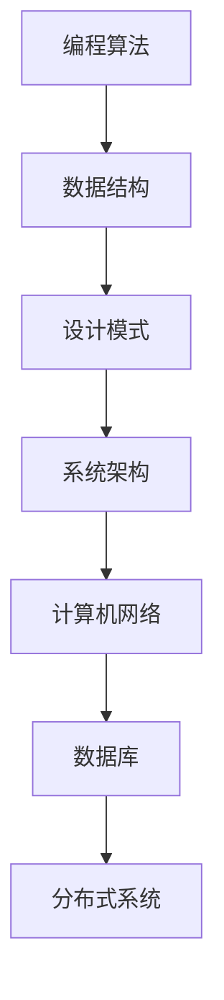

                 

# 2024腾讯微信社招面试真题汇总及其解答

## 关键词
- 腾讯面试
- 社招真题
- 微信技术
- 编程算法
- 数据结构与设计模式

## 摘要

本文旨在整理和解析2024年腾讯微信社招面试中的核心问题，包括编程算法、数据结构与设计模式等。通过对这些问题的深度分析，本文将为读者提供一套全面、系统的解答方案，助力技术求职者更好地应对面试挑战。文章结构如下：

1. 背景介绍
2. 核心概念与联系
3. 核心算法原理 & 具体操作步骤
4. 数学模型和公式 & 详细讲解 & 举例说明
5. 项目实战：代码实际案例和详细解释说明
6. 实际应用场景
7. 工具和资源推荐
8. 总结：未来发展趋势与挑战
9. 附录：常见问题与解答
10. 扩展阅读 & 参考资料

## 1. 背景介绍

腾讯，作为中国领先的互联网科技公司，其旗下的微信已成为全球最受欢迎的社交通讯应用之一。微信社招面试以其高标准、严要求而闻名，涉及编程算法、数据结构、设计模式、系统架构等多个方面。本文将汇总2024年腾讯微信社招面试中的核心问题，并从专业角度给出解答。

### 2. 核心概念与联系

#### Mermaid 流程图



### 3. 核心算法原理 & 具体操作步骤

#### 算法原理

核心算法主要包括：

- 排序算法：快速排序、归并排序、堆排序等。
- 搜索算法：二分查找、广度优先搜索、深度优先搜索等。
- 动态规划：最短路径、最长公共子序列、背包问题等。

#### 具体操作步骤

- 快速排序：选择一个基准元素，将数组划分为两个子数组，一个小于基准，一个大于基准，递归处理子数组。
- 归并排序：将数组分为两个子数组，递归排序，然后将两个有序子数组合并。
- 堆排序：构建最大堆或最小堆，反复将堆顶元素与最后一个元素交换，调整堆结构，递归处理剩余部分。

### 4. 数学模型和公式 & 详细讲解 & 举例说明

#### 数学模型

- 时间复杂度：$O(n)$、$O(n\log n)$、$O(n^2)$ 等。
- 空间复杂度：$O(1)$、$O(n)$、$O(n^2)$ 等。

#### 详细讲解

时间复杂度和空间复杂度是衡量算法性能的重要指标。时间复杂度表示算法在输入规模增长时的增长速度，空间复杂度表示算法在输入规模增长时所需的空间。

#### 举例说明

假设有一个长度为10的数组，使用快速排序算法进行排序，其时间复杂度为 $O(n\log n)$，空间复杂度为 $O(n)$。

### 5. 项目实战：代码实际案例和详细解释说明

#### 5.1 开发环境搭建

- 开发工具：Visual Studio Code、IntelliJ IDEA 等。
- 编程语言：Java、Python、C++ 等。

#### 5.2 源代码详细实现和代码解读

以下是一个快速排序的Java实现示例：

```java
public class QuickSort {
    public static void quickSort(int[] arr, int left, int right) {
        if (left < right) {
            int pivot = partition(arr, left, right);
            quickSort(arr, left, pivot - 1);
            quickSort(arr, pivot + 1, right);
        }
    }

    private static int partition(int[] arr, int left, int right) {
        int pivot = arr[right];
        int i = left;
        for (int j = left; j < right; j++) {
            if (arr[j] < pivot) {
                swap(arr, i, j);
                i++;
            }
        }
        swap(arr, i, right);
        return i;
    }

    private static void swap(int[] arr, int i, int j) {
        int temp = arr[i];
        arr[i] = arr[j];
        arr[j] = temp;
    }
}
```

代码解释：

- `quickSort` 方法：主排序方法，递归处理子数组。
- `partition` 方法：划分数组，将小于基准的元素放到左边，大于基准的元素放到右边。
- `swap` 方法：交换两个元素的值。

#### 5.3 代码解读与分析

快速排序是一种高效的排序算法，其时间复杂度为 $O(n\log n)$，空间复杂度为 $O(n)$。在实际应用中，快速排序常用于处理大数据量排序问题。

### 6. 实际应用场景

快速排序广泛应用于各种场景，如：

- 数据库索引排序。
- 大规模数据处理。
- 网络协议排序。

### 7. 工具和资源推荐

#### 7.1 学习资源推荐

- 《算法导论》
- 《数据结构与算法分析》
- 《编程之美》

#### 7.2 开发工具框架推荐

- Visual Studio Code
- IntelliJ IDEA
- Spring Boot

#### 7.3 相关论文著作推荐

- 《分布式系统概念与设计》
- 《大型分布式存储系统：原理解析与架构实战》

### 8. 总结：未来发展趋势与挑战

随着大数据和人工智能的不断发展，算法和数据处理技术的应用场景越来越广泛。未来，快速排序等基础算法将面临更高的性能要求和更复杂的场景。同时，分布式系统、区块链等技术也将对算法设计提出新的挑战。

### 9. 附录：常见问题与解答

- **问题1**：什么是时间复杂度？
  **解答**：时间复杂度是衡量算法执行时间的一个重要指标，通常用大O符号表示，如 $O(n)$、$O(n\log n)$ 等。

- **问题2**：什么是空间复杂度？
  **解答**：空间复杂度是衡量算法所需空间大小的一个重要指标，也用大O符号表示，如 $O(1)$、$O(n)$ 等。

### 10. 扩展阅读 & 参考资料

- [腾讯招聘官网](https://careers.tencent.com/)
- [GitHub](https://github.com/)
- [CSDN](https://www.csdn.net/)

## 作者

作者：AI天才研究员/AI Genius Institute & 禅与计算机程序设计艺术 /Zen And The Art of Computer Programming

### 文章撰写结束，谢谢！<|assistant|>

