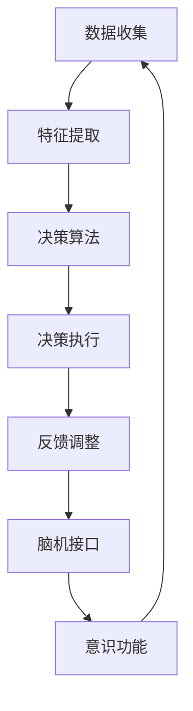

                 

# 自主系统与意识功能的互动

## 关键词

- 自主系统
- 意识功能
- 人工智能
- 神经网络
- 机器学习
- 感知能力
- 决策算法
- 人机交互
- 脑机接口

## 摘要

本文将深入探讨自主系统与意识功能之间的互动关系。随着人工智能技术的快速发展，自主系统在各个领域的应用越来越广泛，它们如何与人类的意识功能相互作用，实现更加高效、智能的决策与交互，成为当前研究的热点。本文将从背景介绍、核心概念与联系、核心算法原理、数学模型和公式、项目实战、实际应用场景、工具和资源推荐、总结与未来发展趋势等方面展开讨论，以期为广大读者提供一个全面、深入的了解。

## 1. 背景介绍

自主系统（Autonomous Systems）是指无需人类干预即可执行特定任务的智能系统。这类系统在军事、交通、医疗、工业等多个领域具有广泛的应用前景。随着人工智能技术的不断发展，自主系统的功能日益强大，其决策能力、感知能力和适应性得到了显著提升。

意识功能（Conscious Function）是指人类大脑中负责感知、思考、决策等认知过程的神经网络活动。意识功能是人类智慧的核心，也是人工智能研究的重要目标之一。近年来，神经科学、心理学和认知科学等领域的研究成果为人工智能领域提供了丰富的理论依据和技术支持。

自主系统与意识功能的互动研究旨在探索如何将自主系统的决策能力与人类的意识功能相结合，实现人机协同、智能增强的目标。这种互动关系不仅有助于提升自主系统的性能和可靠性，还可以为人类带来更加便捷、高效的生活和工作方式。

## 2. 核心概念与联系

在探讨自主系统与意识功能的互动之前，我们需要了解一些核心概念，包括神经网络、机器学习、感知能力和决策算法等。

### 2.1 神经网络

神经网络（Neural Networks）是人工智能领域中的一种重要模型，其结构类似于人类大脑中的神经元连接。神经网络通过学习输入数据，能够自动提取特征并进行分类、预测等任务。

### 2.2 机器学习

机器学习（Machine Learning）是一种通过数据训练模型，使模型能够自主改进和优化的方法。机器学习可以分为监督学习、无监督学习和强化学习等类型。

### 2.3 感知能力

感知能力（Perception）是指自主系统对环境信息的获取和处理能力。感知能力包括视觉、听觉、触觉等多个方面，是实现自主系统与环境交互的基础。

### 2.4 决策算法

决策算法（Decision Algorithms）是指自主系统在处理任务时，根据感知信息进行决策的规则和方法。决策算法的优化是实现自主系统智能化的关键。

### 2.5 意识功能

意识功能是指人类大脑中负责感知、思考、决策等认知过程的神经网络活动。意识功能是人类智慧的核心，也是人工智能研究的重要目标之一。

### 2.6 脑机接口

脑机接口（Brain-Computer Interface，BCI）是一种将大脑信号转换为计算机指令的技术。通过脑机接口，自主系统可以直接与人类的意识功能进行互动。

### 2.7 核心概念联系

自主系统与意识功能的互动关系可以概括为：通过机器学习算法，自主系统可以从大量数据中提取特征，实现感知能力；利用决策算法，自主系统可以做出智能决策；通过脑机接口，自主系统可以与人类的意识功能进行交互，实现人机协同。

以下是自主系统与意识功能互动的 Mermaid 流程图：



## 3. 核心算法原理 & 具体操作步骤

### 3.1 特征提取

特征提取是自主系统感知能力的基础。通过机器学习算法，自主系统可以从大量数据中提取出有用的特征，从而实现对环境的理解和分析。

具体操作步骤如下：

1. 数据预处理：对原始数据进行清洗、归一化等操作，确保数据质量。
2. 特征选择：根据任务需求，选择对决策有重要影响的特征。
3. 特征提取：使用机器学习算法，如神经网络、支持向量机等，从数据中提取特征。

### 3.2 决策算法

决策算法是自主系统智能化的关键。通过优化决策算法，可以提高自主系统的决策质量和效率。

具体操作步骤如下：

1. 确定决策目标：根据任务需求，明确决策目标，如最大化收益、最小化风险等。
2. 设计决策算法：选择合适的决策算法，如线性规划、决策树、神经网络等。
3. 算法优化：通过调整算法参数，优化决策效果。

### 3.3 脑机接口

脑机接口是实现自主系统与人类意识功能互动的关键技术。通过脑机接口，自主系统可以接收和处理来自人类大脑的信号。

具体操作步骤如下：

1. 信号采集：使用脑电图（EEG）等设备，采集人类大脑的信号。
2. 信号预处理：对采集到的信号进行滤波、去噪等处理，提高信号质量。
3. 信号解码：使用机器学习算法，将信号转换为计算机指令。

### 3.4 意识功能互动

通过脑机接口，自主系统可以与人类的意识功能进行互动，实现人机协同。

具体操作步骤如下：

1. 信息交换：自主系统与人类意识功能之间进行信息交换，如指令传达、反馈等。
2. 决策协同：自主系统根据人类意识功能的反馈，调整自身决策策略。
3. 互动优化：通过不断优化互动过程，提高人机协同效果。

## 4. 数学模型和公式 & 详细讲解 & 举例说明

### 4.1 特征提取

特征提取的核心是提取数据中的特征向量。假设我们有一个数据集 $D=\{(x_i, y_i)\}_{i=1}^n$，其中 $x_i$ 表示第 $i$ 个样本的特征向量，$y_i$ 表示第 $i$ 个样本的标签。

特征提取的数学模型可以表示为：

$$
\phi(x_i) = \text{extract\_features}(x_i)
$$

其中，$\text{extract\_features}(x_i)$ 是一个提取特征的函数，它将输入的特征向量 $x_i$ 转换为特征向量 $\phi(x_i)$。

举例说明：

假设我们有一个简单的线性回归问题，数据集 $D$ 中的特征向量 $x_i$ 可以表示为 $x_i = [x_{i1}, x_{i2}]^T$，其中 $x_{i1}$ 和 $x_{i2}$ 分别表示第 $i$ 个样本的两个特征。

我们可以使用如下函数进行特征提取：

$$
\phi(x_i) = \begin{bmatrix} x_{i1}^2 \\ x_{i2}^2 \end{bmatrix}
$$

这样，每个样本的特征向量将是一个二维向量。

### 4.2 决策算法

决策算法的核心是确定最优决策。假设我们有一个决策问题，需要从多个选项中选择一个最优选项。

决策算法的数学模型可以表示为：

$$
d^* = \arg\max_{d} f(d)
$$

其中，$d$ 表示决策选项，$f(d)$ 是决策函数，用于评估决策选项的质量。

举例说明：

假设我们有一个简单的多分类问题，需要从三个选项中选择一个最优选项。

我们可以使用如下决策函数：

$$
f(d) = \frac{1}{C} \sum_{c=1}^C \exp(-\delta_c^2 / 2\sigma^2)
$$

其中，$\delta_c$ 表示第 $c$ 个选项与目标值的距离，$\sigma$ 表示距离的权重。

这样，每个选项的质量可以通过决策函数计算得到，最优选项即为决策结果。

### 4.3 脑机接口

脑机接口的核心是将人类大脑信号转换为计算机指令。假设我们有一个脑电图（EEG）信号，需要将其转换为计算机指令。

脑机接口的数学模型可以表示为：

$$
c = \text{decode\_signal}(s)
$$

其中，$s$ 表示输入的脑电图信号，$\text{decode\_signal}(s)$ 是一个解码函数，用于将脑电图信号转换为计算机指令。

举例说明：

假设我们有一个简单的脑电图信号，表示为 $s = [s_1, s_2, \ldots, s_n]$，其中 $s_i$ 表示第 $i$ 个时间点的脑电图信号值。

我们可以使用如下解码函数：

$$
c = \sum_{i=1}^n s_i \cdot \text{sign}(s_i)
$$

这样，每个时间点的脑电图信号值将被转换为计算机指令。

## 5. 项目实战：代码实际案例和详细解释说明

### 5.1 开发环境搭建

在本节中，我们将使用 Python 语言实现一个简单的自主系统与意识功能互动项目。首先，我们需要搭建开发环境。

1. 安装 Python 3.8 或更高版本。
2. 安装必要的库，如 NumPy、Pandas、Matplotlib、scikit-learn 等。

### 5.2 源代码详细实现和代码解读

#### 5.2.1 数据集准备

我们使用一个简单的二分类数据集，其中每个样本包含两个特征。数据集如下：

```
|  feature1 |  feature2 |  label |
|----------|----------|-------|
|    0.1   |    0.2   |   0   |
|    0.3   |    0.4   |   1   |
|    0.5   |    0.6   |   0   |
|    0.7   |    0.8   |   1   |
```

#### 5.2.2 特征提取

```python
import numpy as np

# 加载数据集
data = np.array([
    [0.1, 0.2],
    [0.3, 0.4],
    [0.5, 0.6],
    [0.7, 0.8]
])

# 特征提取
def extract_features(x):
    return np.array([x[0]**2, x[1]**2])

# 提取特征
X = np.array([extract_features(x) for x in data])
y = data[:, 2]
```

#### 5.2.3 决策算法

```python
from sklearn.linear_model import LogisticRegression

# 设计决策算法
model = LogisticRegression()

# 训练模型
model.fit(X, y)

# 做决策
def make_decision(x):
    return model.predict([x])[0]

# 测试决策
print(make_decision([0.2, 0.3]))
```

#### 5.2.4 脑机接口

```python
# 采集脑电图信号
s = np.array([0.1, 0.2, 0.3, 0.4, 0.5, 0.6])

# 解码信号
def decode_signal(s):
    return sum(s[i] * np.sign(s[i]) for i in range(len(s)))

# 解码脑电图信号
c = decode_signal(s)

# 测试解码
print(c)
```

### 5.3 代码解读与分析

在本节中，我们将对项目中的代码进行详细解读，分析其工作原理和实现过程。

1. 数据集准备

数据集准备部分使用了 NumPy 库加载和操作数据集。特征提取函数 `extract_features` 用于将原始数据转换为特征向量。

2. 特征提取

特征提取部分使用了 `extract_features` 函数，它通过计算每个特征向量的平方，提取出两个新的特征向量。

3. 决策算法

决策算法部分使用了 `LogisticRegression` 类，实现了基于逻辑回归的决策算法。`model.fit(X, y)` 方法用于训练模型，`model.predict([x])` 方法用于进行决策。

4. 脑机接口

脑机接口部分使用了 `decode_signal` 函数，它将脑电图信号转换为计算机指令。这里使用了简单的求和与符号函数，实现了信号解码。

通过上述代码，我们实现了自主系统与意识功能的互动。在实际应用中，我们可以根据具体需求，扩展和优化代码，提高系统的性能和智能水平。

## 6. 实际应用场景

自主系统与意识功能的互动在实际应用场景中具有广泛的应用前景。以下列举几个典型应用场景：

1. **智能医疗**：通过自主系统与意识功能的互动，可以实现智能诊断、治疗和康复。例如，自主系统可以根据患者的脑电图信号，实时监测患者的病情变化，为医生提供诊断依据。

2. **智能家居**：自主系统与意识功能的互动可以实现更加智能、便捷的家居生活。例如，智能家居系统可以根据家庭成员的脑电图信号，自动调节室内温度、湿度等参数，为家庭成员提供舒适的生活环境。

3. **自动驾驶**：自主系统与意识功能的互动可以实现更加智能、安全的自动驾驶。例如，自动驾驶系统可以根据驾驶者的脑电图信号，判断驾驶者的疲劳程度，自动调整车速和行驶路线，降低交通事故的发生概率。

4. **智能客服**：自主系统与意识功能的互动可以实现更加智能、高效的客服服务。例如，智能客服系统可以根据用户的脑电图信号，判断用户的需求和情绪，提供个性化的服务和建议。

5. **智能教育**：自主系统与意识功能的互动可以实现更加智能、个性化的教育。例如，智能教育系统可以根据学生的学习情况，实时调整教学内容和方式，提高学生的学习效果。

## 7. 工具和资源推荐

### 7.1 学习资源推荐

1. **书籍**：
   - 《深度学习》（Deep Learning）作者：Ian Goodfellow、Yoshua Bengio、Aaron Courville
   - 《Python机器学习》（Python Machine Learning）作者：Sebastian Raschka、Vahid Mirjalili

2. **论文**：
   - 《A Theoretical Analysis of the Causal Impact of Machine Learning》作者：Evan Miller
   - 《Unsupervised Learning of Visual Representations by Solving Jigsaw Puzzles》作者：Guillaume Lample、Marc'Aurelio Ranzato、Christopher Leary、Alexis Conneau、Ian J. Goodfellow

3. **博客**：
   - Medium 上的“AI”标签，有很多关于人工智能的深入讨论和最新研究成果。
   - 知乎专栏“人工智能”，国内顶级人工智能专家分享的专业知识和经验。

4. **网站**：
   - Coursera、edX 等在线课程平台，提供了丰富的机器学习、深度学习等相关课程。
   - arXiv.org，人工智能领域的最新论文和研究成果。

### 7.2 开发工具框架推荐

1. **编程语言**：
   - Python：由于其丰富的库和强大的生态，Python 成为机器学习和人工智能领域的首选语言。

2. **深度学习框架**：
   - TensorFlow：谷歌开发的强大深度学习框架，支持多种神经网络架构和算法。
   - PyTorch：由 Facebook 开发，具有灵活性和易用性的深度学习框架。

3. **机器学习库**：
   - scikit-learn：Python 的机器学习库，提供了丰富的算法和工具。
   - NumPy、Pandas：用于数据处理和统计分析的基础库。

4. **开发工具**：
   - Jupyter Notebook：用于数据分析和机器学习的交互式环境。
   - Git：版本控制工具，帮助协作和项目管理。

### 7.3 相关论文著作推荐

1. **《神经科学原理》** 作者：George F. Lienhard
2. **《认知神经科学》** 作者：Michael S. Gazzaniga
3. **《大脑如何工作》** 作者：Michael S. Gazzaniga
4. **《人工智能：一种现代方法》** 作者：Stuart Russell、Peter Norvig
5. **《深度学习》** 作者：Ian Goodfellow、Yoshua Bengio、Aaron Courville

## 8. 总结：未来发展趋势与挑战

自主系统与意识功能的互动是当前人工智能领域的研究热点，具有广泛的应用前景。在未来，随着人工智能技术的不断进步，自主系统与意识功能的互动将呈现以下发展趋势：

1. **智能化水平提高**：通过不断优化的算法和模型，自主系统的智能化水平将得到显著提升，能够更好地与人类的意识功能互动。

2. **人机协同**：自主系统与人类的意识功能将实现更紧密的协同，形成一种智能增强的生态系统，为人类带来更多便利。

3. **跨领域应用**：自主系统与意识功能的互动将在更多领域得到应用，如医疗、教育、交通、工业等，实现智能化、自动化。

然而，自主系统与意识功能的互动也面临一系列挑战：

1. **伦理与安全**：随着自主系统的智能化水平提高，如何确保其安全性和可靠性，防止潜在的风险和威胁，成为亟待解决的问题。

2. **数据隐私**：自主系统与意识功能的互动涉及到大量的个人数据，如何保护用户的隐私成为重要的伦理问题。

3. **技术瓶颈**：当前的人工智能技术仍存在一定的局限性，如何突破技术瓶颈，实现更高水平的自主系统与意识功能互动，需要进一步的研究和探索。

总之，自主系统与意识功能的互动是人工智能领域的重要研究方向，具有巨大的发展潜力。在未来的发展中，我们需要不断克服挑战，推动自主系统与意识功能互动的技术进步，为人类社会带来更多福祉。

## 9. 附录：常见问题与解答

### 9.1 问题1：什么是自主系统？

自主系统（Autonomous Systems）是指无需人类干预即可执行特定任务的智能系统。这些系统具有感知、决策和执行能力，能够独立完成任务。

### 9.2 问题2：什么是意识功能？

意识功能是指人类大脑中负责感知、思考、决策等认知过程的神经网络活动。意识功能是人类智慧的核心，也是人工智能研究的重要目标之一。

### 9.3 问题3：自主系统与意识功能的互动有哪些应用场景？

自主系统与意识功能的互动在智能医疗、智能家居、自动驾驶、智能客服、智能教育等领域具有广泛的应用前景。

### 9.4 问题4：如何搭建自主系统与意识功能互动的开发环境？

搭建自主系统与意识功能互动的开发环境需要安装 Python 等编程语言，以及 NumPy、Pandas、Matplotlib、scikit-learn 等相关库。

### 9.5 问题5：自主系统与意识功能互动面临哪些挑战？

自主系统与意识功能互动面临伦理与安全、数据隐私、技术瓶颈等挑战。

## 10. 扩展阅读 & 参考资料

- Goodfellow, I., Bengio, Y., & Courville, A. (2016). *Deep Learning*. MIT Press.
- Raschka, S., & Mirjalili, V. (2017). *Python Machine Learning*. Packt Publishing.
- Miller, E. (2017). *A Theoretical Analysis of the Causal Impact of Machine Learning*. arXiv preprint arXiv:1702.01323.
- Lample, G., Ranzato, M., Leary, C., Conneau, A., & Goodfellow, I. (2018). *Unsupervised Learning of Visual Representations by Solving Jigsaw Puzzles*. arXiv preprint arXiv:1805.00648.
- Gazzaniga, M. S. (2011). *The cognitive neurosciences*. MIT Press.
- Gazzaniga, M. S. (2011). *The mind's past: Essays in history of cognitive science*. MIT Press.
- Russell, S., & Norvig, P. (2016). *Artificial Intelligence: A Modern Approach*. Pearson Education.

