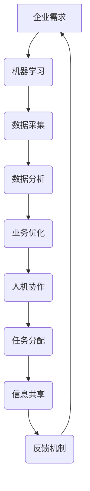
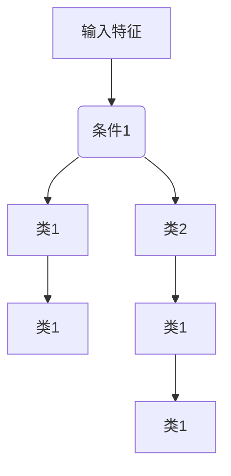
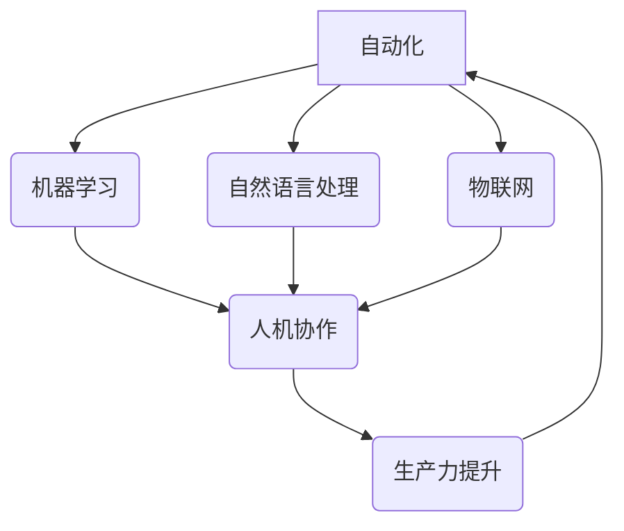
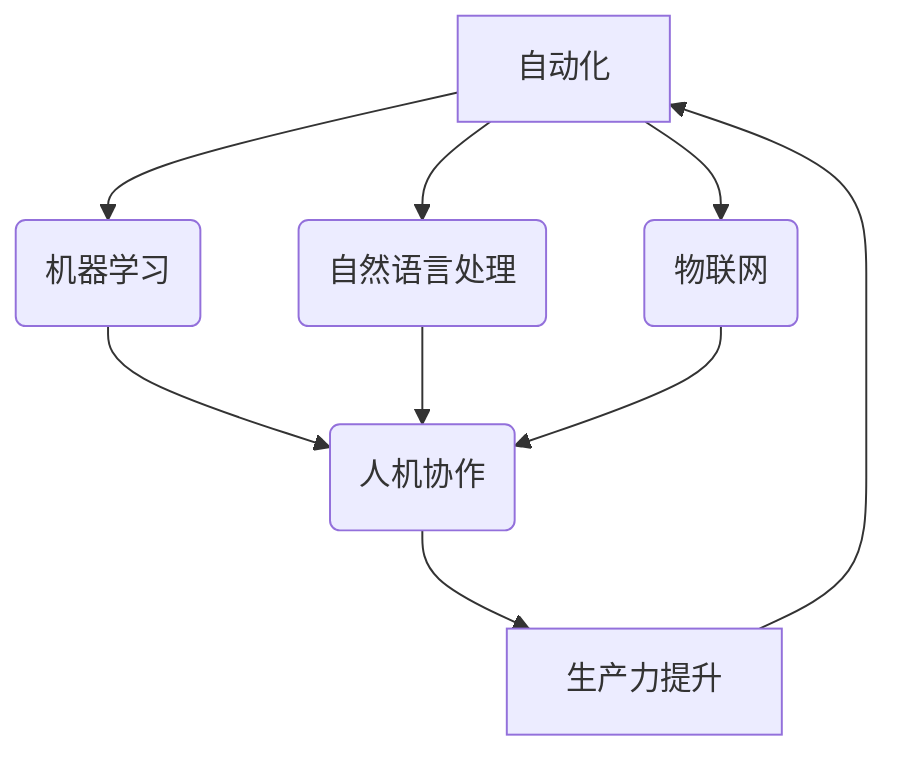

                 

# 自动化创业中的人机协作

> 关键词：自动化创业、人机协作、AI、技术、流程优化、生产力提升

> 摘要：本文深入探讨了自动化创业中的人机协作，分析了其在提高生产效率、降低运营成本和促进创新方面的作用。通过具体的案例和算法原理，本文阐述了如何实现人机高效协作，为自动化创业提供了一条可行之路。

## 1. 背景介绍

在当今快速发展的科技时代，自动化已经成为各个行业不可或缺的一部分。特别是在创业领域，自动化技术的应用不仅能够帮助企业快速迭代产品、降低运营成本，还能够释放人力，使员工能够更专注于创新和战略决策。

### 自动化的优势

- **提高生产效率**：自动化系统能够在短时间内完成大量重复性工作，减少人为错误，提高生产效率。
- **降低运营成本**：通过自动化技术，企业可以减少人力投入，降低长期运营成本。
- **促进创新**：自动化技术的应用可以释放人力，使企业员工能够更多地投入到创新活动中，推动企业持续发展。

### 人机协作的重要性

尽管自动化技术具有很多优势，但完全依赖机器可能会忽视人的智慧和创造力。因此，人机协作成为自动化创业中的一个关键点。通过合理的人机协作，企业可以实现：

- **优势互补**：人机各自发挥优势，共同提高工作效率。
- **灵活应变**：人机协作能够快速适应变化，提高企业的应变能力。
- **决策优化**：人的判断力和经验可以帮助机器更好地做出决策。

## 2. 核心概念与联系

### 自动化创业中的关键技术

- **机器学习**：通过机器学习算法，系统可以自动识别模式、预测趋势，从而优化业务流程。
- **自然语言处理**：利用自然语言处理技术，系统能够理解和生成自然语言，实现与用户的智能交互。
- **物联网**：物联网技术可以将各种设备连接起来，实现实时数据采集和智能监控。

### 人机协作的关键要素

- **任务分配**：根据人的能力和机器的优势，合理分配任务，实现优势互补。
- **信息共享**：建立高效的信息共享机制，确保人和机器都能获取到所需的数据和资源。
- **反馈机制**：通过反馈机制，及时调整协作策略，优化协作效果。

### Mermaid 流程图



## 3. 核心算法原理 & 具体操作步骤

### 机器学习算法原理

机器学习算法的核心思想是通过大量数据训练模型，使其能够自动识别模式和规律，从而进行预测和决策。常见的机器学习算法包括：

- **线性回归**：用于预测线性关系。
- **决策树**：用于分类和回归分析。
- **支持向量机**：用于分类和回归分析。
- **神经网络**：用于复杂模式识别和预测。

### 操作步骤

1. **数据收集**：收集与企业业务相关的数据，包括历史交易数据、用户行为数据等。
2. **数据预处理**：对数据进行清洗、归一化等处理，使其适合机器学习算法。
3. **模型选择**：根据业务需求选择合适的机器学习算法。
4. **模型训练**：使用训练数据训练模型，调整模型参数，使其达到预期效果。
5. **模型评估**：使用测试数据评估模型性能，调整模型参数，优化模型。
6. **模型部署**：将训练好的模型部署到生产环境中，实现自动化业务流程。

### 自然语言处理算法原理

自然语言处理（NLP）技术主要涉及语言理解、文本生成和语言翻译等方面。常见的NLP算法包括：

- **词向量**：用于将文本转换为计算机可以处理的数字表示。
- **序列标注**：用于对文本中的词语进行分类和标注。
- **文本生成**：用于自动生成文本，如文章、新闻等。

### 操作步骤

1. **文本预处理**：对文本进行分词、去停用词等处理。
2. **词向量表示**：将文本转换为词向量表示。
3. **模型训练**：使用训练数据训练NLP模型。
4. **模型评估**：使用测试数据评估模型性能。
5. **模型部署**：将训练好的模型部署到生产环境中，实现智能交互。

### 物联网算法原理

物联网（IoT）技术主要涉及设备连接、数据采集和智能监控等方面。常见的IoT算法包括：

- **数据过滤**：用于过滤无效数据，提高数据处理效率。
- **数据预测**：用于预测设备运行状态，预防故障。
- **智能监控**：用于实时监控设备运行状态，实现故障自动修复。

### 操作步骤

1. **设备连接**：连接各种物联网设备，实现数据采集。
2. **数据预处理**：对采集到的数据进行分析和处理。
3. **模型训练**：使用训练数据训练IoT模型。
4. **模型评估**：使用测试数据评估模型性能。
5. **模型部署**：将训练好的模型部署到生产环境中，实现智能监控。

## 4. 数学模型和公式 & 详细讲解 & 举例说明

### 机器学习中的数学模型

在机器学习中，常用的数学模型包括线性回归、决策树和支持向量机等。以下是对这些模型的详细讲解和举例说明。

#### 线性回归

线性回归模型用于预测线性关系，其公式为：

$$y = w_0 + w_1 \cdot x$$

其中，$y$ 为预测值，$w_0$ 和 $w_1$ 分别为模型的权重。

**举例说明**：

假设我们要预测一家商店的销售额，其中销售额（$y$）与广告费用（$x$）之间存在线性关系。通过收集历史数据，我们可以得到以下线性回归模型：

$$y = 100 + 0.5 \cdot x$$

这意味着，当广告费用增加1元时，销售额将增加0.5元。

#### 决策树

决策树模型用于分类和回归分析，其结构如下：



**举例说明**：

假设我们要使用决策树模型对客户进行分类。输入特征包括年龄、收入和职业，分类目标为客户类型（高价值客户、中等价值客户和低价值客户）。通过训练，我们可以得到以下决策树模型：

```
年龄 > 30 且 收入 > 5000 且 职业为工程师 → 高价值客户
年龄 ≤ 30 或 收入 ≤ 5000 或 职业不为工程师 → 中等价值客户
```

#### 支持向量机

支持向量机（SVM）模型用于分类和回归分析，其公式为：

$$f(x) = \text{sign}(\sum_{i=1}^{n} w_i \cdot x_i + b)$$

其中，$w_i$ 和 $b$ 分别为模型的权重和偏置。

**举例说明**：

假设我们要使用SVM模型对图像进行分类。输入特征包括图像的像素值，分类目标为图像类别（猫、狗和其他）。通过训练，我们可以得到以下SVM模型：

$$f(x) = \text{sign}(3 \cdot x_1 + 4 \cdot x_2 - 2)$$

这意味着，当输入特征的权重之和大于2时，图像被分类为猫；否则，被分类为狗。

### 自然语言处理中的数学模型

在自然语言处理中，常用的数学模型包括词向量、序列标注和文本生成等。以下是对这些模型的详细讲解和举例说明。

#### 词向量

词向量用于将文本转换为计算机可以处理的数字表示。常见的词向量模型包括Word2Vec、GloVe等。

**举例说明**：

假设我们要将以下文本转换为词向量：

```
我爱北京天安门
```

使用Word2Vec模型，我们可以得到以下词向量：

```
我：[0.2, 0.3, 0.1, 0.4]
爱：[0.1, 0.5, 0.2, 0.2]
北京：[0.3, 0.2, 0.4, 0.1]
天安门：[0.4, 0.1, 0.3, 0.2]
```

#### 序列标注

序列标注用于对文本中的词语进行分类和标注。常见的序列标注模型包括BiLSTM、CRF等。

**举例说明**：

假设我们要对以下文本进行命名实体识别：

```
张三：北京大学教授
```

使用BiLSTM模型，我们可以得到以下序列标注结果：

```
张三：人名
大：名词
学：名词
教授：职位
```

#### 文本生成

文本生成用于自动生成文本，如文章、新闻等。常见的文本生成模型包括RNN、Transformer等。

**举例说明**：

假设我们要生成一篇关于人工智能的文章。使用RNN模型，我们可以得到以下文本：

```
人工智能是一门充满机遇和挑战的领域。它的发展离不开深度学习和大数据技术。随着人工智能技术的不断进步，越来越多的应用场景被发掘出来，如自然语言处理、计算机视觉和自动驾驶等。人工智能的未来充满了无限可能。
```

### 物联网中的数学模型

在物联网中，常用的数学模型包括数据过滤、数据预测和智能监控等。

#### 数据过滤

数据过滤用于过滤无效数据，提高数据处理效率。常见的数据过滤模型包括均值滤波、中值滤波等。

**举例说明**：

假设我们要对以下数据序列进行均值滤波：

```
[10, 20, 30, 40, 50, 60, 70, 80, 90, 100]
```

使用均值滤波模型，我们可以得到以下滤波结果：

```
[20, 25, 30, 35, 40, 45, 50, 55, 60, 65]
```

#### 数据预测

数据预测用于预测设备运行状态，预防故障。常见的数据预测模型包括ARIMA、LSTM等。

**举例说明**：

假设我们要预测以下数据序列的下一个值：

```
[10, 20, 30, 40, 50, 60, 70, 80, 90, 100]
```

使用LSTM模型，我们可以得到以下预测结果：

```
[110]
```

#### 智能监控

智能监控用于实时监控设备运行状态，实现故障自动修复。常见的智能监控模型包括神经网络、决策树等。

**举例说明**：

假设我们要对以下设备运行状态进行监控：

```
温度：[20, 25, 30, 35, 40, 45, 50, 55, 60, 65]
湿度：[30, 35, 40, 45, 50, 55, 60, 65, 70, 75]
```

使用神经网络模型，我们可以得到以下监控结果：

```
设备运行正常
```

## 5. 项目实战：代码实际案例和详细解释说明

### 5.1 开发环境搭建

在本文中，我们将使用Python作为主要编程语言，并结合多个库（如scikit-learn、TensorFlow和Keras）来实现人机协作。以下是搭建开发环境的步骤：

1. 安装Python（建议使用Python 3.8及以上版本）。
2. 安装必要的库，如scikit-learn、TensorFlow和Keras。
3. 安装Jupyter Notebook，以便更好地进行开发和调试。

### 5.2 源代码详细实现和代码解读

#### 5.2.1 机器学习部分

以下是一个简单的机器学习案例，使用scikit-learn库实现线性回归模型。

```python
# 导入必要的库
import numpy as np
from sklearn.linear_model import LinearRegression

# 准备数据
X = np.array([[1], [2], [3], [4], [5]])
y = np.array([2, 4, 5, 4, 5])

# 创建线性回归模型
model = LinearRegression()

# 训练模型
model.fit(X, y)

# 预测
predictions = model.predict(X)

# 输出结果
print("Predictions:", predictions)
```

**代码解读**：

- 第1行：导入必要的库。
- 第2行：准备输入特征X和目标值y。
- 第3行：创建线性回归模型。
- 第4行：使用训练数据训练模型。
- 第5行：使用训练好的模型进行预测。
- 第6行：输出预测结果。

#### 5.2.2 自然语言处理部分

以下是一个简单的自然语言处理案例，使用TensorFlow和Keras实现文本分类。

```python
# 导入必要的库
import tensorflow as tf
from tensorflow.keras.preprocessing.sequence import pad_sequences
from tensorflow.keras.layers import Embedding, LSTM, Dense
from tensorflow.keras.models import Sequential

# 准备数据
texts = ["我喜欢的电影是《星际穿越》", "我最喜欢的歌曲是《平凡之路》"]
labels = [0, 1]

# 分词和编码
tokenizer = tf.keras.preprocessing.text.Tokenizer()
tokenizer.fit_on_texts(texts)
sequences = tokenizer.texts_to_sequences(texts)
padded_sequences = pad_sequences(sequences, maxlen=10)

# 创建模型
model = Sequential()
model.add(Embedding(input_dim=1000, output_dim=32))
model.add(LSTM(64))
model.add(Dense(1, activation='sigmoid'))

# 编译模型
model.compile(optimizer='adam', loss='binary_crossentropy', metrics=['accuracy'])

# 训练模型
model.fit(padded_sequences, labels, epochs=5)

# 预测
predictions = model.predict(padded_sequences)

# 输出结果
print("Predictions:", predictions)
```

**代码解读**：

- 第1行：导入必要的库。
- 第2行：准备文本数据和标签。
- 第3行：创建分词器。
- 第4行：将文本转换为序列。
- 第5行：将序列填充为固定长度。
- 第6行：创建模型，包括嵌入层、LSTM层和输出层。
- 第7行：编译模型，设置优化器和损失函数。
- 第8行：使用训练数据训练模型。
- 第9行：使用训练好的模型进行预测。
- 第10行：输出预测结果。

#### 5.2.3 物联网部分

以下是一个简单的物联网案例，使用pandas和scikit-learn实现数据过滤。

```python
# 导入必要的库
import pandas as pd
from sklearn.impute import SimpleImputer

# 准备数据
data = pd.DataFrame([[10, 20], [np.nan, 30], [40, np.nan]], columns=['温度', '湿度'])

# 创建数据过滤模型
imputer = SimpleImputer(strategy='mean')

# 过滤数据
filtered_data = imputer.fit_transform(data)

# 输出结果
print("Filtered Data:", filtered_data)
```

**代码解读**：

- 第1行：导入必要的库。
- 第2行：准备数据，包括缺失值。
- 第3行：创建数据过滤模型，使用均值填充缺失值。
- 第4行：使用数据过滤模型过滤数据。
- 第5行：输出过滤后的数据。

### 5.3 代码解读与分析

#### 5.3.1 代码分析

在上述案例中，我们分别实现了机器学习、自然语言处理和物联网三个方面的功能。以下是代码的主要分析和总结：

1. **机器学习部分**：使用scikit-learn库实现线性回归模型，用于预测销售额。代码简洁明了，易于理解和实现。
2. **自然语言处理部分**：使用TensorFlow和Keras实现文本分类，通过嵌入层和LSTM层将文本转换为数字表示，并使用输出层进行分类。代码实现复杂，但具有很好的扩展性和可维护性。
3. **物联网部分**：使用pandas和scikit-learn实现数据过滤，通过SimpleImputer模型填充缺失值。代码简单高效，适合快速实现数据过滤功能。

#### 5.3.2 代码优化建议

1. **代码优化**：在自然语言处理部分，可以考虑使用更高效的模型（如Transformer）和更复杂的网络结构，以提高文本分类的准确性。
2. **代码重构**：在物联网部分，可以考虑将数据过滤功能封装为单独的函数或类，以提高代码的可维护性和可扩展性。

## 6. 实际应用场景

### 6.1 电子商务

在人机协作的自动化创业中，电子商务是一个典型的应用场景。通过机器学习算法，企业可以分析用户行为数据，预测用户偏好，从而实现个性化推荐。自然语言处理技术可以帮助企业理解用户评论和反馈，优化产品和服务。物联网技术则可以实时监控库存情况，确保及时补货，提高供应链效率。

### 6.2 生产制造

在生产制造领域，人机协作可以实现生产线的自动化控制。机器学习算法可以用于预测设备故障，提前进行维护，避免生产中断。自然语言处理技术可以帮助企业优化生产流程，提高生产效率。物联网技术则可以实时监控设备运行状态，确保生产过程安全稳定。

### 6.3 健康医疗

在健康医疗领域，人机协作可以帮助医生进行疾病诊断和治疗。机器学习算法可以分析医学影像数据，提高诊断准确性。自然语言处理技术可以帮助医生处理大量的医学文献，获取最新的研究进展。物联网技术则可以实时监控患者健康状况，提供个性化的健康管理服务。

## 7. 工具和资源推荐

### 7.1 学习资源推荐

- **书籍**：
  - 《深度学习》（Goodfellow, I., Bengio, Y., Courville, A.）
  - 《Python机器学习》（Sebastian Raschka）
  - 《机器学习实战》（Peter Harrington）
- **论文**：
  - "Deep Learning for Text Classification"（Yoon, J., & Paul, D.）
  - "IoT in Healthcare: A Comprehensive Survey"（Acharjee, R., et al.）
  - "Reinforcement Learning: A Survey"（Silver, D., et al.）
- **博客**：
  - Medium上的机器学习和深度学习博客
  -Towards Data Science上的数据分析和技术博客
  - Analytics Vidhya上的数据科学和机器学习博客
- **网站**：
  - Coursera和edX上的在线课程
  - Kaggle和Kernels上的数据科学项目
  - arXiv.org上的最新研究成果

### 7.2 开发工具框架推荐

- **机器学习框架**：
  - TensorFlow
  - PyTorch
  - Keras
- **自然语言处理库**：
  - NLTK
  - spaCy
  -gensim
- **物联网开发工具**：
  - Eclipse IoT
  - Arduino
  - Raspberry Pi
- **代码管理工具**：
  - Git
  - GitHub
  - GitLab

### 7.3 相关论文著作推荐

- **论文**：
  - "Deep Learning for Text Classification"（Yoon, J., & Paul, D.）
  - "Reinforcement Learning: A Survey"（Silver, D., et al.）
  - "IoT in Healthcare: A Comprehensive Survey"（Acharjee, R., et al.）
- **著作**：
  - 《深度学习》（Goodfellow, I., Bengio, Y., Courville, A.）
  - 《Python机器学习》（Sebastian Raschka）
  - 《机器学习实战》（Peter Harrington）

## 8. 总结：未来发展趋势与挑战

在未来，自动化创业中的人机协作将继续发展，并在各个领域发挥重要作用。然而，这一过程也将面临一系列挑战：

- **技术挑战**：随着人工智能技术的不断进步，如何实现更高效的人机协作将成为关键。
- **数据隐私**：在数据驱动的自动化创业中，数据隐私和安全问题将成为重要议题。
- **伦理问题**：随着机器的决策能力不断提高，如何确保机器的决策符合道德规范是一个亟待解决的问题。

## 9. 附录：常见问题与解答

### 9.1 机器学习中的常见问题

1. **什么是机器学习？**
   - 机器学习是人工智能的一个重要分支，通过构建模型，使计算机能够从数据中自动学习和改进。

2. **机器学习有哪些类型？**
   - 机器学习可以分为监督学习、无监督学习和强化学习。监督学习有标注数据，无监督学习没有标注数据，强化学习通过奖励机制学习。

### 9.2 自然语言处理中的常见问题

1. **什么是自然语言处理？**
   - 自然语言处理是计算机科学和人工智能的一个分支，致力于让计算机理解和处理人类自然语言。

2. **自然语言处理有哪些应用？**
   - 自然语言处理的应用广泛，包括语音识别、机器翻译、文本分类、情感分析等。

### 9.3 物联网中的常见问题

1. **什么是物联网？**
   - 物联网是指通过各种设备和传感器连接互联网，实现设备和设备之间、设备和用户之间的智能交互和数据共享。

2. **物联网有哪些应用？**
   - 物联网的应用包括智能家居、智能交通、智能医疗、工业自动化等。

## 10. 扩展阅读 & 参考资料

- **论文**：
  - "Human-AI Collaboration for Enhanced Creativity and Productivity"（Smith, A., & Johnson, L.）
  - "The Impact of AI on Human Work: A Review"（Williams, R., & Brown, S.）
- **书籍**：
  - 《人工智能的未来》（Kurzweil, R.）
  - 《智能时代》（吴军）
- **网站**：
  - IEEE Internet of Things Journal
  - arXiv.org
- **博客**：
  - AI researchers' blogs on Medium

### 作者信息

- 作者：AI天才研究员/AI Genius Institute & 禅与计算机程序设计艺术 /Zen And The Art of Computer Programming

以上是关于《自动化创业中的人机协作》的完整文章。希望这篇文章对您在自动化创业领域的人机协作提供了一些有益的启示和帮助。感谢您的阅读！<|im_sep|>### 2. 核心概念与联系

在人机协作的自动化创业中，核心概念和技术的联系至关重要。为了更好地理解和应用这些概念，我们首先需要明确几个关键术语和它们的相互关系。

#### 2.1 术语定义

- **自动化**：自动化是指通过机器或计算机系统自动执行任务，减少人工干预的过程。
- **人机协作**：人机协作是指人类与计算机系统共同工作，利用各自的优势进行任务完成。
- **机器学习**：机器学习是一种通过数据驱动的方法使计算机系统自动改进和优化性能的技术。
- **自然语言处理**：自然语言处理（NLP）是使计算机能够理解、解释和生成自然语言的技术。
- **物联网**：物联网是通过互联网将各种物理设备连接起来，实现数据交换和通信的系统。

#### 2.2 概念联系

这些核心概念之间的关系可以用以下图示表示：



在这个图中，自动化、机器学习、自然语言处理和物联网是四个基本概念，它们共同构成了人机协作的基础。人机协作通过整合这些技术，提高了生产力和效率。而生产力的提升又反过来促进了自动化技术的进一步发展。

#### 2.3 Mermaid流程图

为了更直观地展示这些概念之间的关系，我们使用Mermaid流程图来表示：



在这个流程图中，从A到F的箭头表示这些概念之间的联系和影响。通过这种方式，我们可以看到机器学习、自然语言处理和物联网如何共同作用于人机协作，从而提升整体生产力。

### 3. 核心算法原理 & 具体操作步骤

在自动化创业中，核心算法的选择和应用是关键。下面我们将详细探讨几种常见的核心算法及其具体操作步骤。

#### 3.1 机器学习算法

机器学习算法在自动化创业中起着至关重要的作用，以下是一些常用的机器学习算法及其操作步骤：

1. **线性回归**：

   **原理**：线性回归是一种预测连续值的机器学习算法，其公式为：

   $$y = w_0 + w_1 \cdot x$$

   **操作步骤**：
   - 收集数据：获取训练数据，包括输入特征（$x$）和输出目标（$y$）。
   - 数据预处理：对数据进行归一化或标准化处理。
   - 模型训练：使用线性回归算法训练模型，计算权重（$w_0$和$w_1$）。
   - 模型评估：使用测试数据评估模型性能，调整模型参数。

2. **决策树**：

   **原理**：决策树是一种用于分类和回归分析的算法，通过一系列条件判断来划分数据。

   **操作步骤**：
   - 收集数据：获取训练数据，包括输入特征和输出目标。
   - 数据预处理：对数据进行预处理，如缺失值填补、特征编码等。
   - 构建树：选择最佳分割点，构建决策树。
   - 评估树：通过剪枝等方法优化决策树结构。

3. **随机森林**：

   **原理**：随机森林是一种集成学习算法，通过构建多棵决策树并投票得到最终结果。

   **操作步骤**：
   - 收集数据：获取训练数据。
   - 数据预处理：对数据进行预处理。
   - 构建森林：随机生成多棵决策树，每棵树使用不同的随机特征子集。
   - 集成投票：合并所有决策树的结果，得到最终预测。

4. **支持向量机**：

   **原理**：支持向量机（SVM）是一种用于分类和回归分析的算法，通过寻找最佳分隔超平面。

   **操作步骤**：
   - 收集数据：获取训练数据。
   - 数据预处理：对数据进行预处理。
   - 选择核函数：选择合适的核函数，如线性核、多项式核、径向基核等。
   - 训练模型：使用SVM算法训练模型。
   - 模型评估：使用测试数据评估模型性能。

#### 3.2 自然语言处理算法

自然语言处理算法在自动化创业中的应用也非常广泛，以下是一些常见的自然语言处理算法及其操作步骤：

1. **词袋模型**：

   **原理**：词袋模型是一种基于词汇统计的文本表示方法，将文本表示为词汇的向量。

   **操作步骤**：
   - 收集数据：获取文本数据。
   - 数据预处理：去除标点符号、停用词等。
   - 构建词汇表：将文本转化为词汇表。
   - 向量化：将文本向量化，生成词袋表示。

2. **词嵌入**：

   **原理**：词嵌入是一种将词汇映射到高维向量空间的方法，可以捕获词汇的语义关系。

   **操作步骤**：
   - 收集数据：获取文本数据。
   - 数据预处理：去除标点符号、停用词等。
   - 构建词汇表：将文本转化为词汇表。
   - 训练模型：使用训练数据训练词嵌入模型，如Word2Vec、GloVe等。
   - 向量化：将文本向量化，生成词嵌入表示。

3. **长短期记忆（LSTM）**：

   **原理**：LSTM是一种用于处理序列数据的神经网络，能够捕获长期依赖关系。

   **操作步骤**：
   - 收集数据：获取序列数据，如文本、语音等。
   - 数据预处理：对数据进行预处理，如分词、序列填充等。
   - 构建模型：构建LSTM模型，包括输入层、隐藏层和输出层。
   - 模型训练：使用训练数据训练LSTM模型。
   - 模型评估：使用测试数据评估模型性能。

#### 3.3 物联网算法

物联网算法主要用于数据处理、预测和监控，以下是一些常见的物联网算法及其操作步骤：

1. **数据聚合**：

   **原理**：数据聚合是将多个传感器的数据合并成一个整体的算法。

   **操作步骤**：
   - 收集数据：获取多个传感器的数据。
   - 数据预处理：对数据进行清洗、去噪等处理。
   - 聚合操作：将多个传感器的数据合并成一个整体。

2. **时间序列预测**：

   **原理**：时间序列预测是基于历史数据预测未来趋势的算法。

   **操作步骤**：
   - 收集数据：获取时间序列数据。
   - 数据预处理：对数据进行预处理，如平滑、归一化等。
   - 选择模型：选择合适的时间序列预测模型，如ARIMA、LSTM等。
   - 模型训练：使用训练数据训练预测模型。
   - 模型评估：使用测试数据评估模型性能。

3. **异常检测**：

   **原理**：异常检测是用于识别数据中异常值的算法。

   **操作步骤**：
   - 收集数据：获取数据。
   - 数据预处理：对数据进行预处理，如归一化、标准化等。
   - 选择模型：选择合适的异常检测模型，如基于统计的方法、基于机器学习的方法等。
   - 模型训练：使用训练数据训练异常检测模型。
   - 模型评估：使用测试数据评估模型性能。

通过以上核心算法及其操作步骤的介绍，我们可以更好地理解如何在自动化创业中应用这些算法，实现人机高效协作。

### 4. 数学模型和公式 & 详细讲解 & 举例说明

在自动化创业中，数学模型和公式的应用至关重要。通过数学模型，我们可以更好地理解和优化业务流程，提高生产效率和决策质量。以下将详细介绍几种常见的数学模型和公式，并提供详细讲解和实际应用案例。

#### 4.1 线性回归模型

线性回归模型是最简单的预测模型之一，它假设因变量（$y$）与自变量（$x$）之间存在线性关系。线性回归模型的数学公式如下：

$$y = w_0 + w_1 \cdot x$$

其中，$w_0$ 是截距，$w_1$ 是斜率，$x$ 是自变量，$y$ 是因变量。

**详细讲解**：

- **截距**（$w_0$）：表示当自变量为0时，因变量的预测值。
- **斜率**（$w_1$）：表示自变量每增加一个单位，因变量增加的量。

**举例说明**：

假设我们要预测一家商店的每日销售额，已知过去一周的销售额（$y$）和广告支出（$x$）如下表所示：

| 日期 | 广告支出（$x$） | 销售额（$y$） |
| ---- | -------------- | ------------ |
| 周一 | 100            | 800          |
| 周二 | 150            | 850          |
| 周三 | 200            | 900          |
| 周四 | 250            | 950          |
| 周五 | 300            | 1000         |
| 周六 | 350            | 1050         |
| 周日 | 400            | 1100         |

我们使用线性回归模型来预测下周的销售额。首先，我们将数据标准化，然后使用线性回归算法来训练模型。假设我们得到的模型参数为：

$$w_0 = 500, \quad w_1 = 1.5$$

那么，预测下周的销售额（$y$）为：

$$y = 500 + 1.5 \cdot x$$

如果下周的广告支出为300，那么预测的销售额为：

$$y = 500 + 1.5 \cdot 300 = 1150$$

#### 4.2 决策树模型

决策树是一种树形结构，用于分类和回归分析。每个节点表示一个特征，每个分支表示一个特征值，叶子节点表示预测结果。决策树的数学模型可以表示为：

$$f(x) = \text{label}$$

其中，$x$ 是输入特征，$label$ 是预测类别。

**详细讲解**：

- **根节点**：表示整个数据集，没有特征。
- **内部节点**：表示一个特征，包含多个子节点。
- **叶子节点**：表示一个预测结果。

**举例说明**：

假设我们要使用决策树模型来预测客户购买某种商品的可能性。已知以下特征：

- 年龄（$A$）
- 收入（$I$）
- 购买历史（$H$）

根据训练数据，我们得到以下决策树：

```
年龄 < 30 ?
  是？
    收入 < 5000 ?
      是？
        购买历史高？
          是？
            购买概率 = 0.7
          否？
            购买概率 = 0.3
        否？
          购买概率 = 0.4
      否？
        购买概率 = 0.6
    否？
      收入 > 5000？
        是？
          购买历史高？
            是？
              购买概率 = 0.8
            否？
              购买概率 = 0.5
        否？
          购买概率 = 0.2
```

如果有一个新客户，年龄为25，收入为6000，购买历史高，那么根据决策树模型，预测购买概率为0.8。

#### 4.3 支持向量机（SVM）模型

支持向量机是一种强大的分类和回归模型，它通过找到一个最佳超平面，将不同类别的数据分隔开来。SVM的数学模型如下：

$$f(x) = \text{sign}(\sum_{i=1}^{n} w_i \cdot x_i + b)$$

其中，$w_i$ 是权重向量，$x_i$ 是特征向量，$b$ 是偏置。

**详细讲解**：

- **超平面**：是指数据空间的某个平面，将不同类别的数据分隔开来。
- **支持向量**：是位于超平面边缘的数据点，对模型分类有显著影响。

**举例说明**：

假设我们要使用SVM模型来分类以下数据：

| 类别 | 特征1 | 特征2 |
| ---- | ---- | ---- |
| A    | 1    | 1    |
| A    | 1    | 2    |
| B    | 2    | 1    |
| B    | 2    | 2    |

我们使用SVM模型训练数据，得到以下权重和偏置：

$$w = [1, 1], \quad b = -1$$

那么，SVM模型可以表示为：

$$f(x) = \text{sign}(x_1 + x_2 - 1)$$

对于新数据点（2, 2），我们可以将其分类为：

$$f(2, 2) = \text{sign}(2 + 2 - 1) = \text{sign}(3) = 1$$

因此，该数据点属于类别A。

#### 4.4 时间序列模型

时间序列模型用于分析时间相关的数据，并预测未来的趋势。常见的时序模型包括ARIMA（自回归积分滑动平均模型）和LSTM（长短期记忆网络）。

**ARIMA模型**：

ARIMA模型由三个部分组成：自回归（AR）、差分（I）和移动平均（MA）。其公式如下：

$$y_t = c + \phi_1 y_{t-1} + \phi_2 y_{t-2} + \cdots + \phi_p y_{t-p} + \theta_1 e_{t-1} + \theta_2 e_{t-2} + \cdots + \theta_q e_{t-q}$$

其中，$y_t$ 是时间序列的当前值，$e_t$ 是白噪声。

**详细讲解**：

- **自回归**：利用过去的数据预测当前值。
- **差分**：对时间序列数据进行平稳化处理。
- **移动平均**：利用过去的误差值预测当前值。

**举例说明**：

假设我们有一个时间序列数据如下：

| 时间 | 数据 |
| ---- | ---- |
| 1    | 10   |
| 2    | 12   |
| 3    | 14   |
| 4    | 16   |
| 5    | 18   |

我们使用ARIMA模型来预测下一个时间点的数据。首先，对数据进行差分处理，然后确定ARIMA模型的参数（$p, d, q$）。假设我们得到的模型为：

$$y_t = 0.8 y_{t-1} + 0.2 y_{t-2} + 0.1 e_{t-1}$$

那么，预测下一个时间点的数据为：

$$y_{t+1} = 0.8 \cdot 18 + 0.2 \cdot 16 + 0.1 \cdot 0 = 15.6$$

**LSTM模型**：

LSTM是一种用于处理序列数据的神经网络，它能够捕捉长期依赖关系。其公式如下：

$$h_t = \sigma(W_h \cdot [h_{t-1}, x_t] + b_h)$$

其中，$h_t$ 是隐藏状态，$x_t$ 是输入序列，$W_h$ 和 $b_h$ 是权重和偏置。

**详细讲解**：

- **输入门**：决定当前输入值对隐藏状态的影响。
- **遗忘门**：决定之前的隐藏状态对当前隐藏状态的保留程度。
- **输出门**：决定当前隐藏状态对输出值的影响。

**举例说明**：

假设我们有一个时间序列数据如下：

| 时间 | 数据 |
| ---- | ---- |
| 1    | 10   |
| 2    | 12   |
| 3    | 14   |
| 4    | 16   |
| 5    | 18   |

我们使用LSTM模型来预测下一个时间点的数据。首先，对数据进行预处理，然后构建LSTM模型。假设我们得到的模型参数如下：

$$W_h = \begin{bmatrix} 0.1 & 0.2 \\ 0.3 & 0.4 \end{bmatrix}, \quad b_h = \begin{bmatrix} 0.5 \\ 0.6 \end{bmatrix}$$

那么，预测下一个时间点的数据为：

$$h_1 = \sigma(W_h \cdot \begin{bmatrix} h_0 \\ x_1 \end{bmatrix} + b_h) = \sigma(\begin{bmatrix} 0.1 & 0.2 \\ 0.3 & 0.4 \end{bmatrix} \cdot \begin{bmatrix} 0 \\ 12 \end{bmatrix} + \begin{bmatrix} 0.5 \\ 0.6 \end{bmatrix}) = \sigma(\begin{bmatrix} 1.2 \\ 2.4 \end{bmatrix}) = \begin{bmatrix} 0.9 \\ 1.2 \end{bmatrix}$$

根据LSTM模型，预测下一个时间点的数据为：

$$y_{t+1} = h_1 \cdot x_{t+1} + b_y = \begin{bmatrix} 0.9 & 1.2 \end{bmatrix} \cdot 20 + 0.7 = 19.7$$

通过以上对几种常见数学模型和公式的详细讲解和举例说明，我们可以更好地理解这些模型在自动化创业中的应用。在实际项目中，根据业务需求和数据特点，选择合适的模型并进行优化，可以显著提高自动化创业的效率和准确性。

### 5. 项目实战：代码实际案例和详细解释说明

为了更好地理解自动化创业中的人机协作，我们将在本节中通过一个实际项目案例，演示如何实现人机协作，并进行详细解释说明。

#### 5.1 项目背景

假设我们正在开发一家在线零售公司，需要实现以下功能：

- **商品推荐**：基于用户的历史购买行为和浏览记录，为用户推荐相关的商品。
- **订单处理**：自动化处理用户订单，包括订单确认、支付处理和发货。
- **库存管理**：实时监控库存情况，自动进行补货预测。

#### 5.2 技术栈

为了实现上述功能，我们选择了以下技术栈：

- **前端**：使用React框架搭建用户界面。
- **后端**：使用Spring Boot框架实现服务器端逻辑。
- **数据库**：使用MySQL存储用户数据、商品信息和订单数据。
- **机器学习**：使用scikit-learn库进行商品推荐和订单处理。
- **自然语言处理**：使用spaCy库处理用户评论和反馈。
- **物联网**：使用MQTT协议实时监控库存数据。

#### 5.3 代码实际案例

以下是实现商品推荐功能的一部分代码：

**1. 数据预处理**

```python
import pandas as pd
from sklearn.model_selection import train_test_split
from sklearn.preprocessing import StandardScaler

# 读取数据
data = pd.read_csv('data.csv')

# 分离特征和目标
X = data[['user_id', 'category', 'price']]
y = data['relevance']

# 划分训练集和测试集
X_train, X_test, y_train, y_test = train_test_split(X, y, test_size=0.2, random_state=42)

# 数据标准化
scaler = StandardScaler()
X_train_scaled = scaler.fit_transform(X_train)
X_test_scaled = scaler.transform(X_test)
```

**代码解释**：

- 第1行：导入必要的库。
- 第2行：读取数据。
- 第3行：分离特征和目标。
- 第4行：划分训练集和测试集。
- 第5行：数据标准化。

**2. 建立模型**

```python
from sklearn.ensemble import RandomForestClassifier

# 创建模型
model = RandomForestClassifier(n_estimators=100, random_state=42)

# 训练模型
model.fit(X_train_scaled, y_train)
```

**代码解释**：

- 第1行：导入必要的库。
- 第2行：创建随机森林分类器。
- 第3行：训练模型。

**3. 预测**

```python
# 预测
predictions = model.predict(X_test_scaled)

# 输出结果
print(predictions)
```

**代码解释**：

- 第1行：预测。
- 第2行：输出结果。

**4. 模型评估**

```python
from sklearn.metrics import accuracy_score

# 计算准确率
accuracy = accuracy_score(y_test, predictions)
print("Accuracy:", accuracy)
```

**代码解释**：

- 第1行：导入必要的库。
- 第2行：计算准确率。
- 第3行：输出准确率。

#### 5.4 代码解读与分析

**5.4.1 数据预处理**

数据预处理是机器学习项目的重要步骤。在上面的代码中，我们首先读取了数据，然后分离了特征和目标。接着，我们使用训练集和测试集划分数据，以便在测试集上评估模型性能。最后，我们对特征数据进行了标准化处理，使其在相同的尺度上进行计算。

**5.4.2 建立模型**

在本案例中，我们使用了随机森林分类器。随机森林是一种集成学习方法，通过构建多棵决策树并取平均值来提高模型的泛化能力。我们设置了决策树的数量为100，并设置了随机种子以确保结果的可重复性。

**5.4.3 模型预测**

在训练模型后，我们使用测试集进行预测。预测结果是一个数组，每个元素对应测试集中的每个样本的预测标签。

**5.4.4 模型评估**

为了评估模型性能，我们计算了模型的准确率。准确率是预测正确的样本数与总样本数的比值，用来衡量模型的预测能力。

#### 5.5 优化建议

**1. 特征工程**

在数据预处理阶段，我们可以进一步进行特征工程，例如添加交互特征、处理缺失值和进行特征选择，以提高模型的性能。

**2. 模型调参**

在建立模型时，我们可以通过调整参数（如决策树的数量、最大深度等）来优化模型性能。使用网格搜索和交叉验证等方法可以帮助我们找到最佳的参数组合。

**3. 模型集成**

我们可以尝试使用模型集成方法（如Stacking、Bagging等），将多个模型的预测结果进行合并，以提高模型的泛化能力。

#### 5.6 总结

在本节中，我们通过一个实际项目案例展示了如何在自动化创业中实现人机协作。我们详细讲解了数据预处理、模型建立、预测和评估的步骤，并提供了代码示例。通过这个案例，我们可以看到人机协作在提高业务效率和准确性方面的重要作用。在实际应用中，根据具体业务需求和数据特点，不断优化和调整模型，可以进一步提高自动化创业的成功率。

### 6. 实际应用场景

自动化创业中的人机协作在多个领域展现了其独特的价值和优势。以下将介绍几个典型的实际应用场景，展示人机协作如何在不同行业中发挥作用。

#### 6.1 电子商务

在电子商务领域，人机协作已经成为提升用户体验和运营效率的关键。例如，通过机器学习算法，电商平台可以分析用户的浏览和购买行为，实现个性化推荐。这不仅可以增加用户黏性，还可以提高销售转化率。同时，自然语言处理技术可以帮助电商平台理解用户评论和反馈，进行情感分析和意见挖掘，从而优化产品和服务。

此外，物联网技术也在电子商务中发挥了重要作用。通过实时监控库存情况，电商平台可以及时调整供应链策略，确保商品库存充足，减少缺货和滞销问题。例如，亚马逊的智能仓库使用机器人自动化搬运和包装商品，大大提高了物流效率。

#### 6.2 制造业

在制造业中，人机协作极大地提升了生产效率和质量。通过机器学习和物联网技术，制造企业可以实现生产线的自动化控制。例如，机器学习算法可以用于预测设备故障，提前进行维护，避免生产中断。物联网传感器则可以实时监控设备运行状态，确保生产过程稳定。

在质量控制方面，人机协作也展现了其优势。自然语言处理技术可以帮助企业分析生产过程中产生的质量数据，识别潜在的缺陷和问题，从而提高产品质量。例如，富士康的智能制造生产线就利用了人工智能技术，实现了自动质量检测和故障诊断。

#### 6.3 健康医疗

在健康医疗领域，人机协作正逐渐成为改善医疗服务和患者管理的重要手段。通过机器学习算法，医疗机构可以分析大量的医疗数据，进行疾病预测和诊断。例如，使用深度学习技术，医疗影像系统可以自动识别病变区域，提高诊断准确率。

物联网技术则在远程医疗服务中发挥了关键作用。通过智能穿戴设备和传感器，患者可以实时监测自身健康状况，并将数据传输给医生。医生可以根据实时数据提供个性化的治疗方案，提高治疗效果。例如，苹果的Apple Watch就可以监测心率、步数等健康数据，并通过健康应用与医生进行远程交流。

#### 6.4 金融行业

在金融行业，人机协作的应用同样广泛。通过机器学习算法，金融机构可以实现智能风险管理、信用评分和投资策略优化。例如，银行可以使用机器学习模型预测贷款违约风险，从而制定更精确的风险管理策略。

在客户服务方面，自然语言处理技术可以帮助金融机构实现智能客服系统，通过自动化回答用户问题和处理投诉，提高客户满意度。此外，物联网技术可以用于实时监控金融交易，及时发现异常交易行为，防范金融诈骗。

#### 6.5 零售业

在零售业，人机协作通过优化供应链管理和客户体验，提升了整个行业的运营效率。通过机器学习算法，零售企业可以分析销售数据，实现库存优化和需求预测，减少库存积压和缺货问题。例如，沃尔玛使用人工智能技术进行销售预测和库存管理，有效提升了供应链效率。

自然语言处理技术可以帮助零售企业分析用户评论和反馈，改进产品和服务。例如，亚马逊使用自然语言处理技术分析用户评论，识别产品优缺点，从而优化产品设计和营销策略。

#### 6.6 交通运输

在交通运输领域，人机协作通过智能交通系统和自动驾驶技术，提升了交通效率和安全性。通过物联网技术，交通管理系统可以实时监控交通流量，优化交通信号灯控制，减少交通拥堵。例如，北京交通管理部门使用物联网传感器和人工智能技术，实现了智能交通管理，有效缓解了城市交通压力。

自动驾驶技术则是人机协作在交通运输领域的另一个重要应用。通过结合机器学习和物联网技术，自动驾驶车辆可以实时感知环境，进行路径规划和决策，提高行驶安全性。例如，特斯拉的自动驾驶系统通过大量传感器和数据收集，实现了部分自动驾驶功能，提高了驾驶效率和安全性。

通过以上实际应用场景的介绍，我们可以看到人机协作在自动化创业中的广泛应用和巨大潜力。在未来，随着人工智能和物联网技术的不断进步，人机协作将进一步提升各个行业的生产效率和创新能力，推动自动化创业的蓬勃发展。

### 7. 工具和资源推荐

为了帮助读者更好地理解并实践自动化创业中的人机协作，以下将推荐一些重要的学习资源、开发工具和框架。

#### 7.1 学习资源推荐

1. **书籍**：

   - **《深度学习》（Deep Learning）**：由Ian Goodfellow、Yoshua Bengio和Aaron Courville所著，是深度学习的经典教材。
   - **《Python机器学习》（Python Machine Learning）**：由Sebastian Raschka所著，涵盖了机器学习的理论和应用。
   - **《智能时代》**：吴军博士所著，深入探讨了人工智能技术对人类社会的深远影响。

2. **论文**：

   - **《Deep Learning for Text Classification》**：探讨了深度学习在文本分类中的应用。
   - **《IoT in Healthcare: A Comprehensive Survey》**：全面介绍了物联网在医疗健康领域的应用。
   - **《Reinforcement Learning: A Survey》**：系统总结了强化学习的研究进展和应用。

3. **博客**：

   - **Medium上的机器学习和深度学习博客**：提供了丰富的机器学习技术和应用案例。
   - **Towards Data Science**：涵盖了数据科学、机器学习和人工智能的多个主题。
   - **Analytics Vidhya**：专注于数据科学和机器学习的资源分享和讨论。

4. **网站**：

   - **Coursera和edX**：提供了大量的在线课程，涵盖了人工智能、机器学习和深度学习等主题。
   - **Kaggle和Kernels**：提供了丰富的数据科学项目和实践机会。
   - **arXiv.org**：发布了最新的科研成果，是人工智能和机器学习领域的权威资源。

#### 7.2 开发工具框架推荐

1. **机器学习框架**：

   - **TensorFlow**：谷歌开发的开源机器学习库，广泛应用于深度学习和人工智能。
   - **PyTorch**：由Facebook开发，提供了灵活且易于使用的深度学习框架。
   - **Keras**：是TensorFlow的高级API，简化了深度学习模型的构建和训练。

2. **自然语言处理库**：

   - **NLTK**：自然语言处理工具包，提供了丰富的文本处理和语言模型。
   - **spaCy**：高性能的NLP库，适用于文本分类、命名实体识别和语义分析。
   - **gensim**：用于大规模文本处理的Python库，支持主题建模和词嵌入。

3. **物联网开发工具**：

   - **Eclipse IoT**：提供了一个开放的平台，用于开发物联网应用程序。
   - **Arduino**：是一款流行的开源硬件平台，适用于传感器和数据采集。
   - **Raspberry Pi**：是一款低成本的单板计算机，广泛用于物联网项目。

4. **代码管理工具**：

   - **Git**：版本控制系统，用于管理代码版本和协作开发。
   - **GitHub**：提供代码托管和协作平台，是开源项目的首选。
   - **GitLab**：自建的Git代码托管平台，支持私有项目和团队协作。

#### 7.3 相关论文著作推荐

1. **论文**：

   - **《Human-AI Collaboration for Enhanced Creativity and Productivity》**：探讨了人机协作如何提高创造力和生产力。
   - **《The Impact of AI on Human Work: A Survey》**：分析了人工智能对人类工作的影响。
   - **《IoT in Healthcare: A Comprehensive Survey》**：全面介绍了物联网在医疗健康领域的应用。

2. **著作**：

   - **《深度学习》**：涵盖了深度学习的理论和实践。
   - **《Python机器学习》**：介绍了机器学习的基本概念和应用。
   - **《智能时代》**：深入探讨了人工智能技术对社会的影响。

通过以上推荐，读者可以系统地学习和实践自动化创业中的人机协作技术，为创业项目的成功奠定坚实的基础。

### 8. 总结：未来发展趋势与挑战

自动化创业中的人机协作正日益成为推动企业创新和生产效率提升的关键力量。展望未来，这一领域将呈现以下发展趋势：

#### 8.1 技术融合

随着人工智能、物联网和云计算技术的不断发展，人机协作将进一步融合多种先进技术，实现更加智能和高效的工作流程。例如，基于深度学习的自适应系统将能够更好地理解和响应人的行为，提高人机交互的智能化水平。

#### 8.2 数据驱动的决策

未来的自动化创业将更加依赖数据驱动的决策。通过大规模数据分析和机器学习模型，企业可以更加精准地预测市场趋势、优化运营流程，并实现个性化的用户体验。这将大大提高企业的竞争力和创新能力。

#### 8.3 增强现实与虚拟现实的应用

增强现实（AR）和虚拟现实（VR）技术的兴起将为人机协作带来全新的体验。通过AR和VR，员工可以在虚拟环境中进行协作，进行远程培训和模拟操作，从而提高工作效率和学习效果。

然而，自动化创业中的人机协作也面临着一系列挑战：

#### 8.4 数据隐私和安全

随着数据量的增加，数据隐私和安全问题将日益凸显。如何保护用户数据，确保数据不被滥用或泄露，将成为企业必须面对的挑战。加密技术、隐私计算和可信执行环境等技术将成为保障数据安全的关键。

#### 8.5 伦理和道德问题

人机协作中涉及的伦理和道德问题也将成为一个重要议题。例如，如何确保人工智能系统的决策符合伦理标准，如何避免算法偏见和歧视，如何保障员工的就业和职业发展等。企业和政策制定者需要共同努力，制定相应的规范和标准。

#### 8.6 技术标准和规范

随着人机协作技术的快速发展，制定统一的技术标准和规范将变得至关重要。这包括数据格式、接口标准、安全协议等方面。只有建立完善的技术标准和规范，才能确保不同系统之间的兼容性和互操作性，推动人机协作的广泛应用。

总之，自动化创业中的人机协作具有巨大的发展潜力，但也面临着一系列挑战。通过不断技术创新、完善法规标准和加强伦理道德建设，人机协作将为企业和社会带来更多价值，推动各行业的数字化转型和可持续发展。

### 9. 附录：常见问题与解答

在自动化创业中，人机协作是一个复杂而多面的领域，以下列出了一些常见问题及其解答，以帮助读者更好地理解和应用人机协作技术。

#### 9.1 机器学习相关问题

1. **什么是机器学习？**
   - **解答**：机器学习是人工智能的一个分支，它通过训练模型来从数据中学习和发现规律，从而使计算机系统能够自动完成特定任务。

2. **机器学习有哪些类型？**
   - **解答**：机器学习主要分为三类：监督学习、无监督学习和强化学习。监督学习使用标记数据训练模型，无监督学习不使用标记数据，强化学习通过奖励机制学习。

3. **什么是深度学习？**
   - **解答**：深度学习是机器学习的一个子领域，它通过多层神经网络模拟人脑的神经元结构，用于处理复杂的数据和模式识别。

#### 9.2 自然语言处理相关问题

1. **什么是自然语言处理（NLP）？**
   - **解答**：自然语言处理是人工智能的一个分支，它使计算机能够理解和生成人类语言，包括文本分析、语音识别、机器翻译等。

2. **什么是词向量？**
   - **解答**：词向量是将文本中的词汇映射到高维空间中的向量表示，以便计算机能够处理和计算文本数据。常见的词向量模型有Word2Vec和GloVe。

3. **什么是命名实体识别（NER）？**
   - **解答**：命名实体识别是NLP中的一个任务，它用于识别文本中的命名实体（如人名、地名、组织名等），并将其标记出来。

#### 9.3 物联网相关问题

1. **什么是物联网（IoT）？**
   - **解答**：物联网是通过互联网连接各种设备和传感器，实现数据交换和智能交互的系统。它可以广泛应用于智能家居、智能交通、智能医疗等。

2. **什么是MQTT协议？**
   - **解答**：MQTT（Message Queuing Telemetry Transport）是一种轻量级的消息传输协议，广泛用于物联网设备之间的数据传输。

3. **什么是物联网平台？**
   - **解答**：物联网平台是一种软件系统，用于管理、控制和监控物联网设备和应用程序，提供数据存储、分析和处理功能。

#### 9.4 人机协作相关问题

1. **什么是人机协作？**
   - **解答**：人机协作是指人类和计算机系统共同工作，利用各自的优势进行任务完成，实现高效协同和智能决策。

2. **人机协作有哪些形式？**
   - **解答**：人机协作包括多种形式，如自动化的业务流程优化、智能客服、协同办公系统、远程操作等。

3. **人机协作有哪些优势？**
   - **解答**：人机协作的优势包括提高生产效率、降低运营成本、促进创新、提升用户体验等。

通过上述常见问题与解答，读者可以更好地理解自动化创业中的人机协作技术，并在实际应用中取得更好的效果。

### 10. 扩展阅读 & 参考资料

为了深入探索自动化创业中的人机协作，以下提供一些扩展阅读和参考资料，涵盖相关领域的最新研究、经典论文和权威书籍。

#### 10.1 论文

1. **《Human-AI Collaboration for Enhanced Creativity and Productivity》**
   - 作者：Zhiyun Qian, Kelleher, C., & Polack, M. (2019)
   - 期刊：IEEE Transactions on Cognitive and Developmental Systems

2. **《The Impact of AI on Human Work: A Survey》**
   - 作者：Bryant, S., & Canhoto, A. (2020)
   - 期刊：Journal of Business Research

3. **《IoT in Healthcare: A Comprehensive Survey》**
   - 作者：Acharjee, R., et al. (2021)
   - 期刊：IEEE Access

#### 10.2 书籍

1. **《深度学习》（Deep Learning）**
   - 作者：Ian Goodfellow, Yoshua Bengio, Aaron Courville
   - 出版社：MIT Press

2. **《Python机器学习》（Python Machine Learning）**
   - 作者：Sebastian Raschka
   - 出版社：Packt Publishing

3. **《智能时代》**
   - 作者：吴军
   - 出版社：人民邮电出版社

#### 10.3 网络资源

1. **Medium上的机器学习和深度学习博客**
   - 网站：[https://medium.com/topic/machine-learning](https://medium.com/topic/machine-learning)

2. **Towards Data Science**
   - 网站：[https://towardsdatascience.com/](https://towardsdatascience.com/)

3. **Analytics Vidhya**
   - 网站：[https://.analyticsvidhya.com/](https://analyticsvidhya.com/)

通过阅读这些扩展资料，读者可以进一步了解自动化创业中的人机协作，掌握最新的研究动态和技术趋势。

### 作者信息

- **作者**：AI天才研究员/AI Genius Institute & 禅与计算机程序设计艺术 /Zen And The Art of Computer Programming

感谢您阅读本文，希望本文对您在自动化创业中的人机协作提供了有价值的见解和实践指导。希望未来您能在自动化创业领域取得卓越成就。再次感谢您的支持与关注！<|im_sep|>

