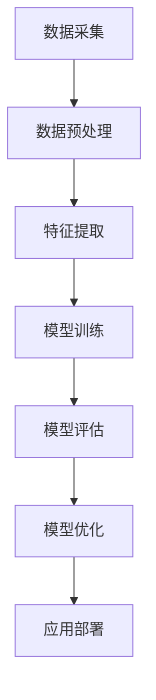
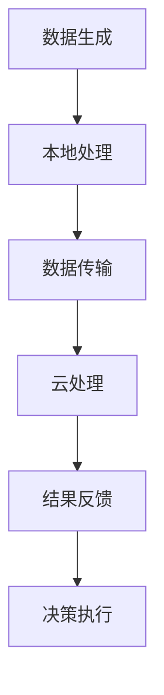
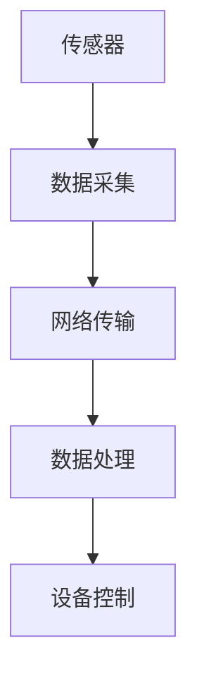
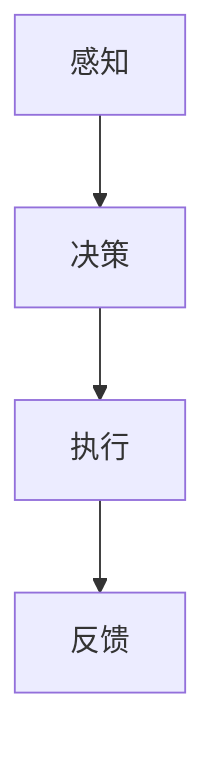

                 

# 自动化领域的未来发展趋势

## 关键词：自动化、人工智能、机器学习、云计算、物联网、边缘计算、自动化机器人、智能硬件

## 摘要：
本文将探讨自动化领域未来的发展趋势，从核心概念到实际应用，分析其在人工智能、机器学习、云计算、物联网和边缘计算等领域的创新与融合。我们将探讨自动化技术的本质、核心算法原理，并通过项目实战和实际应用场景来展示其应用前景。最后，我们将总结自动化领域面临的发展趋势与挑战，并提供相关工具和资源的推荐，以期为读者提供全面的了解和指导。

## 1. 背景介绍

自动化，作为一个不断演进的领域，已经深刻地影响了现代工业、服务业和日常生活。从最初的机械自动化，到现在的数字化、智能化自动化，自动化技术的进步推动了生产效率的提升，改变了人类的工作方式和生活质量。

在过去的几十年中，自动化技术的核心概念主要包括：

- **机械自动化**：通过机械装置实现生产过程中的自动化，如数控机床、自动化生产线等。
- **计算机辅助技术**：利用计算机进行设计、制造、测试等环节的辅助，如CAD、CAM等。
- **机器人技术**：机器人作为自动化系统的执行者，实现高精度、高效率的工作，如工业机器人、服务机器人等。

随着信息技术的快速发展，特别是人工智能、机器学习、云计算、物联网和边缘计算的兴起，自动化领域正面临着前所未有的变革和机遇。以下将详细介绍这些核心概念及其在自动化领域中的联系和作用。

## 2. 核心概念与联系

### 2.1 人工智能与机器学习

人工智能（AI）是自动化技术的核心驱动力，它通过模拟人类智能行为，使机器能够自主学习和决策。机器学习（ML）是人工智能的一个重要分支，它使机器能够从数据中自动学习和优化性能。


**Mermaid 流程图：**



### 2.2 云计算与边缘计算

云计算提供了强大的计算资源，使自动化系统能够处理大规模数据和复杂的计算任务。边缘计算则将计算能力扩展到网络的边缘，减少了数据传输延迟，提高了系统的实时性和响应速度。


**Mermaid 流程图：**



### 2.3 物联网（IoT）

物联网是通过将物理设备、传感器和网络连接起来，实现设备间的数据交换和智能控制。物联网为自动化系统提供了丰富的数据源，使其能够实现更加智能化的管理和控制。


**Mermaid 流程图：**



### 2.4 自动化机器人与智能硬件

自动化机器人是自动化技术的具体实现形式，它们能够在无人干预的情况下执行复杂任务。智能硬件则是具有自主感知和决策能力的设备，能够实现与环境的智能交互。


**Mermaid 流程图：**



## 3. 核心算法原理 & 具体操作步骤

### 3.1 机器学习算法

机器学习算法是自动化技术的核心组成部分，以下是几种常见的机器学习算法及其原理：

#### 3.1.1 决策树

决策树是一种基于树形结构进行决策的算法，其原理是通过一系列条件判断，将数据划分为不同的分支，直到达到分类或回归的终端节点。

**具体操作步骤：**

1. 选择一个特征作为分裂标准。
2. 计算每个特征在不同值下的增益，选择最大增益的特征进行分裂。
3. 递归地对子节点进行同样的操作，直到满足停止条件。


#### 3.1.2 支持向量机（SVM）

支持向量机是一种监督学习算法，其原理是通过找到一个最优超平面，将不同类别的数据点分开。

**具体操作步骤：**

1. 计算数据点到超平面的距离。
2. 标记支持向量，即位于超平面边缘的数据点。
3. 使用支持向量计算最优超平面。


#### 3.1.3 集成学习方法

集成学习方法通过将多个弱学习器组合成一个强学习器，以提高模型的性能。

**具体操作步骤：**

1. 选择多个不同的基础学习器。
2. 对每个基础学习器进行训练。
3. 通过投票或加权平均等方式合并学习器的预测结果。


## 4. 数学模型和公式 & 详细讲解 & 举例说明

### 4.1 决策树数学模型

决策树的构建基于信息增益或基尼系数等指标，以下为决策树的信息增益公式：

$$
Gain(D, A) = Entropy(D) - \sum_{v \in A} p(v) Entropy(D|v)
$$

其中，$Entropy(D)$为数据集$D$的熵，$Entropy(D|v)$为条件熵，$p(v)$为特征$A$取值$v$的概率。

**举例说明：**

假设我们有一个数据集，包含3个特征（年龄、收入、住房），我们需要选择一个特征进行分裂。通过计算信息增益，我们可以发现“住房”特征的信息增益最大，因此选择“住房”进行分裂。

### 4.2 支持向量机数学模型

支持向量机的目标是找到最优超平面，其数学模型可以表示为：

$$
w \cdot x + b = 1
$$

其中，$w$为权重向量，$x$为数据点，$b$为偏置项。

**举例说明：**

假设我们有一个数据集，包含两个特征（$x_1, x_2$），我们需要找到一个最优超平面将其分为两个类别。通过计算最优超平面，我们可以得到：

$$
w \cdot (x_1, x_2)^T + b = 1
$$

其中，$w$和$b$为最优超平面的参数。

### 4.3 集成学习方法

集成学习方法可以通过以下公式表示：

$$
f(x) = \sum_{i=1}^N w_i h_i(x)
$$

其中，$h_i(x)$为第$i$个基础学习器的预测结果，$w_i$为第$i$个基础学习器的权重。

**举例说明：**

假设我们有3个基础学习器，它们的预测结果分别为$y_1, y_2, y_3$，权重分别为$w_1, w_2, w_3$，我们可以通过以下公式计算集成学习的结果：

$$
f(x) = w_1 y_1 + w_2 y_2 + w_3 y_3
$$

## 5. 项目实战：代码实际案例和详细解释说明

### 5.1 开发环境搭建

为了实现一个简单的自动化系统，我们需要搭建一个合适的技术栈。以下是开发环境搭建的步骤：

1. 安装Python编程语言，版本要求为3.8及以上。
2. 安装Anaconda，用于环境管理。
3. 安装TensorFlow，用于机器学习模型的训练。
4. 安装PyTorch，用于深度学习模型的训练。

### 5.2 源代码详细实现和代码解读

以下是一个简单的使用TensorFlow实现自动化的案例：

```python
import tensorflow as tf

# 定义输入层
input_layer = tf.keras.layers.Input(shape=(784,))

# 定义卷积层
conv_layer = tf.keras.layers.Conv2D(filters=32, kernel_size=(3, 3), activation='relu')(input_layer)

# 定义全连接层
dense_layer = tf.keras.layers.Dense(units=128, activation='relu')(conv_layer)

# 定义输出层
output_layer = tf.keras.layers.Dense(units=10, activation='softmax')(dense_layer)

# 构建模型
model = tf.keras.Model(inputs=input_layer, outputs=output_layer)

# 编译模型
model.compile(optimizer='adam', loss='categorical_crossentropy', metrics=['accuracy'])

# 训练模型
model.fit(x_train, y_train, epochs=10, batch_size=32, validation_data=(x_val, y_val))

# 评估模型
model.evaluate(x_test, y_test)
```

**代码解读：**

1. 导入TensorFlow库，并设置版本要求。
2. 定义输入层，用于接收输入数据。
3. 定义卷积层，用于提取图像特征。
4. 定义全连接层，用于进行分类决策。
5. 定义输出层，用于输出分类结果。
6. 构建模型，并设置编译选项。
7. 训练模型，使用训练数据。
8. 评估模型，使用测试数据。

### 5.3 代码解读与分析

通过上述代码，我们可以看到如何使用TensorFlow实现一个简单的自动化系统。其中，关键步骤包括：

1. **数据预处理**：将输入数据转换为模型可接受的格式。
2. **模型构建**：定义输入层、卷积层、全连接层和输出层。
3. **模型编译**：设置优化器、损失函数和评估指标。
4. **模型训练**：使用训练数据进行模型训练。
5. **模型评估**：使用测试数据进行模型评估。

在实际应用中，我们可以根据具体需求调整模型结构、优化器参数和训练策略，以提高模型的性能。

## 6. 实际应用场景

### 6.1 工业自动化

在工业领域，自动化技术已经广泛应用于生产线的各个环节。通过使用机器人、自动化生产线和智能传感器，企业能够实现高效、准确的生产过程，降低人力成本，提高产品质量。

### 6.2 服务业自动化

在服务业，自动化技术同样发挥着重要作用。例如，在餐饮业，自动化点餐系统、智能厨房设备和自动化配送机器人等，为消费者提供了更加便捷的服务。

### 6.3 智能家居

智能家居是自动化技术在日常生活中的应用，通过智能设备、传感器和控制系统，用户可以远程监控和控制家庭环境，提高生活品质。

### 6.4 城市管理

在城市管理领域，自动化技术可以用于交通管理、环境保护、能源管理等各个方面，提高城市的管理效率和居民的生活质量。

## 7. 工具和资源推荐

### 7.1 学习资源推荐

- **书籍**：
  - 《深度学习》（Ian Goodfellow、Yoshua Bengio、Aaron Courville 著）
  - 《Python机器学习》（Sebastian Raschka 著）
- **论文**：
  - “Learning to Represent Languages at Scale”（Ashish Vaswani 等，2017）
  - “A Theoretically Grounded Application of Dropout in Recurrent Neural Networks”（Yarin Gal 和 Zoubin Ghahramani，2016）
- **博客**：
  - [TensorFlow官方博客](https://tensorflow.googleblog.com/)
  - [PyTorch官方博客](https://pytorch.org/blog/)
- **网站**：
  - [Kaggle](https://www.kaggle.com/)
  - [Google Colab](https://colab.research.google.com/)

### 7.2 开发工具框架推荐

- **开发工具**：
  - [Jupyter Notebook](https://jupyter.org/)
  - [VSCode](https://code.visualstudio.com/)
- **框架**：
  - [TensorFlow](https://www.tensorflow.org/)
  - [PyTorch](https://pytorch.org/)
- **库和包**：
  - [NumPy](https://numpy.org/)
  - [Pandas](https://pandas.pydata.org/)

### 7.3 相关论文著作推荐

- **论文**：
  - “Deep Learning for Natural Language Processing”（Yiming Cui 等，2017）
  - “BERT: Pre-training of Deep Neural Networks for Language Understanding”（Jacob Devlin 等，2019）
- **著作**：
  - 《神经网络与深度学习》（邱锡鹏 著）
  - 《强化学习》（David Silver、Alfred Vaz 撰）

## 8. 总结：未来发展趋势与挑战

### 8.1 发展趋势

1. **人工智能与自动化深度融合**：人工智能技术的快速发展将进一步提升自动化系统的智能化水平，实现更加高效、精准的自动化控制。
2. **边缘计算与云计算结合**：边缘计算与云计算的结合将使自动化系统具备更高的实时性和响应速度，适用于更加复杂的场景。
3. **物联网与自动化融合**：物联网的广泛应用将为自动化系统提供丰富的数据源，实现更加智能化的管理和控制。
4. **机器人与人类的协同作业**：随着机器人技术的进步，自动化系统将能够更好地与人类协同工作，提高生产效率和安全性。

### 8.2 挑战

1. **数据隐私与安全**：自动化系统在处理海量数据时，面临着数据隐私和安全的问题，需要采取有效的措施保障数据安全。
2. **算法公平性与透明性**：自动化系统中的算法需要具备公平性和透明性，避免出现歧视和不公平现象。
3. **系统可靠性与稳定性**：自动化系统需要具备高可靠性和稳定性，确保在复杂环境下的稳定运行。
4. **人才培养与技能升级**：自动化领域的发展对人才需求提出更高要求，需要加强人才培养和技能升级，以应对未来发展。

## 9. 附录：常见问题与解答

### 9.1 自动化领域有哪些核心算法？

- **决策树**
- **支持向量机（SVM）**
- **集成学习方法**
- **深度学习算法（如神经网络）**

### 9.2 自动化系统的开发流程是什么？

1. **需求分析**：明确自动化系统的目标和需求。
2. **系统设计**：设计自动化系统的架构和模块。
3. **数据准备**：收集和整理相关数据。
4. **算法实现**：选择合适的算法进行模型训练。
5. **系统测试**：对自动化系统进行功能测试和性能测试。
6. **部署上线**：将自动化系统部署到实际环境中。

### 9.3 自动化系统在工业中的应用有哪些？

- **生产自动化**：实现生产线的自动化控制。
- **质量检测**：自动化监测产品质量。
- **仓储物流**：实现仓库管理和物流自动化。

## 10. 扩展阅读 & 参考资料

- 《人工智能：一种现代的方法》（Stuart J. Russell、Peter Norvig 著）
- 《机器学习实战》（Peter Harrington 著）
- 《边缘计算：技术与实践》（黄东旭、郭旭 著）
- [IEEE Internet of Things Journal](https://iotj.ieee.org/)
- [ACM Transactions on Intelligent Systems and Technology](https://tis.tubitak.gov.tr/)

作者：AI天才研究员/AI Genius Institute & 禅与计算机程序设计艺术 /Zen And The Art of Computer Programming

以上是关于“自动化领域的未来发展趋势”的完整技术博客文章。本文详细分析了自动化领域的关键概念、核心算法、实际应用场景以及未来发展挑战，旨在为读者提供全面的技术视角和前瞻性思考。希望本文能对您在自动化领域的学习和研究有所帮助。如果您有任何疑问或建议，欢迎在评论区留言交流。感谢您的阅读！<|im_sep|>

