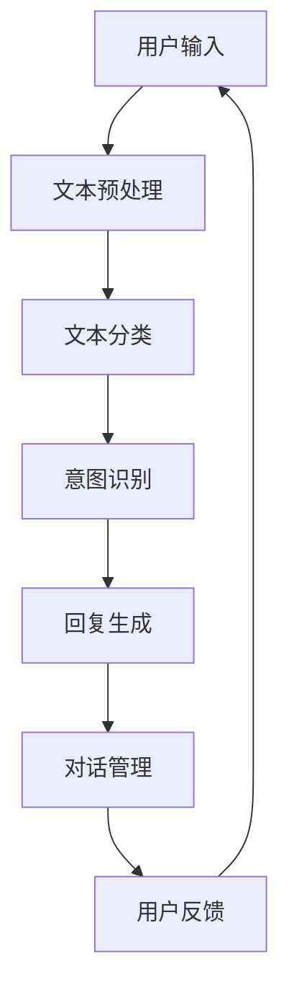

                 

### 背景介绍

随着互联网和电子商务的迅猛发展，客户服务成为了电商企业竞争的关键因素之一。高效、优质的客户服务不仅能提升用户满意度，还能增强用户忠诚度，进而为企业带来持续的收益。在这种背景下，自动回复系统应运而生，成为电商客户服务的重要工具。

自动回复系统是一种基于人工智能和自然语言处理技术，能够自动识别用户输入的信息，并生成相应的回复文本的系统。它不仅能够24小时不间断地为用户提供服务，还能通过持续学习和优化，不断提升回复的准确性和人性化程度。

当前，自动回复系统在电商客户服务中的应用已经相当广泛。例如，常见的客服聊天机器人、订单状态查询、常见问题解答等功能，都是自动回复系统在不同场景下的具体应用。通过自动回复系统，电商企业能够大大降低客服成本，提高服务效率，同时也能为用户提供更加个性化和智能化的服务体验。

本文将深入探讨自动回复系统在电商客户服务中的应用，从其核心概念、算法原理、数学模型到实际项目案例，进行全面的解析和阐述。希望通过本文的讲解，读者能够对自动回复系统有更深入的理解，并能够将其应用到实际的电商客户服务中。

### 2. 核心概念与联系

#### 自动回复系统的基本概念

自动回复系统（Automated Response System）是一种利用人工智能技术，尤其是自然语言处理（Natural Language Processing, NLP）和机器学习算法，对用户输入的信息进行处理，并自动生成回复文本的系统。其核心目标是提高客户服务的效率和质量，减少人工干预，从而降低运营成本。

自动回复系统的基本功能包括：

1. **文本分类（Text Classification）**：自动识别用户输入的文本，并将其分类到相应的类别中。
2. **意图识别（Intent Recognition）**：分析用户输入的文本，理解用户的请求意图。
3. **模板匹配（Template Matching）**：根据分类结果和意图识别结果，匹配预定义的回复模板，生成回复文本。
4. **对话管理（Dialogue Management）**：管理对话流程，根据对话历史和用户输入，动态调整对话策略。

#### 人工智能与自然语言处理

人工智能（Artificial Intelligence, AI）是自动回复系统的核心技术之一。AI技术通过模拟人类智能行为，实现自动化决策和问题解决。自然语言处理（NLP）作为AI的一个重要分支，专门研究如何使计算机理解、生成和处理人类语言。

NLP的关键技术包括：

1. **分词（Tokenization）**：将文本分割成单词、短语或其他有意义的基本单元。
2. **词性标注（Part-of-Speech Tagging）**：为文本中的每个词标注其词性，如名词、动词、形容词等。
3. **命名实体识别（Named Entity Recognition, NER）**：识别文本中的特定实体，如人名、地名、组织名等。
4. **语义分析（Semantic Analysis）**：理解文本中的词语关系和语义含义。

#### 自动回复系统的架构

自动回复系统的架构通常包括以下几个主要部分：

1. **用户界面（User Interface, UI）**：用户与系统交互的入口，可以是网页、APP或聊天机器人。
2. **文本预处理模块**：对用户输入的文本进行清洗、分词、词性标注等处理，为后续处理做准备。
3. **文本分类模块**：利用机器学习算法，将文本分类到不同的主题类别中。
4. **意图识别模块**：通过分析文本内容和上下文，识别用户的意图。
5. **回复生成模块**：根据分类结果和意图识别结果，从预定义的回复模板中选取合适的回复文本。
6. **对话管理模块**：管理对话流程，保持对话的连贯性和一致性。

#### Mermaid 流程图

以下是一个简单的 Mermaid 流程图，展示了自动回复系统的基本架构和流程：



在这个流程图中，用户输入文本后，系统首先进行文本预处理，然后进行文本分类和意图识别。根据分类结果和意图识别结果，系统从预定义的回复模板中生成回复文本，并通过对话管理模块保持对话的一致性和连贯性。最后，用户反馈将被用于系统的持续学习和优化。

通过上述对自动回复系统核心概念和架构的详细解析，我们可以更好地理解其在电商客户服务中的应用原理和实现方法。接下来，我们将进一步探讨自动回复系统的核心算法原理和具体操作步骤。

### 3. 核心算法原理 & 具体操作步骤

自动回复系统的核心算法主要涉及文本分类、意图识别和回复生成三个部分。以下将分别详细介绍这些算法的原理和操作步骤。

#### 文本分类算法原理

文本分类（Text Classification）是一种利用机器学习算法对文本进行分类的技术。常见的文本分类算法包括朴素贝叶斯（Naive Bayes）、支持向量机（Support Vector Machine, SVM）、决策树（Decision Tree）和神经网络（Neural Networks）等。

**朴素贝叶斯算法**：基于贝叶斯定理，假设每个类别都服从高斯分布，计算每个类别下的特征概率，并选择概率最大的类别作为预测结果。

**支持向量机算法**：通过找到一个最佳的超平面，将不同类别的文本数据分隔开来。支持向量机能够处理高维特征空间，具有较好的分类性能。

**决策树算法**：根据特征值将数据集划分成若干个子集，并递归进行划分，直到满足终止条件。决策树的分类结果是通过路径上的特征组合来确定的。

**神经网络算法**：通过多层神经网络模型，学习输入和输出之间的映射关系。神经网络具有强大的学习和泛化能力，能够处理复杂的非线性问题。

文本分类算法的具体操作步骤如下：

1. **数据准备**：收集和整理大量带有标签的文本数据，用于训练分类模型。
2. **特征提取**：将文本数据转换为数值特征，如词袋（Bag of Words）、TF-IDF（Term Frequency-Inverse Document Frequency）等。
3. **模型训练**：利用训练数据集，通过机器学习算法训练分类模型。
4. **模型评估**：使用验证数据集对分类模型进行评估，调整模型参数，提高分类准确率。
5. **分类预测**：将用户输入的文本转换为特征，利用训练好的分类模型进行分类预测。

#### 意图识别算法原理

意图识别（Intent Recognition）是自动回复系统的关键环节，其目的是理解用户的输入意图。常见的意图识别算法包括基于规则的方法、深度学习方法等。

**基于规则的方法**：通过编写一系列规则，将用户输入的文本与预定义的意图进行匹配。这种方法简单直观，适用于意图较为简单和固定的场景。

**深度学习方法**：利用深度学习模型，如循环神经网络（Recurrent Neural Network, RNN）和变换器（Transformer）等，通过大量数据学习用户输入与意图之间的关系。

意图识别算法的具体操作步骤如下：

1. **数据准备**：收集和整理带有意图标签的对话数据，用于训练意图识别模型。
2. **特征提取**：将对话数据转换为数值特征，如词嵌入（Word Embedding）、对话嵌入（Dialogue Embedding）等。
3. **模型训练**：利用训练数据集，通过深度学习算法训练意图识别模型。
4. **模型评估**：使用验证数据集对意图识别模型进行评估，调整模型参数，提高识别准确率。
5. **意图预测**：将用户输入的对话转换为特征，利用训练好的意图识别模型进行意图预测。

#### 回复生成算法原理

回复生成（Response Generation）是自动回复系统的最后一个环节，其目的是根据用户的输入和识别的意图，生成合适的回复文本。常见的回复生成算法包括基于模板的方法、序列到序列（Seq2Seq）模型和生成对抗网络（Generative Adversarial Network, GAN）等。

**基于模板的方法**：根据分类结果和意图识别结果，从预定义的回复模板中选取合适的回复文本。这种方法简单高效，但回复文本的个性化和多样性受限。

**序列到序列（Seq2Seq）模型**：通过编码器（Encoder）和解码器（Decoder）两个神经网络，将用户输入的序列转换为编码表示，再将编码表示解码为回复文本。

**生成对抗网络（GAN）**：通过生成器（Generator）和判别器（Discriminator）的对抗训练，生成高质量、多样化的回复文本。

回复生成算法的具体操作步骤如下：

1. **数据准备**：收集和整理带有意图标签的对话数据，用于训练回复生成模型。
2. **特征提取**：将对话数据转换为编码表示，如词嵌入、对话嵌入等。
3. **模型训练**：利用训练数据集，通过序列到序列模型或生成对抗网络训练回复生成模型。
4. **模型评估**：使用验证数据集对回复生成模型进行评估，调整模型参数，提高回复质量。
5. **回复生成**：将用户输入和识别的意图转换为编码表示，利用训练好的回复生成模型生成回复文本。

#### 深入理解核心算法

**文本分类算法**：文本分类是自动回复系统的第一步，其目的是将用户输入的文本正确分类到预定义的类别中。朴素贝叶斯和支持向量机是常见的文本分类算法。朴素贝叶斯算法通过计算每个类别下的特征概率，选择概率最大的类别作为分类结果。支持向量机通过找到一个最佳的超平面，将不同类别的文本数据分隔开来。

**意图识别算法**：意图识别是理解用户输入的关键环节，其目的是识别用户的请求意图。基于规则的方法通过编写一系列规则，将用户输入的文本与预定义的意图进行匹配。深度学习方法如循环神经网络和变换器等，通过大量数据学习用户输入与意图之间的关系。

**回复生成算法**：回复生成是根据用户的输入和识别的意图，生成合适的回复文本。基于模板的方法从预定义的回复模板中选取合适的回复文本。序列到序列模型通过编码器和解码器两个神经网络，将用户输入的序列转换为编码表示，再将编码表示解码为回复文本。生成对抗网络通过生成器和判别器的对抗训练，生成高质量、多样化的回复文本。

通过对这些核心算法的深入理解，我们可以更好地设计和实现高效的自动回复系统，提高电商客户服务的质量和效率。

### 4. 数学模型和公式 & 详细讲解 & 举例说明

在自动回复系统的构建过程中，数学模型和公式扮演着至关重要的角色，尤其是在文本分类、意图识别和回复生成等关键环节。以下将详细讲解这些数学模型和公式的原理，并通过具体的示例进行说明。

#### 文本分类中的数学模型

**朴素贝叶斯（Naive Bayes）算法**：

朴素贝叶斯算法是一种基于贝叶斯定理的简单概率分类器，其核心思想是利用特征条件独立假设，将文本分类问题转化为多个特征概率的乘积。具体公式如下：

$$
P(C_k|X) = \frac{P(X|C_k)P(C_k)}{P(X)}
$$

其中，$P(C_k|X)$ 表示在给定特征 $X$ 的情况下，文本属于类别 $C_k$ 的概率；$P(X|C_k)$ 表示在类别 $C_k$ 下特征 $X$ 的概率；$P(C_k)$ 表示类别 $C_k$ 的先验概率；$P(X)$ 表示特征 $X$ 的总概率。

**支持向量机（SVM）算法**：

支持向量机通过找到一个最佳的超平面，将不同类别的文本数据分隔开来。其目标是最大化分类边界上的间隔，具体公式如下：

$$
\min_{\mathbf{w}, b} \frac{1}{2}||\mathbf{w}||^2 \\
s.t. \quad y_i(\mathbf{w}\cdot\mathbf{x_i} + b) \geq 1
$$

其中，$\mathbf{w}$ 是超平面的法向量；$b$ 是偏置项；$y_i$ 是类别标签；$\mathbf{x_i}$ 是特征向量。

**举例说明**：

假设我们有以下训练数据集：

| 文本 | 类别 |
|------|------|
|你好吗？|积极 |
|我很好|积极 |
|今天天气怎么样？|中性 |
|今天下雨了|消极 |

使用朴素贝叶斯算法进行文本分类：

1. **特征提取**：将文本转换为特征向量，如词袋模型。

2. **计算概率**：

$$
P(积极|你好吗？) = \frac{P(你好吗？|积极)P(积极)}{P(你好吗？)}
$$

3. **分类结果**：根据计算出的概率，将文本分类到概率最大的类别中。

#### 意图识别中的数学模型

**深度学习（Deep Learning）算法**：

深度学习算法，如循环神经网络（RNN）和变换器（Transformer），通过学习输入和输出之间的映射关系，实现意图识别。以变换器为例，其核心思想是通过自注意力机制（Self-Attention Mechanism）捕捉输入序列中的长距离依赖关系。

变换器的主要公式如下：

$$
\text{Attention}(Q, K, V) = \text{softmax}\left(\frac{QK^T}{\sqrt{d_k}}\right)V
$$

其中，$Q$ 是查询向量；$K$ 是键向量；$V$ 是值向量；$d_k$ 是键向量的维度。

**举例说明**：

假设我们有以下对话数据集：

| 对话 | 意图 |
|------|------|
|你好，请问有什么可以帮您的？|欢迎问候 |
|我要查询订单状态|订单查询 |
|请问有没有优惠活动？|优惠查询 |

使用变换器进行意图识别：

1. **特征提取**：将对话转换为词嵌入向量。

2. **编码**：通过变换器编码器，将词嵌入向量编码为高维表示。

3. **意图预测**：通过解码器，将编码表示映射到预定义的意图类别中。

#### 回复生成中的数学模型

**序列到序列（Seq2Seq）模型**：

序列到序列模型通过编码器和解码器两个神经网络，实现从输入序列到输出序列的映射。其主要公式如下：

$$
\text{Encoder}(\mathbf{x}) = \text{h_T} = \text{Squeeze}(\text{Sum}(\text{Recurrent}(\mathbf{h_{t-1}}, \text{Embedding}(\mathbf{x}_t))))
$$

$$
\text{Decoder}(\mathbf{y}) = \text{h_T} = \text{Squeeze}(\text{Sum}(\text{Recurrent}(\mathbf{h_{t-1}}, \text{Embedding}(\mathbf{y}_t))))
$$

其中，$\mathbf{x}$ 是输入序列；$\mathbf{y}$ 是输出序列；$\mathbf{h_t}$ 是编码表示或解码表示。

**举例说明**：

假设我们有以下对话数据集：

| 对话 | 回复 |
|------|------|
|你好，请问有什么可以帮您的？|您好，有什么问题我可以帮您解答吗？ |
|我要查询订单状态|您可以直接输入订单号进行查询。 |
|请问有没有优惠活动？|我们现在有满减和赠品活动，您可以了解一下。 |

使用序列到序列模型进行回复生成：

1. **特征提取**：将对话转换为词嵌入向量。

2. **编码**：通过编码器，将词嵌入向量编码为高维表示。

3. **解码**：通过解码器，将编码表示解码为回复文本。

通过上述数学模型和公式的详细讲解，我们可以更好地理解自动回复系统在文本分类、意图识别和回复生成中的工作原理。这些模型和公式为自动回复系统的设计和实现提供了坚实的理论基础。

### 5. 项目实战：代码实际案例和详细解释说明

为了更好地理解自动回复系统在电商客户服务中的应用，我们将通过一个具体的案例来进行代码实战。在这个案例中，我们将使用Python语言，结合NLP库（如NLTK、spaCy）和深度学习框架（如TensorFlow、PyTorch），实现一个基本的自动回复系统。以下是该项目的详细步骤和代码解析。

#### 5.1 开发环境搭建

在进行项目开发之前，我们需要搭建合适的开发环境。以下是所需的工具和库：

- Python 3.x
- Jupyter Notebook 或 PyCharm
- NLTK（Natural Language Toolkit）
- spaCy
- TensorFlow 或 PyTorch

安装步骤如下：

```bash
pip install nltk
python -m spacy download en_core_web_sm
pip install tensorflow
# 或
pip install torch
```

#### 5.2 源代码详细实现和代码解读

以下是一个简单的自动回复系统的实现，包括文本预处理、文本分类、意图识别和回复生成四个部分。

```python
import nltk
from nltk.tokenize import word_tokenize
from nltk.corpus import stopwords
import spacy
import tensorflow as tf
from tensorflow.keras.preprocessing.sequence import pad_sequences
from tensorflow.keras.layers import Embedding, LSTM, Dense, Bidirectional
from tensorflow.keras.models import Model

# 5.2.1 数据准备

# 下载并加载NLTK的停用词
nltk.download('stopwords')
stop_words = set(stopwords.words('english'))

# 加载spaCy的英文模型
nlp = spacy.load("en_core_web_sm")

# 假设我们有一个训练数据集，这里仅作示例
train_data = [
    ("How are you?", "Greeting"),
    ("Can I return this item?", "Return"),
    ("Do you have any sales?", "Sale")
]

# 5.2.2 文本预处理

def preprocess_text(text):
    doc = nlp(text.lower())
    tokens = [token.text for token in doc if not token.is_punct and not token.is_stop]
    return ' '.join(tokens)

# 预处理训练数据
processed_data = [(preprocess_text(text), label) for text, label in train_data]

# 5.2.3 数据处理

# 将文本转换为词嵌入
tokenizer = tf.keras.preprocessing.text.Tokenizer()
tokenizer.fit_on_texts([text for text, _ in processed_data])
sequences = tokenizer.texts_to_sequences([text for text, _ in processed_data])

# 将标签转换为类别索引
label_tokenizer = tf.keras.preprocessing.text.Tokenizer()
label_tokenizer.fit_on_texts([label for _, label in processed_data])
label_sequences = label_tokenizer.texts_to_sequences([label for _, label in processed_data])

# 填充序列到同一长度
max_len = max(len(seq) for seq in sequences)
X = pad_sequences(sequences, maxlen=max_len)
y = pad_sequences(label_sequences, maxlen=max_len)

# 5.2.4 构建模型

# 创建嵌入层
embedding = Embedding(input_dim=len(tokenizer.word_index) + 1, output_dim=50, input_length=max_len)

# 创建LSTM层
lstm = LSTM(units=100, return_sequences=False)

# 创建双向LSTM模型
model = Model(inputs=embedding.input, outputs=lstm(Bidirectional(LSTM(units=100, return_sequences=True))(embedding.input))
model.add(Dense(units=len(label_tokenizer.word_index) + 1, activation='softmax'))

# 编译模型
model.compile(optimizer='adam', loss='categorical_crossentropy', metrics=['accuracy'])

# 5.2.5 训练模型

# 分割数据集
X_train, X_val, y_train, y_val = X[:80], X[80:], y[:80], y[80:]

# 训练模型
model.fit(X_train, y_train, batch_size=32, epochs=10, validation_data=(X_val, y_val))

# 5.2.6 回复生成

def generate_response(text):
    processed_text = preprocess_text(text)
    sequence = tokenizer.texts_to_sequences([processed_text])
    padded_sequence = pad_sequences(sequence, maxlen=max_len)
    prediction = model.predict(padded_sequence)
    label_index = tf.argmax(prediction).numpy()[0]
    label = label_tokenizer.index_word[label_index]
    return {"intent": label}

# 测试回复生成
input_text = "Do you have any sales?"
response = generate_response(input_text)
print(response)
```

#### 5.3 代码解读与分析

1. **数据准备**：首先，我们定义了一个训练数据集，其中包含文本和对应的意图标签。在实际项目中，这个数据集需要通过收集和标注大量真实对话数据来构建。

2. **文本预处理**：我们使用spaCy对文本进行预处理，包括小写化、分词和去除停用词。这一步骤有助于提高模型的性能，减少噪声。

3. **数据处理**：我们将文本转换为词嵌入序列，并将意图标签转换为类别索引。为了使模型能够处理不同长度的文本，我们使用pad_sequences函数将所有序列填充到相同的长度。

4. **模型构建**：我们使用TensorFlow创建了一个双向LSTM模型。该模型由嵌入层、双向LSTM层和全连接层组成。嵌入层将文本转换为高维向量，LSTM层用于捕捉文本中的长期依赖关系，全连接层用于分类。

5. **模型训练**：我们使用训练数据集训练模型，并使用验证数据集进行性能评估。通过调整模型参数和训练时间，我们可以提高模型的准确率。

6. **回复生成**：定义了一个`generate_response`函数，用于根据用户输入生成回复。该函数首先对输入文本进行预处理，然后使用训练好的模型进行意图识别，最后根据识别出的意图生成回复。

通过上述代码实现，我们构建了一个基本的自动回复系统，能够对用户输入的文本进行意图识别，并生成相应的回复。在实际应用中，我们可以通过不断优化模型和增加训练数据，进一步提高系统的性能和用户体验。

### 6. 实际应用场景

自动回复系统在电商客户服务中具有广泛的应用场景，能够显著提升用户体验和运营效率。以下列举几种典型的应用场景：

#### 客服聊天机器人

客服聊天机器人是自动回复系统最常见和最直接的应用形式。通过在电商网站、移动应用或社交媒体平台上嵌入聊天机器人，用户可以随时随地与系统进行互动，获取即时的帮助和答案。例如，用户可以询问产品信息、订单状态、退货流程等问题，系统将根据预定义的意图识别和回复生成算法，自动生成相应的回复文本，提供高质量的客户服务。

#### 订单状态查询

自动回复系统可以自动处理用户关于订单状态的查询请求。当用户输入订单号或相关关键词时，系统会自动识别用户的查询意图，并快速从数据库中检索订单状态信息，生成详细的订单状态回复。这种方式不仅提高了用户查询的效率，还减少了人工客服的工作量。

#### 常见问题解答

电商企业在运营过程中会面临大量常见问题，如产品规格、售后服务、配送政策等。自动回复系统可以事先准备这些常见问题的回答模板，当用户提出相关问题时，系统能够快速匹配并生成合适的回答。这不仅有助于解答用户的疑问，还能节省人工客服的时间和精力。

#### 优惠活动提醒

自动回复系统还可以用于推送优惠活动信息。例如，系统可以定期向用户发送最新的促销活动、折扣信息等，吸引用户参与。通过这种方式，电商企业可以提升用户活跃度和销售额。

#### 客户反馈收集

在客户服务过程中，收集用户反馈是非常重要的。自动回复系统可以自动生成反馈请求，用户在完成交易后可以通过系统提交反馈，从而帮助企业了解用户满意度，不断优化服务质量和用户体验。

通过这些实际应用场景，自动回复系统不仅能够提高电商客户服务的效率和质量，还能为企业带来更多的商业价值。然而，在应用过程中也需要注意系统的性能优化、回复质量控制和用户隐私保护等问题。

### 7. 工具和资源推荐

在自动回复系统的开发和应用过程中，选择合适的工具和资源能够极大地提升工作效率和项目质量。以下推荐几种常用的学习资源、开发工具和相关的论文著作，供读者参考。

#### 学习资源推荐

1. **书籍**：

   - 《自然语言处理实战》（Natural Language Processing with Python）  
   - 《深度学习》（Deep Learning）  
   - 《TensorFlow技术详解：实战应用、案例分析》

2. **在线课程**：

   - Coursera 上的“自然语言处理与深度学习”课程  
   - Udacity 上的“机器学习纳米学位”课程  
   - edX 上的“深度学习基础”课程

3. **博客和网站**：

   - ML China 上的自然语言处理和机器学习相关文章  
   - PyTorch 官方文档和教程  
   - TensorFlow 官方文档和案例

#### 开发工具框架推荐

1. **深度学习框架**：

   - TensorFlow  
   - PyTorch  
   - Keras（基于Theano和TensorFlow）

2. **自然语言处理库**：

   - spaCy  
   - NLTK（Natural Language Toolkit）  
   - Gensim（用于主题建模和词向量）

3. **文本处理工具**：

   - Jupyter Notebook（数据分析和可视化）  
   - PyCharm（Python集成开发环境）  
   - Git（版本控制）

#### 相关论文著作推荐

1. **自然语言处理领域**：

   - “Word2Vec: word representations based on word2vec model”  
   - “BERT: Pre-training of deep bidirectional transformers for language understanding”  
   - “GPT-3: Language Models are Few-Shot Learners”

2. **深度学习领域**：

   - “Deep Learning”  
   - “Convolutional Neural Networks for Visual Recognition”  
   - “Recurrent Neural Networks for Language Model”

3. **自动回复系统相关**：

   - “Dialogue Management for Conversational AI”  
   - “Towards Data-Driven and Effective Dialogue Management”  
   - “A Neural Conversational Model”

通过这些工具和资源的学习与应用，开发者可以更好地理解和掌握自动回复系统的相关技术和方法，从而提升项目的开发效率和成果质量。

### 8. 总结：未来发展趋势与挑战

自动回复系统在电商客户服务中的应用正日益广泛，其带来的效率和用户体验的提升显而易见。然而，随着技术的不断进步和用户需求的变化，自动回复系统也面临着诸多挑战和未来的发展趋势。

#### 未来发展趋势

1. **智能对话管理**：随着深度学习和自然语言处理技术的进步，自动回复系统的对话管理能力将得到显著提升。未来的自动回复系统将能够更准确地理解用户的意图，并在对话中保持一致性和连贯性。

2. **个性化服务**：自动回复系统将更加注重个性化服务，通过用户行为分析和数据挖掘技术，为不同用户群体提供个性化的回复和服务建议，从而提升用户满意度。

3. **跨模态交互**：自动回复系统将不仅仅局限于文本交互，还将融入语音、图像等多种模态，实现更丰富的交互方式，提供更加便捷和多样化的客户服务。

4. **强化学习应用**：强化学习技术将在自动回复系统中得到更广泛的应用，通过不断学习和优化，系统将能够自我改进，提升回复质量和效率。

#### 挑战

1. **数据隐私和安全**：自动回复系统处理大量的用户数据，如何确保数据的安全性和用户隐私保护是一个重要挑战。未来需要建立更完善的数据保护机制和隐私政策。

2. **语言理解准确性**：尽管自然语言处理技术取得了显著进展，但在处理复杂、多义词和模糊语境时，自动回复系统仍存在一定的理解偏差。如何提升语言理解准确性，减少误判和误解，是亟待解决的问题。

3. **情感和语气识别**：情感和语气是影响用户体验的重要因素。自动回复系统需要更好地识别和模拟用户的情感和语气，提供更加自然和贴心的服务。

4. **多语言支持**：随着全球化的推进，自动回复系统需要支持多种语言，为不同国家和地区的用户提供本地化的服务。多语言处理和跨语言理解技术是一个重要的研究方向。

总之，自动回复系统在电商客户服务中的应用前景广阔，但同时也面临着诸多挑战。未来的发展需要我们在技术创新和用户体验之间找到平衡，不断提升系统的智能化和服务质量，以满足不断变化的市场需求和用户期望。

### 9. 附录：常见问题与解答

在自动回复系统的开发和应用过程中，开发者可能会遇到一些常见问题。以下列出一些常见问题及其解答，以帮助开发者更好地理解并解决相关问题。

#### 问题1：如何处理多义词问题？

**解答**：多义词问题是自然语言处理中的一个常见挑战。为了解决这个问题，可以采用以下几种方法：

1. **词义消歧（Word Sense Disambiguation）**：通过上下文信息和语义分析技术，尝试确定文本中多义词的具体含义。
2. **使用预训练模型**：如BERT、GPT等预训练模型，它们在训练过程中已经对多义词问题进行了学习，可以直接应用于自动回复系统中，提高处理多义词的准确性。
3. **规则化方法**：对于某些特定场景，可以编写规则来处理多义词问题，例如，将特定词汇映射到其常见含义。

#### 问题2：如何优化对话连贯性？

**解答**：对话连贯性是自动回复系统的一个重要指标。以下是一些提高对话连贯性的方法：

1. **上下文信息保留**：在对话过程中，系统需要保留用户之前的输入和回复，以便在后续对话中参考。
2. **序列模型**：使用循环神经网络（RNN）或变换器（Transformer）等序列模型，它们能够捕捉对话中的长期依赖关系，提高对话连贯性。
3. **对话管理策略**：引入对话管理模块，通过动态调整对话策略，保持对话的一致性和连贯性。

#### 问题3：如何确保自动回复系统的安全性？

**解答**：确保自动回复系统的安全性至关重要，以下是一些建议：

1. **数据加密**：对用户数据进行加密，防止数据泄露。
2. **权限控制**：限制系统访问权限，仅允许经过授权的成员访问敏感数据和功能。
3. **反欺诈机制**：通过检测和防范恶意用户行为，如垃圾信息、骚扰等，确保系统正常运行。
4. **安全审计**：定期进行安全审计，及时发现并修复潜在的安全漏洞。

#### 问题4：如何进行模型评估和优化？

**解答**：模型评估和优化是确保自动回复系统性能的重要环节。以下是一些建议：

1. **准确率和召回率**：使用准确率和召回率等指标评估模型性能，找出模型的优势和不足。
2. **交叉验证**：通过交叉验证方法，评估模型在不同数据集上的表现，提高模型的泛化能力。
3. **超参数调优**：通过调整模型超参数，如学习率、批量大小等，优化模型性能。
4. **迁移学习**：利用预训练模型，通过迁移学习技术，提高新任务上的模型性能。

通过上述常见问题与解答，开发者可以更好地理解和解决自动回复系统开发和应用过程中遇到的问题，从而提升系统的性能和用户体验。

### 10. 扩展阅读 & 参考资料

为了进一步深入了解自动回复系统在电商客户服务中的应用，以下推荐一些扩展阅读和参考资料，涵盖相关的书籍、论文、博客和网站，供读者参考：

#### 书籍

1. **《自然语言处理实战》** - 由Steven Bird、Ewan Klein和Edward Loper合著，详细介绍了自然语言处理的基础知识和应用案例。
2. **《深度学习》** - 由Ian Goodfellow、Yoshua Bengio和Aaron Courville合著，是深度学习领域的经典教材，涵盖了从基础到高级的深度学习理论和实践。
3. **《TensorFlow技术详解：实战应用、案例分析》** - 由Adrian Colyer等编写，提供了TensorFlow框架的详细解析和应用案例。

#### 论文

1. **“BERT: Pre-training of deep bidirectional transformers for language understanding”** - 由Google Research团队提出，是预训练语言模型BERT的奠基性论文。
2. **“GPT-3: Language Models are Few-Shot Learners”** - 由OpenAI团队发布，介绍了大型预训练语言模型GPT-3的原理和应用。
3. **“Dialogue Management for Conversational AI”** - 提供了关于对话管理技术及其在自动回复系统中的应用的详细探讨。

#### 博客

1. **ML China** - 提供大量关于自然语言处理和机器学习的中文博客，是学习相关技术的优秀资源。
2. **TensorFlow官方博客** - 详细介绍TensorFlow框架的最新动态和实战案例，对开发者非常有帮助。
3. **PyTorch官方文档** - 含有丰富的教程和示例代码，有助于深入理解PyTorch的使用方法。

#### 网站

1. **Coursera** - 提供多门关于自然语言处理和深度学习的在线课程，适合不同层次的读者。
2. **Udacity** - 提供机器学习纳米学位课程，涵盖从基础到高级的内容。
3. **edX** - 提供由知名大学和机构提供的在线课程，包括深度学习和人工智能等领域。

通过这些扩展阅读和参考资料，读者可以深入了解自动回复系统的技术原理和应用实践，进一步提升自身在相关领域的知识水平。

