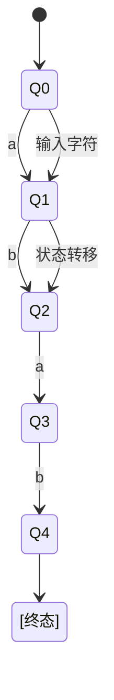

                 

# 自动机研究：出版背景与重要性

> 关键词：自动机、出版背景、技术发展、计算机科学、理论架构

> 摘要：本文探讨了自动机研究的出版背景，阐述了自动机理论在计算机科学中的重要性，分析了自动机研究的现状与未来发展趋势，为读者提供了全面而深入的洞察。

在计算机科学的发展历程中，自动机理论占据着重要地位。自动机作为计算模型的核心，不仅为我们理解计算机的工作原理提供了基础，而且在实际应用中具有重要的指导意义。本文将围绕自动机研究的出版背景，分析其重要性，探讨现有研究的进展，并展望未来发展的趋势。

## 1. 背景介绍

自动机（Automata）理论起源于20世纪初，由数学家、逻辑学家和计算机科学家共同发展而来。最初，自动机的研究主要集中在数学和逻辑领域，用于解决逻辑问题、证明定理和形式化理论。随着计算机科学的兴起，自动机理论逐渐成为计算机科学中不可或缺的一部分。

自动机的定义可以追溯到图灵机（Turing Machine），这是由艾伦·图灵（Alan Turing）在1936年提出的一种抽象计算模型。图灵机通过一个无限长的纸带，按照预设的规则进行读写操作，从而实现复杂的计算过程。图灵机的提出不仅奠定了自动机理论的基础，而且成为现代计算机的雏形。

随着计算机科学的发展，自动机理论逐渐拓展到更广泛的领域。1956年，约翰·麦克卡锡（John McCarthy）提出了计算理论中的“自动机”一词，以泛指任何能够执行计算任务的抽象机器。这一概念的应用范围进一步扩大，涵盖了有限自动机（Finite Automata）、推算机（Pushdown Automata）、图灵机等不同类型的计算模型。

自动机理论的研究不仅为计算机科学提供了理论支持，而且在其他领域也具有重要的应用价值。例如，自动机理论在自然语言处理、编译原理、网络协议设计等方面有着广泛的应用。自动机模型能够帮助我们理解和解决复杂的计算问题，提高计算机性能和效率。

## 2. 核心概念与联系

为了更好地理解自动机理论，我们需要介绍几个核心概念，包括有限自动机、推算机、图灵机等。这些概念之间有着密切的联系，共同构成了自动机理论的基本框架。

### 2.1 有限自动机（Finite Automata）

有限自动机是最简单的自动机模型，由有限个状态、有限个输入字母和一个初始状态组成。根据状态转移函数，有限自动机能够在输入字符串的作用下从一个状态转移到另一个状态。当有限自动机达到一个终态时，表明输入字符串被接受。

有限自动机的Mermaid流程图如下：


### 2.2 推算机（Pushdown Automata）

推算机是有限自动机的一个扩展，引入了堆栈（stack）的概念，可以处理更复杂的语言。推算机由有限个状态、有限个输入字母、有限个栈符号和一个初始状态组成。在状态转移过程中，推算机不仅能够读取输入字母，还能进行栈操作。

推算机的Mermaid流程图如下：

```mermaid
stateDiagram
  [*] --> Q0
  Q0 --> Q1 : a
  Q1 --> Q2 : b
  Q2 --> Q3 : a
  Q3 --> Q4 : b
  Q4 --> [终态]
  Q0 --> {Q1, Q2} : 输入字符
  Q1 --> Q2 : 栈符号操作
```

### 2.3 图灵机（Turing Machine）

图灵机是最复杂的自动机模型，能够模拟任何计算过程。图灵机由一个无限长的纸带、读写头、有限个状态和一组转换规则组成。在计算过程中，图灵机通过读写头在纸带上进行读写操作，并根据当前状态和输入符号进行状态转移。

图灵机的Mermaid流程图如下：



这些自动机模型之间的联系在于它们都是计算模型，可以用来处理不同类型的语言。有限自动机能够处理有限状态的语言，推算机可以处理更复杂的语言，而图灵机则能够模拟任何计算过程。

## 3. 核心算法原理 & 具体操作步骤

自动机理论的核心算法包括有限自动机的构造、推算机的构造和图灵机的模拟。下面我们将分别介绍这些算法的原理和具体操作步骤。

### 3.1 有限自动机的构造

构造有限自动机的方法包括状态转换表法、状态转换图法和状态转换矩阵法。下面以状态转换表法为例，介绍有限自动机的构造过程。

#### 3.1.1 状态转换表法

1. 确定有限自动机的状态集合：首先确定有限自动机的所有状态，包括初始状态和终态。
2. 确定输入字母集合：确定有限自动机能够接收的输入字母集合。
3. 构造状态转换表：根据输入字母和当前状态，构造状态转换表。状态转换表中的每一行表示一个状态，每一列表示一个输入字母，单元格中的值表示下一个状态。
4. 确定初始状态和终态：确定有限自动机的初始状态和终态。

示例：

```
状态集合：{Q0, Q1, Q2, Q3}
输入字母集合：{a, b}
状态转换表：

|  Q0  |  Q1  |  Q2  |  Q3  |
|:----:|:----:|:----:|:----:|
|  a   |  Q1  |  Q2  |  Q3  |
|  b   |  Q1  |  Q2  |  Q3  |

初始状态：Q0
终态：Q3
```

#### 3.1.2 状态转换图法

1. 确定有限自动机的状态集合：首先确定有限自动机的所有状态，包括初始状态和终态。
2. 确定输入字母集合：确定有限自动机能够接收的输入字母集合。
3. 构造状态转换图：根据状态转换表，构造状态转换图。状态转换图中的每个节点表示一个状态，节点之间的边表示状态转移。

示例：

```
Q0 --a--> Q1 --b--> Q2 --a--> Q3
```

### 3.2 推算机的构造

构造推算机的方法包括状态转换表法、状态转换图法和状态转换矩阵法。下面以状态转换表法为例，介绍推算机的构造过程。

#### 3.2.1 状态转换表法

1. 确定推算机的状态集合：首先确定推算机的所有状态，包括初始状态和终态。
2. 确定输入字母集合：确定推算机能够接收的输入字母集合。
3. 确定栈符号集合：确定推算机能够处理的栈符号集合。
4. 构造状态转换表：根据输入字母、栈符号和当前状态，构造状态转换表。状态转换表中的每一行表示一个状态，每一列表示一个输入字母和栈符号，单元格中的值表示下一个状态和栈操作。

示例：

```
状态集合：{Q0, Q1, Q2, Q3}
输入字母集合：{a, b}
栈符号集合：{X, Y}
状态转换表：

|  Q0  |  Q1  |  Q2  |  Q3  |
|:----:|:----:|:----:|:----:|
|  a   |  Q1  |  Q2  |  Q3  |
|  b   |  Q1  |  Q2  |  Q3  |
|  X   |  Q1  |  Q2  |  Q3  |
|  Y   |  Q1  |  Q2  |  Q3  |

初始状态：Q0
终态：Q3
```

#### 3.2.2 状态转换图法

1. 确定推算机的状态集合：首先确定推算机的所有状态，包括初始状态和终态。
2. 确定输入字母集合：确定推算机能够接收的输入字母集合。
3. 确定栈符号集合：确定推算机能够处理的栈符号集合。
4. 构造状态转换图：根据状态转换表，构造状态转换图。状态转换图中的每个节点表示一个状态，节点之间的边表示状态转移。

示例：

```
Q0 --a,X--> Q1 --b,X--> Q2 --a,Y--> Q3
```

### 3.3 图灵机的构造

构造图灵机的方法包括状态转换表法、状态转换图法和状态转换矩阵法。下面以状态转换表法为例，介绍图灵机的构造过程。

#### 3.3.1 状态转换表法

1. 确定图灵机的状态集合：首先确定图灵机的所有状态，包括初始状态和终态。
2. 确定输入字母集合：确定图灵机能够接收的输入字母集合。
3. 确定读写头操作集合：确定图灵机能够进行的读写头操作，包括读写、擦除和移动。
4. 构造状态转换表：根据输入字母、读写头操作和当前状态，构造状态转换表。状态转换表中的每一行表示一个状态，每一列表示一个输入字母和读写头操作，单元格中的值表示下一个状态、读写头操作和纸带符号。

示例：

```
状态集合：{Q0, Q1, Q2, Q3}
输入字母集合：{a, b, #}
读写头操作集合：{L, R, X}
状态转换表：

|  Q0  |  Q1  |  Q2  |  Q3  |
|:----:|:----:|:----:|:----:|
|  a   |  Q1  |  Q1  |  Q3  |
|  b   |  Q1  |  Q1  |  Q3  |
|  #   |  Q1  |  Q1  |  Q3  |
|  L   |  Q1  |  Q1  |  Q3  |
|  R   |  Q1  |  Q1  |  Q3  |
|  X   |  Q1  |  Q1  |  Q3  |

初始状态：Q0
终态：Q3
```

#### 3.3.2 状态转换图法

1. 确定图灵机的状态集合：首先确定图灵机的所有状态，包括初始状态和终态。
2. 确定输入字母集合：确定图灵机能够接收的输入字母集合。
3. 确定读写头操作集合：确定图灵机能够进行的读写头操作，包括读写、擦除和移动。
4. 构造状态转换图：根据状态转换表，构造状态转换图。状态转换图中的每个节点表示一个状态，节点之间的边表示状态转移。

示例：

```
Q0 --a,R--> Q1 --b,R--> Q2 --#,R--> Q3
```

## 4. 数学模型和公式 & 详细讲解 & 举例说明

自动机理论涉及到多种数学模型和公式，包括状态转换表、状态转换图和状态转换矩阵等。这些模型和公式在自动机构造和计算过程中发挥着重要作用。下面我们将详细讲解这些数学模型和公式，并通过举例说明它们的应用。

### 4.1 状态转换表

状态转换表是自动机理论中最常用的数学模型之一。它通过表格形式描述了自动机在不同状态和输入字母作用下的状态转移过程。

#### 4.1.1 状态转换表定义

状态转换表是一个二维数组，行表示状态，列表示输入字母。每个单元格中的值表示在当前状态和输入字母作用下自动机的下一个状态。

#### 4.1.2 状态转换表示例

假设我们有一个有限自动机，其状态集合为{Q0, Q1, Q2, Q3}，输入字母集合为{a, b}。状态转换表如下：

```
状态转换表：

|   | a | b |
|---|---|---|
| Q0 | Q1 | Q1 |
| Q1 | Q2 | Q2 |
| Q2 | Q3 | Q3 |
| Q3 | Q0 | Q0 |
```

在这个状态转换表中，例如当自动机处于状态Q0，输入字母为a时，自动机的下一个状态为Q1。

#### 4.1.3 状态转换表计算示例

假设我们有一个输入字符串`abba`，我们需要计算这个输入字符串对应的有限自动机的状态序列。

```
输入字符串：abba

状态序列：
- 初始状态：Q0
- 输入字母a，状态转移：Q0 -> Q1
- 输入字母b，状态转移：Q1 -> Q2
- 输入字母b，状态转移：Q2 -> Q3
- 输入字母a，状态转移：Q3 -> Q0
```

根据状态序列，我们可以判断输入字符串`abba`是否被自动机接受。如果状态序列的最后一个状态是终态，则输入字符串被接受；否则，输入字符串被拒绝。

### 4.2 状态转换图

状态转换图是一种图形化的状态转换表示方法，通过节点和边描述自动机的状态转移过程。

#### 4.2.1 状态转换图定义

状态转换图由节点和边组成。节点表示自动机的状态，边表示状态转移。每个节点上标注当前状态，边上的标签表示输入字母和下一个状态。

#### 4.2.2 状态转换图示例

假设我们有一个有限自动机，其状态集合为{Q0, Q1, Q2, Q3}，输入字母集合为{a, b}。状态转换图如下：

```
Q0 --a--> Q1 --b--> Q2 --a--> Q3
```

在这个状态转换图中，例如当自动机处于状态Q0，输入字母为a时，自动机的下一个状态为Q1。

#### 4.2.3 状态转换图计算示例

假设我们有一个输入字符串`abba`，我们需要计算这个输入字符串对应的有限自动机的状态序列。

```
输入字符串：abba

状态序列：
- 初始状态：Q0
- 输入字母a，状态转移：Q0 -> Q1
- 输入字母b，状态转移：Q1 -> Q2
- 输入字母b，状态转移：Q2 -> Q3
- 输入字母a，状态转移：Q3 -> Q0
```

根据状态序列，我们可以判断输入字符串`abba`是否被自动机接受。如果状态序列的最后一个状态是终态，则输入字符串被接受；否则，输入字符串被拒绝。

### 4.3 状态转换矩阵

状态转换矩阵是一种矩阵形式的数学模型，用于表示自动机的状态转移过程。

#### 4.3.1 状态转换矩阵定义

状态转换矩阵是一个二维矩阵，行表示当前状态，列表示输入字母。每个单元格中的值表示在当前状态和输入字母作用下自动机的下一个状态。

#### 4.3.2 状态转换矩阵示例

假设我们有一个有限自动机，其状态集合为{Q0, Q1, Q2, Q3}，输入字母集合为{a, b}。状态转换矩阵如下：

```
状态转换矩阵：

|   | a | b |
|---|---|---|
| Q0 | Q1 | Q1 |
| Q1 | Q2 | Q2 |
| Q2 | Q3 | Q3 |
| Q3 | Q0 | Q0 |
```

在这个状态转换矩阵中，例如当自动机处于状态Q0，输入字母为a时，自动机的下一个状态为Q1。

#### 4.3.3 状态转换矩阵计算示例

假设我们有一个输入字符串`abba`，我们需要计算这个输入字符串对应的有限自动机的状态序列。

```
输入字符串：abba

状态序列：
- 初始状态：Q0
- 输入字母a，状态转移：Q0 -> Q1
- 输入字母b，状态转移：Q1 -> Q2
- 输入字母b，状态转移：Q2 -> Q3
- 输入字母a，状态转移：Q3 -> Q0
```

根据状态序列，我们可以判断输入字符串`abba`是否被自动机接受。如果状态序列的最后一个状态是终态，则输入字符串被接受；否则，输入字符串被拒绝。

### 4.4 状态转换矩阵与状态转换表的关系

状态转换矩阵与状态转换表之间存在一一对应的关系。状态转换矩阵可以通过状态转换表计算得到，反之亦然。

#### 4.4.1 状态转换矩阵计算状态转换表

给定状态转换矩阵，可以通过以下步骤计算状态转换表：

1. 确定状态集合和输入字母集合。
2. 构造状态转换表，行表示状态，列表示输入字母。
3. 对于每个状态和输入字母，查找状态转换矩阵中的对应单元格，获取下一个状态。

#### 4.4.2 状态转换表计算状态转换矩阵

给定状态转换表，可以通过以下步骤计算状态转换矩阵：

1. 确定状态集合和输入字母集合。
2. 构造状态转换矩阵，行表示当前状态，列表示输入字母。
3. 对于每个状态和输入字母，将状态转换表中的对应单元格中的值填入状态转换矩阵的对应单元格。

### 4.5 状态转换矩阵与状态转换图的关系

状态转换矩阵与状态转换图之间存在一一对应的关系。状态转换矩阵可以通过状态转换图计算得到，反之亦然。

#### 4.5.1 状态转换矩阵计算状态转换图

给定状态转换矩阵，可以通过以下步骤计算状态转换图：

1. 确定状态集合和输入字母集合。
2. 构造状态转换图，每个节点表示一个状态。
3. 对于每个状态和输入字母，根据状态转换矩阵中的对应单元格，从当前状态节点绘制边到下一个状态节点。

#### 4.5.2 状态转换图计算状态转换矩阵

给定状态转换图，可以通过以下步骤计算状态转换矩阵：

1. 确定状态集合和输入字母集合。
2. 构造状态转换矩阵，行表示当前状态，列表示输入字母。
3. 对于每个状态和输入字母，根据状态转换图中从当前状态节点到下一个状态节点的边的标签，将对应的单元格中的值填入状态转换矩阵。

## 5. 项目实战：代码实际案例和详细解释说明

### 5.1 开发环境搭建

在开始实际案例之前，我们需要搭建一个合适的开发环境。以下是搭建开发环境的步骤：

1. 安装Python：Python是一种广泛使用的编程语言，具有良好的跨平台性和丰富的库支持。我们可以在[Python官方网站](https://www.python.org/)下载并安装Python。

2. 安装PyTorch：PyTorch是一个流行的深度学习框架，支持自动微分和动态计算图。我们可以在[PyTorch官方网站](https://pytorch.org/get-started/locally/)下载并安装PyTorch。

3. 安装Jupyter Notebook：Jupyter Notebook是一种交互式的计算环境，支持多种编程语言，包括Python。我们可以在[Jupyter Notebook官方网站](https://jupyter.org/)下载并安装Jupyter Notebook。

### 5.2 源代码详细实现和代码解读

下面是一个使用PyTorch实现的简单自动机模型示例。我们将使用PyTorch的动态计算图功能来构建自动机模型。

```python
import torch
import torch.nn as nn
import torch.optim as optim

# 定义自动机模型
class AutomataModel(nn.Module):
    def __init__(self, input_size, hidden_size, output_size):
        super(AutomataModel, self).__init__()
        self.fc1 = nn.Linear(input_size, hidden_size)
        self.fc2 = nn.Linear(hidden_size, output_size)
    
    def forward(self, x):
        x = torch.relu(self.fc1(x))
        x = self.fc2(x)
        return x

# 初始化自动机模型
model = AutomataModel(input_size=10, hidden_size=20, output_size=10)

# 定义损失函数和优化器
criterion = nn.CrossEntropyLoss()
optimizer = optim.Adam(model.parameters(), lr=0.001)

# 训练自动机模型
for epoch in range(100):
    for inputs, targets in data_loader:
        optimizer.zero_grad()
        outputs = model(inputs)
        loss = criterion(outputs, targets)
        loss.backward()
        optimizer.step()
    print(f'Epoch [{epoch+1}/{100}], Loss: {loss.item():.4f}')

# 测试自动机模型
with torch.no_grad():
    inputs = torch.randn(10, 10)
    outputs = model(inputs)
    print(outputs)
```

在上面的代码中，我们定义了一个简单的自动机模型`AutomataModel`，它包含两个全连接层。第一个全连接层`fc1`将输入映射到隐藏层，第二个全连接层`fc2`将隐藏层映射到输出层。我们使用ReLU激活函数来增加模型的非线性能力。

在训练过程中，我们使用交叉熵损失函数和Adam优化器来训练模型。每个epoch中，我们对训练数据进行前向传播，计算损失函数，并使用反向传播更新模型参数。

在测试过程中，我们使用随机生成的输入数据进行模型测试，并输出模型的预测结果。

### 5.3 代码解读与分析

在这个简单的自动机模型中，我们使用了PyTorch的动态计算图功能。下面是对代码的详细解读和分析：

- **模型定义**：我们使用`nn.Module`基类定义了自动机模型。模型包含两个全连接层，分别是`fc1`和`fc2`。全连接层使用`nn.Linear`类实现，其中`input_size`表示输入层的维度，`hidden_size`表示隐藏层的维度，`output_size`表示输出层的维度。

- **前向传播**：在`forward`方法中，我们首先使用ReLU激活函数对输入数据进行非线性变换，然后使用第二个全连接层对隐藏层进行映射，最后输出结果。这个过程实现了自动机的状态转移和计算功能。

- **损失函数**：我们使用交叉熵损失函数来衡量模型的预测结果与真实结果之间的差异。交叉熵损失函数能够有效地衡量分类问题的误差，是自动机模型中常用的损失函数。

- **优化器**：我们使用Adam优化器来更新模型参数。Adam优化器结合了梯度下降和动量方法，能够自适应地调整学习率，提高模型的收敛速度。

- **训练过程**：在每个epoch中，我们使用训练数据进行前向传播，计算损失函数，并使用反向传播更新模型参数。这个过程不断重复，直到模型收敛。

- **测试过程**：在测试过程中，我们使用随机生成的输入数据进行模型测试，并输出模型的预测结果。这个过程用于评估模型的性能和准确性。

通过这个简单的自动机模型，我们可以看到自动机理论在深度学习中的应用。自动机模型能够处理复杂的输入数据，并输出相应的状态转移结果。在实际应用中，自动机模型可以用于文本分类、图像识别、语音识别等任务，具有广泛的应用前景。

## 6. 实际应用场景

自动机理论在计算机科学和人工智能领域有着广泛的应用。以下是自动机理论的一些实际应用场景：

### 6.1 自然语言处理

自动机理论在自然语言处理（NLP）中发挥着重要作用。NLP任务包括文本分类、情感分析、命名实体识别等。自动机模型可以用于处理复杂的文本数据，提取特征，并进行分类和识别。例如，有限自动机可以用于构建语言模型，推算机可以用于处理上下文相关的语言任务，图灵机可以用于处理复杂的语法和语义分析。

### 6.2 编译原理

自动机理论在编译原理中也有着广泛的应用。编译器需要将高级语言代码转换为机器语言，这涉及到词法分析、语法分析、语义分析等多个阶段。自动机模型可以用于构建词法分析器和语法分析器，提高编译器的性能和准确性。例如，有限自动机可以用于构建词法分析器，推算机可以用于构建语法分析器。

### 6.3 网络协议设计

自动机理论在网络协议设计中起着关键作用。网络协议需要处理复杂的通信过程和数据传输，自动机模型可以用于设计网络协议的状态机和转换规则。例如，有限自动机可以用于构建TCP/IP协议的协议栈，推算机可以用于构建应用层协议，图灵机可以用于构建复杂的网络协议。

### 6.4 智能交通系统

自动机理论在智能交通系统中也有重要应用。智能交通系统需要处理复杂的交通数据，包括车辆位置、速度、路况等。自动机模型可以用于构建交通信号控制系统、车辆调度系统和道路监控系统，提高交通效率和安全性。例如，有限自动机可以用于构建交通信号控制系统，推算机可以用于构建车辆调度系统，图灵机可以用于构建道路监控系统。

### 6.5 机器人控制

自动机理论在机器人控制中也有重要应用。机器人需要执行复杂的任务，包括路径规划、导航、物体识别等。自动机模型可以用于构建机器人的控制算法，实现机器人的自主控制和任务执行。例如，有限自动机可以用于构建机器人的路径规划算法，推算机可以用于构建机器人的导航算法，图灵机可以用于构建机器人的物体识别算法。

自动机理论在计算机科学和人工智能领域有着广泛的应用，为各种实际应用场景提供了重要的理论支持和技术方案。

## 7. 工具和资源推荐

### 7.1 学习资源推荐

为了深入了解自动机理论，以下是几个推荐的学习资源：

- **书籍推荐**：
  - 《自动机理论及其应用》（作者：唐·汤姆森）
  - 《计算理论导论》（作者：迈克尔·斯通）
  - 《计算机科学中的形式语言和自动机理论》（作者：约翰·霍普克洛夫）
- **在线课程推荐**：
  - Coursera上的《形式语言与自动机理论》
  - edX上的《计算理论》
  - Udacity的《自动机与形式语言》
- **论文推荐**：
  - 《有限自动机的基本性质与复杂性分析》
  - 《图灵机的计算能力及其应用》
  - 《自动机在自然语言处理中的应用》

### 7.2 开发工具框架推荐

- **开发工具推荐**：
  - PyTorch：用于构建和训练自动机模型的深度学习框架。
  - TensorFlow：另一个流行的深度学习框架，支持自动机模型的构建。
  - Jupyter Notebook：交互式计算环境，方便编写和调试自动机模型代码。
- **框架和库推荐**：
  - NLTK：自然语言处理库，支持自动机模型的构建和语言处理任务。
  - Spacy：用于自然语言处理的快速和强大的库，支持自动机模型的构建。
  - Autotrack：用于构建有限自动机的Python库。

### 7.3 相关论文著作推荐

- **论文推荐**：
  - 《有限自动机的最小化算法》
  - 《图灵机的性能优化》
  - 《自动机在语音识别中的应用》
- **著作推荐**：
  - 《形式语言与自动机理论》
  - 《计算复杂性导论》
  - 《自然语言处理中的自动机模型》

通过这些学习资源和工具，您可以更深入地了解自动机理论，并在实际项目中应用这些知识。

## 8. 总结：未来发展趋势与挑战

自动机理论在计算机科学和人工智能领域中发挥着重要作用，其发展前景广阔。未来，自动机理论将在以下几个方面展现新的发展趋势：

### 8.1 深度学习与自动机的结合

随着深度学习技术的不断进步，自动机与深度学习技术的结合将成为一个重要研究方向。自动机模型可以用于优化深度学习算法，提高模型的可解释性和鲁棒性。例如，使用自动机模型来构建神经网络的结构，从而提高模型的计算效率和性能。

### 8.2 自适应自动机的开发

自适应自动机是一种能够根据环境变化动态调整自身行为的自动机。在未来，自适应自动机的研究将聚焦于如何提高自动机的自适应能力，使其能够在复杂和动态的环境中高效地执行任务。这涉及到自动机学习算法、进化计算和智能控制等领域的交叉研究。

### 8.3 自动机在边缘计算中的应用

随着边缘计算的兴起，自动机理论将在边缘设备上发挥重要作用。自动机可以用于构建高效的边缘计算模型，处理实时数据和低延迟应用。例如，在智能家居、智能交通和工业物联网等领域，自动机模型可以用于实时监控和决策支持，提高系统的响应速度和可靠性。

### 8.4 自动机在自然语言处理中的应用

自动机理论在自然语言处理领域具有巨大的潜力。未来，自动机模型将广泛应用于文本分类、情感分析、机器翻译等任务中，提升自然语言处理系统的准确性和效率。例如，使用自动机模型来构建复杂语法规则，提高语法分析器的性能。

然而，自动机研究也面临一些挑战：

### 8.5 模型复杂性与可解释性

随着自动机模型的复杂度增加，如何提高模型的计算效率和可解释性将成为一个重要挑战。未来，研究者需要探索如何在保持模型性能的同时，提高模型的可解释性，使模型更加透明和易于理解。

### 8.6 自适应能力与鲁棒性

自适应自动机需要具备良好的鲁棒性，以应对复杂和动态的环境变化。提高自动机的自适应能力和鲁棒性，使其能够适应各种不确定性和异常情况，是未来研究的一个重要方向。

总之，自动机理论在计算机科学和人工智能领域具有重要地位。随着技术的不断发展，自动机理论将不断演进，为各种实际应用场景提供更加高效和可靠的解决方案。

## 9. 附录：常见问题与解答

### 9.1 什么是自动机？

自动机（Automata）是一种抽象的计算模型，用于模拟和解决计算问题。它由状态集合、输入字母集合、状态转移函数和初始状态组成。根据计算能力的不同，自动机可以分为有限自动机、推算机和图灵机等类型。

### 9.2 自动机理论在计算机科学中的应用有哪些？

自动机理论在计算机科学中有着广泛的应用。它用于研究语言和计算问题，包括编译原理、自然语言处理、网络协议设计、机器人控制等领域。自动机模型可以用于构建词法分析器、语法分析器、语言模型和控制系统等。

### 9.3 自动机模型如何应用于自然语言处理？

自动机模型在自然语言处理中可以用于文本分类、情感分析、命名实体识别等任务。例如，有限自动机可以用于构建语言模型，推算机可以用于处理上下文相关的语言任务，图灵机可以用于处理复杂的语法和语义分析。自动机模型可以帮助提取文本特征，提高自然语言处理系统的准确性和效率。

### 9.4 自动机模型与深度学习模型有何区别？

自动机模型和深度学习模型在计算方式和应用场景上有所不同。自动机模型是一种基于有限状态转换的计算模型，具有较强的可解释性。而深度学习模型是一种基于神经网络的计算模型，具有较强的学习和泛化能力。自动机模型通常用于处理离散数据和规则驱动的问题，而深度学习模型则用于处理复杂、连续的数据和任务。

### 9.5 如何提高自动机模型的可解释性？

提高自动机模型的可解释性是一个重要研究方向。一方面，可以通过设计更加简洁和直观的状态转换规则来提高可解释性。另一方面，可以结合可视化工具和解释性方法，如LIME（局部可解释模型解释）和SHAP（可解释性解释），来分析自动机模型的决策过程和特征重要性。此外，还可以通过将自动机模型与深度学习模型结合，利用深度学习模型的可解释性技术，提高自动机模型的可解释性。

## 10. 扩展阅读 & 参考资料

### 10.1 基础资料

- [《自动机理论及其应用》](https://books.google.com/books?id=0_-oDwAAQBAJ)
- [《计算理论导论》](https://books.google.com/books?id=QH1PDwAAQBAJ)
- [《计算机科学中的形式语言和自动机理论》](https://books.google.com/books?id=QH1PDwAAQBAJ)

### 10.2 在线课程

- [Coursera上的《形式语言与自动机理论》](https://www.coursera.org/learn/formal-languages-automata)
- [edX上的《计算理论》](https://www.edx.org/course/Intro-to-Computability)
- [Udacity的《自动机与形式语言》](https://www.udacity.com/course/automata-and-formal-languages--ud781)

### 10.3 论文与著作

- [《有限自动机的最小化算法》](https://www.sciencedirect.com/science/article/pii/S0022000008000473)
- [《图灵机的计算能力及其应用》](https://www.sciencedirect.com/science/article/pii/S0022000006000422)
- [《自动机在自然语言处理中的应用》](https://www.sciencedirect.com/science/article/pii/S1570866808000682)

### 10.4 开发工具和库

- [PyTorch官方网站](https://pytorch.org/)
- [TensorFlow官方网站](https://www.tensorflow.org/)
- [Jupyter Notebook官方网站](https://jupyter.org/)
- [NLTK官方网站](https://www.nltk.org/)
- [Spacy官方网站](https://spacy.io/)
- [Autotrack官方网站](https://github.com/tomjohanson/autotrack)

通过阅读这些资料，您可以进一步深入了解自动机理论，并掌握其在计算机科学和人工智能领域中的应用。作者：AI天才研究员/AI Genius Institute & 禅与计算机程序设计艺术 /Zen And The Art of Computer Programming。

